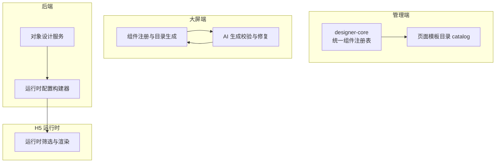
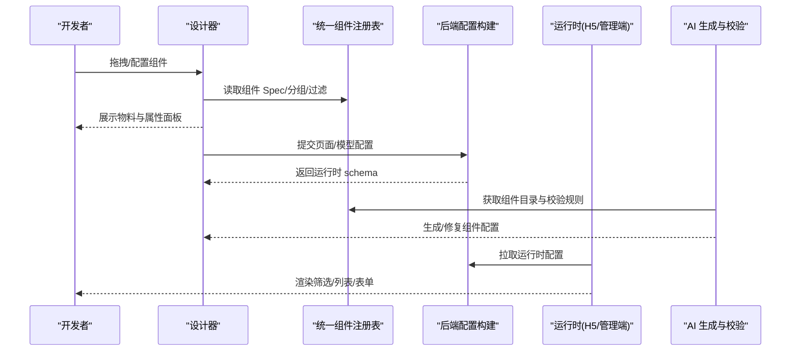
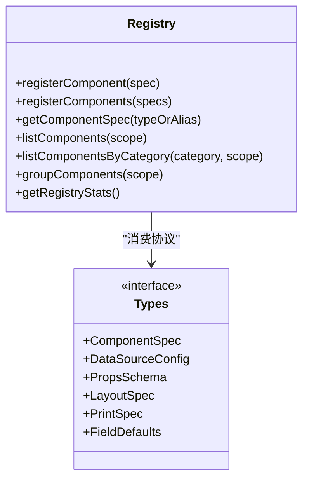
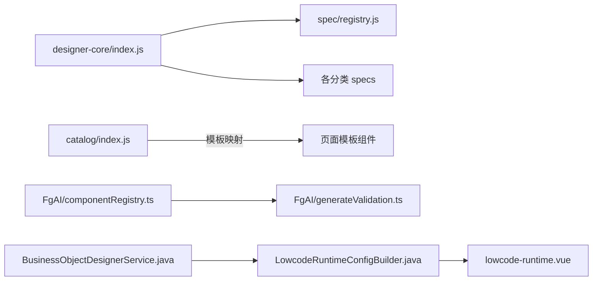

# 组件库管理

<cite>
**本文引用的文件**
- [README.md](file://README.md)
- [package.json](file://package.json)
- [index.js](file://forge-admin-ui/src/components/lowcode-builder/designer-core/index.js)
- [registry.js](file://forge-admin-ui/src/components/lowcode-builder/designer-core/spec/registry.js)
- [types.js](file://forge-admin-ui/src/components/lowcode-builder/designer-core/spec/types.js)
- [catalog/index.js](file://forge-admin-ui/src/catalog/index.js)
- [componentRegistry.ts](file://forge-report-ui/src/components/FgAI/componentRegistry.ts)
- [generateValidation.ts](file://forge-report-ui/src/components/FgAI/generateValidation.ts)
- [ProjectVersionModal.vue](file://forge-report-ui/src/components/ProjectVersionModal.vue)
- [LowcodeRuntimeConfigBuilder.java](file://forge-server/forge-framework/forge-plugin-parent/forge-plugin-generator/src/main/java/com/mdframe/forge/plugin/generator/service/lowcode/LowcodeRuntimeConfigBuilder.java)
- [BusinessObjectDesignerService.java](file://forge-server/forge-framework/forge-plugin-parent/forge-plugin-generator/src/main/java/com/mdframe/forge/plugin/generator/service/businessapp/BusinessObjectDesignerService.java)
- [lowcode-runtime.vue](file://forge-h5-ui/src/pages/lowcode-runtime.vue)
</cite>

## 目录
1. [简介](#简介)
2. [项目结构](#项目结构)
3. [核心组件](#核心组件)
4. [架构总览](#架构总览)
5. [详细组件分析](#详细组件分析)
6. [依赖关系分析](#依赖关系分析)
7. [性能与可扩展性](#性能与可扩展性)
8. [故障排查指南](#故障排查指南)
9. [结论](#结论)
10. [附录：规范、工具与最佳实践](#附录：规范工具与最佳实践)

## 简介
本技术文档围绕低代码组件库管理，系统阐述组件库的架构设计、分类管理、版本控制与依赖解析；解释内置组件库结构、第三方组件集成方式、组件包格式与发布流程；并覆盖组件搜索过滤、预览能力、使用统计与质量评估。同时给出组件库开发规范、管理工具与最佳实践，帮助团队在统一注册表与协议下高效扩展与维护组件生态。

## 项目结构
仓库采用前后端分离与多模块组织：
- 前端管理端（forge-admin-ui）提供统一组件注册表 designer-core，集中管理表单、布局、业务、页面、媒体、小部件等组件规格与分组。
- 大屏前端（forge-report-ui）维护独立的组件注册与目录生成能力，支持 AI 生成时的组件校验与数据绑定修复。
- 后端插件（forge-plugin-generator）负责将低代码模型与页面配置转换为运行时可用 schema，包括搜索区、列表列、字段映射等。
- H5 运行时（forge-h5-ui）消费运行时配置，渲染筛选条件与列表。

图表来源
- [index.js:1-67](file://forge-admin-ui/src/components/lowcode-builder/designer-core/index.js#L1-L67)
- [catalog/index.js:1-62](file://forge-admin-ui/src/catalog/index.js#L1-L62)
- [componentRegistry.ts:170-237](file://forge-report-ui/src/components/FgAI/componentRegistry.ts#L170-L237)
- [generateValidation.ts:402-487](file://forge-report-ui/src/components/FgAI/generateValidation.ts#L402-L487)
- [LowcodeRuntimeConfigBuilder.java:89-1438](file://forge-server/forge-framework/forge-plugin-parent/forge-plugin-generator/src/main/java/com/mdframe/forge/plugin/generator/service/lowcode/LowcodeRuntimeConfigBuilder.java#L89-L1438)
- [BusinessObjectDesignerService.java:3046-3065](file://forge-server/forge-framework/forge-plugin-parent/forge-plugin-generator/src/main/java/com/mdframe/forge/plugin/generator/service/businessapp/BusinessObjectDesignerService.java#L3046-L3065)
- [lowcode-runtime.vue:25-40](file://forge-h5-ui/src/pages/lowcode-runtime.vue#L25-L40)

章节来源
- [README.md:68-259](file://README.md#L68-L259)
- [package.json:1-10](file://package.json#L1-L10)

## 核心组件
- 统一组件注册表（designer-core）
  - 职责：集中管理 100+ 组件的 ComponentSpec，提供注册、查询、别名解析、按 scope/category/group 过滤、分组、统计等 API。
  - 关键能力：首次导入自动注册全部组件；支持别名兼容旧类型；提供容器插槽、拖拽协议、节点工厂与树操作工具。
- 页面模板目录（catalog）
  - 职责：将 templateKey 映射到懒加载的 Vue 组件，用于应用中心模板选择与渲染。
- 大屏组件注册与目录生成
  - 职责：聚合各包组件描述，生成可被 AI 使用的目录文本，并提供 key 查找与可用 key 列表。
- AI 生成校验与修复
  - 职责：对 AI 生成的组件响应进行合法性校验，补齐布局尺寸、数据集绑定、静态回退等，输出修复摘要。
- 后端运行时配置构建
  - 职责：根据模型与页面配置构建搜索区、列表列、字段映射等运行时 schema，确保渲染一致性与查询语义正确。
- H5 运行时筛选
  - 职责：消费运行时配置，渲染筛选面板与查询动作。

章节来源
- [index.js:1-126](file://forge-admin-ui/src/components/lowcode-builder/designer-core/index.js#L1-L126)
- [registry.js:1-169](file://forge-admin-ui/src/components/lowcode-builder/designer-core/spec/registry.js#L1-L169)
- [types.js:1-120](file://forge-admin-ui/src/components/lowcode-builder/designer-core/spec/types.js#L1-L120)
- [catalog/index.js:1-62](file://forge-admin-ui/src/catalog/index.js#L1-L62)
- [componentRegistry.ts:170-237](file://forge-report-ui/src/components/FgAI/componentRegistry.ts#L170-L237)
- [generateValidation.ts:402-487](file://forge-report-ui/src/components/FgAI/generateValidation.ts#L402-L487)
- [LowcodeRuntimeConfigBuilder.java:89-1438](file://forge-server/forge-framework/forge-plugin-parent/forge-plugin-generator/src/main/java/com/mdframe/forge/plugin/generator/service/lowcode/LowcodeRuntimeConfigBuilder.java#L89-L1438)
- [BusinessObjectDesignerService.java:3046-3065](file://forge-server/forge-framework/forge-plugin-parent/forge-plugin-generator/src/main/java/com/mdframe/forge/plugin/generator/service/businessapp/BusinessObjectDesignerService.java#L3046-L3065)
- [lowcode-runtime.vue:25-40](file://forge-h5-ui/src/pages/lowcode-runtime.vue#L25-L40)

## 架构总览
低代码组件库以“统一协议 + 注册表”为核心，贯穿设计器、运行时与 AI 生成链路：
- 设计期：统一注册表提供组件元数据、分组与过滤，支撑表单/列表/页面设计器的物料面板与属性面板。
- 生成期：后端将模型与页面配置转为运行时 schema，保证字段、查询、布局的一致性。
- 运行期：H5/管理端运行时消费 schema 渲染界面；大屏侧通过组件注册与校验保障 AI 生成产物可用性。
- 版本与发布：大屏端提供版本历史与回滚能力；应用发布前执行依赖检查与自动补齐。

图表来源
- [index.js:1-67](file://forge-admin-ui/src/components/lowcode-builder/designer-core/index.js#L1-L67)
- [registry.js:1-169](file://forge-admin-ui/src/components/lowcode-builder/designer-core/spec/registry.js#L1-L169)
- [LowcodeRuntimeConfigBuilder.java:89-1438](file://forge-server/forge-framework/forge-plugin-parent/forge-plugin-generator/src/main/java/com/mdframe/forge/plugin/generator/service/lowcode/LowcodeRuntimeConfigBuilder.java#L89-L1438)
- [generateValidation.ts:402-487](file://forge-report-ui/src/components/FgAI/generateValidation.ts#L402-L487)
- [lowcode-runtime.vue:25-40](file://forge-h5-ui/src/pages/lowcode-runtime.vue#L25-L40)

## 详细组件分析

### 统一组件注册表（designer-core）
- 设计要点
  - 单一事实源：所有组件 spec 集中在注册表，避免分散定义导致不一致。
  - 别名兼容：保留历史 type 别名，平滑迁移。
  - 多维过滤：支持按 scope（F/L/F+L）、category（field/layout/business/page/media/widget）、group 过滤。
  - 统计与诊断：提供注册表统计，便于监控组件规模与健康度。
- 数据结构复杂度
  - 注册表 Map 存取 O(1)，过滤为 O(n)，分组为 O(n)。
  - 树操作与节点工厂提供常用 DOM/Schema 树变换能力。
- 依赖链
  - index.js 聚合各分类 specs 并在导入时批量注册。
  - registry.js 暴露注册、查询、过滤、分组、统计 API。
  - types.js 定义统一协议，约束 spec 字段与类型。

图表来源
- [registry.js:1-169](file://forge-admin-ui/src/components/lowcode-builder/designer-core/spec/registry.js#L1-L169)
- [types.js:1-120](file://forge-admin-ui/src/components/lowcode-builder/designer-core/spec/types.js#L1-L120)

章节来源
- [index.js:1-126](file://forge-admin-ui/src/components/lowcode-builder/designer-core/index.js#L1-L126)
- [registry.js:1-169](file://forge-admin-ui/src/components/lowcode-builder/designer-core/spec/registry.js#L1-L169)
- [types.js:1-120](file://forge-admin-ui/src/components/lowcode-builder/designer-core/spec/types.js#L1-L120)

### 页面模板目录（catalog）
- 职责：将 templateKey 映射到懒加载的 Vue 组件，提供模板列表与降级策略。
- 扩展点：新增模板需在对应目录创建组件并在此注册，同时在后端模板表中补充元数据。

章节来源
- [catalog/index.js:1-62](file://forge-admin-ui/src/catalog/index.js#L1-L62)

### 大屏组件注册与目录生成
- 职责：聚合多个包的组件描述，缓存注册表，导出目录文本供 AI 参考，并提供 key 查找与可用 key 列表。
- 关键点：按包分类输出目录，附带默认宽高与描述，便于 AI 生成更准确的布局与内容。

章节来源
- [componentRegistry.ts:170-237](file://forge-report-ui/src/components/FgAI/componentRegistry.ts#L170-L237)

### AI 生成校验与修复
- 职责：对 AI 生成的组件响应进行校验，识别未知组件、数据集绑定问题，自动修复布局尺寸与数据源，输出修复摘要。
- 关键点：结合组件注册表与数据集上下文，确保生成产物可直接落地。

章节来源
- [generateValidation.ts:402-487](file://forge-report-ui/src/components/FgAI/generateValidation.ts#L402-L487)

### 后端运行时配置构建
- 职责：根据模型与页面配置构建搜索区、列表列、字段映射等运行时 schema，确保查询语义与渲染一致性。
- 关键点：
  - 搜索区字段推导与对齐处理。
  - 列表列字段可见性与排序。
  - 查询类型与组件类型的匹配。

章节来源
- [LowcodeRuntimeConfigBuilder.java:89-1438](file://forge-server/forge-framework/forge-plugin-parent/forge-plugin-generator/src/main/java/com/mdframe/forge/plugin/generator/service/lowcode/LowcodeRuntimeConfigBuilder.java#L89-L1438)
- [BusinessObjectDesignerService.java:3046-3065](file://forge-server/forge-framework/forge-plugin-parent/forge-plugin-generator/src/main/java/com/mdframe/forge/plugin/generator/service/businessapp/BusinessObjectDesignerService.java#L3046-L3065)

### H5 运行时筛选
- 职责：消费运行时配置，渲染筛选面板与查询动作，支持展开/收起与重置。
- 关键点：与后端构建的搜索 schema 保持一致，确保查询行为稳定。

章节来源
- [lowcode-runtime.vue:25-40](file://forge-h5-ui/src/pages/lowcode-runtime.vue#L25-L40)

## 依赖关系分析
- 组件注册表与分类
  - 统一入口 index.js 聚合 field/layout/business/page/media/widget/zone-action 等分类 specs，并在导入时批量注册。
  - registry.js 提供注册、查询、过滤、分组、统计等 API，是设计器与运行时的共同依赖。
- 大屏组件与 AI 校验
  - componentRegistry.ts 聚合包级组件描述，generateValidation.ts 基于注册表进行校验与修复。
- 后端与运行时
  - LowcodeRuntimeConfigBuilder.java 与 BusinessObjectDesignerService.java 将设计期配置转化为运行时 schema。
  - lowcode-runtime.vue 消费运行时 schema 渲染筛选与列表。

图表来源
- [index.js:1-67](file://forge-admin-ui/src/components/lowcode-builder/designer-core/index.js#L1-L67)
- [registry.js:1-169](file://forge-admin-ui/src/components/lowcode-builder/designer-core/spec/registry.js#L1-L169)
- [catalog/index.js:1-62](file://forge-admin-ui/src/catalog/index.js#L1-L62)
- [componentRegistry.ts:170-237](file://forge-report-ui/src/components/FgAI/componentRegistry.ts#L170-L237)
- [generateValidation.ts:402-487](file://forge-report-ui/src/components/FgAI/generateValidation.ts#L402-L487)
- [LowcodeRuntimeConfigBuilder.java:89-1438](file://forge-server/forge-framework/forge-plugin-parent/forge-plugin-generator/src/main/java/com/mdframe/forge/plugin/generator/service/lowcode/LowcodeRuntimeConfigBuilder.java#L89-L1438)
- [BusinessObjectDesignerService.java:3046-3065](file://forge-server/forge-framework/forge-plugin-parent/forge-plugin-generator/src/main/java/com/mdframe/forge/plugin/generator/service/businessapp/BusinessObjectDesignerService.java#L3046-L3065)
- [lowcode-runtime.vue:25-40](file://forge-h5-ui/src/pages/lowcode-runtime.vue#L25-L40)

章节来源
- [index.js:1-126](file://forge-admin-ui/src/components/lowcode-builder/designer-core/index.js#L1-L126)
- [registry.js:1-169](file://forge-admin-ui/src/components/lowcode-builder/designer-core/spec/registry.js#L1-L169)
- [componentRegistry.ts:170-237](file://forge-report-ui/src/components/FgAI/componentRegistry.ts#L170-L237)
- [generateValidation.ts:402-487](file://forge-report-ui/src/components/FgAI/generateValidation.ts#L402-L487)
- [LowcodeRuntimeConfigBuilder.java:89-1438](file://forge-server/forge-framework/forge-plugin-parent/forge-plugin-generator/src/main/java/com/mdframe/forge/plugin/generator/service/lowcode/LowcodeRuntimeConfigBuilder.java#L89-L1438)
- [BusinessObjectDesignerService.java:3046-3065](file://forge-server/forge-framework/forge-plugin-parent/forge-plugin-generator/src/main/java/com/mdframe/forge/plugin/generator/service/businessapp/BusinessObjectDesignerService.java#L3046-L3065)
- [lowcode-runtime.vue:25-40](file://forge-h5-ui/src/pages/lowcode-runtime.vue#L25-L40)

## 性能与可扩展性
- 注册表性能
  - 注册与查询为 O(1)，过滤与分组为 O(n)，适合百级组件规模。
  - 建议按需导入分类 specs，减少首屏体积。
- 懒加载与缓存
  - 模板组件与大屏组件均支持懒加载与缓存，降低初始加载成本。
- 可扩展点
  - 新增组件：在对应分类 specs 中声明 ComponentSpec，并通过 registerComponents 注册。
  - 新增模板：在 catalog 中注册模板键与懒加载组件，并在后端模板表补充元数据。
  - 新增包组件：在大屏端按包聚合组件描述，更新目录生成逻辑。

[本节为通用指导，不直接分析具体文件]

## 故障排查指南
- 组件未找到或重复注册
  - 现象：控制台警告重复注册或找不到组件。
  - 排查：检查是否重复注册同一 type；确认别名映射是否正确；使用 getRegistryStats 查看注册表规模。
- AI 生成组件无效
  - 现象：AI 生成的大屏包含未知组件或数据集绑定失败。
  - 排查：使用 generateValidation 的输出定位问题；确认组件 key 是否在注册表中；检查数据集上下文与绑定修复结果。
- 运行时筛选不生效
  - 现象：H5 筛选无效果或字段不显示。
  - 排查：核对后端构建的搜索 schema 字段与查询类型；确认运行时渲染逻辑与 schema 一致。
- 发布检查失败
  - 现象：应用发布前依赖检查报错或缺失依赖。
  - 排查：查看依赖消息提示，按提示补齐对象、数据库、入口、流程、扩展与权限依赖后重试。

章节来源
- [registry.js:1-169](file://forge-admin-ui/src/components/lowcode-builder/designer-core/spec/registry.js#L1-L169)
- [generateValidation.ts:402-487](file://forge-report-ui/src/components/FgAI/generateValidation.ts#L402-L487)
- [lowcode-runtime.vue:25-40](file://forge-h5-ui/src/pages/lowcode-runtime.vue#L25-L40)

## 结论
本项目通过统一组件协议与注册表实现了跨设计器、运行时与 AI 生成的一致性与可维护性。配合后端运行时配置构建与前端校验修复，形成了从设计到发布的完整闭环。建议在团队内遵循统一协议与规范，持续完善组件目录、质量评估与版本管理，以提升交付效率与稳定性。

[本节为总结性内容，不直接分析具体文件]

## 附录：规范、工具与最佳实践
- 组件开发规范
  - 每个组件必须声明 ComponentSpec，包含 type、scope、category、group、label、desc、layout、container、accept、propsSchema、dataSources、print、fieldDefaults、meta 等必要字段。
  - 新增组件需加入对应分类 specs，并通过 registerComponents 注册；如需兼容旧类型，添加 aliases。
  - 容器组件需明确 accept 与 maxDepth，避免非法嵌套。
- 组件搜索与过滤
  - 使用 listComponentsByCategory 与 groupComponents 实现分类与分组展示。
  - 在设计器中按 scope 过滤，确保表单/列表/页面各自看到合适的组件集。
- 预览与验证
  - 大屏侧通过 componentRegistry 生成目录文本，供 AI 参考；使用 generateValidation 对生成结果进行校验与修复。
  - 管理端可使用 getRegistryStats 监控组件规模与健康度。
- 版本控制与发布
  - 大屏端提供版本历史与回滚能力，便于迭代与应急恢复。
  - 应用发布前执行依赖检查，自动补齐缺失依赖后再发布。
- 工具与脚本
  - 使用 pnpm 管理前端依赖与脚本；根 package.json 提供脚手架命令入口。
  - 后端通过 Maven 多模块构建，插件化扩展能力。

章节来源
- [types.js:1-120](file://forge-admin-ui/src/components/lowcode-builder/designer-core/spec/types.js#L1-L120)
- [registry.js:1-169](file://forge-admin-ui/src/components/lowcode-builder/designer-core/spec/registry.js#L1-L169)
- [componentRegistry.ts:170-237](file://forge-report-ui/src/components/FgAI/componentRegistry.ts#L170-L237)
- [generateValidation.ts:402-487](file://forge-report-ui/src/components/FgAI/generateValidation.ts#L402-L487)
- [ProjectVersionModal.vue:56-101](file://forge-report-ui/src/components/ProjectVersionModal.vue#L56-L101)
- [package.json:1-10](file://package.json#L1-L10)