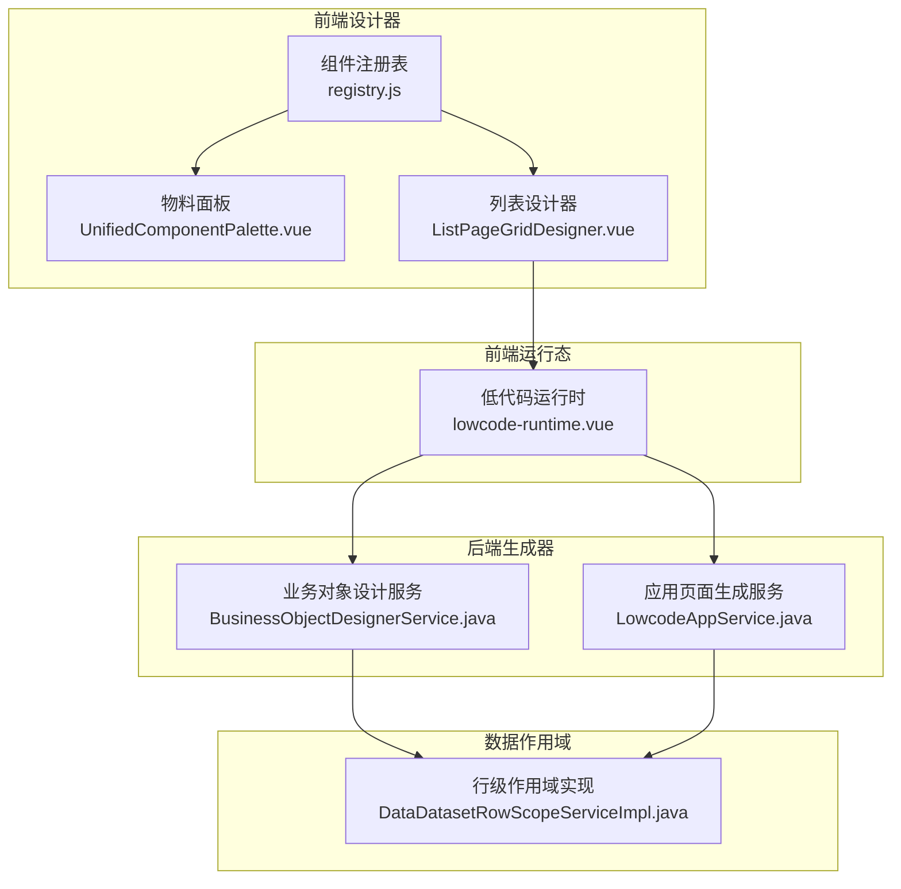
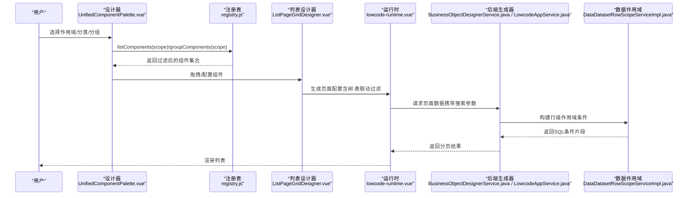
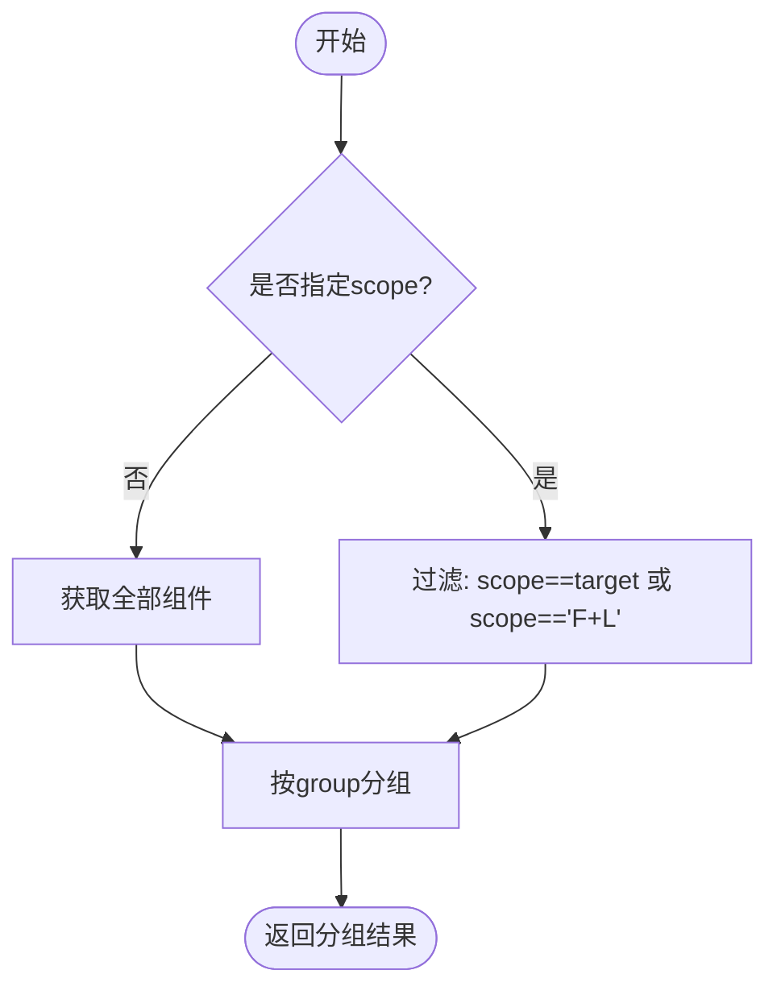
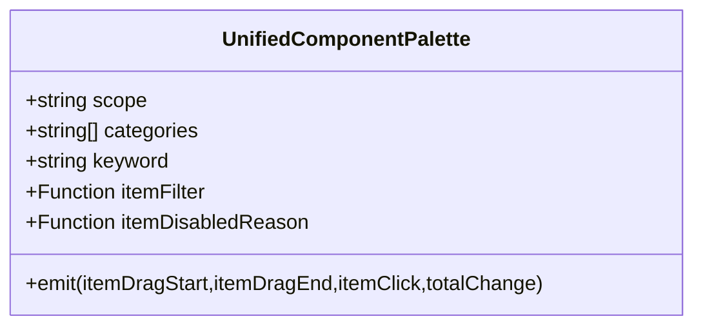
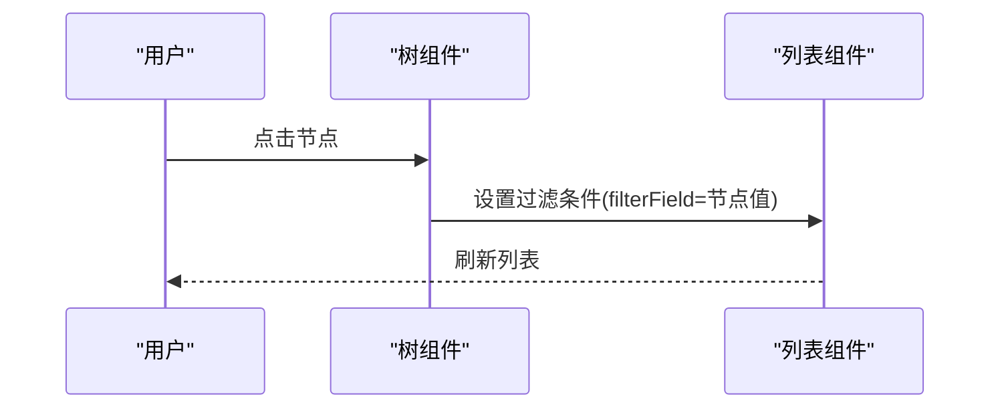
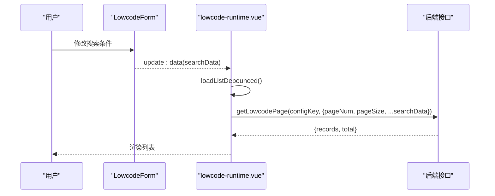
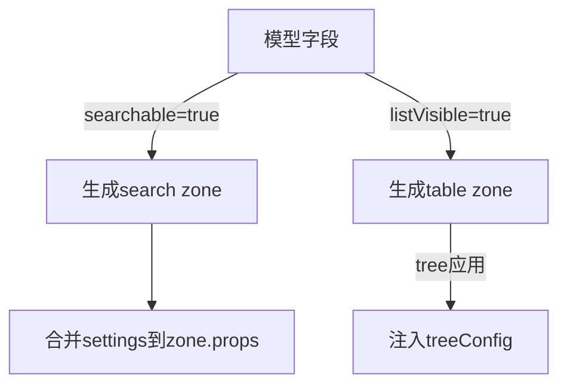
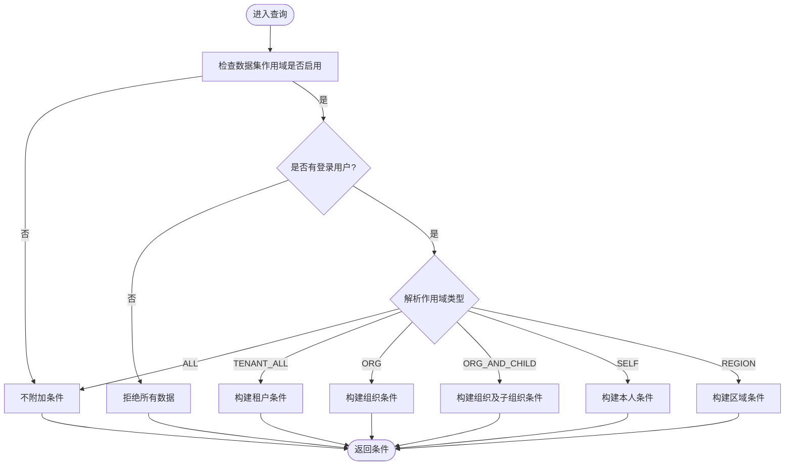
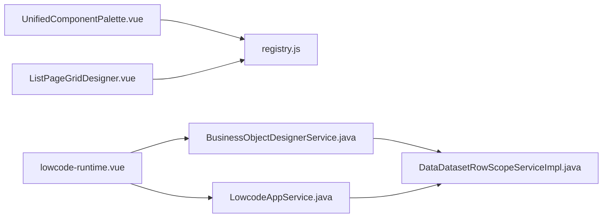

# 组件作用域与过滤

<cite>
**本文引用的文件**
- [registry.js](file://forge-admin-ui/src/components/lowcode-builder/designer-core/spec/registry.js)
- [UnifiedComponentPalette.vue](file://forge-admin-ui/src/components/lowcode-builder/designer-core/panel/UnifiedComponentPalette.vue)
- [ListPageGridDesigner.vue](file://forge-admin-ui/src/components/lowcode-builder/page/ListPageGridDesigner.vue)
- [lowcode-runtime.vue](file://forge-h5-ui/src/pages/lowcode-runtime.vue)
- [BusinessObjectDesignerService.java](file://forge-server/forge-framework/forge-plugin-parent/forge-plugin-generator/src/main/java/com/mdframe/forge/plugin/generator/service/businessapp/BusinessObjectDesignerService.java)
- [LowcodeAppService.java](file://forge-server/forge-framework/forge-plugin-parent/forge-plugin-generator/src/main/java/com/mdframe/forge/plugin/generator/service/lowcode/LowcodeAppService.java)
- [DataDatasetRowScopeServiceImpl.java](file://forge-server/forge-framework/forge-plugin-parent/forge-plugin-data/src/main/java/com/mdframe/forge/plugin/data/service/impl/DataDatasetRowScopeServiceImpl.java)
</cite>

## 目录
1. [简介](#简介)
2. [项目结构](#项目结构)
3. [核心组件](#核心组件)
4. [架构总览](#架构总览)
5. [详细组件分析](#详细组件分析)
6. [依赖关系分析](#依赖关系分析)
7. [性能考虑](#性能考虑)
8. [故障排查指南](#故障排查指南)
9. [结论](#结论)
10. [附录](#附录)

## 简介
本技术文档聚焦“组件作用域与过滤机制”，围绕 F（表单）、L（列表）、F+L（通用）三类作用域的设计原理与应用场景，系统阐述：
- 组件注册表与作用域过滤算法
- 分组策略与查询优化
- 按类别筛选、按作用域过滤、组合查询的实现方式
- 运行时搜索条件构建与数据行级作用域控制
- 配置示例、性能优化建议与扩展开发指南

## 项目结构
本项目在前后端协同实现“组件作用域与过滤”能力：
- 前端设计器侧通过统一组件注册表提供按 scope/category/group 的过滤与分组能力，并在列表页中支持树节点联动过滤。
- 前端运行态（H5）将搜索表单与列表查询绑定，支持展开/收起、重置与防抖查询。
- 后端生成器在服务端根据模型字段与配置自动生成搜索区与表格列，并注入树形列表的默认树配置。
- 数据行级作用域在服务端基于数据集配置与登录用户上下文动态拼接 SQL 条件，实现多租户、组织、本人等范围的数据隔离。

**图表来源**
- [registry.js:85-125](file://forge-admin-ui/src/components/lowcode-builder/designer-core/spec/registry.js#L85-L125)
- [UnifiedComponentPalette.vue:55-86](file://forge-admin-ui/src/components/lowcode-builder/designer-core/panel/UnifiedComponentPalette.vue#L55-L86)
- [ListPageGridDesigner.vue:2307-2318](file://forge-admin-ui/src/components/lowcode-builder/page/ListPageGridDesigner.vue#L2307-L2318)
- [lowcode-runtime.vue:25-40](file://forge-h5-ui/src/pages/lowcode-runtime.vue#L25-L40)
- [BusinessObjectDesignerService.java:3046-3065](file://forge-server/forge-framework/forge-plugin-parent/forge-plugin-generator/src/main/java/com/mdframe/forge/plugin/generator/service/businessapp/BusinessObjectDesignerService.java#L3046-L3065)
- [LowcodeAppService.java:162-183](file://forge-server/forge-framework/forge-plugin-parent/forge-plugin-generator/src/main/java/com/mdframe/forge/plugin/generator/service/lowcode/LowcodeAppService.java#L162-L183)
- [DataDatasetRowScopeServiceImpl.java:58-83](file://forge-server/forge-framework/forge-plugin-parent/forge-plugin-data/src/main/java/com/mdframe/forge/plugin/data/service/impl/DataDatasetRowScopeServiceImpl.java#L58-L83)

**章节来源**
- [registry.js:85-125](file://forge-admin-ui/src/components/lowcode-builder/designer-core/spec/registry.js#L85-L125)
- [UnifiedComponentPalette.vue:55-86](file://forge-admin-ui/src/components/lowcode-builder/designer-core/panel/UnifiedComponentPalette.vue#L55-L86)
- [ListPageGridDesigner.vue:2307-2318](file://forge-admin-ui/src/components/lowcode-builder/page/ListPageGridDesigner.vue#L2307-L2318)
- [lowcode-runtime.vue:25-40](file://forge-h5-ui/src/pages/lowcode-runtime.vue#L25-L40)
- [BusinessObjectDesignerService.java:3046-3065](file://forge-server/forge-framework/forge-plugin-parent/forge-plugin-generator/src/main/java/com/mdframe/forge/plugin/generator/service/businessapp/BusinessObjectDesignerService.java#L3046-L3065)
- [LowcodeAppService.java:162-183](file://forge-server/forge-framework/forge-plugin-parent/forge-plugin-generator/src/main/java/com/mdframe/forge/plugin/generator/service/lowcode/LowcodeAppService.java#L162-L183)
- [DataDatasetRowScopeServiceImpl.java:58-83](file://forge-server/forge-framework/forge-plugin-parent/forge-plugin-data/src/main/java/com/mdframe/forge/plugin/data/service/impl/DataDatasetRowScopeServiceImpl.java#L58-L83)

## 核心组件
- 组件注册表与过滤
  - 提供 listComponents(scope)、listComponentsByCategory(category, scope)、groupComponents(scope) 等 API，支持 F、L、F+L 三种作用域过滤与按 group 分组。
  - 支持 category 维度（field/layout/business/page/media/widget）与 scope 维度的组合过滤。
- 物料面板与分组展示
  - 物料面板接收 scope、categories、keyword、itemFilter 等属性，按 group 顺序渲染，支持接入方自定义过滤与禁用原因。
- 列表页树-表联动过滤
  - 列表设计器支持配置“右表过滤字段”，点击树节点时自动为右侧列表追加“过滤字段 = 节点目标字段值”的条件。
- 运行时搜索表单
  - 低代码运行时将 searchFields 与 searchData 绑定到 LowcodeForm，支持展开/收起、重置与查询；查询参数以分页形式提交。
- 服务端搜索区生成
  - 后端根据模型字段 searchable 标志生成 search zone，并将字段映射为 search-form 的 fieldRefs 与 settings。
- 行级数据作用域
  - 根据数据集的行级作用域配置与当前登录用户上下文，动态生成 SQL 条件，支持全量、租户、组织、组织及子组织、本人、区域等范围。

**章节来源**
- [registry.js:85-125](file://forge-admin-ui/src/components/lowcode-builder/designer-core/spec/registry.js#L85-L125)
- [UnifiedComponentPalette.vue:55-86](file://forge-admin-ui/src/components/lowcode-builder/designer-core/panel/UnifiedComponentPalette.vue#L55-L86)
- [ListPageGridDesigner.vue:2307-2318](file://forge-admin-ui/src/components/lowcode-builder/page/ListPageGridDesigner.vue#L2307-L2318)
- [lowcode-runtime.vue:25-40](file://forge-h5-ui/src/pages/lowcode-runtime.vue#L25-L40)
- [BusinessObjectDesignerService.java:3046-3065](file://forge-server/forge-framework/forge-plugin-parent/forge-plugin-generator/src/main/java/com/mdframe/forge/plugin/generator/service/businessapp/BusinessObjectDesignerService.java#L3046-L3065)
- [DataDatasetRowScopeServiceImpl.java:58-83](file://forge-server/forge-framework/forge-plugin-parent/forge-plugin-data/src/main/java/com/mdframe/forge/plugin/data/service/impl/DataDatasetRowScopeServiceImpl.java#L58-L83)

## 架构总览
下图展示了从设计期到运行期的完整链路：设计器通过注册表过滤出可用组件；列表设计器配置树-表联动过滤；运行时将搜索表单与列表查询串联；后端生成搜索区与表格列；数据访问层注入行级作用域条件。

**图表来源**
- [UnifiedComponentPalette.vue:55-86](file://forge-admin-ui/src/components/lowcode-builder/designer-core/panel/UnifiedComponentPalette.vue#L55-L86)
- [registry.js:85-125](file://forge-admin-ui/src/components/lowcode-builder/designer-core/spec/registry.js#L85-L125)
- [ListPageGridDesigner.vue:2307-2318](file://forge-admin-ui/src/components/lowcode-builder/page/ListPageGridDesigner.vue#L2307-L2318)
- [lowcode-runtime.vue:25-40](file://forge-h5-ui/src/pages/lowcode-runtime.vue#L25-L40)
- [BusinessObjectDesignerService.java:3046-3065](file://forge-server/forge-framework/forge-plugin-parent/forge-plugin-generator/src/main/java/com/mdframe/forge/plugin/generator/service/businessapp/BusinessObjectDesignerService.java#L3046-L3065)
- [LowcodeAppService.java:162-183](file://forge-server/forge-framework/forge-plugin-parent/forge-plugin-generator/src/main/java/com/mdframe/forge/plugin/generator/service/lowcode/LowcodeAppService.java#L162-L183)
- [DataDatasetRowScopeServiceImpl.java:58-83](file://forge-server/forge-framework/forge-plugin-parent/forge-plugin-data/src/main/java/com/mdframe/forge/plugin/data/service/impl/DataDatasetRowScopeServiceImpl.java#L58-L83)

## 详细组件分析

### 组件注册表与作用域过滤
- 作用域定义
  - F：仅表单设计器可见
  - L：仅列表设计器可见
  - F+L：表单与列表均可见
- 过滤算法
  - listComponents(scope)：返回 scope 匹配或 scope 为 F+L 的组件集合
  - listComponentsByCategory(category, scope)：先按 category 过滤，再按 scope 过滤
  - groupComponents(scope)：按 spec.group 分组，支持可选 scope 过滤
- 复杂度
  - 过滤与分组均为 O(n)，n 为已注册组件数量
- 优化点
  - 对高频 scope/category 可缓存分组结果
  - 使用 Map/Set 加速去重与查找

**图表来源**
- [registry.js:85-125](file://forge-admin-ui/src/components/lowcode-builder/designer-core/spec/registry.js#L85-L125)

**章节来源**
- [registry.js:85-125](file://forge-admin-ui/src/components/lowcode-builder/designer-core/spec/registry.js#L85-L125)

### 物料面板与分组展示
- 输入属性
  - scope：'F' | 'L' | 'ALL'
  - categories：显示的分类数组
  - keyword：搜索关键字
  - itemFilter：spec => boolean，接入方可自定义过滤
  - itemDisabledReason：spec => string，返回禁用原因文案
- 分组顺序
  - 内置 GROUP_ORDER 定义分组展示顺序，如布局、输入、选择、业务、数据、操作、页面、导航、内容、媒体、高级
- 交互
  - 支持拖拽、点击、总数变更事件

**图表来源**
- [UnifiedComponentPalette.vue:55-86](file://forge-admin-ui/src/components/lowcode-builder/designer-core/panel/UnifiedComponentPalette.vue#L55-L86)

**章节来源**
- [UnifiedComponentPalette.vue:55-86](file://forge-admin-ui/src/components/lowcode-builder/designer-core/panel/UnifiedComponentPalette.vue#L55-L86)

### 列表页树-表联动过滤
- 配置项
  - filterField：右表过滤字段
  - targetField/keyField：节点的目标字段或主键字段
- 行为
  - 点击树节点时，为右侧列表追加“filterField = 节点的 targetField/keyField”的过滤条件
- 适用场景
  - 主从关联、分类-明细、部门-员工等层级数据浏览

**图表来源**
- [ListPageGridDesigner.vue:2307-2318](file://forge-admin-ui/src/components/lowcode-builder/page/ListPageGridDesigner.vue#L2307-L2318)

**章节来源**
- [ListPageGridDesigner.vue:2307-2318](file://forge-admin-ui/src/components/lowcode-builder/page/ListPageGridDesigner.vue#L2307-L2318)

### 运行时搜索表单与查询
- 搜索区
  - searchFields：由页面配置决定
  - searchData：当前搜索条件
  - 支持展开/收起、重置、查询按钮
- 查询流程
  - 防抖触发 loadListDebounced，重置页码后调用 loadList
  - 将 searchData 作为查询参数提交至后端接口
- 字典加载
  - 收集 dictSelect/pillSelect 的 dictType，批量加载字典选项

**图表来源**
- [lowcode-runtime.vue:25-40](file://forge-h5-ui/src/pages/lowcode-runtime.vue#L25-L40)
- [lowcode-runtime.vue:480-496](file://forge-h5-ui/src/pages/lowcode-runtime.vue#L480-L496)

**章节来源**
- [lowcode-runtime.vue:25-40](file://forge-h5-ui/src/pages/lowcode-runtime.vue#L25-L40)
- [lowcode-runtime.vue:480-496](file://forge-h5-ui/src/pages/lowcode-runtime.vue#L480-L496)

### 服务端搜索区生成与默认配置
- 搜索区生成
  - 根据模型字段的 searchable 标志，生成 search zone，并映射为 search-form 的 fieldRefs
  - 将 settings 合并入 zone.props，支持对齐、组件类型等设置
- 列表列生成
  - 根据 listVisible 标志生成 table zone 的列
- 树形应用默认配置
  - 当 appType 为 TREE 时，注入 treeConfig（keyField、parentField、labelField、childrenField、treeTitle、loadMode）

**图表来源**
- [BusinessObjectDesignerService.java:3046-3065](file://forge-server/forge-framework/forge-plugin-parent/forge-plugin-generator/src/main/java/com/mdframe/forge/plugin/generator/service/businessapp/BusinessObjectDesignerService.java#L3046-L3065)
- [LowcodeAppService.java:162-183](file://forge-server/forge-framework/forge-plugin-parent/forge-plugin-generator/src/main/java/com/mdframe/forge/plugin/generator/service/lowcode/LowcodeAppService.java#L162-L183)

**章节来源**
- [BusinessObjectDesignerService.java:3046-3065](file://forge-server/forge-framework/forge-plugin-parent/forge-plugin-generator/src/main/java/com/mdframe/forge/plugin/generator/service/businessapp/BusinessObjectDesignerService.java#L3046-L3065)
- [LowcodeAppService.java:162-183](file://forge-server/forge-framework/forge-plugin-parent/forge-plugin-generator/src/main/java/com/mdframe/forge/plugin/generator/service/lowcode/LowcodeAppService.java#L162-L183)

### 数据行级作用域
- 作用域类型
  - ALL、TENANT_ALL、ORG、ORG_AND_CHILD、SELF、REGION 等
- 决策流程
  - 若未启用或管理员/全量范围，则不附加条件
  - 否则根据登录用户上下文与数据集配置，生成 IN/等于等 SQL 条件
- 安全边界
  - 未登录或无用户上下文时拒绝所有数据

**图表来源**
- [DataDatasetRowScopeServiceImpl.java:58-83](file://forge-server/forge-framework/forge-plugin-parent/forge-plugin-data/src/main/java/com/mdframe/forge/plugin/data/service/impl/DataDatasetRowScopeServiceImpl.java#L58-L83)

**章节来源**
- [DataDatasetRowScopeServiceImpl.java:58-83](file://forge-server/forge-framework/forge-plugin-parent/forge-plugin-data/src/main/java/com/mdframe/forge/plugin/data/service/impl/DataDatasetRowScopeServiceImpl.java#L58-L83)

## 依赖关系分析
- 设计器依赖注册表
  - 物料面板与列表设计器依赖 registry.js 提供的过滤与分组能力
- 运行时依赖页面配置
  - lowcode-runtime.vue 依赖页面配置中的 searchFields、mainFields、children 等
- 后端依赖模型与配置
  - BusinessObjectDesignerService.java 与 LowcodeAppService.java 依赖模型字段标志与页面配置生成 search/table zones
- 数据访问依赖作用域配置
  - DataDatasetRowScopeServiceImpl.java 依赖数据集作用域配置与登录用户上下文

**图表来源**
- [registry.js:85-125](file://forge-admin-ui/src/components/lowcode-builder/designer-core/spec/registry.js#L85-L125)
- [UnifiedComponentPalette.vue:55-86](file://forge-admin-ui/src/components/lowcode-builder/designer-core/panel/UnifiedComponentPalette.vue#L55-L86)
- [ListPageGridDesigner.vue:2307-2318](file://forge-admin-ui/src/components/lowcode-builder/page/ListPageGridDesigner.vue#L2307-L2318)
- [lowcode-runtime.vue:25-40](file://forge-h5-ui/src/pages/lowcode-runtime.vue#L25-L40)
- [BusinessObjectDesignerService.java:3046-3065](file://forge-server/forge-framework/forge-plugin-parent/forge-plugin-generator/src/main/java/com/mdframe/forge/plugin/generator/service/businessapp/BusinessObjectDesignerService.java#L3046-L3065)
- [LowcodeAppService.java:162-183](file://forge-server/forge-framework/forge-plugin-parent/forge-plugin-generator/src/main/java/com/mdframe/forge/plugin/generator/service/lowcode/LowcodeAppService.java#L162-L183)
- [DataDatasetRowScopeServiceImpl.java:58-83](file://forge-server/forge-framework/forge-plugin-parent/forge-plugin-data/src/main/java/com/mdframe/forge/plugin/data/service/impl/DataDatasetRowScopeServiceImpl.java#L58-L83)

**章节来源**
- [registry.js:85-125](file://forge-admin-ui/src/components/lowcode-builder/designer-core/spec/registry.js#L85-L125)
- [UnifiedComponentPalette.vue:55-86](file://forge-admin-ui/src/components/lowcode-builder/designer-core/panel/UnifiedComponentPalette.vue#L55-L86)
- [ListPageGridDesigner.vue:2307-2318](file://forge-admin-ui/src/components/lowcode-builder/page/ListPageGridDesigner.vue#L2307-L2318)
- [lowcode-runtime.vue:25-40](file://forge-h5-ui/src/pages/lowcode-runtime.vue#L25-L40)
- [BusinessObjectDesignerService.java:3046-3065](file://forge-server/forge-framework/forge-plugin-parent/forge-plugin-generator/src/main/java/com/mdframe/forge/plugin/generator/service/businessapp/BusinessObjectDesignerService.java#L3046-L3065)
- [LowcodeAppService.java:162-183](file://forge-server/forge-framework/forge-plugin-parent/forge-plugin-generator/src/main/java/com/mdframe/forge/plugin/generator/service/lowcode/LowcodeAppService.java#L162-L183)
- [DataDatasetRowScopeServiceImpl.java:58-83](file://forge-server/forge-framework/forge-plugin-parent/forge-plugin-data/src/main/java/com/mdframe/forge/plugin/data/service/impl/DataDatasetRowScopeServiceImpl.java#L58-L83)

## 性能考虑
- 前端过滤与分组
  - 使用 O(n) 过滤与分组，建议在 scope/category 固定时缓存分组结果
  - 物料面板支持 itemFilter 与 itemDisabledReason，避免重复计算
- 运行时搜索
  - 使用防抖减少频繁查询，合理设置 debounce 时间
  - 分页查询降低单次数据量
- 后端生成
  - 仅对 searchable/listVisible 字段生成对应区域，减少冗余配置
  - 树应用默认注入 treeConfig，避免运行时额外计算
- 数据作用域
  - 仅在启用且非管理员/全量范围时附加条件，减少不必要的 SQL 拼接
  - 组织及子组织范围需预取组织树 ID 集合，注意索引与缓存

[本节为通用性能建议，无需特定文件引用]

## 故障排查指南
- 组件不可见
  - 检查 scope 是否正确（F/L/F+L），确认 category 与 group 配置
  - 查看注册表统计信息，确认组件已注册且唯一
- 搜索无效
  - 确认 searchFields 与 searchData 绑定正确
  - 检查后端生成的 search zone 字段映射与 settings
- 树-表联动异常
  - 核对 filterField、targetField/keyField 配置是否与模型字段一致
- 数据权限问题
  - 检查数据集行级作用域是否启用
  - 确认登录用户上下文与角色权限，必要时调整作用域类型

**章节来源**
- [registry.js:147-160](file://forge-admin-ui/src/components/lowcode-builder/designer-core/spec/registry.js#L147-L160)
- [BusinessObjectDesignerService.java:3046-3065](file://forge-server/forge-framework/forge-plugin-parent/forge-plugin-generator/src/main/java/com/mdframe/forge/plugin/generator/service/businessapp/BusinessObjectDesignerService.java#L3046-L3065)
- [DataDatasetRowScopeServiceImpl.java:58-83](file://forge-server/forge-framework/forge-plugin-parent/forge-plugin-data/src/main/java/com/mdframe/forge/plugin/data/service/impl/DataDatasetRowScopeServiceImpl.java#L58-L83)

## 结论
本方案通过统一的组件注册表与作用域过滤机制，实现了表单、列表与通用组件的灵活复用；结合运行时搜索与服务端生成，构建了端到端的查询体验；并通过行级数据作用域保障数据安全。该体系具备良好的可扩展性与性能表现，适合在多租户、多组织的复杂场景中落地。

[本节为总结性内容，无需特定文件引用]

## 附录
- 作用域配置示例
  - 组件 spec.scope：'F' | 'L' | 'F+L'
  - 物料面板 scope：'F' | 'L' | 'ALL'
  - 列表设计器 filterField/targetField/keyField
  - 运行时 searchFields/searchData
  - 后端 searchable/listVisible 标志
  - 数据集行级作用域类型：ALL/TENANT_ALL/ORG/ORG_AND_CHILD/SELF/REGION
- 扩展开发指南
  - 新增组件：在注册表中声明 type、category、group、scope、aliases
  - 自定义过滤：在物料面板传入 itemFilter/itemDisabledReason
  - 新增作用域：在后端 DataDatasetRowScopeServiceImpl 中扩展分支逻辑
  - 优化查询：在前端增加防抖与分页，在后端确保索引与条件精简

[本节为补充说明，无需特定文件引用]