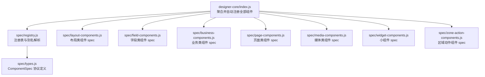
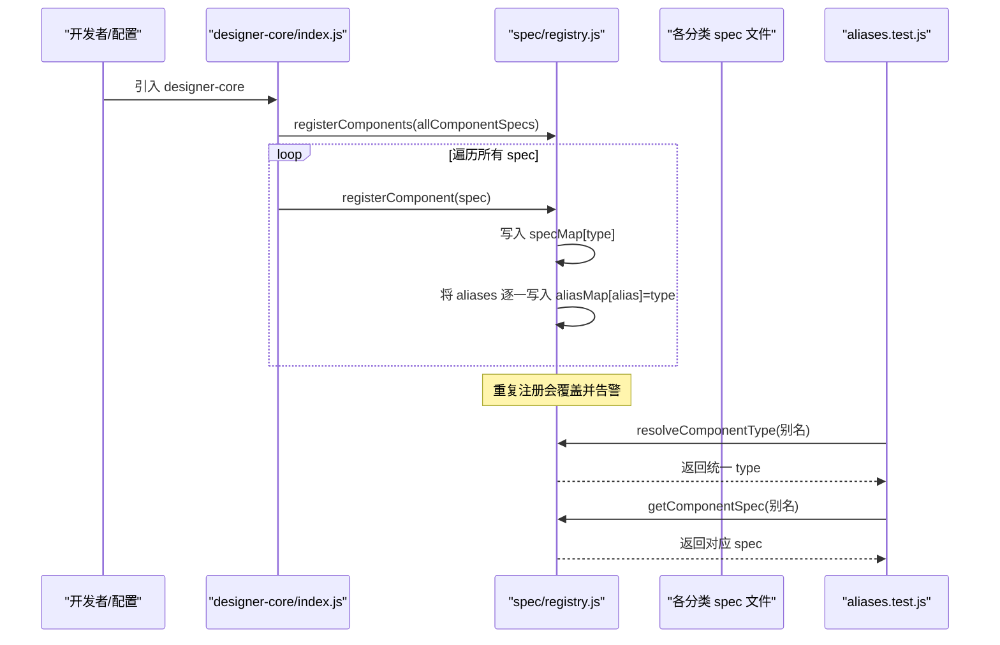
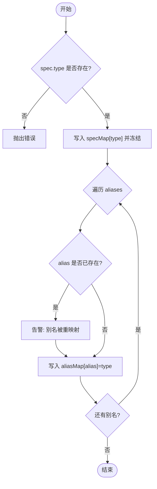
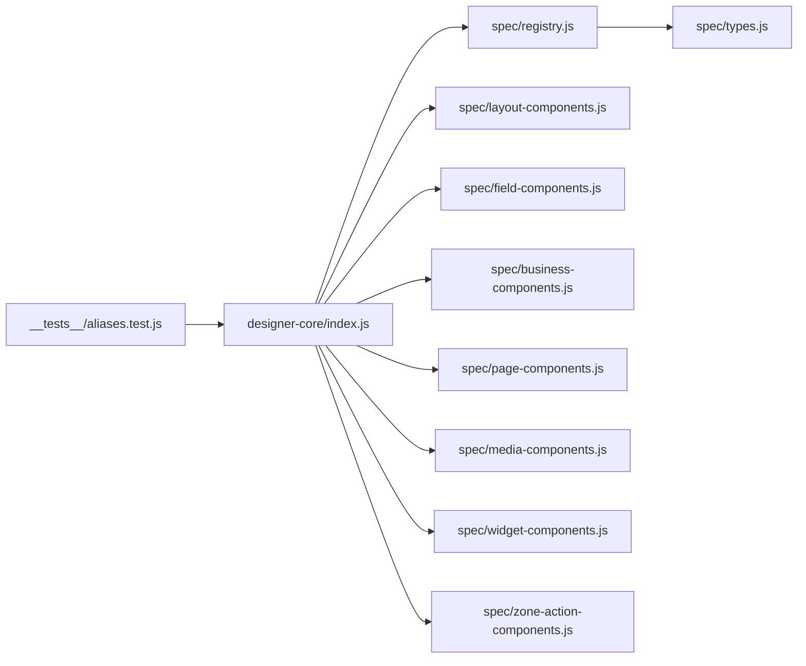

# 组件别名解析机制

<cite>
**本文引用的文件**
- [registry.js](file://forge-admin-ui/src/components/lowcode-builder/designer-core/spec/registry.js)
- [types.js](file://forge-admin-ui/src/components/lowcode-builder/designer-core/spec/types.js)
- [index.js](file://forge-admin-ui/src/components/lowcode-builder/designer-core/index.js)
- [layout-components.js](file://forge-admin-ui/src/components/lowcode-builder/designer-core/spec/layout-components.js)
- [field-components.js](file://forge-admin-ui/src/components/lowcode-builder/designer-core/spec/field-components.js)
- [aliases.test.js](file://forge-admin-ui/src/components/lowcode-builder/designer-core/__tests__/aliases.test.js)
</cite>

## 目录
1. [简介](#简介)
2. [项目结构](#项目结构)
3. [核心组件](#核心组件)
4. [架构总览](#架构总览)
5. [详细组件分析](#详细组件分析)
6. [依赖关系分析](#依赖关系分析)
7. [性能考量](#性能考量)
8. [故障排查指南](#故障排查指南)
9. [结论](#结论)
10. [附录](#附录)

## 简介
本技术文档围绕低代码设计器中的“组件别名解析机制”展开，系统性说明别名映射表的设计原理、解析算法与运行时行为，覆盖类型别名、版本兼容性与向后兼容策略；阐述别名冲突检测、优先级规则与错误处理；并给出别名注册流程、动态更新与验证机制。文末提供配置示例、迁移指南与常见问题排查方法，帮助读者在复杂演进中安全地维护统一组件体系。

## 项目结构
该机制位于前端低代码设计器核心模块中，采用“集中注册 + 多分类 spec + 统一导出入口”的组织方式：
- 统一注册表：负责维护 type → spec 与 alias → type 的双向映射，并提供查询、解析、统计等 API。
- 组件规格定义：按类别（字段、布局、业务、页面、媒体、小组件、区域动作）拆分，每个 spec 声明 type、aliases、scope、category、group、propsSchema、容器能力等元信息。
- 统一导出入口：聚合所有组件 spec，并在首次导入时自动完成批量注册，对外暴露解析与查询接口。

图表来源
- [index.js:56-67](file://forge-admin-ui/src/components/lowcode-builder/designer-core/index.js#L56-L67)
- [registry.js:7-11](file://forge-admin-ui/src/components/lowcode-builder/designer-core/spec/registry.js#L7-L11)
- [types.js:98-119](file://forge-admin-ui/src/components/lowcode-builder/designer-core/spec/types.js#L98-L119)

章节来源
- [index.js:1-126](file://forge-admin-ui/src/components/lowcode-builder/designer-core/index.js#L1-L126)
- [registry.js:1-169](file://forge-admin-ui/src/components/lowcode-builder/designer-core/spec/registry.js#L1-L169)
- [types.js:1-120](file://forge-admin-ui/src/components/lowcode-builder/designer-core/spec/types.js#L1-L120)

## 核心组件
- 统一注册表（registry.js）
  - 维护两个核心 Map：
    - specMap：type → ComponentSpec
    - aliasMap：alias → type
  - 提供注册、查询、解析、统计、清空等 API。
- 组件规格协议（types.js）
  - 定义 ComponentSpec 的完整字段，包括 type、aliases、scope、category、group、propsSchema、容器能力、数据源支持、打印配置、字段默认值、meta 等。
- 统一导出入口（index.js）
  - 汇总各分类 spec 列表，首次 import 时调用批量注册，确保全局可用。

关键职责与边界
- 注册阶段：校验必填字段、冻结 spec、写入 specMap、构建 aliasMap。
- 解析阶段：优先命中 specMap，其次通过 aliasMap 解析为统一 type，最后回退输入本身。
- 查询阶段：支持按 scope/category/group 过滤，支持获取别名映射与统计信息。

章节来源
- [registry.js:17-41](file://forge-admin-ui/src/components/lowcode-builder/designer-core/spec/registry.js#L17-L41)
- [registry.js:48-75](file://forge-admin-ui/src/components/lowcode-builder/designer-core/spec/registry.js#L48-L75)
- [registry.js:147-168](file://forge-admin-ui/src/components/lowcode-builder/designer-core/spec/registry.js#L147-L168)
- [types.js:98-119](file://forge-admin-ui/src/components/lowcode-builder/designer-core/spec/types.js#L98-L119)
- [index.js:56-67](file://forge-admin-ui/src/components/lowcode-builder/designer-core/index.js#L56-L67)

## 架构总览
下图展示从“组件 spec 定义”到“别名解析”的端到端流程，以及测试对行为契约的约束。

图表来源
- [index.js:56-67](file://forge-admin-ui/src/components/lowcode-builder/designer-core/index.js#L56-L67)
- [registry.js:17-41](file://forge-admin-ui/src/components/lowcode-builder/designer-core/spec/registry.js#L17-L41)
- [aliases.test.js:10-113](file://forge-admin-ui/src/components/lowcode-builder/designer-core/__tests__/aliases.test.js#L10-L113)

## 详细组件分析

### 别名映射表设计与解析算法
- 数据结构
  - specMap：以统一 type 为键，存储不可变（Object.freeze）的 ComponentSpec。
  - aliasMap：以历史或兼容别名为键，映射到统一 type。
- 注册流程
  - 校验 spec.type 必填，否则抛出错误。
  - 若 type 已存在，记录警告并覆盖。
  - 将 spec 深拷贝后冻结写入 specMap。
  - 遍历 spec.aliases，逐个写入 aliasMap；若别名已被其他 type 占用，记录警告并重新映射。
- 解析流程
  - resolveComponentType：先查 specMap，再查 aliasMap，最后回退原输入。
  - getComponentSpec：先查 specMap，再通过 aliasMap 解析 type 后取 spec。
  - hasComponent：同时检查 specMap 与 aliasMap。
- 冲突检测与优先级
  - 同一别名多次注册时，后注册的覆盖前者，并通过控制台告警提示重映射。
  - 同名 type 重复注册会覆盖并告警。
- 错误处理
  - 缺少 type 直接抛错。
  - 重复注册使用 console.warn 提示，避免中断启动。

图表来源
- [registry.js:17-31](file://forge-admin-ui/src/components/lowcode-builder/designer-core/spec/registry.js#L17-L31)

章节来源
- [registry.js:17-75](file://forge-admin-ui/src/components/lowcode-builder/designer-core/spec/registry.js#L17-L75)

### 类型别名与版本兼容性
- 类型别名
  - 布局容器：如 grid 的别名 row/fcRow/grid-layout；table 的别名 fcTable；card 的别名 elCard；tabs 的别名 elTabs；collapse 的别名 elCollapse；box 的别名 box-layout。
  - 包装节点：如 tabPane、collapseItem、col、tableCell 等具备各自的别名（例如 elTabPane、fcCol、tableGrid 等）。
  - 字段组件：如 number 的别名 inputNumber/integer/input-number/inputnumber/field-number；radioGroup→radio；checkboxGroup→checkbox；datePicker→date；textarea 的 field-textarea 等。
  - 业务组件：如 AiCrudPage 的 crud/crudBlock/aiCrudPage。
  - 辅助标题：section-divider→groupTitle；AiFormSectionTitle/FormSectionTitle/divider/elDivider→formSectionTitle。
- 版本兼容性与向后兼容
  - 通过 aliases 数组保留历史命名，使旧配置在新版本仍可解析。
  - 解析顺序保证：type 优先于 alias，避免误匹配。
  - 重复注册场景下，新定义覆盖旧映射，并以警告形式提示变更，便于审计与回归。
- 测试契约
  - 用例覆盖了常见别名到统一 type 的映射断言，确保解析稳定。

章节来源
- [layout-components.js:7-190](file://forge-admin-ui/src/components/lowcode-builder/designer-core/spec/layout-components.js#L7-L190)
- [field-components.js:12-79](file://forge-admin-ui/src/components/lowcode-builder/designer-core/spec/field-components.js#L12-L79)
- [aliases.test.js:10-113](file://forge-admin-ui/src/components/lowcode-builder/designer-core/__tests__/aliases.test.js#L10-L113)

### 别名冲突检测、优先级与错误处理
- 冲突检测
  - 当同一别名被多次注册时，后注册者覆盖前者，并输出告警日志。
  - 当同一 type 被重复注册时，也会输出告警。
- 优先级规则
  - 解析时优先匹配 specMap 中的 type，再尝试 aliasMap，最后回退原字符串。
- 错误处理
  - 缺失 type 直接抛错，阻止无效 spec 进入注册表。
  - 未知 type 查询返回 undefined，调用方需自行处理未注册情况。

章节来源
- [registry.js:17-31](file://forge-admin-ui/src/components/lowcode-builder/designer-core/spec/registry.js#L17-L31)
- [registry.js:48-75](file://forge-admin-ui/src/components/lowcode-builder/designer-core/spec/registry.js#L48-L75)

### 别名注册流程、动态更新与验证机制
- 注册流程
  - 统一入口 index.js 聚合所有分类 spec，首次 import 即调用 registerComponents 完成批量注册。
  - 单个组件可通过 registerComponent 动态追加或替换。
- 动态更新
  - 支持运行时新增或覆盖别名映射（例如插件扩展），但需注意覆盖带来的影响与告警。
- 验证机制
  - 注册前强制校验 type 必填。
  - 提供 hasComponent 用于前置校验是否存在。
  - 提供 listAllTypes/getAliasMap 用于诊断与审计。
  - 提供 clearRegistry 用于测试环境重置。

章节来源
- [index.js:56-67](file://forge-admin-ui/src/components/lowcode-builder/designer-core/index.js#L56-L67)
- [registry.js:17-41](file://forge-admin-ui/src/components/lowcode-builder/designer-core/spec/registry.js#L17-L41)
- [registry.js:68-75](file://forge-admin-ui/src/components/lowcode-builder/designer-core/spec/registry.js#L68-L75)
- [registry.js:135-168](file://forge-admin-ui/src/components/lowcode-builder/designer-core/spec/registry.js#L135-L168)

### 数据模型与协议
- ComponentSpec 关键字段
  - type：唯一标识的统一类型名。
  - aliases：兼容历史命名的别名数组。
  - scope：适用设计器范围（F/L/F+L）。
  - category：组件分类（field/layout/business/page/media/widget）。
  - group：分组名，用于画布面板组织。
  - propsSchema：属性面板 Schema，驱动编辑器生成。
  - container/maxDepth/accept：容器能力与子节点接受规则。
  - dataSources：支持的数据源类型。
  - print：打印相关配置。
  - fieldDefaults：字段类组件的数据库/业务默认值。
  - meta：额外元数据（如 unique/multiField/requireFields/onlyFor/zones 等）。

章节来源
- [types.js:98-119](file://forge-admin-ui/src/components/lowcode-builder/designer-core/spec/types.js#L98-L119)

## 依赖关系分析
- 模块耦合
  - index.js 强依赖各分类 spec 文件，负责聚合与一次性注册。
  - registry.js 不依赖具体 spec 内容，仅依赖 types.js 的类型约定。
  - 测试文件依赖 index.js 导出的解析 API，验证别名映射契约。
- 外部依赖
  - 无第三方库依赖，纯原生 Map 与对象操作，保证轻量与可预测性。

图表来源
- [index.js:56-67](file://forge-admin-ui/src/components/lowcode-builder/designer-core/index.js#L56-L67)
- [registry.js:7-11](file://forge-admin-ui/src/components/lowcode-builder/designer-core/spec/registry.js#L7-L11)
- [aliases.test.js:5-6](file://forge-admin-ui/src/components/lowcode-builder/designer-core/__tests__/aliases.test.js#L5-L6)

章节来源
- [index.js:1-126](file://forge-admin-ui/src/components/lowcode-builder/designer-core/index.js#L1-L126)
- [registry.js:1-169](file://forge-admin-ui/src/components/lowcode-builder/designer-core/spec/registry.js#L1-L169)
- [aliases.test.js:1-115](file://forge-admin-ui/src/components/lowcode-builder/designer-core/__tests__/aliases.test.js#L1-L115)

## 性能考量
- 时间复杂度
  - 注册：O(N) 遍历 spec 与 aliases。
  - 解析：O(1) Map 查找。
- 空间复杂度
  - 线性增长，与组件数量及别名数量成正比。
- 优化建议
  - 批量注册优于逐条注册，减少重复开销。
  - 避免频繁动态覆盖别名，必要时在初始化阶段完成。
  - 使用 hasComponent 进行前置校验，降低无效解析路径。

## 故障排查指南
- 常见问题
  - 别名解析失败：确认别名是否已在对应 spec 的 aliases 中声明；检查是否有重复注册导致覆盖。
  - 组件未找到：使用 hasComponent 检查是否存在；或通过 listAllTypes 核对统一 type。
  - 运行时覆盖冲突：关注控制台告警，定位重复注册位置。
- 诊断工具
  - getAliasMap：查看当前别名映射全量。
  - getRegistryStats：统计 total、byCategory、byScope、aliases 数量。
  - clearRegistry：测试环境重置注册表。
- 回归验证
  - 运行 aliases.test.js 中的用例，确保别名映射符合预期。

章节来源
- [registry.js:68-75](file://forge-admin-ui/src/components/lowcode-builder/designer-core/spec/registry.js#L68-L75)
- [registry.js:135-168](file://forge-admin-ui/src/components/lowcode-builder/designer-core/spec/registry.js#L135-L168)
- [aliases.test.js:10-113](file://forge-admin-ui/src/components/lowcode-builder/designer-core/__tests__/aliases.test.js#L10-L113)

## 结论
该别名解析机制通过“集中注册表 + 明确协议 + 严格解析顺序”，在保证向后兼容的同时，提供了清晰的冲突检测与可观测性。借助批量注册与运行时 API，系统既满足静态配置的稳定性，也支持动态扩展与演进。配合完善的测试用例与诊断工具，可在大规模组件体系下维持高可靠与易维护性。

## 附录

### 别名配置示例（基于现有 spec）
- 布局容器
  - grid：aliases 包含 row、fcRow、grid-layout
  - table：aliases 包含 fcTable
  - card：aliases 包含 elCard
  - tabs：aliases 包含 elTabs
  - collapse：aliases 包含 elCollapse
  - box：aliases 包含 box-layout
- 包装节点
  - tabPane：aliases 包含 elTabPane
  - collapseItem：aliases 包含 elCollapseItem
  - col：aliases 包含 fcCol
  - tableCell：aliases 包含 tableGrid、fcTableGrid
- 字段组件
  - number：aliases 包含 inputNumber、input-number、inputnumber、integer、field-number
  - radio：aliases 包含 radioGroup、field-radio
  - checkbox：aliases 包含 checkboxGroup
  - date：aliases 包含 datePicker
  - textarea：aliases 包含 field-textarea
- 业务组件
  - AiCrudPage：aliases 包含 crud、crudBlock、aiCrudPage
- 辅助标题
  - groupTitle：aliases 包含 section-divider
  - formSectionTitle：aliases 包含 AiFormSectionTitle、FormSectionTitle、divider、elDivider

章节来源
- [layout-components.js:7-190](file://forge-admin-ui/src/components/lowcode-builder/designer-core/spec/layout-components.js#L7-L190)
- [field-components.js:12-79](file://forge-admin-ui/src/components/lowcode-builder/designer-core/spec/field-components.js#L12-L79)
- [aliases.test.js:10-113](file://forge-admin-ui/src/components/lowcode-builder/designer-core/__tests__/aliases.test.js#L10-L113)

### 迁移指南
- 新增别名
  - 在对应 spec 的 aliases 数组中添加历史或兼容名称。
  - 确保不会与已有别名冲突；如有冲突，调整新别名或移除旧别名。
- 废弃别名
  - 逐步移除 aliases 中的旧名称，并在升级说明中标注。
  - 在过渡期保留别名，通过测试用例保障解析不变。
- 覆盖与重映射
  - 如需改变别名指向的新 type，需在注册阶段覆盖并观察告警，评估影响范围。
- 验证与回归
  - 运行 aliases.test.js 用例集，确保关键别名映射未被破坏。
  - 使用 getAliasMap 与 getRegistryStats 做发布前自检。

章节来源
- [registry.js:17-41](file://forge-admin-ui/src/components/lowcode-builder/designer-core/spec/registry.js#L17-L41)
- [aliases.test.js:10-113](file://forge-admin-ui/src/components/lowcode-builder/designer-core/__tests__/aliases.test.js#L10-L113)