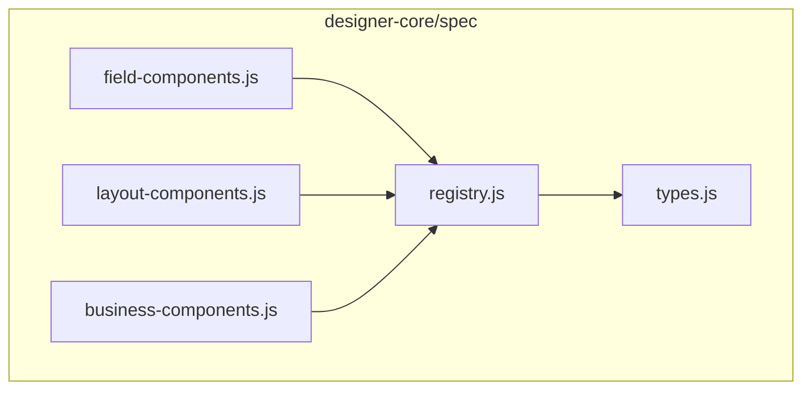
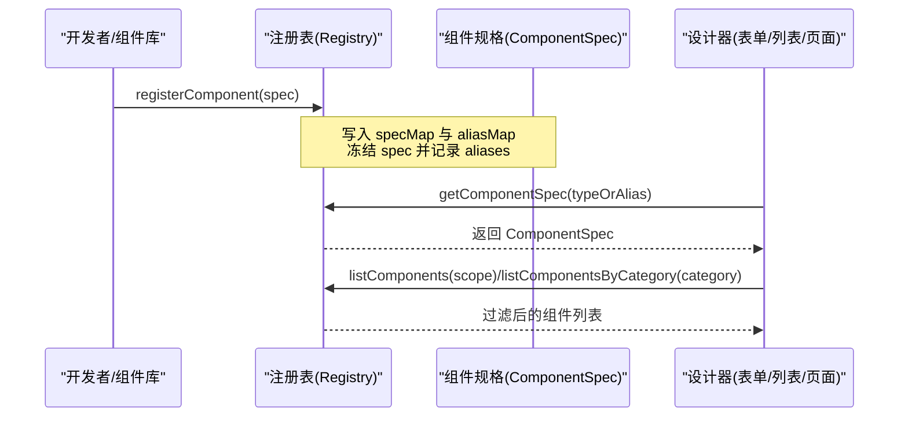
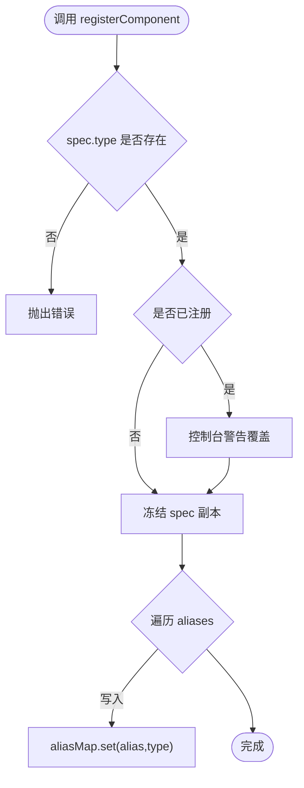
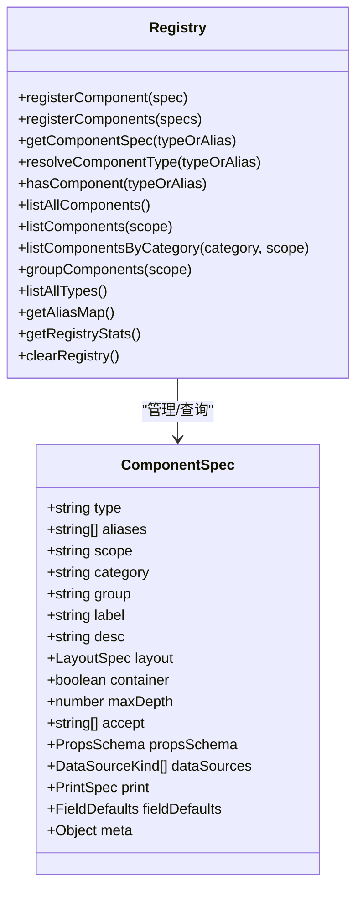
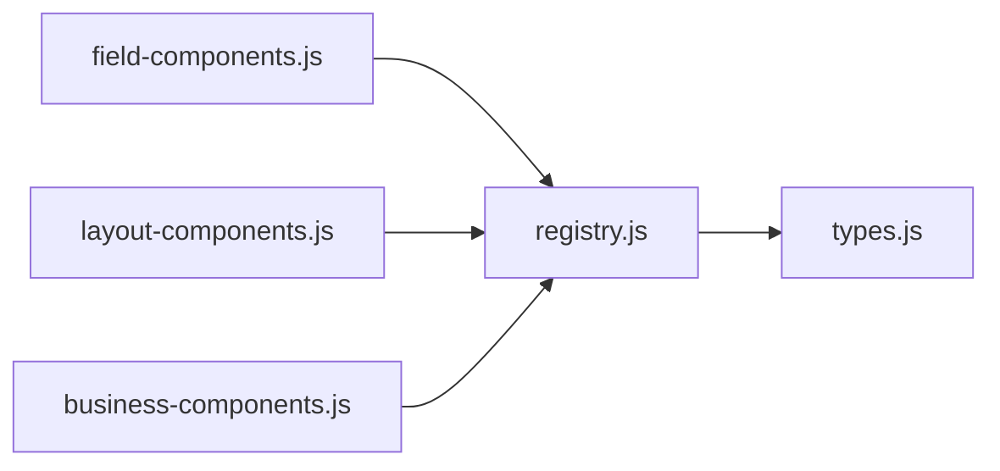

# 组件注册机制

<cite>
**本文引用的文件**
- [registry.js](file://forge-admin-ui/src/components/lowcode-builder/designer-core/spec/registry.js)
- [types.js](file://forge-admin-ui/src/components/lowcode-builder/designer-core/spec/types.js)
- [field-components.js](file://forge-admin-ui/src/components/lowcode-builder/designer-core/spec/field-components.js)
- [layout-components.js](file://forge-admin-ui/src/components/lowcode-builder/designer-core/spec/layout-components.js)
- [business-components.js](file://forge-admin-ui/src/components/lowcode-builder/designer-core/spec/business-components.js)
</cite>

## 目录
1. [简介](#简介)
2. [项目结构](#项目结构)
3. [核心组件](#核心组件)
4. [架构总览](#架构总览)
5. [详细组件分析](#详细组件分析)
6. [依赖关系分析](#依赖关系分析)
7. [性能考量](#性能考量)
8. [故障排查指南](#故障排查指南)
9. [结论](#结论)
10. [附录](#附录)

## 简介
本技术文档围绕低代码平台的“组件注册机制”展开，系统性说明统一组件注册表的设计原理、组件元数据规范、生命周期与依赖解析策略、分类管理（业务组件、布局组件、字段组件等）、版本控制与冲突处理策略，以及自定义组件注册流程、组件库集成方式与热更新机制。同时提供组件注册 API 参考、配置示例与常见问题排查方法，帮助开发者高效扩展与治理低代码组件生态。

## 项目结构
低代码设计器通过统一的组件规格协议（ComponentSpec）将表单、列表、页面等场景下的组件进行集中式注册与管理。核心位于 designer-core/spec 目录下：
- registry.js：统一组件注册表实现，提供注册、查询、别名解析、分组与统计能力。
- types.js：统一组件物料协议类型定义，涵盖数据源、属性 Schema、布局、打印、容器、字段默认值与 ComponentSpec 等。
- field-components.js：字段类组件的规格定义（输入、选择、业务三类）。
- layout-components.js：布局容器与包装节点规格定义（栅格、表格、卡片、标签页、折叠面板、盒子、分隔线、留白、间距、标题等）。
- business-components.js：业务区块规格定义（CRUD、表格、表单、子表、工具栏、详情、分步表单、签名等）。

图表来源
- [registry.js:1-169](file://forge-admin-ui/src/components/lowcode-builder/designer-core/spec/registry.js#L1-L169)
- [types.js:1-120](file://forge-admin-ui/src/components/lowcode-builder/designer-core/spec/types.js#L1-L120)
- [field-components.js:1-541](file://forge-admin-ui/src/components/lowcode-builder/designer-core/spec/field-components.js#L1-L541)
- [layout-components.js:1-407](file://forge-admin-ui/src/components/lowcode-builder/designer-core/spec/layout-components.js#L1-L407)
- [business-components.js:1-257](file://forge-admin-ui/src/components/lowcode-builder/designer-core/spec/business-components.js#L1-L257)

章节来源
- [registry.js:1-169](file://forge-admin-ui/src/components/lowcode-builder/designer-core/spec/registry.js#L1-L169)
- [types.js:1-120](file://forge-admin-ui/src/components/lowcode-builder/designer-core/spec/types.js#L1-L120)

## 核心组件
- 统一组件注册表（Registry）
  - 职责：维护组件规格 Map 与别名映射；提供注册、批量注册、查询、别名解析、存在性检查、全量/按范围/按分类/分组列出、统计与清空能力。
  - 关键 API：registerComponent、registerComponents、getComponentSpec、resolveComponentType、hasComponent、listAllComponents、listComponents、listComponentsByCategory、groupComponents、listAllTypes、getAliasMap、getRegistryStats、clearRegistry。
- 组件规格协议（ComponentSpec）
  - 职责：以声明式描述组件的类型、别名、作用域、分类、分组、展示名、描述、布局、容器能力、属性面板 Schema、数据源支持、打印行为、字段默认值与额外元数据。
  - 关键概念：scope（F/L/F+L）、category（field/layout/business/page/media/widget）、propsSchema、dataSources、print、fieldDefaults、meta。
- 组件分类与规格集合
  - 字段组件（field-components.js）：输入、选择、业务三类，覆盖 33 个字段组件，包含完整 propsSchema 与 fieldDefaults。
  - 布局组件（layout-components.js）：栅格、表格、卡片、标签页、折叠面板、盒子、分隔线、留白、间距、标题等，含容器与包装节点。
  - 业务组件（business-components.js）：CRUD、表格、表单、子表、工具栏、详情、分步表单、签名等，强调数据绑定与交互能力。

章节来源
- [registry.js:17-169](file://forge-admin-ui/src/components/lowcode-builder/designer-core/spec/registry.js#L17-L169)
- [types.js:9-120](file://forge-admin-ui/src/components/lowcode-builder/designer-core/spec/types.js#L9-L120)
- [field-components.js:1-541](file://forge-admin-ui/src/components/lowcode-builder/designer-core/spec/field-components.js#L1-L541)
- [layout-components.js:1-407](file://forge-admin-ui/src/components/lowcode-builder/designer-core/spec/layout-components.js#L1-L407)
- [business-components.js:1-257](file://forge-admin-ui/src/components/lowcode-builder/designer-core/spec/business-components.js#L1-L257)

## 架构总览
注册表作为“单一事实来源”，被表单、列表、页面等设计器共同消费。组件规格由分类文件集中声明并通过注册表聚合，运行时通过类型或别名解析到统一 type，再根据 scope/category/group 过滤渲染到对应画布。

图表来源
- [registry.js:17-107](file://forge-admin-ui/src/components/lowcode-builder/designer-core/spec/registry.js#L17-L107)
- [types.js:98-120](file://forge-admin-ui/src/components/lowcode-builder/designer-core/spec/types.js#L98-L120)

## 详细组件分析

### 组件注册表设计与实现
- 数据结构
  - specMap：type → ComponentSpec 的映射，用于快速查找与去重。
  - aliasMap：alias → type 的映射，用于兼容历史命名与多别名。
- 注册流程
  - 校验 spec.type 必填；若已存在则告警覆盖；冻结 spec 保证不可变；同步写入 aliasMap。
- 查询与解析
  - getComponentSpec：优先按 type 查找，否则解析 alias。
  - resolveComponentType：将任意 type/alias 解析为统一 type。
  - hasComponent：判断 type 或 alias 是否已注册。
- 列表与分组
  - listAllComponents/listComponents：支持按 scope 过滤（F/L/F+L）。
  - listComponentsByCategory：按 category 过滤（field/layout/business/page/media/widget），可叠加 scope。
  - groupComponents：按 group 分组返回 Map。
- 统计与清理
  - getRegistryStats：统计总数、按分类/作用域计数、别名数量。
  - clearRegistry：仅测试用，清空内部映射。

图表来源
- [registry.js:17-41](file://forge-admin-ui/src/components/lowcode-builder/designer-core/spec/registry.js#L17-L41)

章节来源
- [registry.js:17-169](file://forge-admin-ui/src/components/lowcode-builder/designer-core/spec/registry.js#L17-L169)

### 组件元数据规范（ComponentSpec）
- 基础信息
  - type：唯一标识；aliases：兼容别名数组；label/desc：展示文案。
- 作用域与分类
  - scope：F（表单）、L（列表）、F+L（两者均可）。
  - category：field/layout/business/page/media/widget。
  - group：UI 分组（如“输入/选择/业务/布局/数据/操作/页面/媒体/导航/内容”）。
- 布局与容器
  - layout：defaultSpan/minSpan/maxSpan。
  - container：是否为容器；maxDepth：最大嵌套深度；accept：允许的子组件类型。
- 属性面板
  - propsSchema：properties 与 required，支持 string/number/boolean/select/color/json/code/customEditor/section 等编辑器类型。
- 数据源与打印
  - dataSources：支持的 DataSourceKind（static/dict/managed/remote/context/relation/builtin）。
  - print：hidden/breakAvoid 控制打印行为。
- 字段默认值
  - fieldDefaults：fieldType/businessFieldType/dataType/componentType/length/precision/queryType，用于生成数据库列与默认渲染器。
- 扩展元数据
  - meta：unique/multiField/requireFields/onlyFor/zones 等，用于约束与上下文适配。

章节来源
- [types.js:9-120](file://forge-admin-ui/src/components/lowcode-builder/designer-core/spec/types.js#L9-L120)

### 组件分类与典型规格
- 字段组件（field-components.js）
  - 输入类：input、textarea、number、money、slider、rate、color、barcodeScanner。
  - 选择类：select、dictSelect、radio/radioButton、checkbox、transfer、cascader、treeSelect、customSelect、date/datetime/daterange/datetimerange/month/year/timerange、switch。
  - 业务类：userSelect、orgTreeSelect、regionTreeSelect、objectReference、recordSelector、fileUpload、imageUpload、text。
  - 特点：每个组件均定义 propsSchema、dataSources、print、fieldDefaults，便于自动生成表单与后端字段。
- 布局组件（layout-components.js）
  - 容器：grid、table、card、tabs、collapse、box、space。
  - 装饰：divider、spacer、groupTitle、formSectionTitle。
  - 包装节点：tabPane、collapseItem、col、tableCell。
  - 特点：container=true 且 accept 限制子组件类型，配合 maxDepth 控制嵌套层级。
- 业务组件（business-components.js）
  - CRUD 一体化：AiCrudPage（唯一实例约束 unique:true）。
  - 数据展示：AiTable、dataTable、detailInfo、treePanel。
  - 表单与交互：AiForm、stepForm、signature-pad。
  - 工具与关联：toolbar、subTable、sub-table-tabs。
  - 特点：强数据绑定（managed/remote/relation/context），复杂 propsSchema 与自定义编辑器。

章节来源
- [field-components.js:1-541](file://forge-admin-ui/src/components/lowcode-builder/designer-core/spec/field-components.js#L1-L541)
- [layout-components.js:1-407](file://forge-admin-ui/src/components/lowcode-builder/designer-core/spec/layout-components.js#L1-L407)
- [business-components.js:1-257](file://forge-admin-ui/src/components/lowcode-builder/designer-core/spec/business-components.js#L1-L257)

### 组件生命周期管理与依赖解析
- 生命周期阶段
  - 注册期：组件规格进入 specMap/aliasMap，完成别名映射与冻结。
  - 发现期：设计器通过 listComponents/listComponentsByCategory/groupComponents 获取可用组件。
  - 解析期：getComponentSpec/resolveComponentType 将 type/alias 解析为统一 type。
  - 渲染期：根据 propsSchema 生成属性面板，根据 dataSources 注入数据源，根据 print/layout/container 控制渲染与打印。
- 依赖解析策略
  - 数据源依赖：dataSources 声明支持的 DataSourceKind，运行时按需加载静态/字典/远程/上下文/关系/内置数据源。
  - 容器依赖：container + accept 限制子组件类型，maxDepth 限制嵌套深度，避免非法树形结构。
  - 元数据依赖：meta.unique 约束实例唯一性；meta.requireFields/multiField 驱动字段集校验；meta.onlyFor 限定使用场景。

图表来源
- [registry.js:17-169](file://forge-admin-ui/src/components/lowcode-builder/designer-core/spec/registry.js#L17-L169)
- [types.js:98-120](file://forge-admin-ui/src/components/lowcode-builder/designer-core/spec/types.js#L98-L120)

章节来源
- [registry.js:17-169](file://forge-admin-ui/src/components/lowcode-builder/designer-core/spec/registry.js#L17-L169)
- [types.js:9-120](file://forge-admin-ui/src/components/lowcode-builder/designer-core/spec/types.js#L9-L120)

### 组件分类管理（业务组件、布局组件、字段组件等）
- 分类维度
  - category：field/layout/business/page/media/widget，用于 UI 分组与权限控制。
  - scope：F/L/F+L，决定组件在哪些设计器中可见。
  - group：更细粒度的 UI 分组（如“输入/选择/业务/布局/数据/操作/页面/媒体/导航/内容”）。
- 过滤与分组
  - listComponents(scope)：按作用域过滤。
  - listComponentsByCategory(category, scope)：按分类与作用域双重过滤。
  - groupComponents(scope)：按 group 分组返回 Map，便于侧边栏组织。

章节来源
- [registry.js:86-125](file://forge-admin-ui/src/components/lowcode-builder/designer-core/spec/registry.js#L86-L125)
- [types.js:100-118](file://forge-admin-ui/src/components/lowcode-builder/designer-core/spec/types.js#L100-L118)

### 组件版本控制与冲突处理策略
- 版本控制
  - 当前注册表未内建版本字段；建议通过外部包管理器（pnpm/npm）或模块打包版本控制组件库版本。
  - 可在 meta 中扩展 version 字段，供上层工具链进行兼容性校验。
- 冲突处理
  - 同名 type 重复注册会触发控制台警告并覆盖旧条目，确保最终一致性。
  - 别名冲突时，aliasMap 会被重新映射到新 type，并在控制台提示重映射。
  - 建议在开发环境开启严格模式，避免意外覆盖。

章节来源
- [registry.js:17-31](file://forge-admin-ui/src/components/lowcode-builder/designer-core/spec/registry.js#L17-L31)

### 自定义组件注册流程
- 步骤
  - 定义 ComponentSpec：遵循 types.js 协议，填写 type、scope、category、group、propsSchema、dataSources、print、fieldDefaults、meta 等。
  - 注册组件：调用 registerComponent 或 registerComponents 将规格加入注册表。
  - 验证与调试：使用 hasComponent/getComponentSpec/listComponentsByCategory 验证注册结果；使用 getRegistryStats 查看统计。
- 最佳实践
  - 保持 type 唯一，合理使用 aliases 兼容历史命名。
  - 明确 scope 与 category，避免在错误设计器中暴露组件。
  - 合理设置 container/accept/maxDepth，防止非法嵌套。
  - 为字段组件完善 fieldDefaults，减少运行时推断成本。

章节来源
- [registry.js:17-41](file://forge-admin-ui/src/components/lowcode-builder/designer-core/spec/registry.js#L17-L41)
- [types.js:9-120](file://forge-admin-ui/src/components/lowcode-builder/designer-core/spec/types.js#L9-L120)

### 组件库集成方式
- 模块化拆分：将不同类别的组件规格放入独立文件（如 field-components.js、layout-components.js、business-components.js），便于维护与按需引入。
- 统一入口：通过 registry.js 暴露注册与查询 API，设计器只依赖注册表，不直接耦合具体组件文件。
- 动态扩展：支持在运行时批量注册新组件，便于插件化与第三方库集成。

章节来源
- [registry.js:1-169](file://forge-admin-ui/src/components/lowcode-builder/designer-core/spec/registry.js#L1-L169)
- [field-components.js:1-541](file://forge-admin-ui/src/components/lowcode-builder/designer-core/spec/field-components.js#L1-L541)
- [layout-components.js:1-407](file://forge-admin-ui/src/components/lowcode-builder/designer-core/spec/layout-components.js#L1-L407)
- [business-components.js:1-257](file://forge-admin-ui/src/components/lowcode-builder/designer-core/spec/business-components.js#L1-L257)

### 组件热更新机制
- 当前实现
  - 注册表基于内存 Map，支持 clearRegistry 清空后重新注册，适合测试与开发环境的热替换。
- 生产建议
  - 结合模块热替换（HMR）与增量更新策略，仅在变更时刷新受影响组件。
  - 在热更新前后执行完整性校验（如 hasComponent/getComponentSpec），确保状态一致。

章节来源
- [registry.js:162-169](file://forge-admin-ui/src/components/lowcode-builder/designer-core/spec/registry.js#L162-L169)

## 依赖关系分析
- 组件规格文件对注册表的依赖
  - field-components.js、layout-components.js、business-components.js 通过导出组件规格集合，供上层统一注册。
- 注册表对类型定义的依赖
  - registry.js 依赖 types.js 中的 ComponentSpec、PropsSchema、DataSourceKind 等类型，保证类型安全与一致性。
- 设计器对注册表的依赖
  - 设计器通过 getComponentSpec/listComponentsByCategory/groupComponents 获取组件并进行渲染与编辑。

图表来源
- [registry.js:1-169](file://forge-admin-ui/src/components/lowcode-builder/designer-core/spec/registry.js#L1-L169)
- [types.js:1-120](file://forge-admin-ui/src/components/lowcode-builder/designer-core/spec/types.js#L1-L120)
- [field-components.js:1-541](file://forge-admin-ui/src/components/lowcode-builder/designer-core/spec/field-components.js#L1-L541)
- [layout-components.js:1-407](file://forge-admin-ui/src/components/lowcode-builder/designer-core/spec/layout-components.js#L1-L407)
- [business-components.js:1-257](file://forge-admin-ui/src/components/lowcode-builder/designer-core/spec/business-components.js#L1-L257)

章节来源
- [registry.js:1-169](file://forge-admin-ui/src/components/lowcode-builder/designer-core/spec/registry.js#L1-L169)
- [types.js:1-120](file://forge-admin-ui/src/components/lowcode-builder/designer-core/spec/types.js#L1-L120)

## 性能考量
- 时间复杂度
  - 注册：O(1) 写入 specMap/aliasMap。
  - 查询：O(1) 查找 specMap/aliasMap。
  - 列表与分组：O(n) 遍历所有组件，n 为已注册组件数。
- 空间复杂度
  - 存储所有组件规格与别名映射，线性增长。
- 优化建议
  - 按需引入：仅注册当前设计器需要的组件，减少内存占用。
  - 缓存分组结果：对频繁使用的 groupComponents 结果进行短期缓存。
  - 避免重复注册：在开发阶段检测重复 type/alias，降低覆盖风险。

[本节为通用性能讨论，无需特定文件引用]

## 故障排查指南
- 常见问题
  - 组件未显示：检查 scope 是否与当前设计器匹配；确认 category/group 是否正确；使用 listComponentsByCategory 验证。
  - 别名解析失败：确认 aliases 是否包含目标名称；使用 getAliasMap 查看映射；使用 resolveComponentType 调试解析结果。
  - 重复注册告警：出现覆盖警告时，检查是否有多个组件库定义了相同 type；必要时调整 type 命名空间。
  - 容器嵌套非法：检查 container/accept/maxDepth 配置；确保子组件类型在 accept 列表中。
  - 数据源未生效：核对 dataSources 是否包含所需 DataSourceKind；确认运行时数据源已正确注入。
- 诊断工具
  - getRegistryStats：查看总数、按分类/作用域计数、别名数量。
  - hasComponent/getComponentSpec：快速定位组件是否存在及规格是否正确。
  - clearRegistry：测试环境下重置注册表，排除污染问题。

章节来源
- [registry.js:43-169](file://forge-admin-ui/src/components/lowcode-builder/designer-core/spec/registry.js#L43-L169)

## 结论
该低代码平台的组件注册机制以统一规格协议为核心，通过集中式注册表实现组件的发现、解析、过滤与分组，支撑表单、列表、页面等多场景设计器复用同一份组件资产。其设计具备高内聚、低耦合、可扩展的特点，配合别名兼容、容器约束、数据源声明与元数据扩展，能够满足复杂业务场景下的组件治理需求。未来可在版本控制、热更新与性能优化方面进一步增强，以提升开发与运维体验。

[本节为总结性内容，无需特定文件引用]

## 附录

### 组件注册 API 参考
- registerComponent(spec)
  - 功能：注册单个组件规格。
  - 参数：ComponentSpec。
  - 行为：校验 type、处理重复注册告警、写入 specMap/aliasMap、冻结 spec。
- registerComponents(specs)
  - 功能：批量注册组件规格。
  - 参数：ComponentSpec[]。
- getComponentSpec(typeOrAlias)
  - 功能：按 type 或 alias 获取组件规格。
  - 返回：ComponentSpec | undefined。
- resolveComponentType(typeOrAlias)
  - 功能：将 type/alias 解析为统一 type。
  - 返回：string。
- hasComponent(typeOrAlias)
  - 功能：检查 type 或 alias 是否已注册。
  - 返回：boolean。
- listAllComponents()
  - 功能：获取全部已注册组件（按注册顺序）。
  - 返回：ComponentSpec[]。
- listComponents(scope)
  - 功能：按 scope 过滤组件列表。
  - 参数：'F' | 'L' | 'F+L'。
  - 返回：ComponentSpec[]。
- listComponentsByCategory(category, scope)
  - 功能：按 category 与可选 scope 过滤组件列表。
  - 参数：'field' | 'layout' | 'business' | 'page' | 'media' | 'widget'，scope。
  - 返回：ComponentSpec[]。
- groupComponents(scope)
  - 功能：按 group 分组返回组件列表。
  - 参数：可选 scope。
  - 返回：Map<string, ComponentSpec[]>。
- listAllTypes()
  - 功能：获取所有已注册的 type 列表。
  - 返回：string[]。
- getAliasMap()
  - 功能：获取所有 alias → type 映射。
  - 返回：Map<string, string>。
- getRegistryStats()
  - 功能：获取注册表统计信息。
  - 返回：{ total, byCategory, byScope, aliases }。
- clearRegistry()
  - 功能：清空注册表（仅测试）。

章节来源
- [registry.js:17-169](file://forge-admin-ui/src/components/lowcode-builder/designer-core/spec/registry.js#L17-L169)

### 配置示例（路径指引）
- 字段组件规格示例：见 field-components.js 中各字段组件对象定义。
- 布局组件规格示例：见 layout-components.js 中各布局容器与包装节点对象定义。
- 业务组件规格示例：见 business-components.js 中各业务区块对象定义。
- 类型定义示例：见 types.js 中 ComponentSpec、PropsSchema、DataSourceConfig 等类型声明。

章节来源
- [field-components.js:1-541](file://forge-admin-ui/src/components/lowcode-builder/designer-core/spec/field-components.js#L1-L541)
- [layout-components.js:1-407](file://forge-admin-ui/src/components/lowcode-builder/designer-core/spec/layout-components.js#L1-L407)
- [business-components.js:1-257](file://forge-admin-ui/src/components/lowcode-builder/designer-core/spec/business-components.js#L1-L257)
- [types.js:1-120](file://forge-admin-ui/src/components/lowcode-builder/designer-core/spec/types.js#L1-L120)