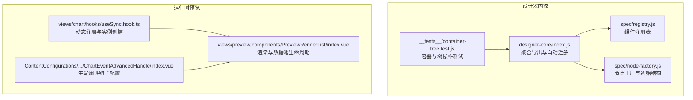
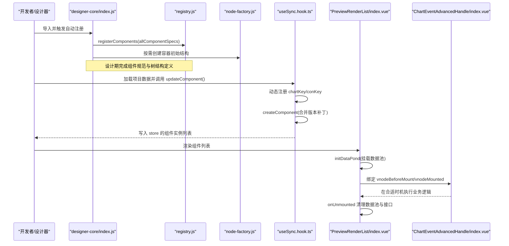
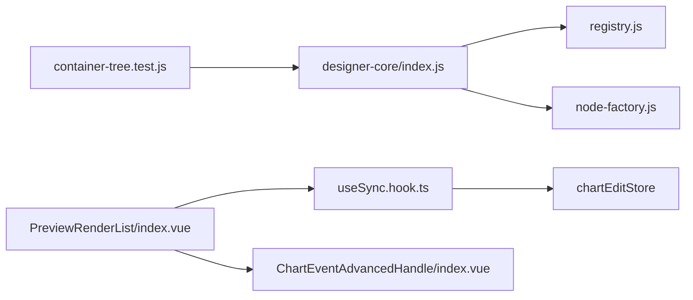
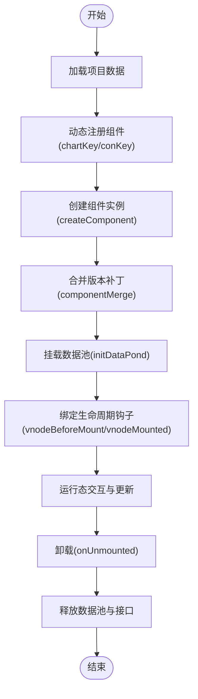

# 组件生命周期管理

<cite>
**本文引用的文件**
- [designer-core/index.js](file://forge-admin-ui/src/components/lowcode-builder/designer-core/index.js)
- [registry.js](file://forge-admin-ui/src/components/lowcode-builder/designer-core/spec/registry.js)
- [node-factory.js](file://forge-admin-ui/src/components/lowcode-builder/designer-core/spec/node-factory.js)
- [container-tree.test.js](file://forge-admin-ui/src/components/lowcode-builder/designer-core/__tests__/container-tree.test.js)
- [useSync.hook.ts](file://forge-report-ui/src/views/chart/hooks/useSync.hook.ts)
- [PreviewRenderList/index.vue](file://forge-report-ui/src/views/preview/components/PreviewRenderList/index.vue)
- [watermark.js](file://forge-admin-ui/src/directives/modules/watermark.js)
- [ChartEventAdvancedHandle/index.vue](file://forge-report-ui/src/views/chart/ContentConfigurations/components/ChartEvent/components/ChartEventAdvancedHandle/index.vue)
</cite>

## 目录
1. [简介](#简介)
2. [项目结构](#项目结构)
3. [核心组件](#核心组件)
4. [架构总览](#架构总览)
5. [详细组件分析](#详细组件分析)
6. [依赖关系分析](#依赖关系分析)
7. [性能考量](#性能考量)
8. [故障排查指南](#故障排查指南)
9. [结论](#结论)
10. [附录](#附录)

## 简介
本技术文档围绕 Forge Admin 前端工程中的“组件生命周期管理”展开，系统阐述组件从注册、初始化、渲染、更新到卸载销毁的完整流程。重点覆盖：
- 组件工厂模式与实例创建机制
- 组件注册表与统一规范
- 数据池与状态同步、事件绑定
- 内存管理与资源释放策略
- 生命周期钩子（如 vnodeBeforeMount、vnodeMounted）的使用与调试
- 常见问题定位与优化建议

## 项目结构
本项目在低代码设计器与报表预览两个层面实现了组件生命周期管理：
- 低代码设计器（designer-core）：提供统一的组件注册表、容器节点工厂、树操作与拖拽协议，负责在设计期构建和校验组件树。
- 报表预览（report-ui）：在运行时动态注册并创建图表组件，挂载数据池，处理生命周期钩子，并在卸载时清理资源。

**图示来源**
- [designer-core/index.js:1-126](file://forge-admin-ui/src/components/lowcode-builder/designer-core/index.js#L1-L126)
- [registry.js:1-169](file://forge-admin-ui/src/components/lowcode-builder/designer-core/spec/registry.js#L1-L169)
- [node-factory.js:1-257](file://forge-admin-ui/src/components/lowcode-builder/designer-core/spec/node-factory.js#L1-L257)
- [container-tree.test.js:1-333](file://forge-admin-ui/src/components/lowcode-builder/designer-core/__tests__/container-tree.test.js#L1-L333)
- [useSync.hook.ts:1-218](file://forge-report-ui/src/views/chart/hooks/useSync.hook.ts#L1-L218)
- [PreviewRenderList/index.vue:1-138](file://forge-report-ui/src/views/preview/components/PreviewRenderList/index.vue#L1-L138)
- [ChartEventAdvancedHandle/index.vue:173-221](file://forge-report-ui/src/views/chart/ContentConfigurations/components/ChartEvent/components/ChartEventAdvancedHandle/index.vue#L173-L221)

**章节来源**
- [designer-core/index.js:1-126](file://forge-admin-ui/src/components/lowcode-builder/designer-core/index.js#L1-L126)
- [registry.js:1-169](file://forge-admin-ui/src/components/lowcode-builder/designer-core/spec/registry.js#L1-L169)
- [node-factory.js:1-257](file://forge-admin-ui/src/components/lowcode-builder/designer-core/spec/node-factory.js#L1-L257)
- [container-tree.test.js:1-333](file://forge-admin-ui/src/components/lowcode-builder/designer-core/__tests__/container-tree.test.js#L1-L333)
- [useSync.hook.ts:1-218](file://forge-report-ui/src/views/chart/hooks/useSync.hook.ts#L1-L218)
- [PreviewRenderList/index.vue:1-138](file://forge-report-ui/src/views/preview/components/PreviewRenderList/index.vue#L1-L138)
- [ChartEventAdvancedHandle/index.vue:173-221](file://forge-report-ui/src/views/chart/ContentConfigurations/components/ChartEvent/components/ChartEventAdvancedHandle/index.vue#L173-L221)

## 核心组件
- 组件注册表（registry）
  - 职责：维护所有组件的 ComponentSpec，支持按类型或别名查询、分组、统计与清空。
  - 关键点：首次导入 designer-core 入口时批量注册全部组件；支持别名映射与重复注册警告。
- 节点工厂（node-factory）
  - 职责：为不同容器类型生成标准化的初始 children/props 结构，并提供 createNode/createContainerNode 等工具。
  - 关键点：ID 生成、包装节点（tabPane/collapseItem/col/tableCell）、列表页 tabs 与 grid cells 的结构化创建。
- 设计器入口（designer-core/index.js）
  - 职责：聚合各模块导出，首次 import 即执行 registerComponents(allComponentSpecs)，完成全局注册。
- 运行时同步与创建（useSync.hook.ts）
  - 职责：将存储中的组件配置转换为可运行实例，动态注册 Vue 组件，合并版本兼容补丁，写入 store。
- 预览渲染与数据池（PreviewRenderList/index.vue）
  - 职责：遍历组件列表进行渲染，挂载数据池，在 onUnmounted 中释放资源。
- 生命周期钩子配置（ChartEventAdvancedHandle/index.vue）
  - 职责：提供 vnodeBeforeMount/vnodeMounted 的配置与语法校验，辅助开发者在正确时机执行逻辑。

**章节来源**
- [registry.js:1-169](file://forge-admin-ui/src/components/lowcode-builder/designer-core/spec/registry.js#L1-L169)
- [node-factory.js:1-257](file://forge-admin-ui/src/components/lowcode-builder/designer-core/spec/node-factory.js#L1-L257)
- [designer-core/index.js:1-126](file://forge-admin-ui/src/components/lowcode-builder/designer-core/index.js#L1-L126)
- [useSync.hook.ts:1-218](file://forge-report-ui/src/views/chart/hooks/useSync.hook.ts#L1-L218)
- [PreviewRenderList/index.vue:1-138](file://forge-report-ui/src/views/preview/components/PreviewRenderList/index.vue#L1-L138)
- [ChartEventAdvancedHandle/index.vue:173-221](file://forge-report-ui/src/views/chart/ContentConfigurations/components/ChartEvent/components/ChartEventAdvancedHandle/index.vue#L173-L221)

## 架构总览
下图展示了组件从设计期到运行期的生命周期流转：

**图示来源**
- [designer-core/index.js:1-126](file://forge-admin-ui/src/components/lowcode-builder/designer-core/index.js#L1-L126)
- [registry.js:1-169](file://forge-admin-ui/src/components/lowcode-builder/designer-core/spec/registry.js#L1-L169)
- [node-factory.js:1-257](file://forge-admin-ui/src/components/lowcode-builder/designer-core/spec/node-factory.js#L1-L257)
- [useSync.hook.ts:1-218](file://forge-report-ui/src/views/chart/hooks/useSync.hook.ts#L1-L218)
- [PreviewRenderList/index.vue:1-138](file://forge-report-ui/src/views/preview/components/PreviewRenderList/index.vue#L1-L138)
- [ChartEventAdvancedHandle/index.vue:173-221](file://forge-report-ui/src/views/chart/ContentConfigurations/components/ChartEvent/components/ChartEventAdvancedHandle/index.vue#L173-L221)

## 详细组件分析

### 组件注册表（registry）
- 功能要点
  - 单例 Map 维护 specMap 与 aliasMap，支持注册、查询、别名解析、分组与统计。
  - 重复注册会发出警告，确保稳定性。
  - 提供 clearRegistry 用于测试隔离。
- 复杂度
  - 注册/查询均为 O(1)。
  - 分组/统计为 O(n)。
- 错误处理
  - 缺少 type 抛出错误；别名冲突输出警告。
- 优化建议
  - 生产环境避免频繁清空与重建注册表。
  - 对大型应用可按 scope/category 懒加载注册。

**章节来源**
- [registry.js:1-169](file://forge-admin-ui/src/components/lowcode-builder/designer-core/spec/registry.js#L1-L169)

### 节点工厂（node-factory）
- 功能要点
  - generateNodeId 提供稳定唯一 ID；createNode 创建最小可用节点。
  - 针对 tabs、collapse、row、table、grid 等容器生成标准化初始结构。
  - createContainerNode 封装“容器 + 初始子结构”的一体化创建。
- 复杂度
  - 创建函数多为 O(k)（k 为子节点数量）。
- 错误处理
  - 默认分支返回空 children，保证健壮性。
- 优化建议
  - 大量容器初始化时可考虑批处理与延迟渲染。

**章节来源**
- [node-factory.js:1-257](file://forge-admin-ui/src/components/lowcode-builder/designer-core/spec/node-factory.js#L1-L257)
- [container-tree.test.js:1-333](file://forge-admin-ui/src/components/lowcode-builder/designer-core/__tests__/container-tree.test.js#L1-L333)

### 设计器入口（designer-core/index.js）
- 功能要点
  - 聚合导出拖拽协议、桥接层、容器插槽、树操作、节点工厂与注册表 API。
  - 首次 import 即执行 registerComponents(allComponentSpecs)，实现“零配置”全局注册。
- 复杂度
  - 一次性注册成本 O(N)，N 为组件总数。
- 错误处理
  - 由 registry 内部处理重复注册与缺失字段。
- 优化建议
  - 可按路由或页面粒度拆分入口，减少首屏负担。

**章节来源**
- [designer-core/index.js:1-126](file://forge-admin-ui/src/components/lowcode-builder/designer-core/index.js#L1-L126)

### 运行时同步与实例创建（useSync.hook.ts）
- 功能要点
  - 动态注册 chartKey 与 conKey，确保运行时可渲染。
  - createComponent 重新构造实例以恢复类方法，再与持久化数据合并（componentMerge），处理版本兼容补丁。
  - 支持分组组件递归创建，逐步更新进度与历史栈。
- 复杂度
  - 组件创建与合并为 O(m)，m 为组件数量。
- 错误处理
  - 捕获异常并降级返回新对象，避免崩溃。
- 优化建议
  - 对大列表采用分片加载与虚拟滚动。
  - 合并策略可引入增量 diff 减少重渲染。

**章节来源**
- [useSync.hook.ts:1-218](file://forge-report-ui/src/views/chart/hooks/useSync.hook.ts#L1-L218)

### 预览渲染与数据池生命周期（PreviewRenderList/index.vue）
- 功能要点
  - 遍历组件列表渲染，分组与单组件分别处理。
  - onMounted 初始化数据池（initDataPond），onUnmounted 释放（disposeDataPond 与清理接口）。
  - 通过 provide/inject 注入 pageContext 与 componentList，供子组件消费。
- 复杂度
  - 渲染为 O(n)，n 为组件数；数据池初始化与清理为 O(n)。
- 错误处理
  - 主渲染路径在卸载时区分是否为主渲染，选择不同清理策略。
- 优化建议
  - 使用 key 稳定标识，避免不必要的重排。
  - 大数据集分页加载与懒加载。

**章节来源**
- [PreviewRenderList/index.vue:1-138](file://forge-report-ui/src/views/preview/components/PreviewRenderList/index.vue#L1-L138)

### 生命周期钩子配置（ChartEventAdvancedHandle/index.vue）
- 功能要点
  - 提供 vnodeBeforeMount（DOM 未存在）与 vnodeMounted（DOM 已存在）两种钩子。
  - 使用 AsyncFunction 进行语法校验，支持异步回调。
- 复杂度
  - 校验为 O(k)，k 为钩子数量。
- 错误处理
  - 捕获语法错误并反馈具体事件名与错误信息。
- 优化建议
  - 将重型逻辑放入 vnodeMounted，避免阻塞渲染。

**章节来源**
- [ChartEventAdvancedHandle/index.vue:173-221](file://forge-report-ui/src/views/chart/ContentConfigurations/components/ChartEvent/components/ChartEventAdvancedHandle/index.vue#L173-L221)

### 指令级实例生命周期示例（watermark.js）
- 功能要点
  - mounted 创建水印实例并挂载到目标元素。
  - updated 仅在值变化时重建实例，避免重复开销。
  - unmounted 卸载实例并从 DOM 移除，防止内存泄漏。
- 复杂度
  - 创建/销毁为 O(1)。
- 错误处理
  - 安全判断父节点存在后再移除。
- 优化建议
  - 对频繁更新的属性使用防抖/节流。

**章节来源**
- [watermark.js:56-129](file://forge-admin-ui/src/directives/modules/watermark.js#L56-L129)

## 依赖关系分析
- 低代码设计器
  - index.js 依赖 registry.js、node-factory.js 与各 spec 模块，形成“入口→注册表→工厂”的单向依赖。
  - 测试用例验证容器插槽、树操作与工厂行为，保障契约稳定。
- 运行时预览
  - useSync.hook.ts 依赖 packages 的 fetch/create 能力，并将结果写入 store。
  - PreviewRenderList/index.vue 依赖 useSync 产出的组件列表，并在挂载/卸载阶段管理数据池。
  - ChartEventAdvancedHandle 提供生命周期钩子配置，被渲染层绑定。

**图示来源**
- [designer-core/index.js:1-126](file://forge-admin-ui/src/components/lowcode-builder/designer-core/index.js#L1-L126)
- [registry.js:1-169](file://forge-admin-ui/src/components/lowcode-builder/designer-core/spec/registry.js#L1-L169)
- [node-factory.js:1-257](file://forge-admin-ui/src/components/lowcode-builder/designer-core/spec/node-factory.js#L1-L257)
- [container-tree.test.js:1-333](file://forge-admin-ui/src/components/lowcode-builder/designer-core/__tests__/container-tree.test.js#L1-L333)
- [useSync.hook.ts:1-218](file://forge-report-ui/src/views/chart/hooks/useSync.hook.ts#L1-L218)
- [PreviewRenderList/index.vue:1-138](file://forge-report-ui/src/views/preview/components/PreviewRenderList/index.vue#L1-L138)
- [ChartEventAdvancedHandle/index.vue:173-221](file://forge-report-ui/src/views/chart/ContentConfigurations/components/ChartEvent/components/ChartEventAdvancedHandle/index.vue#L173-L221)

**章节来源**
- [designer-core/index.js:1-126](file://forge-admin-ui/src/components/lowcode-builder/designer-core/index.js#L1-L126)
- [useSync.hook.ts:1-218](file://forge-report-ui/src/views/chart/hooks/useSync.hook.ts#L1-L218)
- [PreviewRenderList/index.vue:1-138](file://forge-report-ui/src/views/preview/components/PreviewRenderList/index.vue#L1-L138)

## 性能考量
- 首屏与注册成本
  - 设计器入口一次性注册全部组件，建议在多页面应用中按路由拆分入口，降低首包体积。
- 渲染与合并
  - 组件实例创建与合并（componentMerge）可能带来较大开销，建议结合虚拟列表与增量更新。
- 数据池与事件
  - 数据池在 onMounted 初始化、onUnmounted 释放，避免跨页面残留引用导致内存增长。
  - 生命周期钩子中避免执行重型计算，必要时使用 requestAnimationFrame 或 Web Worker。
- 指令与 DOM
  - 指令更新时仅当值变化才重建实例，减少 DOM 操作频率。

[本节为通用指导，不直接分析具体文件]

## 故障排查指南
- 组件未渲染
  - 检查运行时是否已动态注册 chartKey/conKey（useSync.hook.ts）。
  - 确认预览渲染列表是否正确传入组件列表（PreviewRenderList/index.vue）。
- 生命周期钩子未触发
  - 确认配置了 vnodeBeforeMount/vnodeMounted，并通过 ChartEventAdvancedHandle 的语法校验。
- 内存泄漏
  - 检查 onUnmounted 是否调用了 disposeDataPond 与清理接口（PreviewRenderList/index.vue）。
  - 指令级别需确保 unmounted 时卸载实例并移除 DOM（watermark.js）。
- 版本兼容问题
  - 使用 componentVersionUpdatePolyfill 补齐旧数据结构（useSync.hook.ts）。

**章节来源**
- [useSync.hook.ts:1-218](file://forge-report-ui/src/views/chart/hooks/useSync.hook.ts#L1-L218)
- [PreviewRenderList/index.vue:1-138](file://forge-report-ui/src/views/preview/components/PreviewRenderList/index.vue#L1-L138)
- [ChartEventAdvancedHandle/index.vue:173-221](file://forge-report-ui/src/views/chart/ContentConfigurations/components/ChartEvent/components/ChartEventAdvancedHandle/index.vue#L173-L221)
- [watermark.js:56-129](file://forge-admin-ui/src/directives/modules/watermark.js#L56-L129)

## 结论
本方案通过“设计器内核 + 运行时预览”的双层架构，实现了组件从注册、初始化、渲染、更新到卸载的全生命周期管理。借助统一的注册表与节点工厂，保证了设计期的一致性；通过运行时动态注册、数据池与生命周期钩子，确保了运行时的灵活性与可维护性。配合严格的资源释放与兼容性处理，能够在复杂业务场景下保持稳定的性能与体验。

[本节为总结性内容，不直接分析具体文件]

## 附录
- 关键流程图（算法视角）

**图示来源**
- [useSync.hook.ts:1-218](file://forge-report-ui/src/views/chart/hooks/useSync.hook.ts#L1-L218)
- [PreviewRenderList/index.vue:1-138](file://forge-report-ui/src/views/preview/components/PreviewRenderList/index.vue#L1-L138)
- [ChartEventAdvancedHandle/index.vue:173-221](file://forge-report-ui/src/views/chart/ContentConfigurations/components/ChartEvent/components/ChartEventAdvancedHandle/index.vue#L173-L221)