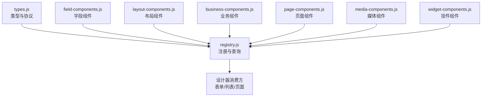
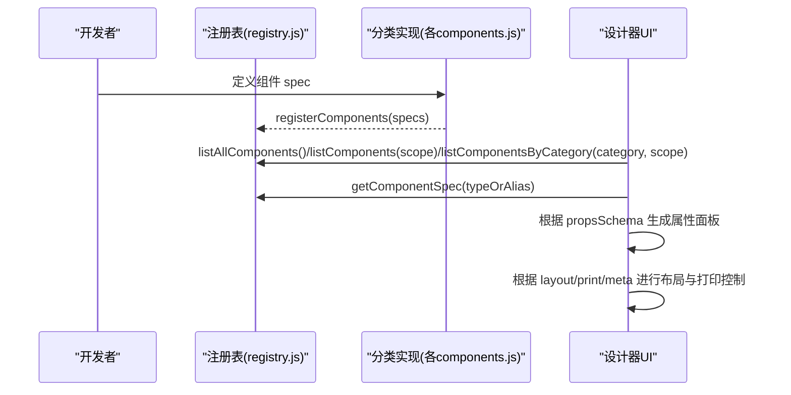
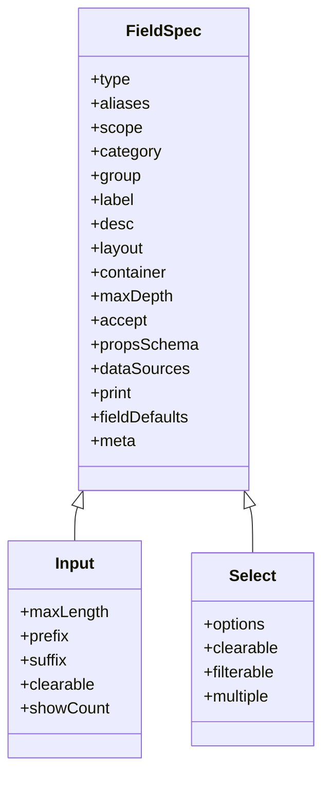
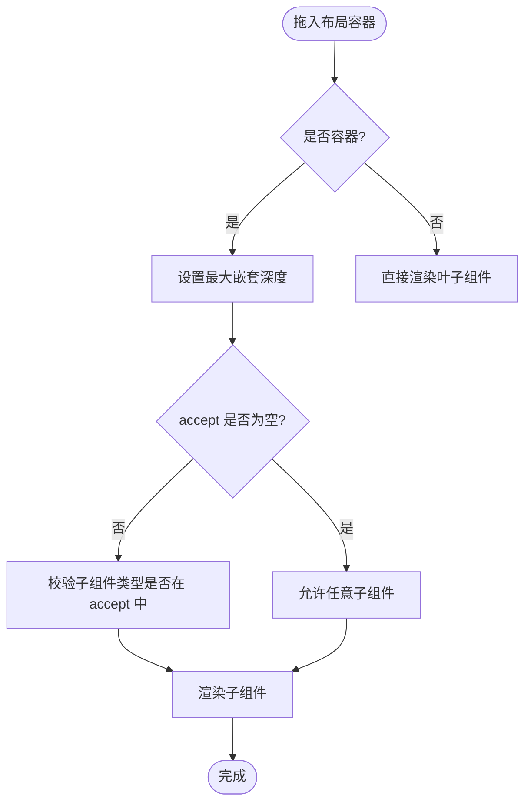
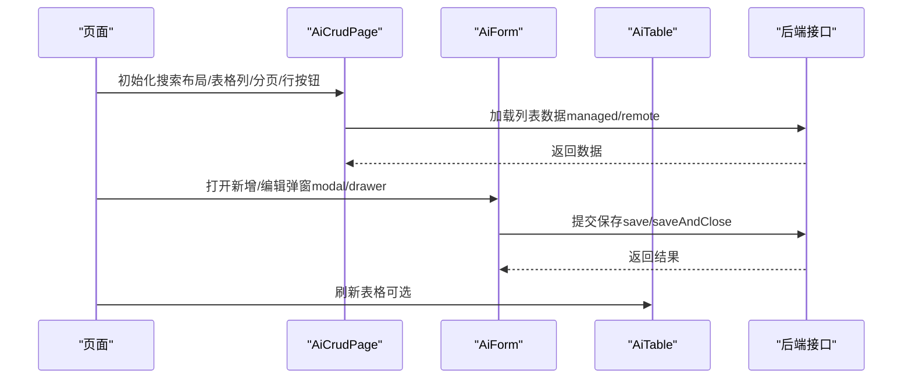
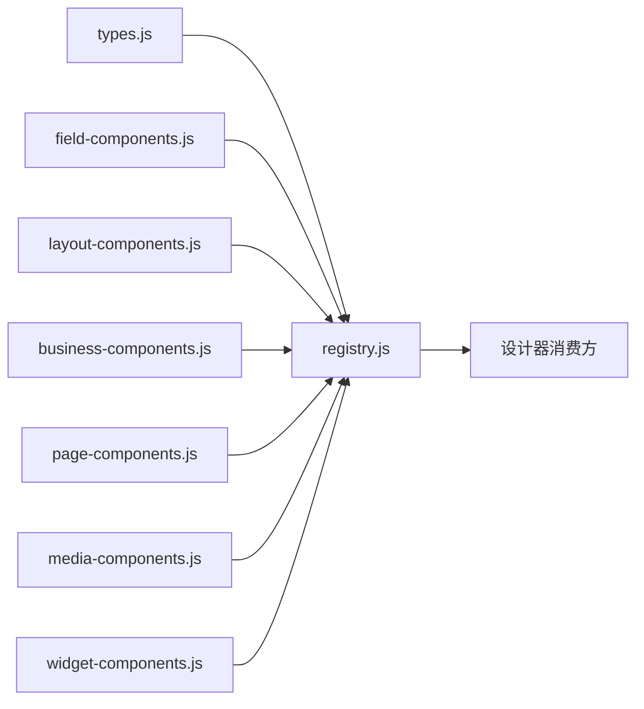

# 组件规格定义

<cite>
**本文引用的文件**
- [types.js](file://forge-admin-ui/src/components/lowcode-builder/designer-core/spec/types.js)
- [registry.js](file://forge-admin-ui/src/components/lowcode-builder/designer-core/spec/registry.js)
- [field-components.js](file://forge-admin-ui/src/components/lowcode-builder/designer-core/spec/field-components.js)
- [layout-components.js](file://forge-admin-ui/src/components/lowcode-builder/designer-core/spec/layout-components.js)
- [business-components.js](file://forge-admin-ui/src/components/lowcode-builder/designer-core/spec/business-components.js)
- [page-components.js](file://forge-admin-ui/src/components/lowcode-builder/designer-core/spec/page-components.js)
- [media-components.js](file://forge-admin-ui/src/components/lowcode-builder/designer-core/spec/media-components.js)
- [widget-components.js](file://forge-admin-ui/src/components/lowcode-builder/designer-core/spec/widget-components.js)
</cite>

## 目录
1. [简介](#简介)
2. [项目结构](#项目结构)
3. [核心组件](#核心组件)
4. [架构总览](#架构总览)
5. [详细组件分析](#详细组件分析)
6. [依赖关系分析](#依赖关系分析)
7. [性能考虑](#性能考虑)
8. [故障排查指南](#故障排查指南)
9. [结论](#结论)
10. [附录](#附录)

## 简介
本技术文档围绕低代码设计器的“统一组件规格”展开，系统性说明 ComponentSpec 接口的完整定义与约束，覆盖 type、category、scope、group 等关键字段；解释组件元数据结构、属性定义规范（PropsSchema）、数据源能力（DataSourceKind）、布局配置（LayoutSpec）、打印配置（PrintSpec）以及字段默认值（FieldDefaults）。同时梳理六大分类体系（field、layout、business、page、media、widget）的设计原理与使用场景，并提供完整的组件规格示例路径、验证规则与最佳实践。

## 项目结构
统一组件规格位于 designer-core/spec 目录下，采用“类型定义 + 分类实现 + 注册表”的分层组织：
- types.js：统一类型与协议定义（ComponentSpec、PropsSchema、LayoutSpec、PrintSpec、FieldDefaults、DataSourceKind/Config 等）
- registry.js：组件注册表与查询 API（注册、别名解析、按 scope/category/group 过滤）
- field-components.js：字段类组件（输入/选择/业务）共 33 个，scope 多为 F
- layout-components.js：布局容器与包装节点共 15 个，scope 多为 F+L
- business-components.js：业务区块（CRUD/表格/表单/子表等）共 12 个
- page-components.js：页面级装饰组件（标题/段落/统计/提示/标签等）共 7 个
- media-components.js：媒体组件（音视频/头像/条码/二维码/iframe）共 6 个
- widget-components.js：通用挂件（富文本/Markdown/日历/菜单/分页/面板分隔等）共 18 个

图表来源
- [types.js:1-120](file://forge-admin-ui/src/components/lowcode-builder/designer-core/spec/types.js#L1-L120)
- [registry.js:1-169](file://forge-admin-ui/src/components/lowcode-builder/designer-core/spec/registry.js#L1-L169)
- [field-components.js:1-541](file://forge-admin-ui/src/components/lowcode-builder/designer-core/spec/field-components.js#L1-L541)
- [layout-components.js:1-407](file://forge-admin-ui/src/components/lowcode-builder/designer-core/spec/layout-components.js#L1-L407)
- [business-components.js:1-257](file://forge-admin-ui/src/components/lowcode-builder/designer-core/spec/business-components.js#L1-L257)
- [page-components.js:1-121](file://forge-admin-ui/src/components/lowcode-builder/designer-core/spec/page-components.js#L1-L121)
- [media-components.js:1-163](file://forge-admin-ui/src/components/lowcode-builder/designer-core/spec/media-components.js#L1-L163)
- [widget-components.js:1-453](file://forge-admin-ui/src/components/lowcode-builder/designer-core/spec/widget-components.js#L1-L453)

章节来源
- [types.js:1-120](file://forge-admin-ui/src/components/lowcode-builder/designer-core/spec/types.js#L1-L120)
- [registry.js:1-169](file://forge-admin-ui/src/components/lowcode-builder/designer-core/spec/registry.js#L1-L169)

## 核心组件
本节聚焦 ComponentSpec 的核心字段与约束，并给出各字段的含义、取值范围与典型用法。

- type：组件唯一标识名，用于运行时渲染与序列化。必须全局唯一。
- aliases：兼容旧版或第三方使用的别名数组，注册时会被映射到统一 type。
- scope：组件可用范围，取值为 'F'（仅表单画布）、'L'（仅列表/页面画布）、'F+L'（两者均可）。
- category：组件分类，取值为 'field' | 'layout' | 'business' | 'page' | 'media' | 'widget'。
- group：分组名，用于在侧边栏中归类展示（如“输入”“选择”“布局”“数据”“操作”“页面”“媒体”“导航”“内容”等）。
- label：显示名称，面向设计师的友好命名。
- desc：功能描述，辅助理解组件用途。
- layout：布局配置，包含 defaultSpan/minSpan/maxSpan 等栅格相关属性。
- container：是否容器，true 表示可容纳子组件。
- maxDepth：最大嵌套深度（容器有效），限制层级以避免过度嵌套。
- accept：容器可接受的子组件类型白名单（空表示全部接受）。
- propsSchema：属性面板 Schema，定义属性编辑器类型、默认值、校验、选项等。
- dataSources：支持的数据源类型数组（static/dict/managed/remote/context/relation/builtin）。
- print：打印配置，hidden 控制打印时隐藏，breakAvoid 控制不跨页截断。
- fieldDefaults：字段组件的数据库/业务默认值（fieldType、dataType、componentType、length、precision、queryType 等）。
- meta：扩展元数据，如 unique/multiField/requireFields/onlyFor/zones 等，用于特殊约束或上下文绑定。

章节来源
- [types.js:9-119](file://forge-admin-ui/src/components/lowcode-builder/designer-core/spec/types.js#L9-L119)

## 架构总览
统一组件规格通过“类型定义 → 分类实现 → 注册表 → 设计器消费”的链路工作。注册表提供统一的查询与过滤能力，确保表单、列表、页面三类设计器共享同一份物料协议。

图表来源
- [registry.js:17-141](file://forge-admin-ui/src/components/lowcode-builder/designer-core/spec/registry.js#L17-L141)
- [field-components.js:1-541](file://forge-admin-ui/src/components/lowcode-builder/designer-core/spec/field-components.js#L1-L541)
- [layout-components.js:1-407](file://forge-admin-ui/src/components/lowcode-builder/designer-core/spec/layout-components.js#L1-L407)
- [business-components.js:1-257](file://forge-admin-ui/src/components/lowcode-builder/designer-core/spec/business-components.js#L1-L257)
- [page-components.js:1-121](file://forge-admin-ui/src/components/lowcode-builder/designer-core/spec/page-components.js#L1-L121)
- [media-components.js:1-163](file://forge-admin-ui/src/components/lowcode-builder/designer-core/spec/media-components.js#L1-L163)
- [widget-components.js:1-453](file://forge-admin-ui/src/components/lowcode-builder/designer-core/spec/widget-components.js#L1-L453)

## 详细组件分析

### 字段组件（field）
- 范围与分组：主要 scope='F'，部分为 'F+L'；分组包括“输入”“选择”“业务”。
- 典型组件：
  - 输入类：input、textarea、number、money、slider、rate、color、barcodeScanner
  - 选择类：select、dictSelect、radio/radioButton、checkbox、transfer、cascader、treeSelect、customSelect、date/datetime/daterange/datetimerange/month/year/timerange、switch
  - 业务类：userSelect、orgTreeSelect、regionTreeSelect、objectReference、recordSelector、fileUpload、imageUpload、text
- 关键特性：
  - propsSchema 定义编辑器类型（string/number/boolean/select/color/json/code/customEditor/section）及校验（min/max/step/options/default）。
  - dataSources 声明数据来源能力（如 static/dict/remote/relation/builtin/context）。
  - fieldDefaults 提供数据库列类型、业务字段类型、查询方式等默认映射。
  - print 控制打印行为（多数字段组件 hidden=false，breakAvoid=false）。

图表来源
- [types.js:31-119](file://forge-admin-ui/src/components/lowcode-builder/designer-core/spec/types.js#L31-L119)
- [field-components.js:12-528](file://forge-admin-ui/src/components/lowcode-builder/designer-core/spec/field-components.js#L12-L528)

章节来源
- [field-components.js:1-541](file://forge-admin-ui/src/components/lowcode-builder/designer-core/spec/field-components.js#L1-L541)

### 布局组件（layout）
- 范围与分组：scope 多为 'F+L'；分组包括“布局”“包装节点”。
- 典型组件：grid、table、card、tabs、collapse、box、divider、spacer、space、groupTitle、formSectionTitle，以及 tabPane、collapseItem、col、tableCell 等包装节点。
- 关键特性：
  - container=true 且常设 maxDepth=4，accept 为空表示接受任意子组件（或特定子类型，如 tabs 接受 tabPane）。
  - propsSchema 与渲染器键名对齐（例如 grid 的 columns/gutter/rowGap/alignItems/justifyItems/cellMinHeight/cellBackground/showCellBorder）。
  - print.breakAvoid 多为 true，避免卡片/分区被截断。

图表来源
- [layout-components.js:7-388](file://forge-admin-ui/src/components/lowcode-builder/designer-core/spec/layout-components.js#L7-L388)

章节来源
- [layout-components.js:1-407](file://forge-admin-ui/src/components/lowcode-builder/designer-core/spec/layout-components.js#L1-L407)

### 业务组件（business）
- 范围与分组：以 'F+L' 为主；分组包括“数据”“操作”。
- 典型组件：AiCrudPage、AiTable、AiForm、subTable、search-form、toolbar、dataTable、tree-panel、detail-info、stepForm、signaturePad、sub-table-tabs。
- 关键特性：
  - 多组件具备 meta.unique=true，保证页面内唯一性（如 CRUD、工具栏、详情等）。
  - 多组件具备 multiField/requireFields，要求关联字段集（如 search-form、dataTable、detailInfo）。
  - dataSources 指向 managed/remote/relation/context，驱动数据交互。
  - propsSchema 大量使用 customEditor 自定义编辑器（如 CrudSearchLayoutEditor、CrudTableColumnsEditor、CrudDefaultParamsEditor、CrudHookRulesEditor、CrudExpandConfigEditor、SearchFieldsEditor）。

图表来源
- [business-components.js:7-256](file://forge-admin-ui/src/components/lowcode-builder/designer-core/spec/business-components.js#L7-L256)

章节来源
- [business-components.js:1-257](file://forge-admin-ui/src/components/lowcode-builder/designer-core/spec/business-components.js#L1-L257)

### 页面组件（page）
- 范围与分组：scope='L'；分组包括“页面”“内容”“数据”。
- 典型组件：back-button、page-title、text-title、paragraph、statistic、text-tip、tag-list。
- 关键特性：
  - 多组件支持 context 数据源，用于读取当前页面上下文信息。
  - print.hidden 多为 false，便于打印输出。

章节来源
- [page-components.js:1-121](file://forge-admin-ui/src/components/lowcode-builder/designer-core/spec/page-components.js#L1-L121)

### 媒体组件（media）
- 范围与分组：scope 多为 'L'，部分为 'F+L'；分组包括“媒体”“高级”。
- 典型组件：audio-player、video-player、avatar、barcode、qrcode、iframe。
- 关键特性：
  - 音视频与二维码/条形码支持 context/remote 数据源。
  - print.hidden 对多媒体通常设为 true，避免打印冗余。

章节来源
- [media-components.js:1-163](file://forge-admin-ui/src/components/lowcode-builder/designer-core/spec/media-components.js#L1-L163)

### 挂件组件（widget）
- 范围与分组：scope 多为 'F+L'；分组包括“内容”“数据”“导航”“布局”“高级”。
- 典型组件：rich-text、transfer、watermark、vue-component、html-tag、markdown、calendar、code、countdown、descriptions、announcement、list、log、number-animation、breadcrumb、menu、pagination、split。
- 关键特性：
  - 多组件支持 context/remote 数据源，灵活接入页面数据。
  - 多组件具备 print.commonWidgetPrint 默认配置，便于统一打印策略。

章节来源
- [widget-components.js:1-453](file://forge-admin-ui/src/components/lowcode-builder/designer-core/spec/widget-components.js#L1-L453)

## 依赖关系分析
- 类型依赖：所有组件 spec 均依赖 types.js 中的类型定义（ComponentSpec、PropsSchema、LayoutSpec、PrintSpec、FieldDefaults、DataSourceKind/Config）。
- 注册依赖：各分类组件通过 registry.js 的 registerComponents 批量注册，形成统一注册表。
- 查询依赖：设计器通过 registry.js 提供的 listAllComponents/listComponents/listComponentsByCategory/groupComponents/getComponentSpec 等方法获取组件清单与元数据。

图表来源
- [types.js:1-120](file://forge-admin-ui/src/components/lowcode-builder/designer-core/spec/types.js#L1-L120)
- [registry.js:1-169](file://forge-admin-ui/src/components/lowcode-builder/designer-core/spec/registry.js#L1-L169)
- [field-components.js:1-541](file://forge-admin-ui/src/components/lowcode-builder/designer-core/spec/field-components.js#L1-L541)
- [layout-components.js:1-407](file://forge-admin-ui/src/components/lowcode-builder/designer-core/spec/layout-components.js#L1-L407)
- [business-components.js:1-257](file://forge-admin-ui/src/components/lowcode-builder/designer-core/spec/business-components.js#L1-L257)
- [page-components.js:1-121](file://forge-admin-ui/src/components/lowcode-builder/designer-core/spec/page-components.js#L1-L121)
- [media-components.js:1-163](file://forge-admin-ui/src/components/lowcode-builder/designer-core/spec/media-components.js#L1-L163)
- [widget-components.js:1-453](file://forge-admin-ui/src/components/lowcode-builder/designer-core/spec/widget-components.js#L1-L453)

章节来源
- [registry.js:1-169](file://forge-admin-ui/src/components/lowcode-builder/designer-core/spec/registry.js#L1-L169)

## 性能考虑
- 注册表查询复杂度：listAllComponents 与 listComponents 基于 Map 遍历，时间复杂度 O(n)，n 为组件总数（约 102），开销可控。
- 过滤与分组：listComponentsByCategory 与 groupComponents 均为线性扫描，适合小数据集。
- 容器嵌套限制：maxDepth 限制避免深层嵌套导致的渲染与计算成本上升。
- 数据源选择：优先使用 context/static 减少远程请求；remote/managed 按需启用缓存与分页。
- 打印优化：合理设置 print.hidden 与 print.breakAvoid，减少无效渲染与分页断裂。

[本节为通用指导，无需具体文件引用]

## 故障排查指南
- 重复注册警告：当 type 已存在时，注册会覆盖并输出警告；建议检查别名冲突与重复导入。
- 别名冲突：aliasMap 中若同一别名映射到不同 type，将输出警告；应确保别名唯一。
- 必填字段缺失：registerComponent 要求 spec.type 存在，否则抛出错误；请确保每个组件 spec 都包含 type。
- 分类过滤异常：listComponentsByCategory 仅匹配 category 精确值；确认传入值属于 field/layout/business/page/media/widget。
- 作用域过滤异常：listComponents 会保留 scope 等于指定值或 'F+L' 的组件；如需严格限定，请在调用处二次过滤。

章节来源
- [registry.js:17-31](file://forge-admin-ui/src/components/lowcode-builder/designer-core/spec/registry.js#L17-L31)
- [registry.js:90-107](file://forge-admin-ui/src/components/lowcode-builder/designer-core/spec/registry.js#L90-L107)

## 结论
本仓库通过统一的 ComponentSpec 协议，将 102 个组件纳入一致的元数据模型，配合注册表提供强大的查询与过滤能力。六大分类体系清晰划分了组件职责与使用场景，propsSchema 与 dataSources 使属性面板与数据绑定标准化，layout/print/meta 则完善了布局、打印与扩展约束。遵循本文档的验证规则与最佳实践，可在表单、列表、页面三类设计器中高效复用与扩展组件能力。

[本节为总结性内容，无需具体文件引用]

## 附录

### 组件分类体系与设计原理
- field（字段）：面向表单录入与展示，强调数据绑定与校验，常见于表单画布。
- layout（布局）：提供容器与排版能力，支撑复杂页面结构，常用于表单与列表画布。
- business（业务）：封装业务语义（CRUD、表格、表单、子表等），提升开发效率。
- page（页面）：页面级装饰与信息展示，增强页面可读性与导航体验。
- media（媒体）：音视频、头像、条码/二维码、iframe 等媒体资源展示。
- widget（挂件）：通用能力组件（富文本、Markdown、日历、菜单、分页、面板分隔等），跨画布复用。

章节来源
- [field-components.js:1-541](file://forge-admin-ui/src/components/lowcode-builder/designer-core/spec/field-components.js#L1-L541)
- [layout-components.js:1-407](file://forge-admin-ui/src/components/lowcode-builder/designer-core/spec/layout-components.js#L1-L407)
- [business-components.js:1-257](file://forge-admin-ui/src/components/lowcode-builder/designer-core/spec/business-components.js#L1-L257)
- [page-components.js:1-121](file://forge-admin-ui/src/components/lowcode-builder/designer-core/spec/page-components.js#L1-L121)
- [media-components.js:1-163](file://forge-admin-ui/src/components/lowcode-builder/designer-core/spec/media-components.js#L1-L163)
- [widget-components.js:1-453](file://forge-admin-ui/src/components/lowcode-builder/designer-core/spec/widget-components.js#L1-L453)

### 属性定义规范（PropsSchema）
- 编辑器类型：string/number/boolean/select/color/json/code/customEditor/section
- 校验与提示：min/max/step/options/default/placeholder/disabled/description/format
- 分组编辑：使用 section 类型进行属性分组，提升属性面板可读性
- 自定义编辑器：通过 customEditor 引入专用编辑器（如 CRUD 相关编辑器）

章节来源
- [types.js:31-53](file://forge-admin-ui/src/components/lowcode-builder/designer-core/spec/types.js#L31-L53)
- [business-components.js:14-60](file://forge-admin-ui/src/components/lowcode-builder/designer-core/spec/business-components.js#L14-L60)

### 数据源能力（DataSourceKind/Config）
- 类型：static/dict/managed/remote/context/relation/builtin
- 配置项：enabled/sourceType/api/method/paramsText/dataPath/dictType/labelField/valueField/contextPath
- 使用建议：优先静态/字典/上下文，必要时启用远程/托管/关系数据源，并结合缓存与分页优化性能

章节来源
- [types.js:9-27](file://forge-admin-ui/src/components/lowcode-builder/designer-core/spec/types.js#L9-L27)
- [field-components.js:147-161](file://forge-admin-ui/src/components/lowcode-builder/designer-core/spec/field-components.js#L147-L161)
- [business-components.js:61-83](file://forge-admin-ui/src/components/lowcode-builder/designer-core/spec/business-components.js#L61-L83)

### 布局与打印配置（LayoutSpec/PrintSpec）
- 布局：defaultSpan/minSpan/maxSpan 控制栅格宽度；容器组件可设置 maxDepth/accept 限制嵌套与子类型
- 打印：hidden 控制打印时隐藏；breakAvoid 控制不跨页截断（卡片/分区常用）

章节来源
- [types.js:57-72](file://forge-admin-ui/src/components/lowcode-builder/designer-core/spec/types.js#L57-L72)
- [layout-components.js:7-45](file://forge-admin-ui/src/components/lowcode-builder/designer-core/spec/layout-components.js#L7-L45)

### 字段默认值（FieldDefaults）
- 字段类型：fieldType/businessFieldType（如 TEXT/NUMBER/DICT/DATE/MONEY/SWITCH/USER/DEPT/REGION/REFERENCE/RECORD_SELECTOR/FILE/IMAGE）
- 数据类型：dataType（varchar/int/decimal/date/text/tinyint 等）
- 组件类型：componentType（与运行时渲染组件 key 对应）
- 长度与精度：length/precision（数值/金额/日期等）
- 查询方式：queryType（eq/like/in/between 等）

章节来源
- [types.js:74-86](file://forge-admin-ui/src/components/lowcode-builder/designer-core/spec/types.js#L74-L86)
- [field-components.js:12-528](file://forge-admin-ui/src/components/lowcode-builder/designer-core/spec/field-components.js#L12-L528)

### 组件规格示例（路径参考）
- 字段组件示例：[field-components.js:12-528](file://forge-admin-ui/src/components/lowcode-builder/designer-core/spec/field-components.js#L12-L528)
- 布局组件示例：[layout-components.js:7-388](file://forge-admin-ui/src/components/lowcode-builder/designer-core/spec/layout-components.js#L7-L388)
- 业务组件示例：[business-components.js:7-256](file://forge-admin-ui/src/components/lowcode-builder/designer-core/spec/business-components.js#L7-L256)
- 页面组件示例：[page-components.js:6-116](file://forge-admin-ui/src/components/lowcode-builder/designer-core/spec/page-components.js#L6-L116)
- 媒体组件示例：[media-components.js:6-152](file://forge-admin-ui/src/components/lowcode-builder/designer-core/spec/media-components.js#L6-L152)
- 挂件组件示例：[widget-components.js:11-431](file://forge-admin-ui/src/components/lowcode-builder/designer-core/spec/widget-components.js#L11-L431)

### 验证规则与最佳实践
- 唯一性：确保 type 全局唯一；合理使用 aliases 兼容旧版本，但避免别名冲突。
- 作用域：明确 scope，避免在不支持的画布中使用组件。
- 容器约束：合理设置 maxDepth 与 accept，防止非法嵌套。
- 属性面板：使用 PropsSchema 的 options/default/min/max 等约束，提升易用性与健壮性。
- 数据源：优先本地/上下文数据，远程数据需考虑缓存与错误处理。
- 打印：对交互类组件设置 print.hidden=true，对卡片/分区设置 print.breakAvoid=true。
- 元数据：利用 meta.unique/multiField/requireFields/onlyFor 表达业务约束，提升设计期校验能力。

章节来源
- [registry.js:17-31](file://forge-admin-ui/src/components/lowcode-builder/designer-core/spec/registry.js#L17-L31)
- [field-components.js:12-528](file://forge-admin-ui/src/components/lowcode-builder/designer-core/spec/field-components.js#L12-L528)
- [layout-components.js:7-388](file://forge-admin-ui/src/components/lowcode-builder/designer-core/spec/layout-components.js#L7-L388)
- [business-components.js:7-256](file://forge-admin-ui/src/components/lowcode-builder/designer-core/spec/business-components.js#L7-L256)