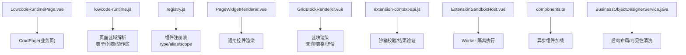
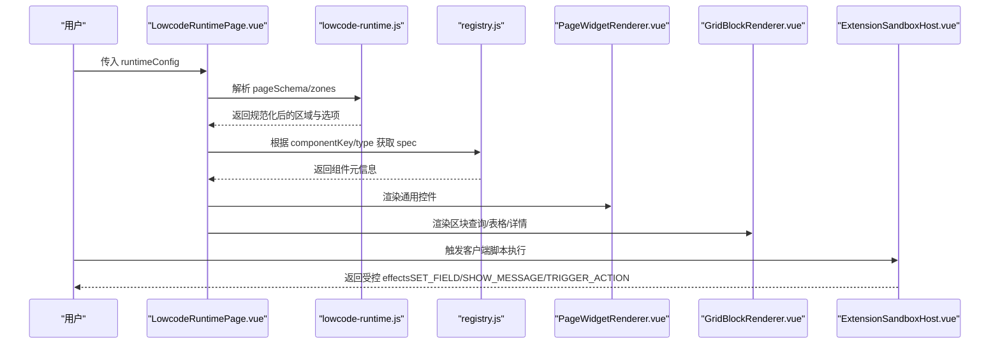
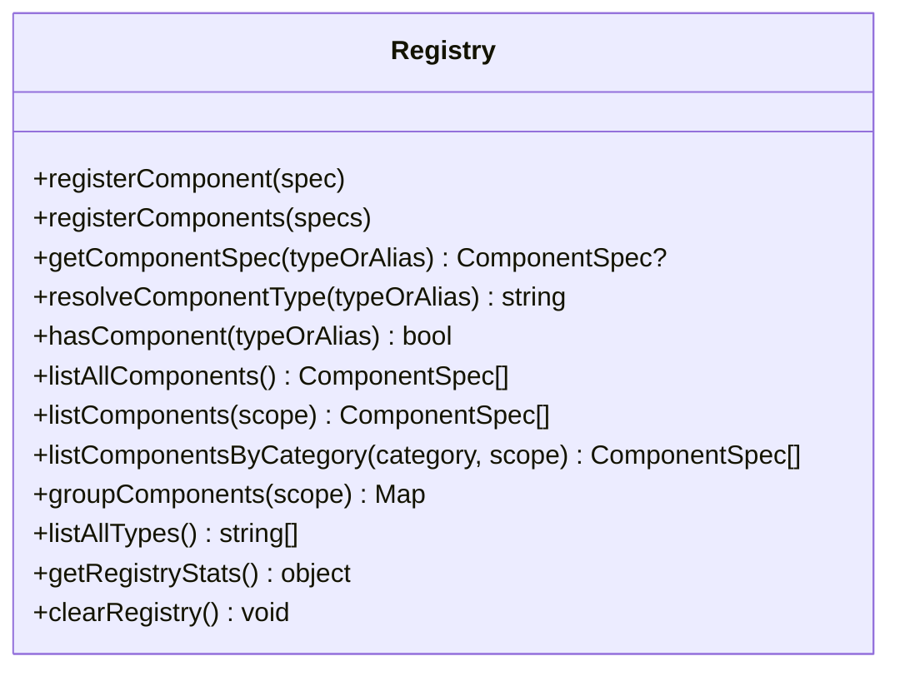
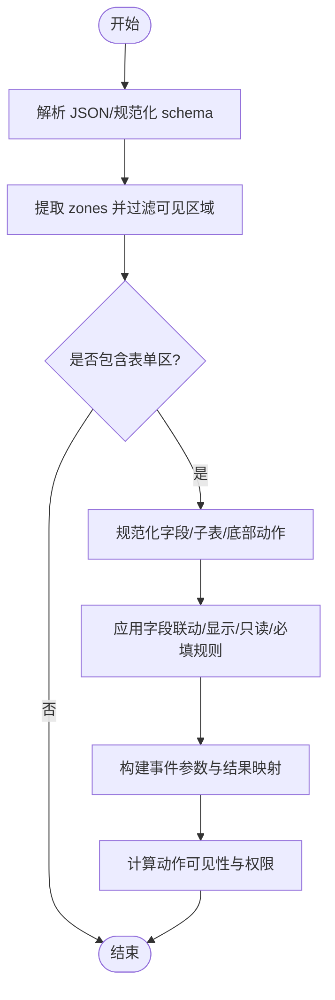
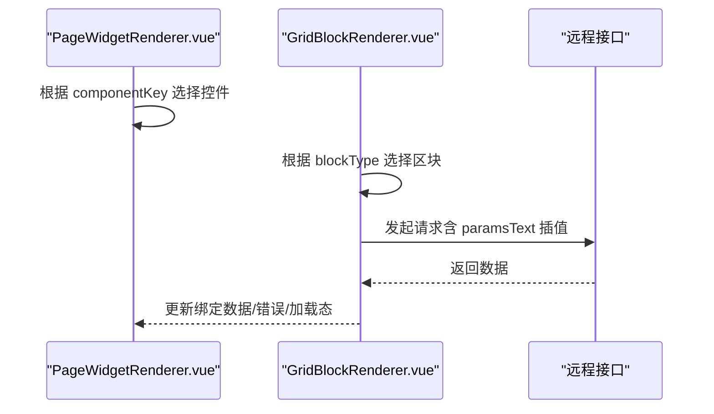
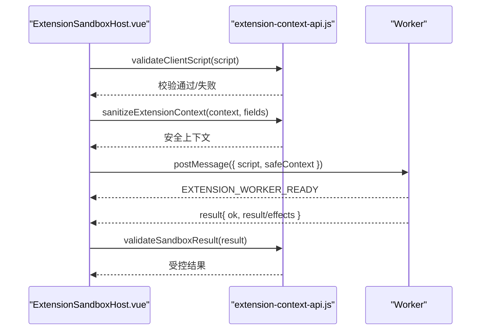
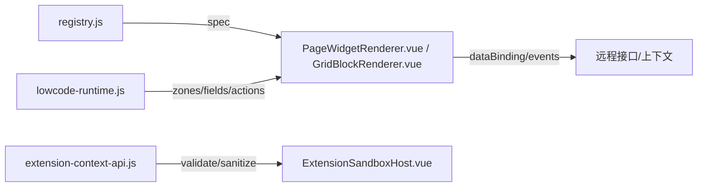

# 动态渲染机制

<cite>
**本文引用的文件**
- [LowcodeRuntimePage.vue](file://forge-admin-ui/src/components/lowcode-runtime/LowcodeRuntimePage.vue)
- [lowcode-runtime.js](file://forge-h5-ui/src/utils/lowcode-runtime.js)
- [registry.js](file://forge-admin-ui/src/components/lowcode-builder/designer-core/spec/registry.js)
- [components.ts](file://forge-report-ui/src/utils/components.ts)
- [extension-context-api.js](file://forge-admin-ui/src/components/lowcode-extension/js/extension-context-api.js)
- [ExtensionSandboxHost.vue](file://forge-admin-ui/src/components/lowcode-extension/js/ExtensionSandboxHost.vue)
- [PageWidgetRenderer.vue](file://forge-admin-ui/src/components/lowcode-builder/shared/PageWidgetRenderer.vue)
- [GridBlockRenderer.vue](file://forge-admin-ui/src/components/lowcode-builder/page/GridBlockRenderer.vue)
- [BusinessFormDesigner.vue](file://forge-admin-ui/src/views/app-center/components/designer/BusinessFormDesigner.vue)
- [crud-page.vue](file://forge-admin-ui/src/views/ai/crud-page.vue)
- [BusinessObjectDesignerService.java](file://forge-server/forge-framework/forge-plugin-parent/forge-plugin-generator/src/main/java/com/mdframe/forge/plugin/generator/service/businessapp/BusinessObjectDesignerService.java)
</cite>

## 目录
1. [简介](#简介)
2. [项目结构](#项目结构)
3. [核心组件](#核心组件)
4. [架构总览](#架构总览)
5. [详细组件分析](#详细组件分析)
6. [依赖关系分析](#依赖关系分析)
7. [性能考量](#性能考量)
8. [故障排查指南](#故障排查指南)
9. [结论](#结论)
10. [附录：API与扩展开发指南](#附录api与扩展开发指南)

## 简介
本技术文档围绕低代码平台的“动态渲染机制”展开，覆盖以下关键能力：
- 动态组件加载与注册表管理
- 条件渲染、循环渲染与数据绑定
- 异步组件与远程数据加载
- 渲染上下文传递与作用域隔离
- 安全沙箱与客户端脚本执行策略
- 模块导入、依赖解析与版本兼容性策略
- 动态渲染 API 与扩展开发指南

该机制以“配置驱动 + 运行时解析”为核心，通过统一的组件注册表、页面区域（Zone）规范、表单/列表区块渲染器以及安全沙箱，实现跨端（H5/PC）一致的动态渲染体验。

## 项目结构
仓库中与动态渲染相关的核心位置包括：
- H5 运行时解析与规则引擎：forge-h5-ui/src/utils/lowcode-runtime.js
- PC 端统一组件注册表：forge-admin-ui/src/components/lowcode-builder/designer-core/spec/registry.js
- 通用组件异步加载工具：forge-report-ui/src/utils/components.ts
- 安全沙箱与客户端脚本校验：forge-admin-ui/src/components/lowcode-extension/js/*
- 页面与区块渲染器：forge-admin-ui/src/components/lowcode-builder/shared/PageWidgetRenderer.vue、forge-admin-ui/src/components/lowcode-builder/page/GridBlockRenderer.vue
- 运行时入口与页面装配：forge-admin-ui/src/components/lowcode-runtime/LowcodeRuntimePage.vue、forge-admin-ui/src/views/ai/crud-page.vue
- 后端运行时配置构建与可见性规则处理：BusinessObjectDesignerService.java

图表来源
- [LowcodeRuntimePage.vue:1-24](file://forge-admin-ui/src/components/lowcode-runtime/LowcodeRuntimePage.vue#L1-L24)
- [lowcode-runtime.js:19-90](file://forge-h5-ui/src/utils/lowcode-runtime.js#L19-L90)
- [registry.js:17-93](file://forge-admin-ui/src/components/lowcode-builder/designer-core/spec/registry.js#L17-L93)
- [PageWidgetRenderer.vue:1-200](file://forge-admin-ui/src/components/lowcode-builder/shared/PageWidgetRenderer.vue#L1-L200)
- [GridBlockRenderer.vue:1-200](file://forge-admin-ui/src/components/lowcode-builder/page/GridBlockRenderer.vue#L1-L200)
- [extension-context-api.js:42-96](file://forge-admin-ui/src/components/lowcode-extension/js/extension-context-api.js#L42-L96)
- [ExtensionSandboxHost.vue:27-80](file://forge-admin-ui/src/components/lowcode-extension/js/ExtensionSandboxHost.vue#L27-L80)
- [components.ts:1-30](file://forge-report-ui/src/utils/components.ts#L1-L30)
- [BusinessObjectDesignerService.java:2852-2878](file://forge-server/forge-framework/forge-plugin-parent/forge-plugin-generator/src/main/java/com/mdframe/forge/plugin/generator/service/businessapp/BusinessObjectDesignerService.java#L2852-L2878)

章节来源
- [LowcodeRuntimePage.vue:1-24](file://forge-admin-ui/src/components/lowcode-runtime/LowcodeRuntimePage.vue#L1-L24)
- [lowcode-runtime.js:19-90](file://forge-h5-ui/src/utils/lowcode-runtime.js#L19-L90)
- [registry.js:17-93](file://forge-admin-ui/src/components/lowcode-builder/designer-core/spec/registry.js#L17-L93)

## 核心组件
- 统一组件注册表（registry.js）
  - 提供组件 spec 的注册、别名解析、按 scope/category 过滤、统计等能力，是设计器与运行时的共同事实源。
- 运行时解析器（lowcode-runtime.js）
  - 负责将页面 schema 规范化为 zones，提取 form/list/actions/chart 等区域，并计算可见性、权限、联动、事件映射等。
- 通用控件渲染器（PageWidgetRenderer.vue）
  - 基于 componentKey 分发到具体 UI 控件，支持富文本、二维码、日历、描述、公告等。
- 区块渲染器（GridBlockRenderer.vue）
  - 针对查询表单、工具栏、返回按钮、标题、数据表格、详情信息等区块进行渲染与数据绑定。
- 异步组件加载（components.ts）
  - 封装 defineAsyncComponent，提供延迟加载与骨架屏，提升首屏性能。
- 安全沙箱（extension-context-api.js + ExtensionSandboxHost.vue）
  - 对客户端脚本进行白名单校验、上下文裁剪、结果协议校验，并通过 Worker 隔离执行，防止主线程污染。

章节来源
- [registry.js:17-93](file://forge-admin-ui/src/components/lowcode-builder/designer-core/spec/registry.js#L17-L93)
- [lowcode-runtime.js:19-90](file://forge-h5-ui/src/utils/lowcode-runtime.js#L19-L90)
- [PageWidgetRenderer.vue:1-200](file://forge-admin-ui/src/components/lowcode-builder/shared/PageWidgetRenderer.vue#L1-L200)
- [GridBlockRenderer.vue:1-200](file://forge-admin-ui/src/components/lowcode-builder/page/GridBlockRenderer.vue#L1-L200)
- [components.ts:1-30](file://forge-report-ui/src/utils/components.ts#L1-L30)
- [extension-context-api.js:42-96](file://forge-admin-ui/src/components/lowcode-extension/js/extension-context-api.js#L42-L96)
- [ExtensionSandboxHost.vue:27-80](file://forge-admin-ui/src/components/lowcode-extension/js/ExtensionSandboxHost.vue#L27-L80)

## 架构总览
动态渲染的整体流程如下：
- 页面入口接收 runtimeConfig，交由 CrudPage 组装渲染树。
- lowcode-runtime.js 将 pageSchema 标准化为 zones，并按 mode 过滤可见区域。
- 组件由 registry.js 提供的统一注册表解析 type/alias，决定渲染行为。
- 区块与控件分别由 GridBlockRenderer.vue 与 PageWidgetRenderer.vue 渲染。
- 数据绑定通过 dataBinding、remote 接口、context 路径解析完成。
- 客户端脚本在 Worker 中执行，经 extension-context-api.js 严格校验后返回受控 effects。

图表来源
- [LowcodeRuntimePage.vue:1-24](file://forge-admin-ui/src/components/lowcode-runtime/LowcodeRuntimePage.vue#L1-L24)
- [lowcode-runtime.js:19-90](file://forge-h5-ui/src/utils/lowcode-runtime.js#L19-L90)
- [registry.js:17-93](file://forge-admin-ui/src/components/lowcode-builder/designer-core/spec/registry.js#L17-L93)
- [PageWidgetRenderer.vue:1-200](file://forge-admin-ui/src/components/lowcode-builder/shared/PageWidgetRenderer.vue#L1-L200)
- [GridBlockRenderer.vue:1-200](file://forge-admin-ui/src/components/lowcode-builder/page/GridBlockRenderer.vue#L1-L200)
- [ExtensionSandboxHost.vue:27-80](file://forge-admin-ui/src/components/lowcode-extension/js/ExtensionSandboxHost.vue#L27-L80)

## 详细组件分析

### 组件注册表与别名解析（registry.js）
- 职责
  - 维护 specMap 与 aliasMap，提供 registerComponent/registerComponents、getComponentSpec、resolveComponentType、listComponentsByCategory、groupComponents 等 API。
  - 支持按 scope（F/L/F+L）与 category（field/layout/business/page/media/widget）筛选。
- 关键点
  - 重复注册会覆盖并告警；别名冲突会覆盖并告警。
  - 冻结 spec 对象，避免运行时篡改。
- 复杂度
  - 注册/查询均为 O(1)，列表过滤为 O(n)。

图表来源
- [registry.js:17-169](file://forge-admin-ui/src/components/lowcode-builder/designer-core/spec/registry.js#L17-L169)

章节来源
- [registry.js:17-93](file://forge-admin-ui/src/components/lowcode-builder/designer-core/spec/registry.js#L17-L93)

### 页面区域与运行时解析（lowcode-runtime.js）
- 职责
  - 将 pageSchema 标准化为 zones，识别 zoneType（form/list/actions/chart），按 visibleInModes 过滤。
  - 解析表单字段、子表、底部动作、流程交互、字段联动、事件映射、权限控制等。
- 关键流程
  - parseJson -> normalizeRuntimePageSchema -> resolveRuntimePageZones -> resolveRuntimeFormZone -> 提取 formDesignerSchema。
  - 字段可见性与控制：resolveFieldControl、matchRule、readPath。
  - 事件参数构建与结果映射：buildEventParams、applyEventMappings。
  - 动作可见性与权限：actionVisible、resolveActionPermission。
- 复杂度
  - 多数为线性遍历与浅拷贝，整体 O(n)。

图表来源
- [lowcode-runtime.js:19-90](file://forge-h5-ui/src/utils/lowcode-runtime.js#L19-L90)
- [lowcode-runtime.js:200-400](file://forge-h5-ui/src/utils/lowcode-runtime.js#L200-L400)
- [lowcode-runtime.js:530-713](file://forge-h5-ui/src/utils/lowcode-runtime.js#L530-L713)

章节来源
- [lowcode-runtime.js:19-90](file://forge-h5-ui/src/utils/lowcode-runtime.js#L19-L90)
- [lowcode-runtime.js:200-400](file://forge-h5-ui/src/utils/lowcode-runtime.js#L200-L400)
- [lowcode-runtime.js:530-713](file://forge-h5-ui/src/utils/lowcode-runtime.js#L530-L713)

### 通用控件与区块渲染（PageWidgetRenderer.vue / GridBlockRenderer.vue）
- 通用控件
  - 基于 componentKey 分支渲染富文本、穿梭框、水印、Markdown、条形码、二维码、日历、代码、倒计时、描述、公告等。
  - 支持只读模式、虚拟滚动、错误提示等。
- 区块渲染
  - 查询表单、工具栏、返回按钮、页面标题、数据表格、详情信息等区块。
  - 支持数据绑定、远程接口调用、加载状态与错误展示。
- 数据绑定
  - 支持静态/远程/上下文三种数据源，解析 dataBinding、paramsText、dataPath/contextPath/valueField 等。
  - 支持模板插值与嵌套取值。

图表来源
- [PageWidgetRenderer.vue:1-200](file://forge-admin-ui/src/components/lowcode-builder/shared/PageWidgetRenderer.vue#L1-L200)
- [GridBlockRenderer.vue:1-200](file://forge-admin-ui/src/components/lowcode-builder/page/GridBlockRenderer.vue#L1-L200)
- [PageWidgetRenderer.vue:678-745](file://forge-admin-ui/src/components/lowcode-builder/shared/PageWidgetRenderer.vue#L678-L745)
- [GridBlockRenderer.vue:2457-2508](file://forge-admin-ui/src/components/lowcode-builder/page/GridBlockRenderer.vue#L2457-L2508)

章节来源
- [PageWidgetRenderer.vue:1-200](file://forge-admin-ui/src/components/lowcode-builder/shared/PageWidgetRenderer.vue#L1-L200)
- [GridBlockRenderer.vue:1-200](file://forge-admin-ui/src/components/lowcode-builder/page/GridBlockRenderer.vue#L1-L200)
- [PageWidgetRenderer.vue:678-745](file://forge-admin-ui/src/components/lowcode-builder/shared/PageWidgetRenderer.vue#L678-L745)
- [GridBlockRenderer.vue:2457-2508](file://forge-admin-ui/src/components/lowcode-builder/page/GridBlockRenderer.vue#L2457-L2508)

### 异步组件与模块加载（components.ts）
- 提供 componentInstall 全局注册与 loadAsyncComponent/loadSkeletonAsyncComponent 懒加载封装。
- 结合骨架屏组件，优化首次加载与大数据量场景下的用户体验。

章节来源
- [components.ts:1-30](file://forge-report-ui/src/utils/components.ts#L1-L30)

### 安全沙箱与客户端脚本执行（extension-context-api.js + ExtensionSandboxHost.vue）
- 脚本校验
  - 禁止访问 window/document/globalThis/location/navigator/cookie/localStorage/fetch/XMLHttpRequest/WebSocket/Worker/importScripts/postMessage/dynamic import/eval/Function/constructor 等危险 API。
  - 限制脚本大小（128KB）、禁止模板字符串与转义标识符。
- 上下文裁剪
  - 仅暴露 recordId、fields（白名单字段）、allowedFields、allowedWritableFields、allowedActions。
  - 深度克隆并过滤敏感键（token/secret/password/cookie/authorization/api_key/session）。
- 结果协议校验
  - 仅允许 SET_FIELD、SHOW_MESSAGE、TRIGGER_ACTION 三类 effect。
  - 限制输出字节数（默认 64KB），拒绝保留键与过深嵌套。
- 执行隔离
  - 使用 Web Worker 执行，设置启动超时与执行超时，错误时终止 worker 并上报友好错误。

图表来源
- [extension-context-api.js:42-96](file://forge-admin-ui/src/components/lowcode-extension/js/extension-context-api.js#L42-L96)
- [extension-context-api.js:177-219](file://forge-admin-ui/src/components/lowcode-extension/js/extension-context-api.js#L177-L219)
- [ExtensionSandboxHost.vue:27-80](file://forge-admin-ui/src/components/lowcode-extension/js/ExtensionSandboxHost.vue#L27-L80)

章节来源
- [extension-context-api.js:42-96](file://forge-admin-ui/src/components/lowcode-extension/js/extension-context-api.js#L42-L96)
- [extension-context-api.js:177-219](file://forge-admin-ui/src/components/lowcode-extension/js/extension-context-api.js#L177-L219)
- [ExtensionSandboxHost.vue:27-80](file://forge-admin-ui/src/components/lowcode-extension/js/ExtensionSandboxHost.vue#L27-L80)

### 条件渲染与可见性规则
- 前端规则
  - 字段级：visible/hidden/readonly/required 由 resolveFieldControl 综合 runtimeRules/visibilityRules/displayRules 计算。
  - 区域级：zone.visibleInModes 控制不同模式（create/edit/detail）下的可见性。
  - 动作级：actionVisible 支持简单表达式或规则匹配。
- 后端清洗
  - 移除 __fc/__fcType/fieldBinding 等设计期字段，确保运行时安全与精简。
  - 检测 runtimeRules 中的 visible/hidden 效果，用于生成最小化运行时配置。

章节来源
- [lowcode-runtime.js:530-584](file://forge-h5-ui/src/utils/lowcode-runtime.js#L530-L584)
- [lowcode-runtime.js:682-693](file://forge-h5-ui/src/utils/lowcode-runtime.js#L682-L693)
- [BusinessObjectDesignerService.java:2852-2878](file://forge-server/forge-framework/forge-plugin-parent/forge-plugin-generator/src/main/java/com/mdframe/forge/plugin/generator/service/businessapp/BusinessObjectDesignerService.java#L2852-L2878)
- [BusinessObjectDesignerService.java:2959-2991](file://forge-server/forge-framework/forge-plugin-parent/forge-plugin-generator/src/main/java/com/mdframe/forge/plugin/generator/service/businessapp/BusinessObjectDesignerService.java#L2959-L2991)

### 循环渲染与数据绑定
- 列表/子表
  - 通过 childDataKeys/resolveChildRows/ensureChildRows 同步多 key 指向同一行数组，便于双向绑定。
- 数据绑定
  - 支持静态、远程、上下文三种来源，解析 dataPath/contextPath/valueField/totalField。
  - 支持 paramsText 模板插值与嵌套取值，错误时记录 bindingError。

章节来源
- [lowcode-runtime.js:402-439](file://forge-h5-ui/src/utils/lowcode-runtime.js#L402-L439)
- [PageWidgetRenderer.vue:678-745](file://forge-admin-ui/src/components/lowcode-builder/shared/PageWidgetRenderer.vue#L678-L745)
- [GridBlockRenderer.vue:2457-2508](file://forge-admin-ui/src/components/lowcode-builder/page/GridBlockRenderer.vue#L2457-L2508)

### 渲染上下文传递与作用域隔离
- 上下文来源
  - formData、row、user、record、routeQuery 等作为规则与事件的上下文。
- 作用域隔离
  - 字段联动与事件映射仅在允许的字段范围内生效，避免越权修改。
  - 客户端脚本通过 Worker 与白名单上下文隔离，禁止访问宿主环境。

章节来源
- [lowcode-runtime.js:555-616](file://forge-h5-ui/src/utils/lowcode-runtime.js#L555-L616)
- [extension-context-api.js:61-80](file://forge-admin-ui/src/components/lowcode-extension/js/extension-context-api.js#L61-L80)
- [ExtensionSandboxHost.vue:27-80](file://forge-admin-ui/src/components/lowcode-extension/js/ExtensionSandboxHost.vue#L27-L80)

### 模块导入、依赖解析与版本兼容
- 模块导入
  - 使用 import.meta.glob 与 defineAsyncComponent 实现按需加载与缓存。
- 依赖解析
  - 组件 spec 通过 registry.js 统一管理，类型与别名解耦，便于演进与替换。
- 版本兼容
  - 后端在生成运行时配置时清理设计期字段，保证前后端契约稳定。
  - 前端对 legacy 字段（如 zoneKey/zoneId）做兼容推断。

章节来源
- [svg-icons.js:1-39](file://forge-admin-ui/src/utils/svg-icons.js#L1-L39)
- [components.ts:1-30](file://forge-report-ui/src/utils/components.ts#L1-L30)
- [BusinessObjectDesignerService.java:2852-2878](file://forge-server/forge-framework/forge-plugin-parent/forge-plugin-generator/src/main/java/com/mdframe/forge/plugin/generator/service/businessapp/BusinessObjectDesignerService.java#L2852-L2878)
- [lowcode-runtime.js:109-143](file://forge-h5-ui/src/utils/lowcode-runtime.js#L109-L143)

## 依赖关系分析
- 组件注册表被所有设计器与渲染器消费，形成单一事实源。
- 运行时解析器为渲染器提供标准化的 zones、fields、actions、permissions。
- 渲染器依赖数据绑定与事件系统，最终驱动 UI 更新。
- 沙箱与宿主通过消息协议通信，确保执行安全与结果可控。

图表来源
- [registry.js:17-93](file://forge-admin-ui/src/components/lowcode-builder/designer-core/spec/registry.js#L17-L93)
- [lowcode-runtime.js:19-90](file://forge-h5-ui/src/utils/lowcode-runtime.js#L19-L90)
- [PageWidgetRenderer.vue:678-745](file://forge-admin-ui/src/components/lowcode-builder/shared/PageWidgetRenderer.vue#L678-L745)
- [GridBlockRenderer.vue:2457-2508](file://forge-admin-ui/src/components/lowcode-builder/page/GridBlockRenderer.vue#L2457-L2508)
- [extension-context-api.js:42-96](file://forge-admin-ui/src/components/lowcode-extension/js/extension-context-api.js#L42-L96)
- [ExtensionSandboxHost.vue:27-80](file://forge-admin-ui/src/components/lowcode-extension/js/ExtensionSandboxHost.vue#L27-L80)

章节来源
- [registry.js:17-93](file://forge-admin-ui/src/components/lowcode-builder/designer-core/spec/registry.js#L17-L93)
- [lowcode-runtime.js:19-90](file://forge-h5-ui/src/utils/lowcode-runtime.js#L19-L90)

## 性能考量
- 懒加载与缓存
  - 使用 defineAsyncComponent 延迟加载重型组件，减少首屏体积。
  - 组件配置与模块按需 import.meta.glob 预取，降低网络开销。
- 渲染优化
  - 区块与控件按需渲染，避免无关节点挂载。
  - 列表与子表采用虚拟滚动与分页策略（由上层组件控制）。
- 沙箱执行
  - Worker 隔离执行，避免阻塞主线程；设置超时与最大输出限制，防止资源滥用。

[本节为通用指导，不直接分析具体文件]

## 故障排查指南
- 组件未找到
  - 检查 registry.js 是否正确注册对应 type/alias；确认 scope/category 过滤是否符合预期。
- 数据绑定失败
  - 检查 dataBinding.sourceType、dataPath/contextPath、valueField/totalField 配置；查看 remote 接口返回结构与错误信息。
- 条件渲染异常
  - 核对 runtimeRules/visibilityRules/displayRules 的条件与操作符；确认 visibleInModes 与当前模式匹配。
- 客户端脚本报错
  - 检查是否触发了 forbiddenPatterns；确认上下文字段是否在 allowedFields 白名单内；查看 Worker 错误与超时日志。
- 后端配置问题
  - 检查运行时配置是否包含 __fc/__fcType/fieldBinding 等设计期字段；确认 runtimeRules 的 visible/hidden 效果是否被正确清洗。

章节来源
- [registry.js:17-93](file://forge-admin-ui/src/components/lowcode-builder/designer-core/spec/registry.js#L17-L93)
- [PageWidgetRenderer.vue:678-745](file://forge-admin-ui/src/components/lowcode-builder/shared/PageWidgetRenderer.vue#L678-L745)
- [GridBlockRenderer.vue:2457-2508](file://forge-admin-ui/src/components/lowcode-builder/page/GridBlockRenderer.vue#L2457-L2508)
- [lowcode-runtime.js:530-584](file://forge-h5-ui/src/utils/lowcode-runtime.js#L530-L584)
- [extension-context-api.js:42-96](file://forge-admin-ui/src/components/lowcode-extension/js/extension-context-api.js#L42-L96)
- [BusinessObjectDesignerService.java:2852-2878](file://forge-server/forge-framework/forge-plugin-parent/forge-plugin-generator/src/main/java/com/mdframe/forge/plugin/generator/service/businessapp/BusinessObjectDesignerService.java#L2852-L2878)

## 结论
本动态渲染机制通过“统一注册表 + 运行时解析 + 安全沙箱”的组合，实现了高扩展、可维护且安全的低代码页面渲染能力。其优势在于：
- 组件与配置解耦，便于演进与复用
- 规则与事件体系完善，支持复杂业务场景
- 安全边界清晰，防止恶意脚本与越权访问
- 性能优化到位，适配多端与大数据量场景

建议在生产环境中：
- 严格管控组件注册与别名映射，避免冲突
- 合理划分 zones 与 actions，明确权限与可见性
- 启用沙箱与超时保护，监控异常与性能指标

[本节为总结性内容，不直接分析具体文件]

## 附录：API与扩展开发指南

### 动态渲染 API 概览
- 页面入口
  - LowcodeRuntimePage.vue：接收 runtimeConfig，透传给 CrudPage。
- 运行时解析
  - lowcode-runtime.js：提供 parseJson、normalizeRuntimePageSchema、resolveRuntimePageZones、resolveRuntimeFormZone、resolveFieldControl、matchRule、buildEventParams、applyEventMappings、actionVisible、resolveActionPermission 等。
- 组件注册
  - registry.js：registerComponent、registerComponents、getComponentSpec、resolveComponentType、listComponentsByCategory、groupComponents。
- 异步加载
  - components.ts：componentInstall、loadAsyncComponent、loadSkeletonAsyncComponent。
- 安全沙箱
  - extension-context-api.js：validateClientScript、sanitizeExtensionContext、validateSandboxResult。
  - ExtensionSandboxHost.vue：execute(script, context, allowedFields, allowedWritableFields)。

章节来源
- [LowcodeRuntimePage.vue:1-24](file://forge-admin-ui/src/components/lowcode-runtime/LowcodeRuntimePage.vue#L1-L24)
- [lowcode-runtime.js:19-90](file://forge-h5-ui/src/utils/lowcode-runtime.js#L19-L90)
- [registry.js:17-93](file://forge-admin-ui/src/components/lowcode-builder/designer-core/spec/registry.js#L17-L93)
- [components.ts:1-30](file://forge-report-ui/src/utils/components.ts#L1-L30)
- [extension-context-api.js:42-96](file://forge-admin-ui/src/components/lowcode-extension/js/extension-context-api.js#L42-L96)
- [ExtensionSandboxHost.vue:27-80](file://forge-admin-ui/src/components/lowcode-extension/js/ExtensionSandboxHost.vue#L27-L80)

### 扩展开发最佳实践
- 新增组件
  - 在 registry.js 中注册 spec，定义 type/aliases/category/scope/group。
  - 在 PageWidgetRenderer.vue 中添加 componentKey 分支，实现渲染逻辑。
- 自定义区块
  - 在 GridBlockRenderer.vue 中新增 blockType 分支，实现数据绑定与交互。
- 客户端脚本
  - 遵循白名单上下文，仅使用 readField/setField/showMessage/triggerAction 等受控 API。
  - 避免访问危险 API，控制脚本大小与执行时间。
- 条件与事件
  - 使用 runtimeRules/visibilityRules/displayRules 表达条件；通过 eventMappings 与 paramMappings 建立字段与事件关联。

章节来源
- [registry.js:17-93](file://forge-admin-ui/src/components/lowcode-builder/designer-core/spec/registry.js#L17-L93)
- [PageWidgetRenderer.vue:1-200](file://forge-admin-ui/src/components/lowcode-builder/shared/PageWidgetRenderer.vue#L1-L200)
- [GridBlockRenderer.vue:1-200](file://forge-admin-ui/src/components/lowcode-builder/page/GridBlockRenderer.vue#L1-L200)
- [extension-context-api.js:42-96](file://forge-admin-ui/src/components/lowcode-extension/js/extension-context-api.js#L42-L96)
- [lowcode-runtime.js:530-616](file://forge-h5-ui/src/utils/lowcode-runtime.js#L530-L616)