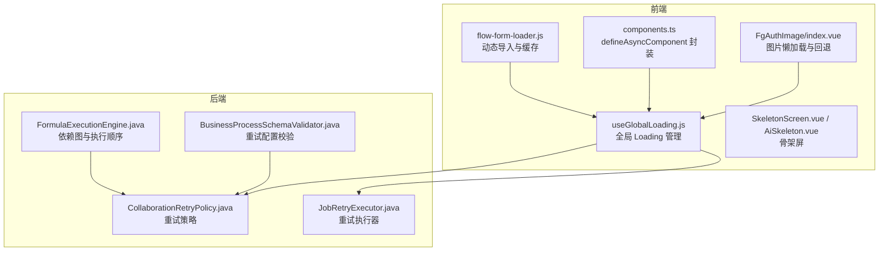
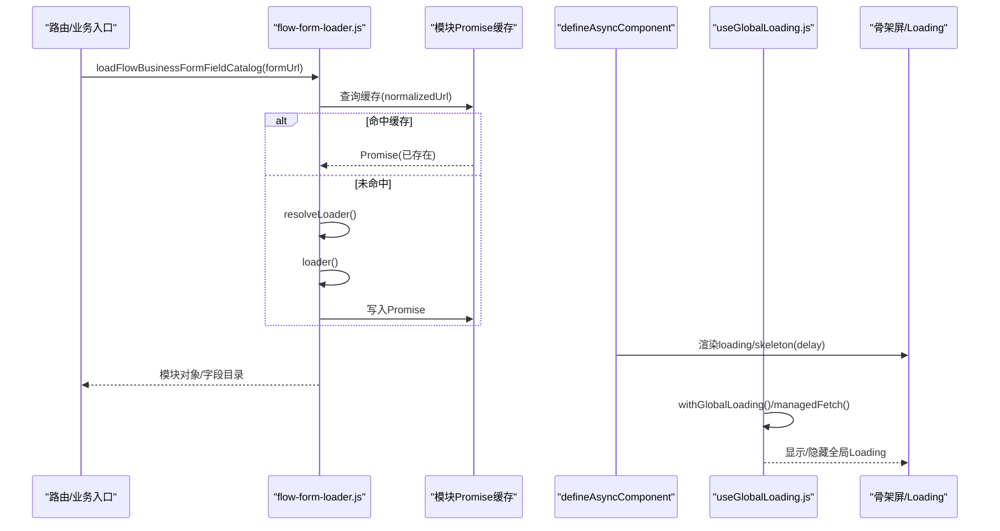
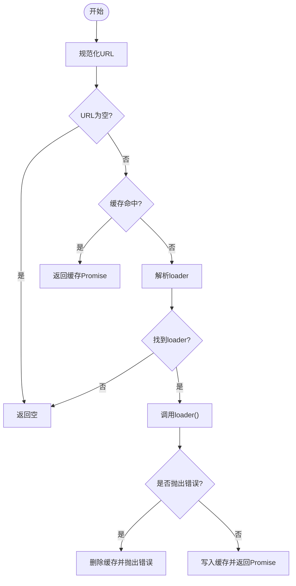
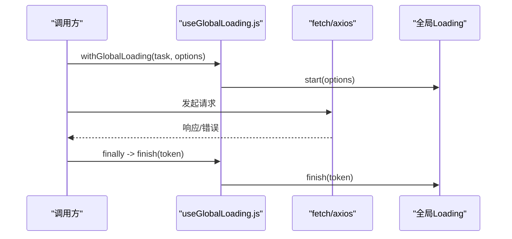
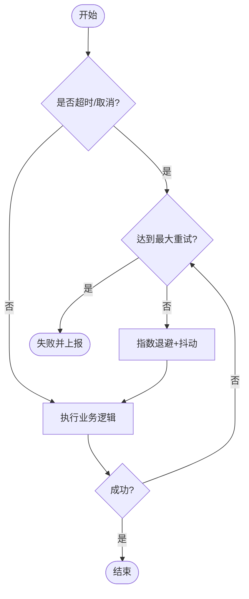
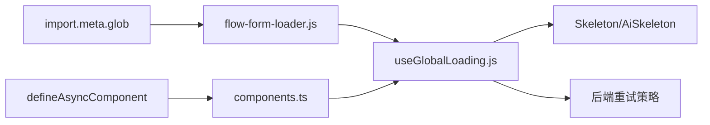

# 异步组件加载器

<cite>
**本文引用的文件**
- [flow-form-loader.js](file://forge-admin-ui/src/utils/flow-form-loader.js)
- [components.ts](file://forge-report-ui/src/utils/components.ts)
- [useGlobalLoading.js](file://forge-admin-ui/src/composables/useGlobalLoading.js)
- [SkeletonScreen.vue](file://forge-admin-ui/src/components/common/SkeletonScreen.vue)
- [AiSkeleton.vue](file://forge-h5-ui/src/components/AiSkeleton.vue)
- [FgAuthImage/index.vue](file://forge-report-ui/src/components/FgAuthImage/index.vue)
- [collaboration-runtime.js](file://forge-admin-ui/src/utils/collaboration-runtime.js)
- [flow-generator.js](file://forge-admin-ui/src/api/flow-generator.js)
- [CollaborationRetryPolicy.java](file://forge-server/forge-framework/forge-plugin-parent/forge-plugin-collaboration/src/main/java/com/mdframe/forge/plugin/collaboration/service/CollaborationRetryPolicy.java)
- [JobRetryExecutor.java](file://forge-server/forge-framework/forge-plugin-parent/forge-plugin-job/src/main/java/com/mdframe/forge/plugin/job/service/JobRetryExecutor.java)
- [FormulaExecutionEngine.java](file://forge-server/forge-framework/forge-plugin-parent/forge-plugin-generator/src/main/java/com/mdframe/forge/plugin/generator/service/formula/FormulaExecutionEngine.java)
- [BusinessProcessSchemaValidator.java](file://forge-server/forge-framework/forge-plugin-parent/forge-plugin-generator/src/main/java/com/mdframe/forge/plugin/generator/businessprocess/validation/BusinessProcessSchemaValidator.java)
</cite>

## 目录
1. [简介](#简介)
2. [项目结构](#项目结构)
3. [核心组件](#核心组件)
4. [架构总览](#架构总览)
5. [详细组件分析](#详细组件分析)
6. [依赖关系分析](#依赖关系分析)
7. [性能考量](#性能考量)
8. [故障排查指南](#故障排查指南)
9. [结论](#结论)
10. [附录](#附录)

## 简介
本技术文档围绕低代码场景下的“异步组件加载器”进行系统化说明，覆盖动态 import、模块预取与缓存、依赖解析、版本兼容、错误恢复、加载进度显示、超时处理与降级策略，并提供统一的异步加载 API 与监控工具建议。内容基于仓库中前端与后端的实际实现进行归纳与可视化，帮助读者快速理解并正确集成该能力。

## 项目结构
本项目在前后端均提供了与“异步加载”相关的能力：
- 前端（Vue）提供：
  - 基于 Vite 的按需动态 import 与模块缓存
  - Vue defineAsyncComponent 封装的异步组件加载器
  - 全局 Loading 状态管理与请求级自动挂载
  - 骨架屏与图片懒加载等体验优化
- 后端（Java）提供：
  - 重试策略（指数退避+抖动）、最大尝试次数控制
  - 依赖图构建与执行顺序保障
  - 配置校验与兼容性约束

**图表来源**
- [flow-form-loader.js:1-78](file://forge-admin-ui/src/utils/flow-form-loader.js#L1-L78)
- [components.ts:1-31](file://forge-report-ui/src/utils/components.ts#L1-L31)
- [useGlobalLoading.js:1-352](file://forge-admin-ui/src/composables/useGlobalLoading.js#L1-L352)
- [SkeletonScreen.vue:38-115](file://forge-admin-ui/src/components/common/SkeletonScreen.vue#L38-L115)
- [AiSkeleton.vue:1-32](file://forge-h5-ui/src/components/AiSkeleton.vue#L1-L32)
- [FgAuthImage/index.vue:66-121](file://forge-report-ui/src/components/FgAuthImage/index.vue#L66-L121)
- [CollaborationRetryPolicy.java:56-93](file://forge-server/forge-framework/forge-plugin-parent/forge-plugin-collaboration/src/main/java/com/mdframe/forge/plugin/collaboration/service/CollaborationRetryPolicy.java#L56-L93)
- [JobRetryExecutor.java:46-66](file://forge-server/forge-framework/forge-plugin-parent/forge-plugin-job/src/main/java/com/mdframe/forge/plugin/job/service/JobRetryExecutor.java#L46-L66)
- [FormulaExecutionEngine.java:126-150](file://forge-server/forge-framework/forge-plugin-parent/forge-plugin-generator/src/main/java/com/mdframe/forge/plugin/generator/service/formula/FormulaExecutionEngine.java#L126-L150)
- [BusinessProcessSchemaValidator.java:289-306](file://forge-server/forge-framework/forge-plugin-parent/forge-plugin-generator/src/main/java/com/mdframe/forge/plugin/generator/businessprocess/validation/BusinessProcessSchemaValidator.java#L289-L306)

**章节来源**
- [flow-form-loader.js:1-78](file://forge-admin-ui/src/utils/flow-form-loader.js#L1-L78)
- [components.ts:1-31](file://forge-report-ui/src/utils/components.ts#L1-L31)
- [useGlobalLoading.js:1-352](file://forge-admin-ui/src/composables/useGlobalLoading.js#L1-L352)

## 核心组件
- 动态模块加载与缓存
  - 通过 Vite 的 import.meta.glob 收集视图模块，按 URL 解析对应 loader，使用 Map 缓存 Promise，避免重复加载。
  - 失败时从缓存剔除，确保后续可重试。
- 异步组件封装
  - 基于 Vue 的 defineAsyncComponent 包装 loader，统一注入 loading/skeleton 组件与延迟策略。
- 全局 Loading 管理
  - 提供 start/finish/clear 接口，支持请求级自动挂载、文本类型推断、最小可见时长、防抖展示与隐藏。
  - 对原生 fetch 返回响应体读取进行拦截，保证大流式数据也能正确结束 Loading。
- 骨架屏与图片懒加载
  - 多形态骨架屏用于表格、表单、图表、仪表盘等场景；移动端提供轻量骨架组件。
  - 图片组件支持懒加载、直链识别、异常回退与事件上报。

**章节来源**
- [flow-form-loader.js:37-68](file://forge-admin-ui/src/utils/flow-form-loader.js#L37-L68)
- [components.ts:17-30](file://forge-report-ui/src/utils/components.ts#L17-L30)
- [useGlobalLoading.js:116-207](file://forge-admin-ui/src/composables/useGlobalLoading.js#L116-L207)
- [useGlobalLoading.js:254-311](file://forge-admin-ui/src/composables/useGlobalLoading.js#L254-L311)
- [SkeletonScreen.vue:38-115](file://forge-admin-ui/src/components/common/SkeletonScreen.vue#L38-L115)
- [AiSkeleton.vue:1-32](file://forge-h5-ui/src/components/AiSkeleton.vue#L1-L32)
- [FgAuthImage/index.vue:74-121](file://forge-report-ui/src/components/FgAuthImage/index.vue#L74-L121)

## 架构总览
下图展示了从页面路由到模块加载、再到全局 Loading 与错误处理的完整链路。

**图表来源**
- [flow-form-loader.js:4-13](file://forge-admin-ui/src/utils/flow-form-loader.js#L4-L13)
- [flow-form-loader.js:37-68](file://forge-admin-ui/src/utils/flow-form-loader.js#L37-L68)
- [components.ts:17-30](file://forge-report-ui/src/utils/components.ts#L17-L30)
- [useGlobalLoading.js:209-252](file://forge-admin-ui/src/composables/useGlobalLoading.js#L209-L252)
- [useGlobalLoading.js:254-311](file://forge-admin-ui/src/composables/useGlobalLoading.js#L254-L311)

## 详细组件分析

### 动态模块加载与缓存（flow-form-loader.js）
- 功能要点
  - 使用 import.meta.glob 收集 @/views/**/*.vue 模块映射。
  - normalizeFormUrl 清洗 URL，resolveLoader 精确或大小写不敏感匹配 loader。
  - 以 normalizedUrl 为键缓存 Promise，失败时删除缓存以便重试。
  - loadFlowBusinessFormFieldCatalog 提取 flowFieldCatalog 并标准化为统一结构。
- 复杂度与性能
  - 查找 loader 时间复杂度近似 O(n)（n 为视图数量），可通过更严格的命名约定或索引优化。
  - Promise 缓存避免重复网络请求，显著降低首屏与二次访问开销。
- 错误处理
  - 捕获 loader 抛错并从缓存移除，防止脏缓存导致后续失败。
- 扩展点
  - 可接入预取策略（如路由进入前预取相邻视图）。
  - 可加入版本化 key（如 hash）以支持热更新与灰度发布。

**图表来源**
- [flow-form-loader.js:37-68](file://forge-admin-ui/src/utils/flow-form-loader.js#L37-L68)

**章节来源**
- [flow-form-loader.js:1-78](file://forge-admin-ui/src/utils/flow-form-loader.js#L1-L78)
- [flow-form-loader.spec.js:1-33](file://forge-admin-ui/src/utils/__tests__/flow-form-loader.spec.js#L1-L33)

### 异步组件封装（components.ts）
- 功能要点
  - 将任意 loader 包装为 Vue 异步组件，统一注入 loading/skeleton 与 delay。
  - 提供 componentInstall 动态注册组件能力。
- 使用建议
  - 结合路由懒加载与 keep-alive 缓存，减少重复加载。
  - 配合全局 Loading 提升整体用户体验。

**章节来源**
- [components.ts:1-31](file://forge-report-ui/src/utils/components.ts#L1-L31)

### 全局 Loading 管理（useGlobalLoading.js）
- 功能要点
  - 提供 start/finish/clear/withGlobalLoading/managedFetch 等 API。
  - 根据 url/method/data 自动推断 loading 文案类型（上传/导出/下载/提交/路由）。
  - 支持跳过标志（headers 中的 X-Skip-Global-Loading）与显式开关。
  - 对 fetch 响应体读取方法进行代理，确保所有读取路径结束后关闭 Loading。
  - 最小可见时长与延迟显示，避免闪烁。
- 与组件联动
  - 与 SkeletonScreen/AiSkeleton 组合，形成“骨架屏 + 全局提示”的体验。
- 监控与诊断
  - 暴露 active/count/message/state 便于外部统计与调试。

**图表来源**
- [useGlobalLoading.js:209-252](file://forge-admin-ui/src/composables/useGlobalLoading.js#L209-L252)
- [useGlobalLoading.js:254-311](file://forge-admin-ui/src/composables/useGlobalLoading.js#L254-L311)

**章节来源**
- [useGlobalLoading.js:1-352](file://forge-admin-ui/src/composables/useGlobalLoading.js#L1-L352)

### 骨架屏与图片懒加载
- 骨架屏
  - 桌面端 SkeletonScreen 支持多种布局（表格/表单/图表/仪表盘），移动端 AiSkeleton 提供轻量骨架。
- 图片懒加载
  - FgAuthImage 支持懒加载、直链判断、异常回退与 load/error 事件，适合大图与鉴权资源。

**章节来源**
- [SkeletonScreen.vue:38-115](file://forge-admin-ui/src/components/common/SkeletonScreen.vue#L38-L115)
- [AiSkeleton.vue:1-32](file://forge-h5-ui/src/components/AiSkeleton.vue#L1-L32)
- [FgAuthImage/index.vue:66-121](file://forge-report-ui/src/components/FgAuthImage/index.vue#L66-L121)

### 超时、重试与降级
- 前端超时与重试
  - collaboration-runtime.js 提供超时归一化与取消检测，便于上层统一处理。
  - flow-generator.js 实现连接中断后的重试流程，包含进度事件与最终失败回调。
- 后端重试策略
  - CollaborationRetryPolicy.java 定义分类重试决策（永久/未授权/Token失效/限流/临时错误），采用指数退避+随机抖动，限制最大尝试次数。
  - JobRetryExecutor.java 提供重试执行器与结果记录。
  - BusinessProcessSchemaValidator.java 校验重试配置合法性（次数范围、退避数组完整性与正值）。
- 依赖解析与执行顺序
  - FormulaExecutionEngine.java 先构建依赖图，检测环路与拓扑序，再按序执行，失败时记录错误并附带 trace。

**图表来源**
- [collaboration-runtime.js:227-258](file://forge-admin-ui/src/utils/collaboration-runtime.js#L227-L258)
- [flow-generator.js:125-148](file://forge-admin-ui/src/api/flow-generator.js#L125-L148)
- [CollaborationRetryPolicy.java:56-93](file://forge-server/forge-framework/forge-plugin-parent/forge-plugin-collaboration/src/main/java/com/mdframe/forge/plugin/collaboration/service/CollaborationRetryPolicy.java#L56-L93)
- [BusinessProcessSchemaValidator.java:289-306](file://forge-server/forge-framework/forge-plugin-parent/forge-plugin-generator/src/main/java/com/mdframe/forge/plugin/generator/businessprocess/validation/BusinessProcessSchemaValidator.java#L289-L306)

**章节来源**
- [collaboration-runtime.js:227-258](file://forge-admin-ui/src/utils/collaboration-runtime.js#L227-L258)
- [flow-generator.js:125-148](file://forge-admin-ui/src/api/flow-generator.js#L125-L148)
- [CollaborationRetryPolicy.java:56-93](file://forge-server/forge-framework/forge-plugin-parent/forge-plugin-collaboration/src/main/java/com/mdframe/forge/plugin/collaboration/service/CollaborationRetryPolicy.java#L56-L93)
- [JobRetryExecutor.java:46-66](file://forge-server/forge-framework/forge-plugin-parent/forge-plugin-job/src/main/java/com/mdframe/forge/plugin/job/service/JobRetryExecutor.java#L46-L66)
- [BusinessProcessSchemaValidator.java:289-306](file://forge-server/forge-framework/forge-plugin-parent/forge-plugin-generator/src/main/java/com/mdframe/forge/plugin/generator/businessprocess/validation/BusinessProcessSchemaValidator.java#L289-L306)
- [FormulaExecutionEngine.java:126-150](file://forge-server/forge-framework/forge-plugin-parent/forge-plugin-generator/src/main/java/com/mdframe/forge/plugin/generator/service/formula/FormulaExecutionEngine.java#L126-L150)

## 依赖关系分析
- 模块依赖
  - flow-form-loader.js 依赖 Vite 的 import.meta.glob 与运行时 Map 缓存。
  - components.ts 依赖 Vue 的 defineAsyncComponent。
  - useGlobalLoading.js 依赖 Vue 响应式状态与 DOM 操作。
- 跨层协作
  - 前端 Loading 与后端重试策略共同保障稳定性：前端负责用户感知与请求生命周期，后端负责容错与幂等性。
- 潜在风险
  - 视图模块过多时 resolveLoader 线性扫描可能成为瓶颈，建议引入索引或严格路径规范。
  - 全局 Loading 需避免被频繁短任务触发造成闪烁，已通过最小可见时长缓解。

**图表来源**
- [flow-form-loader.js:1-78](file://forge-admin-ui/src/utils/flow-form-loader.js#L1-L78)
- [components.ts:1-31](file://forge-report-ui/src/utils/components.ts#L1-L31)
- [useGlobalLoading.js:1-352](file://forge-admin-ui/src/composables/useGlobalLoading.js#L1-L352)

**章节来源**
- [flow-form-loader.js:1-78](file://forge-admin-ui/src/utils/flow-form-loader.js#L1-L78)
- [components.ts:1-31](file://forge-report-ui/src/utils/components.ts#L1-L31)
- [useGlobalLoading.js:1-352](file://forge-admin-ui/src/composables/useGlobalLoading.js#L1-L352)

## 性能考量
- 预取与缓存
  - 利用路由守卫或空闲时机预取相邻视图模块，结合 Promise 缓存减少重复请求。
- 延迟与骨架屏
  - 合理设置 defineAsyncComponent 的 delay 与全局 Loading 的最小可见时长，避免无意义闪烁。
- 大响应体处理
  - 使用 managedFetch 包裹 fetch，确保所有 body 读取完成后关闭 Loading，避免长时间阻塞。
- 后端重试参数
  - 依据业务敏感度配置最大重试次数与退避上限，避免雪崩与资源占用。

[本节为通用指导，无需具体文件引用]

## 故障排查指南
- 常见问题定位
  - 模块未找到：检查 URL 规范化与 resolveLoader 匹配规则，确认 import.meta.glob 是否包含目标路径。
  - 重复加载：确认缓存键是否正确（normalizedUrl），避免 query 参数影响命中。
  - Loading 不消失：检查 managedFetch 的 body 读取是否全部完成，或是否存在未捕获的错误分支。
  - 重试风暴：核对后端重试策略的最大次数与退避配置，必要时增加抖动与限流。
- 诊断建议
  - 使用 useGlobalLoading 暴露的状态进行监控（active/count/message）。
  - 在前端日志中记录关键节点耗时（解析、加载、渲染）。
  - 在后端记录重试决策与退避原因，便于问题回溯。

**章节来源**
- [flow-form-loader.js:37-68](file://forge-admin-ui/src/utils/flow-form-loader.js#L37-L68)
- [useGlobalLoading.js:209-311](file://forge-admin-ui/src/composables/useGlobalLoading.js#L209-L311)
- [CollaborationRetryPolicy.java:56-93](file://forge-server/forge-framework/forge-plugin-parent/forge-plugin-collaboration/src/main/java/com/mdframe/forge/plugin/collaboration/service/CollaborationRetryPolicy.java#L56-L93)

## 结论
本方案通过“动态 import + Promise 缓存 + Vue 异步组件封装 + 全局 Loading 管理”的前端链路，以及“分类重试 + 指数退避 + 依赖图执行”的后端保障，构建了稳定、可观测、可扩展的低代码异步组件加载体系。建议在大规模视图场景下进一步优化模块解析与预取策略，并结合监控指标持续优化用户体验与系统稳定性。

[本节为总结性内容，无需具体文件引用]

## 附录
- 常用 API 速查
  - 动态模块加载：loadFlowBusinessFormFieldCatalog(formUrl)
  - 异步组件封装：loadAsyncComponent(loader)、loadSkeletonAsyncComponent(loader)
  - 全局 Loading：startGlobalLoading(options)、finishGlobalLoading(token)、withGlobalLoading(task, options)、managedFetch(input, init, options)
- 最佳实践
  - 为每个视图模块提供稳定的命名与路径规范，便于解析与缓存命中。
  - 对大体积模块启用懒加载与骨架屏，提升首屏体验。
  - 对不稳定网络环境启用重试与超时保护，并记录关键指标。

[本节为补充信息，无需具体文件引用]