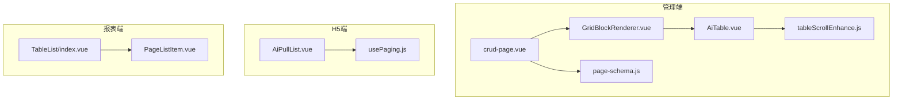
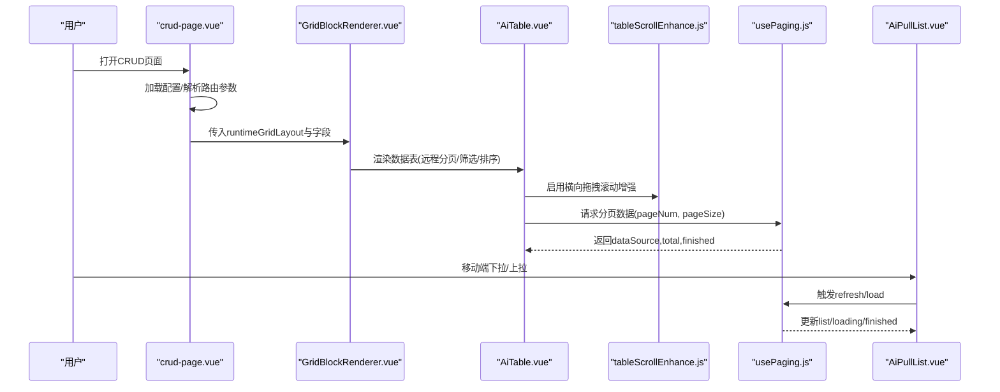
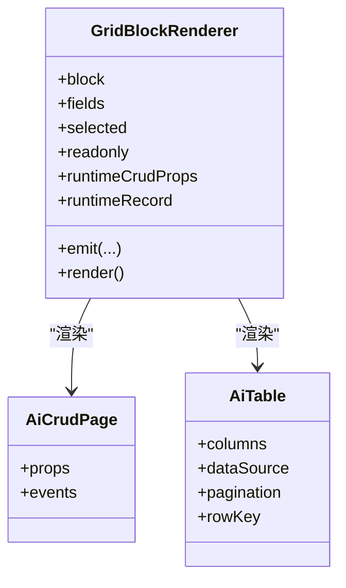
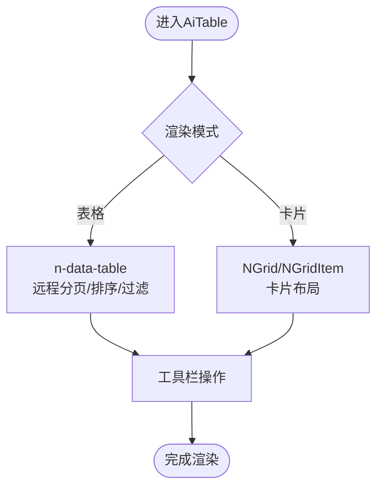
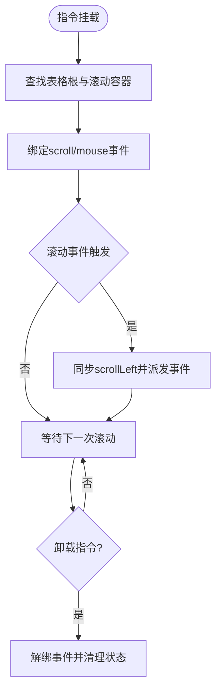
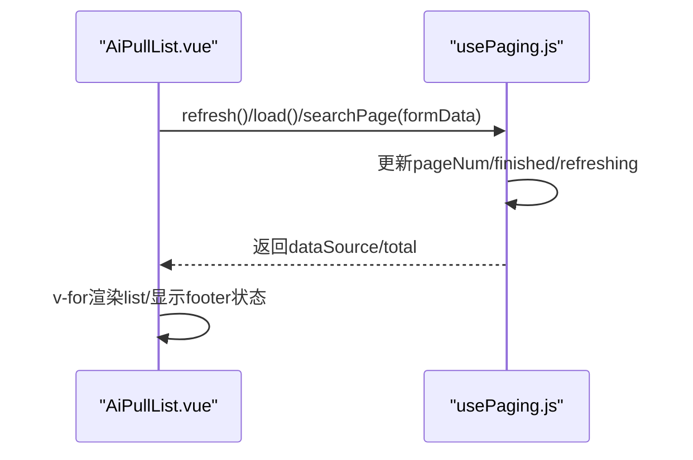
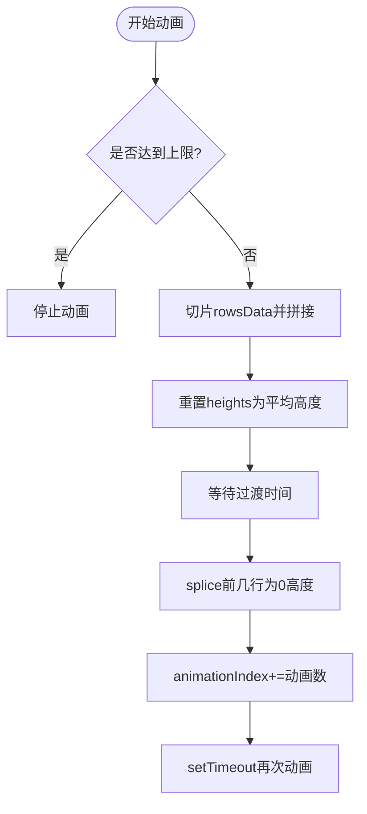
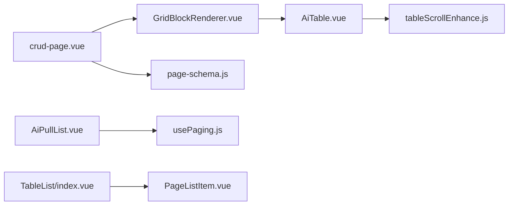

# 循环渲染处理器

<cite>
**本文引用的文件**
- [GridBlockRenderer.vue](file://forge-admin-ui/src/components/lowcode-builder/page/GridBlockRenderer.vue)
- [AiTable.vue](file://forge-admin-ui/src/components/ai-form/AiTable.vue)
- [tableScrollEnhance.js](file://forge-admin-ui/src/directives/modules/tableScrollEnhance.js)
- [usePaging.js](file://forge-h5-ui/src/composables/usePaging.js)
- [AiPullList.vue](file://forge-h5-ui/src/components/AiPullList.vue)
- [PageListItem.vue](file://forge-report-ui/src/views/chart/ContentPages/components/PageListItem.vue)
- [TableList/index.vue](file://forge-report-ui/src/packages/components/Tables/Tables/TableList/index.vue)
- [crud-page.vue](file://forge-admin-ui/src/views/ai/crud-page.vue)
- [page-schema.js](file://forge-admin-ui/src/components/lowcode-builder/page/page-schema.js)
</cite>

## 目录
1. [简介](#简介)
2. [项目结构](#项目结构)
3. [核心组件](#核心组件)
4. [架构总览](#架构总览)
5. [详细组件分析](#详细组件分析)
6. [依赖关系分析](#依赖关系分析)
7. [性能考量](#性能考量)
8. [故障排查指南](#故障排查指南)
9. [结论](#结论)
10. [附录：API与最佳实践](#附录api与最佳实践)

## 简介
本技术文档聚焦于低代码平台的“循环渲染处理器”，围绕列表渲染算法、虚拟滚动实现、数据源适配、索引管理、状态同步机制，以及嵌套循环、条件过滤、分页加载等能力展开。文档同时给出大数据集处理、内存优化与用户体验提升的实践建议，并总结循环渲染相关 API 的使用方式。

## 项目结构
仓库中涉及循环渲染的关键模块分布在三个子应用中：
- 管理端前端（forge-admin-ui）：提供低代码页面构建器与运行时渲染，包含网格块渲染器、表格封装、滚动增强指令、CRUD 页面入口与页面 Schema 工具。
- H5 移动端（forge-h5-ui）：提供下拉刷新与分页拉取组合式函数及通用列表容器。
- 报表端（forge-report-ui）：提供轮播/滚动列表动画与展示组件。

图表来源
- [GridBlockRenderer.vue:143-441](file://forge-admin-ui/src/components/lowcode-builder/page/GridBlockRenderer.vue#L143-L441)
- [AiTable.vue:48-172](file://forge-admin-ui/src/components/ai-form/AiTable.vue#L48-L172)
- [tableScrollEnhance.js:116-254](file://forge-admin-ui/src/directives/modules/tableScrollEnhance.js#L116-L254)
- [crud-page.vue:1-39](file://forge-admin-ui/src/views/ai/crud-page.vue#L1-L39)
- [page-schema.js:1635-1675](file://forge-admin-ui/src/components/lowcode-builder/page/page-schema.js#L1635-L1675)
- [AiPullList.vue:1-57](file://forge-h5-ui/src/components/AiPullList.vue#L1-L57)
- [usePaging.js:1-62](file://forge-h5-ui/src/composables/usePaging.js#L1-L62)
- [TableList/index.vue:103-135](file://forge-report-ui/src/packages/components/Tables/Tables/TableList/index.vue#L103-L135)
- [PageListItem.vue](file://forge-report-ui/src/views/chart/ContentPages/components/PageListItem.vue)

章节来源
- [GridBlockRenderer.vue:143-441](file://forge-admin-ui/src/components/lowcode-builder/page/GridBlockRenderer.vue#L143-L441)
- [AiTable.vue:48-172](file://forge-admin-ui/src/components/ai-form/AiTable.vue#L48-L172)
- [tableScrollEnhance.js:116-254](file://forge-admin-ui/src/directives/modules/tableScrollEnhance.js#L116-L254)
- [crud-page.vue:1-39](file://forge-admin-ui/src/views/ai/crud-page.vue#L1-L39)
- [page-schema.js:1635-1675](file://forge-admin-ui/src/components/lowcode-builder/page/page-schema.js#L1635-L1675)
- [AiPullList.vue:1-57](file://forge-h5-ui/src/components/AiPullList.vue#L1-L57)
- [usePaging.js:1-62](file://forge-h5-ui/src/composables/usePaging.js#L1-L62)
- [TableList/index.vue:103-135](file://forge-report-ui/src/packages/components/Tables/Tables/TableList/index.vue#L103-L135)
- [PageListItem.vue](file://forge-report-ui/src/views/chart/ContentPages/components/PageListItem.vue)

## 核心组件
- GridBlockRenderer：低代码页面网格块渲染器，负责根据 blockType 渲染查询表单、工具栏、数据表、详情、树面板、栅格布局等；在 data-table 与 AiCrudPage/AiTable 场景下承载循环渲染与分页/筛选/排序等交互。
- AiTable：基于 n-data-table 的表格封装，支持远程分页、列设置、密度切换、全屏、卡片模式、选择与展开行、排序与过滤等。
- tableScrollEnhance：表格横向拖拽滚动增强指令，统一多容器滚动同步，避免抖动与重复事件。
- usePaging + AiPullList：H5 端的分页组合式函数与下拉列表容器，封装了首次加载、刷新、加载更多、空态/错误态、骨架屏等。
- TableList（报表端）：滚动/轮播列表动画逻辑，维护可见行数与高度数组，控制动画节奏与停止。
- crud-page：运行时 CRUD 页面入口，解析配置、选择模板或降级到 AiCrudPage，并驱动 ListPageGridDesigner 渲染。
- page-schema：低代码页面 Schema 生成与默认值填充，为 data-table/AiCrudPage/AiTable 等块提供默认字段与属性。

章节来源
- [GridBlockRenderer.vue:143-441](file://forge-admin-ui/src/components/lowcode-builder/page/GridBlockRenderer.vue#L143-L441)
- [AiTable.vue:48-172](file://forge-admin-ui/src/components/ai-form/AiTable.vue#L48-L172)
- [tableScrollEnhance.js:116-254](file://forge-admin-ui/src/directives/modules/tableScrollEnhance.js#L116-L254)
- [usePaging.js:1-62](file://forge-h5-ui/src/composables/usePaging.js#L1-L62)
- [AiPullList.vue:1-57](file://forge-h5-ui/src/components/AiPullList.vue#L1-L57)
- [TableList/index.vue:103-135](file://forge-report-ui/src/packages/components/Tables/Tables/TableList/index.vue#L103-L135)
- [crud-page.vue:1-39](file://forge-admin-ui/src/views/ai/crud-page.vue#L1-L39)
- [page-schema.js:1635-1675](file://forge-admin-ui/src/components/lowcode-builder/page/page-schema.js#L1635-L1675)

## 架构总览
循环渲染处理器由“配置驱动 + 组件渲染 + 数据流”三部分构成：
- 配置层：通过 page-schema 生成区块（block）与默认属性，确定渲染模式（data-table/AiCrudPage/AiTable）、分页、筛选、排序、列定义等。
- 渲染层：GridBlockRenderer 按 blockType 分发渲染；AiTable 提供高性能表格渲染；tableScrollEnhance 增强滚动体验。
- 数据层：crud-page 加载运行时配置；usePaging 提供分页拉取；AiPullList 提供移动端列表容器；报表端 TableList 提供滚动/轮播动画。

图表来源
- [crud-page.vue:1-39](file://forge-admin-ui/src/views/ai/crud-page.vue#L1-L39)
- [GridBlockRenderer.vue:143-441](file://forge-admin-ui/src/components/lowcode-builder/page/GridBlockRenderer.vue#L143-L441)
- [AiTable.vue:48-172](file://forge-admin-ui/src/components/ai-form/AiTable.vue#L48-L172)
- [tableScrollEnhance.js:116-254](file://forge-admin-ui/src/directives/modules/tableScrollEnhance.js#L116-L254)
- [usePaging.js:1-62](file://forge-h5-ui/src/composables/usePaging.js#L1-L62)
- [AiPullList.vue:1-57](file://forge-h5-ui/src/components/AiPullList.vue#L1-L57)

## 详细组件分析

### 组件A：GridBlockRenderer（低代码网格块渲染器）
- 职责：根据 blockType 渲染不同区块；对 data-table、AiCrudPage、AiTable 等数据区块进行渲染与状态绑定；支持嵌套栅格布局与子区块递归渲染。
- 关键点：
  - 数据区块渲染：data-table 使用示例数据预览；AiCrudPage/AiTable 在运行时注入 props（如 rowKey、columns、searchSchema、pagination 等）。
  - 嵌套布局：grid-layout 内可放置多个子区块，支持拖拽、选中、菜单操作与尺寸调整。
  - 运行时上下文：传递 runtimeRecord、runtimeCrudProps、loading 等状态，保证设计态与运行态一致。

图表来源
- [GridBlockRenderer.vue:143-441](file://forge-admin-ui/src/components/lowcode-builder/page/GridBlockRenderer.vue#L143-L441)
- [AiTable.vue:48-172](file://forge-admin-ui/src/components/ai-form/AiTable.vue#L48-L172)

章节来源
- [GridBlockRenderer.vue:143-441](file://forge-admin-ui/src/components/lowcode-builder/page/GridBlockRenderer.vue#L143-L441)

### 组件B：AiTable（表格封装）
- 职责：封装 n-data-table，提供远程分页、列设置、密度切换、全屏、卡片模式、选择与展开行、排序与过滤等。
- 关键点：
  - 远程分页：通过 paginationProps 与 dataSource 联动，支持服务端分页。
  - 列与内容：支持自定义列渲染、卡片模式下的标题/正文/动作列。
  - 交互：工具栏集成刷新、密度、列过滤、搜索切换、全屏等。

图表来源
- [AiTable.vue:48-172](file://forge-admin-ui/src/components/ai-form/AiTable.vue#L48-L172)

章节来源
- [AiTable.vue:48-172](file://forge-admin-ui/src/components/ai-form/AiTable.vue#L48-L172)

### 组件C：tableScrollEnhance（表格滚动增强指令）
- 职责：为表格提供横向拖拽滚动能力，并同步多个容器的 scrollLeft，避免抖动与重复事件。
- 关键点：
  - 容器收集：查找表格根节点及其内部所有可水平滚动的容器。
  - 滚动同步：监听 scroll 事件，将源容器 scrollLeft 同步到其他容器，必要时派发 scroll 事件。
  - 生命周期：mounted/updated/unmounted 中绑定/解绑事件，清理状态。

图表来源
- [tableScrollEnhance.js:116-254](file://forge-admin-ui/src/directives/modules/tableScrollEnhance.js#L116-L254)

章节来源
- [tableScrollEnhance.js:116-254](file://forge-admin-ui/src/directives/modules/tableScrollEnhance.js#L116-L254)

### 组件D：usePaging + AiPullList（H5分页与列表容器）
- 职责：usePaging 提供分页状态与请求方法；AiPullList 提供下拉刷新、上拉加载、空态/错误态/骨架屏等 UI。
- 关键点：
  - 分页状态：pageNum、pageSize、total、dataSource、finished、refreshing。
  - 请求流程：refresh 重置并请求第一页；load 递增页码继续加载；searchPage 合并查询参数后重新请求。
  - 列表容器：v-for 渲染 list，key 使用 itemKey 或 index；监听 scrolltolower 触发 load。

图表来源
- [usePaging.js:1-62](file://forge-h5-ui/src/composables/usePaging.js#L1-L62)
- [AiPullList.vue:1-57](file://forge-h5-ui/src/components/AiPullList.vue#L1-L57)

章节来源
- [usePaging.js:1-62](file://forge-h5-ui/src/composables/usePaging.js#L1-L62)
- [AiPullList.vue:1-57](file://forge-h5-ui/src/components/AiPullList.vue#L1-L57)

### 组件E：TableList（报表端滚动/轮播）
- 职责：维护 rowsData、heights、animationIndex，控制滚动/轮播动画节奏与停止。
- 关键点：
  - 动画循环：根据 rowNum 与 carousel 模式计算每次滚动的行数，更新 heights 以产生过渡效果。
  - 停止控制：通过 updater 版本号与 clearTimeout 停止动画。

图表来源
- [TableList/index.vue:103-135](file://forge-report-ui/src/packages/components/Tables/Tables/TableList/index.vue#L103-L135)

章节来源
- [TableList/index.vue:103-135](file://forge-report-ui/src/packages/components/Tables/Tables/TableList/index.vue#L103-L135)

### 组件F：crud-page（运行时CRUD入口）
- 职责：加载运行时配置，选择模板或降级到 AiCrudPage；驱动 ListPageGridDesigner 渲染运行时网格。
- 关键点：
  - 配置解析：读取 renderConfig、modelSchema、pageSchema，计算 activeRuntimePage/gridLayout。
  - 渲染策略：标准列表页必须渲染真实 CRUD 组件；非标准列表可使用设计态网格预览。

章节来源
- [crud-page.vue:1-39](file://forge-admin-ui/src/views/ai/crud-page.vue#L1-L39)

### 组件G：page-schema（页面Schema生成）
- 职责：为不同 blockType 生成默认字段引用与属性，确保 data-table/AiCrudPage/AiTable 等具备可用默认配置。
- 关键点：
  - search-form：默认 fieldRefs 与 collapsible。
  - data-table：默认 fieldRefs、默认排序字段与顺序。
  - AiCrudPage/AiTable：默认列与工具栏开关、分页等。

章节来源
- [page-schema.js:1635-1675](file://forge-admin-ui/src/components/lowcode-builder/page/page-schema.js#L1635-L1675)

## 依赖关系分析
- GridBlockRenderer 依赖 AiTable 与 AiCrudPage 进行数据区块渲染，并通过 page-schema 提供的默认配置初始化区块。
- AiTable 依赖 tableScrollEnhance 指令增强横向滚动体验。
- crud-page 作为运行时入口，聚合配置与渲染策略，驱动 GridBlockRenderer。
- H5 端 AiPullList 与 usePaging 协作，提供移动端列表与分页能力。
- 报表端 TableList 独立实现滚动/轮播动画，供报表页面使用。

图表来源
- [crud-page.vue:1-39](file://forge-admin-ui/src/views/ai/crud-page.vue#L1-L39)
- [GridBlockRenderer.vue:143-441](file://forge-admin-ui/src/components/lowcode-builder/page/GridBlockRenderer.vue#L143-L441)
- [AiTable.vue:48-172](file://forge-admin-ui/src/components/ai-form/AiTable.vue#L48-L172)
- [tableScrollEnhance.js:116-254](file://forge-admin-ui/src/directives/modules/tableScrollEnhance.js#L116-L254)
- [page-schema.js:1635-1675](file://forge-admin-ui/src/components/lowcode-builder/page/page-schema.js#L1635-L1675)
- [AiPullList.vue:1-57](file://forge-h5-ui/src/components/AiPullList.vue#L1-L57)
- [usePaging.js:1-62](file://forge-h5-ui/src/composables/usePaging.js#L1-L62)
- [TableList/index.vue:103-135](file://forge-report-ui/src/packages/components/Tables/Tables/TableList/index.vue#L103-L135)
- [PageListItem.vue](file://forge-report-ui/src/views/chart/ContentPages/components/PageListItem.vue)

章节来源
- [crud-page.vue:1-39](file://forge-admin-ui/src/views/ai/crud-page.vue#L1-L39)
- [GridBlockRenderer.vue:143-441](file://forge-admin-ui/src/components/lowcode-builder/page/GridBlockRenderer.vue#L143-L441)
- [AiTable.vue:48-172](file://forge-admin-ui/src/components/ai-form/AiTable.vue#L48-L172)
- [tableScrollEnhance.js:116-254](file://forge-admin-ui/src/directives/modules/tableScrollEnhance.js#L116-L254)
- [page-schema.js:1635-1675](file://forge-admin-ui/src/components/lowcode-builder/page/page-schema.js#L1635-L1675)
- [AiPullList.vue:1-57](file://forge-h5-ui/src/components/AiPullList.vue#L1-L57)
- [usePaging.js:1-62](file://forge-h5-ui/src/composables/usePaging.js#L1-L62)
- [TableList/index.vue:103-135](file://forge-report-ui/src/packages/components/Tables/Tables/TableList/index.vue#L103-L135)
- [PageListItem.vue](file://forge-report-ui/src/views/chart/ContentPages/components/PageListItem.vue)

## 性能考量
- 列表渲染算法
  - 分页加载：优先采用服务端分页（AiTable 的 remote 分页），减少首屏数据量与渲染压力。
  - 虚拟滚动：对于超大列表，建议在表格或列表容器中启用虚拟滚动（如 n-data-table 的 flex-height/max-height 与虚拟化能力），结合 tableScrollEnhance 提升横向滚动体验。
- 内存优化
  - 合理设置 rowKey：确保稳定且唯一，避免不必要的重渲染与内存泄漏。
  - 控制 visibleRows：在报表端 TableList 中仅维护可见行的高度与数据切片，降低 DOM 与 JS 对象数量。
  - 去抖与节流：滚动与搜索输入应做防抖/节流，减少频繁请求与重排。
- 用户体验
  - 骨架屏与空态：在首次加载与无数据时提供友好反馈（AiPullList 已内置 skeleton/empty/error 插槽）。
  - 加载状态：分页加载时显示 loading 与 finished 提示，避免误触重复请求。
  - 滚动增强：启用 tableScrollEnhance 提升表格横向拖拽体验，避免卡顿与错位。

[本节为通用性能指导，不直接分析具体文件]

## 故障排查指南
- 列表不刷新或分页异常
  - 检查 usePaging 的 pageNum/finished 状态是否正确更新；确认 postMethodsList 的请求参数与响应结构是否符合预期。
  - 核对 AiPullList 的 lowerThreshold 与 loading/finished 状态，避免重复触发 load。
- 表格滚动卡顿或错位
  - 确认 tableScrollEnhance 已正确挂载到表格根节点；检查是否存在多个滚动容器导致同步失败。
  - 若表格高度动态变化，需触发 refreshTableState 以重新计算溢出状态。
- 渲染空白或数据未显示
  - 检查 GridBlockRenderer 的 resolvedFields 与 columns 是否正确生成；确认 page-schema 的默认字段引用是否生效。
  - 在 crud-page 中确认 renderConfig 与 modelSchema 已正确加载，activeRuntimePage/gridLayout 解析无误。

章节来源
- [usePaging.js:1-62](file://forge-h5-ui/src/composables/usePaging.js#L1-L62)
- [AiPullList.vue:1-57](file://forge-h5-ui/src/components/AiPullList.vue#L1-L57)
- [tableScrollEnhance.js:116-254](file://forge-admin-ui/src/directives/modules/tableScrollEnhance.js#L116-L254)
- [GridBlockRenderer.vue:143-441](file://forge-admin-ui/src/components/lowcode-builder/page/GridBlockRenderer.vue#L143-L441)
- [page-schema.js:1635-1675](file://forge-admin-ui/src/components/lowcode-builder/page/page-schema.js#L1635-L1675)
- [crud-page.vue:1-39](file://forge-admin-ui/src/views/ai/crud-page.vue#L1-L39)

## 结论
循环渲染处理器通过“配置驱动 + 组件化渲染 + 数据流管理”实现了高效、可扩展的列表渲染能力。管理端以 GridBlockRenderer 为核心，结合 AiTable 与 tableScrollEnhance 提供高性能表格体验；H5 端通过 AiPullList 与 usePaging 提供移动端分页与交互；报表端 TableList 提供滚动/轮播动画。整体架构清晰、职责分明，便于在不同端复用与扩展。

[本节为总结性内容，不直接分析具体文件]

## 附录：API与最佳实践
- 循环渲染 API（管理端）
  - GridBlockRenderer：通过 blockType 区分渲染区块；data-table/AiCrudPage/AiTable 支持 columns、rowKey、searchSchema、pagination 等属性。
  - AiTable：支持 remote 分页、列设置、密度切换、全屏、卡片模式、选择与展开行、排序与过滤。
  - tableScrollEnhance：指令形式启用横向拖拽滚动增强，自动同步多容器滚动位置。
- 分页与列表 API（H5端）
  - usePaging：提供 refresh/load/searchPage 方法，管理 pageNum/pageSize/total/dataSource/finished/refreshing。
  - AiPullList：提供下拉刷新、上拉加载、骨架屏、空态、错误态插槽；监听 scrolltolower 触发 load。
- 最佳实践
  - 大数据集：优先服务端分页；在表格中启用虚拟化与 max-height；控制 visibleRows 与缓存。
  - 内存优化：稳定 rowKey；避免深层嵌套与复杂计算；及时解绑事件与定时器。
  - 用户体验：合理使用骨架屏与空态；明确 loading/finished 状态；启用滚动增强提升交互流畅度。
  - 条件过滤与嵌套循环：在 page-schema 中为 search-form 配置默认字段；在 GridBlockRenderer 中通过 grid-layout 嵌套子区块实现复杂布局。

章节来源
- [GridBlockRenderer.vue:143-441](file://forge-admin-ui/src/components/lowcode-builder/page/GridBlockRenderer.vue#L143-L441)
- [AiTable.vue:48-172](file://forge-admin-ui/src/components/ai-form/AiTable.vue#L48-L172)
- [tableScrollEnhance.js:116-254](file://forge-admin-ui/src/directives/modules/tableScrollEnhance.js#L116-L254)
- [usePaging.js:1-62](file://forge-h5-ui/src/composables/usePaging.js#L1-L62)
- [AiPullList.vue:1-57](file://forge-h5-ui/src/components/AiPullList.vue#L1-L57)
- [page-schema.js:1635-1675](file://forge-admin-ui/src/components/lowcode-builder/page/page-schema.js#L1635-L1675)