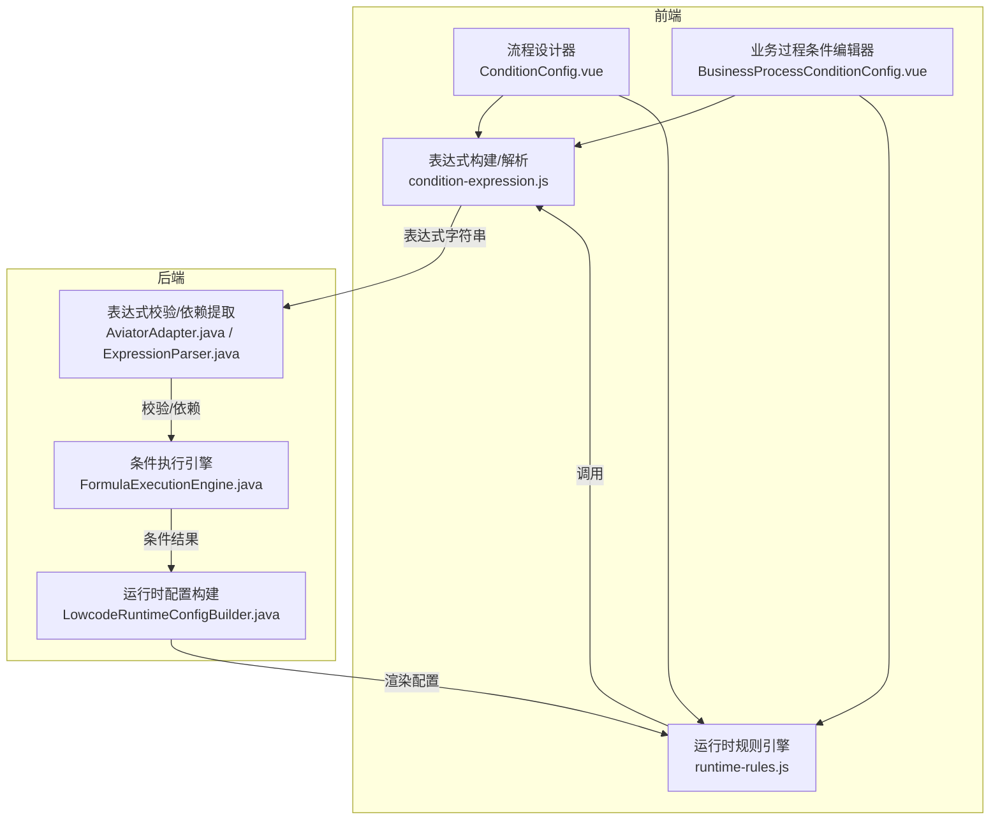
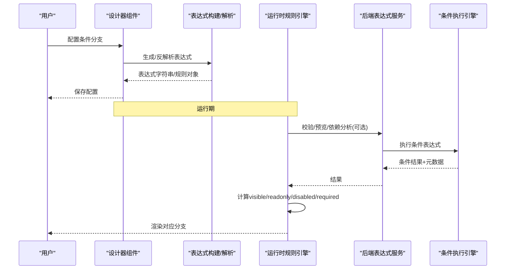
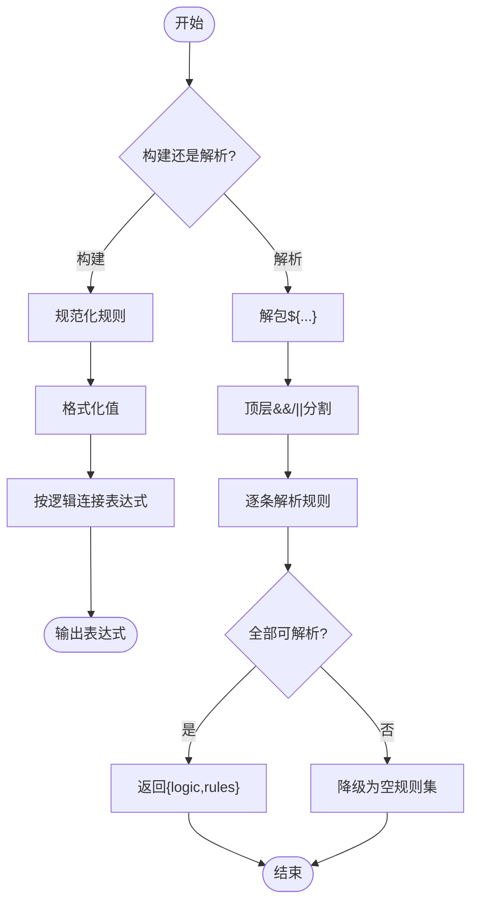
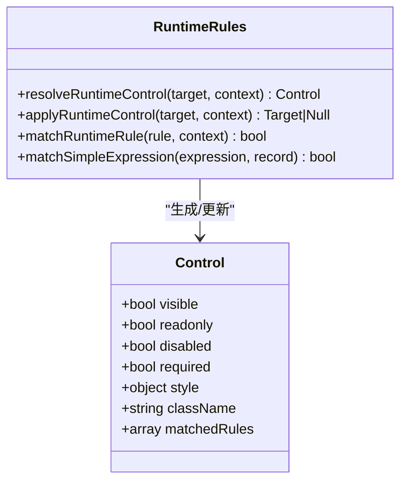
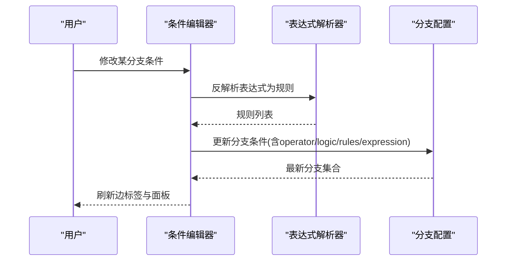
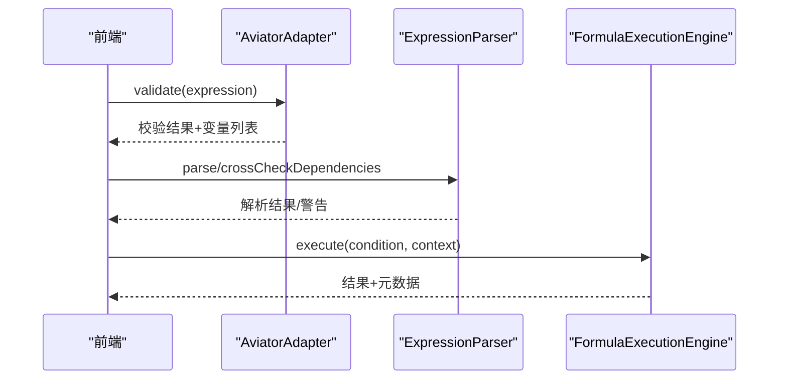
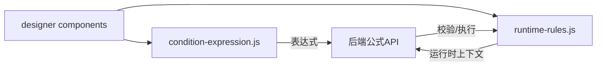

# 条件渲染引擎

<cite>
**本文引用的文件**
- [condition-expression.js](file://forge-admin-ui/src/components/flow-designer/panel/condition-expression.js)
- [runtime-rules.js](file://forge-admin-ui/src/components/lowcode-builder/shared/runtime-rules.js)
- [BusinessProcessConditionConfig.vue](file://forge-admin-ui/src/components/business-process-designer/BusinessProcessConditionConfig.vue)
- [ConditionConfig.vue](file://forge-admin-ui/src/components/flow-designer/panel/ConditionConfig.vue)
- [formula.js](file://forge-admin-ui/src/api/formula.js)
- [AviatorAdapter.java](file://forge-server/forge-framework/forge-plugin-parent/forge-plugin-generator/src/main/java/com/mdframe/forge/plugin/generator/domain/formula/AviatorAdapter.java)
- [ExpressionParser.java](file://forge-server/forge-framework/forge-plugin-parent/forge-plugin-generator/src/main/java/com/mdframe/forge/plugin/generator/domain/formula/ExpressionParser.java)
- [FormulaExecutionEngine.java](file://forge-server/forge-framework/forge-plugin-parent/forge-plugin-generator/src/main/java/com/mdframe/forge/plugin/generator/service/formula/FormulaExecutionEngine.java)
- [LowcodeRuntimeConfigBuilder.java](file://forge-server/forge-framework/forge-plugin-parent/forge-plugin-generator/src/main/java/com/mdframe/forge/plugin/generator/service/lowcode/LowcodeRuntimeConfigBuilder.java)
</cite>

## 目录
1. [简介](#简介)
2. [项目结构](#项目结构)
3. [核心组件](#核心组件)
4. [架构总览](#架构总览)
5. [详细组件分析](#详细组件分析)
6. [依赖关系分析](#依赖关系分析)
7. [性能考虑](#性能考虑)
8. [故障排查指南](#故障排查指南)
9. [结论](#结论)
10. [附录：API与调试工具](#附录api与调试工具)

## 简介
本技术文档围绕低代码条件渲染引擎，系统性说明条件表达式解析、渲染分支选择、变量作用域与数据绑定机制，并给出条件缓存、懒加载与渲染冲突解决策略。同时提供条件渲染 API 与调试工具的使用建议，覆盖条件测试、性能分析与故障排查。

## 项目结构
条件渲染能力横跨前端设计器、运行时规则引擎与后端公式执行引擎：
- 前端设计器侧负责可视化编辑条件、生成/反解析表达式、维护分支配置。
- 前端运行侧基于运行时规则计算可见性、禁用/只读等控制属性，驱动渲染分支选择。
- 后端公式引擎负责表达式语法校验、依赖提取、条件执行与结果回写。

**图表来源**
- [ConditionConfig.vue:317-382](file://forge-admin-ui/src/components/flow-designer/panel/ConditionConfig.vue#L317-L382)
- [BusinessProcessConditionConfig.vue:40-125](file://forge-admin-ui/src/components/business-process-designer/BusinessProcessConditionConfig.vue#L40-L125)
- [condition-expression.js:56-84](file://forge-admin-ui/src/components/flow-designer/panel/condition-expression.js#L56-L84)
- [runtime-rules.js:21-84](file://forge-admin-ui/src/components/lowcode-builder/shared/runtime-rules.js#L21-L84)
- [AviatorAdapter.java:88-115](file://forge-server/forge-framework/forge-plugin-parent/forge-plugin-generator/src/main/java/com/mdframe/forge/plugin/generator/domain/formula/AviatorAdapter.java#L88-L115)
- [ExpressionParser.java:30-79](file://forge-server/forge-framework/forge-plugin-parent/forge-plugin-generator/src/main/java/com/mdframe/forge/plugin/generator/domain/formula/ExpressionParser.java#L30-L79)
- [FormulaExecutionEngine.java:276-299](file://forge-server/forge-framework/forge-plugin-parent/forge-plugin-generator/src/main/java/com/mdframe/forge/plugin/generator/service/formula/FormulaExecutionEngine.java#L276-L299)
- [LowcodeRuntimeConfigBuilder.java:2588-2616](file://forge-server/forge-framework/forge-plugin-parent/forge-plugin-generator/src/main/java/com/mdframe/forge/plugin/generator/service/lowcode/LowcodeRuntimeConfigBuilder.java#L2588-L2616)

**章节来源**
- [condition-expression.js:1-320](file://forge-admin-ui/src/components/flow-designer/panel/condition-expression.js#L1-L320)
- [runtime-rules.js:1-300](file://forge-admin-ui/src/components/lowcode-builder/shared/runtime-rules.js#L1-L300)
- [BusinessProcessConditionConfig.vue:40-227](file://forge-admin-ui/src/components/business-process-designer/BusinessProcessConditionConfig.vue#L40-L227)
- [ConditionConfig.vue:317-382](file://forge-admin-ui/src/components/flow-designer/panel/ConditionConfig.vue#L317-L382)
- [AviatorAdapter.java:88-115](file://forge-server/forge-framework/forge-plugin-parent/forge-plugin-generator/src/main/java/com/mdframe/forge/plugin/generator/domain/formula/AviatorAdapter.java#L88-L115)
- [ExpressionParser.java:1-79](file://forge-server/forge-framework/forge-plugin-parent/forge-plugin-generator/src/main/java/com/mdframe/forge/plugin/generator/domain/formula/ExpressionParser.java#L1-L79)
- [FormulaExecutionEngine.java:276-299](file://forge-server/forge-framework/forge-plugin-parent/forge-plugin-generator/src/main/java/com/mdframe/forge/plugin/generator/service/formula/FormulaExecutionEngine.java#L276-L299)
- [LowcodeRuntimeRuntimeConfigBuilder.java:2588-2616](file://forge-server/forge-framework/forge-plugin-parent/forge-plugin-generator/src/main/java/com/mdframe/forge/plugin/generator/service/lowcode/LowcodeRuntimeConfigBuilder.java#L2588-L2616)

## 核心组件
- 表达式构建与解析（前端）
  - 将“字段 + 操作符 + 值”的规则序列化为表达式字符串，支持 AND/OR 逻辑、区间、包含/不包含、空/非空等。
  - 支持将表达式反解析为规则，便于在编辑器中回显与二次编辑。
- 运行时规则引擎（前端）
  - 根据运行时上下文（表单数据、路由、用户信息等）计算控件的 visible/readonly/disabled/required 等状态。
  - 支持简单表达式匹配、分组条件、whenUnmatched 默认态控制。
- 后端表达式与条件执行
  - 使用 Aviator 进行表达式编译与变量提取，提供语法校验与依赖分析。
  - 条件执行引擎根据条件表达式求值，写入目标字段或返回元数据用于追踪。
- 运行时配置构建（后端）
  - 扫描页面 schema，识别具有可见性规则的字段，参与运行时渲染决策。

**章节来源**
- [condition-expression.js:56-84](file://forge-admin-ui/src/components/flow-designer/panel/condition-expression.js#L56-L84)
- [runtime-rules.js:21-84](file://forge-admin-ui/src/components/lowcode-builder/shared/runtime-rules.js#L21-L84)
- [AviatorAdapter.java:88-115](file://forge-server/forge-framework/forge-plugin-parent/forge-plugin-generator/src/main/java/com/mdframe/forge/plugin/generator/domain/formula/AviatorAdapter.java#L88-L115)
- [ExpressionParser.java:30-79](file://forge-server/forge-framework/forge-plugin-parent/forge-plugin-generator/src/main/java/com/mdframe/forge/plugin/generator/domain/formula/ExpressionParser.java#L30-L79)
- [FormulaExecutionEngine.java:276-299](file://forge-server/forge-framework/forge-plugin-parent/forge-plugin-generator/src/main/java/com/mdframe/forge/plugin/generator/service/formula/FormulaExecutionEngine.java#L276-L299)
- [LowcodeRuntimeConfigBuilder.java:2588-2616](file://forge-server/forge-framework/forge-plugin-parent/forge-plugin-generator/src/main/java/com/mdframe/forge/plugin/generator/service/lowcode/LowcodeRuntimeConfigBuilder.java#L2588-L2616)

## 架构总览
条件渲染从“设计期”到“运行期”的完整链路如下：
- 设计期：用户在流程设计器或业务过程条件编辑器中通过可视化界面配置条件，系统自动生成表达式并持久化。
- 运行期：前端运行时规则引擎读取运行时上下文，计算控件可见性与行为；后端公式引擎对复杂表达式进行校验、依赖分析与执行，并将结果注入上下文或目标字段。

**图表来源**
- [BusinessProcessConditionConfig.vue:114-125](file://forge-admin-ui/src/components/business-process-designer/BusinessProcessConditionConfig.vue#L114-L125)
- [condition-expression.js:56-84](file://forge-admin-ui/src/components/flow-designer/panel/condition-expression.js#L56-L84)
- [runtime-rules.js:21-84](file://forge-admin-ui/src/components/lowcode-builder/shared/runtime-rules.js#L21-L84)
- [AviatorAdapter.java:88-115](file://forge-server/forge-framework/forge-plugin-parent/forge-plugin-generator/src/main/java/com/mdframe/forge/plugin/generator/domain/formula/AviatorAdapter.java#L88-L115)
- [FormulaExecutionEngine.java:276-299](file://forge-server/forge-framework/forge-plugin-parent/forge-plugin-generator/src/main/java/com/mdframe/forge/plugin/generator/service/formula/FormulaExecutionEngine.java#L276-L299)

## 详细组件分析

### 表达式构建与解析（前端）
- 功能要点
  - 数据类型归一化：将不同组件类型映射为 number/boolean/datetime/enum/string，确保值格式化正确。
  - 规则标准化：统一操作符别名（如 neq→ne、gte→ge），保证前后端一致。
  - 表达式生成：按 AND/OR 逻辑拼接子表达式，输出 ${...} 包裹的模板表达式。
  - 表达式解析：安全拆分顶层 && 与 ||，识别 empty/notEmpty/between/contains/notContains/二元比较，还原为规则对象。
- 复杂度与边界
  - 顶层分割避免括号内误切分，时间复杂度 O(n)。
  - 值格式化针对数字/布尔/字符串分别处理，防止注入与类型错误。
- 优化点
  - 字段元信息 Map 复用，减少重复计算。
  - 解析失败时降级为空规则集，保障 UI 稳定性。

**图表来源**
- [condition-expression.js:56-84](file://forge-admin-ui/src/components/flow-designer/panel/condition-expression.js#L56-L84)
- [condition-expression.js:86-133](file://forge-admin-ui/src/components/flow-designer/panel/condition-expression.js#L86-L133)
- [condition-expression.js:161-194](file://forge-admin-ui/src/components/flow-designer/panel/condition-expression.js#L161-L194)
- [condition-expression.js:196-319](file://forge-admin-ui/src/components/flow-designer/panel/condition-expression.js#L196-L319)

**章节来源**
- [condition-expression.js:1-320](file://forge-admin-ui/src/components/flow-designer/panel/condition-expression.js#L1-L320)

### 运行时规则引擎（前端）
- 功能要点
  - 构建运行时上下文：合并 record/row/formData/data/route/user 等。
  - 规则匹配：支持 groups/conditions 的 any/all 模式，支持 whenUnmatched 默认态。
  - 效果应用：visible/hidden/readonly/disabled/required/style/className 等。
  - 简单表达式匹配：支持 in/!=/==/>=/<=/>/< 等，自动归一化操作符。
- 作用域与数据绑定
  - source 支持 record/query/params/route/user/formData/row 等，path 支持点路径取值。
  - expected 支持 field 来源或固定值。
- 冲突解决
  - 后生效的规则覆盖前序 effect；当 readonly=true 时强制 disabled=true。
  - vIf 函数/布尔值优先于规则计算的 visible。

**图表来源**
- [runtime-rules.js:21-84](file://forge-admin-ui/src/components/lowcode-builder/shared/runtime-rules.js#L21-L84)
- [runtime-rules.js:119-154](file://forge-admin-ui/src/components/lowcode-builder/shared/runtime-rules.js#L119-L154)
- [runtime-rules.js:165-182](file://forge-admin-ui/src/components/lowcode-builder/shared/runtime-rules.js#L165-L182)
- [runtime-rules.js:206-230](file://forge-admin-ui/src/components/lowcode-builder/shared/runtime-rules.js#L206-L230)
- [runtime-rules.js:232-266](file://forge-admin-ui/src/components/lowcode-builder/shared/runtime-rules.js#L232-L266)

**章节来源**
- [runtime-rules.js:1-300](file://forge-admin-ui/src/components/lowcode-builder/shared/runtime-rules.js#L1-L300)

### 设计器条件编辑与分支管理
- 可视化编辑
  - 支持添加/删除分支、设置逻辑（AND/OR）、选择字段与操作符、输入值与区间值。
  - 自动生成表达式并回写至分支配置；支持表达式反解析为规则以便再次编辑。
- 分支标签与摘要
  - 边标签显示“条件已设/N 条条件/默认/配置条件”，避免 SVG 层重复渲染文本。
- 约束与保护
  - 限制最大分支数，默认分支不参与 Flowable 导出条件。

**图表来源**
- [BusinessProcessConditionConfig.vue:114-125](file://forge-admin-ui/src/components/business-process-designer/BusinessProcessConditionConfig.vue#L114-L125)
- [BusinessProcessConditionConfig.vue:54-79](file://forge-admin-ui/src/components/business-process-designer/BusinessProcessConditionConfig.vue#L54-L79)
- [ConditionConfig.vue:317-382](file://forge-admin-ui/src/components/flow-designer/panel/ConditionConfig.vue#L317-L382)

**章节来源**
- [BusinessProcessConditionConfig.vue:40-227](file://forge-admin-ui/src/components/business-process-designer/BusinessProcessConditionConfig.vue#L40-L227)
- [ConditionConfig.vue:317-382](file://forge-admin-ui/src/components/flow-designer/panel/ConditionConfig.vue#L317-L382)

### 后端表达式与条件执行
- 表达式校验与依赖提取
  - 使用 Aviator 编译表达式，提取变量名，返回结构化校验结果。
  - 对比声明依赖与实际变量，提示缺失或冗余依赖。
- 条件执行
  - 读取条件配置，执行表达式得到布尔标志，选择 true/false 值写入上下文或结果。
  - 记录 conditionResult/conditionMatched/trueValue/falseValue 等元数据，便于追踪。
- 运行时配置构建
  - 扫描页面 schema，识别带可见性规则的字段，决定是否参与运行时可见性判断。

**图表来源**
- [AviatorAdapter.java:88-115](file://forge-server/forge-framework/forge-plugin-parent/forge-plugin-generator/src/main/java/com/mdframe/forge/plugin/generator/domain/formula/AviatorAdapter.java#L88-L115)
- [ExpressionParser.java:30-79](file://forge-server/forge-framework/forge-plugin-parent/forge-plugin-generator/src/main/java/com/mdframe/forge/plugin/generator/domain/formula/ExpressionParser.java#L30-L79)
- [FormulaExecutionEngine.java:276-299](file://forge-server/forge-framework/forge-plugin-parent/forge-plugin-generator/src/main/java/com/mdframe/forge/plugin/generator/service/formula/FormulaExecutionEngine.java#L276-L299)

**章节来源**
- [AviatorAdapter.java:88-115](file://forge-server/forge-framework/forge-plugin-parent/forge-plugin-generator/src/main/java/com/mdframe/forge/plugin/generator/domain/formula/AviatorAdapter.java#L88-L115)
- [ExpressionParser.java:1-79](file://forge-server/forge-framework/forge-plugin-parent/forge-plugin-generator/src/main/java/com/mdframe/forge/plugin/generator/domain/formula/ExpressionParser.java#L1-L79)
- [FormulaExecutionEngine.java:276-299](file://forge-server/forge-framework/forge-plugin-parent/forge-plugin-generator/src/main/java/com/mdframe/forge/plugin/generator/service/formula/FormulaExecutionEngine.java#L276-L299)
- [LowcodeRuntimeConfigBuilder.java:2588-2616](file://forge-server/forge-framework/forge-plugin-parent/forge-plugin-generator/src/main/java/com/mdframe/forge/plugin/generator/service/lowcode/LowcodeRuntimeConfigBuilder.java#L2588-L2616)

## 依赖关系分析
- 前端模块耦合
  - 设计器组件依赖表达式构建/解析模块，以生成/反解析表达式。
  - 运行时规则引擎独立于设计器，但共享同一套操作符与值比较语义。
- 前后端契约
  - 前端生成的表达式由后端 Aviator 引擎校验与执行，需保持操作符与值类型一致。
  - 后端返回的条件执行结果与元数据可用于前端调试与审计。
- 外部依赖
  - Aviator 表达式引擎：负责编译与变量提取。
  - 请求封装：前端通过统一的 request 工具访问后端公式 API。

**图表来源**
- [formula.js:1-84](file://forge-admin-ui/src/api/formula.js#L1-L84)
- [condition-expression.js:56-84](file://forge-admin-ui/src/components/flow-designer/panel/condition-expression.js#L56-L84)
- [runtime-rules.js:21-84](file://forge-admin-ui/src/components/lowcode-builder/shared/runtime-rules.js#L21-L84)

**章节来源**
- [formula.js:1-84](file://forge-admin-ui/src/api/formula.js#L1-L84)
- [condition-expression.js:56-84](file://forge-admin-ui/src/components/flow-designer/panel/condition-expression.js#L56-L84)
- [runtime-rules.js:21-84](file://forge-admin-ui/src/components/lowcode-builder/shared/runtime-rules.js#L21-L84)

## 性能考虑
- 表达式解析与构建
  - 顶层分割算法线性时间，避免正则回溯风险；括号与引号感知，提升鲁棒性。
  - 字段元信息 Map 复用，减少重复转换。
- 运行时规则计算
  - 规则按顺序遍历，命中即应用 effect；可通过 whenUnmatched 减少无效计算。
  - 简单表达式匹配采用轻量级字符串解析，避免昂贵计算。
- 后端执行
  - Aviator 编译表达式并缓存变量名，降低重复开销。
  - 条件执行附带元数据，便于定位热点与瓶颈。
- 建议
  - 将复杂条件拆分为多个简单规则，降低单次计算成本。
  - 对高频变化的字段，结合事件驱动局部重算，避免全量刷新。
  - 利用后端依赖分析接口，提前发现未声明依赖导致的额外计算。

[本节为通用性能指导，不直接分析具体文件]

## 故障排查指南
- 表达式语法错误
  - 现象：设计器保存失败或运行时异常。
  - 排查：使用后端表达式校验接口获取错误位置与消息；检查操作符与值类型是否匹配。
- 依赖不一致
  - 现象：运行时变量未定义或计算结果为空。
  - 排查：使用依赖分析接口对比声明依赖与实际变量，补齐缺失依赖或删除冗余依赖。
- 条件不生效
  - 现象：字段未按预期显示/隐藏或行为异常。
  - 排查：检查 whenUnmatched 默认态、vIf 优先级、source/path 是否正确；确认运行时上下文数据是否存在。
- 分支选择异常
  - 现象：流程分支进入错误节点。
  - 排查：查看条件执行元数据（conditionResult/conditionMatched），核对表达式与上下文值。

**章节来源**
- [AviatorAdapter.java:88-115](file://forge-server/forge-framework/forge-plugin-parent/forge-plugin-generator/src/main/java/com/mdframe/forge/plugin/generator/domain/formula/AviatorAdapter.java#L88-L115)
- [ExpressionParser.java:30-79](file://forge-server/forge-framework/forge-plugin-parent/forge-plugin-generator/src/main/java/com/mdframe/forge/plugin/generator/domain/formula/ExpressionParser.java#L30-L79)
- [FormulaExecutionEngine.java:276-299](file://forge-server/forge-framework/forge-plugin-parent/forge-plugin-generator/src/main/java/com/mdframe/forge/plugin/generator/service/formula/FormulaExecutionEngine.java#L276-L299)
- [runtime-rules.js:165-182](file://forge-admin-ui/src/components/lowcode-builder/shared/runtime-rules.js#L165-L182)

## 结论
该条件渲染引擎在设计期提供直观的可视化编辑能力，在运行期通过轻量规则引擎与后端表达式执行形成闭环。通过表达式构建/解析、运行时规则计算与后端校验执行的协同，实现了高可用、可扩展的条件渲染体系。配合调试工具与性能优化策略，可有效支撑复杂业务场景下的动态展示与交互需求。

[本节为总结性内容，不直接分析具体文件]

## 附录：API与调试工具
- 前端公式 API
  - 表达式校验：POST /api/ai/business/formula/validate
  - 表达式预览：POST /api/ai/business/formula/preview
  - 依赖分析：POST /api/ai/business/formula/dependency
  - 调试执行：POST /api/ai/business/formula/debug
  - 日志查询：GET /api/ai/business/formula/log/page、GET /api/ai/business/formula/log/{id}
  - 依赖图：POST /api/ai/business/formula/dependency/graph
  - 规则编译/校验：POST /api/ai/business/formula/rule/compile、POST /api/ai/business/formula/rule/validate
  - 函数市场：GET /api/ai/business/formula/functions、分页/详情/安装/启用/禁用等
- 使用建议
  - 设计期：优先使用规则编译/校验接口，确保表达式合法且依赖完整。
  - 运行期：使用调试接口获取执行轨迹与元数据，快速定位问题。
  - 性能：结合依赖图分析热点依赖，减少不必要的计算与网络请求。

**章节来源**
- [formula.js:1-84](file://forge-admin-ui/src/api/formula.js#L1-L84)