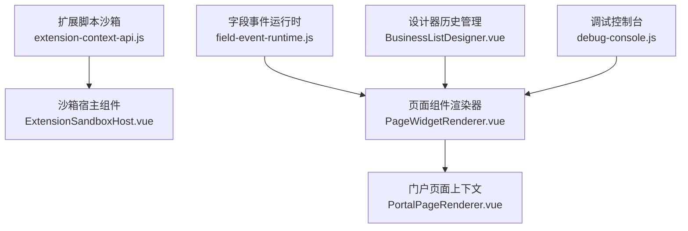
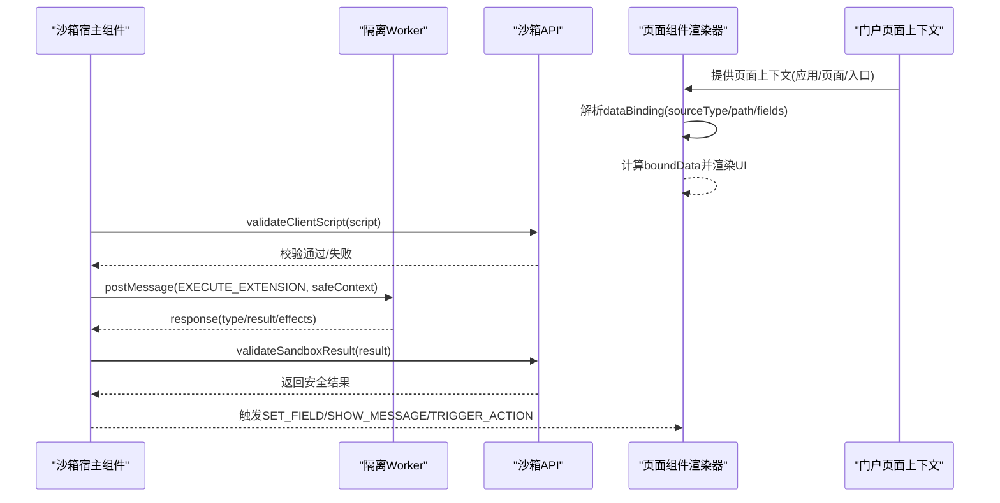
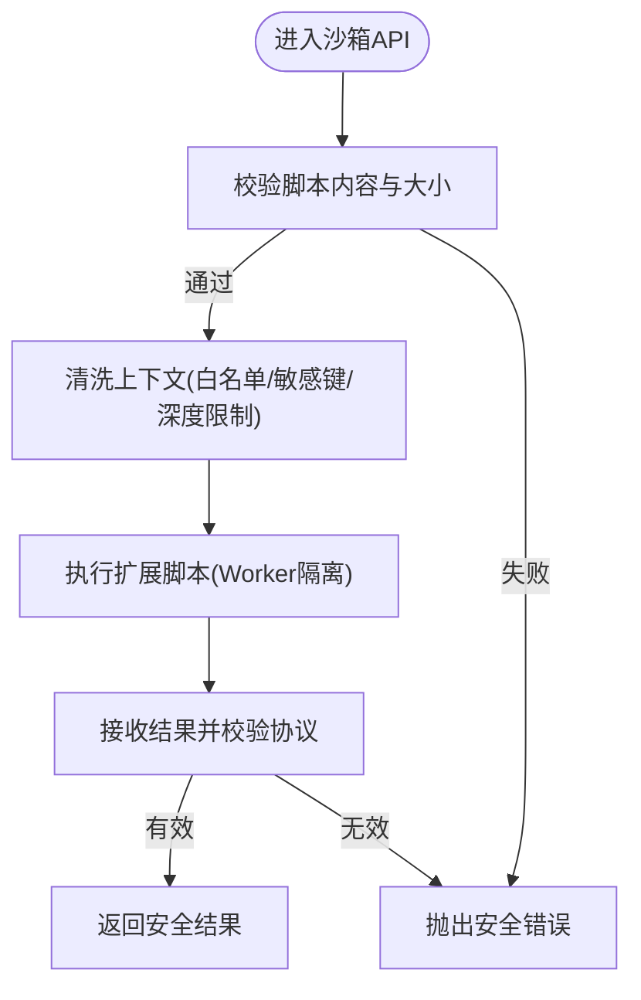
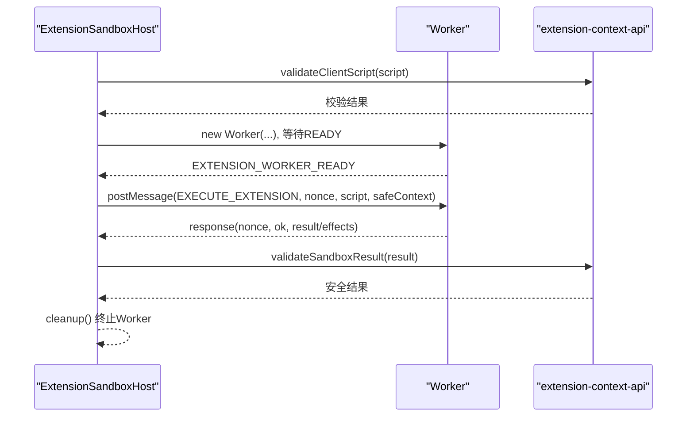
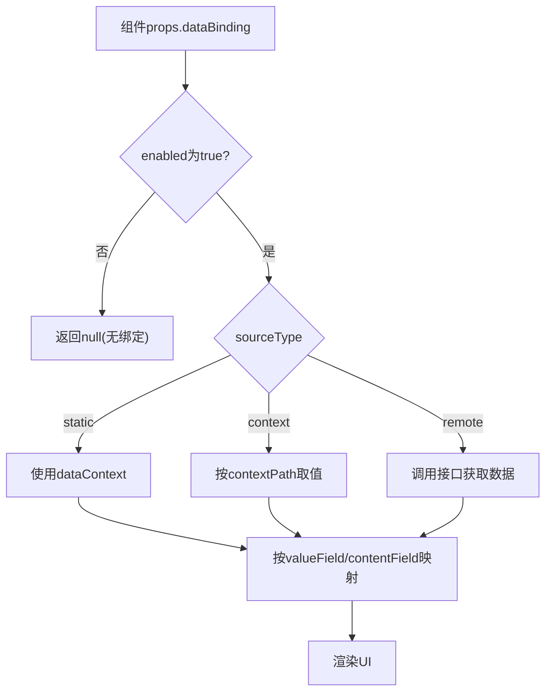
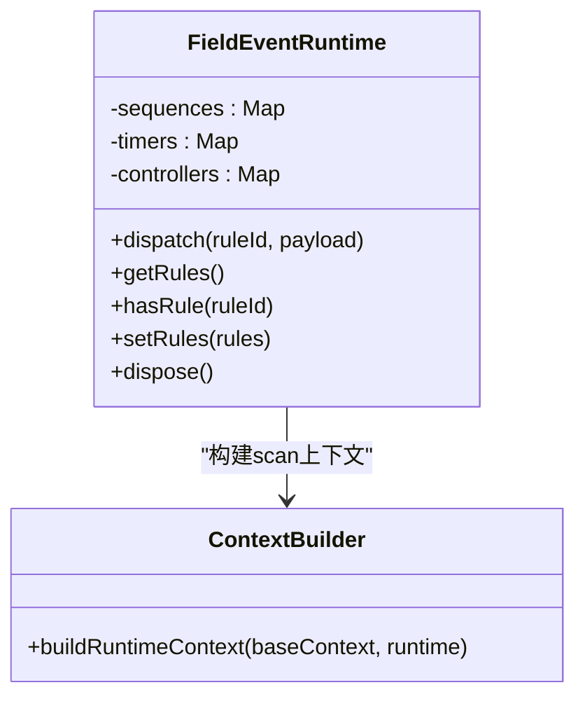
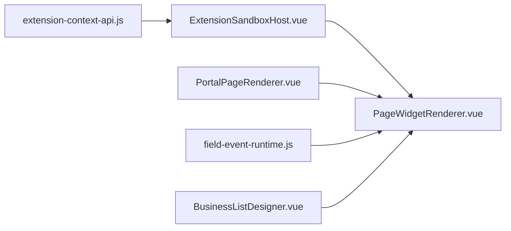

# 渲染上下文管理

<cite>
**本文引用的文件**
- [extension-context-api.js](file://forge-admin-ui/src/components/lowcode-extension/js/extension-context-api.js)
- [ExtensionSandboxHost.vue](file://forge-admin-ui/src/components/lowcode-extension/js/ExtensionSandboxHost.vue)
- [PageWidgetRenderer.vue](file://forge-admin-ui/src/components/lowcode-builder/shared/PageWidgetRenderer.vue)
- [PortalPageRenderer.vue](file://forge-admin-ui/src/views/app-center/components/portal/PortalPageRenderer.vue)
- [field-event-runtime.js](file://forge-admin-ui/src/components/ai-form/field-event-runtime.js)
- [BusinessListDesigner.vue](file://forge-admin-ui/src/views/app-center/components/designer/BusinessListDesigner.vue)
- [debug-console.js](file://forge-admin-ui/src/utils/debug-console.js)
</cite>

## 目录
1. [简介](#简介)
2. [项目结构](#项目结构)
3. [核心组件](#核心组件)
4. [架构总览](#架构总览)
5. [详细组件分析](#详细组件分析)
6. [依赖关系分析](#依赖关系分析)
7. [性能考虑](#性能考虑)
8. [故障排查指南](#故障排查指南)
9. [结论](#结论)
10. [附录](#附录)

## 简介
本技术文档聚焦低代码平台的“渲染上下文管理”，围绕上下文传递机制、作用域隔离与安全沙箱设计展开，系统说明数据绑定、事件冒泡与状态同步策略，并给出上下文继承、变更监听与性能优化建议。同时提供上下文管理 API 与调试工具的使用指引，包括状态可视化、变更追踪与常见问题的诊断方法。

## 项目结构
与渲染上下文相关的前端实现主要分布在以下模块：
- 扩展脚本沙箱与上下文安全：位于 lowcode-extension/js 目录，负责客户端脚本的安全校验、上下文清洗、结果协议校验以及 Worker 隔离执行。
- 页面组件渲染与数据绑定：位于 lowcode-builder/shared 目录，负责组件级数据绑定解析、远程数据加载与上下文路径取值。
- 门户页面运行时上下文：位于 app-center/components/portal 目录，负责页面级上下文构造与作用域样式注入。
- 表单字段事件运行时：位于 ai-form 目录，负责字段事件规则的执行、上下文构建与生命周期管理。
- 设计器历史与状态快照：位于 designer 目录，用于设计态的 schema 变更历史与撤销重做。
- 调试工具：utils 目录下的调试控制台，辅助定位上下文与事件问题。

**图表来源**
- [extension-context-api.js:1-220](file://forge-admin-ui/src/components/lowcode-extension/js/extension-context-api.js#L1-L220)
- [ExtensionSandboxHost.vue:1-198](file://forge-admin-ui/src/components/lowcode-extension/js/ExtensionSandboxHost.vue#L1-L198)
- [PageWidgetRenderer.vue:718-745](file://forge-admin-ui/src/components/lowcode-builder/shared/PageWidgetRenderer.vue#L718-L745)
- [PortalPageRenderer.vue:90-112](file://forge-admin-ui/src/views/app-center/components/portal/PortalPageRenderer.vue#L90-L112)
- [field-event-runtime.js:252-308](file://forge-admin-ui/src/components/ai-form/field-event-runtime.js#L252-L308)
- [BusinessListDesigner.vue:2044-2077](file://forge-admin-ui/src/views/app-center/components/designer/BusinessListDesigner.vue#L2044-L2077)
- [debug-console.js](file://forge-admin-ui/src/utils/debug-console.js)

**章节来源**
- [extension-context-api.js:1-220](file://forge-admin-ui/src/components/lowcode-extension/js/extension-context-api.js#L1-L220)
- [ExtensionSandboxHost.vue:1-198](file://forge-admin-ui/src/components/lowcode-extension/js/ExtensionSandboxHost.vue#L1-L198)
- [PageWidgetRenderer.vue:718-745](file://forge-admin-ui/src/components/lowcode-builder/shared/PageWidgetRenderer.vue#L718-L745)
- [PortalPageRenderer.vue:90-112](file://forge-admin-ui/src/views/app-center/components/portal/PortalPageRenderer.vue#L90-L112)
- [field-event-runtime.js:252-308](file://forge-admin-ui/src/components/ai-form/field-event-runtime.js#L252-L308)
- [BusinessListDesigner.vue:2044-2077](file://forge-admin-ui/src/views/app-center/components/designer/BusinessListDesigner.vue#L2044-L2077)
- [debug-console.js](file://forge-admin-ui/src/utils/debug-console.js)

## 核心组件
- 扩展脚本沙箱 API（extension-context-api.js）
  - 职责：对客户端脚本进行安全校验、上下文清洗、结果协议校验与深度限制，确保扩展代码在受限环境中运行。
  - 关键点：禁止危险关键字与全局对象访问；仅允许白名单字段与动作；限制输出大小与嵌套深度；严格 effect 类型白名单。
- 沙箱宿主组件（ExtensionSandboxHost.vue）
  - 职责：创建并管理隔离 Worker，封装执行生命周期、超时控制、错误格式化与结果验证。
  - 关键点：启动超时与执行超时保护；nonce 防重放；统一错误阶段标注；清理资源避免泄漏。
- 页面组件渲染器（PageWidgetRenderer.vue）
  - 职责：解析组件的数据绑定配置，支持静态、上下文与远程三种数据源；根据路径取值与字段映射渲染 UI。
  - 关键点：dataBinding.enabled/sourceType/dataPath/contextPath/valueField/contentField 等配置项；远程数据加载与错误提示；watch 驱动刷新。
- 门户页面上下文（PortalPageRenderer.vue）
  - 职责：构造页面级上下文（应用、页面、入口信息），并基于该上下文生成作用域样式扩展。
  - 关键点：上下文键值稳定；样式按 id 去重与过滤空内容。
- 字段事件运行时（field-event-runtime.js）
  - 职责：编排字段事件规则执行，维护序列号与控制器，构建扫描运行时上下文，并在销毁时取消挂起任务。
  - 关键点：nextSequence/isCurrent 保证并发安全；dispose 清理定时器与控制器；buildRuntimeContext 合并 scan 上下文。
- 设计器历史管理（BusinessListDesigner.vue）
  - 职责：记录 schema 变更历史，支持撤销/重做，限制历史长度，避免重复记录。
  - 关键点：pushHistorySnapshot/undoSchema/redoSchema；外部更新不重复入栈。

**章节来源**
- [extension-context-api.js:1-220](file://forge-admin-ui/src/components/lowcode-extension/js/extension-context-api.js#L1-L220)
- [ExtensionSandboxHost.vue:1-198](file://forge-admin-ui/src/components/lowcode-extension/js/ExtensionSandboxHost.vue#L1-L198)
- [PageWidgetRenderer.vue:718-745](file://forge-admin-ui/src/components/lowcode-builder/shared/PageWidgetRenderer.vue#L718-L745)
- [PortalPageRenderer.vue:90-112](file://forge-admin-ui/src/views/app-center/components/portal/PortalPageRenderer.vue#L90-L112)
- [field-event-runtime.js:252-308](file://forge-admin-ui/src/components/ai-form/field-event-runtime.js#L252-L308)
- [BusinessListDesigner.vue:2044-2077](file://forge-admin-ui/src/views/app-center/components/designer/BusinessListDesigner.vue#L2044-L2077)

## 架构总览
渲染上下文管理由“安全沙箱 + 数据绑定 + 事件编排 + 页面上下文”四部分协同完成：
- 安全沙箱：通过 Worker 隔离执行扩展脚本，使用白名单上下文与严格的结果协议，防止越权与资源滥用。
- 数据绑定：组件层根据 dataBinding 配置从上下文或远程接口获取数据，并按路径与字段映射渲染。
- 事件编排：字段事件运行时统一管理规则执行顺序、并发控制与上下文构建，保障状态一致性。
- 页面上下文：门户层提供稳定的应用/页面/入口标识，支撑作用域样式与扩展能力。

**图表来源**
- [ExtensionSandboxHost.vue:27-124](file://forge-admin-ui/src/components/lowcode-extension/js/ExtensionSandboxHost.vue#L27-L124)
- [extension-context-api.js:42-96](file://forge-admin-ui/src/components/lowcode-extension/js/extension-context-api.js#L42-L96)
- [PageWidgetRenderer.vue:718-745](file://forge-admin-ui/src/components/lowcode-builder/shared/PageWidgetRenderer.vue#L718-L745)
- [PortalPageRenderer.vue:90-112](file://forge-admin-ui/src/views/app-center/components/portal/PortalPageRenderer.vue#L90-L112)

## 详细组件分析

### 扩展脚本沙箱 API
- 安全校验
  - 禁止模板字符串与转义标识符，限制脚本字节大小。
  - 剥离注释与字符串后扫描危险关键字与全局对象，阻止跨域与持久化存储访问。
- 上下文清洗
  - 仅保留白名单字段与可写字段，过滤敏感键名，限制数组长度与对象深度。
  - 规范化 allowedActions 与 allowedWritableFields，确保只暴露必要能力。
- 结果协议
  - 仅允许 SET_FIELD、SHOW_MESSAGE、TRIGGER_ACTION 三类 effect。
  - 限制输出字节大小，拒绝保留键与过深嵌套。

**图表来源**
- [extension-context-api.js:42-96](file://forge-admin-ui/src/components/lowcode-extension/js/extension-context-api.js#L42-L96)
- [extension-context-api.js:98-196](file://forge-admin-ui/src/components/lowcode-extension/js/extension-context-api.js#L98-L196)

**章节来源**
- [extension-context-api.js:1-220](file://forge-admin-ui/src/components/lowcode-extension/js/extension-context-api.js#L1-L220)

### 沙箱宿主组件（Worker 隔离执行）
- 生命周期
  - 创建 Worker 并等待 READY，设置启动超时。
  - 发送 EXECUTE_EXTENSION 消息，设置执行超时。
  - 处理 EXTENSION_WORKER_FATAL 与 messageerror，统一错误阶段标注。
  - 清理定时器与终止 Worker，避免资源泄漏。
- 安全与健壮性
  - nonce 防重放，确保响应匹配请求。
  - 最大输出字节限制，防止内存与带宽滥用。
  - 错误消息脱敏，隐藏敏感信息。

**图表来源**
- [ExtensionSandboxHost.vue:27-124](file://forge-admin-ui/src/components/lowcode-extension/js/ExtensionSandboxHost.vue#L27-L124)
- [extension-context-api.js:42-96](file://forge-admin-ui/src/components/lowcode-extension/js/extension-context-api.js#L42-L96)

**章节来源**
- [ExtensionSandboxHost.vue:1-198](file://forge-admin-ui/src/components/lowcode-extension/js/ExtensionSandboxHost.vue#L1-L198)
- [extension-context-api.js:1-220](file://forge-admin-ui/src/components/lowcode-extension/js/extension-context-api.js#L1-L220)

### 页面组件数据绑定与上下文取值
- 数据源选择
  - static：直接使用 props.dataContext。
  - context：从 dataContext 中按 contextPath 取值。
  - remote：调用远程接口获取数据，缓存到 remoteBindingData。
- 字段映射
  - valueField/contentField/labelField/titleField/descriptionField/metaField 等，支持对象与数组两种数据结构。
- 错误与加载状态
  - bindingLoading/bindingError 提示加载状态与错误信息。
  - watch 监听 dataBinding 配置变化，自动重新加载。

**图表来源**
- [PageWidgetRenderer.vue:718-745](file://forge-admin-ui/src/components/lowcode-builder/shared/PageWidgetRenderer.vue#L718-L745)
- [PageWidgetRenderer.vue:678-716](file://forge-admin-ui/src/components/lowcode-builder/shared/PageWidgetRenderer.vue#L678-L716)

**章节来源**
- [PageWidgetRenderer.vue:718-745](file://forge-admin-ui/src/components/lowcode-builder/shared/PageWidgetRenderer.vue#L718-L745)
- [PageWidgetRenderer.vue:678-716](file://forge-admin-ui/src/components/lowcode-builder/shared/PageWidgetRenderer.vue#L678-L716)

### 门户页面上下文与作用域样式
- 上下文构造
  - applicationId/applicationCode/pageId/entryId 作为稳定标识。
- 作用域样式
  - 基于 extension 列表与页面上下文生成 scopedCss，按 id 去重并过滤空内容。
- 集成点
  - 将 scopedCssExtensions 注入页面渲染流程，实现页面级样式隔离。

**章节来源**
- [PortalPageRenderer.vue:90-112](file://forge-admin-ui/src/views/app-center/components/portal/PortalPageRenderer.vue#L90-L112)

### 字段事件运行时与上下文继承
- 规则执行
  - nextSequence/isCurrent 保证同一规则并发安全。
  - settleTimer/cancelPending 管理异步规则的生命周期。
- 上下文构建
  - buildRuntimeContext 将 scan 运行时上下文合并到 baseContext，形成最终执行环境。
- 状态同步
  - 通过规则 effect 驱动 UI 状态变化，结合组件数据绑定实现双向同步。

**图表来源**
- [field-event-runtime.js:252-308](file://forge-admin-ui/src/components/ai-form/field-event-runtime.js#L252-L308)

**章节来源**
- [field-event-runtime.js:252-308](file://forge-admin-ui/src/components/ai-form/field-event-runtime.js#L252-L308)

### 设计器历史与状态快照
- 历史记录
  - pushHistorySnapshot 记录 schema 快照，限制历史长度。
  - undoSchema/redoSchema 实现撤销/重做，避免重复记录。
- 外部更新
  - setLocalSchema 支持 external 标记，跳过历史入栈。

**章节来源**
- [BusinessListDesigner.vue:2044-2077](file://forge-admin-ui/src/views/app-center/components/designer/BusinessListDesigner.vue#L2044-L2077)

## 依赖关系分析
- 组件耦合
  - ExtensionSandboxHost 依赖 extension-context-api 进行脚本与结果校验。
  - PageWidgetRenderer 依赖 dataBinding 配置与远程接口，受 PortalPageRenderer 提供的页面上下文影响。
  - field-event-runtime 为组件事件提供执行环境与上下文构建。
- 外部依赖
  - Worker 隔离执行扩展脚本，需浏览器支持 module Worker。
  - 远程接口通过 request 工具发起，需网络与权限配置。

**图表来源**
- [extension-context-api.js:1-220](file://forge-admin-ui/src/components/lowcode-extension/js/extension-context-api.js#L1-L220)
- [ExtensionSandboxHost.vue:1-198](file://forge-admin-ui/src/components/lowcode-extension/js/ExtensionSandboxHost.vue#L1-L198)
- [PageWidgetRenderer.vue:718-745](file://forge-admin-ui/src/components/lowcode-builder/shared/PageWidgetRenderer.vue#L718-L745)
- [PortalPageRenderer.vue:90-112](file://forge-admin-ui/src/views/app-center/components/portal/PortalPageRenderer.vue#L90-L112)
- [field-event-runtime.js:252-308](file://forge-admin-ui/src/components/ai-form/field-event-runtime.js#L252-L308)
- [BusinessListDesigner.vue:2044-2077](file://forge-admin-ui/src/views/app-center/components/designer/BusinessListDesigner.vue#L2044-L2077)

**章节来源**
- [extension-context-api.js:1-220](file://forge-admin-ui/src/components/lowcode-extension/js/extension-context-api.js#L1-L220)
- [ExtensionSandboxHost.vue:1-198](file://forge-admin-ui/src/components/lowcode-extension/js/ExtensionSandboxHost.vue#L1-L198)
- [PageWidgetRenderer.vue:718-745](file://forge-admin-ui/src/components/lowcode-builder/shared/PageWidgetRenderer.vue#L718-L745)
- [PortalPageRenderer.vue:90-112](file://forge-admin-ui/src/views/app-center/components/portal/PortalPageRenderer.vue#L90-L112)
- [field-event-runtime.js:252-308](file://forge-admin-ui/src/components/ai-form/field-event-runtime.js#L252-L308)
- [BusinessListDesigner.vue:2044-2077](file://forge-admin-ui/src/views/app-center/components/designer/BusinessListDesigner.vue#L2044-L2077)

## 性能考虑
- 沙箱执行
  - 限制脚本大小与输出字节，避免内存溢出。
  - 设置启动与执行超时，防止长时间阻塞主线程。
  - 使用 Worker 隔离执行，减少主线程压力。
- 数据绑定
  - 按需加载远程数据，避免不必要的请求。
  - 使用 shallowRef 与 computed 缓存中间结果，减少重复计算。
  - 限制数组与对象遍历深度，防止深层嵌套导致的性能问题。
- 事件编排
  - 使用序列号与控制器管理并发规则，避免竞态条件。
  - 及时清理定时器与控制器，防止内存泄漏。
- 设计器历史
  - 限制历史长度，避免快照过多导致内存占用过高。

[本节为通用性能指导，无需特定文件引用]

## 故障排查指南
- 沙箱执行失败
  - 检查脚本是否包含被禁止的关键字或全局对象。
  - 确认 Worker 模块加载成功，CSP 未阻止 module Worker。
  - 查看错误阶段（VALIDATE/HARDEN/EXECUTE/RESPONSE）定位问题。
- 数据绑定异常
  - 确认 dataBinding.enabled 与 sourceType 配置正确。
  - 检查 contextPath/dataPath 是否存在，远程接口是否返回预期结构。
  - 查看 bindingLoading/bindingError 提示，定位网络或解析错误。
- 事件规则冲突
  - 使用 nextSequence/isCurrent 检查规则执行顺序。
  - 通过 dispose 清理挂起任务，避免残留定时器。
- 设计器历史问题
  - 检查 pushHistorySnapshot 是否重复入栈，external 标记是否正确。
  - 调整 HISTORY_LIMIT 以平衡性能与回溯需求。

**章节来源**
- [ExtensionSandboxHost.vue:140-188](file://forge-admin-ui/src/components/lowcode-extension/js/ExtensionSandboxHost.vue#L140-L188)
- [PageWidgetRenderer.vue:678-716](file://forge-admin-ui/src/components/lowcode-builder/shared/PageWidgetRenderer.vue#L678-L716)
- [field-event-runtime.js:252-308](file://forge-admin-ui/src/components/ai-form/field-event-runtime.js#L252-L308)
- [BusinessListDesigner.vue:2044-2077](file://forge-admin-ui/src/views/app-center/components/designer/BusinessListDesigner.vue#L2044-L2077)
- [debug-console.js](file://forge-admin-ui/src/utils/debug-console.js)

## 结论
本方案通过 Worker 隔离的沙箱机制、严格的上下文清洗与结果协议校验，保障了扩展脚本的安全性与稳定性；结合组件级数据绑定与字段事件运行时，实现了灵活的数据流与状态同步；门户页面上下文与作用域样式进一步增强了多租户与多页面的隔离能力。配合设计器历史管理与调试工具，形成了完整的低代码渲染上下文管理体系。

[本节为总结性内容，无需特定文件引用]

## 附录
- 上下文管理 API 概览
  - 脚本校验：validateClientScript(source)
  - 上下文清洗：sanitizeExtensionContext(context, allowedFields, allowedWritableFields)
  - 结果校验：validateSandboxResult(result, maxOutputBytes)
  - 执行入口：ExtensionSandboxHost.execute(script, context, allowedFields, allowedWritableFields)
- 数据绑定配置要点
  - enabled/sourceType/dataPath/contextPath/valueField/contentField
  - 远程接口参数插值与错误提示
- 事件编排要点
  - 规则序列号与控制器管理
  - 上下文构建与扫描运行时合并
- 调试工具
  - 使用 debug-console 打印上下文与事件日志
  - 结合沙箱错误阶段与设计器历史快速定位问题

[本节为补充说明，无需特定文件引用]