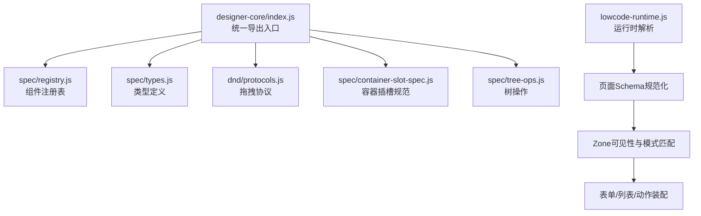
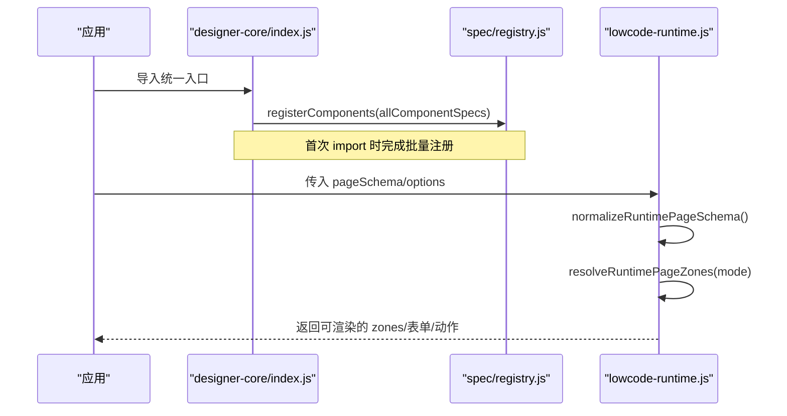
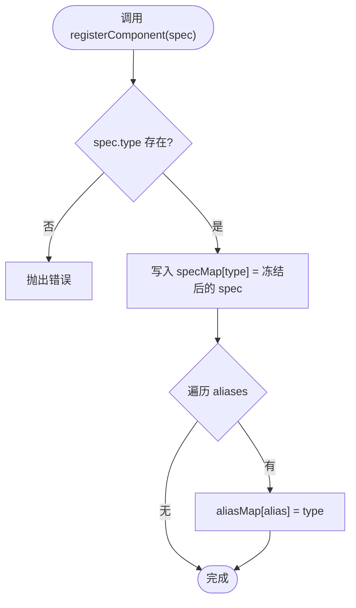
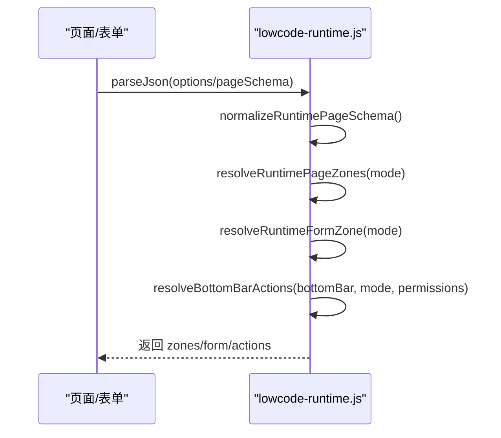
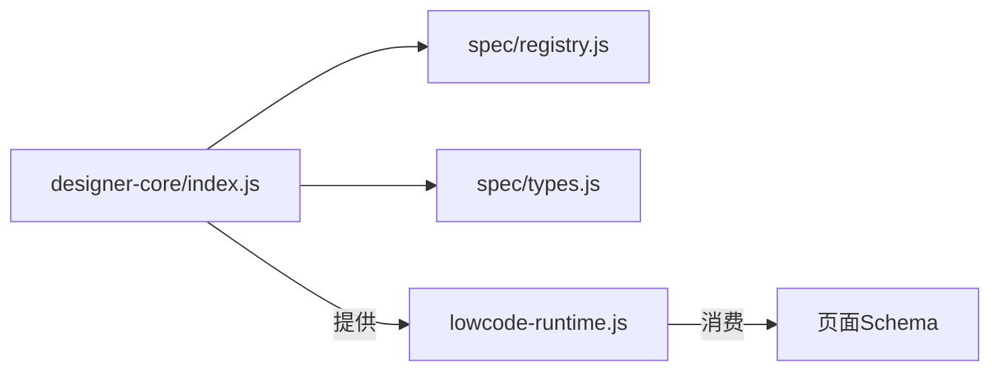

# 组件注册与发现机制

<cite>
**本文引用的文件**
- [designer-core/index.js](file://forge-admin-ui/src/components/lowcode-builder/designer-core/index.js)
- [spec/registry.js](file://forge-admin-ui/src/components/lowcode-builder/designer-core/spec/registry.js)
- [spec/types.js](file://forge-admin-ui/src/components/lowcode-builder/designer-core/spec/types.js)
- [__tests__/registry.test.js](file://forge-admin-ui/src/components/lowcode-builder/designer-core/__tests__/registry.test.js)
- [lowcode-runtime.js](file://forge-h5-ui/src/utils/lowcode-runtime.js)
</cite>

## 目录
1. [简介](#简介)
2. [项目结构](#项目结构)
3. [核心组件](#核心组件)
4. [架构总览](#架构总览)
5. [详细组件分析](#详细组件分析)
6. [依赖关系分析](#依赖关系分析)
7. [性能考量](#性能考量)
8. [故障排查指南](#故障排查指南)
9. [结论](#结论)
10. [附录](#附录)

## 简介
本技术文档围绕低代码平台的“组件注册与发现机制”展开，聚焦以下目标：
- 统一组件注册表的设计原理与实现要点
- 动态组件加载流程与模块依赖解析机制
- 组件 Key 映射、别名解析与版本兼容性策略
- 插件化扩展点与生命周期管理
- 内存优化与错误恢复策略
- 自定义组件注册 API 与扩展开发规范（元数据、属性配置、事件绑定）

该机制在表单、列表、页面等多类设计器中共享同一份注册表，确保一致的物料能力与渲染行为。

## 项目结构
- 设计器核心入口负责聚合并自动注册全部统一组件 spec，对外暴露注册表 API、拖拽协议、容器插槽规范、树操作等能力。
- 注册表模块维护 type→spec 与 alias→type 的双向映射，提供查询、分组、统计、清空等能力。
- 运行时模块负责将页面 schema 规范化、按区域（zone）解析可见性、合并表单/列表/动作等运行时配置，保障渲染一致性。

图表来源
- [designer-core/index.js:1-126](file://forge-admin-ui/src/components/lowcode-builder/designer-core/index.js#L1-L126)
- [spec/registry.js:1-169](file://forge-admin-ui/src/components/lowcode-builder/designer-core/spec/registry.js#L1-L169)
- [spec/types.js:1-120](file://forge-admin-ui/src/components/lowcode-builder/designer-core/spec/types.js#L1-L120)
- [lowcode-runtime.js:19-90](file://forge-h5-ui/src/utils/lowcode-runtime.js#L19-L90)

章节来源
- [designer-core/index.js:1-126](file://forge-admin-ui/src/components/lowcode-builder/designer-core/index.js#L1-L126)

## 核心组件
- 统一组件注册表：集中管理 ComponentSpec，提供注册、查询、别名解析、分组、统计、清空等 API。
- 类型协议：定义 ComponentSpec、PropsSchema、DataSourceConfig、ContainerSpec 等核心数据结构，约束 100+ 组件的元数据。
- 运行时解析：将页面 schema 标准化为 zones，按模式过滤可见区域，组装表单/列表/动作等运行时配置。

章节来源
- [spec/registry.js:1-169](file://forge-admin-ui/src/components/lowcode-builder/designer-core/spec/registry.js#L1-L169)
- [spec/types.js:1-120](file://forge-admin-ui/src/components/lowcode-builder/designer-core/spec/types.js#L1-L120)
- [lowcode-runtime.js:19-90](file://forge-h5-ui/src/utils/lowcode-runtime.js#L19-L90)

## 架构总览
设计期通过统一入口一次性注册所有组件 spec；运行期根据页面 schema 解析出 zone 与表单/列表/动作配置，驱动渲染。

图表来源
- [designer-core/index.js:55-67](file://forge-admin-ui/src/components/lowcode-builder/designer-core/index.js#L55-L67)
- [spec/registry.js:17-41](file://forge-admin-ui/src/components/lowcode-builder/designer-core/spec/registry.js#L17-L41)
- [lowcode-runtime.js:19-32](file://forge-h5-ui/src/utils/lowcode-runtime.js#L19-L32)

## 详细组件分析

### 组件注册表（Registry）
- 职责
  - 维护 type→spec 与 alias→type 映射
  - 提供注册、查询、别名解析、分组、统计、清空等 API
  - 支持 scope（F/L/F+L）、category、group 过滤
- 关键流程
  - 单条/批量注册：校验 type，写入 specMap，同步更新 aliasMap
  - 查询：优先从 specMap 命中，否则通过 aliasMap 解析
  - 分组/统计：遍历 specMap 生成 group Map 或分类/范围计数
  - 清空：仅用于测试场景

图表来源
- [spec/registry.js:17-41](file://forge-admin-ui/src/components/lowcode-builder/designer-core/spec/registry.js#L17-L41)

章节来源
- [spec/registry.js:17-41](file://forge-admin-ui/src/components/lowcode-builder/designer-core/spec/registry.js#L17-L41)
- [spec/registry.js:43-169](file://forge-admin-ui/src/components/lowcode-builder/designer-core/spec/registry.js#L43-L169)

### 类型协议（Types）
- 统一组件规格（ComponentSpec）字段说明
  - type：唯一标识
  - aliases：兼容旧版 key 的别名数组
  - scope：可用设计器范围（F/L/F+L）
  - category：组件分类（field/layout/business/page/media/widget）
  - group：分组名（如输入/选择/业务/布局/操作/页面/媒体等）
  - label/desc：显示名称与描述
  - layout：布局配置（span/minSpan/maxSpan）
  - container/maxDepth/accept：容器能力与子节点约束
  - propsSchema：属性面板 Schema（properties/required）
  - dataSources：支持的数据源类型
  - print：打印配置（hidden/breakAvoid）
  - fieldDefaults：字段默认值（数据库/业务类型映射）
  - meta：额外元数据（unique/multiField/requireFields/onlyFor/zones 等）

章节来源
- [spec/types.js:9-120](file://forge-admin-ui/src/components/lowcode-builder/designer-core/spec/types.js#L9-L120)

### 运行时解析（Runtime）
- 职责
  - 将页面 schema 规范化为 zones，并按模式（edit/create/detail 等）过滤可见区域
  - 提取/合并表单 schema、底部栏动作、主从明细、联动规则、权限控制等
- 关键流程
  - 规范化：normalizeRuntimePageSchema → normalizeRuntimeZone
  - 可见性：resolveRuntimePageZones → isRuntimeZoneVisible
  - 表单：resolveRuntimeFormZone → extractRuntimeFormSchema
  - 动作：resolveBottomBarActions → hasActionPermission/resolveActionPermission
  - 联动：resolveFieldLinkages → applyFieldLinkageChange/filterFieldOptionsByLinkage
  - 安全：safeEventRules 过滤危险键，避免注入风险

图表来源
- [lowcode-runtime.js:19-90](file://forge-h5-ui/src/utils/lowcode-runtime.js#L19-L90)
- [lowcode-runtime.js:352-390](file://forge-h5-ui/src/utils/lowcode-runtime.js#L352-L390)
- [lowcode-runtime.js:296-350](file://forge-h5-ui/src/utils/lowcode-runtime.js#L296-L350)

章节来源
- [lowcode-runtime.js:19-90](file://forge-h5-ui/src/utils/lowcode-runtime.js#L19-L90)
- [lowcode-runtime.js:296-350](file://forge-h5-ui/src/utils/lowcode-runtime.js#L296-L350)
- [lowcode-runtime.js:352-390](file://forge-h5-ui/src/utils/lowcode-runtime.js#L352-L390)

### 设计器入口与自动注册
- 入口文件汇总各分类组件 spec，并在首次 import 时调用 registerComponents 完成批量注册
- 同时导出注册表 API、拖拽协议、容器插槽规范、树操作等能力供上层使用

章节来源
- [designer-core/index.js:55-67](file://forge-admin-ui/src/components/lowcode-builder/designer-core/index.js#L55-L67)
- [designer-core/index.js:1-126](file://forge-admin-ui/src/components/lowcode-builder/designer-core/index.js#L1-L126)

### 单元测试验证
- 验证全部组件已注册且 type 唯一
- 验证 scope/category 过滤逻辑
- 验证容器标记与 maxDepth 约束
- 验证统计信息正确性

章节来源
- [__tests__/registry.test.js:19-105](file://forge-admin-ui/src/components/lowcode-builder/designer-core/__tests__/registry.test.js#L19-L105)

## 依赖关系分析
- designer-core/index.js 依赖 spec/registry.js 完成注册，依赖 types.js 提供类型契约
- lowcode-runtime.js 独立于设计器核心，专注于运行时 schema 解析与装配
- 两者通过“页面 schema + options”进行解耦协作

图表来源
- [designer-core/index.js:55-67](file://forge-admin-ui/src/components/lowcode-builder/designer-core/index.js#L55-L67)
- [lowcode-runtime.js:19-32](file://forge-h5-ui/src/utils/lowcode-runtime.js#L19-L32)

章节来源
- [designer-core/index.js:55-67](file://forge-admin-ui/src/components/lowcode-builder/designer-core/index.js#L55-L67)
- [lowcode-runtime.js:19-32](file://forge-h5-ui/src/utils/lowcode-runtime.js#L19-L32)

## 性能考量
- 注册阶段
  - 批量注册减少重复开销；spec 对象冻结防止运行时篡改
  - aliasMap 与 specMap 双索引提升查询效率 O(1)
- 运行阶段
  - 规范化函数对空/非法输入做快速失败与降级处理
  - 可见性过滤与权限判断采用集合与正则短路优化
- 内存优化
  - 按需导入与一次性注册，避免重复实例化
  - 运行时对大对象进行浅拷贝与最小化 patch，降低 GC 压力

## 故障排查指南
- 组件未注册/找不到
  - 检查是否已通过统一入口导入并完成批量注册
  - 使用 listAllTypes/getComponentSpec 确认 type/alias 是否正确
- 别名冲突
  - alias 重复映射会触发警告，需调整别名或覆盖顺序
- 运行时 schema 异常
  - 使用 normalizeRuntimePageSchema 获取规范化结果，定位非法字段
  - 检查 zone 的 visibleInModes 与 enabled/visible 标志
- 事件/联动安全问题
  - safeEventRules 会过滤包含危险键的规则，检查 sourceKey/sourceType/resultMappings
- 权限导致按钮不可见/禁用
  - 检查 action 的 permissionKey/permissionCode 与当前权限集匹配情况

章节来源
- [spec/registry.js:17-41](file://forge-admin-ui/src/components/lowcode-builder/designer-core/spec/registry.js#L17-L41)
- [lowcode-runtime.js:648-665](file://forge-h5-ui/src/utils/lowcode-runtime.js#L648-L665)
- [lowcode-runtime.js:352-390](file://forge-h5-ui/src/utils/lowcode-runtime.js#L352-L390)

## 结论
本机制通过统一的组件注册表与严格的类型协议，实现了跨设计器的组件复用与一致体验；配合运行时 schema 解析与权限/联动控制，形成“设计期—运行期”闭环。借助别名兼容、分组过滤、统计与测试用例，系统具备良好的可扩展性与可维护性。

## 附录

### 自定义组件注册 API 与扩展开发指南
- 注册单个组件
  - 使用 registerComponent(spec)，确保 spec.type 存在
  - 可选 aliases 用于兼容旧 key
- 批量注册
  - 使用 registerComponents(specs) 一次性注册多个组件
- 查询与解析
  - getComponentSpec(typeOrAlias)：按 type 或 alias 获取 spec
  - resolveComponentType(typeOrAlias)：解析为统一 type
  - hasComponent(typeOrAlias)：是否存在
- 分组与筛选
  - listComponents(scope)：按 F/L/F+L 筛选
  - listComponentsByCategory(category, scope)：按分类筛选
  - groupComponents(scope)：按 group 分组
- 统计与清理
  - getRegistryStats()：统计 total/byCategory/byScope/aliases
  - clearRegistry()：仅用于测试环境清空

章节来源
- [spec/registry.js:17-169](file://forge-admin-ui/src/components/lowcode-builder/designer-core/spec/registry.js#L17-L169)

### 组件元数据定义规范（ComponentSpec）
- 必填字段
  - type：唯一标识
  - label：显示名称
  - group：分组名
  - category：组件分类
  - scope：适用设计器范围
- 可选字段
  - aliases：兼容别名
  - layout：布局 span/minSpan/maxSpan
  - container/maxDepth/accept：容器能力
  - propsSchema：属性面板 Schema（properties/required）
  - dataSources：支持的数据源类型
  - print：打印配置
  - fieldDefaults：字段默认值
  - meta：扩展元数据

章节来源
- [spec/types.js:98-120](file://forge-admin-ui/src/components/lowcode-builder/designer-core/spec/types.js#L98-L120)

### 属性配置与事件绑定规范
- 属性面板
  - 使用 PropsSchema.properties 定义编辑器类型、标题、默认值、选项、格式等
  - required 声明必填属性
- 事件与联动
  - 使用 runtimeRules/visibilityRules/displayRules 控制可见性、只读、必填等
  - 使用 fieldLinkages 实现字段联动与级联过滤
  - 使用 bottomBar.actions 定义底部动作，结合权限与可见模式控制
- 安全
  - safeEventRules 过滤危险键，避免注入风险

章节来源
- [lowcode-runtime.js:296-350](file://forge-h5-ui/src/utils/lowcode-runtime.js#L296-L350)
- [lowcode-runtime.js:530-584](file://forge-h5-ui/src/utils/lowcode-runtime.js#L530-L584)
- [lowcode-runtime.js:648-665](file://forge-h5-ui/src/utils/lowcode-runtime.js#L648-L665)