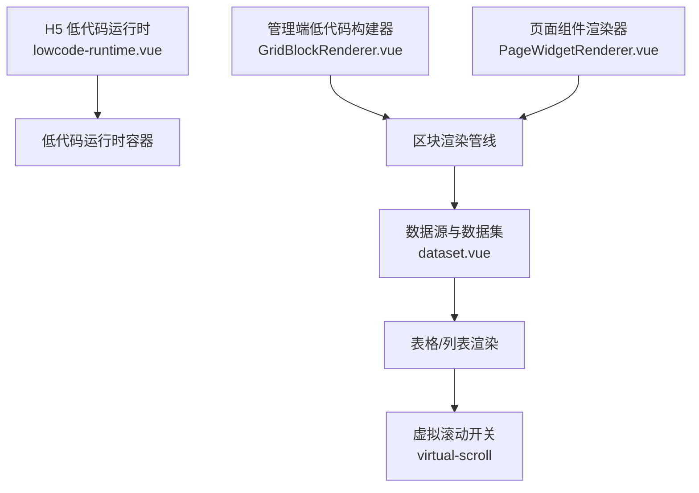
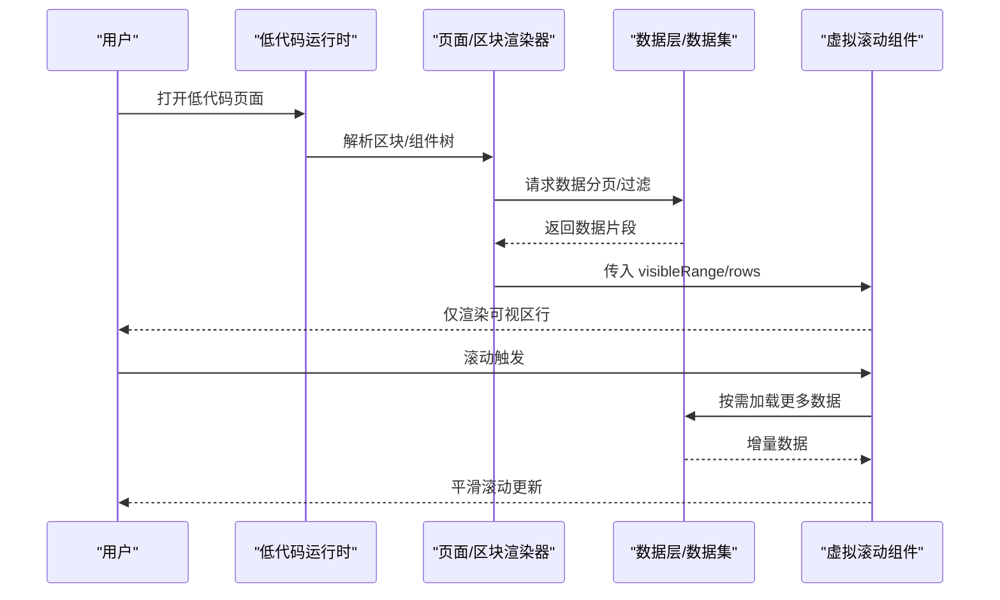
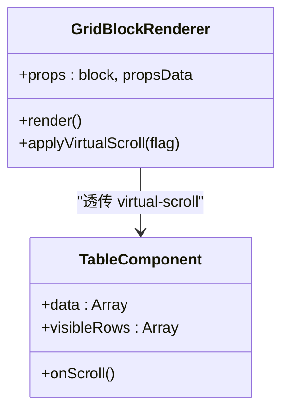
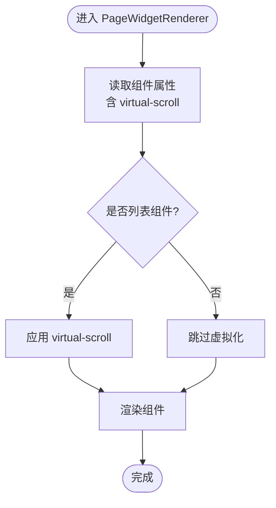
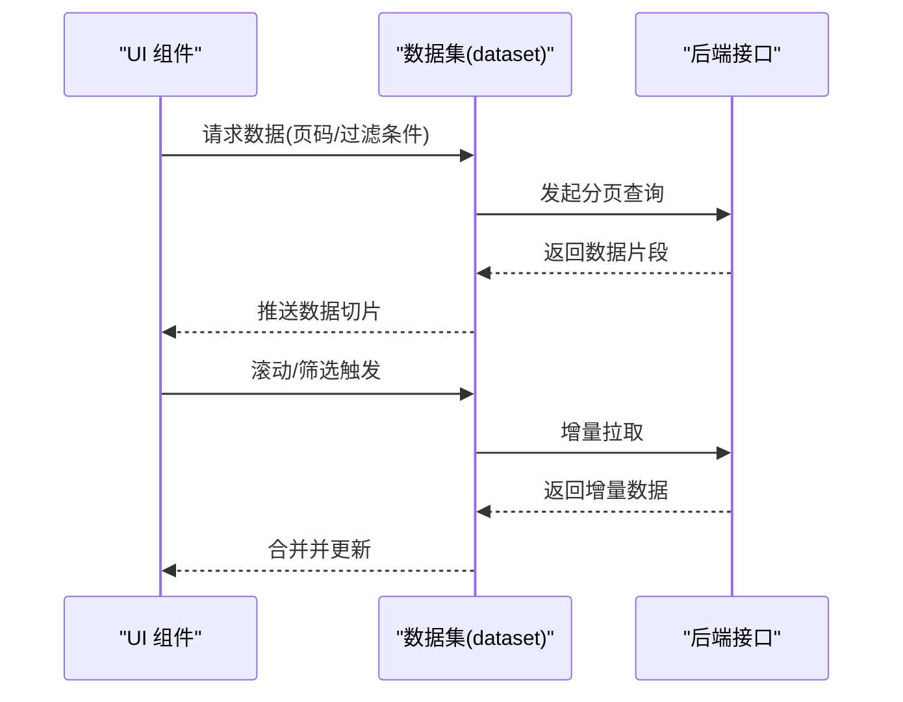
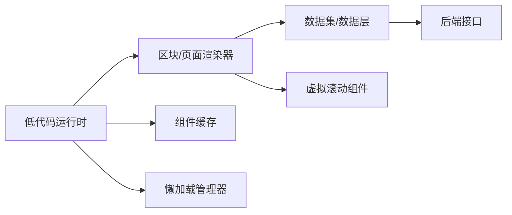

# 渲染性能优化

<cite>
**本文引用的文件**
- [GridBlockRenderer.vue](file://forge-admin-ui/src/components/lowcode-builder/page/GridBlockRenderer.vue)
- [PageWidgetRenderer.vue](file://forge-admin-ui/src/components/lowcode-builder/shared/PageWidgetRenderer.vue)
- [dataset.vue](file://forge-admin-ui/src/views/data/dataset.vue)
- [lowcode-runtime.vue](file://forge-h5-ui/src/pages/lowcode-runtime.vue)
</cite>

## 目录
1. [简介](#简介)
2. [项目结构](#项目结构)
3. [核心组件](#核心组件)
4. [架构总览](#架构总览)
5. [详细组件分析](#详细组件分析)
6. [依赖关系分析](#依赖关系分析)
7. [性能考量](#性能考量)
8. [故障排查指南](#故障排查指南)
9. [结论](#结论)
10. [附录](#附录)

## 简介
本技术文档聚焦低代码平台的渲染性能优化，围绕虚拟滚动、懒加载、组件缓存与内存优化展开，系统阐述渲染节流与防抖机制、增量更新与差异对比策略，并给出性能监控指标、瓶颈分析与调优工具使用建议。同时提供可落地的性能测试方法与最佳实践，帮助在大数据量列表、复杂表单与动态页面场景下获得稳定流畅的交互体验。

## 项目结构
本项目前端包含管理端与 H5 端两套运行时：
- 管理端（forge-admin-ui）：通过 lowcode-builder 下的区块渲染器实现低代码页面的可视化构建与运行，关键渲染入口包括 GridBlockRenderer 与 PageWidgetRenderer。
- H5 端（forge-h5-ui）：提供移动端低代码运行时页面 lowcode-runtime.vue，用于承载移动端低代码应用。

图表来源
- [GridBlockRenderer.vue:740-760](file://forge-admin-ui/src/components/lowcode-builder/page/GridBlockRenderer.vue#L740-L760)
- [PageWidgetRenderer.vue:40-50](file://forge-admin-ui/src/components/lowcode-builder/shared/PageWidgetRenderer.vue#L40-L50)
- [dataset.vue:770-790](file://forge-admin-ui/src/views/data/dataset.vue#L770-L790)
- [lowcode-runtime.vue](file://forge-h5-ui/src/pages/lowcode-runtime.vue)

章节来源
- [GridBlockRenderer.vue:740-760](file://forge-admin-ui/src/components/lowcode-builder/page/GridBlockRenderer.vue#L740-L760)
- [PageWidgetRenderer.vue:40-50](file://forge-admin-ui/src/components/lowcode-builder/shared/PageWidgetRenderer.vue#L40-L50)
- [dataset.vue:770-790](file://forge-admin-ui/src/views/data/dataset.vue#L770-L790)
- [lowcode-runtime.vue](file://forge-h5-ui/src/pages/lowcode-runtime.vue)

## 核心组件
- GridBlockRenderer：负责网格区块的渲染，支持将 virtual-scroll 属性透传给底层表格组件，以启用虚拟滚动能力。
- PageWidgetRenderer：负责页面级组件渲染，同样支持将 virtual-scroll 配置传递给具体组件，统一控制列表类组件的虚拟化行为。
- dataset：数据视图与数据集管理，集中处理分页、过滤、排序等数据流，并在多处显式关闭或开启 virtual-scroll，体现对大数据集渲染性能的精细化控制。
- lowcode-runtime：H5 端低代码运行时入口，承载移动端低代码应用的渲染生命周期与资源加载策略。

章节来源
- [GridBlockRenderer.vue:740-760](file://forge-admin-ui/src/components/lowcode-builder/page/GridBlockRenderer.vue#L740-L760)
- [PageWidgetRenderer.vue:40-50](file://forge-admin-ui/src/components/lowcode-builder/shared/PageWidgetRenderer.vue#L40-L50)
- [dataset.vue:770-790](file://forge-admin-ui/src/views/data/dataset.vue#L770-L790)
- [lowcode-runtime.vue](file://forge-h5-ui/src/pages/lowcode-runtime.vue)

## 架构总览
低代码渲染链路从页面/区块定义出发，经由渲染器解析为 UI 组件树，再由数据层驱动渲染。针对大数据列表，采用“可见区域渲染 + 按需加载”的策略，结合虚拟滚动与懒加载降低首屏压力；通过组件缓存减少重复创建成本；利用增量更新与差异对比避免全量重绘。

图表来源
- [GridBlockRenderer.vue:740-760](file://forge-admin-ui/src/components/lowcode-builder/page/GridBlockRenderer.vue#L740-L760)
- [PageWidgetRenderer.vue:40-50](file://forge-admin-ui/src/components/lowcode-builder/shared/PageWidgetRenderer.vue#L40-L50)
- [dataset.vue:770-790](file://forge-admin-ui/src/views/data/dataset.vue#L770-L790)
- [lowcode-runtime.vue](file://forge-h5-ui/src/pages/lowcode-runtime.vue)

## 详细组件分析

### GridBlockRenderer 分析
- 职责：网格区块渲染，将 virtual-scroll 配置透传给表格组件，从而在大列表场景启用虚拟滚动。
- 关键点：
  - 通过 props 传递 virtual-scroll，使表格组件根据数据规模决定是否启用虚拟化。
  - 与数据层联动，确保分页数据与可视区行数匹配，避免多余渲染。
- 优化点：
  - 合理设置可视区高度与行高，提升虚拟滚动计算精度。
  - 结合去抖动滚动事件，减少频繁 reflow。

图表来源
- [GridBlockRenderer.vue:740-760](file://forge-admin-ui/src/components/lowcode-builder/page/GridBlockRenderer.vue#L740-L760)

章节来源
- [GridBlockRenderer.vue:740-760](file://forge-admin-ui/src/components/lowcode-builder/page/GridBlockRenderer.vue#L740-L760)

### PageWidgetRenderer 分析
- 职责：页面级组件渲染，统一处理组件属性映射，包括 virtual-scroll 的配置下发。
- 关键点：
  - 将页面配置的 virtual-scroll 转换为组件可用属性，保证一致的行为。
  - 与区块渲染器协同，形成统一的虚拟化策略。
- 优化点：
  - 对非列表组件禁用虚拟化，避免不必要的开销。
  - 在组件初始化时进行懒加载，延迟重型子组件的创建。

图表来源
- [PageWidgetRenderer.vue:40-50](file://forge-admin-ui/src/components/lowcode-builder/shared/PageWidgetRenderer.vue#L40-L50)

章节来源
- [PageWidgetRenderer.vue:40-50](file://forge-admin-ui/src/components/lowcode-builder/shared/PageWidgetRenderer.vue#L40-L50)

### dataset 数据层分析
- 职责：数据集管理与数据流编排，控制分页、过滤、排序以及虚拟滚动的开关。
- 关键点：
  - 多处显式设置 virtual-scroll 为 false，表明在某些场景下（如小数据集、复杂筛选）禁用虚拟化更合适。
  - 作为数据中枢，向渲染器提供稳定的数据切片与增量更新接口。
- 优化点：
  - 对大数据集启用分页与虚拟滚动组合策略。
  - 对高频变更字段采用增量更新，减少整表重算。

图表来源
- [dataset.vue:770-790](file://forge-admin-ui/src/views/data/dataset.vue#L770-L790)

章节来源
- [dataset.vue:770-790](file://forge-admin-ui/src/views/data/dataset.vue#L770-L790)

### lowcode-runtime 运行时分析
- 职责：H5 端低代码运行时入口，负责页面生命周期管理、资源加载与渲染调度。
- 关键点：
  - 在移动端环境下，需更谨慎地启用虚拟化与懒加载，兼顾性能与交互。
  - 与数据层协作，确保弱网与低端设备上的稳定表现。
- 优化点：
  - 首屏优先加载关键组件，非关键资源延迟加载。
  - 结合设备能力检测，动态调整虚拟化阈值与并发请求数。

章节来源
- [lowcode-runtime.vue](file://forge-h5-ui/src/pages/lowcode-runtime.vue)

## 依赖关系分析
- 渲染器依赖数据层提供的数据切片与增量更新能力。
- 虚拟滚动依赖于稳定的行高与可视区尺寸计算，需与布局层解耦。
- 懒加载与组件缓存由运行时统一管理，避免重复创建与销毁带来的开销。

图表来源
- [GridBlockRenderer.vue:740-760](file://forge-admin-ui/src/components/lowcode-builder/page/GridBlockRenderer.vue#L740-L760)
- [PageWidgetRenderer.vue:40-50](file://forge-admin-ui/src/components/lowcode-builder/shared/PageWidgetRenderer.vue#L40-L50)
- [dataset.vue:770-790](file://forge-admin-ui/src/views/data/dataset.vue#L770-L790)
- [lowcode-runtime.vue](file://forge-h5-ui/src/pages/lowcode-runtime.vue)

章节来源
- [GridBlockRenderer.vue:740-760](file://forge-admin-ui/src/components/lowcode-builder/page/GridBlockRenderer.vue#L740-L760)
- [PageWidgetRenderer.vue:40-50](file://forge-admin-ui/src/components/lowcode-builder/shared/PageWidgetRenderer.vue#L40-L50)
- [dataset.vue:770-790](file://forge-admin-ui/src/views/data/dataset.vue#L770-L790)
- [lowcode-runtime.vue](file://forge-h5-ui/src/pages/lowcode-runtime.vue)

## 性能考量
- 虚拟滚动
  - 适用场景：大数据量列表、固定或可估算行高。
  - 注意事项：行高变化、嵌套滚动、复杂单元格布局会影响虚拟化精度与性能。
- 懒加载
  - 首屏只加载必要资源，图片、图表、富文本等非关键内容延迟加载。
  - 结合路由与组件层级，按视口与用户操作触发加载。
- 组件缓存
  - 对状态稳定、复用率高的组件进行缓存，避免重复创建与样式重建。
  - 注意缓存失效策略，防止脏数据与内存泄漏。
- 内存优化
  - 及时释放事件监听、定时器与订阅。
  - 大对象拆分与引用清理，避免闭包持有长生命周期引用。
- 渲染节流与防抖
  - 滚动、窗口 resize、输入等高频事件采用节流/防抖，降低重排与重绘频率。
  - 将计算密集型任务移至 Web Worker 或分片执行。
- 增量更新与差异对比
  - 基于 key 的稳定标识，最小化 DOM 更新范围。
  - 对列表项采用局部更新，避免整表重渲染。
- 性能监控指标
  - 首屏时间、FCP/LCP、TBT、FPS、内存峰值、GC 次数。
  - 滚动帧耗时、虚拟滚动命中率、懒加载触发次数。
- 瓶颈分析与调优工具
  - 浏览器 Performance 面板录制关键路径，定位主线程阻塞。
  - Memory 面板检查内存增长与泄漏，关注长生命周期对象。
  - Lighthouse 与自定义埋点结合，持续跟踪线上性能。

[本节为通用指导，不直接分析具体文件]

## 故障排查指南
- 虚拟滚动卡顿
  - 检查行高是否稳定，是否存在动态高度导致的重新测量。
  - 确认可视区尺寸计算是否正确，避免溢出或空白区域。
- 列表闪烁或错位
  - 核对列表项 key 的唯一性与稳定性。
  - 检查增量更新逻辑是否覆盖所有字段变更。
- 内存持续增长
  - 排查未移除的事件监听与定时器。
  - 检查组件缓存是否设置合理的过期与回收策略。
- 首屏过慢
  - 分析资源体积与加载顺序，启用分包与懒加载。
  - 评估第三方库引入方式，按需引入与 Tree Shaking。

章节来源
- [GridBlockRenderer.vue:740-760](file://forge-admin-ui/src/components/lowcode-builder/page/GridBlockRenderer.vue#L740-L760)
- [PageWidgetRenderer.vue:40-50](file://forge-admin-ui/src/components/lowcode-builder/shared/PageWidgetRenderer.vue#L40-L50)
- [dataset.vue:770-790](file://forge-admin-ui/src/views/data/dataset.vue#L770-L790)
- [lowcode-runtime.vue](file://forge-h5-ui/src/pages/lowcode-runtime.vue)

## 结论
通过在低代码平台中系统化引入虚拟滚动、懒加载、组件缓存与内存优化，并结合渲染节流/防抖、增量更新与差异对比，可以显著提升大数据量与复杂页面的渲染性能。配合完善的性能监控与调优流程，能够在不同设备与网络条件下保持稳定的用户体验。建议在业务迭代中持续度量与回归，确保优化效果长期有效。

[本节为总结性内容，不直接分析具体文件]

## 附录
- 性能测试方法
  - 构造典型大数据集场景，录制 Performance 并对比优化前后指标。
  - 使用自动化脚本模拟滚动、筛选、分页等操作，统计 FPS 与帧耗时。
  - 在线上环境采集真实用户性能数据，建立基线与告警。
- 最佳实践清单
  - 列表优先启用虚拟滚动，行高尽量固定。
  - 首屏精简资源，非关键内容懒加载。
  - 组件缓存与失效策略并重，避免内存泄漏。
  - 高频事件节流/防抖，计算任务异步化。
  - 基于 key 的最小化更新，避免整表重渲染。
  - 持续监控与回归，保障性能基线。

[本节为通用指导，不直接分析具体文件]