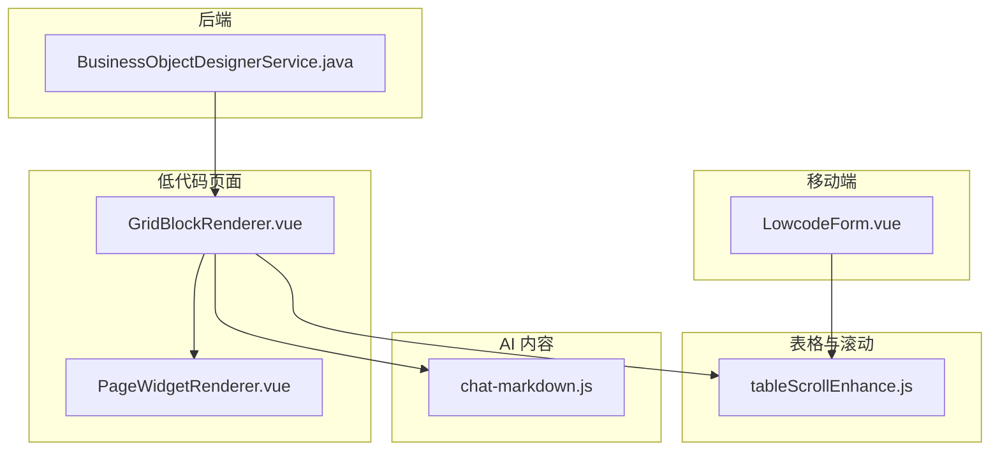
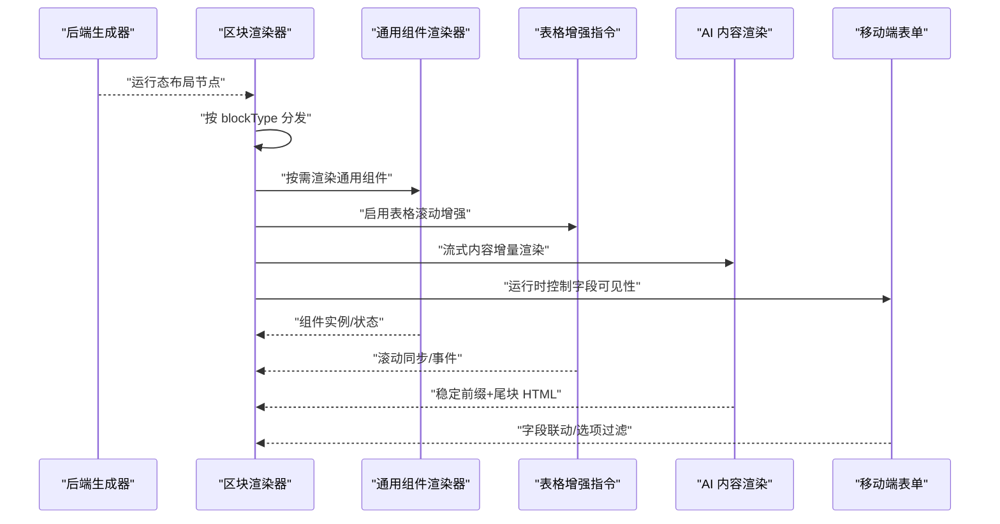
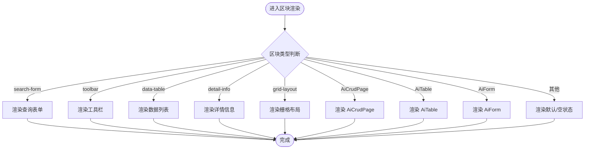
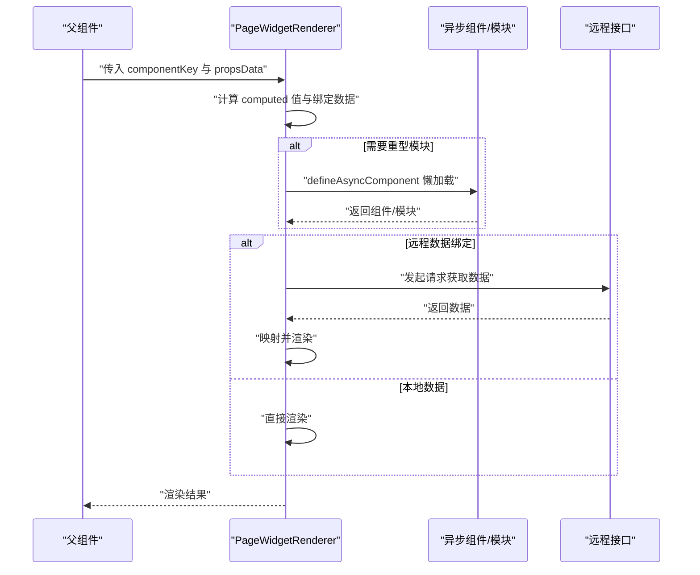
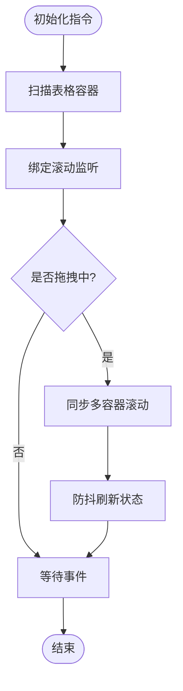
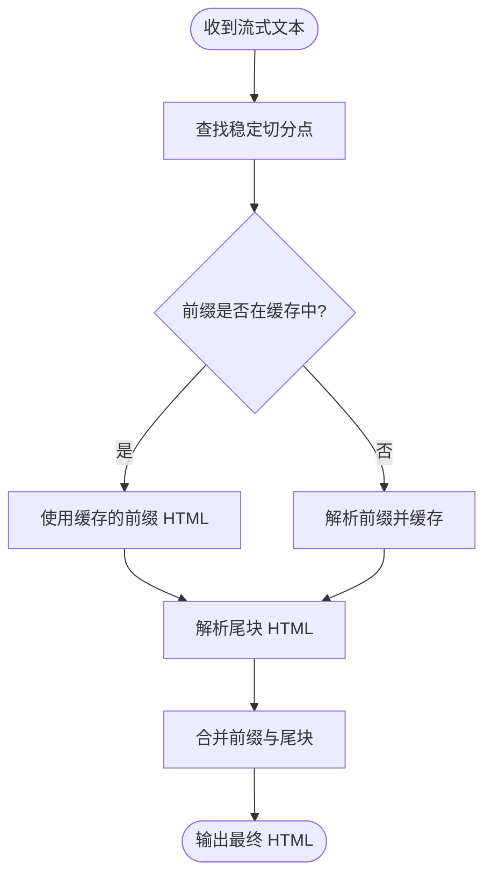
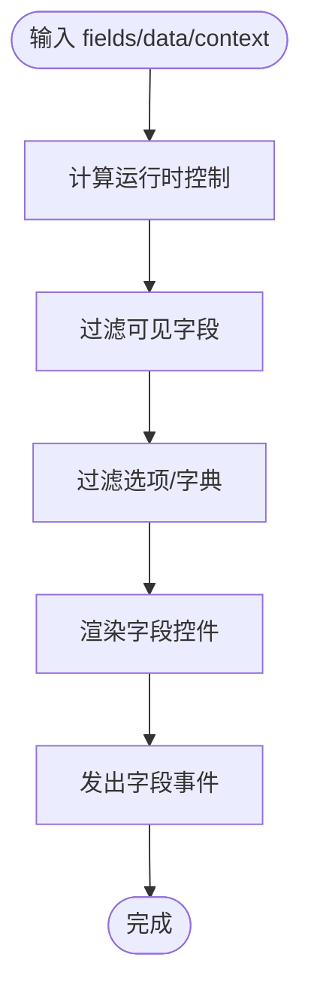
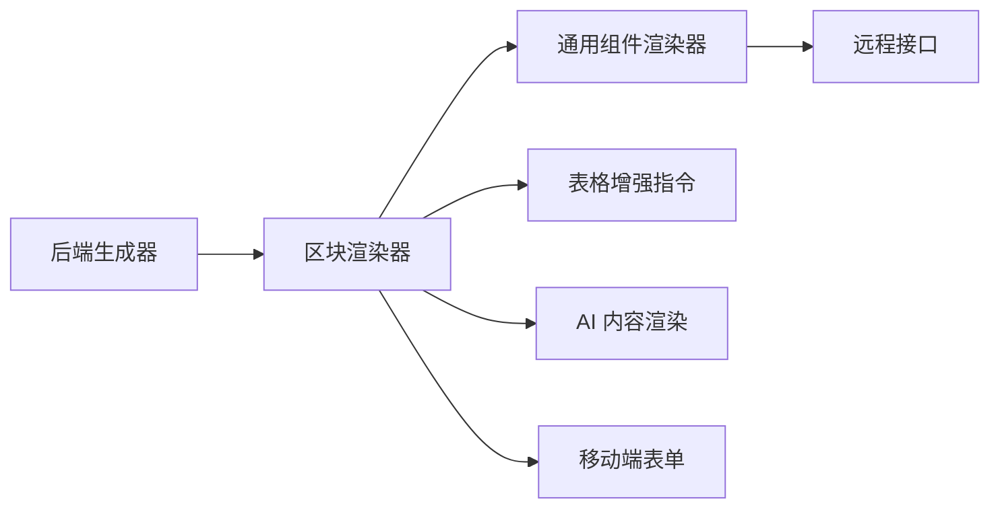

# 渲染优化策略

<cite>
**本文引用的文件**
- [GridBlockRenderer.vue](file://forge-admin-ui/src/components/lowcode-builder/page/GridBlockRenderer.vue)
- [PageWidgetRenderer.vue](file://forge-admin-ui/src/components/lowcode-builder/shared/PageWidgetRenderer.vue)
- [tableScrollEnhance.js](file://forge-admin-ui/src/directives/modules/tableScrollEnhance.js)
- [chat-markdown.js](file://forge-admin-ui/src/views/ai/components/agent-chat/chat-markdown.js)
- [LowcodeForm.vue](file://forge-h5-ui/src/components/lowcode/LowcodeForm.vue)
- [BusinessObjectDesignerService.java](file://forge-server/forge-framework/forge-plugin-parent/forge-plugin-generator/src/main/java/com/mdframe/forge/plugin/generator/service/businessapp/BusinessObjectDesignerService.java)
</cite>

## 目录
1. [简介](#简介)
2. [项目结构](#项目结构)
3. [核心组件](#核心组件)
4. [架构总览](#架构总览)
5. [详细组件分析](#详细组件分析)
6. [依赖关系分析](#依赖关系分析)
7. [性能考量](#性能考量)
8. [故障排查指南](#故障排查指南)
9. [结论](#结论)
10. [附录](#附录)

## 简介
本技术文档围绕低代码平台的渲染优化策略，系统阐述批处理渲染、增量更新与虚拟滚动等关键技术，并结合仓库中的实际实现，说明组件懒加载、按需渲染与内存池管理机制。同时给出渲染性能监控、瓶颈分析与调优方法，以及最佳实践与常见问题解决方案，帮助读者在复杂页面与大数据量场景下获得稳定流畅的渲染体验。

## 项目结构
本项目前端采用模块化组织：低代码页面由区块渲染器统一编排，通用页面组件通过统一渲染器按需加载；表格滚动增强指令提供全局表格交互优化；AI 流式内容渲染使用增量缓存策略；移动端表单组件基于运行时控制进行字段级渲染。后端生成器负责将设计态模型转换为运行态布局节点，减少运行时计算开销。

图表来源
- [GridBlockRenderer.vue:1-800](file://forge-admin-ui/src/components/lowcode-builder/page/GridBlockRenderer.vue#L1-L800)
- [PageWidgetRenderer.vue:1-800](file://forge-admin-ui/src/components/lowcode-builder/shared/PageWidgetRenderer.vue#L1-L800)
- [tableScrollEnhance.js:116-414](file://forge-admin-ui/src/directives/modules/tableScrollEnhance.js#L116-L414)
- [chat-markdown.js:74-116](file://forge-admin-ui/src/views/ai/components/agent-chat/chat-markdown.js#L74-L116)
- [LowcodeForm.vue:1-112](file://forge-h5-ui/src/components/lowcode/LowcodeForm.vue#L1-L112)
- [BusinessObjectDesignerService.java:2828-2878](file://forge-server/forge-framework/forge-plugin-parent/forge-plugin-generator/src/main/java/com/mdframe/forge/plugin/generator/service/businessapp/BusinessObjectDesignerService.java#L2828-L2878)

章节来源
- [GridBlockRenderer.vue:1-800](file://forge-admin-ui/src/components/lowcode-builder/page/GridBlockRenderer.vue#L1-L800)
- [PageWidgetRenderer.vue:1-800](file://forge-admin-ui/src/components/lowcode-builder/shared/PageWidgetRenderer.vue#L1-L800)
- [tableScrollEnhance.js:116-414](file://forge-admin-ui/src/directives/modules/tableScrollEnhance.js#L116-L414)
- [chat-markdown.js:74-116](file://forge-admin-ui/src/views/ai/components/agent-chat/chat-markdown.js#L74-L116)
- [LowcodeForm.vue:1-112](file://forge-h5-ui/src/components/lowcode/LowcodeForm.vue#L1-L112)
- [BusinessObjectDesignerService.java:2828-2878](file://forge-server/forge-framework/forge-plugin-parent/forge-plugin-generator/src/main/java/com/mdframe/forge/plugin/generator/service/businessapp/BusinessObjectDesignerService.java#L2828-L2878)

## 核心组件
- GridBlockRenderer：低代码页面的区块渲染中枢，按 blockType 分发到不同子组件（查询表单、工具栏、数据列表、详情信息、栅格布局、AiCrudPage、AiTable、AiForm 等），并支持预览态与运行态切换、静态/动态数据源、分页与树形选择等能力。
- PageWidgetRenderer：通用页面组件渲染器，集中管理富文本、Markdown、条形码、二维码、日历、代码、倒计时、公告、列表、日志、数值动画、面包屑、菜单、分页、分割面板、HTML 标签、Vue 组件等，并通过异步组件与模块懒加载降低首屏体积。
- tableScrollEnhance：表格滚动增强指令，自动扫描并绑定表格容器，同步多容器横向滚动，支持拖拽滚动、防抖刷新与事件派发，提升大数据表格交互体验。
- chat-markdown：AI 流式 Markdown 渲染，采用“稳定前缀 + 尾块”切分与 Map 缓存，仅对尾块重算，避免整篇重复解析。
- LowcodeForm：移动端低代码表单，基于运行时控制过滤可见字段，联动上下文与选项过滤，减少无效渲染。
- BusinessObjectDesignerService：后端将设计态组件转换为运行态布局节点，清理无关属性，输出精简的 span/props/children 结构，降低前端渲染负担。

章节来源
- [GridBlockRenderer.vue:1-800](file://forge-admin-ui/src/components/lowcode-builder/page/GridBlockRenderer.vue#L1-L800)
- [PageWidgetRenderer.vue:1-800](file://forge-admin-ui/src/components/lowcode-builder/shared/PageWidgetRenderer.vue#L1-L800)
- [tableScrollEnhance.js:116-414](file://forge-admin-ui/src/directives/modules/tableScrollEnhance.js#L116-L414)
- [chat-markdown.js:74-116](file://forge-admin-ui/src/views/ai/components/agent-chat/chat-markdown.js#L74-L116)
- [LowcodeForm.vue:1-112](file://forge-h5-ui/src/components/lowcode/LowcodeForm.vue#L1-L112)
- [BusinessObjectDesignerService.java:2828-2878](file://forge-server/forge-framework/forge-plugin-parent/forge-plugin-generator/src/main/java/com/mdframe/forge/plugin/generator/service/businessapp/BusinessObjectDesignerService.java#L2828-L2878)

## 架构总览
低代码渲染链路从后端生成运行态布局开始，前端区块渲染器根据区块类型渲染对应组件，通用组件通过异步加载按需引入，表格滚动增强指令在全局范围内优化交互，AI 内容渲染采用增量缓存策略，移动端表单基于运行时控制进行字段级渲染。

图表来源
- [BusinessObjectDesignerService.java:2828-2878](file://forge-server/forge-framework/forge-plugin-parent/forge-plugin-generator/src/main/java/com/mdframe/forge/plugin/generator/service/businessapp/BusinessObjectDesignerService.java#L2828-L2878)
- [GridBlockRenderer.vue:1-800](file://forge-admin-ui/src/components/lowcode-builder/page/GridBlockRenderer.vue#L1-L800)
- [PageWidgetRenderer.vue:1-800](file://forge-admin-ui/src/components/lowcode-builder/shared/PageWidgetRenderer.vue#L1-L800)
- [tableScrollEnhance.js:116-414](file://forge-admin-ui/src/directives/modules/tableScrollEnhance.js#L116-L414)
- [chat-markdown.js:74-116](file://forge-admin-ui/src/views/ai/components/agent-chat/chat-markdown.js#L74-L116)
- [LowcodeForm.vue:1-112](file://forge-h5-ui/src/components/lowcode/LowcodeForm.vue#L1-L112)

## 详细组件分析

### 区块渲染器（GridBlockRenderer）
- 职责：统一渲染低代码页面区块，支持查询表单、工具栏、数据列表、详情信息、栅格布局、AiCrudPage、AiTable、AiForm、筛选树、指标卡片、提示面板、自定义 HTML、按钮组、标签列表、步骤条、时间线、空状态、手写签名、穿梭框、分步表单、标题、段落等。
- 优化点：
  - 预览态与运行态分离：预览时使用样本数据与静态配置，运行态接入真实 API 与上下文。
  - 条件渲染：仅在满足权限或显示条件时渲染按钮与操作项，减少无用 DOM。
  - 分页与树形：数据列表与筛选树支持分页与树节点展开/收起，降低一次性渲染压力。
  - 栅格嵌套：支持嵌套区块与拖拽调整大小，保持布局灵活性。
  - 静态/动态数据源：AiCrudPage 支持静态预览与动态请求，避免不必要的网络请求。

图表来源
- [GridBlockRenderer.vue:1-800](file://forge-admin-ui/src/components/lowcode-builder/page/GridBlockRenderer.vue#L1-L800)

章节来源
- [GridBlockRenderer.vue:1-800](file://forge-admin-ui/src/components/lowcode-builder/page/GridBlockRenderer.vue#L1-L800)

### 通用组件渲染器（PageWidgetRenderer）
- 职责：集中渲染多种通用页面组件，包括富文本、Markdown、条形码、二维码、日历、代码、倒计时、公告、列表、日志、数值动画、面包屑、菜单、分页、分割面板、HTML 标签、Vue 组件等。
- 优化点：
  - 组件懒加载：使用 defineAsyncComponent 与模块懒加载，仅在需要时引入编辑器、二维码、条形码等重型依赖。
  - 数据绑定：支持远程数据绑定与上下文路径解析，按需拉取并映射展示数据。
  - 安全渲染：对 HTML、CSS、模板内容进行清洗与转义，防止注入风险。
  - 错误处理：为远程选项与绑定数据提供加载状态与错误提示，提升用户体验。

图表来源
- [PageWidgetRenderer.vue:1-800](file://forge-admin-ui/src/components/lowcode-builder/shared/PageWidgetRenderer.vue#L1-L800)

章节来源
- [PageWidgetRenderer.vue:1-800](file://forge-admin-ui/src/components/lowcode-builder/shared/PageWidgetRenderer.vue#L1-L800)

### 表格滚动增强（tableScrollEnhance）
- 职责：自动扫描表格容器，收集可滚动容器，同步横向滚动位置，支持拖拽滚动、防抖刷新与事件派发。
- 优化点：
  - 多容器同步：识别多个滚动容器并同步 scrollLeft，保证表头与内容一致。
  - 拖拽滚动：鼠标按下后移动触发滚动，避免频繁 reflow。
  - 防抖刷新：使用 setTimeout 调度状态刷新，减少高频事件带来的性能损耗。
  - 全局扫描：MutationObserver 监听 DOM 变化，自动为新插入的表格应用增强。

图表来源
- [tableScrollEnhance.js:116-414](file://forge-admin-ui/src/directives/modules/tableScrollEnhance.js#L116-L414)

章节来源
- [tableScrollEnhance.js:116-414](file://forge-admin-ui/src/directives/modules/tableScrollEnhance.js#L116-L414)

### AI 流式内容渲染（chat-markdown）
- 职责：对 AI 输出的 Markdown 进行流式增量渲染，采用“稳定前缀 + 尾块”切分策略，仅对尾块重算，避免整篇重复解析。
- 优化点：
  - 稳定前缀缓存：以空行边界切分，前缀解析一次并缓存复用，限制缓存大小防止内存增长。
  - 尾块快速重算：每个 tick 仅对尾部增量部分解析并拼接，显著降低 CPU 占用。
  - 安全处理：解析失败回退至转义输出，确保界面稳定性。

图表来源
- [chat-markdown.js:74-116](file://forge-admin-ui/src/views/ai/components/agent-chat/chat-markdown.js#L74-L116)

章节来源
- [chat-markdown.js:74-116](file://forge-admin-ui/src/views/ai/components/agent-chat/chat-markdown.js#L74-L116)

### 移动端低代码表单（LowcodeForm）
- 职责：渲染移动端低代码表单，基于运行时控制过滤可见字段，联动上下文与选项过滤，减少无效渲染。
- 优化点：
  - 运行时控制：根据记录、表单数据、路由与用户信息计算字段可见性与只读状态。
  - 选项过滤：字典与选项支持联动上下文过滤，避免全量加载。
  - 事件冒泡：统一发出字段事件，便于上层处理联动与校验。

图表来源
- [LowcodeForm.vue:1-112](file://forge-h5-ui/src/components/lowcode/LowcodeForm.vue#L1-L112)

章节来源
- [LowcodeForm.vue:1-112](file://forge-h5-ui/src/components/lowcode/LowcodeForm.vue#L1-L112)

### 后端运行态布局生成（BusinessObjectDesignerService）
- 职责：将设计态组件转换为运行态布局节点，清理无关属性，输出精简的 span/props/children 结构，降低前端渲染负担。
- 优化点：
  - 节点规范化：统一 nodeType/key/label/props/children/span，便于前端高效渲染。
  - 属性清洗：移除设计态专用字段，减少传输与解析成本。
  - 组件适配：针对表格、CRUD、页面组件等进行特殊处理，确保运行态一致性。

章节来源
- [BusinessObjectDesignerService.java:2828-2878](file://forge-server/forge-framework/forge-plugin-parent/forge-plugin-generator/src/main/java/com/mdframe/forge/plugin/generator/service/businessapp/BusinessObjectDesignerService.java#L2828-L2878)

## 依赖关系分析
- 区块渲染器依赖通用组件渲染器与表格增强指令，形成“区块 -> 组件 -> 指令”的单向依赖。
- 通用组件渲染器依赖异步模块与远程接口，具备“按需加载 + 数据绑定”的双向能力。
- AI 内容渲染独立于区块渲染器，但可通过区块嵌入，提供流式增量渲染能力。
- 移动端表单与桌面端区块渲染器共享“运行时控制”思想，确保跨端一致的渲染策略。
- 后端生成器为前端提供精简的运行态数据，减少前端计算与渲染压力。

图表来源
- [BusinessObjectDesignerService.java:2828-2878](file://forge-server/forge-framework/forge-plugin-parent/forge-plugin-generator/src/main/java/com/mdframe/forge/plugin/generator/service/businessapp/BusinessObjectDesignerService.java#L2828-L2878)
- [GridBlockRenderer.vue:1-800](file://forge-admin-ui/src/components/lowcode-builder/page/GridBlockRenderer.vue#L1-L800)
- [PageWidgetRenderer.vue:1-800](file://forge-admin-ui/src/components/lowcode-builder/shared/PageWidgetRenderer.vue#L1-L800)
- [tableScrollEnhance.js:116-414](file://forge-admin-ui/src/directives/modules/tableScrollEnhance.js#L116-L414)
- [chat-markdown.js:74-116](file://forge-admin-ui/src/views/ai/components/agent-chat/chat-markdown.js#L74-L116)
- [LowcodeForm.vue:1-112](file://forge-h5-ui/src/components/lowcode/LowcodeForm.vue#L1-L112)

章节来源
- [GridBlockRenderer.vue:1-800](file://forge-admin-ui/src/components/lowcode-builder/page/GridBlockRenderer.vue#L1-L800)
- [PageWidgetRenderer.vue:1-800](file://forge-admin-ui/src/components/lowcode-builder/shared/PageWidgetRenderer.vue#L1-L800)
- [tableScrollEnhance.js:116-414](file://forge-admin-ui/src/directives/modules/tableScrollEnhance.js#L116-L414)
- [chat-markdown.js:74-116](file://forge-admin-ui/src/views/ai/components/agent-chat/chat-markdown.js#L74-L116)
- [LowcodeForm.vue:1-112](file://forge-h5-ui/src/components/lowcode/LowcodeForm.vue#L1-L112)
- [BusinessObjectDesignerService.java:2828-2878](file://forge-server/forge-framework/forge-plugin-parent/forge-plugin-generator/src/main/java/com/mdframe/forge/plugin/generator/service/businessapp/BusinessObjectDesignerService.java#L2828-L2878)

## 性能考量
- 批处理渲染：区块渲染器按类型批量渲染，避免逐条渲染导致的抖动；表格增强指令批量同步滚动位置，减少多次写入。
- 增量更新：AI 内容渲染采用稳定前缀缓存与尾块重算，显著降低流式期间的 CPU 占用；通用组件渲染器对远程数据进行增量绑定与映射。
- 虚拟滚动：表格增强指令通过容器识别与滚动同步，结合分页与树节点展开/收起，降低大列表渲染压力；通用组件渲染器对重型模块进行懒加载，避免首屏阻塞。
- 组件懒加载：通过 defineAsyncComponent 与模块懒加载，按需引入编辑器、二维码、条形码等依赖，减小包体与启动时间。
- 按需渲染：移动端表单基于运行时控制过滤可见字段，减少无效 DOM；区块渲染器在预览态使用样本数据，运行态才接入真实 API。
- 内存池管理：AI 内容渲染对稳定前缀进行 Map 缓存，并限制缓存大小，防止内存泄漏；表格增强指令在卸载时清理监听器与定时器，释放资源。

[本节为通用性能讨论，不直接分析具体文件]

## 故障排查指南
- 表格滚动不同步：检查是否启用了表格增强指令，确认是否存在多个滚动容器；查看是否处于拖拽状态导致同步被跳过；确认事件派发是否正常。
- 通用组件加载失败：检查异步组件是否正确懒加载；确认远程接口配置与参数；查看错误提示与加载状态。
- AI 内容渲染卡顿：检查稳定前缀缓存是否过大；确认尾块解析是否异常；必要时增加缓存清理频率。
- 移动端表单字段不显示：检查运行时控制逻辑是否正确；确认字段可见性与联动上下文；验证选项过滤是否生效。
- 后端生成数据异常：检查运行态布局节点是否包含必要字段；确认属性清洗是否误删关键信息；核对组件适配逻辑。

章节来源
- [tableScrollEnhance.js:116-414](file://forge-admin-ui/src/directives/modules/tableScrollEnhance.js#L116-L414)
- [PageWidgetRenderer.vue:1-800](file://forge-admin-ui/src/components/lowcode-builder/shared/PageWidgetRenderer.vue#L1-L800)
- [chat-markdown.js:74-116](file://forge-admin-ui/src/views/ai/components/agent-chat/chat-markdown.js#L74-L116)
- [LowcodeForm.vue:1-112](file://forge-h5-ui/src/components/lowcode/LowcodeForm.vue#L1-L112)
- [BusinessObjectDesignerService.java:2828-2878](file://forge-server/forge-framework/forge-plugin-parent/forge-plugin-generator/src/main/java/com/mdframe/forge/plugin/generator/service/businessapp/BusinessObjectDesignerService.java#L2828-L2878)

## 结论
本仓库在低代码平台渲染优化方面形成了完整的策略体系：通过区块渲染器统一编排、通用组件渲染器按需加载、表格增强指令提升交互体验、AI 内容渲染实现增量更新、移动端表单基于运行时控制进行字段级渲染，以及后端生成器输出精简的运行态数据。这些措施共同实现了批处理渲染、增量更新与虚拟滚动的目标，有效降低了渲染开销与内存占用，提升了页面流畅度与稳定性。建议在实际项目中结合业务场景持续监控性能指标，并根据数据规模与设备能力动态调整优化策略。

[本节为总结性内容，不直接分析具体文件]

## 附录
- 最佳实践
  - 优先使用区块渲染器进行页面编排，避免重复实现渲染逻辑。
  - 对重型组件与模块采用懒加载，减少首屏体积。
  - 对大列表与树形数据启用分页与懒加载，避免一次性渲染。
  - 对 AI 内容渲染设置合理的缓存上限，防止内存增长。
  - 对表格使用增强指令，确保滚动同步与交互流畅。
  - 对移动端表单使用运行时控制，仅渲染可见字段。
- 常见问题
  - 表格滚动卡顿：检查容器识别与事件绑定；避免频繁重排。
  - 组件加载失败：检查异步加载配置与网络请求；提供错误提示。
  - AI 内容闪烁：确保稳定前缀切分正确；避免尾块解析异常。
  - 表单字段不显示：检查运行时控制与联动上下文；验证选项过滤。
  - 后端数据异常：检查运行态布局节点与属性清洗；核对组件适配。

[本节为通用指导内容，不直接分析具体文件]