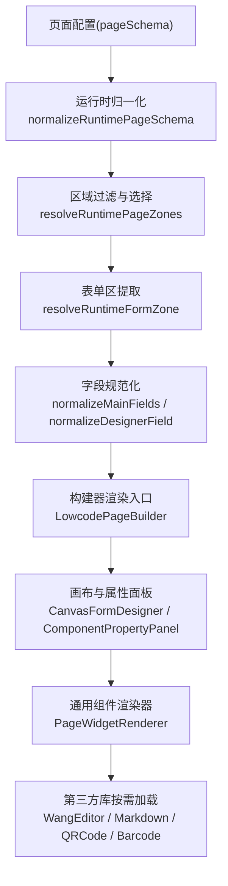
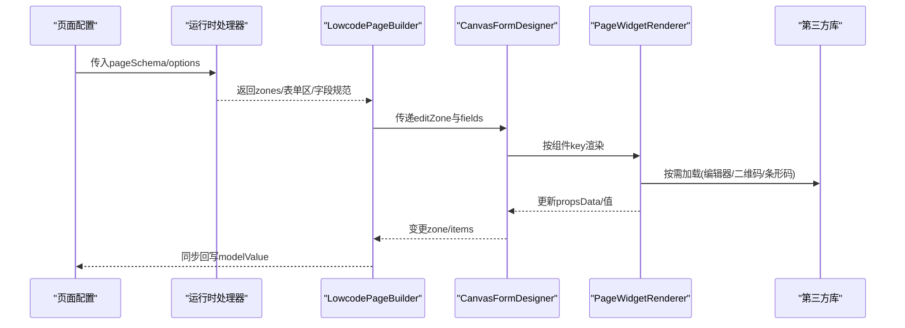
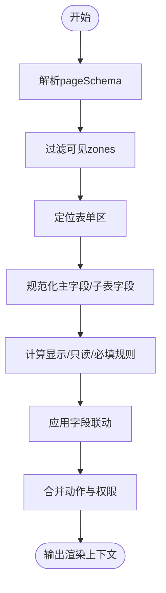
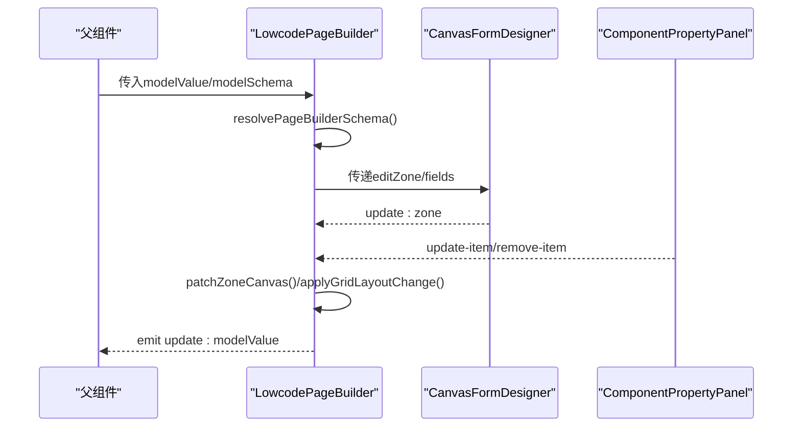
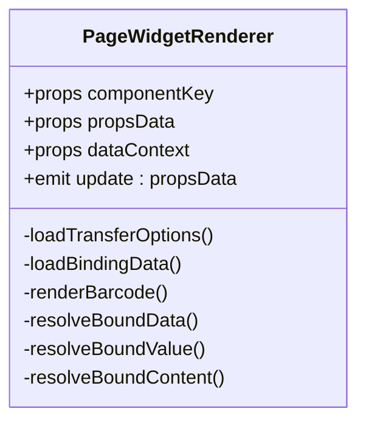
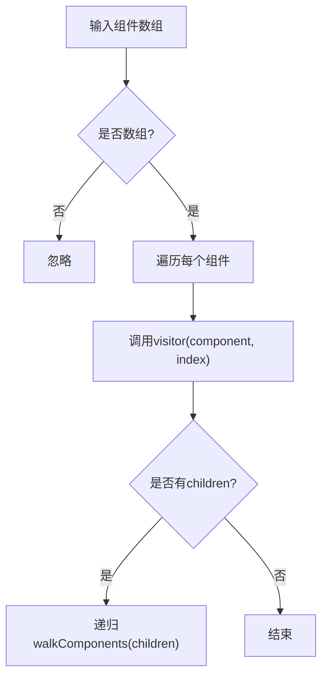
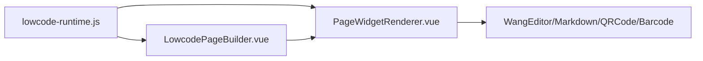

# 渲染管线架构

<cite>
**本文引用的文件**
- [LowcodePageBuilder.vue](file://forge-admin-ui/src/components/lowcode-builder/page/LowcodePageBuilder.vue)
- [PageWidgetRenderer.vue](file://forge-admin-ui/src/components/lowcode-builder/shared/PageWidgetRenderer.vue)
- [lowcode-runtime.js](file://forge-h5-ui/src/utils/lowcode-runtime.js)
- [autoFieldRegistry.js](file://forge-admin-ui/src/views/app-center/components/designer/form-first/autoFieldRegistry.js)
- [formDesignerSchema.js](file://forge-admin-ui/src/views/app-center/components/designer/form-first/formDesignerSchema.js)
</cite>

## 目录
1. [简介](#简介)
2. [项目结构](#项目结构)
3. [核心组件](#核心组件)
4. [架构总览](#架构总览)
5. [详细组件分析](#详细组件分析)
6. [依赖关系分析](#依赖关系分析)
7. [性能考量](#性能考量)
8. [故障排查指南](#故障排查指南)
9. [结论](#结论)
10. [附录：渲染API参考与最佳实践](#附录渲染api参考与最佳实践)

## 简介
本技术文档围绕低代码平台的“渲染管线”展开，聚焦以下主题：
- 组件渲染生命周期：从页面配置到可视化的完整流程
- 虚拟DOM生成机制：基于Vue的响应式数据驱动渲染
- 组件树遍历算法：区域（Zone）与组件树的解析、合并与更新
- 渲染优化策略：批处理、增量更新、懒加载与内存管理
- 渲染调度器与批处理：事件与状态变更的聚合与执行
- 性能监控、调试工具与故障排查方法
- 渲染API参考与最佳实践

## 项目结构
本项目包含多端前端工程，其中低代码运行时与构建器相关能力主要分布在以下位置：
- H5端运行时工具：负责页面Schema归一化、区域选择、表单字段规范化、联动与权限等
- Admin端低代码构建器：提供可视化编辑、画布、属性面板与布局同步
- 共享组件渲染器：按组件键值动态渲染具体UI，支持远程数据绑定与异步模块加载

图表来源
- [lowcode-runtime.js:19-90](file://forge-h5-ui/src/utils/lowcode-runtime.js#L19-L90)
- [LowcodePageBuilder.vue:60-163](file://forge-admin-ui/src/components/lowcode-builder/page/LowcodePageBuilder.vue#L60-L163)
- [PageWidgetRenderer.vue:367-422](file://forge-admin-ui/src/components/lowcode-builder/shared/PageWidgetRenderer.vue#L367-L422)

章节来源
- [lowcode-runtime.js:19-90](file://forge-h5-ui/src/utils/lowcode-runtime.js#L19-L90)
- [LowcodePageBuilder.vue:60-163](file://forge-admin-ui/src/components/lowcode-builder/page/LowcodePageBuilder.vue#L60-L163)
- [PageWidgetRenderer.vue:367-422](file://forge-admin-ui/src/components/lowcode-builder/shared/PageWidgetRenderer.vue#L367-L422)

## 核心组件
- 运行时Schema处理器：负责将原始页面配置转换为可渲染的结构，包括区域识别、可见性控制、表单区定位与字段规范化。
- 构建器容器：协调列表与表单两种模式，维护本地Schema副本，监听外部模型变化并同步回写。
- 通用组件渲染器：根据组件键值动态渲染不同UI，支持远程数据绑定、选项源、安全HTML渲染与异步模块加载。

章节来源
- [lowcode-runtime.js:19-90](file://forge-h5-ui/src/utils/lowcode-runtime.js#L19-L90)
- [LowcodePageBuilder.vue:60-163](file://forge-admin-ui/src/components/lowcode-builder/page/LowcodePageBuilder.vue#L60-L163)
- [PageWidgetRenderer.vue:367-734](file://forge-admin-ui/src/components/lowcode-builder/shared/PageWidgetRenderer.vue#L367-L734)

## 架构总览
低代码渲染管线由“配置归一化 → 区域选择 → 字段规范化 → 构建器编排 → 组件渲染”构成。H5端提供运行时工具函数，Admin端提供构建器与渲染器，二者通过一致的Schema协议协作。

图表来源
- [lowcode-runtime.js:19-90](file://forge-h5-ui/src/utils/lowcode-runtime.js#L19-L90)
- [LowcodePageBuilder.vue:60-163](file://forge-admin-ui/src/components/lowcode-builder/page/LowcodePageBuilder.vue#L60-L163)
- [PageWidgetRenderer.vue:367-734](file://forge-admin-ui/src/components/lowcode-builder/shared/PageWidgetRenderer.vue#L367-L734)

## 详细组件分析

### 运行时Schema处理器（H5端）
职责
- 解析并归一化页面Schema，提取zones，过滤可见区域
- 定位表单区，提取或构造表单设计器Schema
- 规范化主字段与子表字段，合并设计器与存储字段
- 计算字段联动、显示规则、权限与动作可见性
- 构建事件参数、结果映射与清理补丁

关键流程
- 页面Schema归一化：校验zones数组，标准化zoneId/zoneType/显隐标记
- 表单区选择：优先匹配历史兼容键，否则取首个form类型区域
- 字段规范化：统一label/type/required/readonly/hidden/defaultValue/runtimeRules
- 联动与规则：支持条件匹配、空值策略、远程字典过滤
- 动作与权限：合并底部栏动作、审批流动作，按权限禁用或隐藏

复杂度与优化
- 字段映射使用Map索引，避免重复查找，时间复杂度O(n)
- 规则匹配采用短路逻辑，减少无效计算
- 危险键白名单过滤，防止注入风险

图表来源
- [lowcode-runtime.js:19-90](file://forge-h5-ui/src/utils/lowcode-runtime.js#L19-L90)
- [lowcode-runtime.js:92-102](file://forge-h5-ui/src/utils/lowcode-runtime.js#L92-L102)
- [lowcode-runtime.js:296-350](file://forge-h5-ui/src/utils/lowcode-runtime.js#L296-L350)
- [lowcode-runtime.js:352-400](file://forge-h5-ui/src/utils/lowcode-runtime.js#L352-L400)

章节来源
- [lowcode-runtime.js:19-90](file://forge-h5-ui/src/utils/lowcode-runtime.js#L19-L90)
- [lowcode-runtime.js:92-102](file://forge-h5-ui/src/utils/lowcode-runtime.js#L92-L102)
- [lowcode-runtime.js:296-350](file://forge-h5-ui/src/utils/lowcode-runtime.js#L296-L350)
- [lowcode-runtime.js:352-400](file://forge-h5-ui/src/utils/lowcode-runtime.js#L352-L400)

### 构建器容器（Admin端）
职责
- 维护本地Schema副本，监听外部modelValue与modelSchema变化
- 切换列表/表单模式，同步布局与区域
- 管理画布项增删改，触发zone更新回调
- 将布局变更应用到zones，保持与模型一致

交互要点
- watch modelValue/modelSchema：深度比较后替换本地Schema
- layoutType变化：重新同步grid布局与zones
- 画布项更新：patch zone.canvas.items并触发zone更新

图表来源
- [LowcodePageBuilder.vue:60-163](file://forge-admin-ui/src/components/lowcode-builder/page/LowcodePageBuilder.vue#L60-L163)
- [LowcodePageBuilder.vue:149-212](file://forge-admin-ui/src/components/lowcode-builder/page/LowcodePageBuilder.vue#L149-L212)

章节来源
- [LowcodePageBuilder.vue:60-163](file://forge-admin-ui/src/components/lowcode-builder/page/LowcodePageBuilder.vue#L60-L163)
- [LowcodePageBuilder.vue:149-212](file://forge-admin-ui/src/components/lowcode-builder/page/LowcodePageBuilder.vue#L149-L212)

### 通用组件渲染器（Admin端）
职责
- 根据componentKey渲染对应UI（富文本、Markdown、二维码、条形码、日历、分页、分割面板等）
- 支持远程数据绑定与选项源，自动请求与错误处理
- 安全渲染HTML与Vue模板片段，清洗标签与样式
- 按需加载第三方模块，降低首屏体积

渲染与数据流
- computed派生各组件所需值（内容、标题、数量、尺寸等）
- watch监听数据绑定与选项源变化，触发请求或重绘
- 事件回调通过emitPropsPatch向上更新propsData

图表来源
- [PageWidgetRenderer.vue:367-734](file://forge-admin-ui/src/components/lowcode-builder/shared/PageWidgetRenderer.vue#L367-L734)

章节来源
- [PageWidgetRenderer.vue:367-734](file://forge-admin-ui/src/components/lowcode-builder/shared/PageWidgetRenderer.vue#L367-L734)

### 组件树遍历与ID重写（设计器侧）
职责
- 遍历组件树，判断是否创建缺失字段
- 递归访问children，保证深层结构一致性
- 重写组件ID以避免冲突，合并补丁字段

算法要点
- walkComponents：深度优先遍历，visitor回调处理每个节点
- isDescendantTarget：判断目标是否为后代节点
- rewriteComponentIds：为复制节点分配新ID，避免重复

图表来源
- [autoFieldRegistry.js:87-108](file://forge-admin-ui/src/views/app-center/components/designer/form-first/autoFieldRegistry.js#L87-L108)
- [formDesignerSchema.js:1010-1051](file://forge-admin-ui/src/views/app-center/components/designer/form-first/formDesignerSchema.js#L1010-L1051)

章节来源
- [autoFieldRegistry.js:87-108](file://forge-admin-ui/src/views/app-center/components/designer/form-first/autoFieldRegistry.js#L87-L108)
- [formDesignerSchema.js:1010-1051](file://forge-admin-ui/src/views/app-center/components/designer/form-first/formDesignerSchema.js#L1010-L1051)

## 依赖关系分析
- 运行时工具被H5端页面与表单组件消费，提供统一的Schema与上下文
- 构建器依赖运行时工具产出的zones与fields，驱动画布与属性面板
- 渲染器依赖运行时工具提供的字段控制与联动规则，确保行为一致
- 第三方库通过异步导入按需加载，减少初始包体

图表来源
- [lowcode-runtime.js:19-90](file://forge-h5-ui/src/utils/lowcode-runtime.js#L19-L90)
- [LowcodePageBuilder.vue:60-163](file://forge-admin-ui/src/components/lowcode-builder/page/LowcodePageBuilder.vue#L60-L163)
- [PageWidgetRenderer.vue:367-422](file://forge-admin-ui/src/components/lowcode-builder/shared/PageWidgetRenderer.vue#L367-L422)

章节来源
- [lowcode-runtime.js:19-90](file://forge-h5-ui/src/utils/lowcode-runtime.js#L19-L90)
- [LowcodePageBuilder.vue:60-163](file://forge-admin-ui/src/components/lowcode-builder/page/LowcodePageBuilder.vue#L60-L163)
- [PageWidgetRenderer.vue:367-422](file://forge-admin-ui/src/components/lowcode-builder/shared/PageWidgetRenderer.vue#L367-L422)

## 性能考量
- 批处理与增量更新
  - 构建器通过watch监听局部变化，仅在差异时触发更新，减少不必要的重渲染
  - 运行时字段规范化使用Map索引，避免重复查找，提升大表单场景性能
- 懒加载与按需引入
  - 渲染器对编辑器、Markdown、二维码、条形码等第三方库采用异步import，降低首屏体积
  - 仅在组件挂载或依赖变化时加载，避免无用资源占用
- 内存管理
  - 编辑器实例在卸载前销毁，释放内部资源
  - 远程数据绑定失败时清空状态，避免残留引用导致内存泄漏
- 规则与联动优化
  - 条件匹配短路求值，减少无效计算
  - 联动仅作用于受控字段，避免全量刷新

[本节为通用性能指导，不直接分析具体文件]

## 故障排查指南
常见问题与定位方法
- 表单区未显示
  - 检查zones是否有效、visibleInModes是否包含当前mode
  - 确认resolveRuntimeFormZone是否能定位到表单区
- 字段未渲染或不可见
  - 检查字段规范化后的type、formVisible、hidden/readonly/required
  - 查看显示规则与联动是否覆盖默认值
- 远程数据绑定失败
  - 确认optionSource/dataBinding配置是否正确
  - 查看请求方法与URL拼接，检查接口返回数据结构
- 第三方库加载失败
  - 检查网络与CDN可用性
  - 查看控制台错误信息，确认模块路径与版本兼容

章节来源
- [lowcode-runtime.js:19-90](file://forge-h5-ui/src/utils/lowcode-runtime.js#L19-L90)
- [PageWidgetRenderer.vue:646-708](file://forge-admin-ui/src/components/lowcode-builder/shared/PageWidgetRenderer.vue#L646-L708)

## 结论
该低代码渲染管线以“配置归一化 + 区域选择 + 字段规范化 + 构建器编排 + 组件渲染”为核心，结合运行时工具与构建器/渲染器的协同，实现了高内聚、低耦合的可扩展渲染体系。通过批处理、增量更新、懒加载与内存管理策略，保障了复杂页面的性能与稳定性。配合完善的调试与排障手段，便于快速定位问题与优化体验。

[本节为总结性内容，不直接分析具体文件]

## 附录：渲染API参考与最佳实践

### 运行时API参考（H5端）
- 页面Schema归一化
  - 功能：解析并标准化pageSchema，提取zones
  - 输入：pageSchema对象或JSON字符串
  - 输出：{ zones: [...] }
  - 参考路径：[lowcode-runtime.js:19-27](file://forge-h5-ui/src/utils/lowcode-runtime.js#L19-L27)
- 区域选择与可见性
  - 功能：根据mode过滤可见zones
  - 输入：pageSchema与mode
  - 输出：zones数组
  - 参考路径：[lowcode-runtime.js:29-32](file://forge-h5-ui/src/utils/lowcode-runtime.js#L29-L32)
- 表单区定位
  - 功能：定位表单区并提取formDesignerSchema
  - 输入：pageSchema与mode
  - 输出：{ zone, schema }或null
  - 参考路径：[lowcode-runtime.js:34-52](file://forge-h5-ui/src/utils/lowcode-runtime.js#L34-L52)
- 字段规范化
  - 功能：合并存储字段与设计器字段，过滤不可渲染字段
  - 输入：stored fields与designer schema
  - 输出：规范化字段数组
  - 参考路径：[lowcode-runtime.js:92-102](file://forge-h5-ui/src/utils/lowcode-runtime.js#L92-L102)
- 联动与规则
  - 功能：计算字段联动、显示规则、权限与动作可见性
  - 输入：rules、formData、permissions
  - 输出：patch/控制标志/可见性
  - 参考路径：[lowcode-runtime.js:296-350](file://forge-h5-ui/src/utils/lowcode-runtime.js#L296-L350), [lowcode-runtime.js:352-400](file://forge-h5-ui/src/utils/lowcode-runtime.js#L352-L400)

### 构建器API参考（Admin端）
- 页面构建器容器
  - 功能：维护本地Schema、监听变化、同步布局与区域
  - Props：modelValue、modelSchema
  - Events：update:modelValue
  - 参考路径：[LowcodePageBuilder.vue:75-163](file://forge-admin-ui/src/components/lowcode-builder/page/LowcodePageBuilder.vue#L75-L163)
- 画布与属性面板
  - 功能：编辑表单区组件、更新items、触发zone更新
  - 参考路径：[LowcodePageBuilder.vue:149-212](file://forge-admin-ui/src/components/lowcode-builder/page/LowcodePageBuilder.vue#L149-L212)

### 组件渲染器API参考（Admin端）
- 通用组件渲染器
  - 功能：按componentKey渲染UI，支持远程数据绑定与异步模块加载
  - Props：componentKey、propsData、dataContext、readonly
  - Events：update:propsData
  - 参考路径：[PageWidgetRenderer.vue:367-734](file://forge-admin-ui/src/components/lowcode-builder/shared/PageWidgetRenderer.vue#L367-L734)

### 最佳实践
- 合理划分zones与visibleInModes，避免无关区域参与渲染
- 使用字段规范化与规则引擎，集中管理显示/只读/必填逻辑
- 远程数据绑定需配置错误处理与重试策略，避免阻塞渲染
- 第三方库按需加载，减少首屏体积；及时销毁实例释放内存
- 在构建器中尽量局部更新，避免全量重算与重渲染

[本节为API参考与实践建议，不直接分析具体文件]