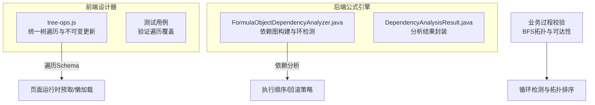
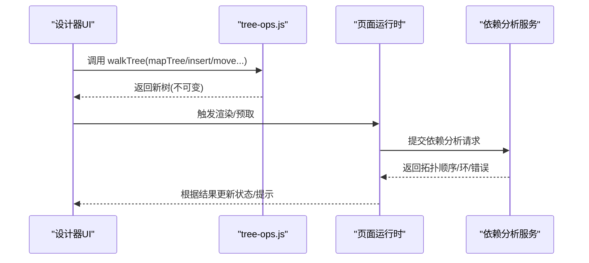
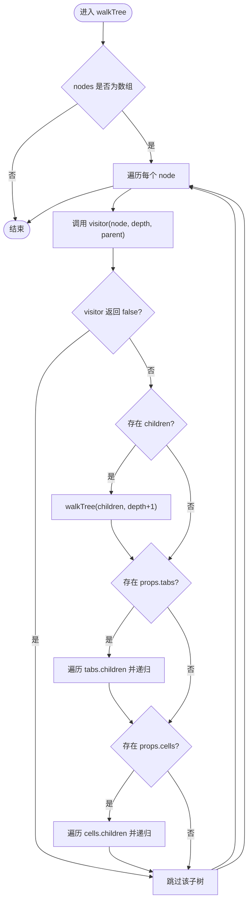
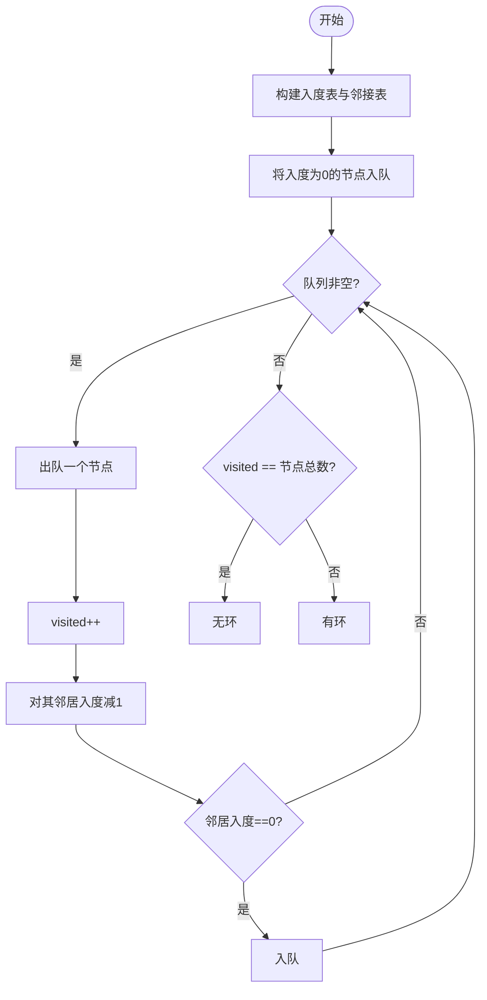
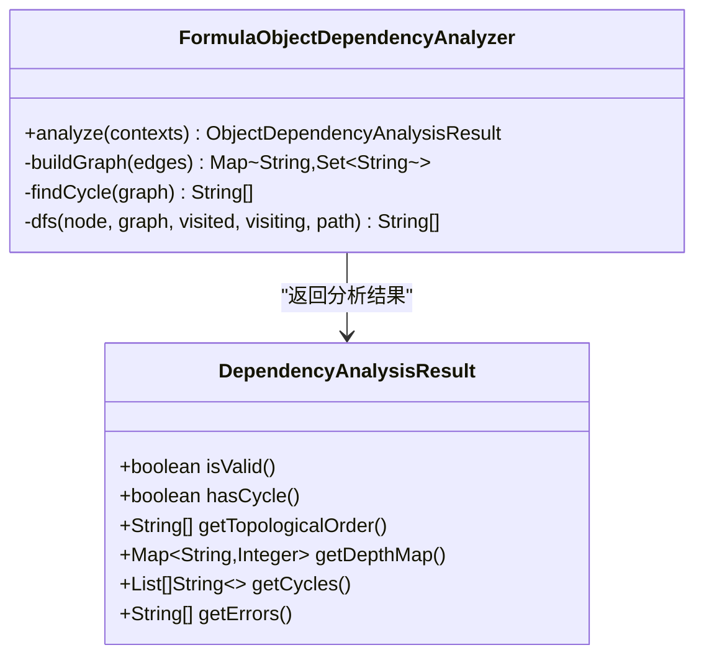
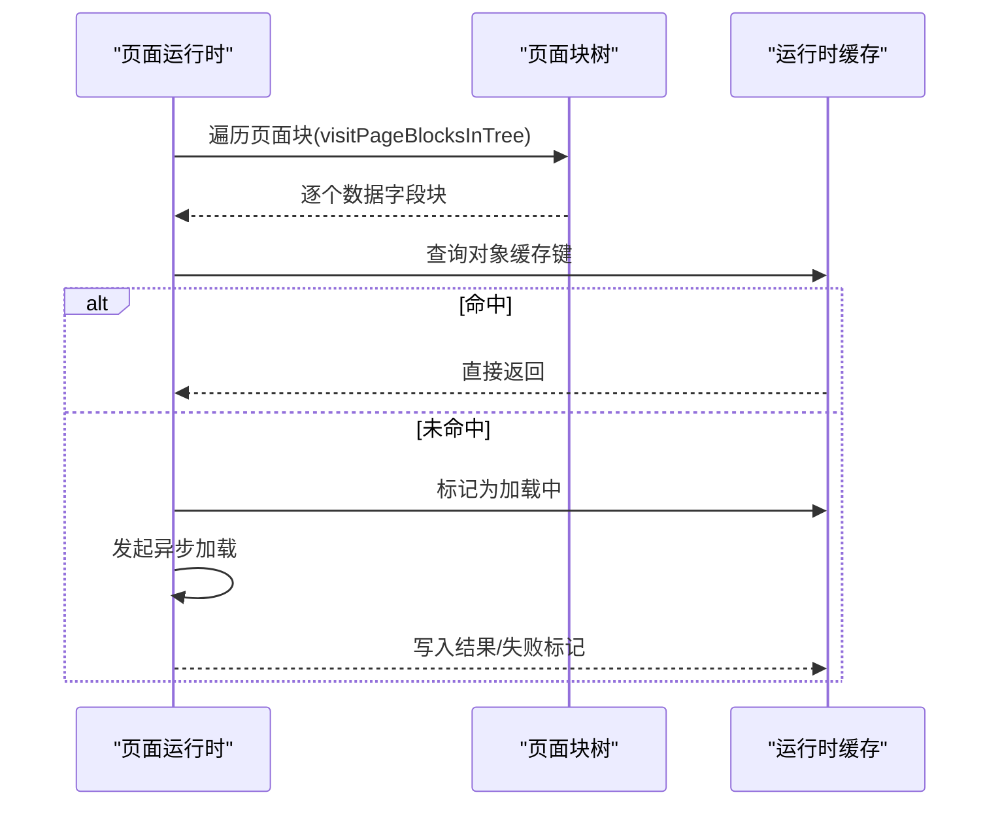

# 组件树遍历算法

<cite>
**本文引用的文件**
- [tree-ops.js](file://forge-admin-ui/src/components/lowcode-builder/designer-core/spec/tree-ops.js)
- [container-tree.test.js](file://forge-admin-ui/src/components/lowcode-builder/designer-core/__tests__/container-tree.test.js)
- [FormulaObjectDependencyAnalyzer.java](file://forge-server/forge-framework/forge-plugin-parent/forge-plugin-generator/src/main/java/com/mdframe/forge/plugin/generator/service/formula/FormulaObjectDependencyAnalyzer.java)
- [DependencyAnalysisResult.java](file://forge-server/forge-framework/forge-plugin-parent/forge-plugin-generator/src/main/java/com/mdframe/forge/plugin/generator/domain/formula/DependencyAnalysisResult.java)
- [business-process-schema.js](file://forge-admin-ui/src/components/business-process-designer/business-process-schema.js)
- [application-runtime.[applicationCode].vue](file://forge-admin-ui/src/views/app-center/application-runtime.[applicationCode].vue)
- [usePageLoading.js](file://forge-h5-ui/src/composables/usePageLoading.js)
</cite>

## 目录
1. [简介](#简介)
2. [项目结构](#项目结构)
3. [核心组件](#核心组件)
4. [架构总览](#架构总览)
5. [详细组件分析](#详细组件分析)
6. [依赖关系与拓扑排序](#依赖关系与拓扑排序)
7. [性能优化与懒加载](#性能优化与懒加载)
8. [调试与性能分析方法](#调试与性能分析方法)
9. [故障排查指南](#故障排查指南)
10. [结论](#结论)

## 简介
本技术文档聚焦低代码平台的“组件树遍历算法”，围绕递归遍历策略、深度优先搜索（DFS）与广度优先搜索（BFS）的实现方式，系统阐述组件依赖关系解析、循环引用检测与拓扑排序。同时给出遍历性能优化、懒加载机制与增量更新策略的实践建议，并提供调试工具与性能分析方法，帮助读者在复杂嵌套的组件树中高效完成查找、校验、渲染与计算。

## 项目结构
本项目包含前端设计器与后端公式引擎两部分：
- 前端设计器提供统一的组件 Schema 树操作能力，支持三种嵌套路径的统一遍历与不可变更新。
- 后端公式引擎负责跨对象依赖分析与循环检测，输出拓扑顺序与错误信息。

图表来源
- [tree-ops.js:33-70](file://forge-admin-ui/src/components/lowcode-builder/designer-core/spec/tree-ops.js#L33-L70)
- [FormulaObjectDependencyAnalyzer.java:171-200](file://forge-server/forge-framework/forge-plugin-parent/forge-plugin-generator/src/main/java/com/mdframe/forge/plugin/generator/service/formula/FormulaObjectDependencyAnalyzer.java#L171-L200)
- [DependencyAnalysisResult.java:25-100](file://forge-server/forge-framework/forge-plugin-parent/forge-plugin-generator/src/main/java/com/mdframe/forge/plugin/generator/domain/formula/DependencyAnalysisResult.java#L25-L100)

章节来源
- [tree-ops.js:1-477](file://forge-admin-ui/src/components/lowcode-builder/designer-core/spec/tree-ops.js#L1-L477)
- [FormulaObjectDependencyAnalyzer.java:1-200](file://forge-server/forge-framework/forge-plugin-parent/forge-plugin-generator/src/main/java/com/mdframe/forge/plugin/generator/service/formula/FormulaObjectDependencyAnalyzer.java#L1-L200)
- [DependencyAnalysisResult.java:25-100](file://forge-server/forge-framework/forge-plugin-parent/forge-plugin-generator/src/main/java/com/mdframe/forge/plugin/generator/domain/formula/DependencyAnalysisResult.java#L25-L100)

## 核心组件
- 统一树遍历与操作（前端）
  - 深度优先遍历 walkTree：自动识别 children、props.tabs[].children、props.cells[].children 三种嵌套路径，支持 visitor 短路控制。
  - 查找与路径：findNodeById、findNodePath、getNodeDepth、findParentNode、isAncestorOf。
  - 不可变更新：mapTree、mapSiblingsInTree、insertNode、removeNode、moveNode、replaceNode。
  - 深度检查：canInsertAtDepth、getMaxTreeDepth。
- 依赖分析与拓扑排序（后端）
  - 构建对象级依赖图，收集边与错误，检测环并返回首个环路径。
  - 输出拓扑顺序、最大深度、错误列表等结构化结果。
- 业务过程校验（前端）
  - BFS 拓扑检测 containsCycle，以及从起点可达集合 collectReachable。

章节来源
- [tree-ops.js:33-70](file://forge-admin-ui/src/components/lowcode-builder/designer-core/spec/tree-ops.js#L33-L70)
- [tree-ops.js:96-191](file://forge-admin-ui/src/components/lowcode-builder/designer-core/spec/tree-ops.js#L96-L191)
- [tree-ops.js:203-477](file://forge-admin-ui/src/components/lowcode-builder/designer-core/spec/tree-ops.js#L203-L477)
- [FormulaObjectDependencyAnalyzer.java:30-49](file://forge-server/forge-framework/forge-plugin-parent/forge-plugin-generator/src/main/java/com/mdframe/forge/plugin/generator/service/formula/FormulaObjectDependencyAnalyzer.java#L30-L49)
- [business-process-schema.js:613-675](file://forge-admin-ui/src/components/business-process-designer/business-process-schema.js#L613-L675)

## 架构总览
组件树遍历贯穿“设计期”和“运行期”：
- 设计期：通过 walkTree 对多形态容器进行统一 DFS 遍历，支撑插入、删除、移动、替换等不可变更新；通过 isAncestorOf 防止拖拽形成循环。
- 运行期：基于页面块树遍历，按需预取或懒加载数据字段块的运行时属性，减少首屏开销。
- 后端：对跨对象公式进行依赖图构建与环检测，输出拓扑顺序以指导计算与回滚。

图表来源
- [tree-ops.js:33-70](file://forge-admin-ui/src/components/lowcode-builder/designer-core/spec/tree-ops.js#L33-L70)
- [application-runtime.[applicationCode].vue:2643-2675](file://forge-admin-ui/src/views/app-center/application-runtime.[applicationCode].vue#L2643-L2675)
- [FormulaObjectDependencyAnalyzer.java:30-49](file://forge-server/forge-framework/forge-plugin-parent/forge-plugin-generator/src/main/java/com/mdframe/forge/plugin/generator/service/formula/FormulaObjectDependencyAnalyzer.java#L30-L49)

## 详细组件分析

### 统一树遍历与不可变更新（tree-ops.js）
- 深度优先遍历 walkTree
  - 支持三种嵌套路径：children、props.tabs[].children、props.cells[].children。
  - visitor 可返回 false 中止当前子树的继续遍历，便于快速失败或剪枝。
- 查找与路径
  - findNodePath 返回根到目标的路径数组，用于计算深度、父节点、祖先判断。
  - getNodeDepth、findParentNode、isAncestorOf 均基于路径实现。
- 不可变更新
  - mapTree/mapSiblingsInTree 递归映射兄弟节点与子树，保持原树不变。
  - insertNode/removeNode/moveNode/replaceNode 统一处理三种嵌套路径，moveNode 内置循环保护（不能移动到自身后代）。
- 深度检查
  - canInsertAtDepth 限制新增层级，getMaxTreeDepth 统计最大深度。

图表来源
- [tree-ops.js:33-70](file://forge-admin-ui/src/components/lowcode-builder/designer-core/spec/tree-ops.js#L33-L70)

章节来源
- [tree-ops.js:33-70](file://forge-admin-ui/src/components/lowcode-builder/designer-core/spec/tree-ops.js#L33-L70)
- [tree-ops.js:96-191](file://forge-admin-ui/src/components/lowcode-builder/designer-core/spec/tree-ops.js#L96-L191)
- [tree-ops.js:203-477](file://forge-admin-ui/src/components/lowcode-builder/designer-core/spec/tree-ops.js#L203-L477)

### 测试覆盖（container-tree.test.js）
- 构造包含 children、tabs、cells 三类容器的混合树，验证 walkTree 能访问所有节点，确保三种嵌套路径被完整覆盖。

章节来源
- [container-tree.test.js:117-166](file://forge-admin-ui/src/components/lowcode-builder/designer-core/__tests__/container-tree.test.js#L117-L166)

### 业务过程校验中的 BFS 拓扑与可达性（business-process-schema.js）
- containsCycle：基于入度表与队列的 BFS 拓扑检测，若访问节点数不等于总节点数则存在环。
- collectReachable：从起点出发进行 BFS，收集可达节点集合，用于影响范围分析。

图表来源
- [business-process-schema.js:613-675](file://forge-admin-ui/src/components/business-process-designer/business-process-schema.js#L613-L675)

章节来源
- [business-process-schema.js:613-675](file://forge-admin-ui/src/components/business-process-designer/business-process-schema.js#L613-L675)

## 依赖关系与拓扑排序
- 对象级依赖图构建
  - 遍历上下文中的跨对象公式，收集边与错误，构建对象级有向图。
- 环检测
  - 使用 DFS 回溯法检测环，记录首个环路径，便于定位问题。
- 拓扑排序
  - 通过后处理生成依赖先于依赖者的线性顺序，供运行时按序计算。
- 结果封装
  - 提供 isValid、hasCycle、topologicalOrder、depthMap、cycles、errors 等字段，便于上层消费。

图表来源
- [FormulaObjectDependencyAnalyzer.java:171-200](file://forge-server/forge-framework/forge-plugin-parent/forge-plugin-generator/src/main/java/com/mdframe/forge/plugin/generator/service/formula/FormulaObjectDependencyAnalyzer.java#L171-L200)
- [DependencyAnalysisResult.java:25-100](file://forge-server/forge-framework/forge-plugin-parent/forge-plugin-generator/src/main/java/com/mdframe/forge/plugin/generator/domain/formula/DependencyAnalysisResult.java#L25-L100)

章节来源
- [FormulaObjectDependencyAnalyzer.java:30-49](file://forge-server/forge-framework/forge-plugin-parent/forge-plugin-generator/src/main/java/com/mdframe/forge/plugin/generator/service/formula/FormulaObjectDependencyAnalyzer.java#L30-L49)
- [FormulaObjectDependencyAnalyzer.java:171-200](file://forge-server/forge-framework/forge-plugin-parent/forge-plugin-generator/src/main/java/com/mdframe/forge/plugin/generator/service/formula/FormulaObjectDependencyAnalyzer.java#L171-L200)
- [DependencyAnalysisResult.java:25-100](file://forge-server/forge-framework/forge-plugin-parent/forge-plugin-generator/src/main/java/com/mdframe/forge/plugin/generator/domain/formula/DependencyAnalysisResult.java#L25-L100)

## 性能优化与懒加载
- 遍历优化
  - 使用 visitor 短路：在查找命中或校验失败时立即停止继续遍历，降低时间复杂度。
  - 避免重复扫描：对频繁查询的 ID 建立索引 Map，将 O(n) 查找降为 O(1)。
  - 控制树深：canInsertAtDepth 限制新增层级，防止过深树导致渲染与计算成本飙升。
- 懒加载与预取
  - 页面运行时通过 visitPageBlocksInTree 遍历页面块树，对数据字段块按需预取运行时属性，未命中则加入加载集合，避免重复请求。
  - 使用通用加载状态管理 usePageLoading 抽象 loading/refreshing/success/empty/error 状态，统一异步任务生命周期。
- 增量更新
  - 所有树操作均为不可变更新，结合最小化 diff 与局部重渲染，减少不必要的重建。
  - 移动节点前进行祖先检查，避免无效操作与循环。

图表来源
- [application-runtime.[applicationCode].vue:2643-2675](file://forge-admin-ui/src/views/app-center/application-runtime.[applicationCode].vue#L2643-L2675)
- [usePageLoading.js:1-87](file://forge-h5-ui/src/composables/usePageLoading.js#L1-L87)

章节来源
- [application-runtime.[applicationCode].vue:2643-2675](file://forge-admin-ui/src/views/app-center/application-runtime.[applicationCode].vue#L2643-L2675)
- [usePageLoading.js:1-87](file://forge-h5-ui/src/composables/usePageLoading.js#L1-L87)

## 调试与性能分析方法
- 遍历调试
  - 在 walkTree 的 visitor 中打印节点 id、类型、深度与父节点，快速定位异常分支。
  - 使用 findNodePath 获取目标节点路径，辅助定位插入/删除/移动的目标位置是否正确。
- 循环检测调试
  - 利用后端返回的 cyclePath 与 errors，结合业务语义定位冲突的依赖关系。
  - 前端 moveNode 已内置祖先检查，可在控制台输出拦截原因。
- 性能分析
  - 使用浏览器 Performance 面板录制关键交互（拖拽、保存、预览），观察主线程耗时与重排重绘。
  - 对热点路径（如大量节点的 mapTree/collectAllNodes）引入缓存与短路，对比前后耗时。
  - 对大数据字段块采用懒加载与分页预取，降低首屏压力。

[本节为通用方法指导，不直接分析具体文件]

## 故障排查指南
- 无法找到节点
  - 检查节点 id 是否存在于任一嵌套路径（children/tabs/cells），必要时用 collectAllNodeIds 全量采集核对。
- 插入/移动失败
  - 确认目标父节点类型与存储路径匹配（grid/grid-layout 使用 cells，listpage tabs 使用 props.tabs）。
  - 移动时若目标为自身后代会被拒绝，需调整目标位置。
- 循环依赖
  - 查看后端返回的 cycles 与 cyclePath，修正公式或关系配置，消除环。
- 渲染卡顿
  - 检查树的最大深度与节点数量，必要时拆分容器或启用懒加载。
  - 对高频访问的查找建立索引 Map，避免重复 .find()。

章节来源
- [tree-ops.js:306-430](file://forge-admin-ui/src/components/lowcode-builder/designer-core/spec/tree-ops.js#L306-L430)
- [FormulaObjectDependencyAnalyzer.java:30-49](file://forge-server/forge-framework/forge-plugin-parent/forge-plugin-generator/src/main/java/com/mdframe/forge/plugin/generator/service/formula/FormulaObjectDependencyAnalyzer.java#L30-L49)
- [DependencyAnalysisResult.java:25-100](file://forge-server/forge-framework/forge-plugin-parent/forge-plugin-generator/src/main/java/com/mdframe/forge/plugin/generator/domain/formula/DependencyAnalysisResult.java#L25-L100)

## 结论
本方案在前端通过统一的 DFS 遍历与不可变更新，实现对多形态容器的高效操作；在后端通过对象级依赖图与环检测，输出拓扑顺序保障计算正确性。结合懒加载、预取与增量更新策略，显著降低首屏与交互延迟。配合调试与性能分析方法，可在复杂场景下稳定维护与持续优化组件树处理能力。