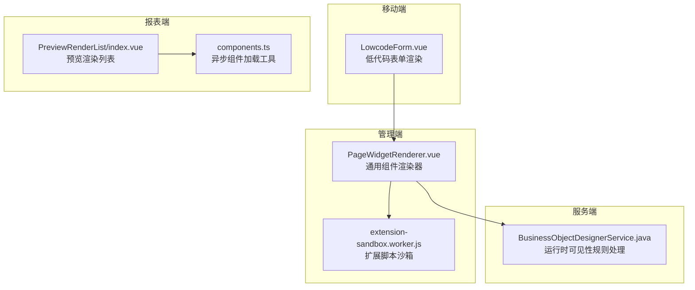
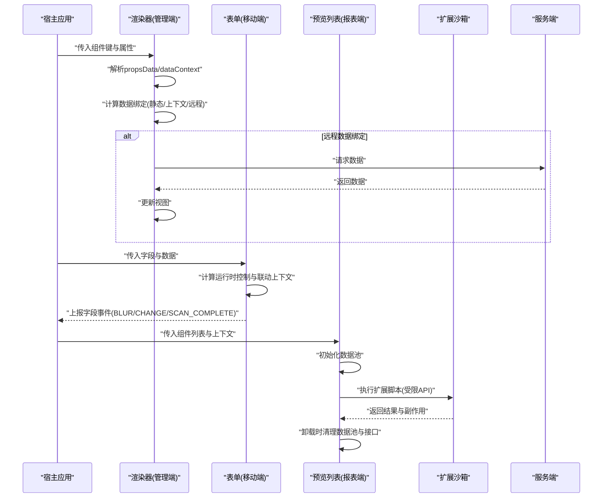
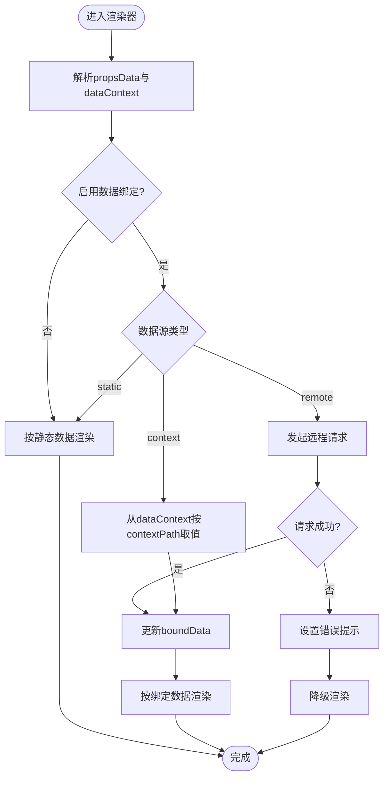
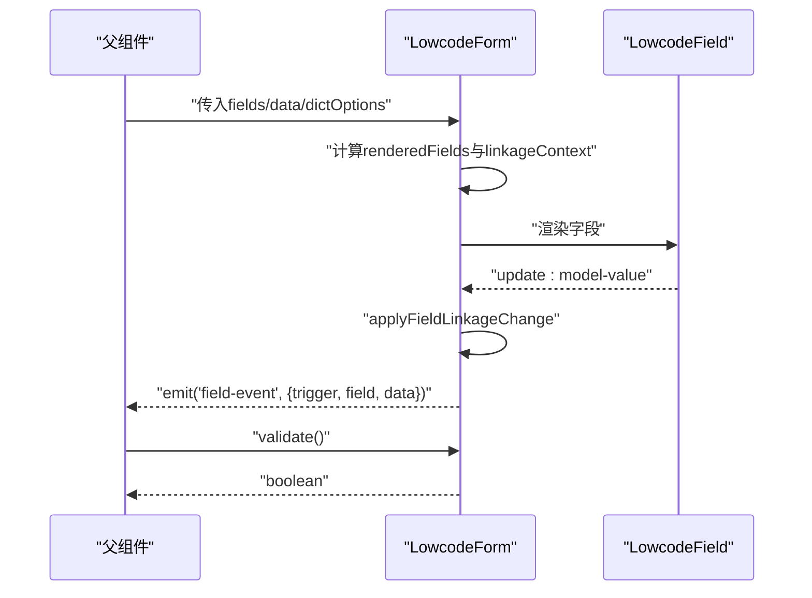
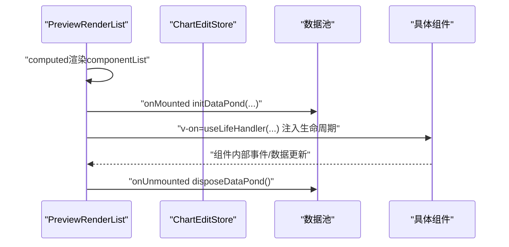
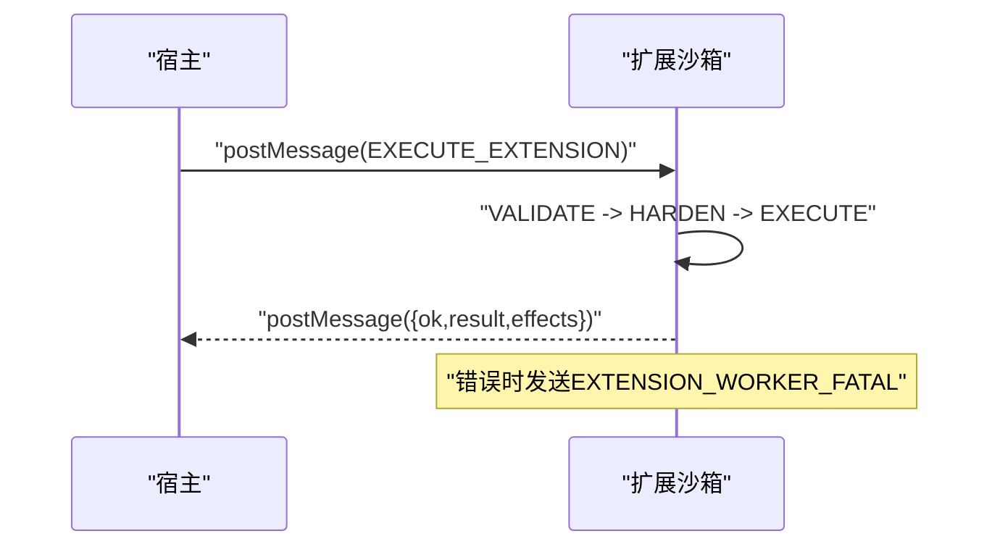
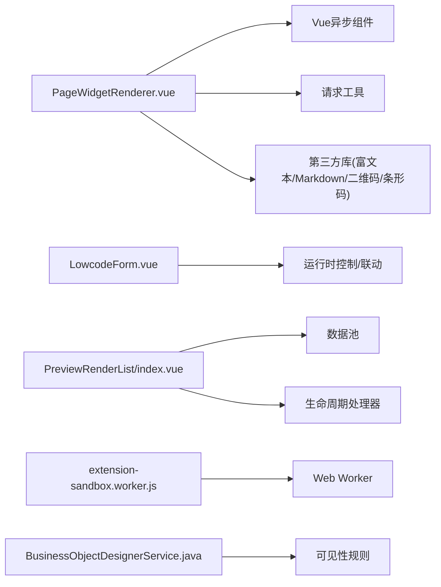

# 组件渲染生命周期

<cite>
**本文引用的文件**
- [PageWidgetRenderer.vue](file://forge-admin-ui/src/components/lowcode-builder/shared/PageWidgetRenderer.vue)
- [LowcodeForm.vue](file://forge-h5-ui/src/components/lowcode/LowcodeForm.vue)
- [PreviewRenderList/index.vue](file://forge-report-ui/src/views/preview/components/PreviewRenderList/index.vue)
- [components.ts](file://forge-report-ui/src/utils/components.ts)
- [extension-sandbox.worker.js](file://forge-admin-ui/src/components/lowcode-extension/js/extension-sandbox.worker.js)
- [BusinessObjectDesignerService.java](file://forge-server/forge-framework/forge-plugin-parent/forge-plugin-generator/src/main/java/com/mdframe/forge/plugin/generator/service/businessapp/BusinessObjectDesignerService.java)
- [useSync.hook.ts](file://forge-report-ui/src/views/chart/hooks/useSync.hook.ts)
</cite>

## 目录
1. [简介](#简介)
2. [项目结构](#项目结构)
3. [核心组件](#核心组件)
4. [架构总览](#架构总览)
5. [详细组件分析](#详细组件分析)
6. [依赖关系分析](#依赖关系分析)
7. [性能考虑](#性能考虑)
8. [故障排查指南](#故障排查指南)
9. [结论](#结论)
10. [附录](#附录)

## 简介
本技术文档围绕低代码平台的“组件渲染生命周期”，从组件注册、属性解析、数据绑定、事件处理到内存清理，系统梳理了从初始化到销毁的完整流程。重点解释渲染调度机制、异步加载策略与错误处理流程，并给出生命周期钩子的使用方式、最佳实践、调试技巧与性能优化建议。内容基于仓库中前端渲染器、H5表单渲染、报表预览渲染、沙箱执行以及后端可见性规则等实现进行归纳与提炼。

## 项目结构
本项目在多个子应用中实现了低代码组件渲染能力：
- 管理端（Admin UI）提供通用页面组件渲染器，支持多种内置组件、动态数据绑定与远程选项加载。
- H5 移动端提供低代码表单渲染，包含字段联动、运行时控制与事件上报。
- 报表端（Report UI）提供图表/可视化组件的预览渲染，负责数据池初始化与生命周期清理。
- 扩展脚本通过 Web Worker 沙箱安全执行，限制全局能力并收集副作用。
- 服务端对组件可见性等运行时规则进行校验与清洗，保障前后端一致性。

**图示来源**
- [PageWidgetRenderer.vue:367-591](file://forge-admin-ui/src/components/lowcode-builder/shared/PageWidgetRenderer.vue#L367-L591)
- [LowcodeForm.vue:20-93](file://forge-h5-ui/src/components/lowcode/LowcodeForm.vue#L20-L93)
- [PreviewRenderList/index.vue:44-123](file://forge-report-ui/src/views/preview/components/PreviewRenderList/index.vue#L44-L123)
- [components.ts:1-30](file://forge-report-ui/src/utils/components.ts#L1-L30)
- [extension-sandbox.worker.js:35-63](file://forge-admin-ui/src/components/lowcode-extension/js/extension-sandbox.worker.js#L35-L63)
- [BusinessObjectDesignerService.java:2959-2991](file://forge-server/forge-framework/forge-plugin-parent/forge-plugin-generator/src/main/java/com/mdframe/forge/plugin/generator/service/businessapp/BusinessObjectDesignerService.java#L2959-L2991)

**章节来源**
- [PageWidgetRenderer.vue:367-591](file://forge-admin-ui/src/components/lowcode-builder/shared/PageWidgetRenderer.vue#L367-L591)
- [LowcodeForm.vue:20-93](file://forge-h5-ui/src/components/lowcode/LowcodeForm.vue#L20-L93)
- [PreviewRenderList/index.vue:44-123](file://forge-report-ui/src/views/preview/components/PreviewRenderList/index.vue#L44-L123)
- [components.ts:1-30](file://forge-report-ui/src/utils/components.ts#L1-L30)
- [extension-sandbox.worker.js:35-63](file://forge-admin-ui/src/components/lowcode-extension/js/extension-sandbox.worker.js#L35-L63)
- [BusinessObjectDesignerService.java:2959-2991](file://forge-server/forge-framework/forge-plugin-parent/forge-plugin-generator/src/main/java/com/mdframe/forge/plugin/generator/service/businessapp/BusinessObjectDesignerService.java#L2959-L2991)

## 核心组件
- 通用组件渲染器（管理端）：负责按组件类型渲染、数据绑定、远程选项加载、富文本/二维码/条形码等复杂组件的生命周期管理。
- 低代码表单（移动端）：根据字段配置渲染表单，计算运行时可见性与联动上下文，统一上报字段事件。
- 预览渲染列表（报表端）：遍历组件列表，为每个组件注入生命周期处理器，初始化数据池并在卸载时清理。
- 异步组件加载工具（报表端）：封装 Vue 异步组件加载，提供加载态与骨架屏。
- 扩展脚本沙箱（管理端）：在 Worker 中安全执行用户脚本，限制全局能力，收集副作用并返回结果。
- 服务端可见性规则处理：检测并清洗运行时可见性规则，确保渲染层只接收必要信息。

**章节来源**
- [PageWidgetRenderer.vue:367-758](file://forge-admin-ui/src/components/lowcode-builder/shared/PageWidgetRenderer.vue#L367-L758)
- [LowcodeForm.vue:20-93](file://forge-h5-ui/src/components/lowcode/LowcodeForm.vue#L20-L93)
- [PreviewRenderList/index.vue:44-123](file://forge-report-ui/src/views/preview/components/PreviewRenderList/index.vue#L44-L123)
- [components.ts:1-30](file://forge-report-ui/src/utils/components.ts#L1-L30)
- [extension-sandbox.worker.js:35-63](file://forge-admin-ui/src/components/lowcode-extension/js/extension-sandbox.worker.js#L35-L63)
- [BusinessObjectDesignerService.java:2959-2991](file://forge-server/forge-framework/forge-plugin-parent/forge-plugin-generator/src/main/java/com/mdframe/forge/plugin/generator/service/businessapp/BusinessObjectDesignerService.java#L2959-L2991)

## 架构总览
下图展示了组件从注册到销毁的关键路径：
- 组件注册：通过异步加载工具或动态 import 注册组件。
- 属性解析：渲染器读取 propsData、dataContext，解析数据绑定与远程接口。
- 数据绑定：支持静态、上下文与远程三种数据源，按需发起请求并更新视图。
- 事件处理：表单字段变更触发联动与事件上报；扩展脚本通过沙箱 API 产生副作用。
- 生命周期清理：在卸载阶段释放资源、关闭数据池、移除监听。

**图示来源**
- [PageWidgetRenderer.vue:522-708](file://forge-admin-ui/src/components/lowcode-builder/shared/PageWidgetRenderer.vue#L522-L708)
- [LowcodeForm.vue:36-93](file://forge-h5-ui/src/components/lowcode/LowcodeForm.vue#L36-L93)
- [PreviewRenderList/index.vue:57-123](file://forge-report-ui/src/views/preview/components/PreviewRenderList/index.vue#L57-L123)
- [extension-sandbox.worker.js:35-63](file://forge-admin-ui/src/components/lowcode-extension/js/extension-sandbox.worker.js#L35-L63)
- [BusinessObjectDesignerService.java:2959-2991](file://forge-server/forge-framework/forge-plugin-parent/forge-plugin-generator/src/main/java/com/mdframe/forge/plugin/generator/service/businessapp/BusinessObjectDesignerService.java#L2959-L2991)

## 详细组件分析

### 通用组件渲染器（管理端）
- 组件注册与异步加载：通过 defineAsyncComponent 与自定义 loader 延迟加载富文本、Markdown、二维码等重型模块，减少首屏体积。
- 属性解析与数据绑定：
  - 支持 dataBinding.enabled、sourceType（static/context/remote）、dataPath/contextPath/valueField/contentField 等配置。
  - 当 sourceType 为 remote 时，根据 api/method/paramsText 发起请求，并将响应映射为 boundData。
  - 当 sourceType 为 context 时，从 dataContext 按 contextPath 取值。
- 事件处理：
  - 富文本编辑器创建与更新回调，将值回写至 propsData。
  - 穿梭框选项可远程加载，失败时设置错误提示。
- 生命周期：
  - onMounted：初始化条形码渲染。
  - onBeforeUnmount：销毁富文本编辑器实例，避免内存泄漏。
- 错误处理：
  - 远程选项与数据绑定均捕获异常，设置 loading/error 状态，保证界面稳定。

**图示来源**
- [PageWidgetRenderer.vue:522-758](file://forge-admin-ui/src/components/lowcode-builder/shared/PageWidgetRenderer.vue#L522-L758)

**章节来源**
- [PageWidgetRenderer.vue:367-758](file://forge-admin-ui/src/components/lowcode-builder/shared/PageWidgetRenderer.vue#L367-L758)

### 低代码表单（移动端）
- 渲染流程：
  - 根据 fields 数组生成 renderedFields，计算 __runtimeControl.visible 过滤不可见字段。
  - 为每个字段注入 linkageContext，用于联动过滤选项。
- 事件与联动：
  - updateField 更新数据后调用 applyFieldLinkageChange，触发联动逻辑。
  - 统一上报 field-event（BLUR/CHANGE/SCAN_COMPLETE）。
- 验证：
  - validate 方法检查必填项，填充 errors 对象并返回是否通过。

**图示来源**
- [LowcodeForm.vue:20-93](file://forge-h5-ui/src/components/lowcode/LowcodeForm.vue#L20-L93)

**章节来源**
- [LowcodeForm.vue:20-93](file://forge-h5-ui/src/components/lowcode/LowcodeForm.vue#L20-L93)

### 预览渲染列表（报表端）
- 组件遍历与注入：
  - 遍历 componentList，为分组与普通组件分别渲染。
  - 通过 v-on="useLifeHandler(item, renderPageContext)" 注入生命周期处理器。
- 数据池管理：
  - onMounted 初始化数据池 initDataPond，传入组件列表、全局请求配置与页面上下文。
  - onUnmounted 调用 disposeDataPond 清理，并根据 isMainRender 选择清理策略。
- 主题与样式：
  - 计算 themeSetting 与 themeColor，合并尺寸、滤镜、混合模式等样式。

**图示来源**
- [PreviewRenderList/index.vue:44-123](file://forge-report-ui/src/views/preview/components/PreviewRenderList/index.vue#L44-L123)
- [useSync.hook.ts:134-192](file://forge-report-ui/src/views/chart/hooks/useSync.hook.ts#L134-L192)

**章节来源**
- [PreviewRenderList/index.vue:44-123](file://forge-report-ui/src/views/preview/components/PreviewRenderList/index.vue#L44-L123)
- [useSync.hook.ts:134-192](file://forge-report-ui/src/views/chart/hooks/useSync.hook.ts#L134-L192)

### 异步组件加载工具（报表端）
- 动态注册：componentInstall 在 Vue 实例上注册组件，避免重复注册。
- 异步加载：loadAsyncComponent/loadSkeletonAsyncComponent 封装 defineAsyncComponent，提供加载态与骨架屏，延迟时间较短以提升体验。

**章节来源**
- [components.ts:1-30](file://forge-report-ui/src/utils/components.ts#L1-L30)

### 扩展脚本沙箱（管理端）
- 执行流程：
  - 接收 EXECUTE_EXTENSION 消息，进入 VALIDATE/HARDEN/EXECUTE/RESPONSE 阶段。
  - 校验脚本、硬化全局环境、执行同步脚本，收集 effects 并返回结果。
- 安全限制：
  - 屏蔽危险全局（网络、存储、定时器、WebAssembly 等），冻结原型链。
  - 仅允许白名单字段与动作，所有输入输出通过 structuredClone 隔离。
- 错误处理：
  - 捕获 error/unhandledrejection，发送 EXTENSION_WORKER_FATAL，附带阶段与安全化错误信息。

**图示来源**
- [extension-sandbox.worker.js:35-63](file://forge-admin-ui/src/components/lowcode-extension/js/extension-sandbox.worker.js#L35-L63)
- [extension-sandbox.worker.js:79-130](file://forge-admin-ui/src/components/lowcode-extension/js/extension-sandbox.worker.js#L79-L130)
- [extension-sandbox.worker.js:132-180](file://forge-admin-ui/src/components/lowcode-extension/js/extension-sandbox.worker.js#L132-L180)
- [extension-sandbox.worker.js:182-213](file://forge-admin-ui/src/components/lowcode-extension/js/extension-sandbox.worker.js#L182-L213)

**章节来源**
- [extension-sandbox.worker.js:35-63](file://forge-admin-ui/src/components/lowcode-extension/js/extension-sandbox.worker.js#L35-L63)
- [extension-sandbox.worker.js:79-130](file://forge-admin-ui/src/components/lowcode-extension/js/extension-sandbox.worker.js#L79-L130)
- [extension-sandbox.worker.js:132-180](file://forge-admin-ui/src/components/lowcode-extension/js/extension-sandbox.worker.js#L132-L180)
- [extension-sandbox.worker.js:182-213](file://forge-admin-ui/src/components/lowcode-extension/js/extension-sandbox.worker.js#L182-L213)

### 服务端可见性规则处理
- 检测运行时可见性规则：扫描 component.runtimeRules 与 props.runtimeRules，判断是否存在 visible/hidden 效果。
- 清洗运行时字段属性：移除 __fc/__fcType/fieldBinding 等内部标记，仅保留渲染所需属性。

**章节来源**
- [BusinessObjectDesignerService.java:2959-2991](file://forge-server/forge-framework/forge-plugin-parent/forge-plugin-generator/src/main/java/com/mdframe/forge/plugin/generator/service/businessapp/BusinessObjectDesignerService.java#L2959-L2991)

## 依赖关系分析
- 渲染器依赖：
  - Vue 异步组件机制与请求工具。
  - 第三方库（富文本、Markdown、二维码、条形码）按需加载。
- 表单依赖：
  - 运行时控制与联动工具函数。
  - 字典选项与当前子项数据源。
- 预览列表依赖：
  - 数据池与生命周期处理器。
  - 主题与样式工具。
- 沙箱依赖：
  - Web Worker 通信协议。
  - 严格的全局白名单与副作用收集。
- 服务端依赖：
  - 运行时规则解析与属性清洗。

**图示来源**
- [PageWidgetRenderer.vue:367-422](file://forge-admin-ui/src/components/lowcode-builder/shared/PageWidgetRenderer.vue#L367-L422)
- [LowcodeForm.vue:20-93](file://forge-h5-ui/src/components/lowcode/LowcodeForm.vue#L20-L93)
- [PreviewRenderList/index.vue:44-123](file://forge-report-ui/src/views/preview/components/PreviewRenderList/index.vue#L44-L123)
- [extension-sandbox.worker.js:35-63](file://forge-admin-ui/src/components/lowcode-extension/js/extension-sandbox.worker.js#L35-L63)
- [BusinessObjectDesignerService.java:2959-2991](file://forge-server/forge-framework/forge-plugin-parent/forge-plugin-generator/src/main/java/com/mdframe/forge/plugin/generator/service/businessapp/BusinessObjectDesignerService.java#L2959-L2991)

**章节来源**
- [PageWidgetRenderer.vue:367-422](file://forge-admin-ui/src/components/lowcode-builder/shared/PageWidgetRenderer.vue#L367-L422)
- [LowcodeForm.vue:20-93](file://forge-h5-ui/src/components/lowcode/LowcodeForm.vue#L20-L93)
- [PreviewRenderList/index.vue:44-123](file://forge-report-ui/src/views/preview/components/PreviewRenderList/index.vue#L44-L123)
- [extension-sandbox.worker.js:35-63](file://forge-admin-ui/src/components/lowcode-extension/js/extension-sandbox.worker.js#L35-L63)
- [BusinessObjectDesignerService.java:2959-2991](file://forge-server/forge-framework/forge-plugin-parent/forge-plugin-generator/src/main/java/com/mdframe/forge/plugin/generator/service/businessapp/BusinessObjectDesignerService.java#L2959-L2991)

## 性能考虑
- 异步加载：
  - 使用 defineAsyncComponent 与懒加载，减少首屏体积与初始解析成本。
  - 为重型编辑器（富文本、Markdown）设置短延迟，提升感知速度。
- 数据绑定优化：
  - 仅在启用远程绑定时发起请求，避免无效网络开销。
  - 合理设置 dataPath/contextPath，减少深层嵌套查找成本。
- 渲染调度：
  - 预览列表在 onMounted 初始化数据池，集中管理请求与缓存。
  - 表单字段联动在变更时局部触发，避免全量重算。
- 内存管理：
  - 卸载时销毁编辑器实例、关闭数据池、移除接口，防止内存泄漏。
- 安全与稳定性：
  - 沙箱限制全局能力，避免恶意脚本影响主线程性能。
  - 错误路径设置 loading/error 状态，保证界面可恢复。

[本节为通用指导，不直接分析具体文件]

## 故障排查指南
- 数据绑定失败：
  - 检查 dataBinding.enabled、sourceType、api/method/paramsText 配置是否正确。
  - 查看绑定数据是否为 null/undefined，必要时回退到默认值。
- 远程选项加载失败：
  - 确认 optionSource.api/url 已配置且可访问。
  - 捕获异常后显示错误提示，便于定位接口问题。
- 表单联动异常：
  - 检查 linkageContext 是否正确注入，字段选项是否被正确过滤。
  - 验证 updateField 是否触发 applyFieldLinkageChange。
- 预览数据池未清理：
  - 确认 onUnmounted 调用 disposeDataPond，并根据 isMainRender 选择清理策略。
- 扩展脚本执行失败：
  - 查看 Worker 返回的错误阶段与安全化消息，定位 VALIDATE/HARDEN/EXECUTE 中的问题。
  - 确认脚本仅同步执行，避免异步导致异常。

**章节来源**
- [PageWidgetRenderer.vue:522-708](file://forge-admin-ui/src/components/lowcode-builder/shared/PageWidgetRenderer.vue#L522-L708)
- [LowcodeForm.vue:36-93](file://forge-h5-ui/src/components/lowcode/LowcodeForm.vue#L36-L93)
- [PreviewRenderList/index.vue:57-123](file://forge-report-ui/src/views/preview/components/PreviewRenderList/index.vue#L57-L123)
- [extension-sandbox.worker.js:35-63](file://forge-admin-ui/src/components/lowcode-extension/js/extension-sandbox.worker.js#L35-L63)
- [extension-sandbox.worker.js:182-213](file://forge-admin-ui/src/components/lowcode-extension/js/extension-sandbox.worker.js#L182-L213)

## 结论
本仓库在多端实现了完整的低代码组件渲染生命周期：从组件注册、属性解析、数据绑定、事件处理到内存清理，形成闭环。通过异步加载、数据池管理与沙箱执行，兼顾性能与安全。建议在开发中遵循以下最佳实践：
- 明确数据绑定配置，优先使用上下文绑定以减少网络请求。
- 合理使用异步组件与懒加载，控制首屏体积。
- 在卸载阶段务必清理资源，避免内存泄漏。
- 利用沙箱执行扩展脚本，严格限制全局能力并收集副作用。
- 借助服务端可见性规则校验，确保前后端行为一致。

[本节为总结性内容，不直接分析具体文件]

## 附录
- 关键生命周期钩子位置参考：
  - 管理端渲染器：onMounted/onBeforeUnmount 用于资源初始化与销毁。
  - 报表端预览列表：onMounted/onUnmounted 用于数据池初始化与清理。
  - 移动端表单：updateField/validate 用于数据更新与校验。
  - 扩展沙箱：VALIDATE/HARDEN/EXECUTE/RESPONSE 阶段用于安全执行与结果返回。

**章节来源**
- [PageWidgetRenderer.vue:585-591](file://forge-admin-ui/src/components/lowcode-builder/shared/PageWidgetRenderer.vue#L585-L591)
- [PreviewRenderList/index.vue:108-123](file://forge-report-ui/src/views/preview/components/PreviewRenderList/index.vue#L108-L123)
- [LowcodeForm.vue:73-93](file://forge-h5-ui/src/components/lowcode/LowcodeForm.vue#L73-L93)
- [extension-sandbox.worker.js:35-63](file://forge-admin-ui/src/components/lowcode-extension/js/extension-sandbox.worker.js#L35-L63)