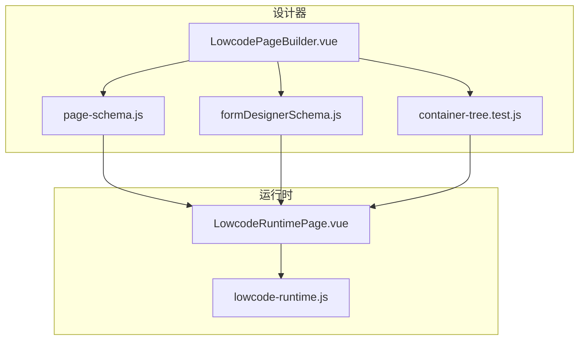
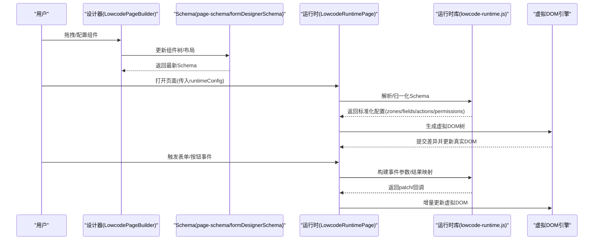
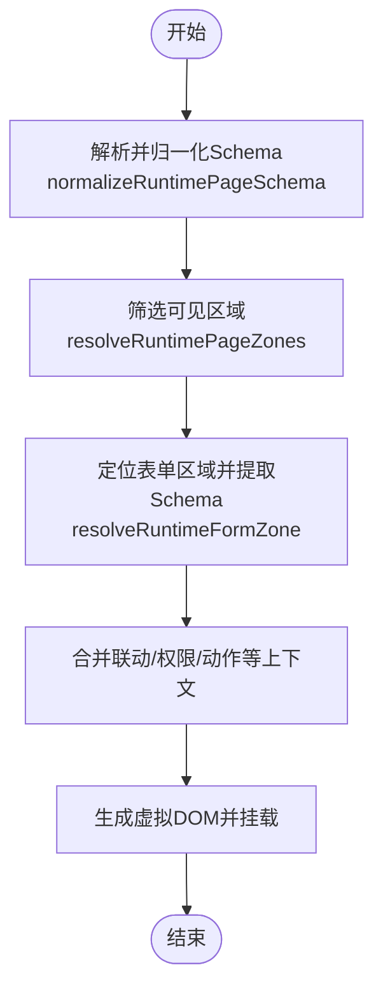
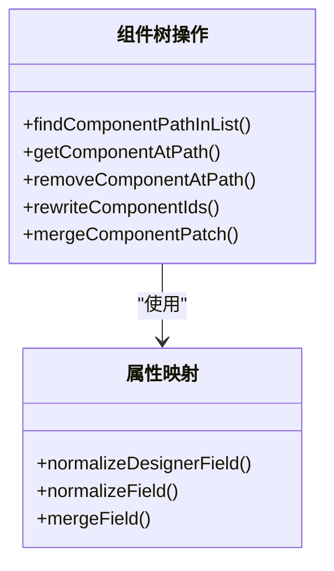
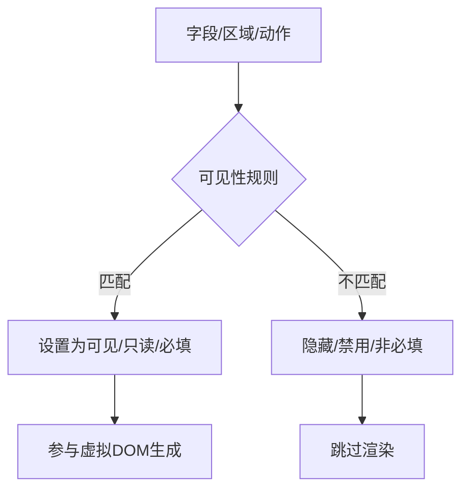
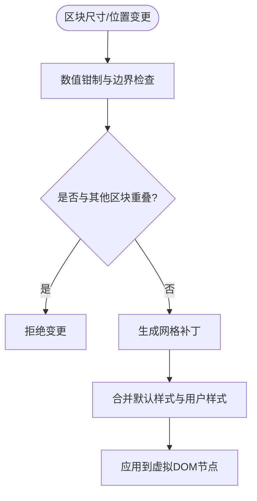
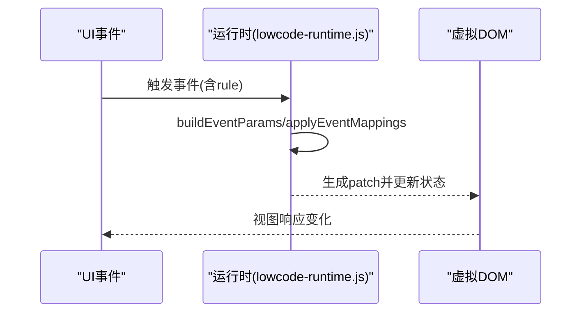
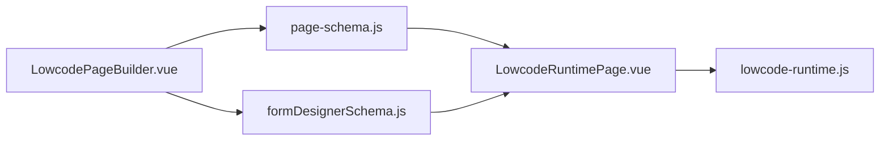

# 虚拟DOM生成机制

<cite>
**本文引用的文件**
- [LowcodeRuntimePage.vue](file://forge-admin-ui/src/components/lowcode-runtime/LowcodeRuntimePage.vue)
- [lowcode-runtime.js](file://forge-h5-ui/src/utils/lowcode-runtime.js)
- [LowcodePageBuilder.vue](file://forge-admin-ui/src/components/lowcode-builder/page/LowcodePageBuilder.vue)
- [page-schema.js](file://forge-admin-ui/src/components/lowcode-builder/page/page-schema.js)
- [formDesignerSchema.js](file://forge-admin-ui/src/views/app-center/components/designer/form-first/formDesignerSchema.js)
- [container-tree.test.js](file://forge-admin-ui/src/components/lowcode-builder/designer-core/__tests__/container-tree.test.js)
- [ListPageGridDesigner.vue](file://forge-admin-ui/src/components/lowcode-builder/page/ListPageGridDesigner.vue)
</cite>

## 目录
1. [简介](#简介)
2. [项目结构](#项目结构)
3. [核心组件](#核心组件)
4. [架构总览](#架构总览)
5. [详细组件分析](#详细组件分析)
6. [依赖关系分析](#依赖关系分析)
7. [性能考虑](#性能考虑)
8. [故障排查指南](#故障排查指南)
9. [结论](#结论)
10. [附录](#附录)

## 简介
本技术文档聚焦低代码平台的“虚拟DOM生成机制”，围绕以下目标展开：
- 组件树如何转换为虚拟DOM节点
- 属性映射规则与样式计算逻辑
- 动态组件创建、条件渲染优化与差异算法
- 虚拟DOM缓存策略、内存管理与性能监控
- 调试工具与故障排查方法

该机制贯穿“设计器构建页面”到“运行时渲染页面”的完整链路，通过标准化的Schema描述与运行时解析，将声明式配置高效转化为可渲染的虚拟DOM树，并在更新时进行最小化变更。

## 项目结构
仓库中与虚拟DOM生成相关的关键位置如下：
- 设计器侧（前端）：负责将用户拖拽、配置的组件树持久化为Schema，并维护布局、字段引用、区域（zone）等元数据
- 运行时侧（H5/管理端）：读取Schema，归一化、校验、合并上下文后，生成虚拟DOM并挂载到真实DOM
- 公共能力：提供Schema解析、可见性控制、联动规则、权限控制、事件参数构建等通用逻辑

**图表来源**
- [LowcodePageBuilder.vue:1-247](file://forge-admin-ui/src/components/lowcode-builder/page/LowcodePageBuilder.vue#L1-L247)
- [page-schema.js](file://forge-admin-ui/src/components/lowcode-builder/page/page-schema.js)
- [formDesignerSchema.js:961-1051](file://forge-admin-ui/src/views/app-center/components/designer/form-first/formDesignerSchema.js#L961-L1051)
- [container-tree.test.js:117-233](file://forge-admin-ui/src/components/lowcode-builder/designer-core/__tests__/container-tree.test.js#L117-L233)
- [LowcodeRuntimePage.vue:1-24](file://forge-admin-ui/src/components/lowcode-runtime/LowcodeRuntimePage.vue#L1-L24)
- [lowcode-runtime.js:1-733](file://forge-h5-ui/src/utils/lowcode-runtime.js#L1-L733)

**章节来源**
- [LowcodePageBuilder.vue:1-247](file://forge-admin-ui/src/components/lowcode-builder/page/LowcodePageBuilder.vue#L1-L247)
- [lowcode-runtime.js:1-733](file://forge-h5-ui/src/utils/lowcode-runtime.js#L1-L733)
- [formDesignerSchema.js:961-1051](file://forge-admin-ui/src/views/app-center/components/designer/form-first/formDesignerSchema.js#L961-L1051)
- [container-tree.test.js:117-233](file://forge-admin-ui/src/components/lowcode-builder/designer-core/__tests__/container-tree.test.js#L117-L233)

## 核心组件
- LowcodeRuntimePage：运行时入口，接收runtimeConfig并委托给具体页面容器（如CrudPage），完成标题同步等初始化工作
- lowcode-runtime.js：运行时核心库，负责Schema归一化、区域选择、表单/列表/动作/权限/联动/事件等运行时数据的标准化与计算
- LowcodePageBuilder：设计器页面构建器，协调表单/列表两种模式下的Schema编辑与同步
- page-schema.js：设计器与运行时之间的Schema桥接，负责布局与模型同步、区域补丁、网格布局应用等
- formDesignerSchema.js：设计器侧组件树操作工具，包含路径查找、插入、删除、ID重写、补丁合并等
- container-tree.test.js：组件树操作的测试用例，覆盖遍历、插入、多槽位（tabs/cells）插入等场景
- ListPageGridDesigner.vue：复杂布局区块的帧/网格补丁与样式计算，体现样式与布局在虚拟DOM前的预处理

**章节来源**
- [LowcodeRuntimePage.vue:1-24](file://forge-admin-ui/src/components/lowcode-runtime/LowcodeRuntimePage.vue#L1-L24)
- [lowcode-runtime.js:1-733](file://forge-h5-ui/src/utils/lowcode-runtime.js#L1-L733)
- [LowcodePageBuilder.vue:1-247](file://forge-admin-ui/src/components/lowcode-builder/page/LowcodePageBuilder.vue#L1-L247)
- [page-schema.js](file://forge-admin-ui/src/components/lowcode-builder/page/page-schema.js)
- [formDesignerSchema.js:961-1051](file://forge-admin-ui/src/views/app-center/components/designer/form-first/formDesignerSchema.js#L961-L1051)
- [container-tree.test.js:117-233](file://forge-admin-ui/src/components/lowcode-builder/designer-core/__tests__/container-tree.test.js#L117-L233)
- [ListPageGridDesigner.vue:7876-7906](file://forge-admin-ui/src/components/lowcode-builder/page/ListPageGridDesigner.vue#L7876-L7906)

## 架构总览
从设计器到运行时的关键流程如下：
1. 设计器中，用户通过拖拽和属性面板修改组件树，最终得到稳定的Schema（包含zones、components、props、layout等）
2. 运行时加载Schema，调用归一化函数，过滤可见区域、合并默认值、注入权限与联动规则
3. 根据归一化后的Schema生成虚拟DOM树，并通过框架的差异算法进行最小化更新
4. 交互事件触发后，基于事件映射与参数构建，更新表单数据或执行动作

**图表来源**
- [LowcodePageBuilder.vue:1-247](file://forge-admin-ui/src/components/lowcode-builder/page/LowcodePageBuilder.vue#L1-L247)
- [page-schema.js](file://forge-admin-ui/src/components/lowcode-builder/page/page-schema.js)
- [formDesignerSchema.js:961-1051](file://forge-admin-ui/src/views/app-center/components/designer/form-first/formDesignerSchema.js#L961-L1051)
- [LowcodeRuntimePage.vue:1-24](file://forge-admin-ui/src/components/lowcode-runtime/LowcodeRuntimePage.vue#L1-L24)
- [lowcode-runtime.js:1-733](file://forge-h5-ui/src/utils/lowcode-runtime.js#L1-L733)

## 详细组件分析

### 运行时Schema归一化与虚拟DOM生成
- 入口：LowcodeRuntimePage接收runtimeConfig并传递给具体页面容器
- 归一化：lowcode-runtime.js提供normalizeRuntimePageSchema、resolveRuntimePageZones、resolveRuntimeFormZone等函数，负责：
  - 解析并校验zones数组，规范化zoneId/zoneType及显隐标记
  - 按mode过滤可见区域，提取表单Schema
  - 合并flowInteraction、底部栏动作、权限、联动规则等
- 虚拟DOM生成：由上层页面容器（如CrudPage）依据归一化后的配置生成虚拟DOM；差异更新由框架层完成

**图表来源**
- [LowcodeRuntimePage.vue:1-24](file://forge-admin-ui/src/components/lowcode-runtime/LowcodeRuntimePage.vue#L1-L24)
- [lowcode-runtime.js:19-90](file://forge-h5-ui/src/utils/lowcode-runtime.js#L19-L90)
- [lowcode-runtime.js:109-178](file://forge-h5-ui/src/utils/lowcode-runtime.js#L109-L178)

**章节来源**
- [LowcodeRuntimePage.vue:1-24](file://forge-admin-ui/src/components/lowcode-runtime/LowcodeRuntimePage.vue#L1-L24)
- [lowcode-runtime.js:19-90](file://forge-h5-ui/src/utils/lowcode-runtime.js#L19-L90)
- [lowcode-runtime.js:109-178](file://forge-h5-ui/src/utils/lowcode-runtime.js#L109-L178)

### 组件树操作与属性映射
- 设计器侧组件树操作：
  - 路径查找、父级定位、子节点插入/删除、ID重写、补丁合并等
  - 支持多槽位（如tabs、cells）中的子节点插入
- 属性映射：
  - 组件props、layout、validation、visibility等字段在补丁合并时进行浅合并
  - 字段级别映射包括field、label、type、props、required、readonly、hidden、defaultValue、runtimeRules等

**图表来源**
- [formDesignerSchema.js:961-1051](file://forge-admin-ui/src/views/app-center/components/designer/form-first/formDesignerSchema.js#L961-L1051)
- [lowcode-runtime.js:475-528](file://forge-h5-ui/src/utils/lowcode-runtime.js#L475-L528)

**章节来源**
- [formDesignerSchema.js:961-1051](file://forge-admin-ui/src/views/app-center/components/designer/form-first/formDesignerSchema.js#L961-L1051)
- [lowcode-runtime.js:475-528](file://forge-h5-ui/src/utils/lowcode-runtime.js#L475-L528)
- [container-tree.test.js:117-233](file://forge-admin-ui/src/components/lowcode-builder/designer-core/__tests__/container-tree.test.js#L117-L233)

### 条件渲染与可见性控制
- 区域可见性：根据enabled/visible/visibleInModes决定区域是否渲染
- 字段可见性：基于runtimeRules/visibilityRules/displayRules与matchRule匹配，动态设置visible/readonly/required
- 动作可见性：actionVisible支持字符串表达式或规则对象，结合行数据判断显示

**图表来源**
- [lowcode-runtime.js:145-161](file://forge-h5-ui/src/utils/lowcode-runtime.js#L145-L161)
- [lowcode-runtime.js:530-584](file://forge-h5-ui/src/utils/lowcode-runtime.js#L530-L584)
- [lowcode-runtime.js:682-693](file://forge-h5-ui/src/utils/lowcode-runtime.js#L682-L693)

**章节来源**
- [lowcode-runtime.js:145-161](file://forge-h5-ui/src/utils/lowcode-runtime.js#L145-L161)
- [lowcode-runtime.js:530-584](file://forge-h5-ui/src/utils/lowcode-runtime.js#L530-L584)
- [lowcode-runtime.js:682-693](file://forge-h5-ui/src/utils/lowcode-runtime.js#L682-L693)

### 样式计算与布局补丁
- 区块帧与网格补丁：在ListPageGridDesigner中，对区块的width/height/x/y进行约束与碰撞检测，并将帧坐标转换为网格补丁
- 样式注入：为区块生成默认样式并合并用户自定义样式，确保虚拟DOM挂载前布局正确

**图表来源**
- [ListPageGridDesigner.vue:7876-7906](file://forge-admin-ui/src/components/lowcode-builder/page/ListPageGridDesigner.vue#L7876-L7906)

**章节来源**
- [ListPageGridDesigner.vue:7876-7906](file://forge-admin-ui/src/components/lowcode-builder/page/ListPageGridDesigner.vue#L7876-L7906)

### 动态组件创建与事件处理
- 动态组件创建：运行时根据componentKey/zoneType等标识动态选择对应组件进行渲染
- 事件参数构建：buildEventParams支持从formData、routeQuery、context中提取参数；applyEventMappings支持结果映射与缺失值清理
- 安全过滤：safeEventRules过滤危险键与非法source，避免XSS与越权

**图表来源**
- [lowcode-runtime.js:590-616](file://forge-h5-ui/src/utils/lowcode-runtime.js#L590-L616)
- [lowcode-runtime.js:618-656](file://forge-h5-ui/src/utils/lowcode-runtime.js#L618-L656)

**章节来源**
- [lowcode-runtime.js:590-616](file://forge-h5-ui/src/utils/lowcode-runtime.js#L590-L616)
- [lowcode-runtime.js:618-656](file://forge-h5-ui/src/utils/lowcode-runtime.js#L618-L656)

## 依赖关系分析
- LowcodePageBuilder依赖page-schema与formDesignerSchema进行Schema编辑与同步
- LowcodeRuntimePage依赖lowcode-runtime.js进行运行时数据归一化
- 设计器与运行时通过稳定Schema契约解耦，便于独立演进与测试

**图表来源**
- [LowcodePageBuilder.vue:1-247](file://forge-admin-ui/src/components/lowcode-builder/page/LowcodePageBuilder.vue#L1-L247)
- [page-schema.js](file://forge-admin-ui/src/components/lowcode-builder/page/page-schema.js)
- [formDesignerSchema.js:961-1051](file://forge-admin-ui/src/views/app-center/components/designer/form-first/formDesignerSchema.js#L961-L1051)
- [LowcodeRuntimePage.vue:1-24](file://forge-admin-ui/src/components/lowcode-runtime/LowcodeRuntimePage.vue#L1-L24)
- [lowcode-runtime.js:1-733](file://forge-h5-ui/src/utils/lowcode-runtime.js#L1-L733)

**章节来源**
- [LowcodePageBuilder.vue:1-247](file://forge-admin-ui/src/components/lowcode-builder/page/LowcodePageBuilder.vue#L1-L247)
- [LowcodeRuntimePage.vue:1-24](file://forge-admin-ui/src/components/lowcode-runtime/LowcodeRuntimePage.vue#L1-L24)
- [lowcode-runtime.js:1-733](file://forge-h5-ui/src/utils/lowcode-runtime.js#L1-L733)

## 性能考虑
- 条件渲染优化：
  - 区域与字段级别的visible/hidden快速短路，减少不必要的虚拟DOM节点生成
  - 动作与底部栏actions按mode与权限过滤，降低渲染开销
- 差异算法：
  - 通过稳定的id与key（如zoneId、component id）提升diff效率
  - 局部patch（如区块帧/网格补丁）仅更新受影响节点
- 缓存策略建议：
  - 对静态Schema片段（如字典选项、基础布局）进行内存缓存，避免重复解析
  - 对联动规则与权限策略进行惰性求值与结果缓存
- 内存管理：
  - 及时释放不再使用的临时对象（如中间patch、路径查找结果）
  - 避免深层克隆大对象，优先使用浅合并与选择性拷贝
- 性能监控：
  - 在关键路径（归一化、diff、挂载）埋点统计耗时
  - 监控虚拟DOM节点数量与更新频率，识别热点区域

[本节为通用指导，无需特定文件来源]

## 故障排查指南
- Schema解析失败：
  - 检查normalizeRuntimePageSchema输入是否为合法对象/数组
  - 确认zones数组元素具备必要字段（zoneId/zoneType）
- 区域不可见：
  - 核查enabled/visible/visibleInModes配置
  - 确认mode与visibleInModes匹配
- 字段联动异常：
  - 检查runtimeRules/visibilityRules/displayRules的条件与effect
  - 验证readPath路径与上下文数据源
- 事件参数为空或缺失：
  - 核对paramMappings与resultMappings配置
  - 使用shouldSkipFieldEvent判断是否应跳过空值触发
- 样式错位或冲突：
  - 检查区块帧补丁与样式合并逻辑
  - 确认width/height/x/y的钳制与碰撞检测未阻止合理变更

**章节来源**
- [lowcode-runtime.js:19-90](file://forge-h5-ui/src/utils/lowcode-runtime.js#L19-L90)
- [lowcode-runtime.js:145-161](file://forge-h5-ui/src/utils/lowcode-runtime.js#L145-L161)
- [lowcode-runtime.js:530-584](file://forge-h5-ui/src/utils/lowcode-runtime.js#L530-L584)
- [lowcode-runtime.js:590-616](file://forge-h5-ui/src/utils/lowcode-runtime.js#L590-L616)
- [lowcode-runtime.js:618-656](file://forge-h5-ui/src/utils/lowcode-runtime.js#L618-L656)
- [ListPageGridDesigner.vue:7876-7906](file://forge-admin-ui/src/components/lowcode-builder/page/ListPageGridDesigner.vue#L7876-L7906)

## 结论
本项目的虚拟DOM生成机制以“稳定Schema + 运行时归一化 + 条件渲染 + 局部补丁”为核心，实现了从设计器到运行时的解耦与高效渲染。通过严格的可见性与权限控制、灵活的联动与事件映射、以及精细的样式与布局补丁，平台在保证灵活性的同时兼顾了性能与可维护性。建议在后续迭代中继续强化缓存策略、完善性能监控与调试工具，进一步提升大规模页面的渲染体验。

[本节为总结，无需特定文件来源]

## 附录
- 术语说明
  - 虚拟DOM：用于描述UI结构的轻量级对象树，框架据此计算最小变更并更新真实DOM
  - 区域（zone）：页面中可独立渲染的功能块（如表单、列表、动作区）
  - 补丁（patch）：对已有对象的增量更新，常用于区块布局与样式
- 参考实现路径
  - 运行时入口：[LowcodeRuntimePage.vue:1-24](file://forge-admin-ui/src/components/lowcode-runtime/LowcodeRuntimePage.vue#L1-L24)
  - 运行时核心：[lowcode-runtime.js:1-733](file://forge-h5-ui/src/utils/lowcode-runtime.js#L1-L733)
  - 设计器构建：[LowcodePageBuilder.vue:1-247](file://forge-admin-ui/src/components/lowcode-builder/page/LowcodePageBuilder.vue#L1-L247)
  - 组件树操作：[formDesignerSchema.js:961-1051](file://forge-admin-ui/src/views/app-center/components/designer/form-first/formDesignerSchema.js#L961-L1051)
  - 树操作测试：[container-tree.test.js:117-233](file://forge-admin-ui/src/components/lowcode-builder/designer-core/__tests__/container-tree.test.js#L117-L233)
  - 布局补丁：[ListPageGridDesigner.vue:7876-7906](file://forge-admin-ui/src/components/lowcode-builder/page/ListPageGridDesigner.vue#L7876-L7906)