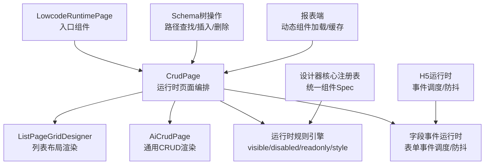
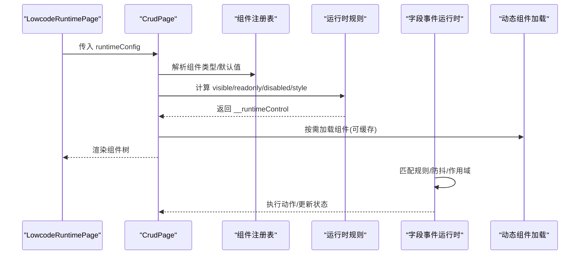
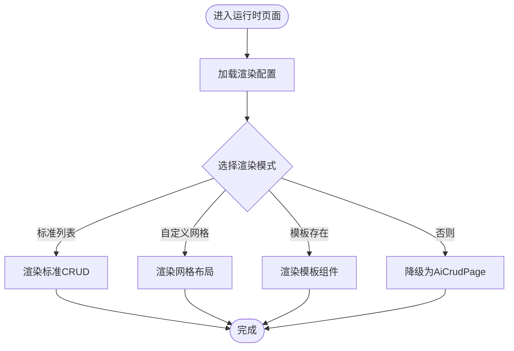
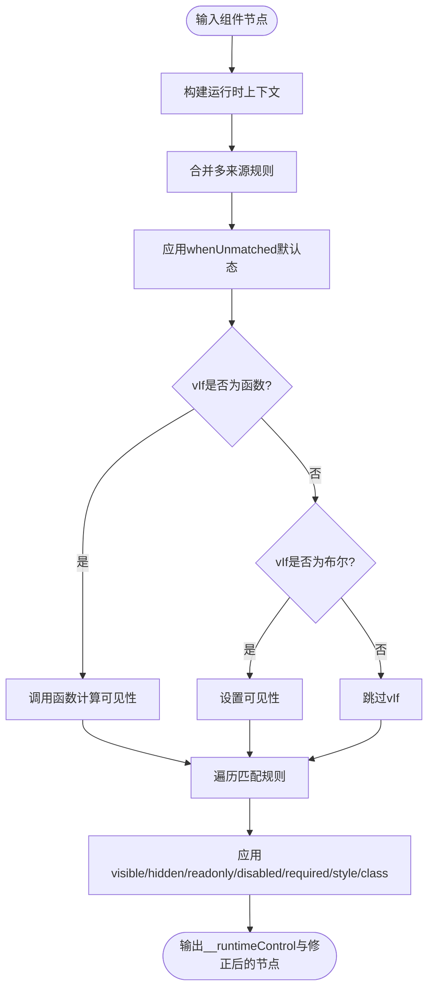
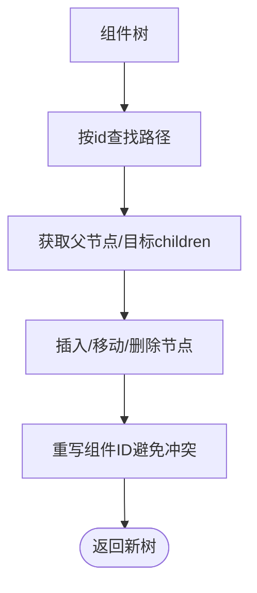
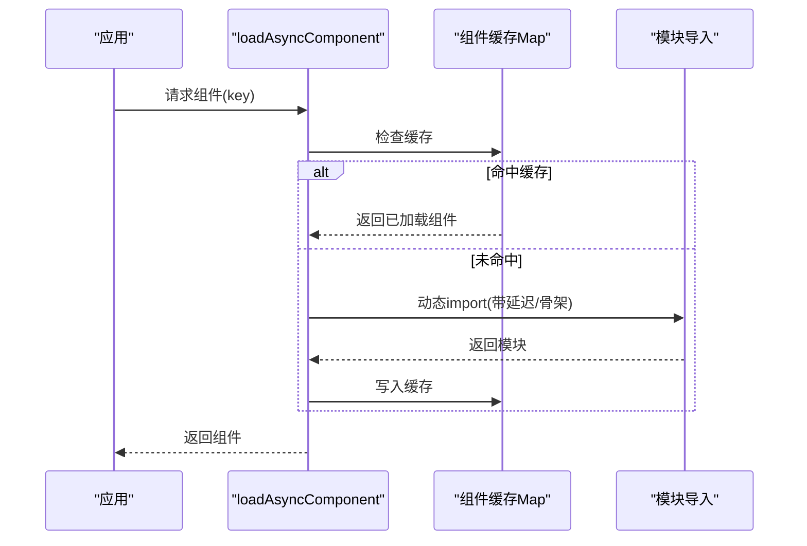
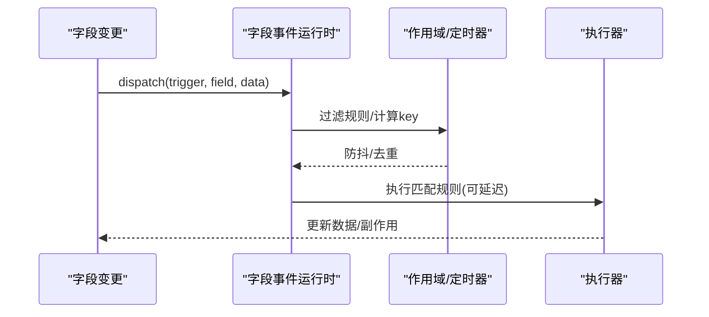
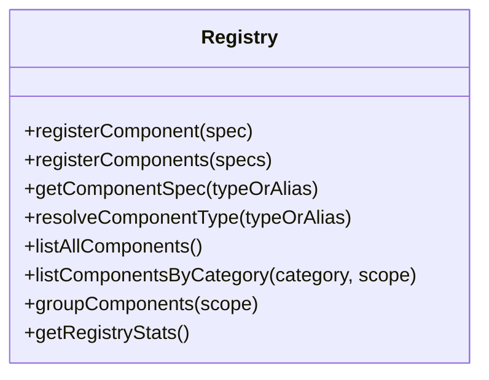
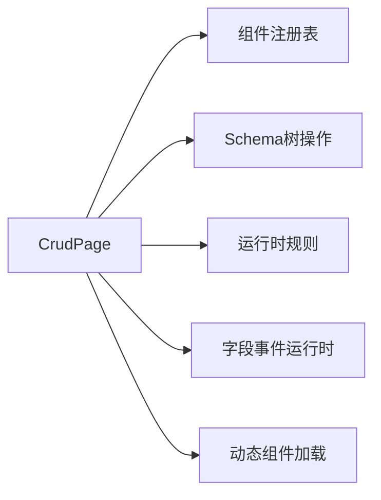

# 组件渲染引擎

<cite>
**本文引用的文件**
- [LowcodeRuntimePage.vue](file://forge-admin-ui/src/components/lowcode-runtime/LowcodeRuntimePage.vue)
- [crud-page.vue](file://forge-admin-ui/src/views/ai/crud-page.vue)
- [runtime-rules.js](file://forge-admin-ui/src/components/lowcode-builder/shared/runtime-rules.js)
- [designer-core/index.js](file://forge-admin-ui/src/components/lowcode-builder/designer-core/index.js)
- [registry.js](file://forge-admin-ui/src/components/lowcode-builder/designer-core/spec/registry.js)
- [formDesignerSchema.js](file://forge-admin-ui/src/views/app-center/components/designer/form-first/formDesignerSchema.js)
- [autoFieldRegistry.js](file://forge-admin-ui/src/views/app-center/components/designer/form-first/autoFieldRegistry.js)
- [field-event-runtime.js](file://forge-admin-ui/src/components/ai-form/field-event-runtime.js)
- [lowcode-runtime.vue](file://forge-h5-ui/src/pages/lowcode-runtime.vue)
- [components.ts](file://forge-report-ui/src/utils/components.ts)
- [packages/index.ts](file://forge-report-ui/src/packages/index.ts)
- [useSync.hook.ts](file://forge-report-ui/src/views/chart/hooks/useSync.hook.ts)
</cite>

## 目录
1. [简介](#简介)
2. [项目结构](#项目结构)
3. [核心组件](#核心组件)
4. [架构总览](#架构总览)
5. [详细组件分析](#详细组件分析)
6. [依赖关系分析](#依赖关系分析)
7. [性能考量](#性能考量)
8. [故障排查指南](#故障排查指南)
9. [结论](#结论)
10. [附录：渲染API与最佳实践](#附录：渲染api与最佳实践)

## 简介
本技术文档围绕低代码组件渲染引擎，系统阐述从配置到真实DOM的完整渲染管线。重点覆盖：
- 组件树遍历与虚拟节点生成
- 动态组件加载、条件渲染、循环渲染与异步组件处理
- 运行时规则（可见性、禁用、只读、样式）与事件绑定
- 状态管理、样式注入与性能监控
- 渲染API参考、调试工具与优化建议

## 项目结构
该仓库包含多端前端工程，渲染引擎主要位于 admin UI 的低代码构建器与运行时模块中，H5 与报表端提供动态组件加载与事件调度等能力。

**图表来源**
- [LowcodeRuntimePage.vue:1-24](file://forge-admin-ui/src/components/lowcode-runtime/LowcodeRuntimePage.vue#L1-L24)
- [crud-page.vue:1-200](file://forge-admin-ui/src/views/ai/crud-page.vue#L1-L200)
- [runtime-rules.js:1-300](file://forge-admin-ui/src/components/lowcode-builder/shared/runtime-rules.js#L1-L300)
- [designer-core/index.js:1-126](file://forge-admin-ui/src/components/lowcode-builder/designer-core/index.js#L1-L126)
- [registry.js:1-169](file://forge-admin-ui/src/components/lowcode-builder/designer-core/spec/registry.js#L1-L169)
- [formDesignerSchema.js:961-1051](file://forge-admin-ui/src/views/app-center/components/designer/form-first/formDesignerSchema.js#L961-L1051)
- [field-event-runtime.js:99-127](file://forge-admin-ui/src/components/ai-form/field-event-runtime.js#L99-L127)
- [lowcode-runtime.vue:709-748](file://forge-h5-ui/src/pages/lowcode-runtime.vue#L709-L748)
- [components.ts:1-30](file://forge-report-ui/src/utils/components.ts#L1-L30)
- [packages/index.ts:32-71](file://forge-report-ui/src/packages/index.ts#L32-L71)

**章节来源**
- [LowcodeRuntimePage.vue:1-24](file://forge-admin-ui/src/components/lowcode-runtime/LowcodeRuntimePage.vue#L1-L24)
- [crud-page.vue:1-200](file://forge-admin-ui/src/views/ai/crud-page.vue#L1-L200)
- [designer-core/index.js:1-126](file://forge-admin-ui/src/components/lowcode-builder/designer-core/index.js#L1-L126)

## 核心组件
- 运行时入口 LowcodeRuntimePage：接收 runtimeConfig，透传给 CrudPage 进行渲染编排。
- 运行时页面 CrudPage：负责加载渲染配置、选择模板或降级渲染、组装字段与布局、挂载运行时钩子与规则。
- 运行时规则引擎 runtime-rules：计算 visible/readonly/disabled/required/style/class，支持表达式与分组条件。
- 设计器核心 registry：统一组件规格注册与查询，支撑设计器与运行时的组件解析。
- Schema 树操作：提供组件树的路径查找、插入、删除、克隆与ID重写等能力。
- 字段事件运行时：统一的事件过滤、调度、防抖与序列控制，支持父子行作用域。
- 动态组件加载：报表端提供按需加载与缓存机制，提升首屏与切换性能。

**章节来源**
- [LowcodeRuntimePage.vue:1-24](file://forge-admin-ui/src/components/lowcode-runtime/LowcodeRuntimePage.vue#L1-L24)
- [crud-page.vue:1-200](file://forge-admin-ui/src/views/ai/crud-page.vue#L1-L200)
- [runtime-rules.js:1-300](file://forge-admin-ui/src/components/lowcode-builder/shared/runtime-rules.js#L1-L300)
- [registry.js:1-169](file://forge-admin-ui/src/components/lowcode-builder/designer-core/spec/registry.js#L1-L169)
- [formDesignerSchema.js:961-1051](file://forge-admin-ui/src/views/app-center/components/designer/form-first/formDesignerSchema.js#L961-L1051)
- [field-event-runtime.js:99-127](file://forge-admin-ui/src/components/ai-form/field-event-runtime.js#L99-L127)
- [lowcode-runtime.vue:709-748](file://forge-h5-ui/src/pages/lowcode-runtime.vue#L709-L748)
- [components.ts:1-30](file://forge-report-ui/src/utils/components.ts#L1-L30)
- [packages/index.ts:32-71](file://forge-report-ui/src/packages/index.ts#L32-L71)

## 架构总览
渲染管线从“配置”到“视图”的关键步骤：
1. 入口组件接收 runtimeConfig，交由 CrudPage 解析并决定渲染策略（网格布局/模板/AiCrudPage）。
2. 通过设计器核心注册表解析组件类型与默认属性，结合 Schema 树操作完成组件树构建与规范化。
3. 运行时规则引擎对每个组件计算控制态（可见性、禁用、只读、样式），生成带 __runtimeControl 的渲染节点。
4. 字段事件运行时根据触发器与上下文匹配规则，执行动作（含防抖、作用域隔离、清理目标值等）。
5. 动态组件按需加载并缓存，减少重复网络请求；必要时使用异步组件包装以改善体验。

**图表来源**
- [LowcodeRuntimePage.vue:1-24](file://forge-admin-ui/src/components/lowcode-runtime/LowcodeRuntimePage.vue#L1-L24)
- [crud-page.vue:1-200](file://forge-admin-ui/src/views/ai/crud-page.vue#L1-L200)
- [registry.js:1-169](file://forge-admin-ui/src/components/lowcode-builder/designer-core/spec/registry.js#L1-L169)
- [runtime-rules.js:1-300](file://forge-admin-ui/src/components/lowcode-builder/shared/runtime-rules.js#L1-L300)
- [field-event-runtime.js:99-127](file://forge-admin-ui/src/components/ai-form/field-event-runtime.js#L99-L127)
- [components.ts:1-30](file://forge-report-ui/src/utils/components.ts#L1-L30)

## 详细组件分析

### 运行时入口与页面编排（LowcodeRuntimePage / CrudPage）
- LowcodeRuntimePage 作为薄壳，将 runtimeConfig 传递给 CrudPage，并可选择是否同步文档标题。
- CrudPage 负责：
  - 加载渲染配置与模型字段
  - 选择渲染模式：标准列表、自定义网格布局、模板组件或 AiCrudPage 降级
  - 组装运行时参数（路由公开参数、表单默认值、提交默认参数）
  - 挂载 CRUD 钩子规则与运行时可见性规则
  - 错误与加载态展示

**图表来源**
- [LowcodeRuntimePage.vue:1-24](file://forge-admin-ui/src/components/lowcode-runtime/LowcodeRuntimePage.vue#L1-L24)
- [crud-page.vue:1-200](file://forge-admin-ui/src/views/ai/crud-page.vue#L1-L200)

**章节来源**
- [LowcodeRuntimePage.vue:1-24](file://forge-admin-ui/src/components/lowcode-runtime/LowcodeRuntimePage.vue#L1-L24)
- [crud-page.vue:1-200](file://forge-admin-ui/src/views/ai/crud-page.vue#L1-L200)

### 运行时规则引擎（visible/disabled/readonly/style）
- 统一读取 target.visibility/target.behavior/target.runtimeRules 等多处规则源，合并为一致的运行时控制对象。
- 支持 whenUnmatched 默认态、vIf 函数/布尔、表达式匹配、分组条件（any/all）、样式与类名叠加。
- applyRuntimeControl 将控制结果写回 props 与节点属性，并在不可见时短路不渲染。

**图表来源**
- [runtime-rules.js:1-300](file://forge-admin-ui/src/components/lowcode-builder/shared/runtime-rules.js#L1-L300)

**章节来源**
- [runtime-rules.js:1-300](file://forge-admin-ui/src/components/lowcode-builder/shared/runtime-rules.js#L1-L300)

### 组件树遍历与Schema操作
- 提供路径查找、父节点解析、插入/删除/替换节点、克隆与ID重写等能力，确保拖拽与编辑后的一致性。
- 支持复杂容器（如 tabs、grid cells）的子节点定位与插入边界校验。

**图表来源**
- [formDesignerSchema.js:961-1051](file://forge-admin-ui/src/views/app-center/components/designer/form-first/formDesignerSchema.js#L961-L1051)

**章节来源**
- [formDesignerSchema.js:961-1051](file://forge-admin-ui/src/views/app-center/components/designer/form-first/formDesignerSchema.js#L961-L1051)

### 动态组件加载与缓存
- 提供统一的异步组件加载封装，支持延迟与骨架占位，降低首屏压力。
- 基于包名+分类+键名的缓存映射，避免重复 import，提升切换性能。
- 在报表端批量注册组件，支持分组与懒创建。

**图表来源**
- [components.ts:1-30](file://forge-report-ui/src/utils/components.ts#L1-L30)
- [packages/index.ts:32-71](file://forge-report-ui/src/packages/index.ts#L32-L71)

**章节来源**
- [components.ts:1-30](file://forge-report-ui/src/utils/components.ts#L1-L30)
- [packages/index.ts:32-71](file://forge-report-ui/src/packages/index.ts#L32-L71)

### 字段事件调度与防抖
- 统一的事件过滤：按 trigger 与 sourceField 匹配，支持 FORM_LOAD 特殊处理。
- 防抖与去重：CHANGE 事件支持 debounceMs，同 key 的定时器会被取消与重置。
- 作用域隔离：主表单与子行数据分别作用域，避免交叉污染。
- 清理策略：触发时可清空目标字段，避免脏数据残留。

**图表来源**
- [field-event-runtime.js:99-127](file://forge-admin-ui/src/components/ai-form/field-event-runtime.js#L99-L127)
- [lowcode-runtime.vue:709-748](file://forge-h5-ui/src/pages/lowcode-runtime.vue#L709-L748)

**章节来源**
- [field-event-runtime.js:99-127](file://forge-admin-ui/src/components/ai-form/field-event-runtime.js#L99-L127)
- [lowcode-runtime.vue:709-748](file://forge-h5-ui/src/pages/lowcode-runtime.vue#L709-L748)

### 组件规范与注册表
- 统一入口聚合所有组件 spec，首次导入即自动注册，保证设计与运行一致。
- 提供按类别/作用域筛选、别名解析、统计信息导出等能力。

**图表来源**
- [registry.js:1-169](file://forge-admin-ui/src/components/lowcode-builder/designer-core/spec/registry.js#L1-L169)
- [designer-core/index.js:1-126](file://forge-admin-ui/src/components/lowcode-builder/designer-core/index.js#L1-L126)

**章节来源**
- [registry.js:1-169](file://forge-admin-ui/src/components/lowcode-builder/designer-core/spec/registry.js#L1-L169)
- [designer-core/index.js:1-126](file://forge-admin-ui/src/components/lowcode-builder/designer-core/index.js#L1-L126)

### 虚拟DOM生成与渲染优化
- 虚拟节点生成：由运行时规则与Schema共同决定最终节点结构与属性，隐藏节点直接短路不生成。
- 渲染优化策略：
  - 条件渲染：vIf/visible 控制最小化DOM数量
  - 循环渲染：仅在容器内渲染可见项，配合插槽与键值稳定化
  - 异步组件：按需加载与骨架占位，减少首屏阻塞
  - 事件防抖：高频交互场景降低重复计算与网络请求
  - 组件缓存：跨页面/Tab复用已加载组件，避免重复网络开销

[本节为概念性说明，无特定文件引用]

## 依赖关系分析
- 运行时页面依赖设计器核心注册表与Schema操作，确保组件类型与树结构一致性。
- 运行时规则引擎独立于具体组件实现，仅依赖上下文数据与规则定义。
- 事件运行时与页面解耦，通过规则匹配与调度接口驱动副作用。
- 动态组件加载与缓存层为上层渲染提供透明加速。

**图表来源**
- [crud-page.vue:1-200](file://forge-admin-ui/src/views/ai/crud-page.vue#L1-L200)
- [registry.js:1-169](file://forge-admin-ui/src/components/lowcode-builder/designer-core/spec/registry.js#L1-L169)
- [formDesignerSchema.js:961-1051](file://forge-admin-ui/src/views/app-center/components/designer/form-first/formDesignerSchema.js#L961-L1051)
- [runtime-rules.js:1-300](file://forge-admin-ui/src/components/lowcode-builder/shared/runtime-rules.js#L1-L300)
- [field-event-runtime.js:99-127](file://forge-admin-ui/src/components/ai-form/field-event-runtime.js#L99-L127)
- [components.ts:1-30](file://forge-report-ui/src/utils/components.ts#L1-L30)

**章节来源**
- [crud-page.vue:1-200](file://forge-admin-ui/src/views/ai/crud-page.vue#L1-L200)
- [registry.js:1-169](file://forge-admin-ui/src/components/lowcode-builder/designer-core/spec/registry.js#L1-L169)
- [formDesignerSchema.js:961-1051](file://forge-admin-ui/src/views/app-center/components/designer/form-first/formDesignerSchema.js#L961-L1051)
- [runtime-rules.js:1-300](file://forge-admin-ui/src/components/lowcode-builder/shared/runtime-rules.js#L1-L300)
- [field-event-runtime.js:99-127](file://forge-admin-ui/src/components/ai-form/field-event-runtime.js#L99-L127)
- [components.ts:1-30](file://forge-report-ui/src/utils/components.ts#L1-L30)

## 性能考量
- 首屏优化：
  - 使用异步组件与骨架占位，延迟非关键资源加载
  - 组件缓存避免重复导入
- 交互优化：
  - 字段事件防抖，限制高频触发
  - 条件渲染减少DOM数量
- 内存与稳定性：
  - 组件ID重写避免冲突
  - 作用域隔离防止状态泄漏
- 监控建议：
  - 记录组件加载耗时与失败率
  - 统计事件调度次数与平均延迟
  - 观察渲染帧率与长任务占比

[本节为通用指导，无特定文件引用]

## 故障排查指南
- 组件未显示：
  - 检查运行时规则是否将 visible 置为 false 或 hidden 为 true
  - 确认 vIf 表达式或函数返回值是否符合预期
- 事件未触发：
  - 核对 trigger 与 sourceField 是否匹配
  - 检查防抖时间是否过长导致延迟
- 组件加载失败：
  - 确认动态组件路径与命名是否正确
  - 查看缓存是否被污染，必要时清理缓存
- 样式异常：
  - 检查 style 与 className 是否被运行时规则覆盖
  - 确认优先级与合并逻辑

**章节来源**
- [runtime-rules.js:1-300](file://forge-admin-ui/src/components/lowcode-builder/shared/runtime-rules.js#L1-L300)
- [field-event-runtime.js:99-127](file://forge-admin-ui/src/components/ai-form/field-event-runtime.js#L99-L127)
- [components.ts:1-30](file://forge-report-ui/src/utils/components.ts#L1-L30)

## 结论
本渲染引擎通过“配置驱动 + 规则计算 + 事件调度 + 动态加载”的组合，实现了高扩展性与高性能的低代码页面渲染。其核心在于：
- 统一的组件规范与注册表，保障设计与运行一致性
- 灵活的运行时规则，支持细粒度控制与样式注入
- 稳定的事件调度机制，兼顾性能与可维护性
- 完善的动态加载与缓存策略，提升用户体验

[本节为总结性内容，无特定文件引用]

## 附录：渲染API与最佳实践

### 渲染API参考
- 运行时入口
  - 传入 runtimeConfig 至 LowcodeRuntimePage，内部委托 CrudPage 编排渲染
- 运行时规则
  - resolveRuntimeControl：计算 visible/readonly/disabled/required/style/class
  - applyRuntimeControl：将控制结果应用到节点并返回 __runtimeControl
  - matchRuntimeRule/matchRuntimeCondition：规则与条件匹配
- 组件注册表
  - registerComponent/registerComponents：注册组件规格
  - getComponentSpec/resolveComponentType：解析类型与别名
  - listComponentsByCategory/groupComponents：按类别与作用域筛选
- Schema树操作
  - findComponentPathInList/getComponentAtPath：路径查找与节点访问
  - insertNode/removeNode/replaceNode：增删改节点
  - rewriteComponentIds：避免ID冲突
- 事件运行时
  - createFieldEventRuntime：创建事件运行时实例
  - dispatch：分发事件，支持防抖与作用域
- 动态组件加载
  - loadAsyncComponent：异步加载组件，支持延迟与骨架
  - componentInstall：全局注册组件
  - 组件缓存：基于包名+分类+键名的缓存映射

**章节来源**
- [LowcodeRuntimePage.vue:1-24](file://forge-admin-ui/src/components/lowcode-runtime/LowcodeRuntimePage.vue#L1-L24)
- [crud-page.vue:1-200](file://forge-admin-ui/src/views/ai/crud-page.vue#L1-L200)
- [runtime-rules.js:1-300](file://forge-admin-ui/src/components/lowcode-builder/shared/runtime-rules.js#L1-L300)
- [registry.js:1-169](file://forge-admin-ui/src/components/lowcode-builder/designer-core/spec/registry.js#L1-L169)
- [formDesignerSchema.js:961-1051](file://forge-admin-ui/src/views/app-center/components/designer/form-first/formDesignerSchema.js#L961-L1051)
- [field-event-runtime.js:99-127](file://forge-admin-ui/src/components/ai-form/field-event-runtime.js#L99-L127)
- [components.ts:1-30](file://forge-report-ui/src/utils/components.ts#L1-L30)
- [packages/index.ts:32-71](file://forge-report-ui/src/packages/index.ts#L32-L71)

### 最佳实践
- 使用 whenUnmatched 明确默认可见性，避免规则生效不明显
- 合理拆分规则组，使用 any/all 组合复杂条件
- 对高频事件启用防抖，避免过度计算与网络请求
- 使用异步组件与骨架占位，提升首屏体验
- 利用组件缓存与唯一键，减少重复加载与重渲染
- 在 Schema 操作中严格校验插入位置与深度，避免非法结构

[本节为通用指导，无特定文件引用]