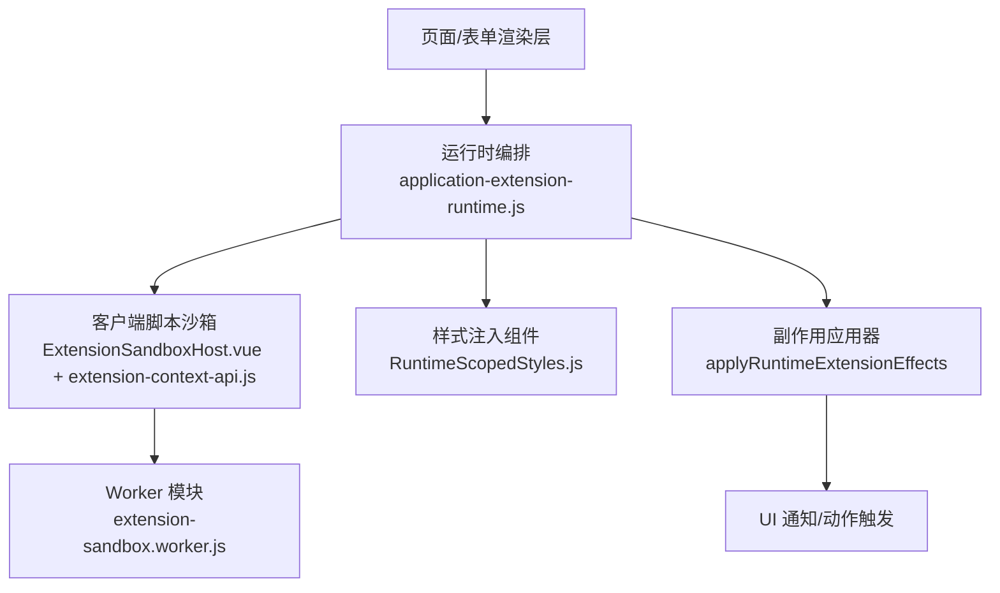
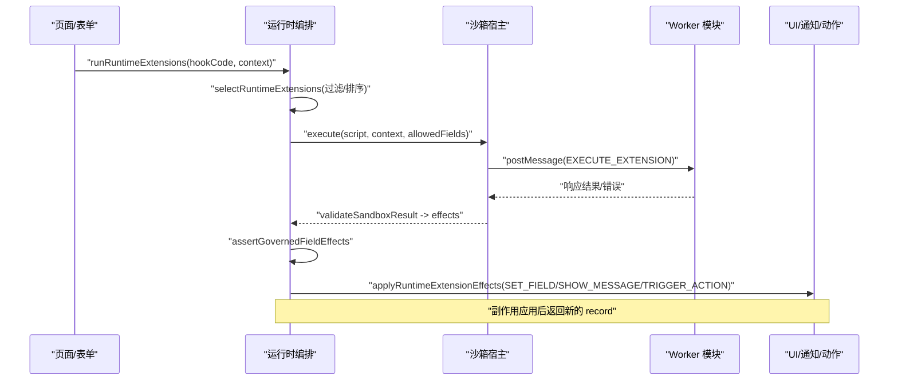
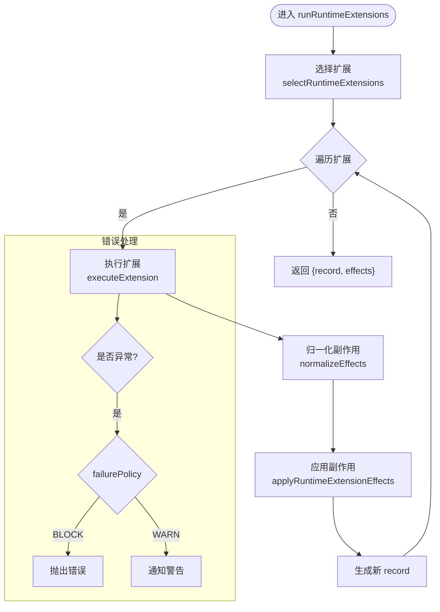
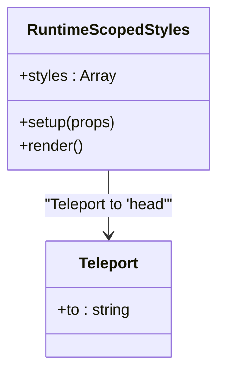
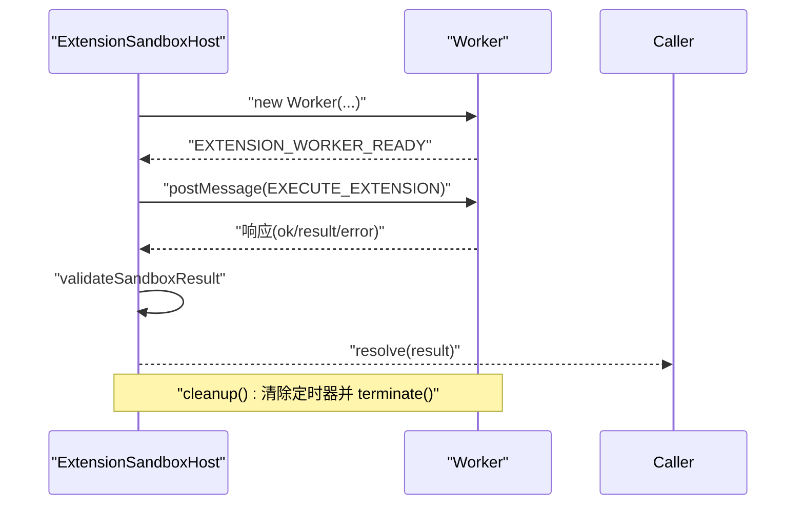
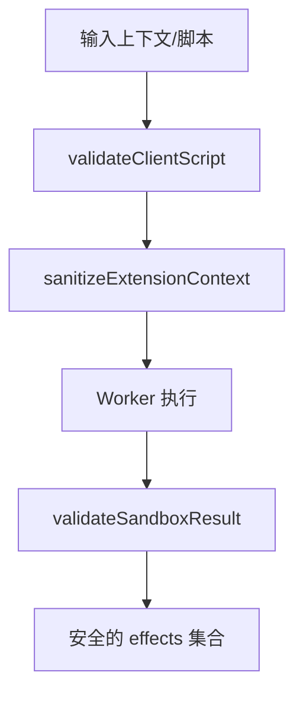
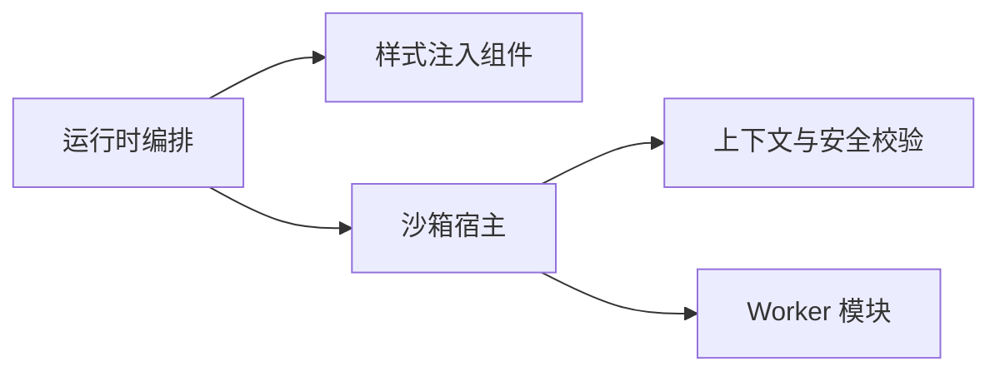

# 组件生命周期管理

<cite>
**本文引用的文件**
- [application-extension-runtime.js](file://forge-admin-ui/src/components/lowcode-extension/runtime/application-extension-runtime.js)
- [RuntimeScopedStyles.js](file://forge-admin-ui/src/components/lowcode-extension/runtime/RuntimeScopedStyles.js)
- [ExtensionSandboxHost.vue](file://forge-admin-ui/src/components/lowcode-extension/js/ExtensionSandboxHost.vue)
- [extension-context-api.js](file://forge-admin-ui/src/components/lowcode-extension/js/extension-context-api.js)
</cite>

## 目录
1. [简介](#简介)
2. [项目结构](#项目结构)
3. [核心组件](#核心组件)
4. [架构总览](#架构总览)
5. [详细组件分析](#详细组件分析)
6. [依赖关系分析](#依赖关系分析)
7. [性能考量](#性能考量)
8. [故障排查指南](#故障排查指南)
9. [结论](#结论)
10. [附录：生命周期钩子与使用示例](#附录：生命周期钩子与使用示例)

## 简介
本技术文档围绕低代码平台的“组件生命周期管理”展开，聚焦于组件在创建、挂载、更新与销毁四个阶段的处理逻辑。结合仓库中的运行时扩展机制与沙箱执行能力，系统性地说明状态同步、事件绑定、资源清理与错误恢复策略；并给出组件缓存策略、懒加载实现与性能优化建议，最后提供生命周期钩子的API说明与使用示例路径。

## 项目结构
与组件生命周期相关的核心代码集中在 lowcode-extension 模块中，分为三类：
- 运行时编排：负责按阶段选择并执行扩展（如页面初始化、字段变更等），应用副作用（设置字段、触发动作、消息提示）。
- 样式注入：将治理后的作用域 CSS 安全地注入到文档头部，避免污染全局样式。
- 客户端脚本沙箱：通过 Worker 隔离执行用户脚本，严格校验输入输出，保障安全与稳定性。

图表来源
- [application-extension-runtime.js:49-94](file://forge-admin-ui/src/components/lowcode-extension/runtime/application-extension-runtime.js#L49-L94)
- [RuntimeScopedStyles.js:1-22](file://forge-admin-ui/src/components/lowcode-extension/runtime/RuntimeScopedStyles.js#L1-L22)
- [ExtensionSandboxHost.vue:27-124](file://forge-admin-ui/src/components/lowcode-extension/js/ExtensionSandboxHost.vue#L27-L124)
- [extension-context-api.js:42-96](file://forge-admin-ui/src/components/lowcode-extension/js/extension-context-api.js#L42-L96)

章节来源
- [application-extension-runtime.js:1-296](file://forge-admin-ui/src/components/lowcode-extension/runtime/application-extension-runtime.js#L1-L296)
- [RuntimeScopedStyles.js:1-22](file://forge-admin-ui/src/components/lowcode-extension/runtime/RuntimeScopedStyles.js#L1-L22)
- [ExtensionSandboxHost.vue:1-198](file://forge-admin-ui/src/components/lowcode-extension/js/ExtensionSandboxHost.vue#L1-L198)
- [extension-context-api.js:1-220](file://forge-admin-ui/src/components/lowcode-extension/js/extension-context-api.js#L1-L220)

## 核心组件
- 运行时编排器：负责根据钩子码筛选扩展、顺序执行、应用副作用，并对失败进行策略化处理（阻断或告警）。
- 样式注入组件：以 Teleport 方式将已治理的作用域样式注入到 document.head，确保样式隔离与可追踪。
- 沙箱宿主组件：封装 Worker 的创建、通信、超时控制、结果校验与错误格式化，对外暴露 execute 方法供上层调用。
- 上下文与安全校验：对客户端脚本进行白名单式的安全校验，裁剪上下文数据，限制输出大小与协议，防止越权访问与注入风险。

章节来源
- [application-extension-runtime.js:49-129](file://forge-admin-ui/src/components/lowcode-extension/runtime/application-extension-runtime.js#L49-L129)
- [RuntimeScopedStyles.js:1-22](file://forge-admin-ui/src/components/lowcode-extension/runtime/RuntimeScopedStyles.js#L1-L22)
- [ExtensionSandboxHost.vue:27-124](file://forge-admin-ui/src/components/lowcode-extension/js/ExtensionSandboxHost.vue#L27-L124)
- [extension-context-api.js:42-96](file://forge-admin-ui/src/components/lowcode-extension/js/extension-context-api.js#L42-L96)

## 架构总览
下图展示了从页面初始化到扩展执行的完整流程，包括钩子选择、脚本沙箱执行、副作用应用与样式注入。

图表来源
- [application-extension-runtime.js:49-94](file://forge-admin-ui/src/components/lowcode-extension/runtime/application-extension-runtime.js#L49-L94)
- [ExtensionSandboxHost.vue:27-124](file://forge-admin-ui/src/components/lowcode-extension/js/ExtensionSandboxHost.vue#L27-L124)
- [extension-context-api.js:82-96](file://forge-admin-ui/src/components/lowcode-extension/js/extension-context-api.js#L82-L96)

## 详细组件分析

### 运行时编排器（创建/挂载/更新/销毁）
- 创建阶段：收集扩展列表，按钩子码筛选启用状态的扩展，并按优先级排序。
- 挂载阶段：在页面初始化时注入作用域样式（SCOPED_CSS），通过样式组件挂载到 head。
- 更新阶段：当记录或字段变化时，重新运行相关钩子扩展，计算新 record 并应用副作用。
- 销毁阶段：清理 Worker 实例、定时器与事件监听，释放内存，避免泄漏。

图表来源
- [application-extension-runtime.js:49-94](file://forge-admin-ui/src/components/lowcode-extension/runtime/application-extension-runtime.js#L49-L94)
- [application-extension-runtime.js:114-129](file://forge-admin-ui/src/components/lowcode-extension/runtime/application-extension-runtime.js#L114-L129)
- [application-extension-runtime.js:96-102](file://forge-admin-ui/src/components/lowcode-extension/runtime/application-extension-runtime.js#L96-L102)

章节来源
- [application-extension-runtime.js:49-129](file://forge-admin-ui/src/components/lowcode-extension/runtime/application-extension-runtime.js#L49-L129)

### 样式注入组件（挂载/卸载）
- 挂载：接收已治理的样式数组，使用 Teleport 将 style 标签注入到 document.head，并通过 data-forge-* 属性标记来源。
- 卸载：组件销毁时自动移除对应节点，避免残留样式。

图表来源
- [RuntimeScopedStyles.js:1-22](file://forge-admin-ui/src/components/lowcode-extension/runtime/RuntimeScopedStyles.js#L1-L22)

章节来源
- [RuntimeScopedStyles.js:1-22](file://forge-admin-ui/src/components/lowcode-extension/runtime/RuntimeScopedStyles.js#L1-L22)

### 沙箱宿主组件（创建/执行/销毁）
- 创建：构造 Worker 实例，设置启动超时与执行超时，建立消息通道。
- 执行：发送 EXECUTE_EXTENSION 消息，等待 EXTENSION_WORKER_READY 后开始执行。
- 销毁：统一清理定时器与 Worker 实例，确保无泄漏。

图表来源
- [ExtensionSandboxHost.vue:27-124](file://forge-admin-ui/src/components/lowcode-extension/js/ExtensionSandboxHost.vue#L27-L124)
- [extension-context-api.js:82-96](file://forge-admin-ui/src/components/lowcode-extension/js/extension-context-api.js#L82-L96)

章节来源
- [ExtensionSandboxHost.vue:27-124](file://forge-admin-ui/src/components/lowcode-extension/js/ExtensionSandboxHost.vue#L27-L124)
- [extension-context-api.js:82-96](file://forge-admin-ui/src/components/lowcode-extension/js/extension-context-api.js#L82-L96)

### 上下文与安全校验（状态同步与权限控制）
- 上下文裁剪：仅暴露允许的字段与动作，过滤敏感键，限制嵌套深度与数组长度。
- 输出校验：严格校验 effects 协议，限制字节大小，拒绝保留键与未授权 effect。
- 脚本校验：禁止危险 API 与动态执行，限制模板字符串与转义标识符，防止注入。

图表来源
- [extension-context-api.js:42-96](file://forge-admin-ui/src/components/lowcode-extension/js/extension-context-api.js#L42-L96)

章节来源
- [extension-context-api.js:42-96](file://forge-admin-ui/src/components/lowcode-extension/js/extension-context-api.js#L42-L96)

## 依赖关系分析
- 运行时编排器依赖：
  - 样式注入组件：用于页面初始化阶段注入作用域样式。
  - 沙箱宿主组件：用于执行客户端脚本扩展。
  - 上下文与安全校验：用于输入输出安全与协议约束。
- 沙箱宿主组件依赖：
  - 上下文与安全校验：用于上下文裁剪与结果校验。
  - Worker 模块：实际执行用户脚本。

图表来源
- [application-extension-runtime.js:49-94](file://forge-admin-ui/src/components/lowcode-extension/runtime/application-extension-runtime.js#L49-L94)
- [RuntimeScopedStyles.js:1-22](file://forge-admin-ui/src/components/lowcode-extension/runtime/RuntimeScopedStyles.js#L1-L22)
- [ExtensionSandboxHost.vue:27-124](file://forge-admin-ui/src/components/lowcode-extension/js/ExtensionSandboxHost.vue#L27-L124)
- [extension-context-api.js:42-96](file://forge-admin-ui/src/components/lowcode-extension/js/extension-context-api.js#L42-L96)

章节来源
- [application-extension-runtime.js:49-94](file://forge-admin-ui/src/components/lowcode-extension/runtime/application-extension-runtime.js#L49-L94)
- [RuntimeScopedStyles.js:1-22](file://forge-admin-ui/src/components/lowcode-extension/runtime/RuntimeScopedStyles.js#L1-L22)
- [ExtensionSandboxHost.vue:27-124](file://forge-admin-ui/src/components/lowcode-extension/js/ExtensionSandboxHost.vue#L27-L124)
- [extension-context-api.js:42-96](file://forge-admin-ui/src/components/lowcode-extension/js/extension-context-api.js#L42-L96)

## 性能考量
- 扩展选择与排序：按 sortOrder 与 extensionCode 排序，减少不必要的执行与冲突。
- 副作用批处理：在单次运行中累积 effects，批量应用到 record，降低多次重绘成本。
- 样式注入隔离：通过 data-forge-app/page 作用域与 Teleport 注入，避免全局样式竞争。
- 沙箱执行限流：严格的超时控制与输出大小限制，防止长耗时脚本拖慢主线程。
- 懒加载建议：仅在需要时加载 Worker 与样式，结合路由或可见性触发，减少首屏开销。
- 缓存策略：对静态扩展与样式进行缓存，避免重复解析与注入；对运行时 record 做浅拷贝与增量更新。

[本节为通用性能建议，不直接分析具体文件]

## 故障排查指南
- 扩展执行失败：
  - 检查 failurePolicy 配置（BLOCK/WARN），确认是否阻断后续流程。
  - 查看控制台警告与错误信息，定位具体扩展名称与错误原因。
- 字段不可写：
  - 通过 assertGovernedFieldEffects 校验，确认字段是否在可写白名单内。
- 沙箱执行异常：
  - 检查脚本是否包含被禁用的 API 或语法（如 eval、fetch、Worker 等）。
  - 关注启动超时与执行超时，必要时调整 timeoutMs 与 startupTimeoutMs。
- 样式未生效：
  - 确认 SCOPED_CSS 扩展已启用且 processedContent 非空。
  - 检查注入的 style 标签是否正确挂载到 head，并带有 data-forge-* 属性。

章节来源
- [application-extension-runtime.js:83-91](file://forge-admin-ui/src/components/lowcode-extension/runtime/application-extension-runtime.js#L83-L91)
- [application-extension-runtime.js:96-102](file://forge-admin-ui/src/components/lowcode-extension/runtime/application-extension-runtime.js#L96-L102)
- [ExtensionSandboxHost.vue:42-87](file://forge-admin-ui/src/components/lowcode-extension/js/ExtensionSandboxHost.vue#L42-L87)
- [RuntimeScopedStyles.js:12-20](file://forge-admin-ui/src/components/lowcode-extension/runtime/RuntimeScopedStyles.js#L12-L20)

## 结论
该低代码平台通过“运行时编排 + 样式注入 + 沙箱执行”的组合，实现了组件生命周期的精细化管控。系统在创建、挂载、更新与销毁各阶段均提供了明确的钩子与副作用处理能力，同时通过严格的安全校验与资源清理机制，保障了扩展的可控性与稳定性。配合缓存与懒加载策略，可在复杂场景下保持良好性能。

[本节为总结性内容，不直接分析具体文件]

## 附录：生命周期钩子与使用示例
- 钩子类型与作用：
  - PAGE_INIT：页面初始化阶段，适合注入作用域样式与初始化数据。
  - 其他业务钩子：由上层根据业务需求定义，通过 hookCode 区分不同阶段。
- 使用步骤：
  - 在扩展列表中声明扩展项，设置 hookCode、extensionType、scopeType 与 sortOrder。
  - 在页面初始化时调用 runRuntimeExtensions，传入当前上下文与 record。
  - 在字段变更或数据更新时再次调用，以触发相应钩子并应用副作用。
- 副作用类型：
  - SET_FIELD：设置字段值，需确保字段可写。
  - SHOW_MESSAGE：显示消息，支持 success/warning/error/info。
  - TRIGGER_ACTION：触发预定义动作，携带 payload。
- 示例路径：
  - 运行时编排入口：[application-extension-runtime.js:49-94](file://forge-admin-ui/src/components/lowcode-extension/runtime/application-extension-runtime.js#L49-L94)
  - 样式注入组件：[RuntimeScopedStyles.js:1-22](file://forge-admin-ui/src/components/lowcode-extension/runtime/RuntimeScopedStyles.js#L1-L22)
  - 沙箱执行接口：[ExtensionSandboxHost.vue:27-124](file://forge-admin-ui/src/components/lowcode-extension/js/ExtensionSandboxHost.vue#L27-L124)
  - 上下文与安全校验：[extension-context-api.js:42-96](file://forge-admin-ui/src/components/lowcode-extension/js/extension-context-api.js#L42-L96)

章节来源
- [application-extension-runtime.js:49-94](file://forge-admin-ui/src/components/lowcode-extension/runtime/application-extension-runtime.js#L49-L94)
- [RuntimeScopedStyles.js:1-22](file://forge-admin-ui/src/components/lowcode-extension/runtime/RuntimeScopedStyles.js#L1-L22)
- [ExtensionSandboxHost.vue:27-124](file://forge-admin-ui/src/components/lowcode-extension/js/ExtensionSandboxHost.vue#L27-L124)
- [extension-context-api.js:42-96](file://forge-admin-ui/src/components/lowcode-extension/js/extension-context-api.js#L42-L96)