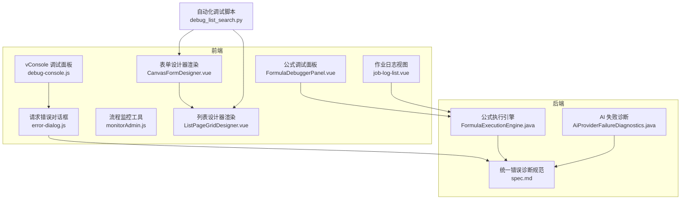
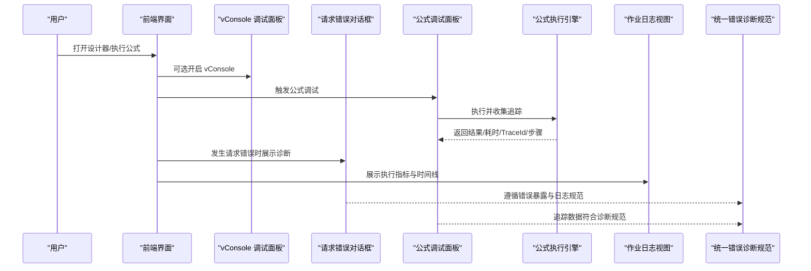
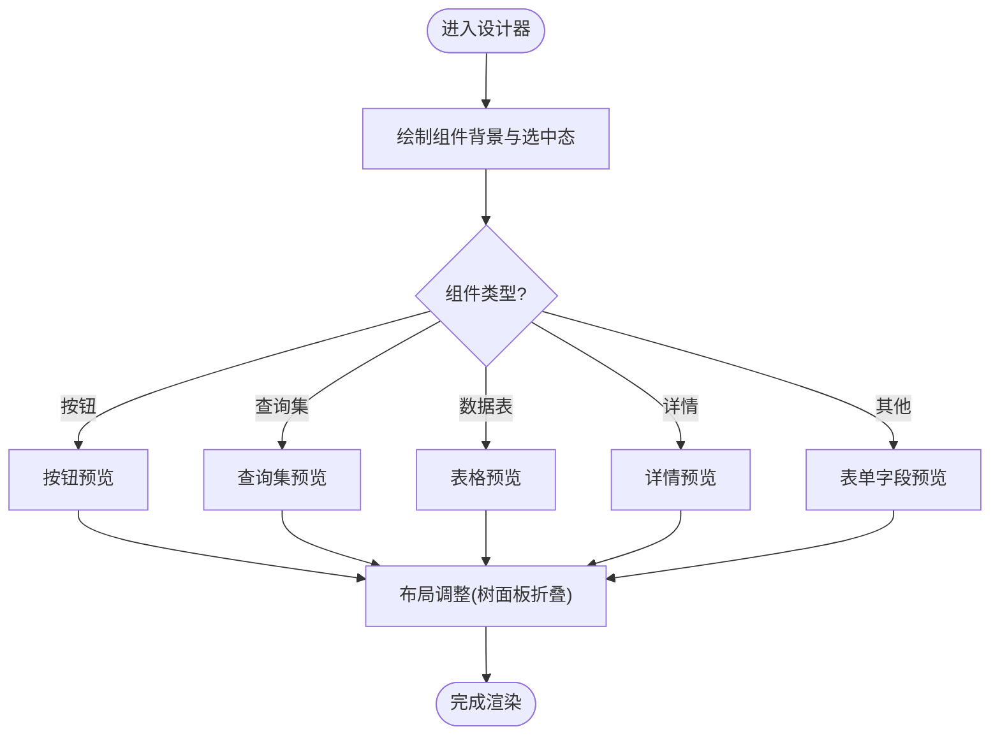
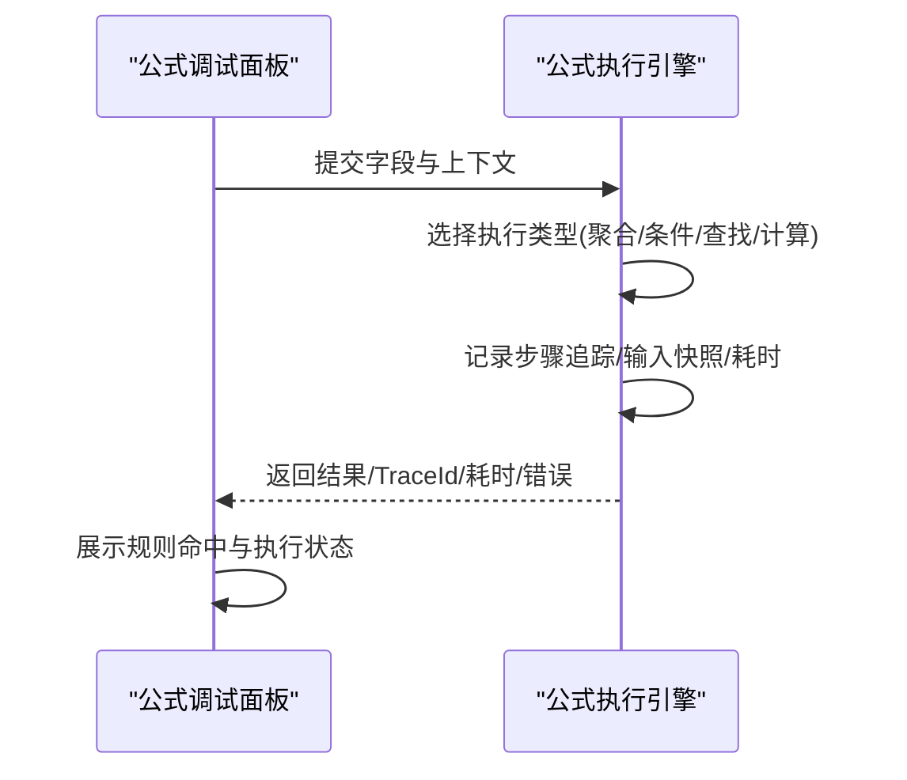
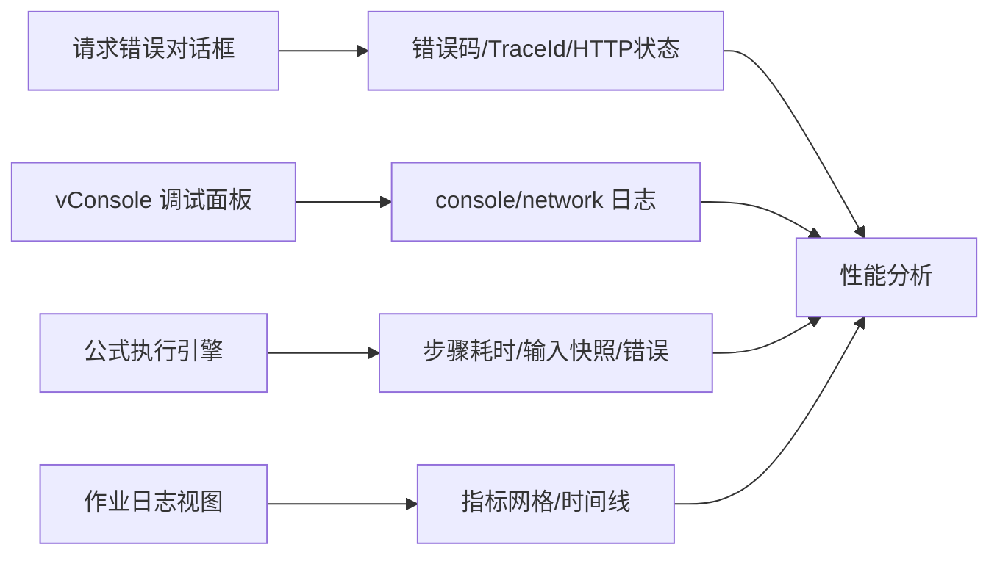
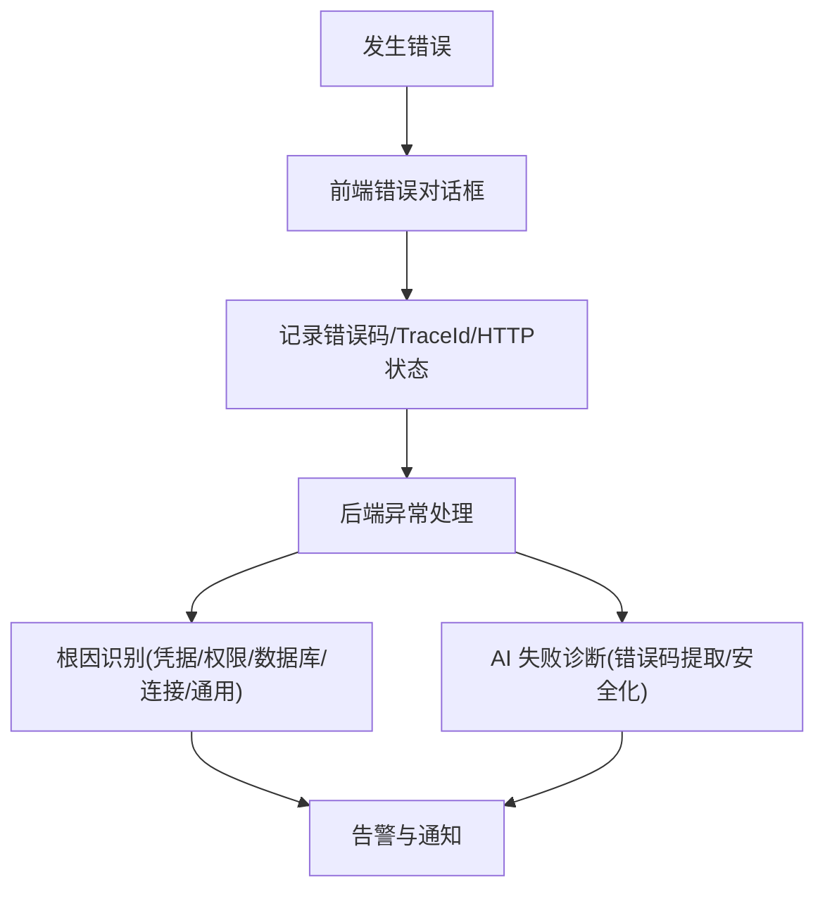
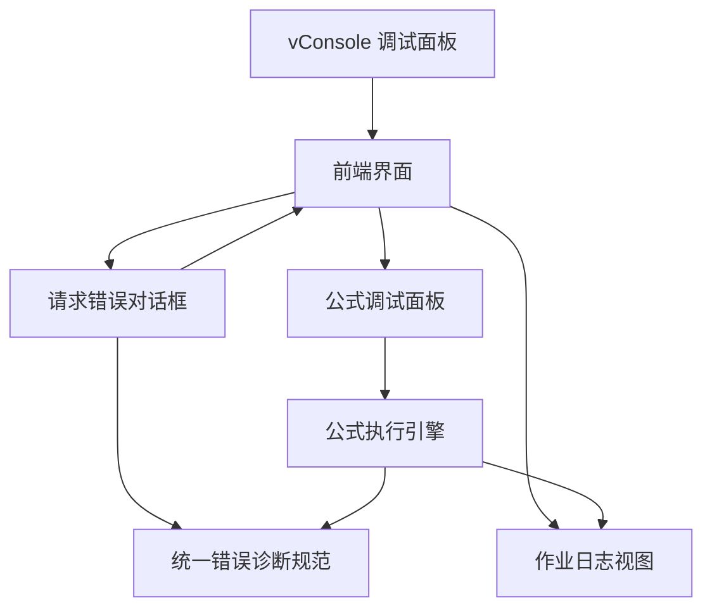

# 调试与监控工具

<cite>
**本文引用的文件**
- [debug-console.js](file://forge-admin-ui/src/utils/debug-console.js)
- [error-dialog.js](file://forge-admin-ui/src/utils/http/error-dialog.js)
- [monitorAdmin.js](file://forge-admin-ui/src/views/flow/utils/monitorAdmin.js)
- [FormulaDebuggerPanel.vue](file://forge-admin-ui/src/views/app-center/components/designer/formula/FormulaDebuggerPanel.vue)
- [FormulaExecutionEngine.java](file://forge-server/forge-framework/forge-plugin-parent/forge-plugin-generator/src/main/java/com/mdframe/forge/plugin/generator/service/formula/FormulaExecutionEngine.java)
- [CanvasFormDesigner.vue](file://forge-admin-ui/src/components/lowcode-builder/page/CanvasFormDesigner.vue)
- [ListPageGridDesigner.vue](file://forge-admin-ui/src/components/lowcode-builder/page/ListPageGridDesigner.vue)
- [job-log-list.vue](file://forge-admin-ui/src/views/system/job-log-list.vue)
- [spec.md](file://code-copilot/changes/unified-error-diagnostics/spec.md)
- [AiProviderFailureDiagnostics.java](file://forge-server/forge-framework/forge-plugin-parent/forge-plugin-ai/src/main/java/com/mdframe/forge/plugin/ai/provider/support/AiProviderFailureDiagnostics.java)
- [debug_list_search.py](file://var/tmp/debug_list_search.py)
</cite>

## 目录
1. [简介](#简介)
2. [项目结构](#项目结构)
3. [核心组件](#核心组件)
4. [架构总览](#架构总览)
5. [详细组件分析](#详细组件分析)
6. [依赖关系分析](#依赖关系分析)
7. [性能考量](#性能考量)
8. [故障排查指南](#故障排查指南)
9. [结论](#结论)
10. [附录](#附录)

## 简介
本技术文档面向低代码平台的“调试与监控”能力，聚焦以下目标：
- 渲染树可视化：在表单与列表设计器中定位组件、查看选中项与布局信息。
- 组件状态检查：通过公式调试面板与执行追踪，验证字段计算、规则命中与耗时。
- 性能分析器：采集请求错误详情、执行耗时、步骤级追踪数据，辅助定位慢点。
- 错误追踪：统一前端错误弹窗、TraceId 关联、后端异常诊断与告警。
- 调试模式配置：vConsole 开关、远程调试建议、日志记录规范。
- 监控指标与告警：流程实例状态判断、权限控制、任务日志指标展示。
- 调试 API 与第三方集成：浏览器控制台、自动化脚本、监控与告警通道。

## 项目结构
本项目的前端调试与监控能力主要分布在以下位置：
- 页面内调试面板：用于移动端或受限环境下的 console/network 查看。
- 错误对话框：统一展示请求失败、错误码、TraceId 与诊断详情。
- 流程监控工具：实例状态判定、参数规范化、权限校验。
- 公式调试面板：结果、耗时、TraceId、规则命中情况。
- 设计器渲染：表单/列表画布中的组件绘制与选中态高亮。
- 后端执行引擎：公式执行步骤追踪、输入输出快照、耗时统计。
- 作业日志视图：指标网格与时间线样式，便于观察执行过程。
- 统一错误诊断规范：后端异常处理链路、错误暴露策略与日志要求。
- AI 提供者失败诊断：错误码提取、消息截断与安全化。
- 自动化调试脚本：截图、DOM 抓取、响应打印，辅助回归与复现。

图表来源
- [debug-console.js:1-46](file://forge-admin-ui/src/utils/debug-console.js#L1-L46)
- [error-dialog.js:1-231](file://forge-admin-ui/src/utils/http/error-dialog.js#L1-L231)
- [monitorAdmin.js:1-76](file://forge-admin-ui/src/views/flow/utils/monitorAdmin.js#L1-L76)
- [FormulaDebuggerPanel.vue:53-86](file://forge-admin-ui/src/views/app-center/components/designer/formula/FormulaDebuggerPanel.vue#L53-L86)
- [CanvasFormDesigner.vue:265-304](file://forge-admin-ui/src/components/lowcode-builder/page/CanvasFormDesigner.vue#L265-L304)
- [ListPageGridDesigner.vue:6119-6150](file://forge-admin-ui/src/components/lowcode-builder/page/ListPageGridDesigner.vue#L6119-L6150)
- [job-log-list.vue:989-1062](file://forge-admin-ui/src/views/system/job-log-list.vue#L989-L1062)
- [FormulaExecutionEngine.java:152-425](file://forge-server/forge-framework/forge-plugin-parent/forge-plugin-generator/src/main/java/com/mdframe/forge/plugin/generator/service/formula/FormulaExecutionEngine.java#L152-L425)
- [spec.md:456-508](file://code-copilot/changes/unified-error-diagnostics/spec.md#L456-L508)
- [AiProviderFailureDiagnostics.java:63-89](file://forge-server/forge-framework/forge-plugin-parent/forge-plugin-ai/src/main/java/com/mdframe/forge/plugin/ai/provider/support/AiProviderFailureDiagnostics.java#L63-L89)
- [debug_list_search.py:86-99](file://var/tmp/debug_list_search.py#L86-L99)

章节来源
- [debug-console.js:1-46](file://forge-admin-ui/src/utils/debug-console.js#L1-L46)
- [error-dialog.js:1-231](file://forge-admin-ui/src/utils/http/error-dialog.js#L1-L231)
- [monitorAdmin.js:1-76](file://forge-admin-ui/src/views/flow/utils/monitorAdmin.js#L1-L76)
- [FormulaDebuggerPanel.vue:53-86](file://forge-admin-ui/src/views/app-center/components/designer/formula/FormulaDebuggerPanel.vue#L53-L86)
- [CanvasFormDesigner.vue:265-304](file://forge-admin-ui/src/components/lowcode-builder/page/CanvasFormDesigner.vue#L265-L304)
- [ListPageGridDesigner.vue:6119-6150](file://forge-admin-ui/src/components/lowcode-builder/page/ListPageGridDesigner.vue#L6119-L6150)
- [job-log-list.vue:989-1062](file://forge-admin-ui/src/views/system/job-log-list.vue#L989-L1062)
- [FormulaExecutionEngine.java:152-425](file://forge-server/forge-framework/forge-plugin-parent/forge-plugin-generator/src/main/java/com/mdframe/forge/plugin/generator/service/formula/FormulaExecutionEngine.java#L152-L425)
- [spec.md:456-508](file://code-copilot/changes/unified-error-diagnostics/spec.md#L456-L508)
- [AiProviderFailureDiagnostics.java:63-89](file://forge-server/forge-framework/forge-plugin-parent/forge-plugin-ai/src/main/java/com/mdframe/forge/plugin/ai/provider/support/AiProviderFailureDiagnostics.java#L63-L89)
- [debug_list_search.py:86-99](file://var/tmp/debug_list_search.py#L86-L99)

## 核心组件
- vConsole 调试面板：支持 URL 参数开关与本地持久化，按需从 CDN 加载，适用于企微/微信内置浏览器等无法打开 DevTools 的场景。
- 请求错误对话框：集中展示错误摘要、错误码、TraceId、HTTP 状态、原始信息与堆栈，支持折叠详情。
- 流程监控工具：提供实例状态标准化、可干预判断、运行态变更限制、参数压缩、当前任务选项构建与平台管理员权限判定。
- 公式调试面板：显示执行成功/失败、结果值、TraceId、耗时与规则命中明细，便于快速定位表达式问题。
- 设计器渲染：表单与列表画布中绘制组件背景、选中态边框、按钮/表格/详情预览，并处理树形面板折叠时的布局偏移。
- 公式执行引擎：按类型（聚合/条件/查找/计算）执行，记录步骤级追踪、输入快照、输出值、耗时与错误信息，生成 TraceId。
- 作业日志视图：以指标网格和时间线样式呈现执行过程，便于观察阶段耗时与状态变化。
- 统一错误诊断规范：定义后端异常处理链路、错误暴露策略、日志字段与根因识别优先级。
- AI 提供者失败诊断：从错误消息中提取错误码、安全化处理与长度限制，避免敏感信息泄露。
- 自动化调试脚本：截图、DOM 抓取、响应打印，辅助复现与对比渲染差异。

章节来源
- [debug-console.js:1-46](file://forge-admin-ui/src/utils/debug-console.js#L1-L46)
- [error-dialog.js:1-231](file://forge-admin-ui/src/utils/http/error-dialog.js#L1-L231)
- [monitorAdmin.js:1-76](file://forge-admin-ui/src/views/flow/utils/monitorAdmin.js#L1-L76)
- [FormulaDebuggerPanel.vue:53-86](file://forge-admin-ui/src/views/app-center/components/designer/formula/FormulaDebuggerPanel.vue#L53-L86)
- [CanvasFormDesigner.vue:265-304](file://forge-admin-ui/src/components/lowcode-builder/page/CanvasFormDesigner.vue#L265-L304)
- [ListPageGridDesigner.vue:6119-6150](file://forge-admin-ui/src/components/lowcode-builder/page/ListPageGridDesigner.vue#L6119-L6150)
- [job-log-list.vue:989-1062](file://forge-admin-ui/src/views/system/job-log-list.vue#L989-L1062)
- [FormulaExecutionEngine.java:152-425](file://forge-server/forge-framework/forge-plugin-parent/forge-plugin-generator/src/main/java/com/mdframe/forge/plugin/generator/service/formula/FormulaExecutionEngine.java#L152-L425)
- [spec.md:456-508](file://code-copilot/changes/unified-error-diagnostics/spec.md#L456-L508)
- [AiProviderFailureDiagnostics.java:63-89](file://forge-server/forge-framework/forge-plugin-parent/forge-plugin-ai/src/main/java/com/mdframe/forge/plugin/ai/provider/support/AiProviderFailureDiagnostics.java#L63-L89)
- [debug_list_search.py:86-99](file://var/tmp/debug_list_search.py#L86-L99)

## 架构总览
下图展示了调试与监控在前端与后端的交互关系：用户操作触发设计器渲染与公式执行；错误发生时通过统一对话框展示诊断信息；执行引擎产出步骤级追踪数据；作业日志视图呈现指标与时间线；统一错误诊断规范约束后端异常处理与日志输出。

图表来源
- [debug-console.js:1-46](file://forge-admin-ui/src/utils/debug-console.js#L1-L46)
- [error-dialog.js:1-231](file://forge-admin-ui/src/utils/http/error-dialog.js#L1-L231)
- [FormulaDebuggerPanel.vue:53-86](file://forge-admin-ui/src/views/app-center/components/designer/formula/FormulaDebuggerPanel.vue#L53-L86)
- [FormulaExecutionEngine.java:152-425](file://forge-server/forge-framework/forge-plugin-parent/forge-plugin-generator/src/main/java/com/mdframe/forge/plugin/generator/service/formula/FormulaExecutionEngine.java#L152-L425)
- [job-log-list.vue:989-1062](file://forge-admin-ui/src/views/system/job-log-list.vue#L989-L1062)
- [spec.md:456-508](file://code-copilot/changes/unified-error-diagnostics/spec.md#L456-L508)

## 详细组件分析

### 渲染树可视化与设计器调试
- 表单设计器渲染：根据组件类型绘制矩形背景、选中态边框与圆角，针对按钮、查询集、数据表、详情字段进行差异化预览绘制。
- 列表设计器渲染：处理树形面板折叠时的宽度与位置调整，确保组件框不重叠且保持可见性。
- 可视化调试要点：通过选中态高亮与区域裁剪，快速定位组件层级与布局问题；结合自动化脚本截图与 DOM 抓取，对比渲染差异。

图表来源
- [CanvasFormDesigner.vue:265-304](file://forge-admin-ui/src/components/lowcode-builder/page/CanvasFormDesigner.vue#L265-L304)
- [ListPageGridDesigner.vue:6119-6150](file://forge-admin-ui/src/components/lowcode-builder/page/ListPageGridDesigner.vue#L6119-L6150)

章节来源
- [CanvasFormDesigner.vue:265-304](file://forge-admin-ui/src/components/lowcode-builder/page/CanvasFormDesigner.vue#L265-L304)
- [ListPageGridDesigner.vue:6119-6150](file://forge-admin-ui/src/components/lowcode-builder/page/ListPageGridDesigner.vue#L6119-L6150)
- [debug_list_search.py:86-99](file://var/tmp/debug_list_search.py#L86-L99)

### 组件状态检查与公式调试
- 公式调试面板：展示执行成功/失败、结果值、TraceId、耗时与规则命中明细，帮助快速定位表达式与规则问题。
- 公式执行引擎：按类型执行（聚合/条件/查找/计算），记录步骤级追踪、输入快照、输出值、耗时与错误信息，生成唯一 TraceId。
- 调试建议：优先使用 TraceId 关联前后端日志；关注步骤耗时与输入快照，定位慢点与脏数据；对规则命中进行分层展示，便于理解分支逻辑。

图表来源
- [FormulaDebuggerPanel.vue:53-86](file://forge-admin-ui/src/views/app-center/components/designer/formula/FormulaDebuggerPanel.vue#L53-L86)
- [FormulaExecutionEngine.java:152-425](file://forge-server/forge-framework/forge-plugin-parent/forge-plugin-generator/src/main/java/com/mdframe/forge/plugin/generator/service/formula/FormulaExecutionEngine.java#L152-L425)

章节来源
- [FormulaDebuggerPanel.vue:53-86](file://forge-admin-ui/src/views/app-center/components/designer/formula/FormulaDebuggerPanel.vue#L53-L86)
- [FormulaExecutionEngine.java:152-425](file://forge-server/forge-framework/forge-plugin-parent/forge-plugin-generator/src/main/java/com/mdframe/forge/plugin/generator/service/formula/FormulaExecutionEngine.java#L152-L425)

### 性能分析器与指标采集
- 前端指标：请求错误对话框汇总 HTTP 状态、错误码、TraceId、原始信息与堆栈；vConsole 提供 console/network 查看。
- 后端指标：公式执行引擎产出步骤级耗时与错误信息；作业日志视图以指标网格与时间线展示执行过程。
- 采集建议：在关键路径启用步骤追踪；对慢请求与复杂表达式增加输入快照；将 TraceId 贯穿前后端日志，便于关联分析。

图表来源
- [error-dialog.js:1-231](file://forge-admin-ui/src/utils/http/error-dialog.js#L1-L231)
- [debug-console.js:1-46](file://forge-admin-ui/src/utils/debug-console.js#L1-L46)
- [FormulaExecutionEngine.java:152-425](file://forge-server/forge-framework/forge-plugin-parent/forge-plugin-generator/src/main/java/com/mdframe/forge/plugin/generator/service/formula/FormulaExecutionEngine.java#L152-L425)
- [job-log-list.vue:989-1062](file://forge-admin-ui/src/views/system/job-log-list.vue#L989-L1062)

章节来源
- [error-dialog.js:1-231](file://forge-admin-ui/src/utils/http/error-dialog.js#L1-L231)
- [debug-console.js:1-46](file://forge-admin-ui/src/utils/debug-console.js#L1-L46)
- [FormulaExecutionEngine.java:152-425](file://forge-server/forge-framework/forge-plugin-parent/forge-plugin-generator/src/main/java/com/mdframe/forge/plugin/generator/service/formula/FormulaExecutionEngine.java#L152-L425)
- [job-log-list.vue:989-1062](file://forge-admin-ui/src/views/system/job-log-list.vue#L989-L1062)

### 错误追踪与告警
- 前端错误对话框：统一展示错误摘要、错误码、TraceId、HTTP 状态、原始信息与堆栈，支持折叠详情。
- 后端异常处理：遵循统一错误诊断规范，按显式错误定义、凭据/权限、具体原因、连接不可达、通用失败的优先级识别根因，并记录 traceId 与原始 Throwable。
- AI 提供者失败诊断：从错误消息中提取错误码，安全化处理与长度限制，避免敏感信息泄露。
- 告警建议：将错误码与 TraceId 接入告警系统；对高频错误设置阈值告警；对关键业务失败（如存储配置不完整）即时通知。

图表来源
- [error-dialog.js:1-231](file://forge-admin-ui/src/utils/http/error-dialog.js#L1-L231)
- [spec.md:456-508](file://code-copilot/changes/unified-error-diagnostics/spec.md#L456-L508)
- [AiProviderFailureDiagnostics.java:63-89](file://forge-server/forge-framework/forge-plugin-parent/forge-plugin-ai/src/main/java/com/mdframe/forge/plugin/ai/provider/support/AiProviderFailureDiagnostics.java#L63-L89)

章节来源
- [error-dialog.js:1-231](file://forge-admin-ui/src/utils/http/error-dialog.js#L1-L231)
- [spec.md:456-508](file://code-copilot/changes/unified-error-diagnostics/spec.md#L456-L508)
- [AiProviderFailureDiagnostics.java:63-89](file://forge-server/forge-framework/forge-plugin-parent/forge-plugin-ai/src/main/java/com/mdframe/forge/plugin/ai/provider/support/AiProviderFailureDiagnostics.java#L63-L89)

### 调试模式配置与日志记录规范
- vConsole 调试模式：通过 URL 参数开启/关闭，写入本地存储持久化；仅在显式开启时按需加载，不影响正常访问。
- 日志记录规范：错误对话框与执行引擎均包含 TraceId；后端统一异常处理记录 errorKey、traceId 与原始 Throwable；AI 失败诊断对错误码进行安全化处理。
- 断点调试：建议在关键路径（请求拦截、公式执行、错误处理）设置断点；结合 vConsole 与自动化脚本截图/DOM 抓取，逐步定位问题。
- 远程调试：当 CDN 加载失败或环境受限，建议使用远程调试方式替代页内调试面板。

章节来源
- [debug-console.js:1-46](file://forge-admin-ui/src/utils/debug-console.js#L1-L46)
- [error-dialog.js:1-231](file://forge-admin-ui/src/utils/http/error-dialog.js#L1-L231)
- [FormulaExecutionEngine.java:152-425](file://forge-server/forge-framework/forge-plugin-parent/forge-plugin-generator/src/main/java/com/mdframe/forge/plugin/generator/service/formula/FormulaExecutionEngine.java#L152-L425)
- [AiProviderFailureDiagnostics.java:63-89](file://forge-server/forge-framework/forge-plugin-parent/forge-plugin-ai/src/main/java/com/mdframe/forge/plugin/ai/provider/support/AiProviderFailureDiagnostics.java#L63-L89)

### 监控指标收集与权限控制
- 流程监控工具：提供实例状态标准化、可干预判断、运行态变更限制、参数压缩、当前任务选项构建与平台管理员权限判定。
- 指标收集：公式执行引擎产出步骤级耗时与错误信息；作业日志视图以指标网格与时间线展示执行过程。
- 权限控制：基于用户角色与路由按钮编码进行权限判定，确保监控功能仅对授权用户开放。

章节来源
- [monitorAdmin.js:1-76](file://forge-admin-ui/src/views/flow/utils/monitorAdmin.js#L1-L76)
- [FormulaExecutionEngine.java:152-425](file://forge-server/forge-framework/forge-plugin-parent/forge-plugin-generator/src/main/java/com/mdframe/forge/plugin/generator/service/formula/FormulaExecutionEngine.java#L152-L425)
- [job-log-list.vue:989-1062](file://forge-admin-ui/src/views/system/job-log-list.vue#L989-L1062)

### 调试 API 与第三方工具集成
- 浏览器控制台：vConsole 提供 console/network 查看，适合移动端或受限环境。
- 自动化脚本：截图、DOM 抓取、响应打印，辅助复现与对比渲染差异。
- 监控与告警：将错误码与 TraceId 接入告警系统；对关键失败设置阈值告警；结合作业日志视图进行趋势分析。

章节来源
- [debug-console.js:1-46](file://forge-admin-ui/src/utils/debug-console.js#L1-L46)
- [debug_list_search.py:86-99](file://var/tmp/debug_list_search.py#L86-L99)
- [error-dialog.js:1-231](file://forge-admin-ui/src/utils/http/error-dialog.js#L1-L231)

## 依赖关系分析
- 前端模块耦合：vConsole 与错误对话框为独立工具，被页面与请求层调用；公式调试面板依赖执行引擎的追踪数据；设计器渲染相互独立但共享布局调整逻辑。
- 前后端协作：公式调试面板与执行引擎通过 TraceId 关联；错误对话框与后端统一异常处理遵循相同字段约定；作业日志视图消费执行引擎产出的指标。
- 外部依赖：vConsole 从 CDN 加载，需考虑网络与拦截场景；自动化脚本依赖浏览器自动化能力。

图表来源
- [debug-console.js:1-46](file://forge-admin-ui/src/utils/debug-console.js#L1-L46)
- [error-dialog.js:1-231](file://forge-admin-ui/src/utils/http/error-dialog.js#L1-L231)
- [FormulaDebuggerPanel.vue:53-86](file://forge-admin-ui/src/views/app-center/components/designer/formula/FormulaDebuggerPanel.vue#L53-L86)
- [FormulaExecutionEngine.java:152-425](file://forge-server/forge-framework/forge-plugin-parent/forge-plugin-generator/src/main/java/com/mdframe/forge/plugin/generator/service/formula/FormulaExecutionEngine.java#L152-L425)
- [job-log-list.vue:989-1062](file://forge-admin-ui/src/views/system/job-log-list.vue#L989-L1062)
- [spec.md:456-508](file://code-copilot/changes/unified-error-diagnostics/spec.md#L456-L508)

章节来源
- [debug-console.js:1-46](file://forge-admin-ui/src/utils/debug-console.js#L1-L46)
- [error-dialog.js:1-231](file://forge-admin-ui/src/utils/http/error-dialog.js#L1-L231)
- [FormulaDebuggerPanel.vue:53-86](file://forge-admin-ui/src/views/app-center/components/designer/formula/FormulaDebuggerPanel.vue#L53-L86)
- [FormulaExecutionEngine.java:152-425](file://forge-server/forge-framework/forge-plugin-parent/forge-plugin-generator/src/main/java/com/mdframe/forge/plugin/generator/service/formula/FormulaExecutionEngine.java#L152-L425)
- [job-log-list.vue:989-1062](file://forge-admin-ui/src/views/system/job-log-list.vue#L989-L1062)
- [spec.md:456-508](file://code-copilot/changes/unified-error-diagnostics/spec.md#L456-L508)

## 性能考量
- 减少不必要的追踪：仅在调试模式或关键路径启用步骤追踪与输入快照，避免生产环境开销。
- 控制数据大小：对错误详情与堆栈进行长度限制与循环引用处理，防止大对象影响性能。
- 优化渲染：在设计器中按需绘制组件预览，避免全量重绘；处理树形面板折叠时的布局调整，减少重排。
- 监控采样：对高频请求与复杂表达式进行采样监控，平衡覆盖率与性能。

[本节为通用指导，无需特定文件来源]

## 故障排查指南
- 前端请求失败：查看错误对话框的错误码、TraceId、HTTP 状态与原始信息；必要时开启 vConsole 查看 network。
- 公式执行异常：使用公式调试面板查看 TraceId、耗时与规则命中；检查输入快照与输出值，定位表达式或数据问题。
- 设计器渲染异常：通过截图与 DOM 抓取对比差异；检查组件类型与布局调整逻辑，确认选中态与边界情况。
- 后端异常：依据统一错误诊断规范，按根因优先级识别；结合 TraceId 在后端日志中定位；对 AI 提供者失败进行错误码提取与安全化处理。
- 作业执行异常：查看作业日志视图的指标网格与时间线，定位慢点与失败阶段；结合公式执行引擎的步骤追踪进行根因分析。

章节来源
- [error-dialog.js:1-231](file://forge-admin-ui/src/utils/http/error-dialog.js#L1-L231)
- [debug-console.js:1-46](file://forge-admin-ui/src/utils/debug-console.js#L1-L46)
- [FormulaDebuggerPanel.vue:53-86](file://forge-admin-ui/src/views/app-center/components/designer/formula/FormulaDebuggerPanel.vue#L53-L86)
- [FormulaExecutionEngine.java:152-425](file://forge-server/forge-framework/forge-plugin-parent/forge-plugin-generator/src/main/java/com/mdframe/forge/plugin/generator/service/formula/FormulaExecutionEngine.java#L152-L425)
- [job-log-list.vue:989-1062](file://forge-admin-ui/src/views/system/job-log-list.vue#L989-L1062)
- [AiProviderFailureDiagnostics.java:63-89](file://forge-server/forge-framework/forge-plugin-parent/forge-plugin-ai/src/main/java/com/mdframe/forge/plugin/ai/provider/support/AiProviderFailureDiagnostics.java#L63-L89)
- [debug_list_search.py:86-99](file://var/tmp/debug_list_search.py#L86-L99)

## 结论
本项目的调试与监控体系覆盖了渲染可视化、组件状态检查、性能分析与错误追踪的关键环节。通过 vConsole、错误对话框、公式调试面板、执行引擎追踪与作业日志视图，形成前后端一致的调试体验。统一错误诊断规范确保了错误暴露的安全性与可追溯性。建议在生产环境中谨慎启用追踪与快照，结合告警系统与自动化脚本，持续提升问题定位效率与系统稳定性。

[本节为总结，无需特定文件来源]

## 附录
- 调试模式开关：URL 参数 vdebug=1/vdebug=0，配合本地存储持久化。
- 日志字段建议：错误码、TraceId、HTTP 状态、原始信息、堆栈、步骤耗时、输入快照。
- 告警规则建议：错误码阈值、TraceId 关联、关键失败即时通知。
- 第三方集成：浏览器控制台、自动化脚本、监控与告警通道。

[本节为补充说明，无需特定文件来源]