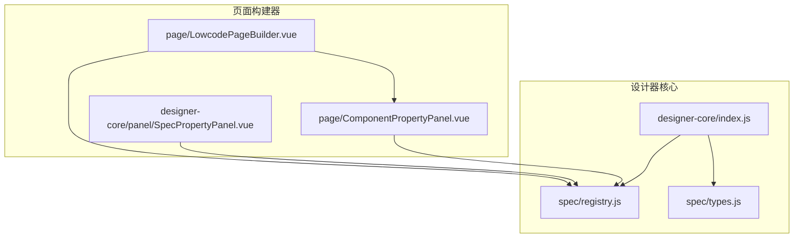
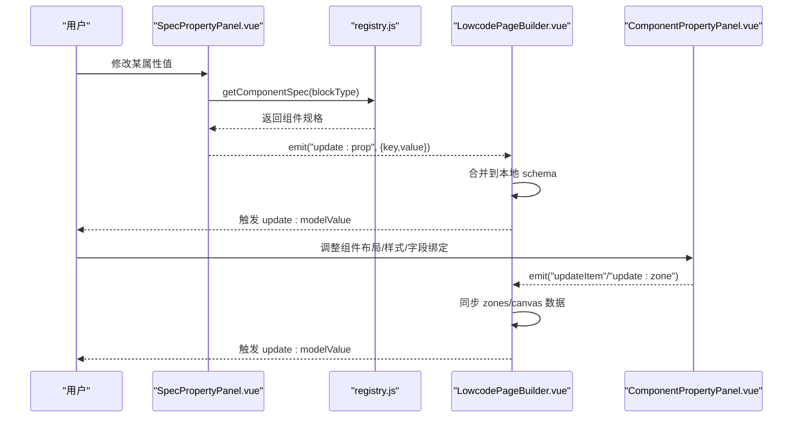
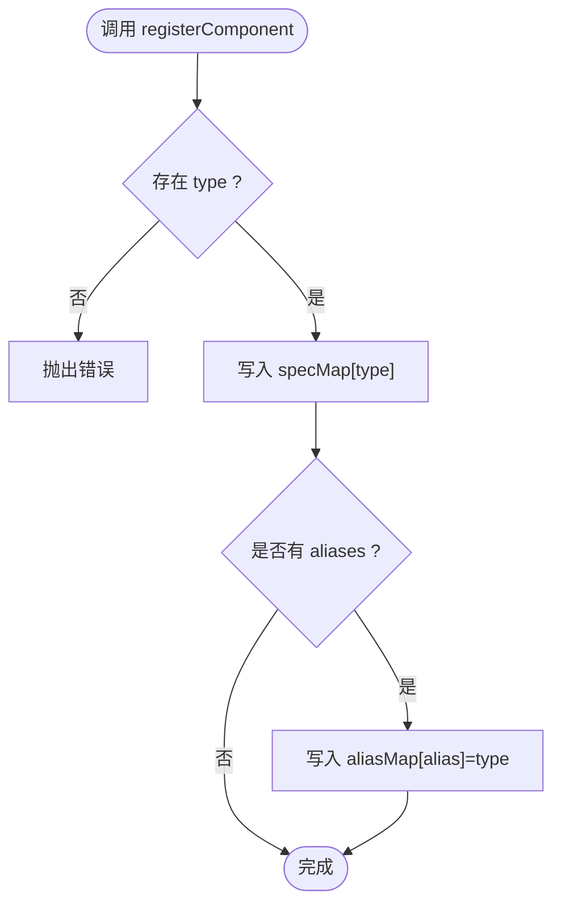
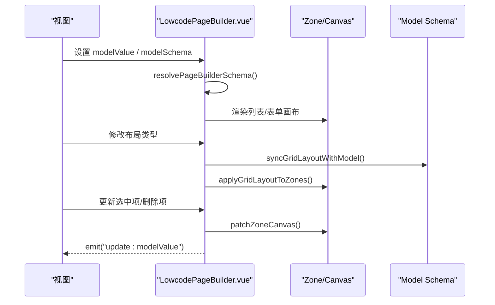
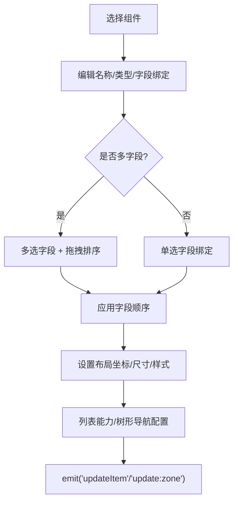
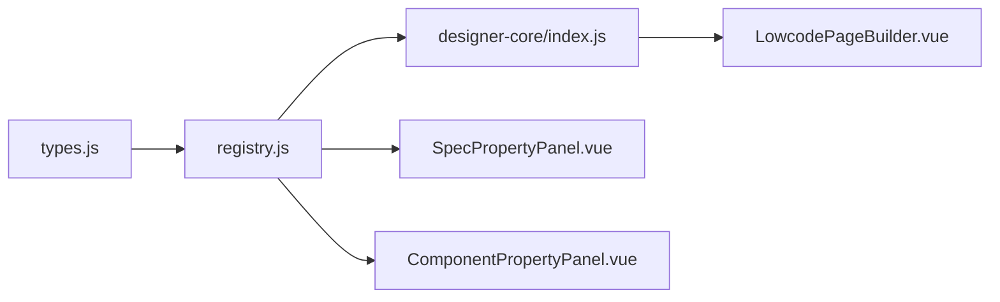

# 组件系统

<cite>
**本文引用的文件**
- [designer-core/index.js](file://forge-admin-ui/src/components/lowcode-builder/designer-core/index.js)
- [registry.js](file://forge-admin-ui/src/components/lowcode-builder/designer-core/spec/registry.js)
- [types.js](file://forge-admin-ui/src/components/lowcode-builder/designer-core/spec/types.js)
- [LowcodePageBuilder.vue](file://forge-admin-ui/src/components/lowcode-builder/page/LowcodePageBuilder.vue)
- [SpecPropertyPanel.vue](file://forge-admin-ui/src/components/lowcode-builder/designer-core/panel/SpecPropertyPanel.vue)
- [ComponentPropertyPanel.vue](file://forge-admin-ui/src/components/lowcode-builder/page/ComponentPropertyPanel.vue)
</cite>

## 目录
1. [简介](#简介)
2. [项目结构](#项目结构)
3. [核心组件](#核心组件)
4. [架构总览](#架构总览)
5. [详细组件分析](#详细组件分析)
6. [依赖关系分析](#依赖关系分析)
7. [性能考虑](#性能考虑)
8. [故障排查指南](#故障排查指南)
9. [结论](#结论)
10. [附录：API 参考与扩展示例](#附录api-参考与扩展示例)

## 简介
本技术文档围绕低代码组件系统的核心能力展开，重点说明以下方面：
- 组件注册机制：统一规格（ComponentSpec）定义、集中注册表、别名解析与分组查询。
- 属性面板配置：基于 Schema 的动态属性面板引擎，支持布尔、数字、选择、颜色、JSON、自定义编辑器等。
- 渲染引擎与页面构建器：以“区域（Zone）+ 画布（Canvas）”为核心的可视化构建流程，以及列表/表单/详情等多布局模式。
- 事件系统与数据流：通过 propsSchema 驱动的属性更新事件、画布项变更事件、区域级配置变更事件，形成可追踪的数据流。
- 自定义组件开发、组件库管理、主题定制与国际化支持：在现有注册表与属性面板基础上进行扩展的最佳实践。
- 性能优化、兼容性处理与调试工具使用：提供可操作的优化建议与排障路径。

## 项目结构
低代码构建器位于前端工程中的 lowcode-builder 模块，核心由 designer-core 与 page 两大子域组成：
- designer-core：统一组件规格、注册表、拖拽协议、容器插槽规范、树操作与桥接层。首次导入即自动注册全部统一组件 spec。
- page：页面构建器 UI（画布、调色板、属性面板）、页面 Schema 同步与布局切换。



图表来源
- [designer-core/index.js:1-126](file://forge-admin-ui/src/components/lowcode-builder/designer-core/index.js#L1-L126)
- [registry.js:1-169](file://forge-admin-ui/src/components/lowcode-builder/designer-core/spec/registry.js#L1-L169)
- [types.js:1-120](file://forge-admin-ui/src/components/lowcode-builder/designer-core/spec/types.js#L1-L120)
- [LowcodePageBuilder.vue:1-247](file://forge-admin-ui/src/components/lowcode-builder/page/LowcodePageBuilder.vue#L1-L247)
- [ComponentPropertyPanel.vue:1-563](file://forge-admin-ui/src/components/lowcode-builder/page/ComponentPropertyPanel.vue#L1-L563)
- [SpecPropertyPanel.vue:1-288](file://forge-admin-ui/src/components/lowcode-builder/designer-core/panel/SpecPropertyPanel.vue#L1-L288)

章节来源
- [designer-core/index.js:1-126](file://forge-admin-ui/src/components/lowcode-builder/designer-core/index.js#L1-L126)
- [LowcodePageBuilder.vue:1-247](file://forge-admin-ui/src/components/lowcode-builder/page/LowcodePageBuilder.vue#L1-L247)

## 核心组件
- 统一组件规格与类型定义：通过 types.js 定义 ComponentSpec、PropsSchema、DataSourceKind 等核心类型，确保所有组件遵循同一契约。
- 统一组件注册表：registry.js 提供 registerComponent/registerComponents、getComponentSpec、resolveComponentType、listComponentsByCategory、groupComponents 等 API，维护 type 与 alias 映射，并支持按 scope/category 过滤。
- 页面构建器外壳：LowcodePageBuilder.vue 组合列表页网格设计器与表单/详情画布，负责布局切换、区域（Zone）与画布（Canvas）数据同步、字段引用计算与变更回写。
- 动态属性面板引擎：SpecPropertyPanel.vue 消费注册表的 propsSchema，自动生成属性编辑 UI；ComponentPropertyPanel.vue 提供页面级与组件级参数配置（名称、类型、绑定字段、布局、样式、列表能力等）。

章节来源
- [types.js:1-120](file://forge-admin-ui/src/components/lowcode-builder/designer-core/spec/types.js#L1-L120)
- [registry.js:1-169](file://forge-admin-ui/src/components/lowcode-builder/designer-core/spec/registry.js#L1-L169)
- [LowcodePageBuilder.vue:1-247](file://forge-admin-ui/src/components/lowcode-builder/page/LowcodePageBuilder.vue#L1-L247)
- [SpecPropertyPanel.vue:1-288](file://forge-admin-ui/src/components/lowcode-builder/designer-core/panel/SpecPropertyPanel.vue#L1-L288)
- [ComponentPropertyPanel.vue:1-563](file://forge-admin-ui/src/components/lowcode-builder/page/ComponentPropertyPanel.vue#L1-L563)

## 架构总览
整体架构围绕“规格—注册—面板—画布—数据”的闭环展开：
- 规格层：ComponentSpec 描述组件类型、分类、分组、容器能力、属性 Schema、数据源支持、打印配置等。
- 注册层：集中式 Map 存储 spec 与别名映射，提供查询、分组、统计与清空能力。
- 面板层：SpecPropertyPanel 根据 propsSchema 生成通用属性编辑 UI；ComponentPropertyPanel 提供页面/组件级配置入口。
- 画布层：LowcodePageBuilder 协调 Zone/Canvas 数据，联动列表网格与表单画布，实现多布局模式下的可视化编排。
- 数据流：属性变更通过 update:prop/updateItem/update:zone 等事件向上传递，由父组件合并到本地 schema，再同步至 modelValue。



图表来源
- [SpecPropertyPanel.vue:1-288](file://forge-admin-ui/src/components/lowcode-builder/designer-core/panel/SpecPropertyPanel.vue#L1-L288)
- [registry.js:1-169](file://forge-admin-ui/src/components/lowcode-builder/designer-core/spec/registry.js#L1-L169)
- [LowcodePageBuilder.vue:1-247](file://forge-admin-ui/src/components/lowcode-builder/page/LowcodePageBuilder.vue#L1-L247)
- [ComponentPropertyPanel.vue:1-563](file://forge-admin-ui/src/components/lowcode-builder/page/ComponentPropertyPanel.vue#L1-L563)

## 详细组件分析

### 组件注册机制（Registry）
- 职责：维护组件规格集合与别名映射，提供查询、分组、统计、清空等能力。
- 关键行为：
  - 注册单个或批量组件规格，重复注册会覆盖并告警。
  - 支持按 type 或 alias 获取规格，解析为统一 type。
  - 支持按 scope（F/L/F+L）与 category（field/layout/business/page/media/widget）过滤。
  - 提供 groupComponents 按 group 分组，便于调色板展示。
  - 提供 clearRegistry 用于测试隔离。



图表来源
- [registry.js:17-41](file://forge-admin-ui/src/components/lowcode-builder/designer-core/spec/registry.js#L17-L41)
- [registry.js:48-66](file://forge-admin-ui/src/components/lowcode-builder/designer-core/spec/registry.js#L48-L66)
- [registry.js:90-125](file://forge-admin-ui/src/components/lowcode-builder/designer-core/spec/registry.js#L90-L125)

章节来源
- [registry.js:1-169](file://forge-admin-ui/src/components/lowcode-builder/designer-core/spec/registry.js#L1-L169)

### 属性面板配置（SpecPropertyPanel）
- 职责：基于 propsSchema 自动生成属性编辑 UI，支持 section、boolean、number、select、color、textarea/json 等类型。
- 关键行为：
  - 读取 blockType 对应的组件规格，过滤 excludeKeys。
  - 对 JSON 类型进行安全解析，非法时不回写。
  - 两列紧凑网格布局，长内容占满整行，布尔开关内联一行。
  - 通过 update:prop 事件将属性变更上抛给父组件。

```mermaid
classDiagram
class SpecPropertyPanel {
+blockType : String
+modelProps : Object
+excludeKeys : Array
+disabled : Boolean
+emit("update : prop", {key,value})
}
class Registry {
+getComponentSpec(typeOrAlias)
}
SpecPropertyPanel --> Registry : "读取组件规格"
```

图表来源
- [SpecPropertyPanel.vue:14-50](file://forge-admin-ui/src/components/lowcode-builder/designer-core/panel/SpecPropertyPanel.vue#L14-L50)
- [SpecPropertyPanel.vue:74-85](file://forge-admin-ui/src/components/lowcode-builder/designer-core/panel/SpecPropertyPanel.vue#L74-L85)
- [registry.js:48-54](file://forge-admin-ui/src/components/lowcode-builder/designer-core/spec/registry.js#L48-L54)

章节来源
- [SpecPropertyPanel.vue:1-288](file://forge-admin-ui/src/components/lowcode-builder/designer-core/panel/SpecPropertyPanel.vue#L1-L288)

### 页面构建器与数据流（LowcodePageBuilder）
- 职责：组合列表页网格设计与表单/详情画布，管理布局类型切换、区域（Zone）与画布（Canvas）数据同步、字段引用计算与变更回写。
- 关键行为：
  - 监听 modelValue/modelSchema 变化，同步本地 schema。
  - 监听 layoutType 变化，同步 listGridLayout 与 zones。
  - 处理 edit 区域的 zone 更新、选中项更新与删除。
  - 计算 edit 区域已使用的字段引用，避免冲突。



图表来源
- [LowcodePageBuilder.vue:88-163](file://forge-admin-ui/src/components/lowcode-builder/page/LowcodePageBuilder.vue#L88-L163)
- [LowcodePageBuilder.vue:175-212](file://forge-admin-ui/src/components/lowcode-builder/page/LowcodePageBuilder.vue#L175-L212)

章节来源
- [LowcodePageBuilder.vue:1-247](file://forge-admin-ui/src/components/lowcode-builder/page/LowcodePageBuilder.vue#L1-L247)

### 组件级属性面板（ComponentPropertyPanel）
- 职责：提供页面/组件级参数配置，包括组件名称、类型、绑定字段、布局坐标与尺寸、样式、列表能力、树形导航等。
- 关键行为：
  - 支持单字段绑定与多字段选择（如 query-set、data-table）。
  - 支持拖拽排序字段顺序。
  - 针对 tree-crud 布局初始化树形导航配置。
  - 通过 updateItem/update:zone 事件将变更上抛。



图表来源
- [ComponentPropertyPanel.vue:20-83](file://forge-admin-ui/src/components/lowcode-builder/page/ComponentPropertyPanel.vue#L20-L83)
- [ComponentPropertyPanel.vue:228-260](file://forge-admin-ui/src/components/lowcode-builder/page/ComponentPropertyPanel.vue#L228-L260)
- [ComponentPropertyPanel.vue:343-373](file://forge-admin-ui/src/components/lowcode-builder/page/ComponentPropertyPanel.vue#L343-L373)
- [ComponentPropertyPanel.vue:432-451](file://forge-admin-ui/src/components/lowcode-builder/page/ComponentPropertyPanel.vue#L432-L451)

章节来源
- [ComponentPropertyPanel.vue:1-563](file://forge-admin-ui/src/components/lowcode-builder/page/ComponentPropertyPanel.vue#L1-L563)

## 依赖关系分析
- 组件规格与类型：types.js 定义统一契约，被 registry.js 与面板组件共同消费。
- 注册表：registry.js 被 designer-core/index.js 聚合导出，并被 SpecPropertyPanel.vue 与 ComponentPropertyPanel.vue 间接消费（通过 catalog/bridge 等）。
- 页面构建器：LowcodePageBuilder.vue 依赖注册表能力（如组件选项、默认字段组件 key 解析），并通过事件驱动属性面板与画布数据同步。



图表来源
- [types.js:1-120](file://forge-admin-ui/src/components/lowcode-builder/designer-core/spec/types.js#L1-L120)
- [registry.js:1-169](file://forge-admin-ui/src/components/lowcode-builder/designer-core/spec/registry.js#L1-L169)
- [designer-core/index.js:1-126](file://forge-admin-ui/src/components/lowcode-builder/designer-core/index.js#L1-L126)
- [LowcodePageBuilder.vue:1-247](file://forge-admin-ui/src/components/lowcode-builder/page/LowcodePageBuilder.vue#L1-L247)
- [SpecPropertyPanel.vue:1-288](file://forge-admin-ui/src/components/lowcode-builder/designer-core/panel/SpecPropertyPanel.vue#L1-L288)
- [ComponentPropertyPanel.vue:1-563](file://forge-admin-ui/src/components/lowcode-builder/page/ComponentPropertyPanel.vue#L1-L563)

章节来源
- [designer-core/index.js:1-126](file://forge-admin-ui/src/components/lowcode-builder/designer-core/index.js#L1-L126)
- [registry.js:1-169](file://forge-admin-ui/src/components/lowcode-builder/designer-core/spec/registry.js#L1-L169)

## 性能考虑
- 注册表访问复杂度：
  - 注册/查询/解析均为 O(1) 哈希表操作，适合高频交互。
  - 分组与过滤为 O(n)，建议在调色板或属性面板中按需缓存结果。
- 属性面板渲染：
  - 使用 computed 派生 editableProperties，减少重复计算。
  - JSON 输入采用延迟解析与异常保护，避免阻塞渲染。
- 页面构建器数据同步：
  - 使用 isSameSchema 比较避免不必要的重渲染。
  - 局部 patch（patchZoneCanvas）减少全量更新。
- 建议：
  - 对大型组件列表进行分页或虚拟滚动。
  - 对复杂属性编辑器（公式/联动/CRUD 分区）采用懒加载与异步校验。
  - 合理使用 watch 深度监听，必要时改为浅比较以提升性能。

## 故障排查指南
- 组件未显示或无法选择：
  - 检查组件是否已通过 registerComponents 注册，确认 type/aliases 是否正确。
  - 使用 listAllTypes/getComponentSpec 验证注册状态。
- 属性面板不生效：
  - 确认 propsSchema.properties 是否存在且键名匹配。
  - 检查 excludeKeys 是否误排除关键属性。
  - JSON 属性需保证合法格式，否则不会回写。
- 画布数据不同步：
  - 检查 LowcodePageBuilder 的 watch 与 patch 逻辑是否触发。
  - 确认 update:zone/updateItem 事件是否正确冒泡并合并到本地 schema。
- 列表/表单布局异常：
  - 检查 layoutType 切换后是否调用 syncGridLayoutWithModel 与 applyGridLayoutToZones。
  - 对于 tree-crud 布局，确认 treeConfig 是否已初始化。

章节来源
- [registry.js:17-41](file://forge-admin-ui/src/components/lowcode-builder/designer-core/spec/registry.js#L17-L41)
- [SpecPropertyPanel.vue:74-85](file://forge-admin-ui/src/components/lowcode-builder/designer-core/panel/SpecPropertyPanel.vue#L74-L85)
- [LowcodePageBuilder.vue:137-147](file://forge-admin-ui/src/components/lowcode-builder/page/LowcodePageBuilder.vue#L137-L147)
- [ComponentPropertyPanel.vue:343-373](file://forge-admin-ui/src/components/lowcode-builder/page/ComponentPropertyPanel.vue#L343-L373)

## 结论
该低代码组件系统通过统一的 ComponentSpec 与集中式注册表，实现了跨设计器的组件复用与一致体验；基于 propsSchema 的动态属性面板大幅降低了模板维护成本；页面构建器以 Zone/Canvas 为核心，支撑多布局模式的可视化编排。结合事件驱动的数据流与完善的注册/查询 API，系统具备良好的可扩展性与可维护性。后续可在自定义组件开发、组件库管理、主题定制与国际化方面持续增强，以满足更丰富的业务场景。

## 附录：API 参考与扩展示例

### 组件规格（ComponentSpec）关键字段
- type：唯一标识
- aliases：兼容历史别名
- scope：可用范围（F/L/F+L）
- category：分类（field/layout/business/page/media/widget）
- group：分组名
- label/desc：显示名称与描述
- layout：布局配置（defaultSpan/minSpan/maxSpan）
- container/maxDepth/accept：容器能力
- propsSchema：属性面板 Schema
- dataSources：支持的数据源类型
- print：打印配置
- fieldDefaults：字段组件默认值
- meta：额外元数据（unique/multiField/requireFields/onlyFor/zones 等）

章节来源
- [types.js:9-119](file://forge-admin-ui/src/components/lowcode-builder/designer-core/spec/types.js#L9-L119)

### 注册表 API
- registerComponent(spec)：注册单个组件规格
- registerComponents(specs)：批量注册
- getComponentSpec(typeOrAlias)：按 type 或 alias 获取规格
- resolveComponentType(typeOrAlias)：解析为统一 type
- hasComponent(typeOrAlias)：判断是否已注册
- listAllComponents()：列出全部规格
- listComponents(scope)：按 scope 过滤
- listComponentsByCategory(category, scope)：按分类过滤
- groupComponents(scope)：按 group 分组
- listAllTypes()：列出全部 type
- getAliasMap()：获取别名映射
- getRegistryStats()：获取统计信息
- clearRegistry()：清空注册表（仅测试）

章节来源
- [registry.js:17-169](file://forge-admin-ui/src/components/lowcode-builder/designer-core/spec/registry.js#L17-L169)

### 自定义组件开发步骤
- 定义 ComponentSpec：包含 type、category、group、propsSchema、container 等必要字段。
- 注册组件：通过 registerComponents 批量注册或在模块入口自动注册。
- 配置属性面板：在 propsSchema.properties 中声明各属性的编辑器类型、默认值、校验规则等。
- 接入画布：确保组件在对应 zone 下可用（通过 catalog/bridge 映射）。
- 测试验证：使用 listAllTypes/getComponentSpec 验证注册状态，并在属性面板中测试各项配置。

章节来源
- [designer-core/index.js:7-17](file://forge-admin-ui/src/components/lowcode-builder/designer-core/index.js#L7-L17)
- [registry.js:37-41](file://forge-admin-ui/src/components/lowcode-builder/designer-core/spec/registry.js#L37-L41)
- [SpecPropertyPanel.vue:28-50](file://forge-admin-ui/src/components/lowcode-builder/designer-core/panel/SpecPropertyPanel.vue#L28-L50)

### 组件库管理与版本化
- 将组件按 category/group 组织，便于调色板分组展示。
- 使用 aliases 保持向后兼容，逐步迁移旧 type。
- 通过 getRegistryStats 监控组件数量与分布，辅助质量治理。

章节来源
- [registry.js:90-125](file://forge-admin-ui/src/components/lowcode-builder/designer-core/spec/registry.js#L90-L125)
- [registry.js:147-160](file://forge-admin-ui/src/components/lowcode-builder/designer-core/spec/registry.js#L147-L160)

### 主题定制与国际化
- 主题定制：通过 CSS 变量与样式类（如 .spec-property-grid/.spec-property-field-label）统一视觉风格；在属性面板中使用 n-color-picker 支持颜色配置。
- 国际化：在 propsSchema.title/desc 与界面文案处预留 i18n key，运行时替换为当前语言包文本。

章节来源
- [SpecPropertyPanel.vue:135-195](file://forge-admin-ui/src/components/lowcode-builder/designer-core/panel/SpecPropertyPanel.vue#L135-L195)
- [ComponentPropertyPanel.vue:121-174](file://forge-admin-ui/src/components/lowcode-builder/page/ComponentPropertyPanel.vue#L121-L174)

### 事件系统与最佳实践
- 属性面板：使用 update:prop 事件传递 {key, value}，父组件合并到本地 schema。
- 画布组件：使用 updateItem/update:zone 事件传递增量变更，父组件执行 patch 与同步。
- 避免深层监听：尽量使用浅比较与精确的 watch 条件，提升性能。

章节来源
- [SpecPropertyPanel.vue:46-50](file://forge-admin-ui/src/components/lowcode-builder/designer-core/panel/SpecPropertyPanel.vue#L46-L50)
- [ComponentPropertyPanel.vue:432-451](file://forge-admin-ui/src/components/lowcode-builder/page/ComponentPropertyPanel.vue#L432-L451)
- [LowcodePageBuilder.vue:105-135](file://forge-admin-ui/src/components/lowcode-builder/page/LowcodePageBuilder.vue#L105-L135)