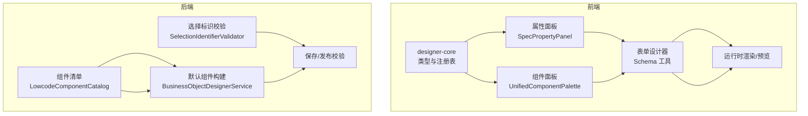
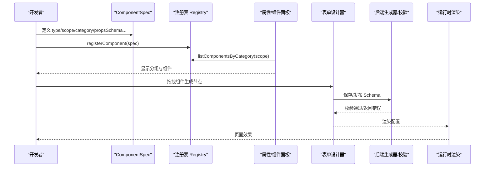
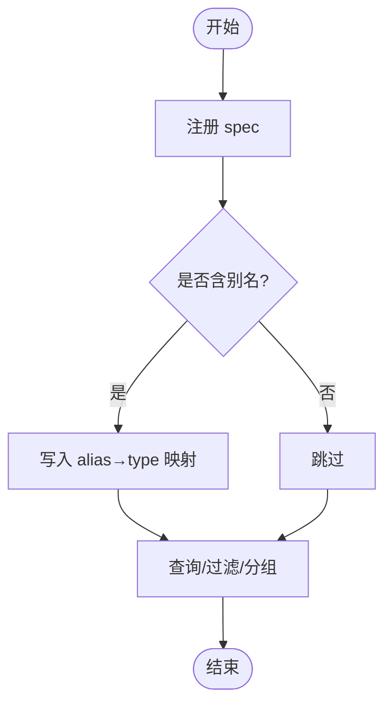
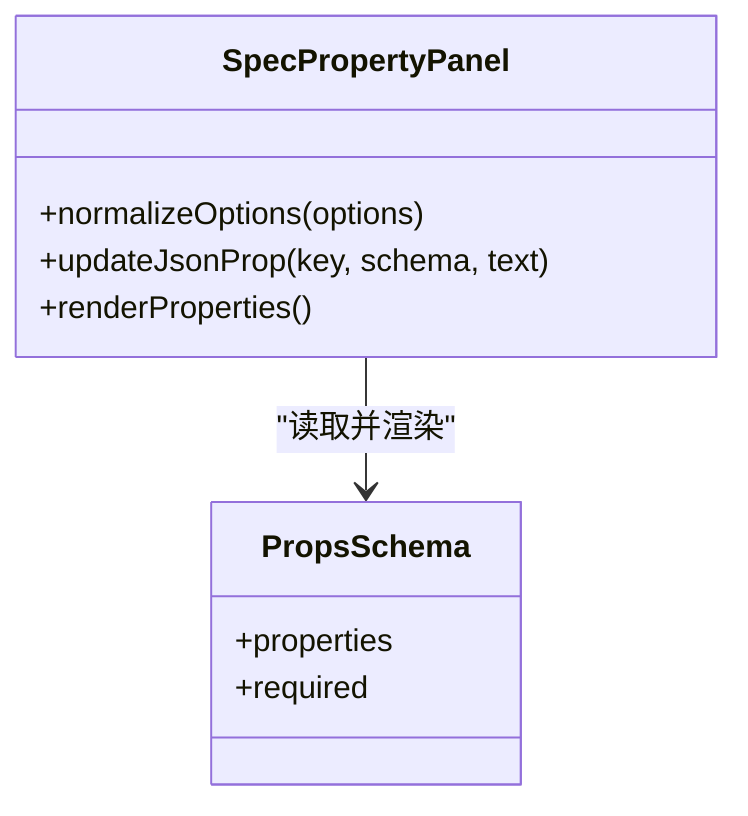
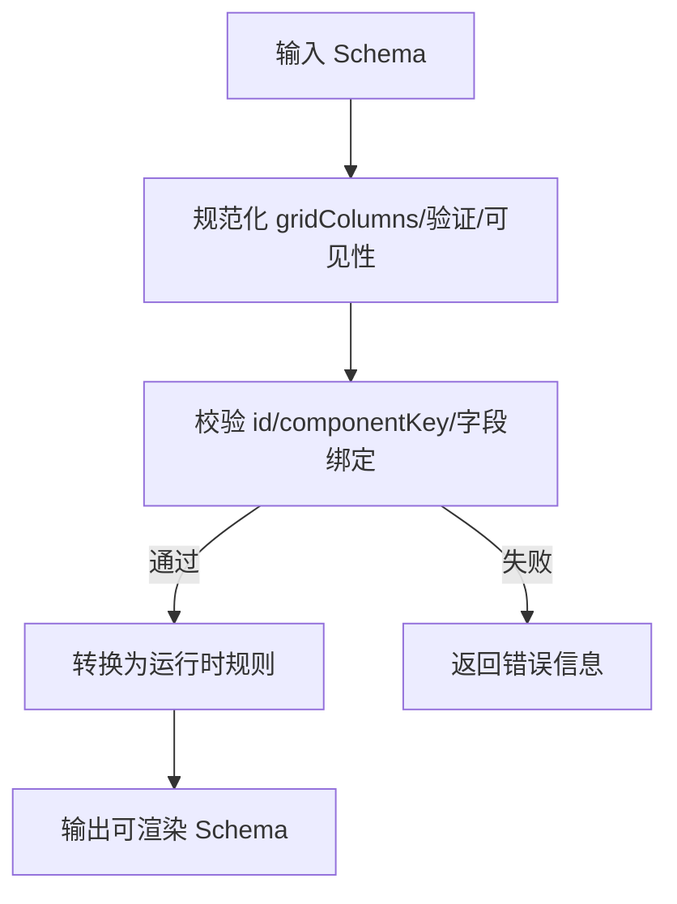
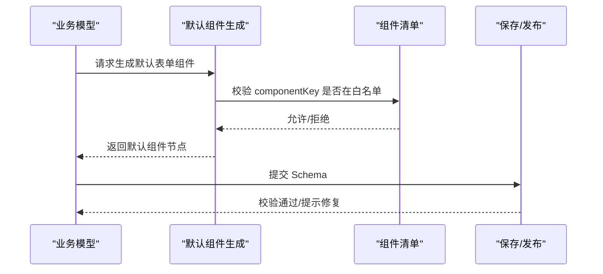
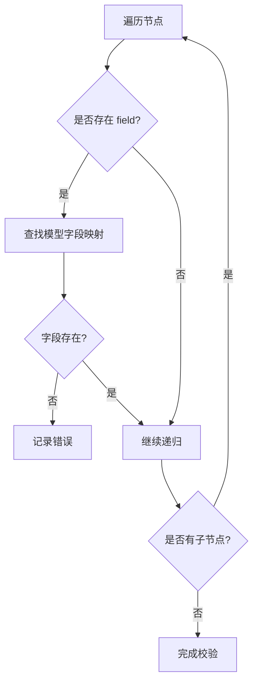
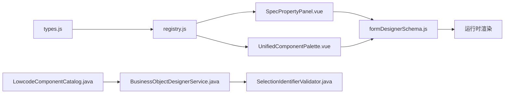

# 自定义组件开发

<cite>
**本文引用的文件**
- [README.md](file://README.md)
- [Forge Admin前端开发与组件规范.md](file://forge-admin-ui/Forge%20Admin前端开发与组件规范.md)
- [types.js](file://forge-admin-ui/src/components/lowcode-builder/designer-core/spec/types.js)
- [registry.js](file://forge-admin-ui/src/components/lowcode-builder/designer-core/spec/registry.js)
- [business-components.js](file://forge-admin-ui/src/components/lowcode-builder/designer-core/spec/business-components.js)
- [field-components.js](file://forge-admin-ui/src/components/lowcode-builder/designer-core/spec/field-components.js)
- [layout-components.js](file://forge-admin-ui/src/components/lowcode-builder/designer-core/spec/layout-components.js)
- [media-components.js](file://forge-admin-ui/src/components/lowcode-builder/designer-core/spec/media-components.js)
- [page-components.js](file://forge-admin-ui/src/components/lowcode-builder/designer-core/spec/page-components.js)
- [widget-components.js](file://forge-admin-ui/src/components/lowcode-builder/designer-core/spec/widget-components.js)
- [SpecPropertyPanel.vue](file://forge-admin-ui/src/components/lowcode-builder/designer-core/panel/SpecPropertyPanel.vue)
- [UnifiedComponentPalette.vue](file://forge-admin-ui/src/components/lowcode-builder/designer-core/panel/UnifiedComponentPalette.vue)
- [LowcodeComponentCatalog.java](file://forge-server/forge-framework/forge-plugin-parent/forge-plugin-generator/src/main/java/com/mdframe/forge/plugin/generator/service/lowcode/LowcodeComponentCatalog.java)
- [BusinessObjectDesignerService.java](file://forge-server/forge-framework/forge-plugin-parent/forge-plugin-generator/src/main/java/com/mdframe/forge/plugin/generator/service/businessapp/BusinessObjectDesignerService.java)
- [SelectionIdentifierValidator.java](file://forge-server/forge-framework/forge-plugin-parent/forge-plugin-generator/src/main/java/com/mdframe/forge/plugin/generator/service/SelectionIdentifierValidator.java)
- [theme.config.js](file://forge-admin-ui/src/config/theme.config.js)
- [vite.config.js](file://forge-admin-ui/vite.config.js)
- [package.json](file://forge-admin-ui/package.json)
- [vitest.config.js](file://forge-admin-ui/vitest.config.js)
- [aliases.test.js](file://forge-admin-ui/src/components/lowcode-builder/designer-core/__tests__/aliases.test.js)
- [bridge.test.js](file://forge-admin-ui/src/components/lowcode-builder/designer-core/__tests__/bridge.test.js)
- [container-tree.test.js](file://forge-admin-ui/src/components/lowcode-builder/designer-core/__tests__/container-tree.test.js)
- [data-source.test.js](file://forge-admin-ui/src/components/lowcode-builder/designer-core/__tests__/data-source.test.js)
- [registry.test.js](file://forge-admin-ui/src/components/lowcode-builder/designer-core/__tests__/registry.test.js)
- [spec-consumption.test.js](file://forge-admin-ui/src/components/lowcode-builder/designer-core/__tests__/spec-consumption.test.js)
- [spec-property-panel.spec.js](file://forge-admin-ui/src/components/lowcode-builder/designer-core/__tests__/spec-property-panel.spec.js)
- [formDesignerSchema.js](file://forge-admin-ui/src/views/app-center/components/designer/form-first/formDesignerSchema.js)
- [forgeToFormCreate.js](file://forge-admin-ui/src/views/app-center/components/designer/form-first/forgeToFormCreate.js)
</cite>

## 目录
1. [简介](#简介)
2. [项目结构](#项目结构)
3. [核心组件](#核心组件)
4. [架构总览](#架构总览)
5. [详细组件分析](#详细组件分析)
6. [依赖关系分析](#依赖关系分析)
7. [性能与可维护性](#性能与可维护性)
8. [测试指南](#测试指南)
9. [打包发布与版本管理](#打包发布与版本管理)
10. [国际化与主题适配](#国际化与主题适配)
11. [调试技巧与常见问题](#调试技巧与常见问题)
12. [结论](#结论)

## 简介
本指南面向在 Forge Admin 低代码平台中开发“自定义组件”的工程师，围绕统一物料协议、组件注册、属性面板、数据源绑定、事件与校验、模板与样式、国际化与主题、测试、打包发布与社区分享等全链路能力进行系统化说明。文档以仓库中的设计器核心（designer-core）、表单/页面设计器、后端生成器与校验逻辑为依据，提供从协议到落地的完整路径。

## 项目结构
本项目采用前后端协同的低代码体系：
- 前端 designer-core 定义统一组件协议（ComponentSpec）与注册表，支撑表单、列表、页面等多类设计器。
- 表单/页面设计器消费协议，生成并编辑 Schema，驱动运行时渲染。
- 后端生成器负责默认组件构建、字段绑定、可见性规则与模型校验，保证设计期与运行期一致。

图表来源
- [types.js:100-119](file://forge-admin-ui/src/components/lowcode-builder/designer-core/spec/types.js#L100-L119)
- [registry.js:17-66](file://forge-admin-ui/src/components/lowcode-builder/designer-core/spec/registry.js#L17-L66)
- [SpecPropertyPanel.vue:65-109](file://forge-admin-ui/src/components/lowcode-builder/designer-core/panel/SpecPropertyPanel.vue#L65-L109)
- [LowcodeComponentCatalog.java:14-22](file://forge-server/forge-framework/forge-plugin-parent/forge-plugin-generator/src/main/java/com/mdframe/forge/plugin/generator/service/lowcode/LowcodeComponentCatalog.java#L14-L22)
- [BusinessObjectDesignerService.java:2231-2246](file://forge-server/forge-framework/forge-plugin-parent/forge-plugin-generator/src/main/java/com/mdframe/forge/plugin/generator/service/businessapp/BusinessObjectDesignerService.java#L2231-L2246)
- [SelectionIdentifierValidator.java:52-91](file://forge-server/forge-framework/forge-plugin-parent/forge-plugin-generator/src/main/java/com/mdframe/forge/plugin/generator/service/SelectionIdentifierValidator.java#L52-L91)

章节来源
- [README.md:241-259](file://README.md#L241-L259)
- [Forge Admin前端开发与组件规范.md:20-39](file://forge-admin-ui/Forge%20Admin前端开发与组件规范.md#L20-L39)

## 核心组件
- 统一组件规格（ComponentSpec）：定义 type、scope、category、group、label、desc、layout、container、maxDepth、accept、propsSchema、dataSources、print、fieldDefaults、meta 等元信息，是跨设计器共享的契约。
- 组件注册表（Registry）：集中管理 ComponentSpec，提供注册、别名解析、按 scope/category/group 查询、统计等 API。
- 属性面板（SpecPropertyPanel）：基于 propsSchema 动态渲染属性编辑器，支持 section、boolean、select、json、code 等类型。
- 组件面板（UnifiedComponentPalette）：按分组展示可用组件，供拖拽创建节点。
- 表单 Schema 工具：规范化、校验、复制、更新组件节点，保障 Schema 一致性。
- 后端组件清单与生成器：维护字段组件白名单，自动生成默认表单组件与绑定，并在保存/发布时做可见性与字段引用校验。

章节来源
- [types.js:100-119](file://forge-admin-ui/src/components/lowcode-builder/designer-core/spec/types.js#L100-L119)
- [registry.js:17-169](file://forge-admin-ui/src/components/lowcode-builder/designer-core/spec/registry.js#L17-L169)
- [SpecPropertyPanel.vue:65-109](file://forge-admin-ui/src/components/lowcode-builder/designer-core/panel/SpecPropertyPanel.vue#L65-L109)
- [formDesignerSchema.js:667-690](file://forge-admin-ui/src/views/app-center/components/designer/form-first/formDesignerSchema.js#L667-L690)
- [LowcodeComponentCatalog.java:14-22](file://forge-server/forge-framework/forge-plugin-parent/forge-plugin-generator/src/main/java/com/mdframe/forge/plugin/generator/service/lowcode/LowcodeComponentCatalog.java#L14-L22)
- [BusinessObjectDesignerService.java:2231-2246](file://forge-server/forge-framework/forge-plugin-parent/forge-plugin-generator/src/main/java/com/mdframe/forge/plugin/generator/service/businessapp/BusinessObjectDesignerService.java#L2231-L2246)

## 架构总览
下图展示了自定义组件从“协议声明 → 注册 → 设计器使用 → 生成 Schema → 后端校验 → 运行渲染”的全流程。

图表来源
- [types.js:100-119](file://forge-admin-ui/src/components/lowcode-builder/designer-core/spec/types.js#L100-L119)
- [registry.js:17-107](file://forge-admin-ui/src/components/lowcode-builder/designer-core/spec/registry.js#L17-L107)
- [formDesignerSchema.js:667-690](file://forge-admin-ui/src/views/app-center/components/designer/form-first/formDesignerSchema.js#L667-L690)
- [BusinessObjectDesignerService.java:2231-2246](file://forge-server/forge-framework/forge-plugin-parent/forge-plugin-generator/src/main/java/com/mdframe/forge/plugin/generator/service/businessapp/BusinessObjectDesignerService.java#L2231-L2246)

## 详细组件分析

### 组件协议与注册机制
- 协议要点
  - type 唯一标识；aliases 兼容旧名；scope 限定设计器范围；category/group 用于分类与分组。
  - layout 控制栅格布局；container/maxDepth/accept 描述容器约束。
  - propsSchema 声明属性面板；dataSources 声明支持的数据源类型；print 控制打印行为；fieldDefaults 为字段组件提供默认数据库/业务类型映射。
- 注册表能力
  - registerComponent/registerComponents 注册；getComponentSpec/resolveComponentType 解析；listComponents/listComponentsByCategory/groupComponents 查询；getRegistryStats 统计。
  - 别名映射确保历史组件平滑迁移。

图表来源
- [registry.js:17-66](file://forge-admin-ui/src/components/lowcode-builder/designer-core/spec/registry.js#L17-L66)
- [registry.js:85-125](file://forge-admin-ui/src/components/lowcode-builder/designer-core/spec/registry.js#L85-L125)

章节来源
- [types.js:100-119](file://forge-admin-ui/src/components/lowcode-builder/designer-core/spec/types.js#L100-L119)
- [registry.js:17-169](file://forge-admin-ui/src/components/lowcode-builder/designer-core/spec/registry.js#L17-L169)

### 属性面板与可视化配置
- 基于 propsSchema 动态渲染，支持 section 分组标题、boolean 开关、select 选项归一化、JSON/code 编辑器等。
- 选项归一化兼容对象数组与字符串数组两种声明方式，降低接入成本。

图表来源
- [SpecPropertyPanel.vue:65-109](file://forge-admin-ui/src/components/lowcode-builder/designer-core/panel/SpecPropertyPanel.vue#L65-L109)
- [types.js:31-53](file://forge-admin-ui/src/components/lowcode-builder/designer-core/spec/types.js#L31-L53)

章节来源
- [SpecPropertyPanel.vue:65-109](file://forge-admin-ui/src/components/lowcode-builder/designer-core/panel/SpecPropertyPanel.vue#L65-L109)
- [types.js:31-53](file://forge-admin-ui/src/components/lowcode-builder/designer-core/spec/types.js#L31-L53)

### 表单 Schema 处理与校验
- 规范化：统一 gridColumns、对齐、标签宽度、验证规则、可见性等。
- 校验：组件 id 唯一、componentKey 必填、字段组件必须绑定 fieldCode。
- 转换：将 Forge Schema 转换为 FormCreate 规则，提取字段引用、选项、校验规则等。

图表来源
- [formDesignerSchema.js:667-690](file://forge-admin-ui/src/views/app-center/components/designer/form-first/formDesignerSchema.js#L667-L690)
- [formDesignerSchema.js:1245-1291](file://forge-admin-ui/src/views/app-center/components/designer/form-first/formDesignerSchema.js#L1245-L1291)
- [forgeToFormCreate.js:43-65](file://forge-admin-ui/src/views/app-center/components/designer/form-first/forgeToFormCreate.js#L43-L65)

章节来源
- [formDesignerSchema.js:667-690](file://forge-admin-ui/src/views/app-center/components/designer/form-first/formDesignerSchema.js#L667-L690)
- [formDesignerSchema.js:1245-1291](file://forge-admin-ui/src/views/app-center/components/designer/form-first/formDesignerSchema.js#L1245-L1291)
- [forgeToFormCreate.js:43-65](file://forge-admin-ui/src/views/app-center/components/designer/form-first/forgeToFormCreate.js#L43-L65)

### 后端组件清单与默认组件生成
- 组件清单：维护字段组件 key 白名单，避免未知组件被丢弃。
- 默认组件构建：根据字段生成默认表单节点，包含 id、componentKey、label、fieldBinding 等。
- 可见性规则与清理：识别 runtimeRules，清理设计期临时字段。

图表来源
- [LowcodeComponentCatalog.java:14-22](file://forge-server/forge-framework/forge-plugin-parent/forge-plugin-generator/src/main/java/com/mdframe/forge/plugin/generator/service/lowcode/LowcodeComponentCatalog.java#L14-L22)
- [BusinessObjectDesignerService.java:2231-2246](file://forge-server/forge-framework/forge-plugin-parent/forge-plugin-generator/src/main/java/com/mdframe/forge/plugin/generator/service/businessapp/BusinessObjectDesignerService.java#L2231-L2246)
- [BusinessObjectDesignerService.java:2959-2991](file://forge-server/forge-framework/forge-plugin-parent/forge-plugin-generator/src/main/java/com/mdframe/forge/plugin/generator/service/businessapp/BusinessObjectDesignerService.java#L2959-L2991)

章节来源
- [LowcodeComponentCatalog.java:14-22](file://forge-server/forge-framework/forge-plugin-parent/forge-plugin-generator/src/main/java/com/mdframe/forge/plugin/generator/service/lowcode/LowcodeComponentCatalog.java#L14-L22)
- [BusinessObjectDesignerService.java:2231-2246](file://forge-server/forge-framework/forge-plugin-parent/forge-plugin-generator/src/main/java/com/mdframe/forge/plugin/generator/service/businessapp/BusinessObjectDesignerService.java#L2231-L2246)
- [BusinessObjectDesignerService.java:2959-2991](file://forge-server/forge-framework/forge-plugin-parent/forge-plugin-generator/src/main/java/com/mdframe/forge/plugin/generator/service/businessapp/BusinessObjectDesignerService.java#L2959-L2991)

### 选择标识与字段引用校验
- 遍历组件树收集 field 引用，与模型字段集合比对，确保字段绑定有效。
- 支持 children/items/components 多形态子节点结构。

图表来源
- [SelectionIdentifierValidator.java:52-91](file://forge-server/forge-framework/forge-plugin-parent/forge-plugin-generator/src/main/java/com/mdframe/forge/plugin/generator/service/SelectionIdentifierValidator.java#L52-L91)

章节来源
- [SelectionIdentifierValidator.java:52-91](file://forge-server/forge-framework/forge-plugin-parent/forge-plugin-generator/src/main/java/com/mdframe/forge/plugin/generator/service/SelectionIdentifierValidator.java#L52-L91)

### 组件分类与示例
- 字段组件：输入、选择、日期、上传、引用等。
- 布局组件：栅格、分区、容器等。
- 业务组件：表格、卡片、操作区等。
- 页面组件：页头、页脚、内容区等。
- 媒体组件：图片、视频、富文本等。
- 小组件：图标、装饰、数字翻牌等。

章节来源
- [field-components.js](file://forge-admin-ui/src/components/lowcode-builder/designer-core/spec/field-components.js)
- [layout-components.js](file://forge-admin-ui/src/components/lowcode-builder/designer-core/spec/layout-components.js)
- [business-components.js](file://forge-admin-ui/src/components/lowcode-builder/designer-core/spec/business-components.js)
- [page-components.js](file://forge-admin-ui/src/components/lowcode-builder/designer-core/spec/page-components.js)
- [media-components.js](file://forge-admin-ui/src/components/lowcode-builder/designer-core/spec/media-components.js)
- [widget-components.js](file://forge-admin-ui/src/components/lowcode-builder/designer-core/spec/widget-components.js)

## 依赖关系分析
- 前端依赖
  - designer-core 类型与注册表被属性面板、组件面板、表单设计器共同消费。
  - 表单设计器依赖 Schema 工具进行规范化与校验。
- 后端依赖
  - 生成器依赖组件清单与模型字段映射，确保默认组件合法。
  - 校验器依赖模型字段集合，保障字段引用正确。

图表来源
- [types.js:100-119](file://forge-admin-ui/src/components/lowcode-builder/designer-core/spec/types.js#L100-L119)
- [registry.js:17-169](file://forge-admin-ui/src/components/lowcode-builder/designer-core/spec/registry.js#L17-L169)
- [SpecPropertyPanel.vue:65-109](file://forge-admin-ui/src/components/lowcode-builder/designer-core/panel/SpecPropertyPanel.vue#L65-L109)
- [formDesignerSchema.js:667-690](file://forge-admin-ui/src/views/app-center/components/designer/form-first/formDesignerSchema.js#L667-L690)
- [LowcodeComponentCatalog.java:14-22](file://forge-server/forge-framework/forge-plugin-parent/forge-plugin-generator/src/main/java/com/mdframe/forge/plugin/generator/service/lowcode/LowcodeComponentCatalog.java#L14-L22)
- [BusinessObjectDesignerService.java:2231-2246](file://forge-server/forge-framework/forge-plugin-parent/forge-plugin-generator/src/main/java/com/mdframe/forge/plugin/generator/service/businessapp/BusinessObjectDesignerService.java#L2231-L2246)
- [SelectionIdentifierValidator.java:52-91](file://forge-server/forge-framework/forge-plugin-parent/forge-plugin-generator/src/main/java/com/mdframe/forge/plugin/generator/service/SelectionIdentifierValidator.java#L52-L91)

章节来源
- [registry.js:17-169](file://forge-admin-ui/src/components/lowcode-builder/designer-core/spec/registry.js#L17-L169)
- [formDesignerSchema.js:667-690](file://forge-admin-ui/src/views/app-center/components/designer/form-first/formDesignerSchema.js#L667-L690)
- [LowcodeComponentCatalog.java:14-22](file://forge-server/forge-framework/forge-plugin-parent/forge-plugin-generator/src/main/java/com/mdframe/forge/plugin/generator/service/lowcode/LowcodeComponentCatalog.java#L14-L22)

## 性能与可维护性
- 注册表查询复杂度：O(1) 获取单个 spec；列表过滤 O(n)。
- 属性面板渲染：基于 propsSchema 动态生成，减少样板代码，提升扩展性。
- Schema 规范化：集中处理 gridColumns、验证、可见性，降低分散逻辑带来的维护成本。
- 后端校验：保存/发布阶段集中校验，避免错误进入运行态。

[本节为通用指导，不直接分析具体文件]

## 测试指南
- 单测框架：Vitest 独立配置，jsdom 环境，仅启用 Vue 插件以提升启动速度。
- 覆盖范围：designer-core 的别名解析、桥接、容器树、数据源、注册表、规格消费、属性面板等。
- 建议实践
  - 为新增组件编写 spec 消费用例，验证 getComponentSpec、listComponentsByCategory 等行为。
  - 为属性面板新增编辑器类型补充单元测试，确保 JSON/code/select 等场景稳定。
  - 对 Schema 工具函数补充边界用例（空值、非法值、重复 id）。

章节来源
- [vitest.config.js:1-37](file://forge-admin-ui/vitest.config.js#L1-L37)
- [aliases.test.js](file://forge-admin-ui/src/components/lowcode-builder/designer-core/__tests__/aliases.test.js)
- [bridge.test.js](file://forge-admin-ui/src/components/lowcode-builder/designer-core/__tests__/bridge.test.js)
- [container-tree.test.js](file://forge-admin-ui/src/components/lowcode-builder/designer-core/__tests__/container-tree.test.js)
- [data-source.test.js](file://forge-admin-ui/src/components/lowcode-builder/designer-core/__tests__/data-source.test.js)
- [registry.test.js](file://forge-admin-ui/src/components/lowcode-builder/designer-core/__tests__/registry.test.js)
- [spec-consumption.test.js](file://forge-admin-ui/src/components/lowcode-builder/designer-core/__tests__/spec-consumption.test.js)
- [spec-property-panel.spec.js](file://forge-admin-ui/src/components/lowcode-builder/designer-core/__tests__/spec-property-panel.spec.js)

## 打包发布与版本管理
- 构建脚本：Vite 构建命令已配置，支持 dev/build/preview。
- 流水线：仓库包含 PR/Branch/Master 流水线，执行编译、制品归档与发布。
- 建议
  - 新增组件后，运行 lint 与 build，确保无语法与构建错误。
  - 在 CI 中增加组件单测步骤，保障回归质量。
  - 发布产物纳入制品库，配合版本号策略进行回滚与灰度。

章节来源
- [package.json:6-18](file://forge-admin-ui/package.json#L6-L18)
- [.workflow/pr-pipeline.yml:1-36](file://forge-report-ui/.workflow/pr-pipeline.yml#L1-L36)
- [.workflow/branch-pipeline.yml:1-51](file://forge-report-ui/.workflow/branch-pipeline.yml#L1-L51)
- [.workflow/master-pipeline.yml:1-33](file://forge-report-ui/.workflow/master-pipeline.yml#L1-L33)

## 国际化与主题适配
- 主题变量：通过 CSS 变量注入主题色、字体大小、高度、边框颜色等，支持深浅主题切换。
- 建议
  - 组件样式优先使用语义化变量，避免硬编码颜色。
  - 文案国际化通过字典或 i18n 模块统一管理，不在组件内硬编码中文。
  - 新增主题项需同时考虑亮/暗模式下的可读性与对比度。

章节来源
- [theme.config.js:181-190](file://forge-admin-ui/src/config/theme.config.js#L181-L190)
- [Forge Admin前端开发与组件规范.md:121-129](file://forge-admin-ui/Forge%20Admin前端开发与组件规范.md#L121-L129)

## 调试技巧与常见问题
- 设计器调试
  - 打开浏览器控制台查看注册表统计与警告信息（重复注册、别名冲突）。
  - 使用属性面板的 JSON/code 编辑器快速定位配置问题。
- 表单 Schema 调试
  - 检查组件 id 是否重复、componentKey 是否为空、字段组件是否绑定 fieldCode。
  - 使用 Schema 工具函数逐步规范化并观察差异。
- 后端校验问题
  - 若保存/发布失败，检查字段引用是否与模型字段匹配。
  - 确认 runtimeRules 与可见性配置是否符合预期。
- 常见错误
  - 组件未注册或别名冲突：检查 registerComponent 调用与 aliases 设置。
  - 属性面板无法渲染：确认 propsSchema 结构与编辑器类型匹配。
  - 字段绑定无效：核对 fieldBinding.fieldCode 与模型字段一致。

章节来源
- [registry.js:17-66](file://forge-admin-ui/src/components/lowcode-builder/designer-core/spec/registry.js#L17-L66)
- [formDesignerSchema.js:667-690](file://forge-admin-ui/src/views/app-center/components/designer/form-first/formDesignerSchema.js#L667-L690)
- [SelectionIdentifierValidator.java:52-91](file://forge-server/forge-framework/forge-plugin-parent/forge-plugin-generator/src/main/java/com/mdframe/forge/plugin/generator/service/SelectionIdentifierValidator.java#L52-L91)

## 结论
Forge Admin 的低代码自定义组件体系以统一协议为核心，通过注册表、属性面板、Schema 工具与后端生成/校验形成闭环。遵循协议与规范，可以快速扩展新组件并安全地集成到表单、列表与页面设计器中。结合完善的测试、构建与发布流程，能够保障组件质量与可维护性，便于团队复用与社区分享。