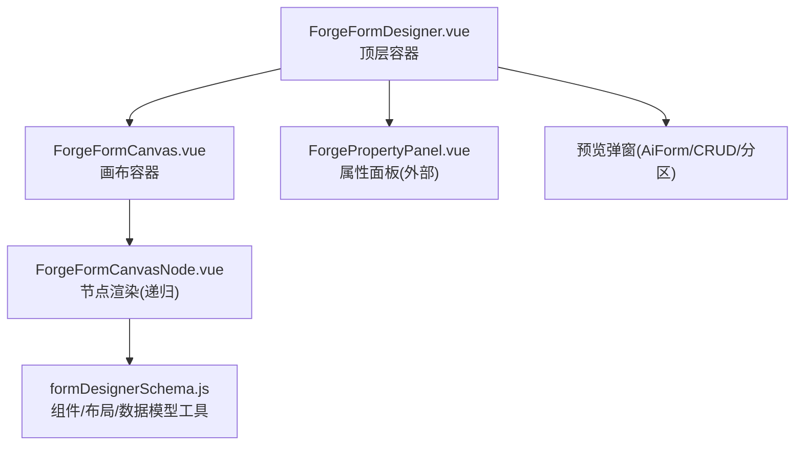
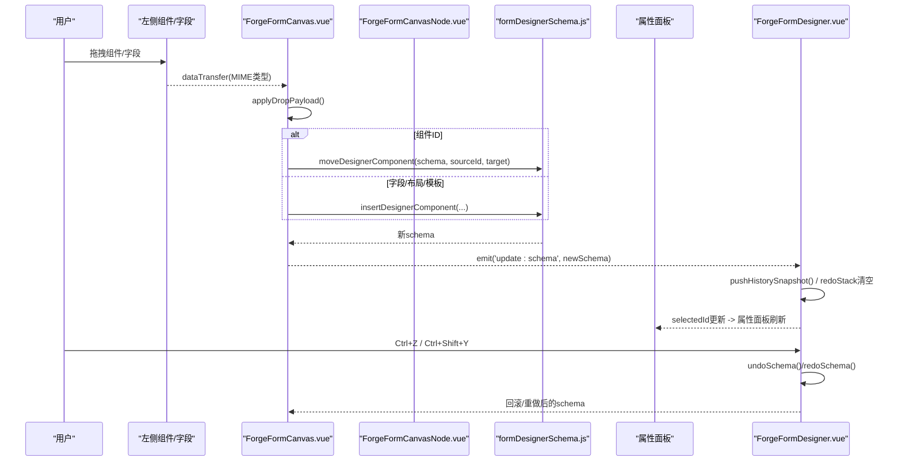
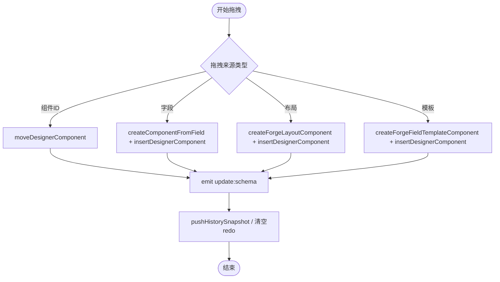
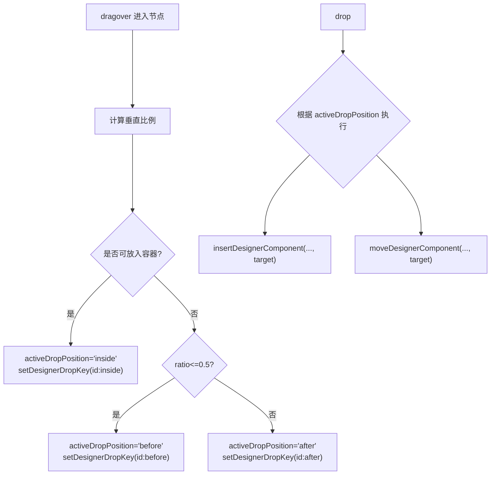
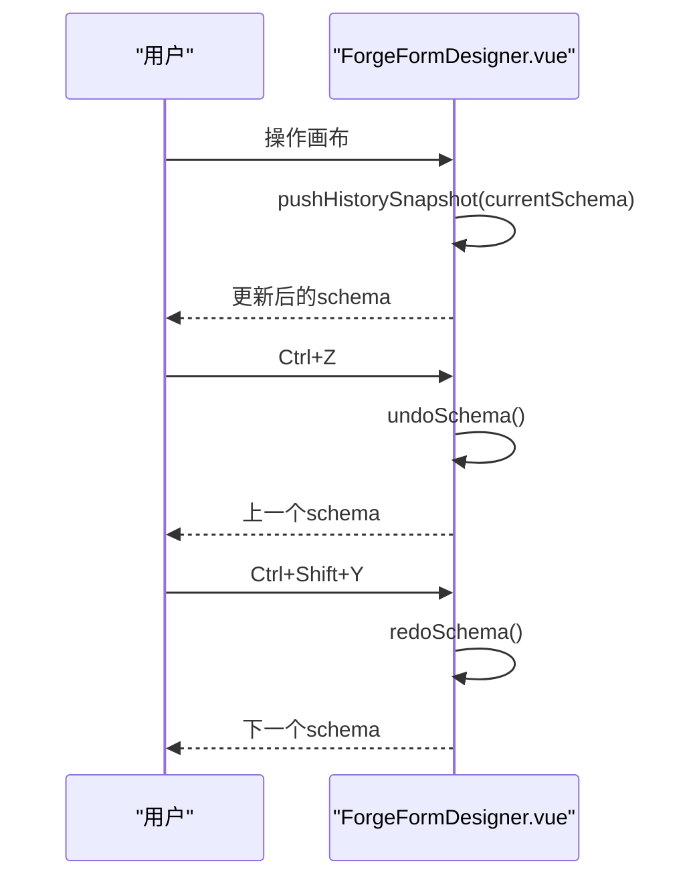
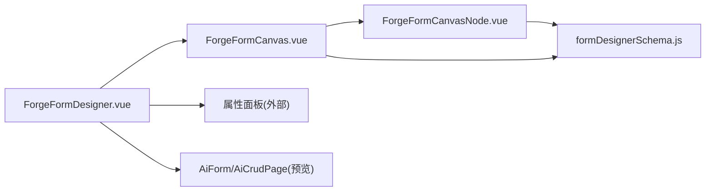

# 拖拽编辑器

<cite>
**本文引用的文件**
- [ForgeFormDesigner.vue](file://forge-admin-ui/src/views/app-center/components/designer/forge-form-designer/ForgeFormDesigner.vue)
- [ForgeFormCanvas.vue](file://forge-admin-ui/src/views/app-center/components/designer/forge-form-designer/ForgeFormCanvas.vue)
- [ForgeFormCanvasNode.vue](file://forge-admin-ui/src/views/app-center/components/designer/forge-form-designer/ForgeFormCanvasNode.vue)
- [formDesignerSchema.js](file://forge-admin-ui/src/views/app-center/components/designer/form-first/formDesignerSchema.js)
- [BusinessListDesigner.vue](file://forge-admin-ui/src/views/app-center/components/designer/BusinessListDesigner.vue)
</cite>

## 目录
1. [简介](#简介)
2. [项目结构](#项目结构)
3. [核心组件](#核心组件)
4. [架构总览](#架构总览)
5. [详细组件分析](#详细组件分析)
6. [依赖关系分析](#依赖关系分析)
7. [性能与移动端优化](#性能与移动端优化)
8. [故障排查指南](#故障排查指南)
9. [结论](#结论)
10. [附录：配置示例与自定义组件集成](#附录：配置示例与自定义组件集成)

## 简介
本技术文档围绕 Forge Admin 的表单拖拽编辑器，系统性说明可视化拖拽交互、组件放置逻辑、布局调整与实时预览的实现。重点覆盖：
- 拖拽事件处理与命中检测（dragover/drop、pointer 拖拽）
- 组件选择机制与属性面板联动
- 撤销/重做历史栈与快捷键
- 画布缩放、视口切换与响应式预览
- 性能优化策略与移动端适配建议
- 拖拽配置与自定义组件接入方式

## 项目结构
表单设计器由三个核心前端模块组成：
- 顶层容器：负责工具栏、视图切换、属性面板、预览弹窗与撤销/重做状态管理
- 画布容器：负责根级拖放区域、视口控制、网格列数与栅格样式
- 节点渲染：递归渲染每个组件节点，提供拖拽插入/移动、选中、快速操作、内部插槽放置等能力

图表来源
- [ForgeFormDesigner.vue:194-237](file://forge-admin-ui/src/views/app-center/components/designer/forge-form-designer/ForgeFormDesigner.vue#L194-L237)
- [ForgeFormCanvas.vue:1-206](file://forge-admin-ui/src/views/app-center/components/designer/forge-form-designer/ForgeFormCanvas.vue#L1-L206)
- [ForgeFormCanvasNode.vue:1-400](file://forge-admin-ui/src/views/app-center/components/designer/forge-form-designer/ForgeFormCanvasNode.vue#L1-L400)
- [formDesignerSchema.js:18-78](file://forge-admin-ui/src/views/app-center/components/designer/form-first/formDesignerSchema.js#L18-L78)

章节来源
- [ForgeFormDesigner.vue:1-237](file://forge-admin-ui/src/views/app-center/components/designer/forge-form-designer/ForgeFormDesigner.vue#L1-L237)
- [ForgeFormCanvas.vue:1-206](file://forge-admin-ui/src/views/app-center/components/designer/forge-form-designer/ForgeFormCanvas.vue#L1-L206)
- [ForgeFormCanvasNode.vue:1-400](file://forge-admin-ui/src/views/app-center/components/designer/forge-form-designer/ForgeFormCanvasNode.vue#L1-L400)

## 核心组件
- 顶层容器（ForgeFormDesigner.vue）
  - 维护 normalizedSchema、selectedId、撤销/重做栈、预览模式与页面分区协议
  - 暴露 updateSchema、undoSchema、redoSchema、appendField、resetFromFields 等方法
  - 通过事件将 schema 变更同步给父级，并触发 dirtyChange
- 画布容器（ForgeFormCanvas.vue）
  - 管理根级 drop zone、视口设备模式、缩放、网格列数与栅格样式
  - 解析拖拽载荷（组件/字段/布局/模板），调用 formDesignerSchema 中的插入/移动方法
- 节点渲染（ForgeFormCanvasNode.vue）
  - 递归渲染字段、布局容器、卡片、标签页、折叠面板、表格布局、CRUD 区块等
  - 实现 dragover/drop、pointer 拖拽、内部插槽命中、before/after/inside 三种落点
  - 提供快速操作（复制、删除、必填开关）、右键菜单、尺寸调整手柄

章节来源
- [ForgeFormDesigner.vue:596-729](file://forge-admin-ui/src/views/app-center/components/designer/forge-form-designer/ForgeFormDesigner.vue#L596-L729)
- [ForgeFormCanvas.vue:217-418](file://forge-admin-ui/src/views/app-center/components/designer/forge-form-designer/ForgeFormCanvas.vue#L217-L418)
- [ForgeFormCanvasNode.vue:440-748](file://forge-admin-ui/src/views/app-center/components/designer/forge-form-designer/ForgeFormCanvasNode.vue#L440-L748)

## 架构总览
下图展示了从“左侧组件库/字段”到“画布节点”的拖拽流程，以及“属性面板”与“撤销/重做”的联动关系。

图表来源
- [ForgeFormCanvas.vue:355-386](file://forge-admin-ui/src/views/app-center/components/designer/forge-form-designer/ForgeFormCanvas.vue#L355-L386)
- [ForgeFormDesigner.vue:663-729](file://forge-admin-ui/src/views/app-center/components/designer/forge-form-designer/ForgeFormDesigner.vue#L663-L729)
- [formDesignerSchema.js:837-891](file://forge-admin-ui/src/views/app-center/components/designer/form-first/formDesignerSchema.js#L837-L891)

## 详细组件分析

### 拖拽事件处理与命中检测
- 根级拖放
  - 画布容器监听 root drop zone 的 dragenter/dragover/drop，设置根级 drop key（root:before）以高亮插入位置
  - 根据 dataTransfer MIME 区分四种来源：组件、字段、布局、模板，分别调用 move/insert
- 节点级拖放
  - 节点在 dragover 中计算鼠标相对高度比例，判定 before/after/inside
  - 对 row/table/tabs/collapse 等容器，优先尝试落入子槽位（col/tableGrid/tabPane/collapseItem）
  - 使用全局 state 记录当前拖拽源与目标 dropKey，驱动 UI 高亮
- Pointer 拖拽（移动端友好）
  - 通过 pointerdown/pointermove/pointerup 实现更流畅的拖拽体验
  - 使用 setPointerCapture/releasePointerCapture 保证跨元素捕获
  - 动态创建跟随鼠标的克隆节点作为拖拽图像，避免原生拖拽阴影限制
  - 清理时移除事件监听、DOM 节点与全局状态

图表来源
- [ForgeFormCanvas.vue:355-386](file://forge-admin-ui/src/views/app-center/components/designer/forge-form-designer/ForgeFormCanvas.vue#L355-L386)
- [ForgeFormCanvasNode.vue:941-1015](file://forge-admin-ui/src/views/app-center/components/designer/forge-form-designer/ForgeFormCanvasNode.vue#L941-L1015)
- [ForgeFormCanvasNode.vue:756-823](file://forge-admin-ui/src/views/app-center/components/designer/forge-form-designer/ForgeFormCanvasNode.vue#L756-L823)

章节来源
- [ForgeFormCanvas.vue:323-418](file://forge-admin-ui/src/views/app-center/components/designer/forge-form-designer/ForgeFormCanvas.vue#L323-L418)
- [ForgeFormCanvasNode.vue:941-1015](file://forge-admin-ui/src/views/app-center/components/designer/forge-form-designer/ForgeFormCanvasNode.vue#L941-L1015)
- [ForgeFormCanvasNode.vue:756-823](file://forge-admin-ui/src/views/app-center/components/designer/forge-form-designer/ForgeFormCanvasNode.vue#L756-L823)

### 组件放置逻辑与布局调整
- 放置位置判定
  - before/after：基于节点高度比例（<=0.5 为 before，否则 after）
  - inside：针对 row/table/tabs/collapse 等容器，优先匹配子槽位；若不可入则提示错误
- 槽位解析
  - resolveContainerSlotTarget 根据事件目标与容器类型，返回 {parentId, index, dropKey}
  - 对于 row->col、table->tableGrid，支持精确插入到指定列/单元格
- 栅格与列数
  - 根节点 gridColumns 默认 2，范围 1-24；节点 span 受父级 col 或根列数约束
  - 画布容器根据 layout.gridColumns 生成 CSS Grid 样式，确保设计与预览一致

图表来源
- [ForgeFormCanvasNode.vue:941-1015](file://forge-admin-ui/src/views/app-center/components/designer/forge-form-designer/ForgeFormCanvasNode.vue#L941-L1015)
- [ForgeFormCanvasNode.vue:1194-1230](file://forge-admin-ui/src/views/app-center/components/designer/forge-form-designer/ForgeFormCanvasNode.vue#L1194-L1230)
- [ForgeFormCanvasNode.vue:1303-1305](file://forge-admin-ui/src/views/app-center/components/designer/forge-form-designer/ForgeFormCanvasNode.vue#L1303-L1305)

章节来源
- [ForgeFormCanvasNode.vue:941-1015](file://forge-admin-ui/src/views/app-center/components/designer/forge-form-designer/ForgeFormCanvasNode.vue#L941-L1015)
- [ForgeFormCanvasNode.vue:1194-1230](file://forge-admin-ui/src/views/app-center/components/designer/forge-form-designer/ForgeFormCanvasNode.vue#L1194-L1230)
- [ForgeFormCanvasNode.vue:1303-1305](file://forge-admin-ui/src/views/app-center/components/designer/forge-form-designer/ForgeFormCanvasNode.vue#L1303-L1305)

### 组件选择机制与属性面板联动
- 选择传播
  - 点击节点或聚焦节点时，向上冒泡 select 事件，统一更新 selectedId
  - 对于 tabPane 等结构性内容，选择其父容器（tabs）而非 pane 本身，避免属性面板显示不相关属性
- 属性面板
  - 顶层容器将 selectedId 传入属性面板，面板修改后通过 update:schema 回调写回
  - 属性面板变更会触发脏标记与历史记录写入

章节来源
- [ForgeFormCanvasNode.vue:533-537](file://forge-admin-ui/src/views/app-center/components/designer/forge-form-designer/ForgeFormCanvasNode.vue#L533-L537)
- [ForgeFormDesigner.vue:194-237](file://forge-admin-ui/src/views/app-center/components/designer/forge-form-designer/ForgeFormDesigner.vue#L194-L237)

### 撤销/重做功能
- 历史栈
  - 每次 schema 变更（非外部强制写入）都会 push 当前快照到 undo 栈，并清空 redo 栈
  - 最大历史长度限制为 50，防止内存膨胀
- 快捷键
  - Ctrl/Cmd + Z 撤销，Ctrl/Cmd + Shift + Y 或 Ctrl/Cmd + Y 重做
  - 忽略输入框、文本编辑区内的快捷键冲突
- 实现要点
  - 使用 JSON.parse(JSON.stringify(...)) 深拷贝快照
  - 撤销/重做时先保存当前态到另一侧栈，再切换到目标态，最后 emit 更新

图表来源
- [ForgeFormDesigner.vue:663-729](file://forge-admin-ui/src/views/app-center/components/designer/forge-form-designer/ForgeFormDesigner.vue#L663-L729)
- [BusinessListDesigner.vue:2044-2077](file://forge-admin-ui/src/views/app-center/components/designer/BusinessListDesigner.vue#L2044-L2077)

章节来源
- [ForgeFormDesigner.vue:663-729](file://forge-admin-ui/src/views/app-center/components/designer/forge-form-designer/ForgeFormDesigner.vue#L663-L729)
- [BusinessListDesigner.vue:2044-2077](file://forge-admin-ui/src/views/app-center/components/designer/BusinessListDesigner.vue#L2044-L2077)

### 实时预览与多视口
- 预览弹窗
  - 支持新增/编辑/详情三种运行态模拟，渲染 AiForm、卡片、标签页、折叠面板、CRUD 区块等
  - 预览列数与设计器画布同源，避免不一致
- 视口控制
  - 桌面/窄屏/弹窗/抽屉/移动五种预设，自动设置宽度与缩放
  - 支持手动缩放（Ctrl/⌘ + 滚轮），最小 67%，最大 125%
  - 设计宽度可选 375-1920px，便于响应式调试

章节来源
- [ForgeFormDesigner.vue:254-402](file://forge-admin-ui/src/views/app-center/components/designer/forge-form-designer/ForgeFormDesigner.vue#L254-L402)
- [ForgeFormCanvas.vue:70-206](file://forge-admin-ui/src/views/app-center/components/designer/forge-form-designer/ForgeFormCanvas.vue#L70-L206)
- [ForgeFormCanvas.vue:293-321](file://forge-admin-ui/src/views/app-center/components/designer/forge-form-designer/ForgeFormCanvas.vue#L293-L321)

## 依赖关系分析
- 组件间耦合
  - ForgeFormDesigner 聚合 Canvas 与 PropertyPanel，并通过事件通信
  - Canvas 仅依赖 formDesignerSchema 的数据操作函数，保持低耦合
  - CanvasNode 递归渲染，依赖 formDesignerSchema 的类型判断与工具函数
- 外部依赖
  - Naive UI 用于按钮、下拉、模态等基础控件
  - AI Form/AiCrudPage 用于运行时预览
- 潜在循环依赖
  - 无直接循环引用；CanvasNode 通过事件向上传播，避免反向依赖

图表来源
- [ForgeFormDesigner.vue:194-237](file://forge-admin-ui/src/views/app-center/components/designer/forge-form-designer/ForgeFormDesigner.vue#L194-L237)
- [ForgeFormCanvas.vue:212-215](file://forge-admin-ui/src/views/app-center/components/designer/forge-form-designer/ForgeFormCanvas.vue#L212-L215)
- [ForgeFormCanvasNode.vue:411-434](file://forge-admin-ui/src/views/app-center/components/designer/forge-form-designer/ForgeFormCanvasNode.vue#L411-L434)

章节来源
- [ForgeFormDesigner.vue:194-237](file://forge-admin-ui/src/views/app-center/components/designer/forge-form-designer/ForgeFormDesigner.vue#L194-L237)
- [ForgeFormCanvas.vue:212-215](file://forge-admin-ui/src/views/app-center/components/designer/forge-form-designer/ForgeFormCanvas.vue#L212-L215)
- [ForgeFormCanvasNode.vue:411-434](file://forge-admin-ui/src/views/app-center/components/designer/forge-form-designer/ForgeFormCanvasNode.vue#L411-L434)

## 性能与移动端优化
- 拖拽性能
  - 使用 pointer 事件替代传统 mouse 事件，减少事件抖动与兼容问题
  - 拖拽图像采用 cloneNode + fixed 定位，避免 DOM 重排影响主线程
  - 命中检测尽量复用 getBoundingClientRect，减少查询次数
- 渲染性能
  - 节点高度通过 ResizeObserver 同步，避免频繁计算
  - 栅格样式通过 computed 缓存，减少重复计算
- 移动端适配
  - pointer 拖拽天然支持触摸设备
  - 视口预设包含移动模式，便于在手机上调试布局
  - 建议在移动端禁用复杂拖拽动画，提升流畅度
- 用户体验优化建议
  - 拖拽失败时给出明确提示（如“不能拖入自身”“不能拖入子组件”）
  - 提供键盘导航（tabindex=0）与焦点可见性
  - 大表单场景下考虑虚拟滚动或分页加载预览数据

[本节为通用指导，无需具体文件来源]

## 故障排查指南
- 拖拽无效
  - 检查 dataTransfer.types 是否包含 forge 自定义 MIME
  - 确认 dragover 已 preventDefault，允许 drop
- 无法放入容器
  - 查看 canDropIntoCurrentNode/canPreviewDropIntoCurrentNode 的判断逻辑
  - 确认容器是否允许该组件类型（row 仅允许 col，table 仅允许 tableGrid）
- 撤销/重做不生效
  - 确认 updateSchema 未传入 recordHistory=false
  - 检查 undo/redo 栈是否为空
- 属性面板不更新
  - 确认 selectedId 是否正确传递
  - 检查属性面板是否触发了 update:schema 回调

章节来源
- [ForgeFormCanvas.vue:388-400](file://forge-admin-ui/src/views/app-center/components/designer/forge-form-designer/ForgeFormCanvas.vue#L388-L400)
- [ForgeFormCanvasNode.vue:941-998](file://forge-admin-ui/src/views/app-center/components/designer/forge-form-designer/ForgeFormCanvasNode.vue#L941-L998)
- [ForgeFormDesigner.vue:663-729](file://forge-admin-ui/src/views/app-center/components/designer/forge-form-designer/ForgeFormDesigner.vue#L663-L729)

## 结论
该表单拖拽编辑器通过清晰的三层架构（容器-画布-节点）实现了高内聚、低耦合的可视化设计体验。其核心优势包括：
- 完善的拖拽命中与落点判定，支持多种容器与槽位
- 统一的 schema 操作与撤销/重做机制，保障数据安全
- 丰富的预览与视口控制，满足多端调试需求
- 良好的可扩展性，便于接入自定义组件与业务规则

[本节为总结，无需具体文件来源]

## 附录：配置示例与自定义组件集成

### 拖拽配置要点
- MIME 类型定义
  - 组件：application/x-forge-form-component
  - 字段：application/x-forge-form-field
  - 布局：application/x-forge-form-layout
  - 模板：application/x-forge-form-template
- 放置目标
  - 根级：{ parentId: '', index }
  - 节点级：{ parentId, index }，结合 before/after/inside 语义
- 列数与跨度
  - 根 gridColumns 默认 2，范围 1-24
  - col 节点的 span 受父级列数限制

章节来源
- [ForgeFormCanvas.vue:237-241](file://forge-admin-ui/src/views/app-center/components/designer/forge-form-designer/ForgeFormCanvas.vue#L237-L241)
- [ForgeFormCanvas.vue:275-282](file://forge-admin-ui/src/views/app-center/components/designer/forge-form-designer/ForgeFormCanvas.vue#L275-L282)
- [ForgeFormCanvasNode.vue:539-552](file://forge-admin-ui/src/views/app-center/components/designer/forge-form-designer/ForgeFormCanvasNode.vue#L539-L552)

### 自定义组件集成指南
- 注册组件键
  - 在 formDesignerSchema.js 的 LAYOUT_COMPONENT_KEYS/VIRTUAL_COMPONENT_KEYS/FIELD_COMPONENT_KEYS 中添加组件键
- 提供默认标签与行为
  - 使用 normalizeDesignerComponentLabel/resolveDesignerComponentDefaultLabel 提供中文标签
- 支持拖拽放置
  - 在 CanvasNode 中识别组件键，渲染对应预览与插槽
  - 在 canAcceptDesignerChild 中声明允许的父子关系
- 属性面板支持
  - 在属性面板中为该组件键提供专属配置项，并通过 updateDesignerComponent 写回 schema

章节来源
- [formDesignerSchema.js:18-78](file://forge-admin-ui/src/views/app-center/components/designer/form-first/formDesignerSchema.js#L18-L78)
- [formDesignerSchema.js:742-752](file://forge-admin-ui/src/views/app-center/components/designer/form-first/formDesignerSchema.js#L742-L752)
- [ForgeFormCanvasNode.vue:500-518](file://forge-admin-ui/src/views/app-center/components/designer/forge-form-designer/ForgeFormCanvasNode.vue#L500-L518)