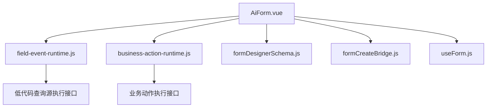
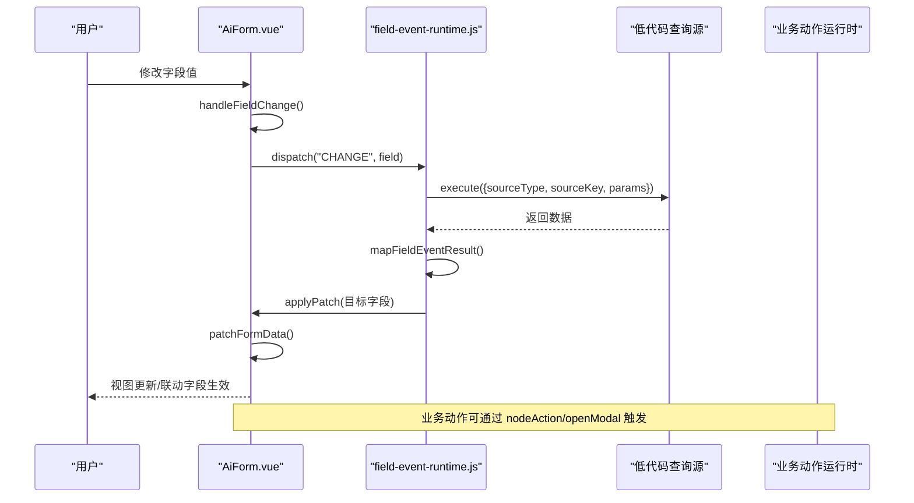
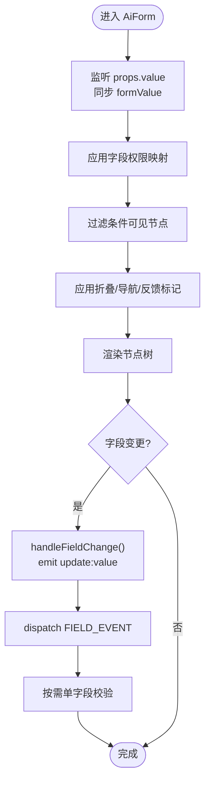
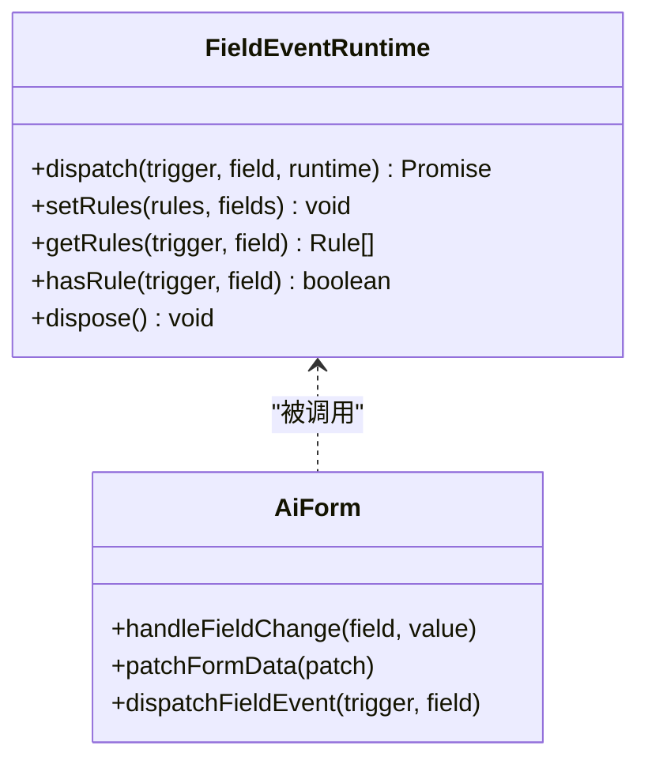
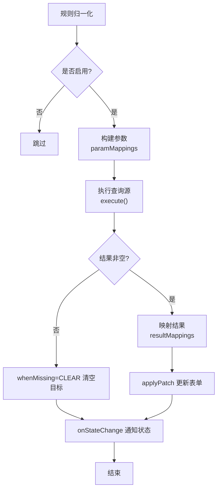
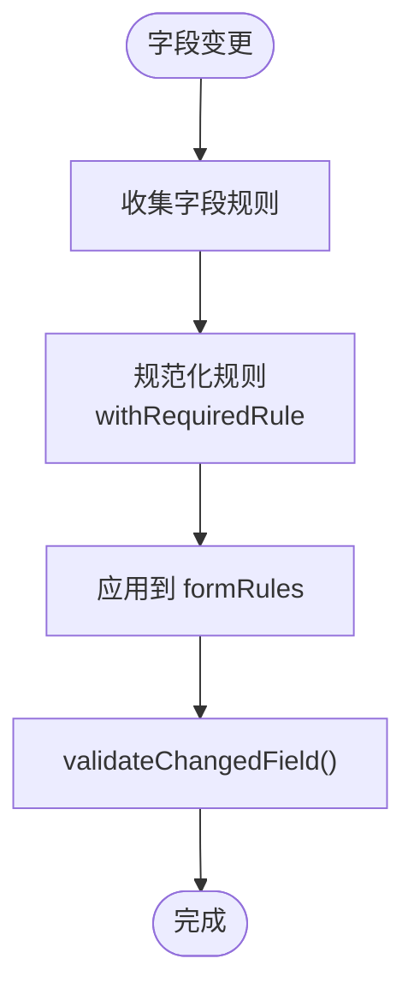
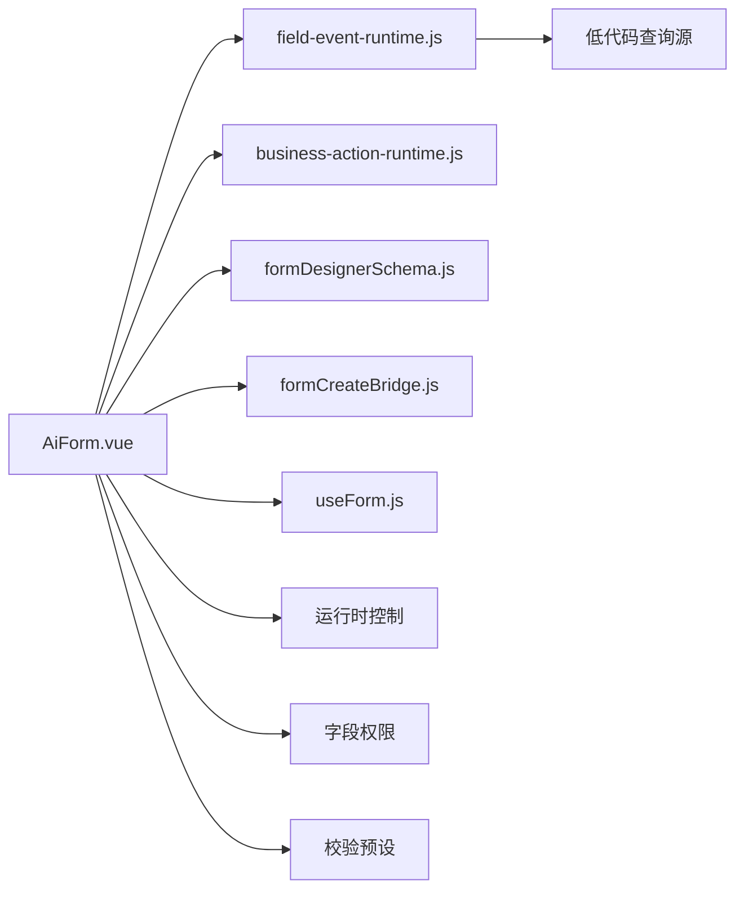

# 数据绑定引擎

<cite>
**本文引用的文件**
- [AiForm.vue](file://forge-admin-ui/src/components/ai-form/AiForm.vue)
- [field-event-runtime.js](file://forge-admin-ui/src/components/ai-form/field-event-runtime.js)
- [business-action-runtime.js](file://forge-admin-ui/src/components/ai-form/business-action-runtime.js)
- [formDesignerSchema.js](file://forge-admin-ui/src/views/app-center/components/designer/form-first/formDesignerSchema.js)
- [formCreateBridge.js](file://forge-admin-ui/src/components/form-create/formCreateBridge.js)
- [useForm.js](file://forge-admin-ui/src/composables/useForm.js)
</cite>

## 目录
1. [简介](#简介)
2. [项目结构](#项目结构)
3. [核心组件](#核心组件)
4. [架构总览](#架构总览)
5. [详细组件分析](#详细组件分析)
6. [依赖关系分析](#依赖关系分析)
7. [性能考量](#性能考量)
8. [故障排查指南](#故障排查指南)
9. [结论](#结论)
10. [附录](#附录)

## 简介
本技术文档围绕 Forge Admin 前端的数据绑定引擎，系统性说明双向数据绑定、动态字段渲染、条件显示与级联更新机制。文档覆盖数据源配置、字段映射、校验规则与执行时机，并给出复杂表单场景处理、性能优化与错误处理策略，同时提供数据绑定配置示例与调试工具使用指南，帮助开发者快速掌握并高效扩展表单能力。

## 项目结构
数据绑定引擎主要位于 ai-form 运行时与表单设计器 schema 层：
- AiForm.vue：表单运行时容器，负责 v-model 双向绑定、可见性过滤、校验规则生成、字段事件调度与弹窗表单集成。
- field-event-runtime.js：字段事件运行时，负责基于配置的参数映射、结果映射、防抖、取消、状态通知与级联更新。
- business-action-runtime.js：业务动作运行时，提供输入表单构建、幂等键、执行载荷构造与显示条件匹配。
- formDesignerSchema.js：表单设计器 Schema 规范化、多表单聚合、交互规则迁移与组件元信息处理。
- formCreateBridge.js：兼容 FormCreate 的适配器，用于历史规则归一化与默认选项构建。
- useForm.js：轻量组合式 Hook，封装基础表单 ref、模型与校验方法。

图表来源
- [AiForm.vue:148-560](file://forge-admin-ui/src/components/ai-form/AiForm.vue#L148-L560)
- [field-event-runtime.js:99-294](file://forge-admin-ui/src/components/ai-form/field-event-runtime.js#L99-L294)
- [business-action-runtime.js:115-154](file://forge-admin-ui/src/components/ai-form/business-action-runtime.js#L115-L154)
- [formDesignerSchema.js:367-655](file://forge-admin-ui/src/views/app-center/components/designer/form-first/formDesignerSchema.js#L367-L655)
- [formCreateBridge.js:41-80](file://forge-admin-ui/src/components/form-create/formCreateBridge.js#L41-L80)
- [useForm.js:1-18](file://forge-admin-ui/src/composables/useForm.js#L1-L18)

章节来源
- [AiForm.vue:148-560](file://forge-admin-ui/src/components/ai-form/AiForm.vue#L148-L560)
- [formDesignerSchema.js:367-655](file://forge-admin-ui/src/views/app-center/components/designer/form-first/formDesignerSchema.js#L367-L655)

## 核心组件
- 表单运行时容器（AiForm.vue）
  - 双向绑定：通过 v-model:value 与内部 formValue 响应式对象同步，变化时触发 update:value 事件。
  - 动态渲染：基于 visibleSchema 计算属性过滤权限与条件后渲染节点树。
  - 校验规则：按可见字段收集 rules，自动注入必填规则与类型特化校验。
  - 事件驱动：字段变更触发 CHANGE/BLUR/MANUAL 等事件，支持 FORM_LOAD 初始化加载。
  - 弹窗表单：支持 actionModal 内嵌子表单，复用同一渲染与事件体系。
- 字段事件运行时（field-event-runtime.js）
  - 参数映射：从表单字段、上下文路径、路由查询读取参数，安全路径校验。
  - 结果映射：将查询结果映射到目标字段，支持缺失值 CLEAR/KEEP 策略。
  - 执行控制：CHANGE 事件默认防抖；支持 AbortController 取消重复请求；序列号避免竞态。
  - 状态与通知：统一 onStateChange/onNotify 回调，便于 UI 展示加载与消息提示。
- 业务动作运行时（business-action-runtime.js）
  - 输入表单构建：根据 inputSchema 生成字段定义与默认值。
  - 幂等执行：生成稳定 idempotencyKey，避免重复提交。
  - 显示条件：解析结构化或文本表达式，支持 AND/OR、IN/NOT IN、比较操作符。
- 设计器 Schema（formDesignerSchema.js）
  - 单/多表单聚合：normalizeMultiFormDesignerSchema 合并默认表单与资源表单。
  - 交互规则迁移：将旧版 showHide/enableDisable 事件迁移为 runtimeRules。
  - 组件元信息：字段绑定、布局、验证、可见性等属性的规范化与校验。
- FormCreate 桥接（formCreateBridge.js）
  - 规则归一化：兼容历史规则字段名与类型别名，补齐默认 props 与校验。
  - 默认选项：统一 labelPosition、按钮显隐等默认行为。
- 表单组合式 Hook（useForm.js）
  - 提供 formRef、formModel、validation 与通用 required 规则模板。

章节来源
- [AiForm.vue:148-560](file://forge-admin-ui/src/components/ai-form/AiForm.vue#L148-L560)
- [field-event-runtime.js:44-127](file://forge-admin-ui/src/components/ai-form/field-event-runtime.js#L44-L127)
- [business-action-runtime.js:26-154](file://forge-admin-ui/src/components/ai-form/business-action-runtime.js#L26-L154)
- [formDesignerSchema.js:367-655](file://forge-admin-ui/src/views/app-center/components/designer/form-first/formDesignerSchema.js#L367-L655)
- [formCreateBridge.js:53-249](file://forge-admin-ui/src/components/form-create/formCreateBridge.js#L53-L249)
- [useForm.js:1-18](file://forge-admin-ui/src/composables/useForm.js#L1-L18)

## 架构总览
数据绑定引擎以 AiForm 为核心，串联“Schema -> 运行时 -> 事件 -> 数据”的闭环：
- Schema 层：设计器产出标准化 schema，包含组件、布局、字段绑定、验证与可见性。
- 运行时层：AiForm 将 schema 转换为可见节点树，维护 formValue 与 rules，并暴露事件钩子。
- 事件层：field-event-runtime 根据 trigger/sourceField 匹配规则，组装参数调用查询源，映射结果回写表单。
- 数据层：通过 patchFormData 实现局部更新，保持响应式与最小重渲染。

图表来源
- [AiForm.vue:589-652](file://forge-admin-ui/src/components/ai-form/AiForm.vue#L589-L652)
- [field-event-runtime.js:123-227](file://forge-admin-ui/src/components/ai-form/field-event-runtime.js#L123-L227)
- [business-action-runtime.js:115-154](file://forge-admin-ui/src/components/ai-form/business-action-runtime.js#L115-L154)

## 详细组件分析

### 双向数据绑定与字段渲染
- 双向绑定
  - AiForm 维护 formValue 响应式对象，监听外部 value 变化进行深拷贝同步，并在字段变更时 emit update:value。
  - 支持 modal 模式下的会话就绪判断，避免未准备好时派发初始事件。
- 动态渲染
  - 通过 computed 链式计算：permissionAppliedSchema -> conditionVisibleSchema -> visibleSchema，逐步应用权限、条件与折叠逻辑。
  - 支持搜索表单折叠与导航，提升大表单体验。
- 字段上下文
  - itemContext 注入 record、formData、route、schema、formAssets 等，供字段回调与事件使用。

图表来源
- [AiForm.vue:298-335](file://forge-admin-ui/src/components/ai-form/AiForm.vue#L298-L335)
- [AiForm.vue:479-494](file://forge-admin-ui/src/components/ai-form/AiForm.vue#L479-L494)
- [AiForm.vue:589-612](file://forge-admin-ui/src/components/ai-form/AiForm.vue#L589-L612)

章节来源
- [AiForm.vue:298-335](file://forge-admin-ui/src/components/ai-form/AiForm.vue#L298-L335)
- [AiForm.vue:479-494](file://forge-admin-ui/src/components/ai-form/AiForm.vue#L479-L494)
- [AiForm.vue:589-612](file://forge-admin-ui/src/components/ai-form/AiForm.vue#L589-L612)

### 条件显示与级联更新机制
- 条件显示
  - 通过 resolveRuntimeControl 与 vIf 函数/布尔值控制节点可见性。
  - 支持页面分区导航与折叠，减少视觉噪音。
- 级联更新
  - 字段事件运行时根据 paramMappings 从 formData/context/routeQuery 读取参数，调用查询源后将 resultMappings 映射回表单字段。
  - 支持 whenMissing=CLEAR 清空目标字段，clearTargetsOnTrigger 在触发时先清空目标。
  - CHANGE 事件默认防抖，避免频繁触发导致的抖动与性能问题。

图表来源
- [field-event-runtime.js:99-294](file://forge-admin-ui/src/components/ai-form/field-event-runtime.js#L99-L294)
- [AiForm.vue:520-554](file://forge-admin-ui/src/components/ai-form/AiForm.vue#L520-L554)
- [AiForm.vue:650-696](file://forge-admin-ui/src/components/ai-form/AiForm.vue#L650-L696)

章节来源
- [field-event-runtime.js:44-127](file://forge-admin-ui/src/components/ai-form/field-event-runtime.js#L44-L127)
- [field-event-runtime.js:155-227](file://forge-admin-ui/src/components/ai-form/field-event-runtime.js#L155-L227)
- [AiForm.vue:303-329](file://forge-admin-ui/src/components/ai-form/AiForm.vue#L303-L329)

### 数据源配置、字段映射与执行时机
- 数据源配置
  - 字段事件规则需声明 sourceType（EXTERNAL_API/DATASET）、sourceKey、paramMappings、resultMappings、trigger、debounceMs 等。
  - 支持分页参数 pageNum/pageSize/maxRows，适配数据集查询。
- 字段映射
  - 参数映射：支持 FORM_FIELD、CONTEXT_PATH、ROUTE_QUERY 三种来源，严格的安全路径校验。
  - 结果映射：支持 from/to 路径映射与 whenMissing 策略（CLEAR/KEEP）。
- 执行时机
  - FORM_LOAD：表单挂载后首次派发，可预填充数据。
  - CHANGE/BLUR/MANUAL：字段变更、失焦或手动触发。
  - SCAN_COMPLETE：扫描完成后触发（如扫码输入）。
  - 防抖：CHANGE 默认防抖，避免高频输入导致过多请求。

图表来源
- [field-event-runtime.js:44-97](file://forge-admin-ui/src/components/ai-form/field-event-runtime.js#L44-L97)
- [field-event-runtime.js:123-227](file://forge-admin-ui/src/components/ai-form/field-event-runtime.js#L123-L227)

章节来源
- [field-event-runtime.js:306-362](file://forge-admin-ui/src/components/ai-form/field-event-runtime.js#L306-L362)
- [field-event-runtime.js:374-421](file://forge-admin-ui/src/components/ai-form/field-event-runtime.js#L374-L421)
- [AiForm.vue:520-554](file://forge-admin-ui/src/components/ai-form/AiForm.vue#L520-L554)

### 校验规则与执行时机
- 规则来源
  - 字段 rules、props.validation、required/requiredMessage 等。
  - 自动注入必填规则，针对数字/日期/选择类类型采用自定义 validator，避免误判有效值为空。
- 执行时机
  - 字段变更时触发单字段重验，仅用于同步清理或刷新提示，不阻断用户继续填写。
  - 表单整体校验由上层调用 formRef.validate()。

图表来源
- [AiForm.vue:348-416](file://forge-admin-ui/src/components/ai-form/AiForm.vue#L348-L416)
- [AiForm.vue:672-682](file://forge-admin-ui/src/components/ai-form/AiForm.vue#L672-L682)

章节来源
- [AiForm.vue:348-416](file://forge-admin-ui/src/components/ai-form/AiForm.vue#L348-L416)
- [AiForm.vue:672-682](file://forge-admin-ui/src/components/ai-form/AiForm.vue#L672-L682)

### 复杂表单场景处理
- 多表单聚合：normalizeMultiFormDesignerSchema 支持默认表单与多个资源表单合并，保存时输出统一结构。
- 交互规则迁移：将旧版 showHide/enableDisable 事件迁移为 runtimeRules，保证预览、发布与下载一致。
- 弹窗表单：actionModal 支持嵌套子表单，复用渲染与事件体系，支持独立布局与上下文。
- 业务动作：构建输入表单、默认值、幂等键与执行载荷，支持流程启动与显示条件控制。

章节来源
- [formDesignerSchema.js:579-655](file://forge-admin-ui/src/views/app-center/components/designer/form-first/formDesignerSchema.js#L579-L655)
- [formDesignerSchema.js:472-539](file://forge-admin-ui/src/views/app-center/components/designer/form-first/formDesignerSchema.js#L472-L539)
- [AiForm.vue:698-732](file://forge-admin-ui/src/components/ai-form/AiForm.vue#L698-L732)
- [business-action-runtime.js:26-154](file://forge-admin-ui/src/components/ai-form/business-action-runtime.js#L26-L154)

### 性能优化与错误处理
- 性能优化
  - 字段事件 CHANGE 默认防抖，减少高频输入带来的请求压力。
  - 使用 AbortController 取消过期请求，避免无用更新。
  - 序列号机制确保最新请求结果优先覆盖，避免竞态。
  - 仅对可见字段生成校验规则，降低计算开销。
- 错误处理
  - 查询失败时设置状态为 error，并通过 onNotify 提示；支持 errorMode=SILENT 静默处理。
  - 未命中数据时可选清空目标字段，避免残留脏数据。
  - 表单单字段重验捕获异常，不阻断用户操作。

章节来源
- [field-event-runtime.js:123-227](file://forge-admin-ui/src/components/ai-form/field-event-runtime.js#L123-L227)
- [field-event-runtime.js:229-243](file://forge-admin-ui/src/components/ai-form/field-event-runtime.js#L229-L243)
- [AiForm.vue:672-682](file://forge-admin-ui/src/components/ai-form/AiForm.vue#L672-L682)

## 依赖关系分析
- AiForm.vue 依赖：
  - field-event-runtime.js：字段事件调度与数据级联。
  - business-action-runtime.js：业务动作输入表单与执行载荷。
  - formDesignerSchema.js：Schema 规范化与多表单聚合。
  - formCreateBridge.js：兼容历史规则与默认选项。
  - useForm.js：基础表单组合式封装。
- 外部依赖：
  - 低代码查询源执行接口：executeLowcodeQuerySource。
  - 运行时控制：resolveRuntimeControl。
  - 协作代码扫描：scanCollaborationCode。
  - 字段权限：createFieldPermissionMap。
  - 校验预设：normalizeValidationRules。

图表来源
- [AiForm.vue:148-160](file://forge-admin-ui/src/components/ai-form/AiForm.vue#L148-L160)
- [field-event-runtime.js:99-127](file://forge-admin-ui/src/components/ai-form/field-event-runtime.js#L99-L127)
- [business-action-runtime.js:115-154](file://forge-admin-ui/src/components/ai-form/business-action-runtime.js#L115-L154)
- [formDesignerSchema.js:367-655](file://forge-admin-ui/src/views/app-center/components/designer/form-first/formDesignerSchema.js#L367-L655)
- [formCreateBridge.js:41-80](file://forge-admin-ui/src/components/form-create/formCreateBridge.js#L41-L80)
- [useForm.js:1-18](file://forge-admin-ui/src/composables/useForm.js#L1-L18)

章节来源
- [AiForm.vue:148-160](file://forge-admin-ui/src/components/ai-form/AiForm.vue#L148-L160)
- [field-event-runtime.js:99-127](file://forge-admin-ui/src/components/ai-form/field-event-runtime.js#L99-L127)

## 性能考量
- 事件防抖：CHANGE 事件默认防抖，避免频繁触发。
- 请求取消：AbortController 取消过期请求，减少无效更新。
- 规则计算：仅对可见字段生成校验规则，降低计算量。
- 最小更新：patchFormData 局部更新，避免整表重渲染。
- 资源复用：多表单聚合与资产复用，减少重复构建。

[本节为通用指导，无需特定文件引用]

## 故障排查指南
- 字段事件未触发
  - 检查规则是否 enabled、trigger 是否正确、sourceField 是否存在于已知字段集合。
  - 确认 debounceMs 是否过大导致延迟感知不足。
- 级联更新未生效
  - 检查 paramMappings 与 resultMappings 的路径是否安全且存在。
  - 当 missing 策略为 CLEAR 时，确认目标字段是否被清空而非保留。
- 校验误报
  - 数字/日期/选择类类型已内置自定义 validator，若仍误报，检查字段 type 与 rules 配置。
- 弹窗表单异常
  - 确认 actionModalSchema 构建正确，组件 key 与类型映射无误。
- 性能问题
  - 增加 debounceMs、减少不必要的事件规则、避免深层嵌套的大表单。

章节来源
- [field-event-runtime.js:306-362](file://forge-admin-ui/src/components/ai-form/field-event-runtime.js#L306-L362)
- [field-event-runtime.js:374-421](file://forge-admin-ui/src/components/ai-form/field-event-runtime.js#L374-L421)
- [AiForm.vue:348-416](file://forge-admin-ui/src/components/ai-form/AiForm.vue#L348-L416)
- [AiForm.vue:698-732](file://forge-admin-ui/src/components/ai-form/AiForm.vue#L698-L732)

## 结论
Forge Admin 的数据绑定引擎以 AiForm 为核心，结合字段事件运行时与设计器 Schema，实现了强大的双向绑定、动态渲染、条件显示与级联更新能力。通过严格的参数与结果映射、防抖与取消机制、以及完善的校验与错误处理，能够支撑复杂表单场景的高可用与高性能需求。建议在实际项目中合理配置字段事件规则、利用多表单聚合与资产复用，并结合调试工具持续优化用户体验。

[本节为总结性内容，无需特定文件引用]

## 附录

### 数据绑定配置示例（概念性）
- 字段事件规则
  - trigger: "CHANGE" | "BLUR" | "MANUAL" | "FORM_LOAD" | "SCAN_COMPLETE"
  - sourceField: 触发字段
  - sourceType: "EXTERNAL_API" | "DATASET"
  - sourceKey: 数据源标识
  - paramMappings: [{ source: "FORM_FIELD"|"CONTEXT_PATH"|"ROUTE_QUERY", field/path, param }]
  - resultMappings: [{ from, to, whenMissing: "CLEAR"|"KEEP" }]
  - debounceMs: 防抖毫秒数（CHANGE 默认启用）
  - clearTargetsOnTrigger: 触发前清空目标字段
- 校验规则
  - rules: 数组或对象，支持 required、message、trigger、validator
  - validation: { required, requiredMessage }
  - 自动必填：针对数字/日期/选择类型采用自定义 validator
- 条件显示
  - vIf: 函数或布尔值
  - runtimeRules: 可视化配置的条件与效果

[本节为概念性说明，无需特定文件引用]

### 调试工具使用指南
- 字段事件状态
  - 监听 fieldEvent 事件，获取 ruleId、field、status、loading、message。
  - 通过 getFieldEventState 查询当前字段事件状态。
- 规则调试
  - 使用 getRules(trigger, field) 获取匹配规则，确认是否命中。
  - 检查 normalizeFieldEventRules 的合法性（id、trigger、sourceType、sourceKey、resultMappings 等）。
- 表单校验调试
  - 调用 formRef.validate() 进行整体校验。
  - 观察 validateChangedField 的单字段重验结果。
- 性能监控
  - 关注 CHANGE 事件的防抖效果与请求取消情况。
  - 评估大表单的可见节点数量与折叠策略。

章节来源
- [AiForm.vue:520-554](file://forge-admin-ui/src/components/ai-form/AiForm.vue#L520-L554)
- [AiForm.vue:650-696](file://forge-admin-ui/src/components/ai-form/AiForm.vue#L650-L696)
- [field-event-runtime.js:111-127](file://forge-admin-ui/src/components/ai-form/field-event-runtime.js#L111-L127)
- [field-event-runtime.js:229-243](file://forge-admin-ui/src/components/ai-form/field-event-runtime.js#L229-L243)