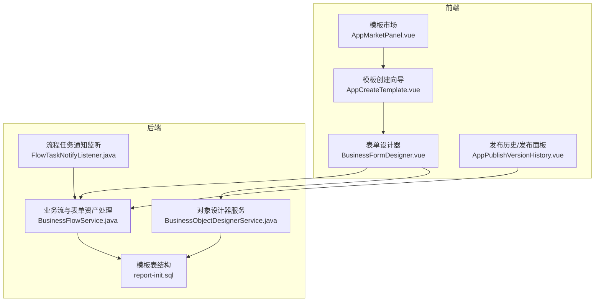
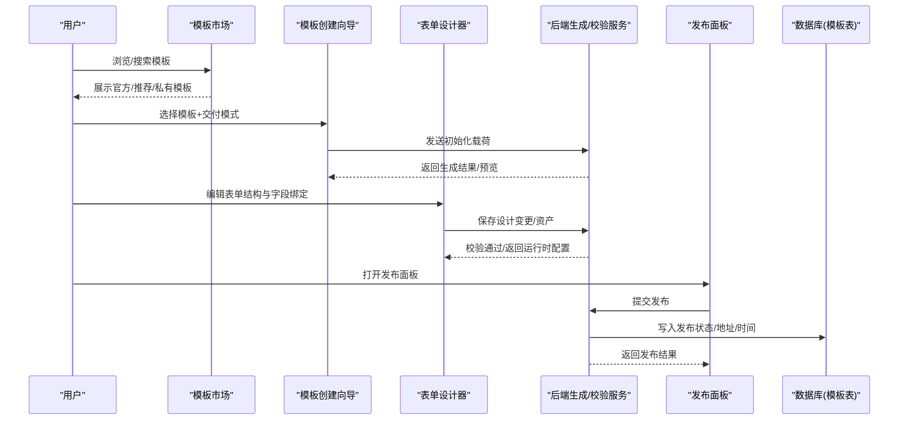
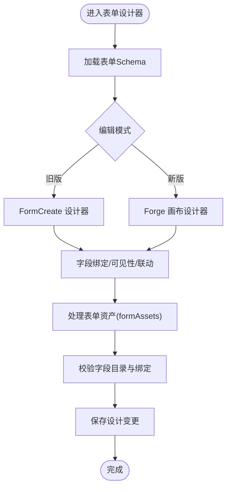
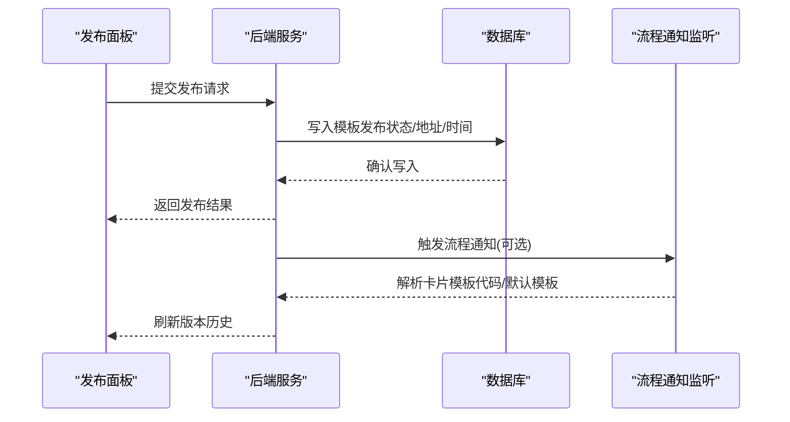
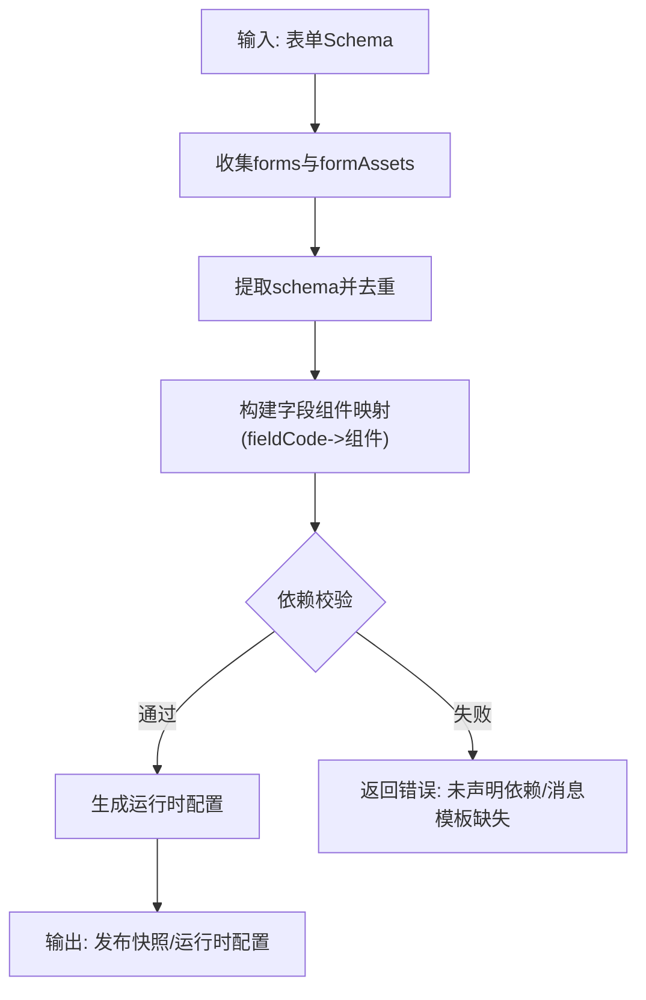
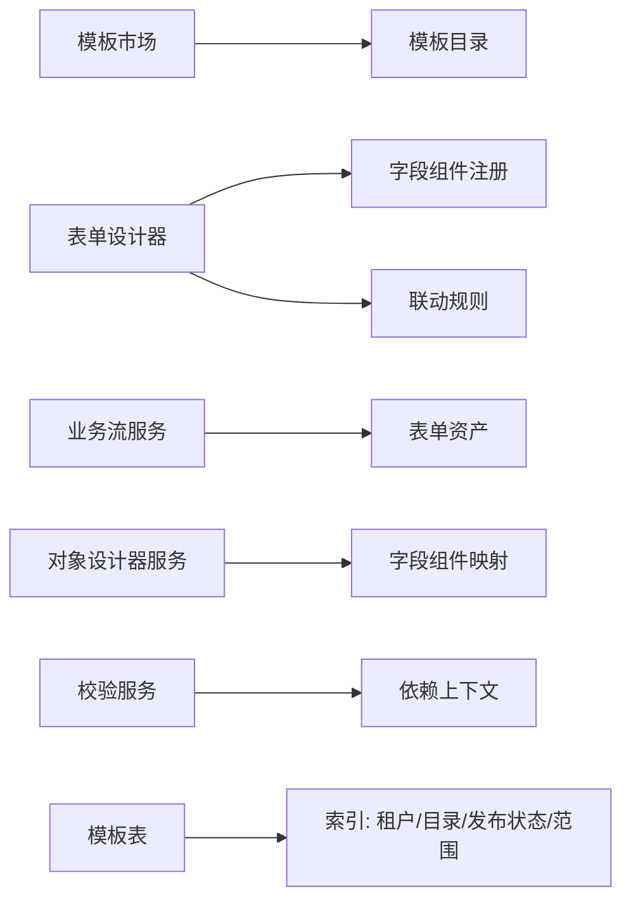

# 模板管理

<cite>
**本文引用的文件**
- [AppCreateTemplate.vue](file://forge-admin-ui/src/views/app-center/components/create/AppCreateTemplate.vue)
- [AppMarketPanel.vue](file://forge-admin-ui/src/views/app-center/components/AppMarketPanel.vue)
- [BusinessFormDesigner.vue](file://forge-admin-ui/src/views/app-center/components/designer/BusinessFormDesigner.vue)
- [AppPublishVersionHistory.vue](file://forge-admin-ui/src/views/app-center/components/publish/AppPublishVersionHistory.vue)
- [report-init.sql](file://forge-server/forge-report-server/sql/report-init.sql)
- [BusinessFlowService.java](file://forge-server/forge-framework/forge-plugin-parent/forge-plugin-generator/src/main/java/com/mdframe/forge/plugin/generator/service/businessapp/BusinessFlowService.java)
- [BusinessObjectDesignerService.java](file://forge-server/forge-framework/forge-plugin-parent/forge-plugin-generator/src/main/java/com/mdframe/forge/plugin/generator/service/businessapp/BusinessObjectDesignerService.java)
- [BusinessProcessSchemaValidator.java](file://forge-server/forge-framework/forge-plugin-parent/forge-plugin-generator/src/main/java/com/mdframe/forge/plugin/generator/businessprocess/validation/BusinessProcessSchemaValidator.java)
- [BusinessProcessValidationContextResolver.java](file://forge-server/forge-framework/forge-plugin-parent/forge-plugin-generator/src/main/java/com/mdframe/forge/plugin/generator/businessprocess/validation/BusinessProcessValidationContextResolver.java)
- [BusinessApplicationPageDependencyInspector.java](file://forge-server/forge-framework/forge-plugin-parent/forge-plugin-generator/src/main/java/com/mdframe/forge/plugin/generator/service/businessapp/BusinessApplicationPageDependencyInspector.java)
- [useCodeAppMetadata.js](file://forge-admin-ui/src/composables/useCodeAppMetadata.js)
- [forgeToFormCreate.js](file://forge-admin-ui/src/views/app-center/components/designer/form-first/forgeToFormCreate.js)
- [FlowTaskNotifyListener.java](file://forge-server/forge-framework/forge-plugin-parent/forge-plugin-flow/src/main/java/com/mdframe/forge/starter/flow/listener/FlowTaskNotifyListener.java)
</cite>

## 目录
1. [简介](#简介)
2. [项目结构](#项目结构)
3. [核心组件](#核心组件)
4. [架构总览](#架构总览)
5. [详细组件分析](#详细组件分析)
6. [依赖关系分析](#依赖关系分析)
7. [性能考量](#性能考量)
8. [故障排查指南](#故障排查指南)
9. [结论](#结论)
10. [附录](#附录)

## 简介
本技术文档围绕“表单模板管理”展开，覆盖模板创建、编辑、版本管理与发布流程；解释模板结构定义、元数据配置、依赖管理与权限控制；并给出模板市场、模板分享与复用策略，以及模板开发规范与最佳实践。内容基于仓库中的前端应用中心、设计器、发布面板与后端生成/校验服务进行系统化梳理，帮助读者快速理解从模板选择到运行态落地的完整链路。

## 项目结构
模板管理涉及前后端多模块协作：
- 前端应用中心提供模板市场与模板创建入口，支持在线启用与源码交付两种模式。
- 表单设计器负责模板的可视化编辑、字段绑定、联动规则与资产组织。
- 后端生成与校验服务负责模板结构解析、依赖检查、运行时编译与发布产物构建。
- 数据库层维护模板元数据（如范围、发布状态等），支撑模板检索与权限控制。

图表来源
- [AppMarketPanel.vue:1-120](file://forge-admin-ui/src/views/app-center/components/AppMarketPanel.vue#L1-L120)
- [AppCreateTemplate.vue:1-100](file://forge-admin-ui/src/views/app-center/components/create/AppCreateTemplate.vue#L1-L100)
- [BusinessFormDesigner.vue:1-130](file://forge-admin-ui/src/views/app-center/components/designer/BusinessFormDesigner.vue#L1-L130)
- [AppPublishVersionHistory.vue:1-36](file://forge-admin-ui/src/views/app-center/components/publish/AppPublishVersionHistory.vue#L1-L36)
- [BusinessFlowService.java:5382-5396](file://forge-server/forge-framework/forge-plugin-parent/forge-plugin-generator/src/main/java/com/mdframe/forge/plugin/generator/service/businessapp/BusinessFlowService.java#L5382-L5396)
- [BusinessObjectDesignerService.java:1115-1127](file://forge-server/forge-framework/forge-plugin-parent/forge-plugin-generator/src/main/java/com/mdframe/forge/plugin/generator/service/businessapp/BusinessObjectDesignerService.java#L1115-L1127)
- [FlowTaskNotifyListener.java:359-506](file://forge-server/forge-framework/forge-plugin-parent/forge-plugin-flow/src/main/java/com/mdframe/forge/starter/flow/listener/FlowTaskNotifyListener.java#L359-L506)
- [report-init.sql:157-175](file://forge-server/forge-report-server/sql/report-init.sql#L157-L175)

章节来源
- [AppMarketPanel.vue:1-120](file://forge-admin-ui/src/views/app-center/components/AppMarketPanel.vue#L1-L120)
- [AppCreateTemplate.vue:1-100](file://forge-admin-ui/src/views/app-center/components/create/AppCreateTemplate.vue#L1-L100)
- [BusinessFormDesigner.vue:1-130](file://forge-admin-ui/src/views/app-center/components/designer/BusinessFormDesigner.vue#L1-L130)
- [AppPublishVersionHistory.vue:1-36](file://forge-admin-ui/src/views/app-center/components/publish/AppPublishVersionHistory.vue#L1-L36)
- [BusinessFlowService.java:5382-5396](file://forge-server/forge-framework/forge-plugin-parent/forge-plugin-generator/src/main/java/com/mdframe/forge/plugin/generator/service/businessapp/BusinessFlowService.java#L5382-L5396)
- [BusinessObjectDesignerService.java:1115-1127](file://forge-server/forge-framework/forge-plugin-parent/forge-plugin-generator/src/main/java/com/mdframe/forge/plugin/generator/service/businessapp/BusinessObjectDesignerService.java#L1115-L1127)
- [FlowTaskNotifyListener.java:359-506](file://forge-server/forge-framework/forge-plugin-parent/forge-plugin-flow/src/main/java/com/mdframe/forge/starter/flow/listener/FlowTaskNotifyListener.java#L359-L506)
- [report-init.sql:157-175](file://forge-server/forge-report-server/sql/report-init.sql#L157-L175)

## 核心组件
- 模板市场：提供官方模板、推荐应用与组织私有模板的展示与筛选，支持按名称、分类或场景搜索，并支持“立即启用”和“生成源码”两种交付方式。
- 模板创建：在创建向导中确认模板、初始化参数与交付模式，输出标准化初始化载荷。
- 表单设计器：以画布形式编辑表单结构、字段绑定、联动规则、子表分区与详情设置，支持新旧两种设计器模式切换。
- 发布与版本：通过发布面板查看版本历史、执行发布操作，并将发布目标持久化至资源菜单。
- 后端生成与校验：解析表单资产、收集字段组件、校验依赖与消息模板、生成运行时配置与发布快照。

章节来源
- [AppMarketPanel.vue:1-120](file://forge-admin-ui/src/views/app-center/components/AppMarketPanel.vue#L1-L120)
- [AppCreateTemplate.vue:1-100](file://forge-admin-ui/src/views/app-center/components/create/AppCreateTemplate.vue#L1-L100)
- [BusinessFormDesigner.vue:1-130](file://forge-admin-ui/src/views/app-center/components/designer/BusinessFormDesigner.vue#L1-L130)
- [AppPublishVersionHistory.vue:1-36](file://forge-admin-ui/src/views/app-center/components/publish/AppPublishVersionHistory.vue#L1-L36)
- [BusinessFlowService.java:5382-5396](file://forge-server/forge-framework/forge-plugin-parent/forge-plugin-generator/src/main/java/com/mdframe/forge/plugin/generator/service/businessapp/BusinessFlowService.java#L5382-L5396)
- [BusinessObjectDesignerService.java:1115-1127](file://forge-server/forge-framework/forge-plugin-parent/forge-plugin-generator/src/main/java/com/mdframe/forge/plugin/generator/service/businessapp/BusinessObjectDesignerService.java#L1115-L1127)

## 架构总览
模板管理的端到端流程如下：
- 用户在模板市场选择模板并决定交付模式（在线应用/源码）。
- 创建向导组装初始化载荷并触发后端生成流程。
- 后端解析表单资产、校验依赖与消息模板，生成运行时配置与发布快照。
- 设计器对模板进行可视化编辑，更新字段绑定、联动规则与页面布局。
- 发布阶段将应用页发布模式持久化，并在需要时触发流程通知与卡片模板解析。

图表来源
- [AppMarketPanel.vue:1-120](file://forge-admin-ui/src/views/app-center/components/AppMarketPanel.vue#L1-L120)
- [AppCreateTemplate.vue:1-100](file://forge-admin-ui/src/views/app-center/components/create/AppCreateTemplate.vue#L1-L100)
- [BusinessFormDesigner.vue:1-130](file://forge-admin-ui/src/views/app-center/components/designer/BusinessFormDesigner.vue#L1-L130)
- [BusinessFlowService.java:5382-5396](file://forge-server/forge-framework/forge-plugin-parent/forge-plugin-generator/src/main/java/com/mdframe/forge/plugin/generator/service/businessapp/BusinessFlowService.java#L5382-L5396)
- [BusinessObjectDesignerService.java:1115-1127](file://forge-server/forge-framework/forge-plugin-parent/forge-plugin-generator/src/main/java/com/mdframe/forge/plugin/generator/service/businessapp/BusinessObjectDesignerService.java#L1115-L1127)
- [report-init.sql:157-175](file://forge-server/forge-report-server/sql/report-init.sql#L157-L175)

## 详细组件分析

### 模板市场与模板复用策略
- 模板市场提供三类视图：官方模板、组织私有模板、推荐应用。支持关键词搜索与分组切换。
- 模板复用策略：
  - 官方模板作为标准基线，便于快速启动。
  - 组织私有模板用于沉淀内部最佳实践，后续可接入持久化协议实现共享。
  - 推荐应用按使用次数排序，提升高价值模板曝光。
- 交付模式：
  - 在线启用：直接生成可运行的低代码应用。
  - 生成源码：先在线运行再打开统一代码预览与下载面板，确保源码与低代码协议一致。

章节来源
- [AppMarketPanel.vue:1-120](file://forge-admin-ui/src/views/app-center/components/AppMarketPanel.vue#L1-L120)
- [AppCreateTemplate.vue:1-100](file://forge-admin-ui/src/views/app-center/components/create/AppCreateTemplate.vue#L1-L100)

### 模板创建与初始化载荷
- 创建向导负责：
  - 模板选择与校验。
  - 根据模板生成初始化载荷（包含模板信息、初始化参数、交付模式）。
  - 提示源码交付流程的一致性保障。
- 关键交互：
  - 搜索过滤模板。
  - 选择交付模式（在线/源码）。
  - 导出载荷供上层调用。

章节来源
- [AppCreateTemplate.vue:1-100](file://forge-admin-ui/src/views/app-center/components/create/AppCreateTemplate.vue#L1-L100)

### 表单设计与模板结构定义
- 表单设计器支持：
  - 主对象与关联对象的表单编辑。
  - 字段绑定、可见性控制、联动规则与公式配置。
  - 子表分区与内嵌新增/编辑/详情展示。
  - 旧版 FormCreate 设计器与新版画布双模式切换。
- 模板结构要点：
  - 组件树：components 数组描述表单控件层级。
  - 表单集合：forms 数组支持多表单场景。
  - 资产：settings.formAssets 支持外部表单资产引用。
  - 字段目录：fieldCatalog 或 fields 用于声明字段清单。
  - 字段绑定：fieldBinding.mode 与 fieldCode 决定字段映射。
  - 可见性与权限：visibility.hidden、formVisible 控制显示与表单可见。
- 前端转换与提取：
  - 将设计器 Schema 转换为 FormCreate 规则与选项。
  - 提取公开字段列表，用于权限与渲染控制。

图表来源
- [BusinessFormDesigner.vue:1-130](file://forge-admin-ui/src/views/app-center/components/designer/BusinessFormDesigner.vue#L1-L130)
- [forgeToFormCreate.js:1-69](file://forge-admin-ui/src/views/app-center/components/designer/form-first/forgeToFormCreate.js#L1-L69)
- [useCodeAppMetadata.js:156-211](file://forge-admin-ui/src/composables/useCodeAppMetadata.js#L156-L211)

章节来源
- [BusinessFormDesigner.vue:1-130](file://forge-admin-ui/src/views/app-center/components/designer/BusinessFormDesigner.vue#L1-L130)
- [forgeToFormCreate.js:1-69](file://forge-admin-ui/src/views/app-center/components/designer/form-first/forgeToFormCreate.js#L1-L69)
- [useCodeAppMetadata.js:156-211](file://forge-admin-ui/src/composables/useCodeAppMetadata.js#L156-L211)

### 版本管理与发布流程
- 发布面板：
  - 提供准备发布、查看版本历史、执行发布等操作。
  - 发布目标按客户端类型持久化，并在发布时将菜单资源同步。
- 后端发布与通知：
  - 发布后可能触发流程任务通知，解析卡片模板代码与默认模板。
  - 发布快照用于锁定运行时对象配置，避免漂移。
- 数据库字段：
  - 模板表包含发布状态、模板范围（私有/公开）、发布地址、发布时间、复制次数等元数据。

图表来源
- [AppPublishVersionHistory.vue:1-36](file://forge-admin-ui/src/views/app-center/components/publish/AppPublishVersionHistory.vue#L1-L36)
- [FlowTaskNotifyListener.java:359-506](file://forge-server/forge-framework/forge-plugin-parent/forge-plugin-flow/src/main/java/com/mdframe/forge/starter/flow/listener/FlowTaskNotifyListener.java#L359-L506)
- [report-init.sql:157-175](file://forge-server/forge-report-server/sql/report-init.sql#L157-L175)

章节来源
- [AppPublishVersionHistory.vue:1-36](file://forge-admin-ui/src/views/app-center/components/publish/AppPublishVersionHistory.vue#L1-L36)
- [FlowTaskNotifyListener.java:359-506](file://forge-server/forge-framework/forge-plugin-parent/forge-plugin-flow/src/main/java/com/mdframe/forge/starter/flow/listener/FlowTaskNotifyListener.java#L359-L506)
- [report-init.sql:157-175](file://forge-server/forge-report-server/sql/report-init.sql#L157-L175)

### 模板结构解析与依赖管理
- 表单资产收集：
  - 遍历 forms 与 settings.formAssets，提取 schema 并去重，形成业务表单资产集合。
  - 针对运行时设计器资产，生成运行时配置。
- 字段组件映射：
  - 收集表单组件中的字段绑定，建立 fieldCode 到组件的映射。
  - 支持嵌套 forms 与资产中的组件收集。
- 依赖校验：
  - 校验未声明的表单资产依赖。
  - 校验消息模板依赖是否存在。
- 页面依赖检查：
  - 解析显式引用（objectId/objectCode）并匹配对象。
  - 读取 JSON 配置并容错处理异常。

图表来源
- [BusinessFlowService.java:5382-5396](file://forge-server/forge-framework/forge-plugin-parent/forge-plugin-generator/src/main/java/com/mdframe/forge/plugin/generator/service/businessapp/BusinessFlowService.java#L5382-L5396)
- [BusinessFlowService.java:5519-5527](file://forge-server/forge-framework/forge-plugin-parent/forge-plugin-generator/src/main/java/com/mdframe/forge/plugin/generator/service/businessapp/BusinessFlowService.java#L5519-L5527)
- [BusinessObjectDesignerService.java:1115-1127](file://forge-server/forge-framework/forge-plugin-parent/forge-plugin-generator/src/main/java/com/mdframe/forge/plugin/generator/service/businessapp/BusinessObjectDesignerService.java#L1115-L1127)
- [BusinessProcessSchemaValidator.java:683-683](file://forge-server/forge-framework/forge-plugin-parent/forge-plugin-generator/src/main/java/com/mdframe/forge/plugin/generator/businessprocess/validation/BusinessProcessSchemaValidator.java#L683-L683)
- [BusinessProcessValidationContextResolver.java:327-327](file://forge-server/forge-framework/forge-plugin-parent/forge-plugin-generator/src/main/java/com/mdframe/forge/plugin/generator/businessprocess/validation/BusinessProcessValidationContextResolver.java#L327-L327)
- [BusinessApplicationPageDependencyInspector.java:120-151](file://forge-server/forge-framework/forge-plugin-parent/forge-plugin-generator/src/main/java/com/mdframe/forge/plugin/generator/service/businessapp/BusinessApplicationPageDependencyInspector.java#L120-L151)

章节来源
- [BusinessFlowService.java:5382-5396](file://forge-server/forge-framework/forge-plugin-parent/forge-plugin-generator/src/main/java/com/mdframe/forge/plugin/generator/service/businessapp/BusinessFlowService.java#L5382-L5396)
- [BusinessFlowService.java:5519-5527](file://forge-server/forge-framework/forge-plugin-parent/forge-plugin-generator/src/main/java/com/mdframe/forge/plugin/generator/service/businessapp/BusinessFlowService.java#L5519-L5527)
- [BusinessObjectDesignerService.java:1115-1127](file://forge-server/forge-framework/forge-plugin-parent/forge-plugin-generator/src/main/java/com/mdframe/forge/plugin/generator/service/businessapp/BusinessObjectDesignerService.java#L1115-L1127)
- [BusinessProcessSchemaValidator.java:683-683](file://forge-server/forge-framework/forge-plugin-parent/forge-plugin-generator/src/main/java/com/mdframe/forge/plugin/generator/businessprocess/validation/BusinessProcessSchemaValidator.java#L683-L683)
- [BusinessProcessValidationContextResolver.java:327-327](file://forge-server/forge-framework/forge-plugin-parent/forge-plugin-generator/src/main/java/com/mdframe/forge/plugin/generator/businessprocess/validation/BusinessProcessValidationContextResolver.java#L327-L327)
- [BusinessApplicationPageDependencyInspector.java:120-151](file://forge-server/forge-framework/forge-plugin-parent/forge-plugin-generator/src/main/java/com/mdframe/forge/plugin/generator/service/businessapp/BusinessApplicationPageDependencyInspector.java#L120-L151)

### 权限控制与元数据配置
- 字段可见性与表单可见：
  - 通过 visibility.hidden 与 formVisible 控制字段与表单的可见性。
  - 公开字段用于权限与渲染过滤。
- 模板范围与发布状态：
  - 模板表记录 template_scope（私有/公开）与 publish_status（未发布/已发布）。
  - 发布地址与时间用于追踪发布生命周期。
- 依赖与策略：
  - 依赖校验确保模板资产与消息模板已声明。
  - 发布快照锁定运行时对象配置，保证一致性。

章节来源
- [useCodeAppMetadata.js:156-211](file://forge-admin-ui/src/composables/useCodeAppMetadata.js#L156-L211)
- [report-init.sql:157-175](file://forge-server/forge-report-server/sql/report-init.sql#L157-L175)
- [BusinessProcessSchemaValidator.java:683-683](file://forge-server/forge-framework/forge-plugin-parent/forge-plugin-generator/src/main/java/com/mdframe/forge/plugin/generator/businessprocess/validation/BusinessProcessSchemaValidator.java#L683-L683)

## 依赖关系分析
- 前端依赖：
  - 模板市场依赖模板目录与过滤逻辑。
  - 表单设计器依赖字段组件注册、联动规则与视图 Schema。
- 后端依赖：
  - 业务流服务依赖表单资产与字段目录。
  - 对象设计器服务依赖表单组件映射与治理设置。
  - 校验服务依赖依赖图与上下文解析。
- 数据库依赖：
  - 模板表索引包括租户、来源项目、目录、发布状态、范围与创建者。

图表来源
- [AppMarketPanel.vue:1-120](file://forge-admin-ui/src/views/app-center/components/AppMarketPanel.vue#L1-L120)
- [BusinessFormDesigner.vue:1-130](file://forge-admin-ui/src/views/app-center/components/designer/BusinessFormDesigner.vue#L1-L130)
- [BusinessFlowService.java:5382-5396](file://forge-server/forge-framework/forge-plugin-parent/forge-plugin-generator/src/main/java/com/mdframe/forge/plugin/generator/service/businessapp/BusinessFlowService.java#L5382-L5396)
- [BusinessObjectDesignerService.java:1115-1127](file://forge-server/forge-framework/forge-plugin-parent/forge-plugin-generator/src/main/java/com/mdframe/forge/plugin/generator/service/businessapp/BusinessObjectDesignerService.java#L1115-L1127)
- [report-init.sql:157-175](file://forge-server/forge-report-server/sql/report-init.sql#L157-L175)

章节来源
- [AppMarketPanel.vue:1-120](file://forge-admin-ui/src/views/app-center/components/AppMarketPanel.vue#L1-L120)
- [BusinessFormDesigner.vue:1-130](file://forge-admin-ui/src/views/app-center/components/designer/BusinessFormDesigner.vue#L1-L130)
- [BusinessFlowService.java:5382-5396](file://forge-server/forge-framework/forge-plugin-parent/forge-plugin-generator/src/main/java/com/mdframe/forge/plugin/generator/service/businessapp/BusinessFlowService.java#L5382-L5396)
- [BusinessObjectDesignerService.java:1115-1127](file://forge-server/forge-framework/forge-plugin-parent/forge-plugin-generator/src/main/java/com/mdframe/forge/plugin/generator/service/businessapp/BusinessObjectDesignerService.java#L1115-L1127)
- [report-init.sql:157-175](file://forge-server/forge-report-server/sql/report-init.sql#L157-L175)

## 性能考量
- 模板市场渲染：
  - 使用虚拟滚动或分页减少大量模板卡片的 DOM 压力。
  - 搜索与分组采用前端缓存与防抖优化。
- 表单设计器：
  - 大表单组件树建议懒加载与增量更新。
  - 联动规则计算应异步化并缓存中间结果。
- 后端生成与校验：
  - 表单资产收集与字段映射应避免重复遍历，使用 Map 去重。
  - 依赖校验批量处理，减少多次 I/O。
- 发布流程：
  - 发布快照与菜单同步应事务化，失败回滚。
  - 大对象发布考虑分片与异步任务。

[本节为通用性能建议，不直接分析具体文件]

## 故障排查指南
- 模板未找到或无效：
  - 检查模板目录是否包含所选模板键。
  - 确认创建向导的校验逻辑是否通过。
- 表单资产依赖缺失：
  - 查看校验服务返回的错误码，定位未声明的表单资产或消息模板。
  - 补充依赖或在模板中声明。
- 字段绑定异常：
  - 检查 fieldBinding.mode 与 fieldCode 是否正确。
  - 确认字段组件注册表中存在对应组件。
- 发布失败：
  - 检查模板表中的发布状态与范围。
  - 查看发布日志与数据库写入结果。

章节来源
- [AppCreateTemplate.vue:86-99](file://forge-admin-ui/src/views/app-center/components/create/AppCreateTemplate.vue#L86-L99)
- [BusinessProcessSchemaValidator.java:683-683](file://forge-server/forge-framework/forge-plugin-parent/forge-plugin-generator/src/main/java/com/mdframe/forge/plugin/generator/businessprocess/validation/BusinessProcessSchemaValidator.java#L683-L683)
- [BusinessProcessValidationContextResolver.java:327-327](file://forge-server/forge-framework/forge-plugin-parent/forge-plugin-generator/src/main/java/com/mdframe/forge/plugin/generator/businessprocess/validation/BusinessProcessValidationContextResolver.java#L327-L327)
- [report-init.sql:157-175](file://forge-server/forge-report-server/sql/report-init.sql#L157-L175)

## 结论
本仓库实现了完整的表单模板管理能力：从模板市场选择、创建向导初始化、表单设计器编辑，到后端生成校验与发布版本管理。模板结构以 Schema 为核心，结合字段绑定、联动规则与资产组织，形成可复用、可发布的低代码表单能力。通过依赖校验与权限控制，保障了模板的一致性与安全性。建议在团队内推广模板复用策略，沉淀官方与私有模板，提升交付效率与质量。

[本节为总结性内容，不直接分析具体文件]

## 附录
- 模板开发规范与最佳实践：
  - 明确模板边界与职责，避免过度耦合。
  - 使用标准化的字段命名与组件注册。
  - 在模板中声明所有依赖（表单资产、消息模板）。
  - 通过权限控制与可见性配置，确保数据安全。
  - 发布前进行依赖校验与回归测试。
  - 保持模板版本稳定，重大变更通过新版本发布。

[本节为通用指导，不直接分析具体文件]