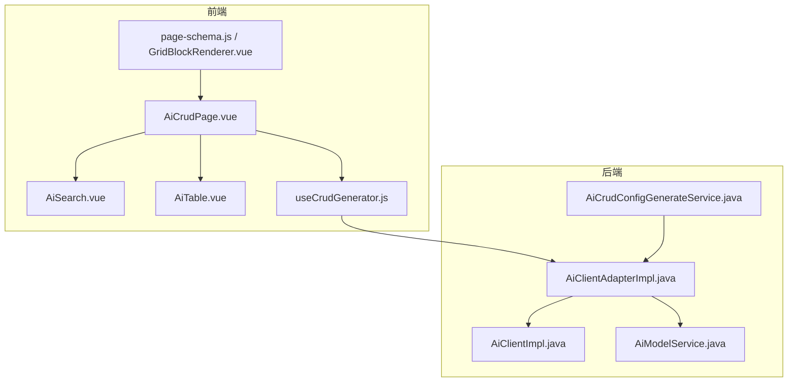
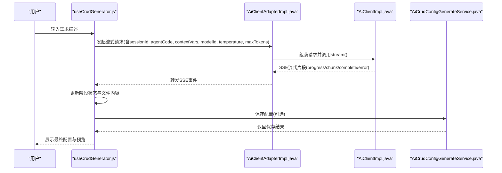
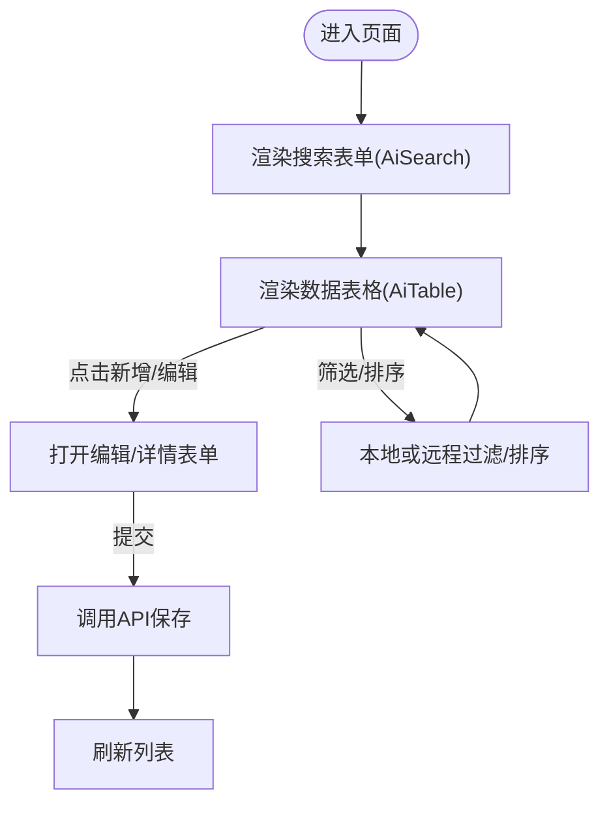
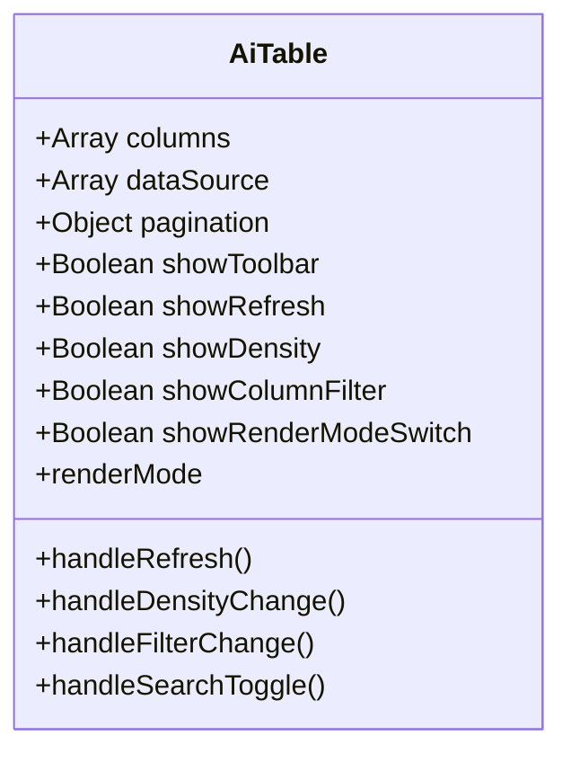
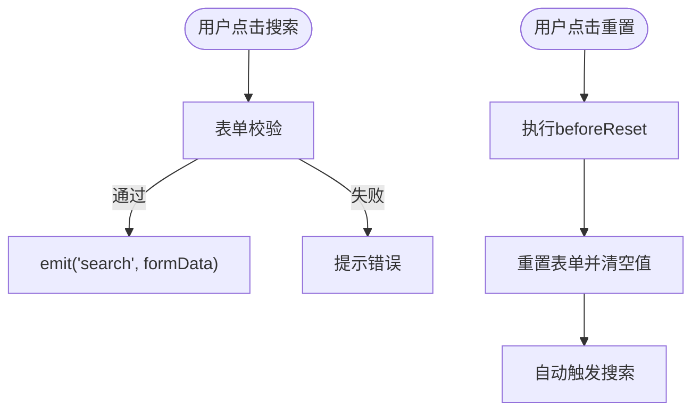
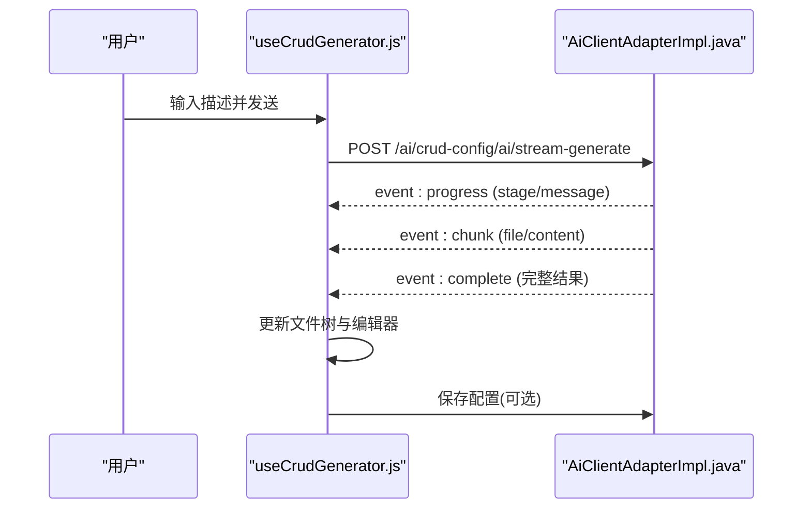
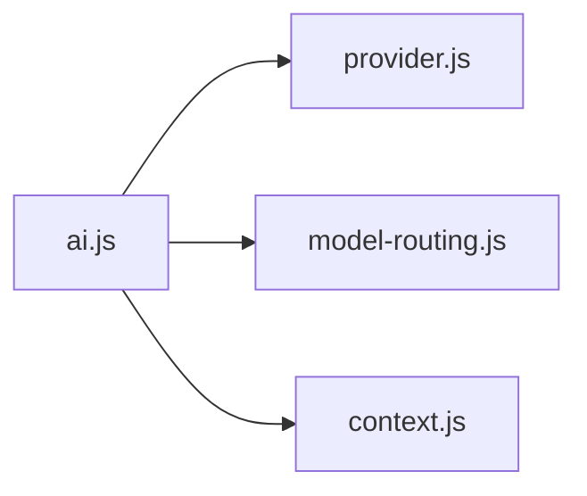

# AI增强组件

<cite>
**本文引用的文件**
- [AiCrudPage.vue](file://forge-admin-ui/src/components/ai-form/AiCrudPage.vue)
- [AiTable.vue](file://forge-admin-ui/src/components/ai-form/AiTable.vue)
- [AiSearch.vue](file://forge-admin-ui/src/components/ai-form/AiSearch.vue)
- [useCrudGenerator.js](file://forge-admin-ui/src/composables/useCrudGenerator.js)
- [page-schema.js](file://forge-admin-ui/src/components/lowcode-builder/page/page-schema.js)
- [GridBlockRenderer.vue](file://forge-admin-ui/src/components/lowcode-builder/page/GridBlockRenderer.vue)
- [ListPageGridDesigner.vue](file://forge-admin-ui/src/components/lowcode-builder/page/ListPageGridDesigner.vue)
- [ai.js](file://forge-admin-ui/src/api/ai.js)
- [provider.js](file://forge-admin-ui/src/api/ai/provider.js)
- [model-routing.js](file://forge-admin-ui/src/api/ai/model-routing.js)
- [context.js](file://forge-admin-ui/src/api/ai/context.js)
- [AiClientAdapterImpl.java](file://forge-server/forge-admin-server/src/main/java/com/mdframe/forge/admin/bridge/AiClientAdapterImpl.java)
- [AiCrudConfigGenerateService.java](file://forge-server/forge-framework/forge-plugin-parent/forge-plugin-generator/src/main/java/com/mdframe/forge/plugin/generator/service/AiCrudConfigGenerateService.java)
- [AiModelProviderManager.java](file://forge-server/forge-framework/forge-plugin-parent/forge-plugin-ai/src/main/java/com/mdframe/forge/plugin/ai/coordination/AiModelProviderManager.java)
- [AiModelService.java](file://forge-server/forge-framework/forge-plugin-parent/forge-plugin-ai/src/main/java/com/mdframe/forge/plugin/ai/model/service/AiModelService.java)
- [AiClientImpl.java](file://forge-server/forge-framework/forge-plugin-parent/forge-plugin-ai/src/main/java/com/mdframe/forge/plugin/ai/client/AiClientImpl.java)
- [2026-04-21-crud-generator-design.md](file://docs/superpowers/specs/2026-04-21-crud-generator-design.md)
</cite>

## 目录
1. [简介](#简介)
2. [项目结构](#项目结构)
3. [核心组件](#核心组件)
4. [架构总览](#架构总览)
5. [详细组件分析](#详细组件分析)
6. [依赖关系分析](#依赖关系分析)
7. [性能考虑](#性能考虑)
8. [故障排查指南](#故障排查指南)
9. [结论](#结论)
10. [附录](#附录)

## 简介
本技术文档围绕AI增强的CRUD页面、智能搜索与动态表格等前端组件，以及后端的AI能力集成（模型路由、上下文注入、流式生成）展开。重点说明：
- AI驱动的CRUD页面如何基于配置化Schema自动生成搜索、表格、表单与工具栏行为
- 自然语言到配置的生成流程（SSE流式分阶段输出）、上下文管理与结果展示机制
- 智能搜索的字段推断、折叠与扩展、自动过滤选项生成
- 动态表格的多渲染模式（表格/卡片）、列设置、排序与筛选
- 模型调用、供应商与模型选择、温度与最大Token控制
- 配置项、性能优化策略与常见故障处理方案

## 项目结构
本项目在前后端协同实现AI增强能力：
- 前端：以AiCrudPage为核心容器，组合AiSearch、AiTable、AiForm等组件；通过composables管理会话与流式生成；低代码构建器提供默认Schema与预览渲染
- 后端：通过AiClientAdapter桥接AI客户端，支持流式输出、上下文注入与模型选择；生成服务将AI响应解析为可落库的CRUD配置

**图表来源**
- [AiCrudPage.vue:116-313](file://forge-admin-ui/src/components/ai-form/AiCrudPage.vue#L116-L313)
- [AiSearch.vue:1-63](file://forge-admin-ui/src/components/ai-form/AiSearch.vue#L1-L63)
- [AiTable.vue:8-173](file://forge-admin-ui/src/components/ai-form/AiTable.vue#L8-L173)
- [useCrudGenerator.js:261-300](file://forge-admin-ui/src/composables/useCrudGenerator.js#L261-L300)
- [AiClientAdapterImpl.java:57-99](file://forge-server/forge-admin-server/src/main/java/com/mdframe/forge/admin/bridge/AiClientAdapterImpl.java#L57-L99)
- [AiCrudConfigGenerateService.java:81-111](file://forge-server/forge-framework/forge-plugin-parent/forge-plugin-generator/src/main/java/com/mdframe/forge/plugin/generator/service/AiCrudConfigGenerateService.java#L81-L111)
- [AiClientImpl.java:249-286](file://forge-server/forge-framework/forge-plugin-parent/forge-plugin-ai/src/main/java/com/mdframe/forge/plugin/ai/client/AiClientImpl.java#L249-L286)
- [AiModelService.java:245-270](file://forge-server/forge-framework/forge-plugin-parent/forge-plugin-ai/src/main/java/com/mdframe/forge/plugin/ai/model/service/AiModelService.java#L245-L270)
- [page-schema.js:1635-1675](file://forge-admin-ui/src/components/lowcode-builder/page/page-schema.js#L1635-L1675)
- [GridBlockRenderer.vue:331-359](file://forge-admin-ui/src/components/lowcode-builder/page/GridBlockRenderer.vue#L331-L359)

**章节来源**
- [AiCrudPage.vue:116-313](file://forge-admin-ui/src/components/ai-form/AiCrudPage.vue#L116-L313)
- [AiSearch.vue:1-63](file://forge-admin-ui/src/components/ai-form/AiSearch.vue#L1-L63)
- [AiTable.vue:8-173](file://forge-admin-ui/src/components/ai-form/AiTable.vue#L8-L173)
- [useCrudGenerator.js:261-300](file://forge-admin-ui/src/composables/useCrudGenerator.js#L261-L300)
- [page-schema.js:1635-1675](file://forge-admin-ui/src/components/lowcode-builder/page/page-schema.js#L1635-L1675)
- [GridBlockRenderer.vue:331-359](file://forge-admin-ui/src/components/lowcode-builder/page/GridBlockRenderer.vue#L331-L359)
- [AiClientAdapterImpl.java:57-99](file://forge-server/forge-admin-server/src/main/java/com/mdframe/forge/admin/bridge/AiClientAdapterImpl.java#L57-L99)
- [AiCrudConfigGenerateService.java:81-111](file://forge-server/forge-framework/forge-plugin-parent/forge-plugin-generator/src/main/java/com/mdframe/forge/plugin/generator/service/AiCrudConfigGenerateService.java#L81-L111)
- [AiClientImpl.java:249-286](file://forge-server/forge-framework/forge-plugin-parent/forge-plugin-ai/src/main/java/com/mdframe/forge/plugin/ai/client/AiClientImpl.java#L249-L286)
- [AiModelService.java:245-270](file://forge-server/forge-framework/forge-plugin-parent/forge-plugin-ai/src/main/java/com/mdframe/forge/plugin/ai/model/service/AiModelService.java#L245-L270)

## 核心组件
- AiCrudPage：AI CRUD页面容器，整合搜索区、数据表格区、编辑/详情区、导入导出与自定义查询，支持抽屉/弹窗/内联工作区多种交互模式
- AiSearch：基于AiForm封装的搜索表单，支持折叠、栅格布局、校验与重置联动
- AiTable：基于Naive UI的数据表格封装，支持多渲染模式、列设置、排序、筛选、分页、全屏与密度切换
- useCrudGenerator：会话与流式生成编排，负责SSE事件处理、阶段状态、文件树与Diff对比、保存与导出
- 低代码构建器：提供AiCrudPage与AiTable的默认Schema与预览渲染逻辑

**章节来源**
- [AiCrudPage.vue:116-313](file://forge-admin-ui/src/components/ai-form/AiCrudPage.vue#L116-L313)
- [AiSearch.vue:65-140](file://forge-admin-ui/src/components/ai-form/AiSearch.vue#L65-L140)
- [AiTable.vue:176-392](file://forge-admin-ui/src/components/ai-form/AiTable.vue#L176-L392)
- [useCrudGenerator.js:261-300](file://forge-admin-ui/src/composables/useCrudGenerator.js#L261-L300)
- [page-schema.js:1635-1675](file://forge-admin-ui/src/components/lowcode-builder/page/page-schema.js#L1635-L1675)

## 架构总览
AI增强CRUD的整体流程包括：
- 前端用户输入需求描述，使用useCrudGenerator发起流式请求
- 后端AiClientAdapter根据agentCode、上下文变量、模型参数构造请求并转发至AI客户端
- AI客户端执行提示词渲染、上下文注入、模型选择与流式返回
- 前端按阶段更新UI（分析、生成searchSchema/columnsSchema/editSchema/apiConfig），支持在线编辑与Diff对比
- 保存配置到数据库，运行时由AiCrudPage加载Schema并渲染页面

**图表来源**
- [useCrudGenerator.js:261-300](file://forge-admin-ui/src/composables/useCrudGenerator.js#L261-L300)
- [AiClientAdapterImpl.java:57-99](file://forge-server/forge-admin-server/src/main/java/com/mdframe/forge/admin/bridge/AiClientAdapterImpl.java#L57-L99)
- [AiClientImpl.java:249-286](file://forge-server/forge-framework/forge-plugin-parent/forge-plugin-ai/src/main/java/com/mdframe/forge/plugin/ai/client/AiClientImpl.java#L249-L286)
- [AiCrudConfigGenerateService.java:81-111](file://forge-server/forge-framework/forge-plugin-parent/forge-plugin-generator/src/main/java/com/mdframe/forge/plugin/generator/service/AiCrudConfigGenerateService.java#L81-L111)

## 详细组件分析

### AiCrudPage（AI CRUD页面容器）
- 功能要点
  - 搜索区：基于AiSearch，支持栅格列数、标签宽度、折叠与最大可见字段数
  - 表格区：基于AiTable，支持分页、排序、筛选、渲染模式切换、全屏、密度调整
  - 编辑/详情：支持Modal/Drawer/内联工作区三种模式，包含子表编辑器与行扩展面板
  - 工具栏：新增、批量删除、导入、导出、自定义查询、更多操作下拉
  - 流程进度：详情页可切换“业务数据”和“流程进度”标签页
- 关键交互
  - 搜索触发列表刷新，重置后自动搜索
  - 表格列设置与筛选影响显示数据
  - 工具栏动作与表单动作统一通过handleActionClick分发
- 配置透传
  - searchSchema、columns、editSchema、api-config等通过props传入
  - 低代码构建器中AiCrudPage默认属性与字段引用由page-schema.js生成

**图表来源**
- [AiCrudPage.vue:116-313](file://forge-admin-ui/src/components/ai-form/AiCrudPage.vue#L116-L313)
- [AiSearch.vue:149-213](file://forge-admin-ui/src/components/ai-form/AiSearch.vue#L149-L213)
- [AiTable.vue:528-693](file://forge-admin-ui/src/components/ai-form/AiTable.vue#L528-L693)

**章节来源**
- [AiCrudPage.vue:116-313](file://forge-admin-ui/src/components/ai-form/AiCrudPage.vue#L116-L313)
- [page-schema.js:1635-1675](file://forge-admin-ui/src/components/lowcode-builder/page/page-schema.js#L1635-L1675)
- [GridBlockRenderer.vue:331-359](file://forge-admin-ui/src/components/lowcode-builder/page/GridBlockRenderer.vue#L331-L359)

### AiTable（动态表格）
- 功能要点
  - 多渲染模式：表格与卡片两种模式，支持切换
  - 列设置：默认选中列、列宽、对齐方式、固定列、省略与提示
  - 排序与筛选：内置比较器与自动过滤选项生成，支持and/or模式
  - 工具栏：刷新、密度、列设置、搜索切换、全屏、渲染模式切换
- 性能特性
  - 本地过滤与排序在小数据集友好；大数据建议配合后端分页与远程筛选
  - 自动过滤选项数量限制避免过多选项影响体验

**图表来源**
- [AiTable.vue:176-392](file://forge-admin-ui/src/components/ai-form/AiTable.vue#L176-L392)
- [AiTable.vue:528-693](file://forge-admin-ui/src/components/ai-form/AiTable.vue#L528-L693)

**章节来源**
- [AiTable.vue:8-173](file://forge-admin-ui/src/components/ai-form/AiTable.vue#L8-L173)
- [AiTable.vue:176-392](file://forge-admin-ui/src/components/ai-form/AiTable.vue#L176-L392)
- [AiTable.vue:528-693](file://forge-admin-ui/src/components/ai-form/AiTable.vue#L528-L693)

### AiSearch（智能搜索）
- 功能要点
  - 基于AiForm，支持栅格布局、标签位置与宽度、尺寸、折叠与最大可见字段数
  - 校验与防抖：提交前校验，防止重复点击，延迟关闭loading
  - 重置联动：重置后自动触发搜索
- 扩展点
  - 额外操作按钮插槽，便于接入自定义搜索逻辑
  - beforeReset钩子，支持异步预处理

**图表来源**
- [AiSearch.vue:149-213](file://forge-admin-ui/src/components/ai-form/AiSearch.vue#L149-L213)

**章节来源**
- [AiSearch.vue:1-63](file://forge-admin-ui/src/components/ai-form/AiSearch.vue#L1-L63)
- [AiSearch.vue:65-140](file://forge-admin-ui/src/components/ai-form/AiSearch.vue#L65-L140)
- [AiSearch.vue:149-213](file://forge-admin-ui/src/components/ai-form/AiSearch.vue#L149-L213)

### 流式生成与会话管理（useCrudGenerator）
- 功能要点
  - 会话ID管理：首次发送时生成并复用
  - 阶段状态：analyzing、generating-search、generating-columns、generating-edit、generating-api、complete
  - 文件树：searchSchema、columnsSchema、editSchema、apiConfig等文件节点，支持编辑与状态标记
  - Diff对比：当configKey已存在时，支持查看现有配置与生成配置的差异
  - 保存与导出：校验JSON格式后保存，支持导出全部配置
- 与后端协作
  - 通过SSE接收progress/chunk/complete事件，实时更新UI
  - 支持temperature与maxTokens参数调优

**图表来源**
- [useCrudGenerator.js:261-300](file://forge-admin-ui/src/composables/useCrudGenerator.js#L261-L300)
- [2026-04-21-crud-generator-design.md:181-235](file://docs/superpowers/specs/2026-04-21-crud-generator-design.md#L181-L235)
- [AiClientAdapterImpl.java:57-99](file://forge-server/forge-admin-server/src/main/java/com/mdframe/forge/admin/bridge/AiClientAdapterImpl.java#L57-L99)

**章节来源**
- [useCrudGenerator.js:261-300](file://forge-admin-ui/src/composables/useCrudGenerator.js#L261-L300)
- [2026-04-21-crud-generator-design.md:103-180](file://docs/superpowers/specs/2026-04-21-crud-generator-design.md#L103-L180)
- [2026-04-21-crud-generator-design.md:181-235](file://docs/superpowers/specs/2026-04-21-crud-generator-design.md#L181-L235)

### 低代码构建器与预览
- 默认Schema生成：针对AiCrudPage与AiTable提供默认属性与字段引用，便于快速搭建页面
- 预览渲染：GridBlockRenderer在预览模式下挂载AiCrudPage并传递必要props

**章节来源**
- [page-schema.js:1635-1675](file://forge-admin-ui/src/components/lowcode-builder/page/page-schema.js#L1635-L1675)
- [GridBlockRenderer.vue:331-359](file://forge-admin-ui/src/components/lowcode-builder/page/GridBlockRenderer.vue#L331-L359)

## 依赖关系分析
- 前端API聚合：ai.js统一导出provider、model-routing、session、context、lowcode、media、skill、store、engine等模块
- Provider与Model管理：provider.js与model-routing.js提供供应商与模型的增删改查、测试、模板与路由策略接口
- 上下文配置：context.js提供上下文配置的CRUD接口，用于Agent上下文注入

**图表来源**
- [ai.js:1-13](file://forge-admin-ui/src/api/ai.js#L1-L13)
- [provider.js:1-42](file://forge-admin-ui/src/api/ai/provider.js#L1-L42)
- [model-routing.js:1-62](file://forge-admin-ui/src/api/ai/model-routing.js#L1-L62)
- [context.js:1-17](file://forge-admin-ui/src/api/ai/context.js#L1-L17)

**章节来源**
- [ai.js:1-13](file://forge-admin-ui/src/api/ai.js#L1-L13)
- [provider.js:1-42](file://forge-admin-ui/src/api/ai/provider.js#L1-L42)
- [model-routing.js:1-62](file://forge-admin-ui/src/api/ai/model-routing.js#L1-L62)
- [context.js:1-17](file://forge-admin-ui/src/api/ai/context.js#L1-L17)

## 性能考虑
- 表格性能
  - 大数据集优先使用后端分页与远程筛选，减少前端计算量
  - 合理设置列宽与固定列，避免频繁重排
  - 自动过滤选项数量限制，避免过多选项导致渲染卡顿
- 搜索性能
  - 折叠与最大可见字段数控制，减少首屏渲染压力
  - 重置后自动搜索，避免多次无效请求
- 流式生成
  - 使用SSE增量更新，降低长耗时请求的用户等待感
  - 合理设置temperature与maxTokens，平衡质量与成本
- 上下文与模型
  - 通过AiModelService确保默认模型可用，避免运行时缺失导致的降级
  - 使用AiClientImpl的上下文注入与提示词渲染，提升生成准确性

[本节为通用指导，不直接分析具体文件]

## 故障排查指南
- 流式生成失败
  - 检查agentCode是否正确，上下文变量是否完整
  - 确认provider与model已启用且配置有效
  - 查看SSE事件中的error消息，定位后端异常
- 模型选择问题
  - 若未指定modelId，后端会尝试应用默认模型；如缺失则抛出业务异常
  - 可通过model-routing策略进行路由与回退
- 上下文注入异常
  - 检查context配置是否按agentCode正确加载
  - 确认提示词模板渲染无误
- 表格与搜索异常
  - 列配置是否存在visible=false导致隐藏
  - 筛选条件是否匹配数据类型与格式
  - 分页与排序参数是否正确传递

**章节来源**
- [AiClientAdapterImpl.java:57-99](file://forge-server/forge-admin-server/src/main/java/com/mdframe/forge/admin/bridge/AiClientAdapterImpl.java#L57-L99)
- [AiModelService.java:245-270](file://forge-server/forge-framework/forge-plugin-parent/forge-plugin-ai/src/main/java/com/mdframe/forge/plugin/ai/model/service/AiModelService.java#L245-L270)
- [AiClientImpl.java:249-286](file://forge-server/forge-framework/forge-plugin-parent/forge-plugin-ai/src/main/java/com/mdframe/forge/plugin/ai/client/AiClientImpl.java#L249-L286)
- [AiCrudConfigGenerateService.java:81-111](file://forge-server/forge-framework/forge-plugin-parent/forge-plugin-generator/src/main/java/com/mdframe/forge/plugin/generator/service/AiCrudConfigGenerateService.java#L81-L111)

## 结论
AI增强组件通过前后端协同实现了从自然语言到CRUD配置的自动化生成与可视化编辑，结合流式输出与上下文注入，显著提升了开发效率与用户体验。AiCrudPage作为容器整合了搜索、表格与表单能力，AiTable与AiSearch提供了灵活的交互与性能优化。后端通过AiClientAdapter与AiClientImpl完成模型调用、上下文管理与流式返回，确保稳定与可扩展。建议在大规模数据场景下结合后端分页与远程筛选，并合理配置模型参数以获得最佳效果。

[本节为总结性内容，不直接分析具体文件]

## 附录
- 配置项速览
  - 搜索：gridCols、labelWidth、enableCollapse、maxVisibleFields、yGap
  - 表格：renderMode、showToolbar、showRefresh、showDensity、showColumnFilter、showRenderModeSwitch、pagination、rowKey、columns
  - 生成：temperature、maxTokens、providerId、modelId、sessionId、agentCode、contextVars
- 常用API
  - 供应商：/ai/provider/*
  - 模型与路由：/ai/model/*、/ai/model-routing/*
  - 上下文：/ai/context/*
  - 流式生成：/ai/crud-config/ai/stream-generate（见设计文档）

**章节来源**
- [provider.js:1-42](file://forge-admin-ui/src/api/ai/provider.js#L1-L42)
- [model-routing.js:1-62](file://forge-admin-ui/src/api/ai/model-routing.js#L1-L62)
- [context.js:1-17](file://forge-admin-ui/src/api/ai/context.js#L1-L17)
- [2026-04-21-crud-generator-design.md:181-235](file://docs/superpowers/specs/2026-04-21-crud-generator-design.md#L181-L235)