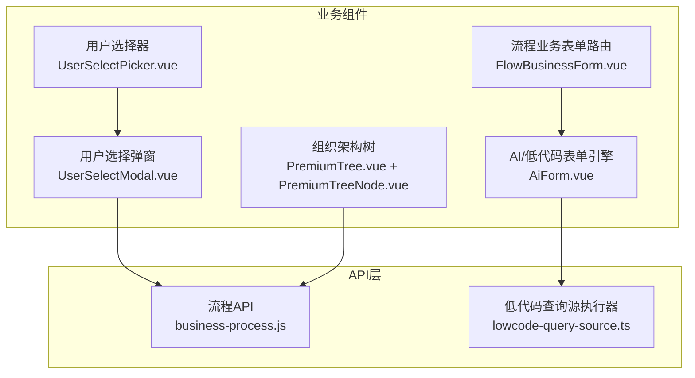
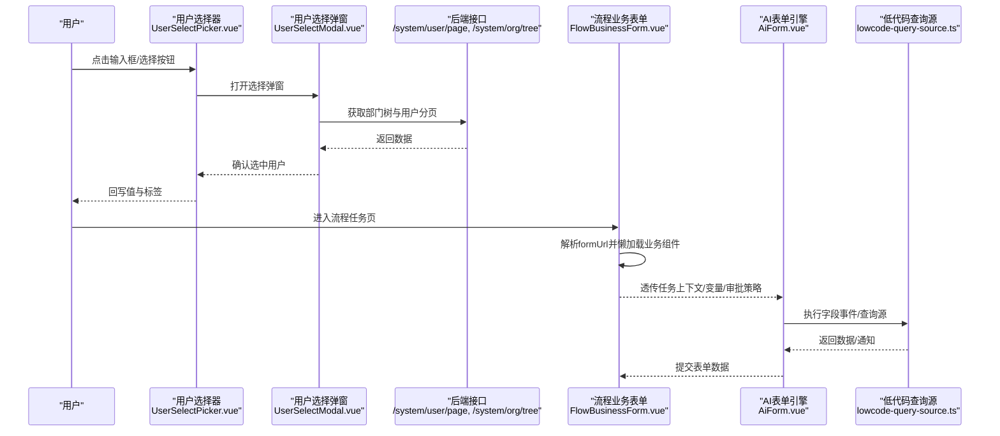
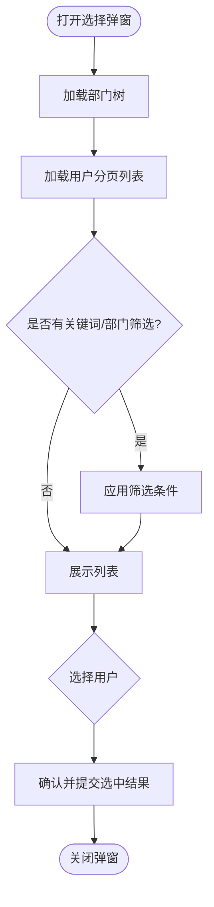
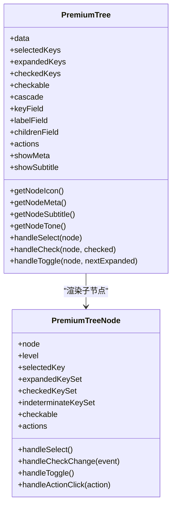
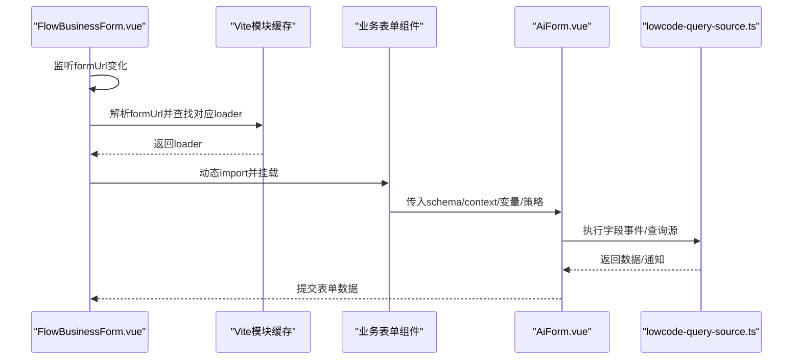
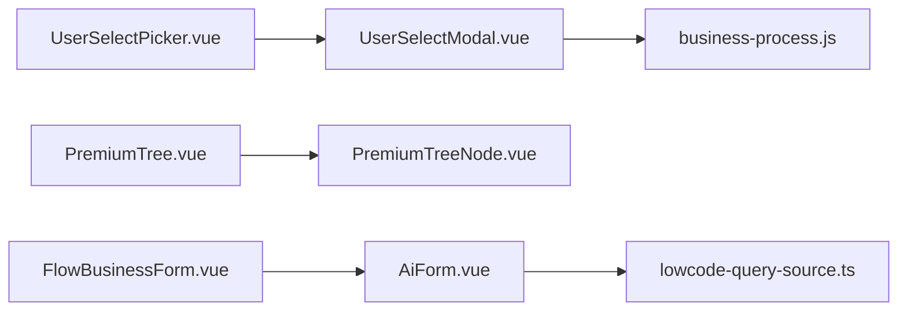

# 业务组件

<cite>
**本文引用的文件**
- [UserSelectPicker.vue](file://forge-admin-ui/src/components/common/UserSelectPicker.vue)
- [UserSelectModal.vue](file://forge-admin-ui/src/components/common/UserSelectModal.vue)
- [PremiumTree.vue](file://forge-admin-ui/src/components/common/PremiumTree.vue)
- [PremiumTreeNode.vue](file://forge-admin-ui/src/components/common/PremiumTreeNode.vue)
- [FlowBusinessForm.vue](file://forge-admin-ui/src/components/common/FlowBusinessForm.vue)
- [AiForm.vue](file://forge-admin-ui/src/components/ai-form/AiForm.vue)
- [business-process.js](file://forge-admin-ui/src/api/business-process.js)
- [lowcode-query-source.ts](file://forge-admin-ui/src/api/lowcode-query-source.ts)
</cite>

## 目录
1. [简介](#简介)
2. [项目结构](#项目结构)
3. [核心组件](#核心组件)
4. [架构总览](#架构总览)
5. [详细组件分析](#详细组件分析)
6. [依赖关系分析](#依赖关系分析)
7. [性能考虑](#性能考虑)
8. [故障排查指南](#故障排查指南)
9. [结论](#结论)
10. [附录](#附录)

## 简介
本技术文档聚焦于 Forge Admin 前端中的三类业务相关组件：用户选择器、组织架构树、业务流程表单。内容覆盖数据源配置、权限控制、搜索过滤、批量操作、与后端 API 的集成方式、数据同步机制与状态管理，并提供典型业务场景的使用示例与扩展开发指南，帮助开发者快速理解并高效扩展这些组件。

## 项目结构
围绕业务组件的前端代码主要位于 forge-admin-ui/src/components 目录下：
- common：通用业务组件（用户选择器、组织树、流程业务表单等）
- ai-form：AI/低代码驱动的动态表单引擎（支持字段级权限、事件、校验、折叠导航等）
- api：与后端交互的接口封装（如流程、查询源等）

图表来源
- [UserSelectPicker.vue:1-198](file://forge-admin-ui/src/components/common/UserSelectPicker.vue#L1-L198)
- [UserSelectModal.vue:1-318](file://forge-admin-ui/src/components/common/UserSelectModal.vue#L1-L318)
- [PremiumTree.vue:1-283](file://forge-admin-ui/src/components/common/PremiumTree.vue#L1-L283)
- [PremiumTreeNode.vue:1-651](file://forge-admin-ui/src/components/common/PremiumTreeNode.vue#L1-L651)
- [FlowBusinessForm.vue:1-199](file://forge-admin-ui/src/components/common/FlowBusinessForm.vue#L1-L199)
- [AiForm.vue:1-800](file://forge-admin-ui/src/components/ai-form/AiForm.vue#L1-L800)
- [business-process.js](file://forge-admin-ui/src/api/business-process.js)
- [lowcode-query-source.ts](file://forge-admin-ui/src/api/lowcode-query-source.ts)

章节来源
- [UserSelectPicker.vue:1-198](file://forge-admin-ui/src/components/common/UserSelectPicker.vue#L1-L198)
- [UserSelectModal.vue:1-318](file://forge-admin-ui/src/components/common/UserSelectModal.vue#L1-L318)
- [PremiumTree.vue:1-283](file://forge-admin-ui/src/components/common/PremiumTree.vue#L1-L283)
- [PremiumTreeNode.vue:1-651](file://forge-admin-ui/src/components/common/PremiumTreeNode.vue#L1-L651)
- [FlowBusinessForm.vue:1-199](file://forge-admin-ui/src/components/common/FlowBusinessForm.vue#L1-L199)
- [AiForm.vue:1-800](file://forge-admin-ui/src/components/ai-form/AiForm.vue#L1-L800)

## 核心组件
- 用户选择器（UserSelectPicker + UserSelectModal）
  - 提供单选/多选、清空、显示标签或ID、打开选择弹窗、提交选中结果等能力。
  - 通过后端接口加载部门树与用户分页列表，支持关键词与部门筛选。
- 组织架构树（PremiumTree + PremiumTreeNode）
  - 支持节点选择、展开/折叠、勾选联动（父子级联）、自定义图标/副标题/元信息、节点动作按钮、无障碍键盘操作。
  - 通过 computed 维护选中、展开、勾选集合，保证高性能渲染与状态一致性。
- 业务流程表单（FlowBusinessForm + AiForm）
  - FlowBusinessForm 根据 formUrl 自动定位并懒加载业务表单组件，透传任务上下文与审批策略。
  - AiForm 基于 JSON Schema 动态渲染表单，内置字段权限、条件可见性、校验规则、字段事件、折叠导航、弹窗表单等。

章节来源
- [UserSelectPicker.vue:42-163](file://forge-admin-ui/src/components/common/UserSelectPicker.vue#L42-L163)
- [UserSelectModal.vue:82-296](file://forge-admin-ui/src/components/common/UserSelectModal.vue#L82-L296)
- [PremiumTree.vue:31-184](file://forge-admin-ui/src/components/common/PremiumTree.vue#L31-L184)
- [PremiumTreeNode.vue:119-283](file://forge-admin-ui/src/components/common/PremiumTreeNode.vue#L119-L283)
- [FlowBusinessForm.vue:53-183](file://forge-admin-ui/src/components/common/FlowBusinessForm.vue#L53-L183)
- [AiForm.vue:148-800](file://forge-admin-ui/src/components/ai-form/AiForm.vue#L148-L800)

## 架构总览
下图展示了从用户交互到数据加载、再到表单渲染与提交的端到端流程。

图表来源
- [UserSelectPicker.vue:1-198](file://forge-admin-ui/src/components/common/UserSelectPicker.vue#L1-L198)
- [UserSelectModal.vue:1-318](file://forge-admin-ui/src/components/common/UserSelectModal.vue#L1-L318)
- [FlowBusinessForm.vue:1-199](file://forge-admin-ui/src/components/common/FlowBusinessForm.vue#L1-L199)
- [AiForm.vue:1-800](file://forge-admin-ui/src/components/ai-form/AiForm.vue#L1-L800)
- [lowcode-query-source.ts](file://forge-admin-ui/src/api/lowcode-query-source.ts)

## 详细组件分析

### 用户选择器（UserSelectPicker + UserSelectModal）
- 数据源与搜索过滤
  - 弹窗内使用关键词与部门树进行筛选，调用后端分页接口获取用户列表。
  - 部门树用于 TreeSelect 下拉选择，支持递归格式化与名称映射。
- 多选与批量操作
  - 表格列启用 selection，支持单选/多选；已选行键集合驱动勾选状态。
  - 确认时合并已选用户与当前列表用户，去重后回传给父组件。
- 状态管理与回显
  - Picker 负责将 ID 与标签分别绑定至 modelValue 与 labelValue，支持字符串逗号分隔与数组归一化。
  - 支持清空、禁用、尺寸等常用属性。

图表来源
- [UserSelectModal.vue:168-296](file://forge-admin-ui/src/components/common/UserSelectModal.vue#L168-L296)

章节来源
- [UserSelectPicker.vue:42-163](file://forge-admin-ui/src/components/common/UserSelectPicker.vue#L42-L163)
- [UserSelectModal.vue:82-296](file://forge-admin-ui/src/components/common/UserSelectModal.vue#L82-L296)

### 组织架构树（PremiumTree + PremiumTreeNode）
- 数据结构与键映射
  - 支持自定义 keyField/labelField/childrenField，默认 key=label=children。
  - 节点键优先取 props.keyField，其次 node.key，最后 node.id。
- 选择、展开与勾选联动
  - 选择：emit update:selected-keys 与 select 事件。
  - 展开：维护 expandedKeySet，支持 toggle。
  - 勾选：当 cascade=true 时，计算子叶节点集合与父级半选状态，维护 checkedKeySet 与 indeterminateKeySet。
- 可访问性与交互
  - 支持键盘方向键展开/折叠，ARIA 属性设置，焦点样式优化。
- 扩展点
  - 通过 getNodeIcon/getNodeMeta/getNodeSubtitle/getNodeTone/actions 注入图标、元信息、副标题、颜色主题与节点动作。

图表来源
- [PremiumTree.vue:31-184](file://forge-admin-ui/src/components/common/PremiumTree.vue#L31-L184)
- [PremiumTreeNode.vue:119-283](file://forge-admin-ui/src/components/common/PremiumTreeNode.vue#L119-L283)

章节来源
- [PremiumTree.vue:31-184](file://forge-admin-ui/src/components/common/PremiumTree.vue#L31-L184)
- [PremiumTreeNode.vue:119-283](file://forge-admin-ui/src/components/common/PremiumTreeNode.vue#L119-L283)

### 业务流程表单（FlowBusinessForm + AiForm）
- 动态组件加载
  - FlowBusinessForm 通过 Vite import.meta.glob 扫描 @/views/**/*.vue，按 formUrl 匹配并懒加载业务表单组件。
  - 支持大小写不敏感与查询参数剥离，失败时降级为空提示。
- 上下文与权限
  - 透传 taskId、businessKey、processInstanceId、taskDefKey、processDefKey、variables、approvalPolicy、initialTaskContext、readOnly、submitting、submittingAction。
  - AiForm 支持字段级权限（fieldPermissions），运行时控制可见性（vIf/visible）。
- 校验与事件
  - 自动生成必填校验规则，针对数字/日期/选择类类型采用自定义空值校验避免误判。
  - 字段事件系统（fieldEvents）通过 lowcode-query-source 执行查询源，支持 FORM_LOAD、CHANGE 等触发时机。
- 布局与交互
  - 支持栅格布局、折叠导航、弹窗表单、插槽扩展、搜索表单模式等。

图表来源
- [FlowBusinessForm.vue:101-183](file://forge-admin-ui/src/components/common/FlowBusinessForm.vue#L101-L183)
- [AiForm.vue:296-554](file://forge-admin-ui/src/components/ai-form/AiForm.vue#L296-L554)
- [lowcode-query-source.ts](file://forge-admin-ui/src/api/lowcode-query-source.ts)

章节来源
- [FlowBusinessForm.vue:53-183](file://forge-admin-ui/src/components/common/FlowBusinessForm.vue#L53-L183)
- [AiForm.vue:148-800](file://forge-admin-ui/src/components/ai-form/AiForm.vue#L148-L800)

## 依赖关系分析
- 组件耦合度
  - UserSelectPicker 与 UserSelectModal 为松耦合组合，通过 v-model 与事件通信。
  - PremiumTree 与 PremiumTreeNode 通过 props/emit 传递状态，内部状态以 Set 维护，降低重复计算。
  - FlowBusinessForm 与 AiForm 通过 props 透传上下文，职责清晰。
- 外部依赖
  - 用户选择弹窗依赖后端接口 /system/user/page 与 /system/org/tree。
  - AiForm 依赖 lowcode-query-source 执行查询源与字段事件。
  - 流程相关 API 集中在 business-process.js，便于统一管理与复用。

图表来源
- [UserSelectPicker.vue:1-198](file://forge-admin-ui/src/components/common/UserSelectPicker.vue#L1-L198)
- [UserSelectModal.vue:1-318](file://forge-admin-ui/src/components/common/UserSelectModal.vue#L1-L318)
- [PremiumTree.vue:1-283](file://forge-admin-ui/src/components/common/PremiumTree.vue#L1-L283)
- [PremiumTreeNode.vue:1-651](file://forge-admin-ui/src/components/common/PremiumTreeNode.vue#L1-L651)
- [FlowBusinessForm.vue:1-199](file://forge-admin-ui/src/components/common/FlowBusinessForm.vue#L1-L199)
- [AiForm.vue:1-800](file://forge-admin-ui/src/components/ai-form/AiForm.vue#L1-L800)
- [business-process.js](file://forge-admin-ui/src/api/business-process.js)
- [lowcode-query-source.ts](file://forge-admin-ui/src/api/lowcode-query-source.ts)

章节来源
- [business-process.js](file://forge-admin-ui/src/api/business-process.js)
- [lowcode-query-source.ts](file://forge-admin-ui/src/api/lowcode-query-source.ts)

## 性能考虑
- 用户选择弹窗
  - 分页加载减少首屏数据量；部门树仅加载一次并构建名称映射，提升渲染效率。
- 组织架构树
  - 使用 Set 维护展开/勾选集合，避免全量遍历；computed 派生状态，减少重复计算。
  - 支持懒展开与子节点按需渲染，适合大规模树形数据。
- 流程业务表单
  - 动态组件懒加载，避免无关业务组件提前编译；失败时降级处理，保障页面可用性。
  - AiForm 的字段事件与查询源按需执行，结合 token 刷新避免重复请求。

[本节为通用性能建议，无需特定文件引用]

## 故障排查指南
- 用户选择弹窗无法加载
  - 检查后端接口 /system/user/page 与 /system/org/tree 是否可达，关注网络错误与返回码。
  - 若部门树为空，确认接口返回结构与格式化处理逻辑是否一致。
- 组织架构树无响应
  - 确认传入的数据结构包含 key/label/children 字段，或正确配置 keyField/labelField/childrenField。
  - 检查 selectedKeys/expandedKeys/checkedKeys 是否为数组，避免类型不一致导致状态异常。
- 流程业务表单未渲染
  - 核对 formUrl 与 @/views 下的实际路径是否一致（大小写不敏感匹配仍可能因路径差异失败）。
  - 查看控制台警告信息，确认 loader 是否正确返回组件。
- AiForm 字段事件无效
  - 确认 fieldEvents 已正确注入，且 fieldEventLoadToken 变化会重新初始化事件规则。
  - 检查 lowcode-query-source 的执行配置与返回数据是否符合预期。

章节来源
- [UserSelectModal.vue:183-249](file://forge-admin-ui/src/components/common/UserSelectModal.vue#L183-L249)
- [PremiumTree.vue:108-184](file://forge-admin-ui/src/components/common/PremiumTree.vue#L108-L184)
- [FlowBusinessForm.vue:101-183](file://forge-admin-ui/src/components/common/FlowBusinessForm.vue#L101-L183)
- [AiForm.vue:520-554](file://forge-admin-ui/src/components/ai-form/AiForm.vue#L520-L554)

## 结论
本项目的业务组件在数据源配置、权限控制、搜索过滤与批量操作上提供了完善的能力。用户选择器与组织树具备高可扩展性与良好的性能表现；流程业务表单通过动态加载与低代码表单引擎，实现了灵活的表单编排与强大的事件驱动能力。建议在复杂场景中充分利用字段权限、字段事件与查询源，以提升业务适配效率与用户体验。

[本节为总结性内容，无需特定文件引用]

## 附录
- 使用示例（概念性说明）
  - 用户选择器：在表单中引入 UserSelectPicker，绑定 modelValue 与 labelValue，开启 multiple 实现多选；点击选择后通过 confirm/select 事件处理选中结果。
  - 组织架构树：传入 data 与 selectedKeys/expandedKeys/checkedKeys，启用 checkable 与 cascade 实现勾选联动；通过 actions 注入节点操作。
  - 流程业务表单：在流程任务页配置 formUrl，FlowBusinessForm 自动加载对应业务组件；AiForm 通过 schema 定义字段、校验与事件。
- 扩展开发指南
  - 新增字段类型：在 AiForm 中注册新的 componentKey 与 normalizeDesignerFieldType 映射，确保运行时识别与渲染。
  - 扩展节点动作：在 PremiumTree 的 actions 中定义 visible/disabled/onClick，实现细粒度权限控制与交互。
  - 接入新数据源：在 lowcode-query-source 中扩展执行器，或在 UserSelectModal 中替换 request 调用以对接新接口。

[本节为通用指导，无需特定文件引用]