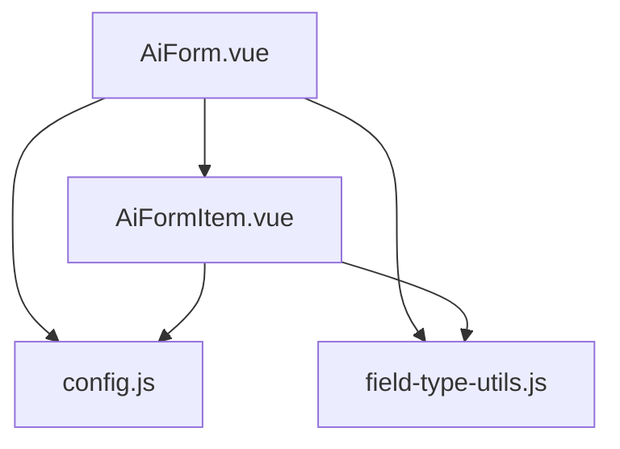
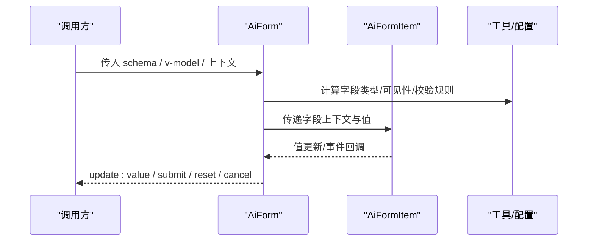
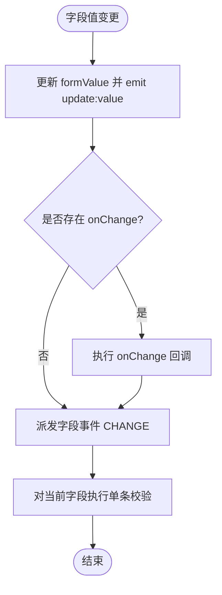
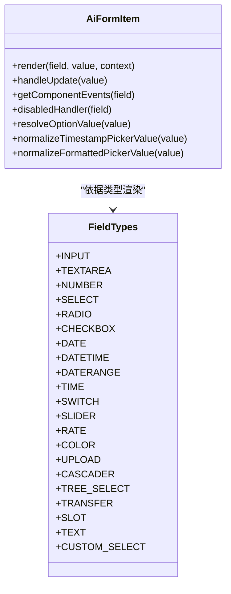
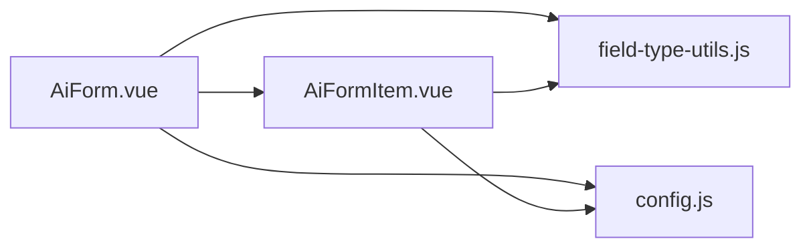

# 基础组件

<cite>
**本文引用的文件**
- [AiForm.vue](file://forge-admin-ui/src/components/ai-form/AiForm.vue)
- [AiFormItem.vue](file://forge-admin-ui/src/components/ai-form/AiFormItem.vue)
- [config.js](file://forge-admin-ui/src/components/ai-form/config.js)
- [field-type-utils.js](file://forge-admin-ui/src/components/ai-form/field-type-utils.js)
</cite>

## 目录
1. [简介](#简介)
2. [项目结构](#项目结构)
3. [核心组件](#核心组件)
4. [架构总览](#架构总览)
5. [详细组件分析](#详细组件分析)
6. [依赖关系分析](#依赖关系分析)
7. [性能考虑](#性能考虑)
8. [故障排查指南](#故障排查指南)
9. [结论](#结论)
10. [附录](#附录)

## 简介
本技术文档聚焦于基础表单组件，围绕输入类组件（文本框、数字框、选择器、日期选择器等）的实现原理与配置选项展开。内容涵盖：
- 属性绑定与事件处理机制
- 验证规则生成与执行
- 样式定制与布局控制
- 响应式设计与无障碍访问支持
- 国际化与本地化能力
- 使用示例、最佳实践与常见问题解决方案

该表单体系以 JSON Schema 驱动渲染，通过统一的 AiForm 容器与 AiFormItem 字段渲染器，实现高内聚、低耦合的可扩展表单能力。

## 项目结构
- AiForm 作为表单容器，负责数据绑定、校验规则生成、可见性控制、折叠/分组导航、事件分发与弹窗表单等。
- AiFormItem 根据字段类型动态渲染具体控件，统一处理值更新、事件透传、只读展示与上传等。
- config.js 提供字段类型常量与工厂方法，便于快速构建标准字段配置。
- field-type-utils.js 提供字段类型判断工具，用于校验触发策略与默认行为适配。

图表来源
- [AiForm.vue:148-282](file://forge-admin-ui/src/components/ai-form/AiForm.vue#L148-L282)
- [AiFormItem.vue:78-733](file://forge-admin-ui/src/components/ai-form/AiFormItem.vue#L78-L733)
- [config.js:25-316](file://forge-admin-ui/src/components/ai-form/config.js#L25-L316)
- [field-type-utils.js:1-33](file://forge-admin-ui/src/components/ai-form/field-type-utils.js#L1-L33)

章节来源
- [AiForm.vue:148-282](file://forge-admin-ui/src/components/ai-form/AiForm.vue#L148-L282)
- [AiFormItem.vue:78-733](file://forge-admin-ui/src/components/ai-form/AiFormItem.vue#L78-L733)
- [config.js:25-316](file://forge-admin-ui/src/components/ai-form/config.js#L25-L316)
- [field-type-utils.js:1-33](file://forge-admin-ui/src/components/ai-form/field-type-utils.js#L1-L33)

## 核心组件
- AiForm
  - 职责：接收 schema 与 v-model 数据，计算并应用字段权限与可见性，生成校验规则，管理折叠/分组导航，统一提交/重置/取消，支持业务弹窗表单与字段事件运行时。
  - 关键特性：栅格布局、标签位置/宽度/对齐、尺寸、操作按钮显隐、折叠显示、搜索模式优化、空布局节点保留（设计器预览）。
- AiFormItem
  - 职责：按字段类型渲染具体控件，统一值更新与事件透传，处理只读展示、上传、远程选择、纯文本格式化等。
  - 关键特性：多类型覆盖（输入、数字、选择、日期时间、上传、滑块、评分、颜色、级联、树选择、穿梭框、自定义选择、对象引用、记录选择器等），支持插槽与页面组件渲染。
- config.js
  - 职责：定义字段类型常量与工厂函数，提供常用字段的快捷创建方式。
- field-type-utils.js
  - 职责：识别数字输入类型与“请输入”语义的输入类类型，辅助校验触发策略与提示信息生成。

章节来源
- [AiForm.vue:148-282](file://forge-admin-ui/src/components/ai-form/AiForm.vue#L148-L282)
- [AiFormItem.vue:78-733](file://forge-admin-ui/src/components/ai-form/AiFormItem.vue#L78-L733)
- [config.js:25-316](file://forge-admin-ui/src/components/ai-form/config.js#L25-L316)
- [field-type-utils.js:1-33](file://forge-admin-ui/src/components/ai-form/field-type-utils.js#L1-L33)

## 架构总览
表单由“容器 + 渲染器 + 工具/配置”构成。容器负责数据流、校验与事件；渲染器负责按类型渲染控件；工具与配置提供类型判断与便捷构造。

图表来源
- [AiForm.vue:286-362](file://forge-admin-ui/src/components/ai-form/AiForm.vue#L286-L362)
- [AiFormItem.vue:78-733](file://forge-admin-ui/src/components/ai-form/AiFormItem.vue#L78-L733)
- [config.js:25-316](file://forge-admin-ui/src/components/ai-form/config.js#L25-L316)
- [field-type-utils.js:1-33](file://forge-admin-ui/src/components/ai-form/field-type-utils.js#L1-L33)

## 详细组件分析

### AiForm 容器组件
- 属性绑定
  - 数据绑定：v-model:value 双向绑定表单数据，内部维护 formValue 并通过 watch 同步。
  - 布局与外观：labelPlacement、labelWidth、labelAlign、size、gridCols、xGap、yGap 控制标签与栅格布局。
  - 交互开关：showActions、showSubmit、showReset、showCancel、submitLoading、enableCollapse、maxVisibleFields、showFeedback、keepEmptyLayoutNodes。
  - 上下文与资源：context、formAssets、fieldPermissions、fieldEvents、fieldEventLoadToken。
- 事件处理
  - 字段变化：handleFieldChange 更新 formValue，触发 onChange 回调，派发字段事件并执行单字段校验。
  - 表单动作：handleSubmit/handleReset/handleCancel 暴露给调用方；nodeAction 支持设置值与打开弹窗表单。
  - 初始加载：onMounted 后派发 FORM_LOAD 事件，支持延迟 token 刷新。
- 验证规则
  - 基于 visibleSchema 收集字段规则，合并 required 与自定义 rules，针对数字/日期/选择类型注入空值校验以避免误判。
  - 单字段重验：validateChangedField 在字段变更后异步校验，不阻断用户继续填写。
- 可见性与权限
  - 通过 resolveRuntimeControl 与 vIf 控制字段可见；应用字段权限映射过滤节点。
- 折叠与分组导航
  - enableCollapse 与 maxVisibleFields 控制折叠；sectionNavItems 与 showSectionNav 提供分组导航。
- 弹窗表单
  - handleNodeAction 支持 setValue 与 openModal；openModal 时从 formAssets 解析 schema 并渲染嵌套 AiForm。

图表来源
- [AiForm.vue:589-612](file://forge-admin-ui/src/components/ai-form/AiForm.vue#L589-L612)
- [AiForm.vue:672-682](file://forge-admin-ui/src/components/ai-form/AiForm.vue#L672-L682)

章节来源
- [AiForm.vue:148-282](file://forge-admin-ui/src/components/ai-form/AiForm.vue#L148-L282)
- [AiForm.vue:286-362](file://forge-admin-ui/src/components/ai-form/AiForm.vue#L286-L362)
- [AiForm.vue:479-518](file://forge-admin-ui/src/components/ai-form/AiForm.vue#L479-L518)
- [AiForm.vue:589-612](file://forge-admin-ui/src/components/ai-form/AiForm.vue#L589-L612)
- [AiForm.vue:614-682](file://forge-admin-ui/src/components/ai-form/AiForm.vue#L614-L682)
- [AiForm.vue:698-732](file://forge-admin-ui/src/components/ai-form/AiForm.vue#L698-L732)

### AiFormItem 字段渲染器
- 类型分支与渲染
  - 输入类：input、textarea、number（含 integer/money）、barcodeScanner。
  - 选择类：select、dictSelect、radio/radioButton、checkbox、cascader、treeSelect、orgTreeSelect、userSelect、regionTreeSelect、transfer、customSelect、objectReference、recordSelector。
  - 日期时间类：date、datetime、daterange、datetimerange、month、year、time、timerange。
  - 其他：upload/fileUpload/imageUpload、slider、rate、color、text（含格式化与复制）、slot、PageWidgetRenderer。
- 值更新与事件
  - 统一 handleUpdate 更新父级 formValue；getComponentEvents 透传底层组件事件。
  - 特殊类型：树选择/区域树选择/用户选择/对象引用/记录选择器分别有专用更新逻辑。
- 只读与禁用
  - disabledHandler 综合 visibility.readonly、props.disabled 与运行时控制；只读选择项以文本形式展示。
- 上传与反馈
  - 文件/图片上传组件封装成功/失败/移除回调；字段事件状态与扫码按钮提供运行态反馈。
- 描述与提示
  - 支持 labelTip、description、badge 等增强可读性。

图表来源
- [AiFormItem.vue:78-733](file://forge-admin-ui/src/components/ai-form/AiFormItem.vue#L78-L733)
- [config.js:25-316](file://forge-admin-ui/src/components/ai-form/config.js#L25-L316)

章节来源
- [AiFormItem.vue:78-733](file://forge-admin-ui/src/components/ai-form/AiFormItem.vue#L78-L733)

### 配置与工具
- 字段类型与工厂
  - FIELD_TYPES 枚举所有受支持的字段类型。
  - createField 与 FieldFactory 提供快速构建字段配置的便捷方法，减少样板代码。
- 类型判断工具
  - isNumberFieldType 兼容多种历史写法，确保数字输入类型的准确识别。
  - isInputLikeFieldType 用于决定“请输入”语义与默认校验触发策略。

章节来源
- [config.js:25-316](file://forge-admin-ui/src/components/ai-form/config.js#L25-L316)
- [field-type-utils.js:1-33](file://forge-admin-ui/src/components/ai-form/field-type-utils.js#L1-L33)

## 依赖关系分析
- 组件间依赖
  - AiForm 依赖 AiFormItem 进行字段渲染，依赖 field-type-utils 做类型判断，依赖 config 提供类型常量与工厂。
  - AiFormItem 同样依赖 field-type-utils 与 config，保证类型一致性与可维护性。
- 外部依赖
  - 基于 Naive UI 组件（n-input、n-select、n-date-picker、n-upload 等）实现 UI 渲染。
  - 集成字典选择、用户选择、区域树选择等通用业务组件。
- 潜在循环依赖
  - 当前结构为单向依赖，未见循环引用风险。

图表来源
- [AiForm.vue:148-282](file://forge-admin-ui/src/components/ai-form/AiForm.vue#L148-L282)
- [AiFormItem.vue:78-733](file://forge-admin-ui/src/components/ai-form/AiFormItem.vue#L78-L733)
- [config.js:25-316](file://forge-admin-ui/src/components/ai-form/config.js#L25-L316)
- [field-type-utils.js:1-33](file://forge-admin-ui/src/components/ai-form/field-type-utils.js#L1-L33)

章节来源
- [AiForm.vue:148-282](file://forge-admin-ui/src/components/ai-form/AiForm.vue#L148-L282)
- [AiFormItem.vue:78-733](file://forge-admin-ui/src/components/ai-form/AiFormItem.vue#L78-L733)
- [config.js:25-316](file://forge-admin-ui/src/components/ai-form/config.js#L25-L316)
- [field-type-utils.js:1-33](file://forge-admin-ui/src/components/ai-form/field-type-utils.js#L1-L33)

## 性能考虑
- 按需渲染与条件可见
  - 通过运行时控制与 vIf 减少不必要的 DOM 渲染，提升长表单性能。
- 校验优化
  - 单字段校验避免全表重验；对数字/日期/选择类型注入空值校验，减少误报导致的重复渲染。
- 折叠与分页
  - enableCollapse 与 maxVisibleFields 限制首屏渲染数量，改善大表单加载体验。
- 远程数据
  - 下拉/树选择支持 remote/onSearch，建议结合防抖与分页加载，降低网络压力。
- 上传与预览
  - 文件/图片上传组件提供 limit、fileSize、fileType 等限制，避免过大文件影响性能。

[本节为通用指导，无需特定文件来源]

## 故障排查指南
- 必填校验误判
  - 现象：数字/日期/选择类型值为 0、空数组或空字符串时被判定为空。
  - 解决：组件已针对这些类型注入空值校验，检查 rules 是否覆盖了 __required 标记；必要时移除冲突规则。
- 字段不可见
  - 现象：字段未渲染或隐藏。
  - 解决：检查 resolveRuntimeControl 返回的 visible、字段 vIf 表达式与字段权限映射。
- 事件未触发
  - 现象：onChange 或字段事件未生效。
  - 解决：确认 fieldEvents 与 fieldEventLoadToken 正确传入；检查 handleFieldChange 中 dispatchFieldEvent 调用链。
- 弹窗表单未显示
  - 现象：点击按钮未弹出表单。
  - 解决：确认 nodeAction 的 event.action 为 openModal，且 formAssets 中存在对应 formKey 的 schema。
- 上传失败
  - 现象：文件/图片上传报错。
  - 解决：检查 action、headers、data、limit、fileSize、fileType 配置；查看 success/error 回调中的错误信息。

章节来源
- [AiForm.vue:348-477](file://forge-admin-ui/src/components/ai-form/AiForm.vue#L348-L477)
- [AiForm.vue:589-612](file://forge-admin-ui/src/components/ai-form/AiForm.vue#L589-L612)
- [AiForm.vue:698-732](file://forge-admin-ui/src/components/ai-form/AiForm.vue#L698-L732)
- [AiFormItem.vue:430-493](file://forge-admin-ui/src/components/ai-form/AiFormItem.vue#L430-L493)

## 结论
AiForm 与 AiFormItem 构成了一个以 JSON Schema 驱动的、可扩展的基础表单体系。其优势在于：
- 统一的属性绑定与事件模型，简化上层使用复杂度
- 完善的校验规则生成与执行机制，保障数据质量
- 丰富的字段类型与渲染能力，覆盖常见业务场景
- 良好的布局与交互控制，支持响应式与无障碍访问
- 灵活的运行时能力（字段事件、弹窗表单、权限控制）

建议在复杂表单中优先采用该组件体系，并结合工厂方法与工具函数提高开发效率。

[本节为总结性内容，无需特定文件来源]

## 附录

### 使用示例（路径指引）
- 表单容器与数据绑定
  - 参考：[AiForm.vue:148-282](file://forge-admin-ui/src/components/ai-form/AiForm.vue#L148-L282)
- 字段类型与工厂
  - 参考：[config.js:25-316](file://forge-admin-ui/src/components/ai-form/config.js#L25-L316)
- 字段渲染与事件
  - 参考：[AiFormItem.vue:78-733](file://forge-admin-ui/src/components/ai-form/AiFormItem.vue#L78-L733)

### 最佳实践
- 使用 FieldFactory 快速构建字段配置，保持风格一致
- 合理设置 enableCollapse 与 maxVisibleFields，优化长表单体验
- 对远程选择器启用 remote/onSearch，配合分页与防抖
- 为必填字段提供清晰的 requiredMessage，提升可用性
- 利用 fieldEvents 与 FORM_LOAD 完成初始化数据填充

[本节为通用指导，无需特定文件来源]

### 常见问题解决方案
- 如何自定义字段样式？
  - 通过 field.style/formItemStyle/className 控制；或使用插槽自定义渲染。
- 如何实现国际化？
  - 将 label、placeholder、requiredMessage 等文案置于 i18n 资源中，并在 schema 中引用；或在运行时根据 locale 动态替换。
- 如何接入第三方组件？
  - 在 AiFormItem 的类型分支中添加新类型分支，复用 handleUpdate 与 getComponentEvents 机制。

[本节为通用指导，无需特定文件来源]