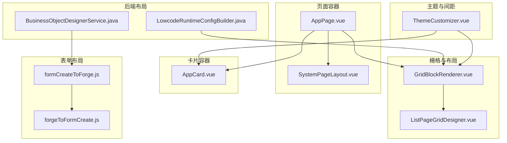
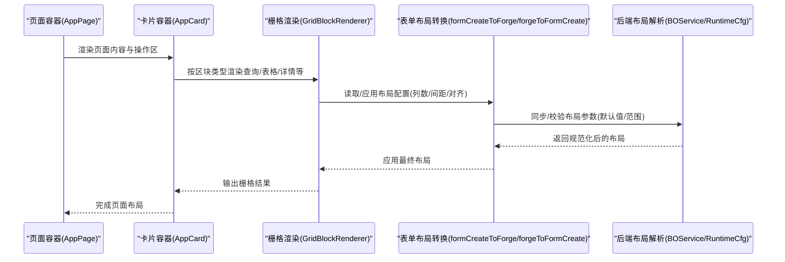
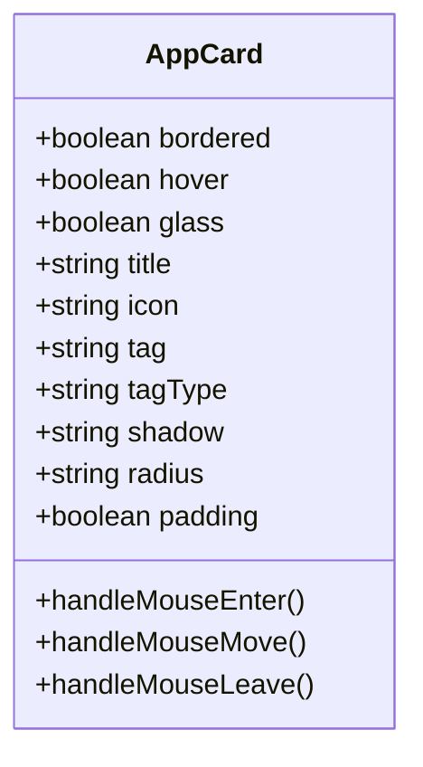
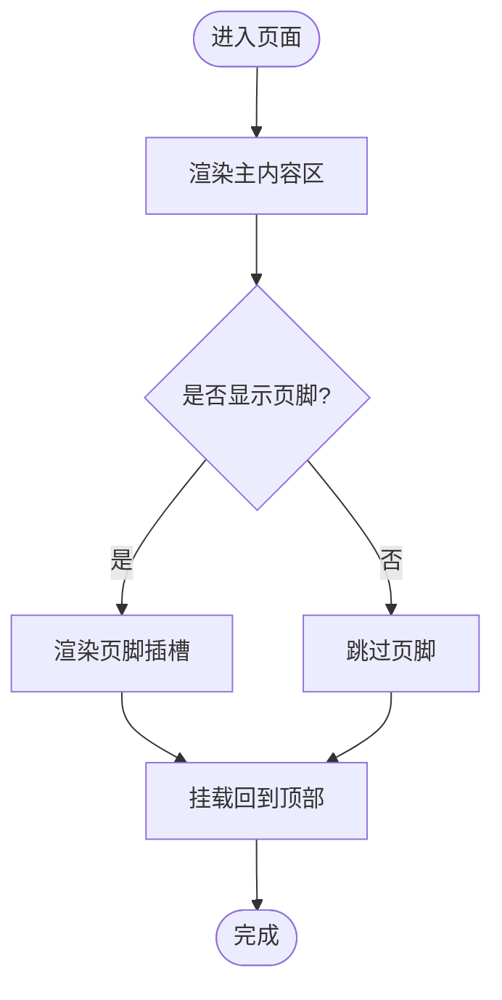
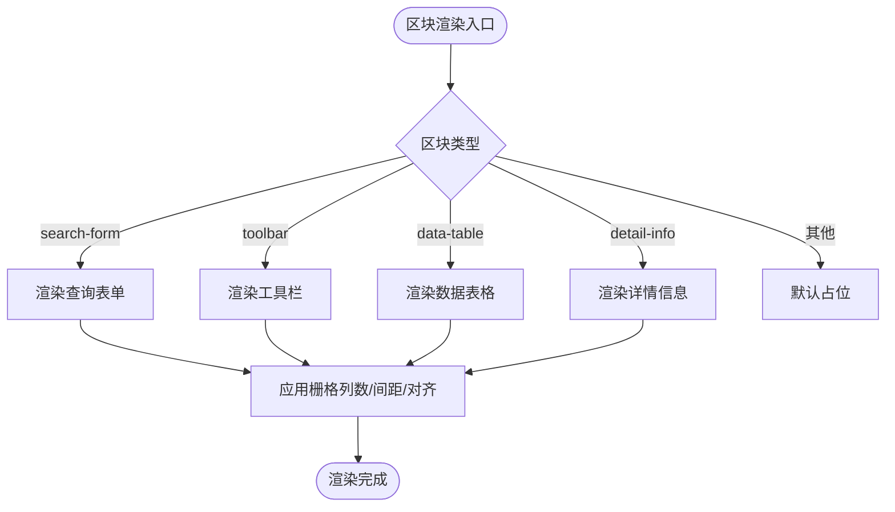
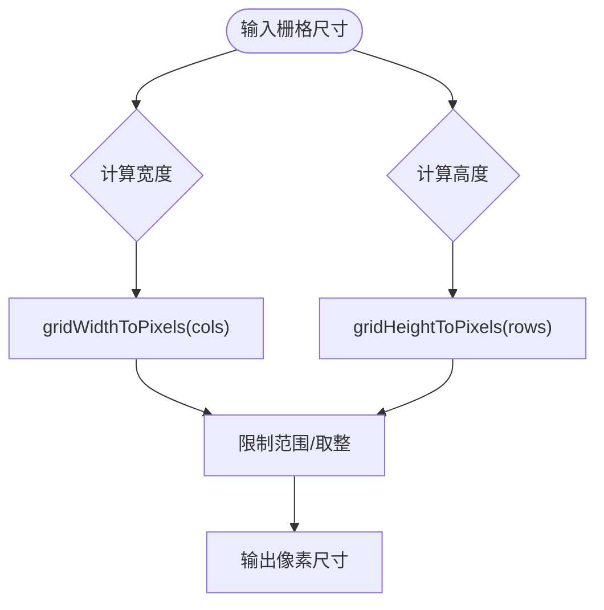
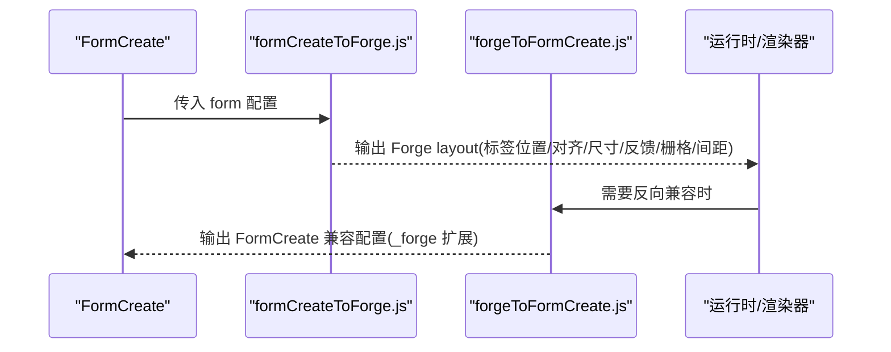
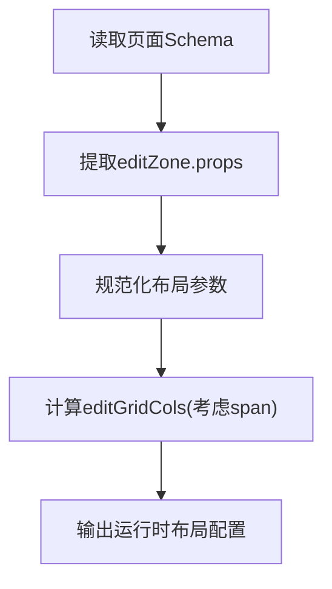
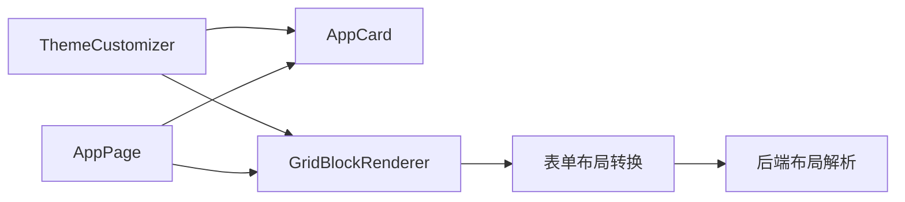

# 布局类组件

<cite>
**本文引用的文件**
- [AppCard.vue](file://forge-admin-ui/src/components/common/AppCard.vue)
- [AppPage.vue](file://forge-admin-ui/src/components/common/AppPage.vue)
- [SystemPageLayout.vue](file://forge-admin-ui/src/components/common/SystemPageLayout.vue)
- [GridBlockRenderer.vue](file://forge-admin-ui/src/components/lowcode-builder/page/GridBlockRenderer.vue)
- [ListPageGridDesigner.vue](file://forge-admin-ui/src/components/lowcode-builder/page/ListPageGridDesigner.vue)
- [ThemeCustomizer.vue](file://forge-admin-ui/src/components/common/ThemeCustomizer.vue)
- [formCreateToForge.js](file://forge-admin-ui/src/views/app-center/components/designer/form-first/formCreateToForge.js)
- [forgeToFormCreate.js](file://forge-admin-ui/src/views/app-center/components/designer/form-first/forgeToFormCreate.js)
- [BusinessObjectDesignerService.java](file://forge-server/forge-framework/forge-plugin-parent/forge-plugin-generator/src/main/java/com/mdframe/forge/plugin/generator/service/businessapp/BusinessObjectDesignerService.java)
- [LowcodeRuntimeConfigBuilder.java](file://forge-server/forge-framework/forge-plugin-generator/src/main/java/com/mdframe/forge/plugin/generator/service/lowcode/LowcodeRuntimeConfigBuilder.java)
</cite>

## 目录
1. [简介](#简介)
2. [项目结构](#项目结构)
3. [核心组件](#核心组件)
4. [架构总览](#架构总览)
5. [详细组件分析](#详细组件分析)
6. [依赖关系分析](#依赖关系分析)
7. [性能考虑](#性能考虑)
8. [故障排查指南](#故障排查指南)
9. [结论](#结论)
10. [附录](#附录)

## 简介
本技术文档聚焦于“布局类表单组件”，涵盖卡片容器、页面容器、表单布局等关键能力，系统性说明其实现原理与配置项。重点包括：
- 响应式布局与栅格系统：通过栅格列数、跨度、间距控制实现多端适配
- 间距控制：统一的 Padding/Margin 编辑与主题化间距体系
- 主题适配：基于 CSS 变量与主题定制器的全局样式切换
- 可访问性与 SEO：语义化标签、键盘可达性、无障碍属性
- 性能考量：渲染优化、懒加载、最小重排重绘策略
- 使用示例、最佳实践与常见问题解决方案

## 项目结构
前端布局相关能力主要分布在以下位置：
- 通用容器组件：AppCard（卡片）、AppPage（页面容器）、SystemPageLayout（系统页容器）
- 低代码栅格渲染：GridBlockRenderer（栅格区块渲染器）、ListPageGridDesigner（列表页栅格设计器）
- 表单布局与转换：formCreateToForge.js、forgeToFormCreate.js（表单布局配置互转）
- 后端布局解析：BusinessObjectDesignerService.java、LowcodeRuntimeConfigBuilder.java（服务端生成/计算布局参数）
- 主题与间距：ThemeCustomizer.vue（主题定制器，含间距缩放选项）

图表来源
- [AppPage.vue:1-25](file://forge-admin-ui/src/components/common/AppPage.vue#L1-L25)
- [SystemPageLayout.vue:1-25](file://forge-admin-ui/src/components/common/SystemPageLayout.vue#L1-L25)
- [AppCard.vue:1-245](file://forge-admin-ui/src/components/common/AppCard.vue#L1-L245)
- [GridBlockRenderer.vue:1-200](file://forge-admin-ui/src/components/lowcode-builder/page/GridBlockRenderer.vue#L1-L200)
- [ListPageGridDesigner.vue:6182-6210](file://forge-admin-ui/src/components/lowcode-builder/page/ListPageGridDesigner.vue#L6182-L6210)
- [formCreateToForge.js:292-315](file://forge-admin-ui/src/views/app-center/components/designer/form-first/formCreateToForge.js#L292-L315)
- [forgeToFormCreate.js:94-135](file://forge-admin-ui/src/views/app-center/components/designer/form-first/forgeToFormCreate.js#L94-L135)
- [BusinessObjectDesignerService.java:2158-2180](file://forge-server/forge-framework/forge-plugin-parent/forge-plugin-generator/src/main/java/com/mdframe/forge/plugin/generator/service/businessapp/BusinessObjectDesignerService.java#L2158-L2180)
- [LowcodeRuntimeConfigBuilder.java:392-414](file://forge-server/forge-framework/forge-plugin-generator/src/main/java/com/mdframe/forge/plugin/generator/service/lowcode/LowcodeRuntimeConfigBuilder.java#L392-L414)

章节来源
- [AppPage.vue:1-25](file://forge-admin-ui/src/components/common/AppPage.vue#L1-L25)
- [SystemPageLayout.vue:1-25](file://forge-admin-ui/src/components/common/SystemPageLayout.vue#L1-L25)
- [AppCard.vue:1-245](file://forge-admin-ui/src/components/common/AppCard.vue#L1-L245)
- [GridBlockRenderer.vue:1-200](file://forge-admin-ui/src/components/lowcode-builder/page/GridBlockRenderer.vue#L1-L200)
- [ListPageGridDesigner.vue:6182-6210](file://forge-admin-ui/src/components/lowcode-builder/page/ListPageGridDesigner.vue#L6182-L6210)
- [formCreateToForge.js:292-315](file://forge-admin-ui/src/views/app-center/components/designer/form-first/formCreateToForge.js#L292-L315)
- [forgeToFormCreate.js:94-135](file://forge-admin-ui/src/views/app-center/components/designer/form-first/forgeToFormCreate.js#L94-L135)
- [BusinessObjectDesignerService.java:2158-2180](file://forge-server/forge-framework/forge-plugin-parent/forge-plugin-generator/src/main/java/com/mdframe/forge/plugin/generator/service/businessapp/BusinessObjectDesignerService.java#L2158-L2180)
- [LowcodeRuntimeConfigBuilder.java:392-414](file://forge-server/forge-framework/forge-plugin-generator/src/main/java/com/mdframe/forge/plugin/generator/service/lowcode/LowcodeRuntimeConfigBuilder.java#L392-L414)

## 核心组件
- 卡片容器 AppCard：提供标题、图标、标签、阴影、圆角、边框、悬停、玻璃态等视觉与交互能力；支持头部、主体、底部插槽，便于组合复杂内容。
- 页面容器 AppPage：统一页面背景、滚动、回顶、页脚展示；支持全屏模式与自定义页脚插槽。
- 系统页容器 SystemPageLayout：为系统级页面提供全高、最小高度与背景色，确保内容区域占满视口。
- 栅格渲染 GridBlockRenderer：根据区块类型渲染查询表单、工具栏、数据表格、详情信息等；栅格列数、行高、对齐方式由区块属性驱动。
- 列表页栅格设计器 ListPageGridDesigner：提供栅格宽度、高度到像素的换算逻辑，以及 CSS 数值解析，支撑画布与预览的一致性。
- 表单布局转换 formCreateToForge.js / forgeToFormCreate.js：在 FormCreate 与 Forge 之间双向映射布局配置（标签位置、对齐、尺寸、反馈、栅格列数、行列间距等）。
- 后端布局解析 BusinessObjectDesignerService.java / LowcodeRuntimeConfigBuilder.java：从页面 Schema 中读取并规范化布局参数，计算运行时栅格列数。

章节来源
- [AppCard.vue:1-245](file://forge-admin-ui/src/components/common/AppCard.vue#L1-L245)
- [AppPage.vue:1-25](file://forge-admin-ui/src/components/common/AppPage.vue#L1-L25)
- [SystemPageLayout.vue:1-25](file://forge-admin-ui/src/components/common/SystemPageLayout.vue#L1-L25)
- [GridBlockRenderer.vue:1-200](file://forge-admin-ui/src/components/lowcode-builder/page/GridBlockRenderer.vue#L1-L200)
- [ListPageGridDesigner.vue:6182-6210](file://forge-admin-ui/src/components/lowcode-builder/page/ListPageGridDesigner.vue#L6182-L6210)
- [formCreateToForge.js:292-315](file://forge-admin-ui/src/views/app-center/components/designer/form-first/formCreateToForge.js#L292-L315)
- [forgeToFormCreate.js:94-135](file://forge-admin-ui/src/views/app-center/components/designer/form-first/forgeToFormCreate.js#L94-L135)
- [BusinessObjectDesignerService.java:2158-2180](file://forge-server/forge-framework/forge-plugin-parent/forge-plugin-generator/src/main/java/com/mdframe/forge/plugin/generator/service/businessapp/BusinessObjectDesignerService.java#L2158-L2180)
- [LowcodeRuntimeConfigBuilder.java:392-414](file://forge-server/forge-framework/forge-plugin-generator/src/main/java/com/mdframe/forge/plugin/generator/service/lowcode/LowcodeRuntimeConfigBuilder.java#L392-L414)

## 架构总览
布局体系以“页面容器 -> 卡片容器 -> 栅格区块”的分层组织，配合“表单布局配置”与“后端布局解析”形成端到端的布局能力。主题定制器贯穿各层，提供一致的间距与视觉风格。

图表来源
- [AppPage.vue:1-25](file://forge-admin-ui/src/components/common/AppPage.vue#L1-L25)
- [AppCard.vue:1-245](file://forge-admin-ui/src/components/common/AppCard.vue#L1-L245)
- [GridBlockRenderer.vue:1-200](file://forge-admin-ui/src/components/lowcode-builder/page/GridBlockRenderer.vue#L1-L200)
- [formCreateToForge.js:292-315](file://forge-admin-ui/src/views/app-center/components/designer/form-first/formCreateToForge.js#L292-L315)
- [forgeToFormCreate.js:94-135](file://forge-admin-ui/src/views/app-center/components/designer/form-first/forgeToFormCreate.js#L94-L135)
- [BusinessObjectDesignerService.java:2158-2180](file://forge-server/forge-framework/forge-plugin-generator/src/main/java/com/mdframe/forge/plugin/generator/service/businessapp/BusinessObjectDesignerService.java#L2158-L2180)
- [LowcodeRuntimeConfigBuilder.java:392-414](file://forge-server/forge-framework/forge-plugin-generator/src/main/java/com/mdframe/forge/plugin/generator/service/lowcode/LowcodeRuntimeConfigBuilder.java#L392-L414)

## 详细组件分析

### 卡片容器 AppCard
- 功能要点
  - 标题区：支持标题、图标、标签、动作插槽
  - 主体区：可开关内边距，承载任意内容
  - 底部区：默认右对齐的操作区
  - 视觉：边框、阴影级别、圆角级别、悬停加深、玻璃态
  - 交互：鼠标追踪用于光晕效果（可选）
- 配置项
  - bordered/hover/glass/title/icon/tag/tagType/shadow/radius/padding
- 主题与样式
  - 使用 CSS 变量控制背景、边框、阴影、圆角、过渡
  - 暗色模式下玻璃态背景与边框自动适配
- 可访问性
  - 标题与图标组合提升可读性；操作区按钮需具备语义与焦点管理（由上层业务保证）
- 性能
  - 仅对必要元素添加事件监听；阴影与圆角动画使用过渡而非频繁重排

图表来源
- [AppCard.vue:1-245](file://forge-admin-ui/src/components/common/AppCard.vue#L1-L245)

章节来源
- [AppCard.vue:1-245](file://forge-admin-ui/src/components/common/AppCard.vue#L1-L245)

### 页面容器 AppPage
- 功能要点
  - 统一页面背景与滚动行为
  - 支持全屏模式与页脚插槽
  - 内置回到顶部按钮
- 配置项
  - full/showFooter
- 可访问性
  - 使用 main 语义标签，利于屏幕阅读器识别
- 性能
  - 轻量 DOM 结构，避免多余嵌套

图表来源
- [AppPage.vue:1-25](file://forge-admin-ui/src/components/common/AppPage.vue#L1-L25)

章节来源
- [AppPage.vue:1-25](file://forge-admin-ui/src/components/common/AppPage.vue#L1-L25)

### 系统页容器 SystemPageLayout
- 功能要点
  - 提供系统级页面的全高容器与背景色
  - 子元素高度自适应，确保内容填满可视区域
- 适用场景
  - 后台管理系统主内容区、全屏工作区

章节来源
- [SystemPageLayout.vue:1-25](file://forge-admin-ui/src/components/common/SystemPageLayout.vue#L1-L25)

### 栅格渲染 GridBlockRenderer
- 功能要点
  - 根据 blockType 渲染不同区块：查询表单、工具栏、返回按钮、页面标题、数据表格、详情信息
  - 栅格列数、行高、对齐方式由区块属性驱动
  - 查询表单字段对齐、大小、禁用态等由字段元数据决定
- 栅格与间距
  - 列数：repeat(n, minmax(0, 1fr))
  - 行高/最小高度：根据子项累计或预设最小高度
  - 对齐：justifyItems/alignItems 控制单元格对齐
- 可访问性
  - 查询表单项使用 n-form-item 包裹，提供 label 与反馈开关
  - 空状态提示清晰，便于用户理解下一步操作
- 性能
  - 按需渲染区块；表格使用小尺寸与固定行高减少重排

图表来源
- [GridBlockRenderer.vue:1-200](file://forge-admin-ui/src/components/lowcode-builder/page/GridBlockRenderer.vue#L1-L200)

章节来源
- [GridBlockRenderer.vue:1-200](file://forge-admin-ui/src/components/lowcode-builder/page/GridBlockRenderer.vue#L1-L200)

### 列表页栅格设计器 ListPageGridDesigner
- 功能要点
  - 将栅格列数与行高转换为像素尺寸，保障画布与预览一致
  - 提供 CSS 数值解析，兼容数字与字符串单位
- 关键算法
  - gridWidthToPixels：列宽 × 列数 + 间隙
  - gridHeightToPixels：行高 × 行数 + 间隙
  - resolveCssNumber：安全解析 px 数值，失败回退默认值

图表来源
- [ListPageGridDesigner.vue:6182-6210](file://forge-admin-ui/src/components/lowcode-builder/page/ListPageGridDesigner.vue#L6182-L6210)

章节来源
- [ListPageGridDesigner.vue:6182-6210](file://forge-admin-ui/src/components/lowcode-builder/page/ListPageGridDesigner.vue#L6182-L6210)

### 表单布局配置转换
- 目标
  - 在 FormCreate 与 Forge 之间保持布局一致性：标签位置、对齐、尺寸、反馈、栅格列数、行列间距
- 关键点
  - formCreateToForge.js：将 FormCreate 的 form 配置映射为 Forge 的 layout 配置
  - forgeToFormCreate.js：反向映射，保留 _forge 扩展字段供运行时使用
  - 规则列 span 计算：基于 gridColumns 与 span 推导实际列宽

图表来源
- [formCreateToForge.js:292-315](file://forge-admin-ui/src/views/app-center/components/designer/form-first/formCreateToForge.js#L292-L315)
- [forgeToFormCreate.js:94-135](file://forge-admin-ui/src/views/app-center/components/designer/form-first/forgeToFormCreate.js#L94-L135)

章节来源
- [formCreateToForge.js:292-315](file://forge-admin-ui/src/views/app-center/components/designer/form-first/formCreateToForge.js#L292-L315)
- [forgeToFormCreate.js:94-135](file://forge-admin-ui/src/views/app-center/components/designer/form-first/forgeToFormCreate.js#L94-L135)

### 后端布局解析
- 目标
  - 从页面 Schema 中读取并规范化布局参数，确保前后端一致
- 关键点
  - BusinessObjectDesignerService.java：默认布局值、字段对齐、尺寸、反馈、栅格列数、行列间距
  - LowcodeRuntimeConfigBuilder.java：计算 editGridCols，结合画布栅格与规则 span 推导最大列数

图表来源
- [BusinessObjectDesignerService.java:2158-2180](file://forge-server/forge-framework/forge-plugin-generator/src/main/java/com/mdframe/forge/plugin/generator/service/businessapp/BusinessObjectDesignerService.java#L2158-L2180)
- [LowcodeRuntimeConfigBuilder.java:392-414](file://forge-server/forge-framework/forge-plugin-generator/src/main/java/com/mdframe/forge/plugin/generator/service/lowcode/LowcodeRuntimeConfigBuilder.java#L392-L414)

章节来源
- [BusinessObjectDesignerService.java:2158-2180](file://forge-server/forge-framework/forge-plugin-generator/src/main/java/com/mdframe/forge/plugin/generator/service/businessapp/BusinessObjectDesignerService.java#L2158-L2180)
- [LowcodeRuntimeConfigBuilder.java:392-414](file://forge-server/forge-framework/forge-plugin-generator/src/main/java/com/mdframe/forge/plugin/generator/service/lowcode/LowcodeRuntimeConfigBuilder.java#L392-L414)

### 主题与间距
- 主题定制器 ThemeCustomizer.vue
  - 提供间距缩放选项，影响整体 UI 密度
  - 字体大小、颜色、阴影等可通过主题变量统一管理
- 与布局组件的关系
  - AppCard、GridBlockRenderer 等通过 CSS 变量与主题类名适配明暗主题与间距缩放

章节来源
- [ThemeCustomizer.vue:83-563](file://forge-admin-ui/src/components/common/ThemeCustomizer.vue#L83-L563)

## 依赖关系分析
- 组件耦合
  - AppPage 作为顶层容器，组合 SystemPageLayout、AppCard、GridBlockRenderer
  - GridBlockRenderer 依赖表单布局转换模块与后端布局解析结果
  - ThemeCustomizer 通过 CSS 变量影响所有布局组件
- 外部依赖
  - NView/NButton/NForm 等基础 UI 组件（由框架注入）
  - 主题系统与 UnoCSS/SCSS 变量（通过 CSS 变量与类名生效）

图表来源
- [ThemeCustomizer.vue:83-563](file://forge-admin-ui/src/components/common/ThemeCustomizer.vue#L83-L563)
- [AppPage.vue:1-25](file://forge-admin-ui/src/components/common/AppPage.vue#L1-L25)
- [AppCard.vue:1-245](file://forge-admin-ui/src/components/common/AppCard.vue#L1-L245)
- [GridBlockRenderer.vue:1-200](file://forge-admin-ui/src/components/lowcode-builder/page/GridBlockRenderer.vue#L1-L200)
- [formCreateToForge.js:292-315](file://forge-admin-ui/src/views/app-center/components/designer/form-first/formCreateToForge.js#L292-L315)
- [forgeToFormCreate.js:94-135](file://forge-admin-ui/src/views/app-center/components/designer/form-first/forgeToFormCreate.js#L94-L135)
- [BusinessObjectDesignerService.java:2158-2180](file://forge-server/forge-framework/forge-plugin-generator/src/main/java/com/mdframe/forge/plugin/generator/service/businessapp/BusinessObjectDesignerService.java#L2158-L2180)

章节来源
- [ThemeCustomizer.vue:83-563](file://forge-admin-ui/src/components/common/ThemeCustomizer.vue#L83-L563)
- [AppPage.vue:1-25](file://forge-admin-ui/src/components/common/AppPage.vue#L1-L25)
- [AppCard.vue:1-245](file://forge-admin-ui/src/components/common/AppCard.vue#L1-L245)
- [GridBlockRenderer.vue:1-200](file://forge-admin-ui/src/components/lowcode-builder/page/GridBlockRenderer.vue#L1-L200)
- [formCreateToForge.js:292-315](file://forge-admin-ui/src/views/app-center/components/designer/form-first/formCreateToForge.js#L292-L315)
- [forgeToFormCreate.js:94-135](file://forge-admin-ui/src/views/app-center/components/designer/form-first/forgeToFormCreate.js#L94-L135)
- [BusinessObjectDesignerService.java:2158-2180](file://forge-server/forge-framework/forge-plugin-generator/src/main/java/com/mdframe/forge/plugin/generator/service/businessapp/BusinessObjectDesignerService.java#L2158-L2180)

## 性能考虑
- 渲染优化
  - 栅格区块按需渲染，避免无关节点参与布局计算
  - 表格使用小尺寸与固定行高，降低重排成本
- 样式与主题
  - 大量使用 CSS 变量，减少 JS 计算与频繁更新
  - 阴影与圆角动画采用 transition，避免强制同步布局
- 交互事件
  - 仅在必要时绑定鼠标事件（如卡片光效），并在离开时清理状态
- 数据流
  - 表单布局转换尽量纯函数化，减少副作用与重复计算

[本节为通用指导，不直接分析具体文件]

## 故障排查指南
- 栅格错位或溢出
  - 检查区块的 columns/span 设置是否超出范围；确认 gap 与 cellMinHeight 合理
  - 参考栅格像素换算逻辑，核对画布与预览一致性
- 表单标签对齐异常
  - 确认 labelPlacement/labelAlign 与 size 配置正确；检查后端默认值与运行时计算
- 主题切换后样式错乱
  - 检查 CSS 变量是否被覆盖；确认 dark 类名是否正确应用
- 页脚未显示或遮挡
  - 检查 AppPage 的 showFooter 与父容器高度；确认 footer 插槽内容未设置绝对定位导致遮挡

章节来源
- [ListPageGridDesigner.vue:6182-6210](file://forge-admin-ui/src/components/lowcode-builder/page/ListPageGridDesigner.vue#L6182-L6210)
- [formCreateToForge.js:292-315](file://forge-admin-ui/src/views/app-center/components/designer/form-first/formCreateToForge.js#L292-L315)
- [forgeToFormCreate.js:94-135](file://forge-admin-ui/src/views/app-center/components/designer/form-first/forgeToFormCreate.js#L94-L135)
- [AppPage.vue:1-25](file://forge-admin-ui/src/components/common/AppPage.vue#L1-L25)

## 结论
本布局体系通过“页面容器 -> 卡片容器 -> 栅格区块”的分层设计与“表单布局转换 + 后端解析”的双向能力，实现了灵活的响应式布局、统一的间距与主题控制。结合可访问性与性能优化策略，可在多端场景下提供稳定、一致的用户体验。建议在实际项目中：
- 优先使用栅格与间距变量进行布局，避免硬编码像素
- 利用主题定制器统一管理视觉与密度
- 关注表单布局配置的合法性与范围约束，避免运行时异常
- 在复杂页面中拆分区块，提升可维护性与渲染性能

[本节为总结性内容，不直接分析具体文件]

## 附录
- 使用示例
  - 页面容器：使用 AppPage 包裹页面内容，按需启用页脚与全屏模式
  - 卡片容器：使用 AppCard 组织标题、主体与底部操作，灵活配置阴影与圆角
  - 栅格区块：在低代码设计中配置区块类型与栅格属性，自动生成查询表单、表格与详情
- 最佳实践
  - 使用统一的间距与主题变量，避免散落的魔法数字
  - 表单布局配置集中在设计器中维护，前后端保持一致
  - 栅格列数与跨度遵循 1~N 的范围约束，避免溢出
- 常见问题
  - 移动端适配：调整 gridColumns 与 span，确保在小屏下可读性
  - 主题兼容性：确保 dark 模式下关键对比度足够，必要时覆盖局部样式

[本节为补充说明，不直接分析具体文件]