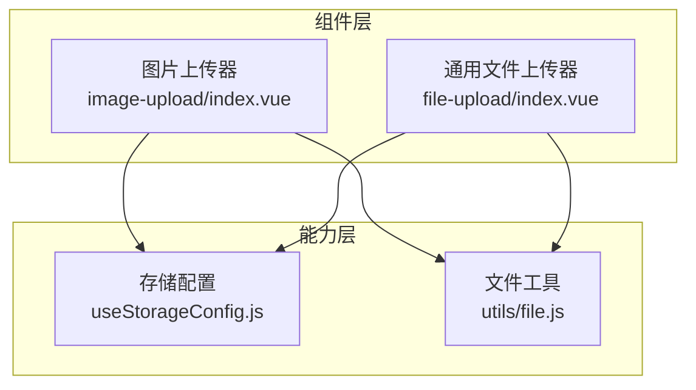
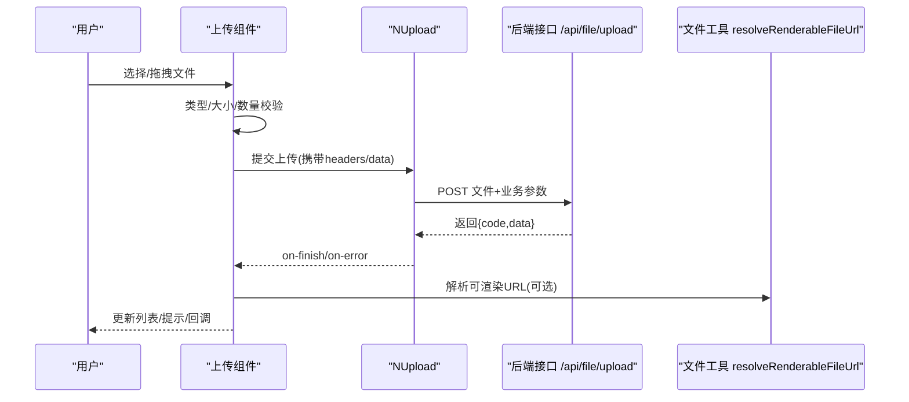
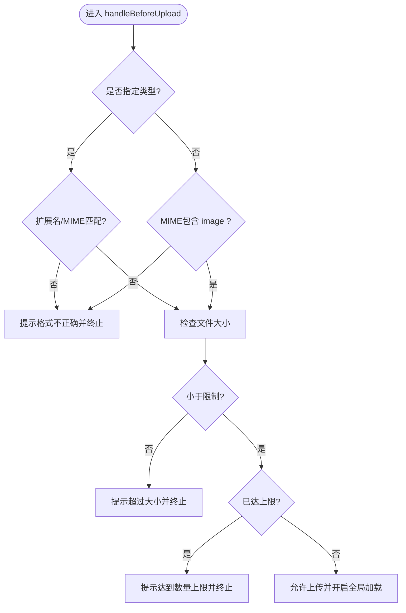
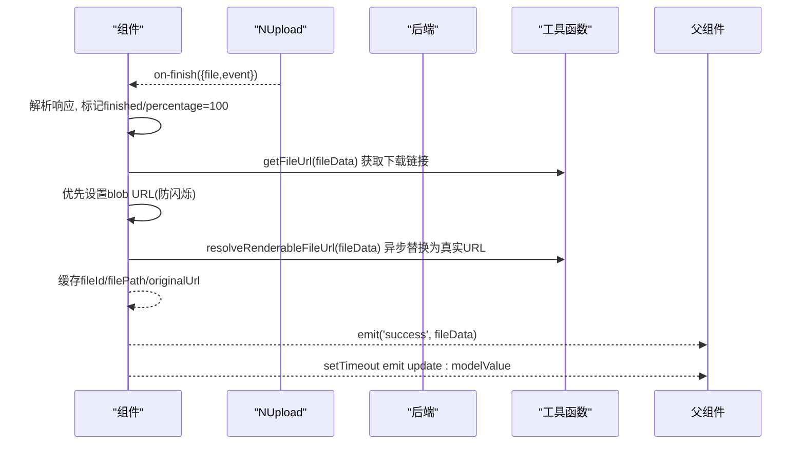
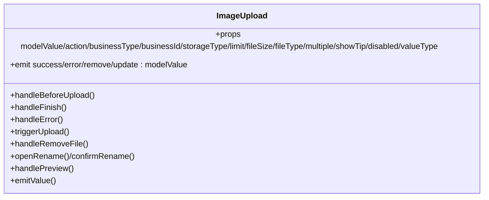
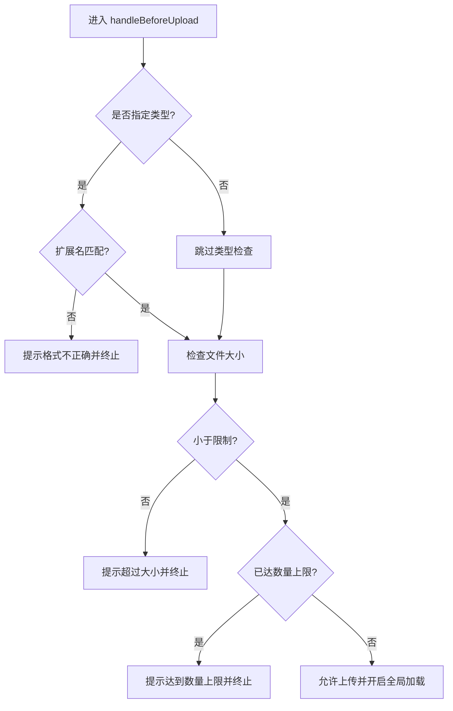
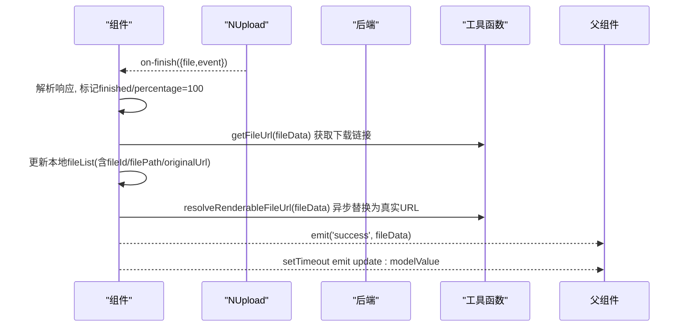
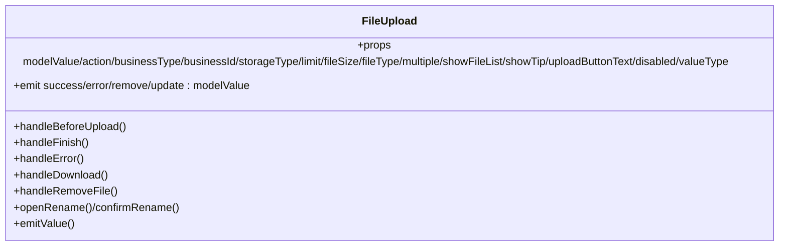
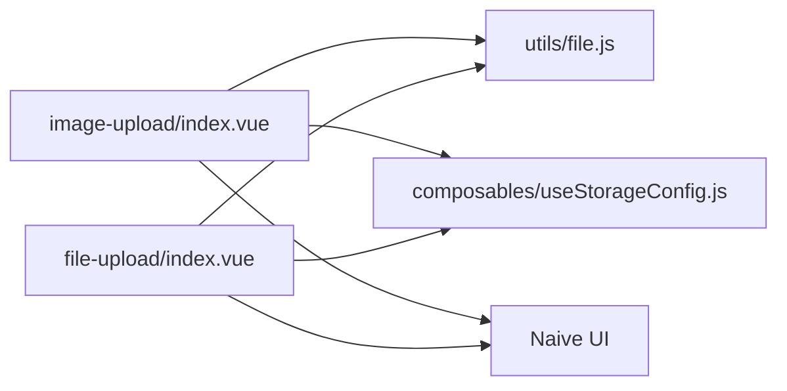

# 文件上传组件

<cite>
**本文引用的文件**
- [image-upload/index.vue](file://forge-admin-ui/src/components/image-upload/index.vue)
- [file-upload/index.vue](file://forge-admin-ui/src/components/file-upload/index.vue)
- [useStorageConfig.js](file://forge-admin-ui/src/composables/useStorageConfig.js)
- [file.js](file://forge-admin-ui/src/utils/file.js)
</cite>

## 目录
1. [简介](#简介)
2. [项目结构](#项目结构)
3. [核心组件](#核心组件)
4. [架构总览](#架构总览)
5. [详细组件分析](#详细组件分析)
6. [依赖关系分析](#依赖关系分析)
7. [性能与体验优化](#性能与体验优化)
8. [故障排查指南](#故障排查指南)
9. [结论](#结论)
10. [附录：配置项与使用示例](#附录：配置项与使用示例)

## 简介
本技术文档围绕前端文件上传能力，系统梳理并说明“图片上传器”和“通用文件上传器”的实现原理、配置选项与最佳实践。内容涵盖：
- 多文件上传、拖拽/点击触发、预览与重命名
- 文件类型校验、大小限制、数量限制
- 进度显示、全局加载态、错误处理与重试提示
- 存储策略（本地/MinIO/OSS）与可访问 URL 解析
- 返回值格式（字符串/数组/对象）与表单双向绑定
- 常见问题定位与解决方案

## 项目结构
与文件上传相关的核心代码位于前端工程 forge-admin-ui 的 components 与 utils 目录中：
- 图片上传器：components/image-upload/index.vue
- 通用文件上传器：components/file-upload/index.vue
- 存储配置读取：composables/useStorageConfig.js
- 文件 URL 解析与下载工具：utils/file.js

图表来源
- [image-upload/index.vue:112-224](file://forge-admin-ui/src/components/image-upload/index.vue#L112-L224)
- [file-upload/index.vue:110-318](file://forge-admin-ui/src/components/file-upload/index.vue#L110-L318)
- [useStorageConfig.js](file://forge-admin-ui/src/composables/useStorageConfig.js)
- [file.js:84-343](file://forge-admin-ui/src/utils/file.js#L84-L343)

章节来源
- [image-upload/index.vue:1-110](file://forge-admin-ui/src/components/image-upload/index.vue#L1-L110)
- [file-upload/index.vue:1-108](file://forge-admin-ui/src/components/file-upload/index.vue#L1-L108)

## 核心组件
- 图片上传器
  - 面向图片场景，提供缩略图网格展示、预览、删除、重命名、上传进度等能力
  - 支持多文件、数量限制、类型与大小校验、禁用态
  - 返回值支持字符串或数组两种模式
- 通用文件上传器
  - 面向任意文件类型，提供拖拽/点击上传区、文件卡片列表、图标与元信息展示、下载、删除、重命名
  - 支持多文件、数量限制、类型与大小校验、禁用态
  - 返回值支持字符串、数组、对象三种模式

章节来源
- [image-upload/index.vue:112-183](file://forge-admin-ui/src/components/image-upload/index.vue#L112-L183)
- [file-upload/index.vue:127-199](file://forge-admin-ui/src/components/file-upload/index.vue#L127-L199)

## 架构总览
两个组件均基于 Naive UI 的 NUpload 进行封装，统一通过认证头、业务参数与存储类型透传至后端；文件 URL 通过工具函数统一解析为可渲染地址，保障跨存储后端的访问一致性。

图表来源
- [image-upload/index.vue:296-442](file://forge-admin-ui/src/components/image-upload/index.vue#L296-L442)
- [file-upload/index.vue:420-537](file://forge-admin-ui/src/components/file-upload/index.vue#L420-L537)
- [file.js:251-307](file://forge-admin-ui/src/utils/file.js#L251-L307)

## 详细组件分析

### 图片上传器（ImageUpload）
- 功能要点
  - 自定义图片列表：上传中（圆形进度）、完成（预览/重命名/删除）、失败（错误态）
  - 隐藏 NUpload 作为实际上传载体，通过 ref 触发原生 input 点击
  - 上传前校验：类型、大小、数量；失败时给出明确提示
  - 上传完成：优先使用本地 blob URL 避免闪烁，再异步替换为可渲染 URL
  - 预览：弹窗查看大图
  - 重命名：调用后端元数据接口更新文件名
  - 值同步：根据 valueType 输出逗号分隔字符串或数组
- 关键流程（上传前校验）

图表来源
- [image-upload/index.vue:296-338](file://forge-admin-ui/src/components/image-upload/index.vue#L296-L338)

- 关键流程（上传完成与回显）

图表来源
- [image-upload/index.vue:363-442](file://forge-admin-ui/src/components/image-upload/index.vue#L363-L442)
- [file.js:84-176](file://forge-admin-ui/src/utils/file.js#L84-L176)
- [file.js:251-307](file://forge-admin-ui/src/utils/file.js#L251-L307)

- 类与方法概览（概念性）

图表来源
- [image-upload/index.vue:112-625](file://forge-admin-ui/src/components/image-upload/index.vue#L112-L625)

章节来源
- [image-upload/index.vue:1-763](file://forge-admin-ui/src/components/image-upload/index.vue#L1-L763)

### 通用文件上传器（FileUpload）
- 功能要点
  - 自定义拖拽/点击上传区，支持多文件、数量限制、类型与大小校验
  - 文件卡片列表：图标按类型着色，显示名称、大小、扩展名、状态
  - 下载：通过工具函数下载，避免直接打开丢失鉴权
  - 删除与重命名：与图片上传器一致
  - 值同步：支持字符串、数组、对象三种返回值
- 关键流程（上传前校验）

图表来源
- [file-upload/index.vue:420-451](file://forge-admin-ui/src/components/file-upload/index.vue#L420-L451)

- 关键流程（上传完成与回显）

图表来源
- [file-upload/index.vue:476-537](file://forge-admin-ui/src/components/file-upload/index.vue#L476-L537)
- [file.js:84-176](file://forge-admin-ui/src/utils/file.js#L84-L176)
- [file.js:251-307](file://forge-admin-ui/src/utils/file.js#L251-L307)

- 类与方法概览（概念性）

图表来源
- [file-upload/index.vue:110-708](file://forge-admin-ui/src/components/file-upload/index.vue#L110-L708)

章节来源
- [file-upload/index.vue:1-800](file://forge-admin-ui/src/components/file-upload/index.vue#L1-L800)

## 依赖关系分析
- 组件对工具函数的依赖
  - 文件 URL 解析与下载：resolveRenderableFileUrl、downloadFile、getFileUrl
  - 全局加载：startGlobalLoading/finishGlobalLoading
  - 存储配置：useStorageConfig（服务端默认 storageType、fileSize）
- 组件对外部库的依赖
  - Naive UI：NUpload、NIcon、NModal、NProgress、NText、NInput
  - 图标库：@vicons/ionicons5

图表来源
- [image-upload/index.vue:112-224](file://forge-admin-ui/src/components/image-upload/index.vue#L112-L224)
- [file-upload/index.vue:110-318](file://forge-admin-ui/src/components/file-upload/index.vue#L110-L318)
- [file.js:84-343](file://forge-admin-ui/src/utils/file.js#L84-L343)
- [useStorageConfig.js](file://forge-admin-ui/src/composables/useStorageConfig.js)

章节来源
- [image-upload/index.vue:112-224](file://forge-admin-ui/src/components/image-upload/index.vue#L112-L224)
- [file-upload/index.vue:110-318](file://forge-admin-ui/src/components/file-upload/index.vue#L110-L318)
- [file.js:84-343](file://forge-admin-ui/src/utils/file.js#L84-L343)

## 性能与体验优化
- 首屏与上传中的视觉反馈
  - 上传中显示圆形进度与全局加载提示，提升感知度
  - 上传完成后优先使用本地 blob URL 立即展示，再异步替换为可渲染 URL，减少闪烁
- 列表与状态管理
  - 使用唯一 id 标识文件，避免 Naive UI 覆盖导致的状态丢失
  - 通过 Map 缓存文件属性，防止被框架覆盖
- 网络与鉴权
  - 请求头携带 Authorization、时间戳与随机数，保证鉴权与幂等
  - 下载通过工具函数统一处理，避免直接打开链接丢失 token
- 资源与体积
  - 按需引入图标与组件，减少打包体积
  - 图片缩略图与预览分离，降低带宽占用

[本节为通用指导，不直接引用具体文件]

## 故障排查指南
- 上传成功但无法预览
  - 检查 resolveRenderableFileUrl 是否正确解析 fileId/filePath
  - 确认后端返回的 data 字段完整（fileId、filePath、originalName 等）
- 上传失败提示不明确
  - 检查 on-error 与 on-finish 的错误分支，确保从响应中正确提取 msg/message
  - 在浏览器控制台查看 Network 响应体
- 类型/大小/数量校验未生效
  - 确认 fileType、fileSize、limit 配置正确传入
  - 注意 accept 仅影响选择器过滤，仍需在前端做二次校验
- 下载失败或无权限
  - 使用 downloadFile 而非直接打开 URL，确保携带鉴权信息
- 重命名失败
  - 检查后端元数据接口路径与参数编码是否正确
  - 捕获异常并提示用户

章节来源
- [image-upload/index.vue:444-508](file://forge-admin-ui/src/components/image-upload/index.vue#L444-L508)
- [file-upload/index.vue:539-703](file://forge-admin-ui/src/components/file-upload/index.vue#L539-L703)

## 结论
图片上传器与通用文件上传器以统一的上传协议与工具链为基础，提供了完善的校验、进度、预览、重命名与下载能力。通过存储配置与 URL 解析抽象，组件可无缝适配多种后端存储策略。建议在实际项目中结合业务场景合理配置 fileType、fileSize、limit 与 valueType，以获得最佳的用户体验与可维护性。

[本节为总结性内容，不直接引用具体文件]

## 附录：配置项与使用示例

### 图片上传器（ImageUpload）常用配置
- modelValue：支持字符串（逗号分隔）或数组
- action：上传接口路径，默认 /api/file/upload
- businessType/businessId：业务上下文标识
- storageType：存储类型（local/minio/oss），为空则使用服务端默认
- limit：最大文件数，默认 5
- fileSize：单文件大小限制（MB），默认 5
- fileType：允许的图片扩展名，默认 ['png','jpg','jpeg','webp','gif']
- multiple：是否多选，默认 true
- showTip：是否显示提示信息，默认 true
- disabled：是否禁用，默认 false
- valueType：返回值类型 string/array，默认 string

使用示例（概念性）
- 绑定 v-model 到表单字段，提交时发送字符串或数组
- 通过 @success/@error 监听上传结果
- 通过暴露方法 submit/clear/triggerUpload 控制行为

章节来源
- [image-upload/index.vue:121-183](file://forge-admin-ui/src/components/image-upload/index.vue#L121-L183)
- [image-upload/index.vue:611-625](file://forge-admin-ui/src/components/image-upload/index.vue#L611-L625)

### 通用文件上传器（FileUpload）常用配置
- modelValue：支持字符串、数组或对象数组
- action：上传接口路径，默认 /api/file/upload
- businessType/businessId：业务上下文标识
- storageType：存储类型（local/minio/oss），为空则使用服务端默认
- limit：最大文件数，默认 5
- fileSize：单文件大小限制（MB），默认 10
- fileType：允许的扩展名数组，默认空（不限）
- multiple：是否多选，默认 true
- showFileList：是否显示文件列表，默认 true
- showTip：是否显示提示信息，默认 true
- uploadButtonText：上传按钮文案，默认 “选择文件”
- disabled：是否禁用，默认 false
- valueType：返回值类型 string/array/object，默认 string

使用示例（概念性）
- 绑定 v-model 到表单字段，提交时发送字符串、数组或对象数组
- 通过 @success/@error 监听上传结果
- 通过暴露方法 submit/clear 控制行为

章节来源
- [file-upload/index.vue:127-199](file://forge-admin-ui/src/components/file-upload/index.vue#L127-L199)
- [file-upload/index.vue:669-676](file://forge-admin-ui/src/components/file-upload/index.vue#L669-L676)

### 存储策略与 URL 解析
- 存储类型由组件 props.storageType 或 useStorageConfig 提供的服务端默认决定
- 文件 URL 通过 getFileUrl 生成下载链接，通过 resolveRenderableFileUrl 解析为可渲染地址（考虑鉴权与过期）
- 下载统一通过 downloadFile 实现，避免直接打开链接导致的鉴权问题

章节来源
- [useStorageConfig.js](file://forge-admin-ui/src/composables/useStorageConfig.js)
- [file.js:84-176](file://forge-admin-ui/src/utils/file.js#L84-L176)
- [file.js:251-307](file://forge-admin-ui/src/utils/file.js#L251-L307)
- [file.js:307-343](file://forge-admin-ui/src/utils/file.js#L307-L343)