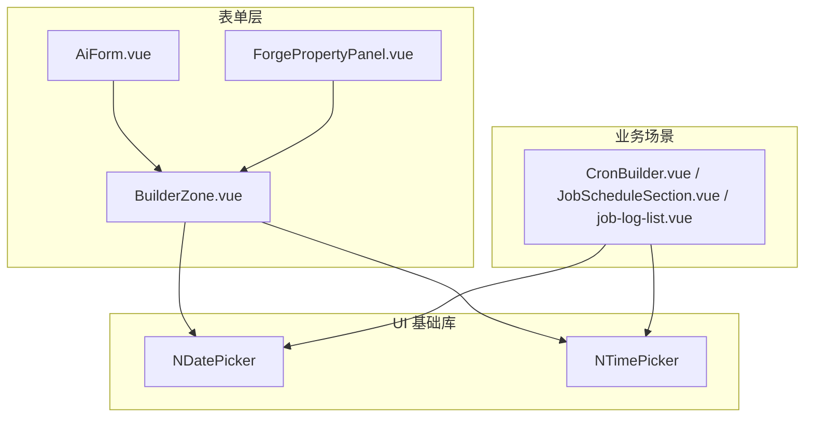
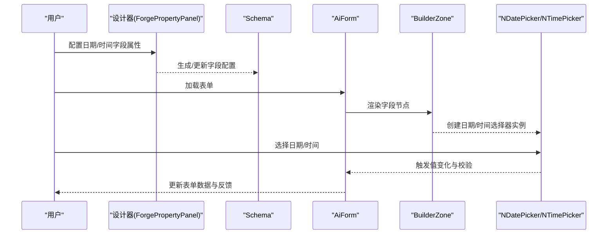
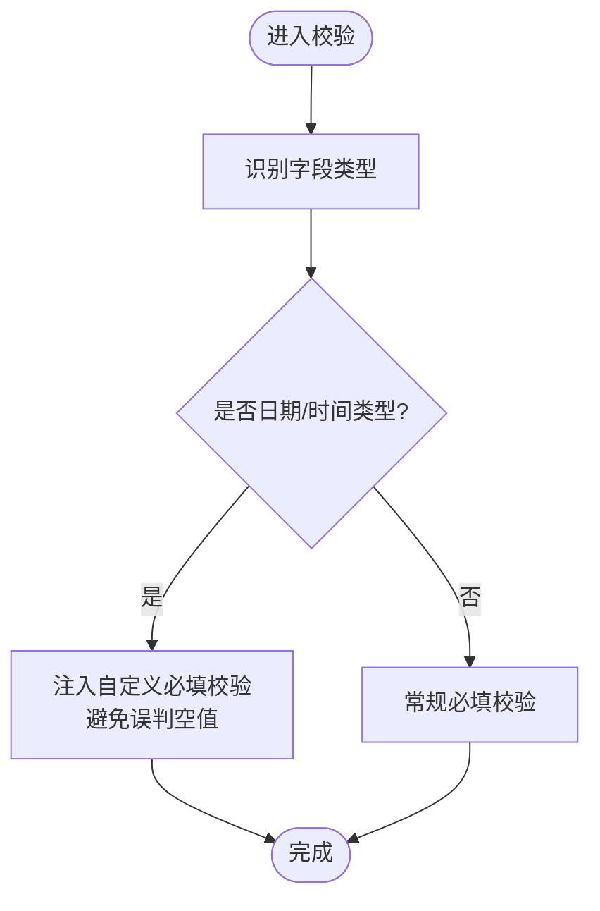
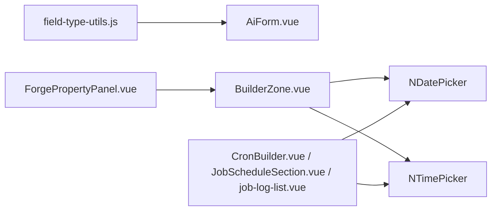

# 日期时间组件

<cite>
**本文引用的文件**
- [AiForm.vue](file://forge-admin-ui/src/components/ai-form/AiForm.vue)
- [field-type-utils.js](file://forge-admin-ui/src/components/ai-form/field-type-utils.js)
- [ForgePropertyPanel.vue](file://forge-admin-ui/src/views/app-center/components/designer/forge-form-designer/ForgePropertyPanel.vue)
- [BuilderZone.vue](file://forge-admin-ui/src/components/lowcode-builder/page/BuilderZone.vue)
- [CronBuilder.vue](file://forge-admin-ui/src/components/job/CronBuilder.vue)
- [JobScheduleSection.vue](file://forge-admin-ui/src/views/system/job-config/components/JobScheduleSection.vue)
- [job-log-list.vue](file://forge-admin-ui/src/views/system/job-log-list.vue)
</cite>

## 目录
1. [简介](#简介)
2. [项目结构](#项目结构)
3. [核心组件](#核心组件)
4. [架构总览](#架构总览)
5. [详细组件分析](#详细组件分析)
6. [依赖关系分析](#依赖关系分析)
7. [性能考量](#性能考量)
8. [故障排查指南](#故障排查指南)
9. [结论](#结论)
10. [附录](#附录)

## 简介
本技术文档聚焦于“日期时间类表单组件”的实现与使用，覆盖日期选择器、时间选择器、日期时间范围选择器等在低代码表单中的渲染、配置、验证、默认值、禁用状态、时区处理、格式化输出、本地化支持与快捷键操作等主题。文档基于仓库中 ai-form 动态表单体系以及 Naive UI 的 NDatePicker/NTimePicker 集成进行说明，并结合设计器属性面板与页面构建器的实际用法，给出最佳实践与常见问题解决方案。

## 项目结构
本项目采用“动态 Schema + 运行时渲染”的表单架构：
- AiForm 作为统一入口，负责解析 schema、生成校验规则、管理字段可见性与事件。
- 通过 BuilderZone 等页面构建器将 NDatePicker/NTimePicker 等基础控件以虚拟节点方式注入到表单树中。
- 设计器 ForgePropertyPanel 暴露日期/时间字段的属性配置（如格式、占位符、是否显示时间等）。
- 业务页面（如任务调度、日志查询）直接使用 NDatePicker/NTimePicker 完成筛选或展示。

图表来源
- [AiForm.vue:1-120](file://forge-admin-ui/src/components/ai-form/AiForm.vue#L1-L120)
- [BuilderZone.vue:130-220](file://forge-admin-ui/src/components/lowcode-builder/page/BuilderZone.vue#L130-L220)
- [ForgePropertyPanel.vue:1270-1340](file://forge-admin-ui/src/views/app-center/components/designer/forge-form-designer/ForgePropertyPanel.vue#L1270-L1340)
- [CronBuilder.vue:70-100](file://forge-admin-ui/src/components/job/CronBuilder.vue#L70-L100)
- [JobScheduleSection.vue:40-80](file://forge-admin-ui/src/views/system/job-config/components/JobScheduleSection.vue#L40-L80)
- [job-log-list.vue:70-90](file://forge-admin-ui/src/views/system/job-log-list.vue#L70-L90)

章节来源
- [AiForm.vue:1-120](file://forge-admin-ui/src/components/ai-form/AiForm.vue#L1-L120)
- [BuilderZone.vue:130-220](file://forge-admin-ui/src/components/lowcode-builder/page/BuilderZone.vue#L130-L220)
- [ForgePropertyPanel.vue:1270-1340](file://forge-admin-ui/src/views/app-center/components/designer/forge-form-designer/ForgePropertyPanel.vue#L1270-L1340)

## 核心组件
- AiForm：统一表单容器，负责数据绑定、校验规则生成、字段可见性控制、事件分发与弹窗表单。
- BuilderZone：低代码页面构建器，动态创建 NDatePicker/NTimePicker 节点并挂载到表单树。
- ForgePropertyPanel：设计器属性面板，提供日期/时间字段的可视化配置（类型、格式、占位符、是否包含时间等）。
- 业务组件：CronBuilder、JobScheduleSection、job-log-list 等直接使用 Naive UI 的日期时间选择器完成筛选与展示。

章节来源
- [AiForm.vue:148-362](file://forge-admin-ui/src/components/ai-form/AiForm.vue#L148-L362)
- [BuilderZone.vue:130-220](file://forge-admin-ui/src/components/lowcode-builder/page/BuilderZone.vue#L130-L220)
- [ForgePropertyPanel.vue:1270-1340](file://forge-admin-ui/src/views/app-center/components/designer/forge-form-designer/ForgePropertyPanel.vue#L1270-L1340)
- [CronBuilder.vue:70-100](file://forge-admin-ui/src/components/job/CronBuilder.vue#L70-L100)
- [JobScheduleSection.vue:40-80](file://forge-admin-ui/src/views/system/job-config/components/JobScheduleSection.vue#L40-L80)
- [job-log-list.vue:70-90](file://forge-admin-ui/src/views/system/job-log-list.vue#L70-L90)

## 架构总览
下图展示了从 Schema 到 UI 渲染与交互的关键路径：Schema 由设计器产出，AiForm 解析并生成校验规则；BuilderZone 将日期/时间控件以虚拟节点形式注入；业务页面直接调用 Naive UI 的日期时间选择器。

图表来源
- [ForgePropertyPanel.vue:1270-1340](file://forge-admin-ui/src/views/app-center/components/designer/forge-form-designer/ForgePropertyPanel.vue#L1270-L1340)
- [AiForm.vue:348-477](file://forge-admin-ui/src/components/ai-form/AiForm.vue#L348-L477)
- [BuilderZone.vue:130-220](file://forge-admin-ui/src/components/lowcode-builder/page/BuilderZone.vue#L130-L220)

## 详细组件分析

### 日期时间字段识别与校验
- 日期时间类型识别：系统通过 isDateLikeType 判断 date/datetime/daterange/datetimerange/month/year/time/timerange 等类型，用于特殊校验逻辑（例如必填时的空值判定）。
- 数字/输入型字段识别：isNumberFieldType/isInputLikeFieldType 用于决定必填校验的触发时机与提示信息。
- 必填校验增强：对于日期/选择/数字类型，当 required 为真时，会注入自定义 validator，避免 0、空数组等有效值被误判为空。

图表来源
- [AiForm.vue:348-477](file://forge-admin-ui/src/components/ai-form/AiForm.vue#L348-L477)
- [field-type-utils.js:1-33](file://forge-admin-ui/src/components/ai-form/field-type-utils.js#L1-L33)

章节来源
- [AiForm.vue:348-477](file://forge-admin-ui/src/components/ai-form/AiForm.vue#L348-L477)
- [field-type-utils.js:1-33](file://forge-admin-ui/src/components/ai-form/field-type-utils.js#L1-L33)

### 设计器属性面板：日期/时间字段配置
- 选择器类型：支持 date、datetime、daterange、datetimerange、month、year、quarter、time、timerange 等。
- 格式化与占位符：
  - 日期类型占位符示例：yyyy-MM-dd
  - 时间类型占位符示例：HH:mm:ss
  - 日期时间类型占位符示例：yyyy-MM-dd HH:mm:ss
- 是否包含时间：针对 time/timerange 字段，面板提供开关控制是否显示时间部分。

章节来源
- [ForgePropertyPanel.vue:1270-1340](file://forge-admin-ui/src/views/app-center/components/designer/forge-form-designer/ForgePropertyPanel.vue#L1270-L1340)
- [ForgePropertyPanel.vue:4690-4705](file://forge-admin-ui/src/views/app-center/components/designer/forge-form-designer/ForgePropertyPanel.vue#L4690-L4705)

### 低代码构建器：动态注入日期/时间控件
- BuilderZone 在运行时根据节点类型动态创建 NDatePicker/NTimePicker，并将其挂载到表单布局中。
- 该方式使得日期/时间字段可以在拖拽式设计中快速装配，同时保持统一的校验与事件机制。

章节来源
- [BuilderZone.vue:130-220](file://forge-admin-ui/src/components/lowcode-builder/page/BuilderZone.vue#L130-L220)

### 业务场景中的日期时间选择器使用
- CronBuilder：结合 NTimePicker 实现定时任务的分钟级选择。
- JobScheduleSection：使用 NDatePicker 支持按日期筛选任务执行计划。
- job-log-list：使用 NDatePicker 进行日志时间范围筛选。

章节来源
- [CronBuilder.vue:70-100](file://forge-admin-ui/src/components/job/CronBuilder.vue#L70-L100)
- [JobScheduleSection.vue:40-80](file://forge-admin-ui/src/views/system/job-config/components/JobScheduleSection.vue#L40-L80)
- [job-log-list.vue:70-90](file://forge-admin-ui/src/views/system/job-log-list.vue#L70-L90)

### 时区处理与格式化输出
- 前端展示与交互：Naive UI 的 NDatePicker/NTimePicker 默认遵循浏览器本地时区与区域设置，适合大多数 C 端或内部管理系统场景。
- 后端存储建议：建议在服务端统一转换为 UTC 存储，或在入库前明确时区偏移，避免跨时区显示差异。
- 格式化策略：
  - 展示层：依据设计器配置的 format/placeholder 进行本地化显示。
  - 传输层：建议使用 ISO 8601 字符串或带时区的时间戳，确保一致性。
- 注意事项：若涉及跨时区报表或历史数据对比，应在查询层显式指定时区上下文。

[本节为通用指导，不直接分析具体文件]

### 本地化支持与快捷键
- 本地化：Naive UI 提供国际化资源，可在应用初始化时切换语言，从而改变日期/时间选择器的文案与日历本地化。
- 快捷键：NDatePicker/NTimePicker 支持键盘导航与快捷操作（如上下键移动、回车确认、Esc 关闭等），提升可访问性与效率。
- 建议：在表单中开启无障碍提示与键盘可达性，确保不同输入习惯的用户均可高效操作。

[本节为通用指导，不直接分析具体文件]

### 验证规则、默认值与禁用状态
- 验证规则：
  - 必填：对日期/时间类型启用自定义必填校验，避免 0、空数组等误判。
  - 范围：可通过 rules 配置最小/最大日期或时间范围约束。
  - 自定义：支持正则、函数校验器，满足复杂业务规则。
- 默认值：
  - 可在 schema 中为日期/时间字段设置初始值（如当前时间、固定区间）。
  - 表单初始化时 AiForm 会将 value 同步到 formValue，保证初始态一致。
- 禁用与只读：
  - disabled：禁用后不可编辑，常用于查看模式或条件禁用。
  - readonly：只读模式下仍可显示值但不可修改。
  - 设计器中 visibility.readonly 与 props.disabled 共同影响最终状态。

章节来源
- [AiForm.vue:348-477](file://forge-admin-ui/src/components/ai-form/AiForm.vue#L348-L477)
- [AiForm.vue:734-771](file://forge-admin-ui/src/components/ai-form/AiForm.vue#L734-L771)

## 依赖关系分析
- AiForm 依赖 field-type-utils 进行字段类型判断，并据此生成更精确的校验规则。
- BuilderZone 依赖 Naive UI 的 NDatePicker/NTimePicker 完成具体渲染。
- ForgePropertyPanel 暴露日期/时间字段的配置项，驱动 Schema 生成。
- 业务组件直接依赖 Naive UI 的日期时间选择器完成筛选与展示。

图表来源
- [field-type-utils.js:1-33](file://forge-admin-ui/src/components/ai-form/field-type-utils.js#L1-L33)
- [AiForm.vue:348-477](file://forge-admin-ui/src/components/ai-form/AiForm.vue#L348-L477)
- [ForgePropertyPanel.vue:1270-1340](file://forge-admin-ui/src/views/app-center/components/designer/forge-form-designer/ForgePropertyPanel.vue#L1270-L1340)
- [BuilderZone.vue:130-220](file://forge-admin-ui/src/components/lowcode-builder/page/BuilderZone.vue#L130-L220)
- [CronBuilder.vue:70-100](file://forge-admin-ui/src/components/job/CronBuilder.vue#L70-L100)
- [JobScheduleSection.vue:40-80](file://forge-admin-ui/src/views/system/job-config/components/JobScheduleSection.vue#L40-L80)
- [job-log-list.vue:70-90](file://forge-admin-ui/src/views/system/job-log-list.vue#L70-L90)

章节来源
- [field-type-utils.js:1-33](file://forge-admin-ui/src/components/ai-form/field-type-utils.js#L1-L33)
- [AiForm.vue:348-477](file://forge-admin-ui/src/components/ai-form/AiForm.vue#L348-L477)
- [ForgePropertyPanel.vue:1270-1340](file://forge-admin-ui/src/views/app-center/components/designer/forge-form-designer/ForgePropertyPanel.vue#L1270-L1340)
- [BuilderZone.vue:130-220](file://forge-admin-ui/src/components/lowcode-builder/page/BuilderZone.vue#L130-L220)
- [CronBuilder.vue:70-100](file://forge-admin-ui/src/components/job/CronBuilder.vue#L70-L100)
- [JobScheduleSection.vue:40-80](file://forge-admin-ui/src/views/system/job-config/components/JobScheduleSection.vue#L40-L80)
- [job-log-list.vue:70-90](file://forge-admin-ui/src/views/system/job-log-list.vue#L70-L90)

## 性能考量
- 按需渲染：仅在需要时创建日期/时间选择器实例，避免不必要的 DOM 开销。
- 校验优化：对日期/时间类型使用轻量自定义校验，减少重复计算。
- 事件节流：在高频变更场景（如搜索表单）中对 onChange 做合理节流，降低重渲染压力。
- 本地化资源：按需加载 i18n 资源，避免全局引入导致包体过大。

[本节为通用指导，不直接分析具体文件]

## 故障排查指南
- 问题：日期/时间必填校验误判空值
  - 现象：选择 0 或空数组仍提示必填未填
  - 原因：默认 required 无法区分 0/空数组与真正空值
  - 解决：使用 AiForm 内置的自定义必填校验逻辑，已针对日期/选择/数字类型优化
  - 参考
    - [AiForm.vue:384-416](file://forge-admin-ui/src/components/ai-form/AiForm.vue#L384-L416)
    - [AiForm.vue:456-477](file://forge-admin-ui/src/components/ai-form/AiForm.vue#L456-L477)

- 问题：日期时间格式不一致
  - 现象：前端显示与后端存储格式不匹配
  - 解决：统一使用 ISO 8601 或带时区的时间戳；前端按设计器配置的 format 展示
  - 参考
    - [ForgePropertyPanel.vue:1270-1340](file://forge-admin-ui/src/views/app-center/components/designer/forge-form-designer/ForgePropertyPanel.vue#L1270-L1340)

- 问题：禁用/只读状态异常
  - 现象：字段仍可编辑或不可点击
  - 解决：检查 visibility.readonly 与 props.disabled 的叠加效果
  - 参考
    - [AiForm.vue:734-771](file://forge-admin-ui/src/components/ai-form/AiForm.vue#L734-L771)

- 问题：时区显示偏差
  - 现象：跨时区用户看到的时间与实际不符
  - 解决：后端统一转为 UTC；前端按本地时区展示；必要时在查询层指定时区
  - 参考
    - [CronBuilder.vue:70-100](file://forge-admin-ui/src/components/job/CronBuilder.vue#L70-L100)
    - [JobScheduleSection.vue:40-80](file://forge-admin-ui/src/views/system/job-config/components/JobScheduleSection.vue#L40-L80)
    - [job-log-list.vue:70-90](file://forge-admin-ui/src/views/system/job-log-list.vue#L70-L90)

章节来源
- [AiForm.vue:384-416](file://forge-admin-ui/src/components/ai-form/AiForm.vue#L384-L416)
- [AiForm.vue:456-477](file://forge-admin-ui/src/components/ai-form/AiForm.vue#L456-L477)
- [AiForm.vue:734-771](file://forge-admin-ui/src/components/ai-form/AiForm.vue#L734-L771)
- [ForgePropertyPanel.vue:1270-1340](file://forge-admin-ui/src/views/app-center/components/designer/forge-form-designer/ForgePropertyPanel.vue#L1270-L1340)
- [CronBuilder.vue:70-100](file://forge-admin-ui/src/components/job/CronBuilder.vue#L70-L100)
- [JobScheduleSection.vue:40-80](file://forge-admin-ui/src/views/system/job-config/components/JobScheduleSection.vue#L40-L80)
- [job-log-list.vue:70-90](file://forge-admin-ui/src/views/system/job-log-list.vue#L70-L90)

## 结论
本项目的日期时间组件以“Schema 驱动 + 运行时渲染”为核心，借助 AiForm 的统一校验与事件机制，配合 BuilderZone 的动态注入与设计器的可视化配置，实现了灵活、可扩展的日期/时间选择能力。通过合理的时区策略、格式化规范与本地化支持，可满足多场景下的日期时间交互需求。建议在业务侧统一时区与格式约定，并在设计器中严格配置字段类型与校验规则，以获得稳定一致的体验。

[本节为总结性内容，不直接分析具体文件]

## 附录
- 常用日期时间类型
  - 日期：date、month、year、quarter
  - 时间：time、timerange
  - 日期时间：datetime、datetimerange
- 推荐格式
  - 日期：yyyy-MM-dd
  - 时间：HH:mm:ss
  - 日期时间：yyyy-MM-dd HH:mm:ss
- 最佳实践
  - 在设计器中明确字段类型与格式，避免歧义
  - 对必填字段启用自定义校验，防止误判
  - 统一前后端时区策略，避免显示偏差
  - 合理使用禁用/只读状态，提升可读性与安全性
  - 利用键盘快捷键提升操作效率

[本节为补充信息，不直接分析具体文件]