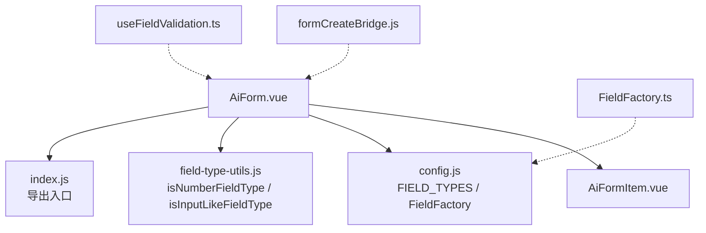
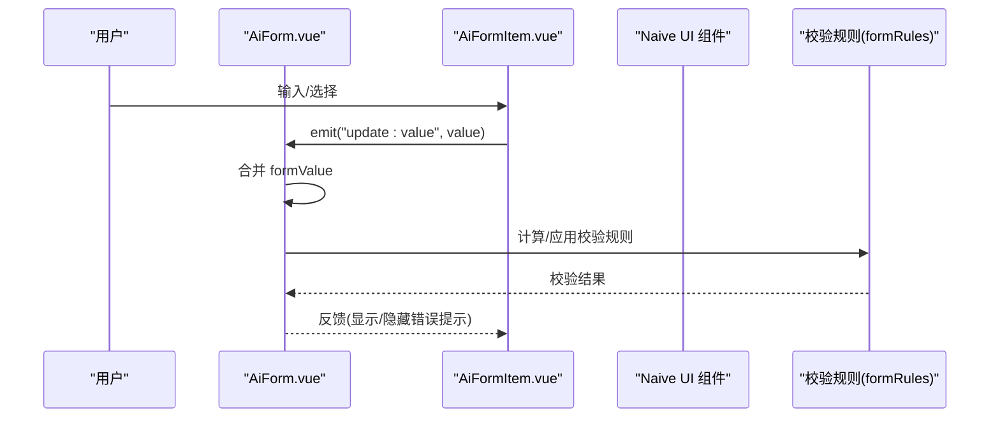
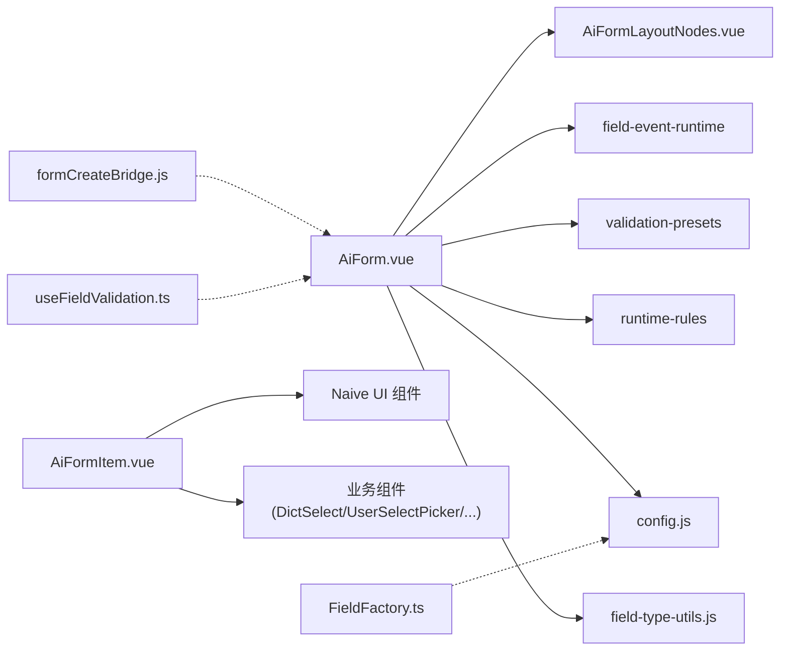

# 输入类组件

<cite>
**本文引用的文件**
- [AiForm.vue](file://forge-admin-ui/src/components/ai-form/AiForm.vue)
- [AiFormItem.vue](file://forge-admin-ui/src/components/ai-form/AiFormItem.vue)
- [config.js](file://forge-admin-ui/src/components/ai-form/config.js)
- [field-type-utils.js](file://forge-admin-ui/src/components/ai-form/field-type-utils.js)
- [index.js](file://forge-admin-ui/src/components/ai-form/index.js)
- [formCreateBridge.js](file://forge-admin-ui/src/components/form-create/formCreateBridge.js)
- [FieldFactory.ts](file://forge-admin-ui/src/components/lowcode-builder/designer-core/model/FieldFactory.ts)
- [useFieldValidation.ts](file://forge-admin-ui/src/components/lowcode-builder/designer-core/hooks/useFieldValidation.ts)
</cite>

## 目录
1. [简介](#简介)
2. [项目结构](#项目结构)
3. [核心组件](#核心组件)
4. [架构总览](#架构总览)
5. [详细组件分析](#详细组件分析)
6. [依赖关系分析](#依赖关系分析)
7. [性能考虑](#性能考虑)
8. [故障排查指南](#故障排查指南)
9. [结论](#结论)
10. [附录](#附录)

## 简介
本技术文档聚焦于“输入类表单组件”，覆盖文本框、数字框、密码框等基础输入组件的实现原理与配置选项，系统阐述属性绑定、事件处理、验证规则、样式定制、响应式布局、无障碍访问与国际化支持。文档基于仓库中的 AI Form 体系（AiForm/AiFormItem）与低代码字段工厂能力，提供使用示例、最佳实践与常见问题解决方案。

## 项目结构
AI Form 采用“配置驱动 + 动态渲染”的架构：
- AiForm 负责表单容器、数据绑定、全局校验、折叠/分组导航、弹窗表单与字段事件编排。
- AiFormItem 根据字段类型动态渲染具体输入控件（文本、数字、日期、选择、上传等）。
- config.js 定义字段类型常量与快速创建工厂方法。
- field-type-utils.js 提供类型判断工具，统一数字/输入型字段的识别逻辑。
- index.js 作为模块导出入口，对外暴露组件与工具。
- formCreateBridge.js 桥接 form-create 生态，便于在既有生态中复用。
- 低代码侧 FieldFactory 与 useFieldValidation 提供字段建模与校验能力。

图表来源
- [AiForm.vue:148-282](file://forge-admin-ui/src/components/ai-form/AiForm.vue#L148-L282)
- [AiFormItem.vue:1-120](file://forge-admin-ui/src/components/ai-form/AiFormItem.vue#L1-L120)
- [config.js:25-62](file://forge-admin-ui/src/components/ai-form/config.js#L25-L62)
- [field-type-utils.js:1-33](file://forge-admin-ui/src/components/ai-form/field-type-utils.js#L1-L33)
- [index.js:1-44](file://forge-admin-ui/src/components/ai-form/index.js#L1-L44)
- [formCreateBridge.js:1-200](file://forge-admin-ui/src/components/form-create/formCreateBridge.js#L1-L200)
- [FieldFactory.ts:1-200](file://forge-admin-ui/src/components/lowcode-builder/designer-core/model/FieldFactory.ts#L1-L200)
- [useFieldValidation.ts:1-200](file://forge-admin-ui/src/components/lowcode-builder/designer-core/hooks/useFieldValidation.ts#L1-L200)

章节来源
- [AiForm.vue:148-282](file://forge-admin-ui/src/components/ai-form/AiForm.vue#L148-L282)
- [config.js:25-62](file://forge-admin-ui/src/components/ai-form/config.js#L25-L62)
- [field-type-utils.js:1-33](file://forge-admin-ui/src/components/ai-form/field-type-utils.js#L1-L33)
- [index.js:1-44](file://forge-admin-ui/src/components/ai-form/index.js#L1-L44)

## 核心组件
- AiForm：表单容器，负责 v-model 双向绑定、全局校验规则生成、可见性控制、折叠/分组导航、字段事件调度、弹窗表单集成。
- AiFormItem：字段渲染器，按 type 分发到 Naive UI 原生组件或业务组件（如 DictSelect、UserSelectPicker、ImageUpload、FileUpload、AiCustomSelect 等），并统一处理禁用、占位符、事件透传与值更新。
- config.js：集中声明 FIELD_TYPES 与 FieldFactory，提供 createField 默认值合并与常用字段快捷构造。
- field-type-utils.js：统一识别数字/输入型字段，保障校验触发时机与空值语义一致。

章节来源
- [AiForm.vue:148-282](file://forge-admin-ui/src/components/ai-form/AiForm.vue#L148-L282)
- [AiFormItem.vue:78-150](file://forge-admin-ui/src/components/ai-form/AiFormItem.vue#L78-L150)
- [config.js:25-316](file://forge-admin-ui/src/components/ai-form/config.js#L25-L316)
- [field-type-utils.js:1-33](file://forge-admin-ui/src/components/ai-form/field-type-utils.js#L1-L33)

## 架构总览
AiForm 通过 schema 驱动渲染，内部维护 formValue 与 formRules；AiFormItem 依据字段类型渲染具体控件，并通过 update:value 将值回写至 AiForm。校验规则由 AiForm 聚合生成，针对数字/日期/选择类字段进行空值语义修正，避免误判。

图表来源
- [AiForm.vue:589-612](file://forge-admin-ui/src/components/ai-form/AiForm.vue#L589-L612)
- [AiFormItem.vue:78-150](file://forge-admin-ui/src/components/ai-form/AiFormItem.vue#L78-L150)
- [AiForm.vue:348-477](file://forge-admin-ui/src/components/ai-form/AiForm.vue#L348-L477)

## 详细组件分析

### 文本框（input）
- 渲染：当 field.type === 'input' 时，渲染 n-input，支持 placeholder、clearable、maxlength、showCount、size 与 props 透传。
- 值绑定：通过 @update:value 调用 handleUpdate，最终由 AiForm 合并 formValue 并触发 update:value。
- 事件：支持 v-on 透传组件事件，便于扩展自定义交互。
- 验证：若字段 required，AiForm 会注入必填规则；对于输入型字段，默认触发时机为 blur/change 组合，确保及时校验。
- 无障碍：n-form-item 自带 label 与 feedback；AiForm 内按钮具备 aria-label，提升可访问性。
- 国际化：placeholder 可由字段配置或上下文决定；如需多语言，可在 schema 层传入 i18n key 或由上层解析后填充。

章节来源
- [AiFormItem.vue:78-91](file://forge-admin-ui/src/components/ai-form/AiFormItem.vue#L78-L91)
- [AiForm.vue:348-477](file://forge-admin-ui/src/components/ai-form/AiForm.vue#L348-L477)
- [AiForm.vue:26-38](file://forge-admin-ui/src/components/ai-form/AiForm.vue#L26-L38)

### 数字框（number）
- 渲染：isNumberFieldType 命中时，渲染 n-input-number，支持 min/max/step/precision/showButton/clearable。
- 值绑定：@update:value 回写 AiForm，保持数值类型。
- 验证：对数字类型，必填校验使用自定义 validator，避免 0 被误判为空；触发时机优先 change，保证实时校验。
- 性能：数字输入变更频繁，建议结合防抖或按需校验策略（例如仅在失焦或提交时做复杂校验）。
- 无障碍：n-input-number 支持键盘操作与读屏；AiForm 的 formItem 提供必要标签。

章节来源
- [AiFormItem.vue:134-150](file://forge-admin-ui/src/components/ai-form/AiFormItem.vue#L134-L150)
- [field-type-utils.js:1-19](file://forge-admin-ui/src/components/ai-form/field-type-utils.js#L1-L19)
- [AiForm.vue:384-405](file://forge-admin-ui/src/components/ai-form/AiForm.vue#L384-L405)

### 密码框（password）
- 实现方式：使用 input 类型并设置 type="password"，可通过 props 透传至 n-input。
- 安全建议：避免明文存储与日志输出；必要时在前端加密后再发送。
- 验证：同文本框，支持 maxlength、clearable、required 等。
- 无障碍：n-input 的 password 模式兼容屏幕阅读器；建议配合明确的 label 与提示信息。

章节来源
- [AiFormItem.vue:78-91](file://forge-admin-ui/src/components/ai-form/AiFormItem.vue#L78-L91)
- [AiForm.vue:348-477](file://forge-admin-ui/src/components/ai-form/AiForm.vue#L348-L477)

### 其他输入类组件概览
- 多行文本（textarea）：支持 rows、autosize、maxlength、showCount。
- 日期/时间/范围：date/datetime/month/year/time/timerange，统一通过 n-date-picker/n-time-picker 渲染，支持 format/valueFormat 与默认值。
- 选择类：select/radio/radioButton/checkbox/cascader/treeSelect/transfer/customSelect/objectReference/recordSelector，均支持 clearable、filterable、multiple、remote 等。
- 上传类：upload/fileUpload/imageUpload，支持 action、headers、data、limit、accept、listType 等。
- 滑块/评分/颜色：slider/rate/color，支持 range、marks、count、allow-half、modes 等。

章节来源
- [AiFormItem.vue:117-733](file://forge-admin-ui/src/components/ai-form/AiFormItem.vue#L117-L733)
- [config.js:25-316](file://forge-admin-ui/src/components/ai-form/config.js#L25-L316)

### 属性绑定与事件处理
- 属性绑定：所有字段均可通过 props 透传底层组件属性；AiFormItem 对关键属性（value/disabled/clearable/filterable/multiple 等）进行显式绑定。
- 事件处理：统一通过 getComponentEvents(field) 获取并挂载事件；值变化通过 handleUpdate 上报 AiForm，再由 AiForm 合并 formValue 并触发 update:value。
- 字段事件：AiForm 内置 fieldEventRuntime，支持 FORM_LOAD、CHANGE 等事件，可与远程查询源联动。

章节来源
- [AiFormItem.vue:52-91](file://forge-admin-ui/src/components/ai-form/AiFormItem.vue#L52-L91)
- [AiForm.vue:589-612](file://forge-admin-ui/src/components/ai-form/AiForm.vue#L589-L612)
- [AiForm.vue:520-554](file://forge-admin-ui/src/components/ai-form/AiForm.vue#L520-L554)

### 验证规则
- 规则来源：字段 rules、validation 与 required 综合生成；AiForm 会规范化规则键名与触发时机。
- 空值语义：对数字/日期/选择类字段，使用自定义 validator 避免 0、空数组等有效值被误判为空。
- 触发时机：输入型字段默认 ['blur','change']；数字/日期/选择类优先 'change'，以提升交互体验。
- 单字段重验：handleFieldChange 中对变更字段执行局部 validate，仅用于同步清理或刷新提示，不阻断继续填写。

章节来源
- [AiForm.vue:348-477](file://forge-admin-ui/src/components/ai-form/AiForm.vue#L348-L477)
- [AiForm.vue:672-682](file://forge-admin-ui/src/components/ai-form/AiForm.vue#L672-L682)

### 样式定制
- 容器级：labelPlacement、labelWidth、labelAlign、size、gridCols/xGap/yGap 控制整体布局与尺寸。
- 字段级：field.formItemStyle、field.className、field.style 可精准控制单项样式。
- 搜索模式：isSearchForm 启用时，操作区自适应栅格，并提供展开/收起切换。

章节来源
- [AiForm.vue:14-24](file://forge-admin-ui/src/components/ai-form/AiForm.vue#L14-L24)
- [AiFormItem.vue:27-38](file://forge-admin-ui/src/components/ai-form/AiFormItem.vue#L27-L38)
- [AiForm.vue:561-578](file://forge-admin-ui/src/components/ai-form/AiForm.vue#L561-L578)

### 响应式设计
- 栅格布局：gridCols 控制列数，span 控制字段宽度；操作区自动补齐剩余空间。
- 折叠与分组：enableCollapse 与 maxVisibleFields 控制搜索表单折叠；sectionNavItems 自动生成分组导航。
- 移动端友好：n-space/n-button/n-input 等组件天然适配移动端；AiForm 的紧凑尺寸 size='small' 可用于小屏。

章节来源
- [AiForm.vue:197-209](file://forge-admin-ui/src/components/ai-form/AiForm.vue#L197-L209)
- [AiForm.vue:480-494](file://forge-admin-ui/src/components/ai-form/AiForm.vue#L480-L494)
- [AiForm.vue:561-578](file://forge-admin-ui/src/components/ai-form/AiForm.vue#L561-L578)

### 无障碍访问（a11y）
- 标签与反馈：n-form-item 提供 label 与 showFeedback；AiForm 内按钮具备 aria-label。
- 键盘可达：所有输入组件支持 Tab/Enter/Space 等操作；选择类组件支持方向键与回车确认。
- 语义化：分组导航使用 nav 与 button，具备可聚焦与可描述性。

章节来源
- [AiForm.vue:26-38](file://forge-admin-ui/src/components/ai-form/AiForm.vue#L26-L38)
- [AiFormItem.vue:27-38](file://forge-admin-ui/src/components/ai-form/AiFormItem.vue#L27-L38)

### 国际化支持
- 文案来源：placeholder、requiredMessage、submitText/resetText/cancelText 等均可通过 props/schema 配置。
- 运行时注入：建议在 schema 层使用 i18n key，并在渲染前解析为当前语言文案；或使用 context 注入翻译函数。
- 组件层面：AiForm 已暴露多处文案 prop，便于上层统一管理。

章节来源
- [AiForm.vue:210-242](file://forge-admin-ui/src/components/ai-form/AiForm.vue#L210-L242)
- [AiForm.vue:384-405](file://forge-admin-ui/src/components/ai-form/AiForm.vue#L384-L405)

## 依赖关系分析
- AiForm 依赖：
  - AiFormLayoutNodes：布局节点渲染（栅格/卡片/标签页等）。
  - field-event-runtime：字段事件运行时，支持远程查询与状态管理。
  - validation-presets：校验规则规范化与预设。
  - lowcode-builder/runtime-rules：运行时控制（v-if/v-show/visible）。
- AiFormItem 依赖：
  - Naive UI 组件：n-input/n-input-number/n-select/n-date-picker 等。
  - 业务组件：DictSelect、UserSelectPicker、RegionTreeSelect、ImageUpload、FileUpload、AiCustomSelect。
- 配置与工具：
  - config.js：FIELD_TYPES 与 FieldFactory。
  - field-type-utils.js：类型判断工具。
  - index.js：模块导出。
  - formCreateBridge.js：form-create 桥接。
  - FieldFactory.ts / useFieldValidation.ts：低代码字段建模与校验。

图表来源
- [AiForm.vue:148-160](file://forge-admin-ui/src/components/ai-form/AiForm.vue#L148-L160)
- [AiFormItem.vue:1-120](file://forge-admin-ui/src/components/ai-form/AiFormItem.vue#L1-L120)
- [config.js:25-62](file://forge-admin-ui/src/components/ai-form/config.js#L25-L62)
- [field-type-utils.js:1-33](file://forge-admin-ui/src/components/ai-form/field-type-utils.js#L1-L33)
- [formCreateBridge.js:1-200](file://forge-admin-ui/src/components/form-create/formCreateBridge.js#L1-L200)
- [FieldFactory.ts:1-200](file://forge-admin-ui/src/components/lowcode-builder/designer-core/model/FieldFactory.ts#L1-L200)
- [useFieldValidation.ts:1-200](file://forge-admin-ui/src/components/lowcode-builder/designer-core/hooks/useFieldValidation.ts#L1-L200)

章节来源
- [AiForm.vue:148-160](file://forge-admin-ui/src/components/ai-form/AiForm.vue#L148-L160)
- [AiFormItem.vue:1-120](file://forge-admin-ui/src/components/ai-form/AiFormItem.vue#L1-L120)
- [config.js:25-62](file://forge-admin-ui/src/components/ai-form/config.js#L25-L62)
- [field-type-utils.js:1-33](file://forge-admin-ui/src/components/ai-form/field-type-utils.js#L1-L33)

## 性能考虑
- 减少重渲染：尽量使用 v-model 与 computed 缓存 visibleSchema、formRules 等。
- 延迟校验：对高频输入（如数字框）可使用 change 触发轻量校验，复杂校验延后至 blur 或提交。
- 远程选择：合理使用 remote/onSearch 分页加载，避免一次性拉取大量选项。
- 上传优化：限制文件大小与数量，使用分片/断点续传（由业务组件封装）。
- 事件节流：对 onChange 与远程查询进行节流/防抖，降低网络压力。

[本节为通用指导，无需特定文件引用]

## 故障排查指南
- 数字校验误报为空：检查是否命中 isNumberFieldType；确认使用了自定义 validator 且 trigger 为 change。
- 选择类无法清空：确认 clearable !== false；检查 options 是否为空或未正确映射。
- 日期格式不一致：核对 format 与 valueFormat；必要时在 handleUpdate 中进行转换。
- 字段不可见：检查 vIf/visible 控制逻辑与运行时控制；确认权限与上下文数据。
- 事件未触发：确认 getComponentEvents 是否正确挂载；检查父级是否阻止冒泡。
- 弹窗表单未渲染：确认 actionModalSchema 是否构建成功；检查 formAssets 是否包含对应 formKey。

章节来源
- [AiForm.vue:384-405](file://forge-admin-ui/src/components/ai-form/AiForm.vue#L384-L405)
- [AiForm.vue:698-713](file://forge-admin-ui/src/components/ai-form/AiForm.vue#L698-L713)
- [AiFormItem.vue:134-150](file://forge-admin-ui/src/components/ai-form/AiFormItem.vue#L134-L150)

## 结论
AiForm/AiFormItem 提供了以 JSON schema 驱动的输入类表单能力，覆盖文本、数字、密码及多种选择/上传组件，具备完善的属性绑定、事件处理、校验规则与样式定制机制。通过栅格布局、折叠分组与事件运行时，满足复杂业务场景；同时兼顾无障碍与国际化扩展。结合低代码 FieldFactory 与校验钩子，可实现从设计到运行的一体化体验。

[本节为总结，无需特定文件引用]

## 附录

### 使用示例（路径参考）
- 表单容器与数据绑定：[AiForm.vue:14-24](file://forge-admin-ui/src/components/ai-form/AiForm.vue#L14-L24)
- 字段类型与工厂：[config.js:25-316](file://forge-admin-ui/src/components/ai-form/config.js#L25-L316)
- 文本/数字/选择渲染：[AiFormItem.vue:78-150](file://forge-admin-ui/src/components/ai-form/AiFormItem.vue#L78-L150)
- 校验规则生成：[AiForm.vue:348-477](file://forge-admin-ui/src/components/ai-form/AiForm.vue#L348-L477)
- 字段事件与远程查询：[AiForm.vue:520-554](file://forge-admin-ui/src/components/ai-form/AiForm.vue#L520-L554)

### 最佳实践
- 使用 FieldFactory 快速创建字段，统一默认行为。
- 对数字/日期/选择类字段，明确 required 与 trigger，避免误判。
- 合理拆分 schema，利用分组与折叠提升可用性。
- 通过 props 透传与 formItemStyle 精细化样式控制。
- 在 context 中注入 i18n 文案，统一多语言管理。

[本节为通用指导，无需特定文件引用]