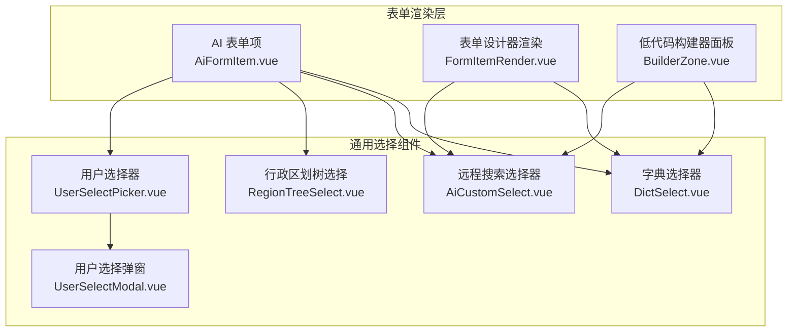
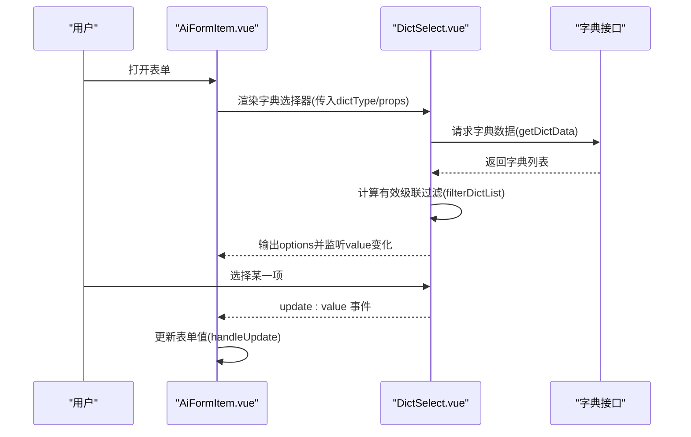
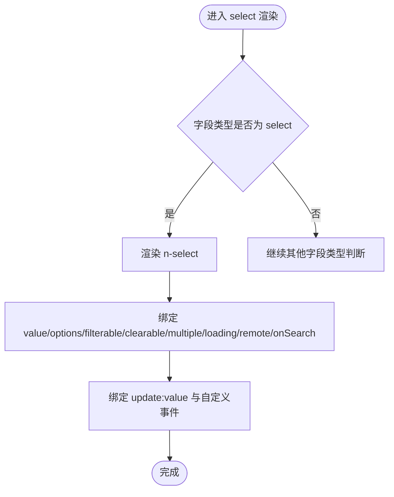
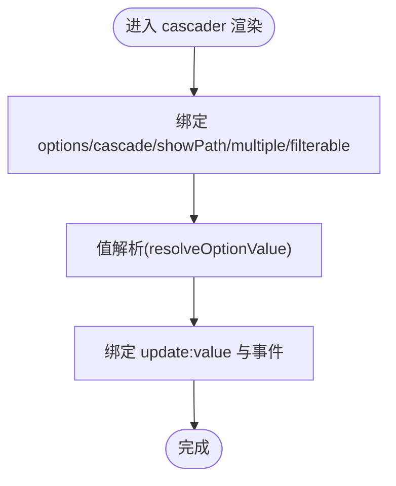
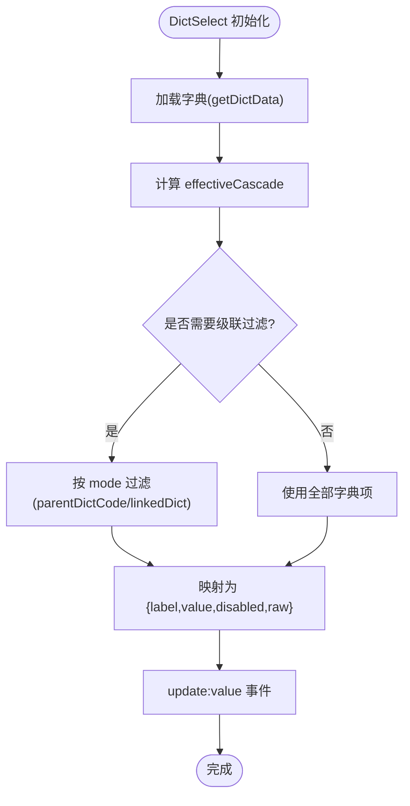
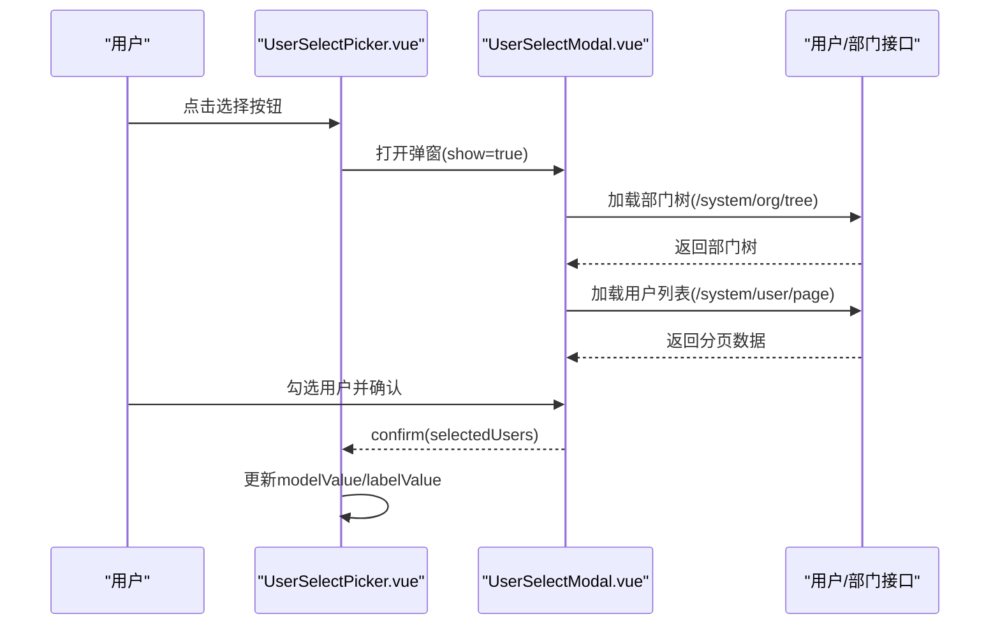
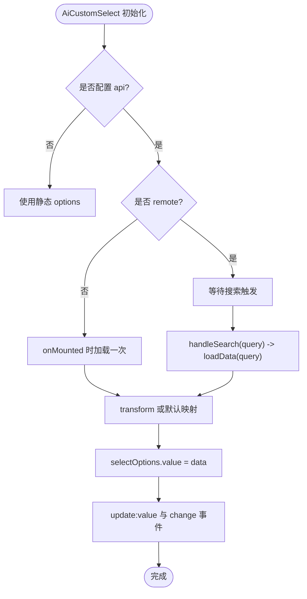
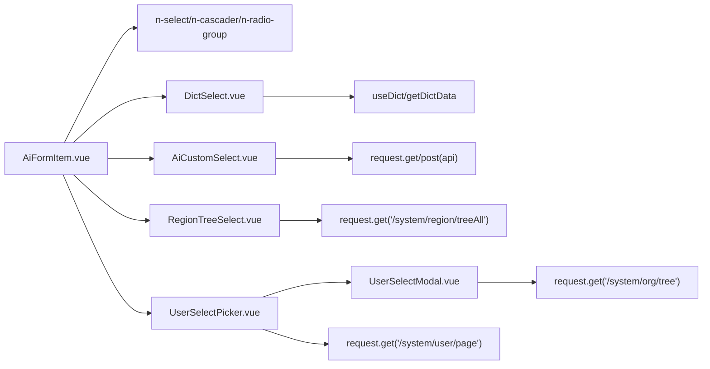

# 选择类组件

<cite>
**本文引用的文件**
- [AiFormItem.vue](file://forge-admin-ui/src/components/ai-form/AiFormItem.vue)
- [DictSelect.vue](file://forge-admin-ui/src/components/DictSelect.vue)
- [RegionTreeSelect.vue](file://forge-admin-ui/src/components/RegionTreeSelect.vue)
- [UserSelectPicker.vue](file://forge-admin-ui/src/components/common/UserSelectPicker.vue)
- [UserSelectModal.vue](file://forge-admin-ui/src/components/common/UserSelectModal.vue)
- [AiCustomSelect.vue](file://forge-admin-ui/src/components/ai-form/AiCustomSelect.vue)
- [FormDesigner.vue](file://forge-admin-ui/src/components/form-designer/FormDesigner.vue)
- [FormItemRender.vue](file://forge-admin-ui/src/components/form-designer/FormItemRender.vue)
- [BuilderZone.vue](file://forge-admin-ui/src/components/lowcode-builder/page/BuilderZone.vue)
</cite>

## 目录
1. [简介](#简介)
2. [项目结构](#项目结构)
3. [核心组件](#核心组件)
4. [架构总览](#架构总览)
5. [详细组件分析](#详细组件分析)
6. [依赖关系分析](#依赖关系分析)
7. [性能考虑](#性能考虑)
8. [故障排查指南](#故障排查指南)
9. [结论](#结论)
10. [附录：使用示例与最佳实践](#附录使用示例与最佳实践)

## 简介
本技术文档聚焦于 Forge Admin 前端中的选择类表单组件，涵盖下拉选择器、单选框、复选框、级联选择器、字典选择器、行政区划树选择、用户选择器等。文档从实现原理、配置项、数据绑定、动态选项加载、搜索过滤、自定义渲染等维度展开，并提供大数据量处理、性能优化与用户体验建议，以及常见问题解决方案与最佳实践。

## 项目结构
选择类组件主要分布在以下位置：
- AI 表单与低代码表单渲染层：负责根据字段类型渲染对应的选择控件，并统一处理值解析、事件与属性透传
- 通用选择组件：如字典选择器、行政区划树选择、用户选择器等，封装了数据获取、过滤、展示与交互逻辑
- 表单设计器与低代码构建器：提供可视化编辑与运行时渲染能力，支持对选择类组件的属性进行配置与预览

图表来源
- [AiFormItem.vue:152-168](file://forge-admin-ui/src/components/ai-form/AiFormItem.vue#L152-L168)
- [AiFormItem.vue:170-187](file://forge-admin-ui/src/components/ai-form/AiFormItem.vue#L170-L187)
- [AiFormItem.vue:534-549](file://forge-admin-ui/src/components/ai-form/AiFormItem.vue#L534-L549)
- [DictSelect.vue:10-23](file://forge-admin-ui/src/components/DictSelect.vue#L10-L23)
- [RegionTreeSelect.vue:15-26](file://forge-admin-ui/src/components/RegionTreeSelect.vue#L15-L26)
- [UserSelectPicker.vue:1-40](file://forge-admin-ui/src/components/common/UserSelectPicker.vue#L1-L40)
- [UserSelectModal.vue:1-79](file://forge-admin-ui/src/components/common/UserSelectModal.vue#L1-L79)
- [AiCustomSelect.vue:6-24](file://forge-admin-ui/src/components/ai-form/AiCustomSelect.vue#L6-L24)
- [FormItemRender.vue:56-71](file://forge-admin-ui/src/components/form-designer/FormItemRender.vue#L56-L71)
- [BuilderZone.vue:258-286](file://forge-admin-ui/src/components/lowcode-builder/page/BuilderZone.vue#L258-L286)

章节来源
- [AiFormItem.vue:152-168](file://forge-admin-ui/src/components/ai-form/AiFormItem.vue#L152-L168)
- [AiFormItem.vue:170-187](file://forge-admin-ui/src/components/ai-form/AiFormItem.vue#L170-L187)
- [AiFormItem.vue:534-549](file://forge-admin-ui/src/components/ai-form/AiFormItem.vue#L534-L549)
- [DictSelect.vue:10-23](file://forge-admin-ui/src/components/DictSelect.vue#L10-L23)
- [RegionTreeSelect.vue:15-26](file://forge-admin-ui/src/components/RegionTreeSelect.vue#L15-L26)
- [UserSelectPicker.vue:1-40](file://forge-admin-ui/src/components/common/UserSelectPicker.vue#L1-L40)
- [UserSelectModal.vue:1-79](file://forge-admin-ui/src/components/common/UserSelectModal.vue#L1-L79)
- [AiCustomSelect.vue:6-24](file://forge-admin-ui/src/components/ai-form/AiCustomSelect.vue#L6-L24)
- [FormItemRender.vue:56-71](file://forge-admin-ui/src/components/form-designer/FormItemRender.vue#L56-L71)
- [BuilderZone.vue:258-286](file://forge-admin-ui/src/components/lowcode-builder/page/BuilderZone.vue#L258-L286)

## 核心组件
- 下拉选择器（n-select）：在 AI 表单与表单设计器中通过字段 type=select 渲染，支持多选、可搜索、清空、远程搜索与自定义属性透传
- 单选框（radio）：通过 n-radio-group + n-radio 渲染，支持禁用与值更新
- 复选框（checkbox）：在表单设计器中通过 n-checkbox-group 或组合方式渲染，支持多选
- 级联选择器（cascader）：支持层级数据展示、路径显示、是否级联、多选与搜索
- 字典选择器（DictSelect）：基于字典类型动态加载选项，支持级联过滤（父级字典编码或关联字典）、静态过滤、禁用态映射
- 行政区划树选择（RegionTreeSelect）：一次性加载区划树，支持数据权限控制、虚拟节点可选性控制、搜索
- 用户选择器（UserSelectPicker + UserSelectModal）：以只读输入+按钮打开弹窗，支持多/单选、分页、部门筛选、已选回显
- 远程搜索选择器（AiCustomSelect）：封装远程接口调用、参数注入、结果转换、搜索触发与加载状态管理

章节来源
- [AiFormItem.vue:152-168](file://forge-admin-ui/src/components/ai-form/AiFormItem.vue#L152-L168)
- [AiFormItem.vue:188-227](file://forge-admin-ui/src/components/ai-form/AiFormItem.vue#L188-L227)
- [AiFormItem.vue:228-260](file://forge-admin-ui/src/components/ai-form/AiFormItem.vue#L228-L260)
- [AiFormItem.vue:534-549](file://forge-admin-ui/src/components/ai-form/AiFormItem.vue#L534-L549)
- [DictSelect.vue:29-109](file://forge-admin-ui/src/components/DictSelect.vue#L29-L109)
- [RegionTreeSelect.vue:32-74](file://forge-admin-ui/src/components/RegionTreeSelect.vue#L32-L74)
- [UserSelectPicker.vue:46-79](file://forge-admin-ui/src/components/common/UserSelectPicker.vue#L46-L79)
- [UserSelectModal.vue:87-104](file://forge-admin-ui/src/components/common/UserSelectModal.vue#L87-L104)
- [AiCustomSelect.vue:30-101](file://forge-admin-ui/src/components/ai-form/AiCustomSelect.vue#L30-L101)

## 架构总览
选择类组件采用“渲染层 + 通用组件”的分层架构：
- 渲染层（AiFormItem / FormItemRender / BuilderZone）：依据字段类型与属性，将 UI 库的 n-select、n-cascader、n-radio-group、n-tree-select 等组件进行装配，并统一处理 v-model 双向绑定、事件转发与属性透传
- 通用组件（DictSelect / RegionTreeSelect / UserSelectPicker / AiCustomSelect）：封装数据源、过滤、搜索、级联、权限等复杂逻辑，向上暴露简洁 API
- 弹窗与辅助（UserSelectModal）：承载复杂列表、分页、搜索与选择确认流程

图表来源
- [AiFormItem.vue:170-187](file://forge-admin-ui/src/components/ai-form/AiFormItem.vue#L170-L187)
- [DictSelect.vue:142-160](file://forge-admin-ui/src/components/DictSelect.vue#L142-L160)
- [DictSelect.vue:167-204](file://forge-admin-ui/src/components/DictSelect.vue#L167-L204)

章节来源
- [AiFormItem.vue:170-187](file://forge-admin-ui/src/components/ai-form/AiFormItem.vue#L170-L187)
- [DictSelect.vue:142-160](file://forge-admin-ui/src/components/DictSelect.vue#L142-L160)
- [DictSelect.vue:167-204](file://forge-admin-ui/src/components/DictSelect.vue#L167-L204)

## 详细组件分析

### 下拉选择器（select）
- 渲染入口：在 AI 表单中通过 field.type === 'select' 分支渲染 n-select；在表单设计器中同样通过 item.type === 'select' 渲染
- 关键特性：
  - 值解析：通过 resolveOptionValue 确保选中值与选项 value 一致
  - 搜索与清空：filterable、clearable 默认开启，可通过字段配置关闭
  - 多选：multiple 控制
  - 远程搜索：remote + onSearch 配合，适合大数据量场景
  - 事件透传：v-on 绑定组件事件，便于上层业务扩展
- 设计器属性编辑：支持选项数组编辑、多选开关、可搜索开关

图表来源
- [AiFormItem.vue:152-168](file://forge-admin-ui/src/components/ai-form/AiFormItem.vue#L152-L168)
- [FormItemRender.vue:56-71](file://forge-admin-ui/src/components/form-designer/FormItemRender.vue#L56-L71)
- [FormDesigner.vue:213-238](file://forge-admin-ui/src/components/form-designer/FormDesigner.vue#L213-L238)

章节来源
- [AiFormItem.vue:152-168](file://forge-admin-ui/src/components/ai-form/AiFormItem.vue#L152-L168)
- [FormItemRender.vue:56-71](file://forge-admin-ui/src/components/form-designer/FormItemRender.vue#L56-L71)
- [FormDesigner.vue:213-238](file://forge-admin-ui/src/components/form-designer/FormDesigner.vue#L213-L238)

### 单选框（radio）
- 渲染入口：在 AI 表单与表单设计器中分别通过 field.type === 'radio' 与 item.type === 'radio' 渲染
- 关键特性：
  - 使用 n-radio-group 包裹多个 n-radio
  - 支持 disabled 与值更新
  - 选项来自 props.options，label/value 一一对应

章节来源
- [AiFormItem.vue:188-227](file://forge-admin-ui/src/components/ai-form/AiFormItem.vue#L188-L227)
- [FormItemRender.vue:75-93](file://forge-admin-ui/src/components/form-designer/FormItemRender.vue#L75-L93)

### 复选框（checkbox）
- 渲染入口：在 AI 表单与表单设计器中通过 field.type === 'checkbox' 分支渲染
- 关键特性：
  - 多选模式，值通常为数组
  - 选项结构与单选一致

章节来源
- [AiFormItem.vue:228-260](file://forge-admin-ui/src/components/ai-form/AiFormItem.vue#L228-L260)
- [FormItemRender.vue:98-116](file://forge-admin-ui/src/components/form-designer/FormItemRender.vue#L98-L116)

### 级联选择器（cascader）
- 渲染入口：在 AI 表单中通过 field.type === 'cascader' 渲染 n-cascader
- 关键特性：
  - 层级数据：options 为树形结构
  - 行为控制：cascade（是否级联）、showPath（是否显示路径）、multiple（多选）、filterable（搜索）
  - 值解析：resolveOptionValue 保证选中值与选项匹配

图表来源
- [AiFormItem.vue:534-549](file://forge-admin-ui/src/components/ai-form/AiFormItem.vue#L534-L549)

章节来源
- [AiFormItem.vue:534-549](file://forge-admin-ui/src/components/ai-form/AiFormItem.vue#L534-L549)

### 字典选择器（DictSelect）
- 功能概述：根据 dictType 动态加载字典数据，支持级联过滤（父级字典编码或关联字典），并将字典项转换为 n-select 所需的 options
- 关键配置：
  - dictType：必填，指定字典类型
  - formData：用于读取当前表单值以进行级联过滤
  - cascade：启用级联过滤，支持 sourceField/sourceDictType/linkedDictType/linkedDictValue/parentDictCode 等
  - matchMode：过滤模式（parentDictCode 或 linkedDict）
  - multiple/clearable/filterable/disabled：基础交互控制
- 数据处理：
  - getDictData 获取字典列表
  - filterDictList 根据级联条件过滤
  - filterByStaticCascade 支持静态级联参数
  - isSameValue 兼容字符串与数值比较
  - resolveSourceDictCode 从源选项中解析字典编码

图表来源
- [DictSelect.vue:142-160](file://forge-admin-ui/src/components/DictSelect.vue#L142-L160)
- [DictSelect.vue:167-204](file://forge-admin-ui/src/components/DictSelect.vue#L167-L204)
- [DictSelect.vue:206-218](file://forge-admin-ui/src/components/DictSelect.vue#L206-L218)

章节来源
- [DictSelect.vue:29-109](file://forge-admin-ui/src/components/DictSelect.vue#L29-L109)
- [DictSelect.vue:142-160](file://forge-admin-ui/src/components/DictSelect.vue#L142-L160)
- [DictSelect.vue:167-204](file://forge-admin-ui/src/components/DictSelect.vue#L167-L204)
- [DictSelect.vue:206-218](file://forge-admin-ui/src/components/DictSelect.vue#L206-L218)

### 行政区划树选择（RegionTreeSelect）
- 功能概述：一次性加载指定 rootCode 下的完整区划树（含虚拟组织），支持 dataRight 控制数据权限，支持搜索与虚拟节点可选性控制
- 关键配置：
  - rootCode：根节点编码
  - dataRight：是否启用数据权限过滤
  - virtualDisabled：编辑表单中虚拟节点不可选，搜索筛选中可选
  - clearable/filterable/disabled/size：基础交互控制
- 数据处理：
  - 调用 /system/region/treeAll 获取区划树
  - convertToTreeSelect 将后端树结构转换为 n-tree-select 所需格式
  - 虚拟节点（code 以 ALL 结尾）根据 virtualDisabled 设置禁用

章节来源
- [RegionTreeSelect.vue:15-26](file://forge-admin-ui/src/components/RegionTreeSelect.vue#L15-L26)
- [RegionTreeSelect.vue:32-74](file://forge-admin-ui/src/components/RegionTreeSelect.vue#L32-L74)
- [RegionTreeSelect.vue:85-119](file://forge-admin-ui/src/components/RegionTreeSelect.vue#L85-L119)

### 用户选择器（UserSelectPicker + UserSelectModal）
- 功能概述：以只读输入+按钮形式打开用户选择弹窗，支持多/单选、分页、部门筛选、已选回显与清空
- 关键配置：
  - modelValue/labelValue：值与标签的双向绑定
  - multiple：是否多选
  - clearable/disabled/size：基础交互控制
  - title：弹窗标题
- 弹窗能力：
  - 搜索：用户名/姓名关键词、部门树筛选
  - 表格：用户列表、状态标签、行选择
  - 分页：页码与每页条数切换
  - 确认：返回选中用户（单/多）

图表来源
- [UserSelectPicker.vue:1-40](file://forge-admin-ui/src/components/common/UserSelectPicker.vue#L1-L40)
- [UserSelectPicker.vue:119-136](file://forge-admin-ui/src/components/common/UserSelectPicker.vue#L119-L136)
- [UserSelectModal.vue:1-79](file://forge-admin-ui/src/components/common/UserSelectModal.vue#L1-L79)
- [UserSelectModal.vue:183-214](file://forge-admin-ui/src/components/common/UserSelectModal.vue#L183-L214)
- [UserSelectModal.vue:226-249](file://forge-admin-ui/src/components/common/UserSelectModal.vue#L226-L249)
- [UserSelectModal.vue:276-288](file://forge-admin-ui/src/components/common/UserSelectModal.vue#L276-L288)

章节来源
- [UserSelectPicker.vue:46-79](file://forge-admin-ui/src/components/common/UserSelectPicker.vue#L46-L79)
- [UserSelectPicker.vue:119-136](file://forge-admin-ui/src/components/common/UserSelectPicker.vue#L119-L136)
- [UserSelectModal.vue:87-104](file://forge-admin-ui/src/components/common/UserSelectModal.vue#L87-L104)
- [UserSelectModal.vue:183-214](file://forge-admin-ui/src/components/common/UserSelectModal.vue#L183-L214)
- [UserSelectModal.vue:226-249](file://forge-admin-ui/src/components/common/UserSelectModal.vue#L226-L249)
- [UserSelectModal.vue:276-288](file://forge-admin-ui/src/components/common/UserSelectModal.vue#L276-L288)

### 远程搜索选择器（AiCustomSelect）
- 功能概述：基于 n-select 封装远程搜索能力，支持静态选项与远程接口两种数据源，支持参数注入、结果转换、加载状态与 change 事件携带完整选中项
- 关键配置：
  - api/method：远程接口地址与请求方法
  - labelField/valueField：结果字段映射
  - params：请求参数
  - transform：数据转换函数
  - remote/filterable/clearable/multiple/disabled：交互控制
- 数据处理：
  - 挂载时若配置 api 且非 remote，则立即加载
  - 搜索时追加 keyword 参数
  - 结果默认转换为 {label,value,...item}，也可通过 transform 自定义

图表来源
- [AiCustomSelect.vue:6-24](file://forge-admin-ui/src/components/ai-form/AiCustomSelect.vue#L6-L24)
- [AiCustomSelect.vue:115-159](file://forge-admin-ui/src/components/ai-form/AiCustomSelect.vue#L115-L159)
- [AiCustomSelect.vue:161-189](file://forge-admin-ui/src/components/ai-form/AiCustomSelect.vue#L161-L189)
- [AiCustomSelect.vue:192-203](file://forge-admin-ui/src/components/ai-form/AiCustomSelect.vue#L192-L203)

章节来源
- [AiCustomSelect.vue:30-101](file://forge-admin-ui/src/components/ai-form/AiCustomSelect.vue#L30-L101)
- [AiCustomSelect.vue:115-159](file://forge-admin-ui/src/components/ai-form/AiCustomSelect.vue#L115-L159)
- [AiCustomSelect.vue:161-189](file://forge-admin-ui/src/components/ai-form/AiCustomSelect.vue#L161-L189)
- [AiCustomSelect.vue:192-203](file://forge-admin-ui/src/components/ai-form/AiCustomSelect.vue#L192-L203)

## 依赖关系分析
- 渲染层依赖 UI 库组件（n-select、n-cascader、n-radio-group、n-tree-select）
- 通用组件依赖：
  - DictSelect 依赖 useDict 提供的 getDictData
  - RegionTreeSelect 依赖 request.get('/system/region/treeAll')
  - UserSelectPicker 依赖 UserSelectModal 与 request.get('/system/user/page', '/system/org/tree')
  - AiCustomSelect 依赖 request 进行远程数据获取
- 设计器与构建器依赖上述组件进行可视化配置与运行时渲染

图表来源
- [AiFormItem.vue:152-168](file://forge-admin-ui/src/components/ai-form/AiFormItem.vue#L152-L168)
- [AiFormItem.vue:170-187](file://forge-admin-ui/src/components/ai-form/AiFormItem.vue#L170-L187)
- [AiFormItem.vue:534-549](file://forge-admin-ui/src/components/ai-form/AiFormItem.vue#L534-L549)
- [DictSelect.vue:27-28](file://forge-admin-ui/src/components/DictSelect.vue#L27-L28)
- [RegionTreeSelect.vue:29-31](file://forge-admin-ui/src/components/RegionTreeSelect.vue#L29-L31)
- [UserSelectPicker.vue:43-44](file://forge-admin-ui/src/components/common/UserSelectPicker.vue#L43-L44)
- [UserSelectModal.vue:83-86](file://forge-admin-ui/src/components/common/UserSelectModal.vue#L83-L86)
- [AiCustomSelect.vue:27-28](file://forge-admin-ui/src/components/ai-form/AiCustomSelect.vue#L27-L28)

章节来源
- [AiFormItem.vue:152-168](file://forge-admin-ui/src/components/ai-form/AiFormItem.vue#L152-L168)
- [DictSelect.vue:27-28](file://forge-admin-ui/src/components/DictSelect.vue#L27-L28)
- [RegionTreeSelect.vue:29-31](file://forge-admin-ui/src/components/RegionTreeSelect.vue#L29-L31)
- [UserSelectPicker.vue:43-44](file://forge-admin-ui/src/components/common/UserSelectPicker.vue#L43-L44)
- [UserSelectModal.vue:83-86](file://forge-admin-ui/src/components/common/UserSelectModal.vue#L83-L86)
- [AiCustomSelect.vue:27-28](file://forge-admin-ui/src/components/ai-form/AiCustomSelect.vue#L27-L28)

## 性能考虑
- 大数据量下拉：
  - 优先使用远程搜索（remote + onSearch），避免一次性渲染大量选项
  - 合理设置 pageSize 与分页，减少首屏压力
  - 使用 transform 将后端数据直接映射为 {label,value}，减少前端转换开销
- 字典选择器：
  - 使用级联过滤减少无效选项数量
  - 利用缓存（由 useDict 内部实现）避免重复请求
- 树选择（行政区划）：
  - 一次性加载整棵树时注意节点数量，必要时限制 rootCode 范围
  - 虚拟节点在编辑场景禁用，避免误选导致的数据异常
- 用户选择弹窗：
  - 使用分页与搜索降低列表渲染压力
  - 仅加载必要字段，减少网络与内存占用
- 事件与渲染：
  - 避免在高频事件中执行重计算，必要时使用防抖/节流
  - 合理使用 v-if/v-show 控制组件可见性，减少不必要的渲染

[本节为通用指导，不直接分析具体文件]

## 故障排查指南
- 字典选择器未显示选项：
  - 检查是否传入 dictType
  - 查看控制台是否有加载失败的警告
  - 确认级联条件是否正确（sourceField/matchMode）
- 远程搜索无结果：
  - 检查 api 地址与方法是否正确
  - 确认 transform 或 labelField/valueField 是否与后端字段一致
  - 验证请求参数（keyword、params）是否传递到后端
- 用户选择弹窗无法加载数据：
  - 检查 /system/user/page 与 /system/org/tree 接口是否可达
  - 确认分页参数与搜索条件是否正确
- 值绑定异常：
  - 检查 resolveOptionValue 是否能正确匹配 value
  - 对于多选，确保值为数组且元素类型一致（字符串或数字）
- 虚拟节点误选：
  - 在编辑表单中确保 virtualDisabled=true，避免选择 ALL 后缀编码

章节来源
- [DictSelect.vue:142-160](file://forge-admin-ui/src/components/DictSelect.vue#L142-L160)
- [AiCustomSelect.vue:115-159](file://forge-admin-ui/src/components/ai-form/AiCustomSelect.vue#L115-L159)
- [UserSelectModal.vue:226-249](file://forge-admin-ui/src/components/common/UserSelectModal.vue#L226-L249)
- [RegionTreeSelect.vue:103-119](file://forge-admin-ui/src/components/RegionTreeSelect.vue#L103-L119)

## 结论
Forge Admin 的选择类组件体系以“渲染层 + 通用组件”为核心，提供了丰富的选择能力与良好的可扩展性。通过字典选择器、远程搜索、级联过滤与树选择等能力，能够覆盖大多数业务场景。结合性能优化策略与完善的故障排查指南，可在保证用户体验的同时提升系统稳定性与可维护性。

[本节为总结，不直接分析具体文件]

## 附录：使用示例与最佳实践
- 下拉选择器（select）
  - 在 AI 表单中配置 field.type='select'，设置 options、multiple、filterable、remote、onSearch 等
  - 在设计器中通过属性面板编辑选项与开关
- 单选框（radio）与复选框（checkbox）
  - 配置 options 数组，确保 label/value 对应
  - 多选时注意值类型为数组
- 级联选择器（cascader）
  - 配置树形 options，按需开启 showPath、cascade、multiple、filterable
- 字典选择器（DictSelect）
  - 传入 dictType，必要时配置 cascade 与 formData 实现级联
  - 使用 matchMode 控制过滤模式（parentDictCode 或 linkedDict）
- 行政区划树选择（RegionTreeSelect）
  - 设置 rootCode 与 dataRight，编辑表单中保持 virtualDisabled=true
- 用户选择器（UserSelectPicker + UserSelectModal）
  - 绑定 modelValue/labelValue，按需开启 multiple
  - 在弹窗中进行搜索、分页与选择确认
- 远程搜索选择器（AiCustomSelect）
  - 配置 api、method、params、transform，启用 remote 与 filterable
  - 在 search 时追加 keyword 参数，后端返回 {label,value,...}

章节来源
- [AiFormItem.vue:152-168](file://forge-admin-ui/src/components/ai-form/AiFormItem.vue#L152-L168)
- [AiFormItem.vue:188-227](file://forge-admin-ui/src/components/ai-form/AiFormItem.vue#L188-L227)
- [AiFormItem.vue:228-260](file://forge-admin-ui/src/components/ai-form/AiFormItem.vue#L228-L260)
- [AiFormItem.vue:534-549](file://forge-admin-ui/src/components/ai-form/AiFormItem.vue#L534-L549)
- [DictSelect.vue:29-109](file://forge-admin-ui/src/components/DictSelect.vue#L29-L109)
- [RegionTreeSelect.vue:32-74](file://forge-admin-ui/src/components/RegionTreeSelect.vue#L32-L74)
- [UserSelectPicker.vue:46-79](file://forge-admin-ui/src/components/common/UserSelectPicker.vue#L46-L79)
- [UserSelectModal.vue:87-104](file://forge-admin-ui/src/components/common/UserSelectModal.vue#L87-L104)
- [AiCustomSelect.vue:30-101](file://forge-admin-ui/src/components/ai-form/AiCustomSelect.vue#L30-L101)
- [FormDesigner.vue:213-238](file://forge-admin-ui/src/components/form-designer/FormDesigner.vue#L213-L238)
- [FormItemRender.vue:56-71](file://forge-admin-ui/src/components/form-designer/FormItemRender.vue#L56-L71)
- [BuilderZone.vue:258-286](file://forge-admin-ui/src/components/lowcode-builder/page/BuilderZone.vue#L258-L286)