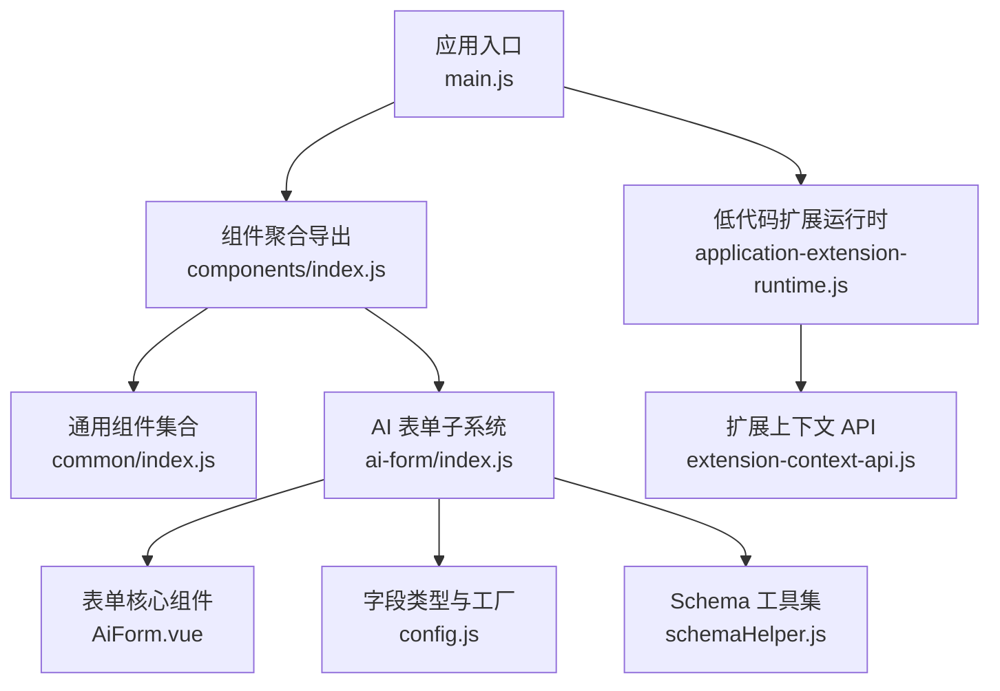
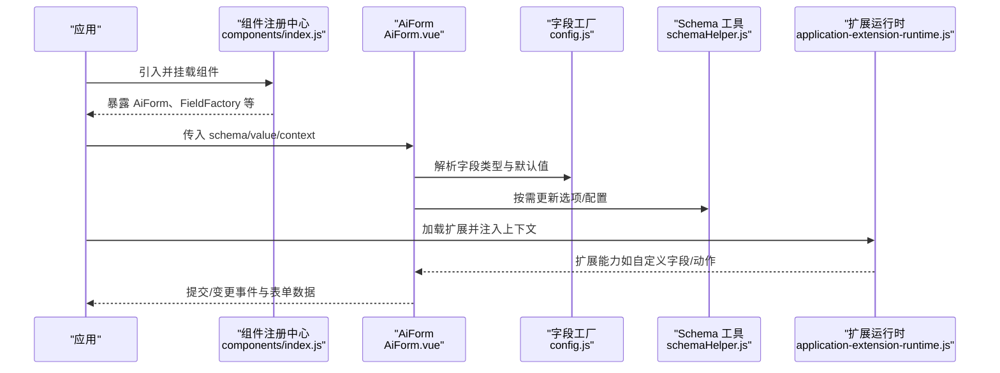
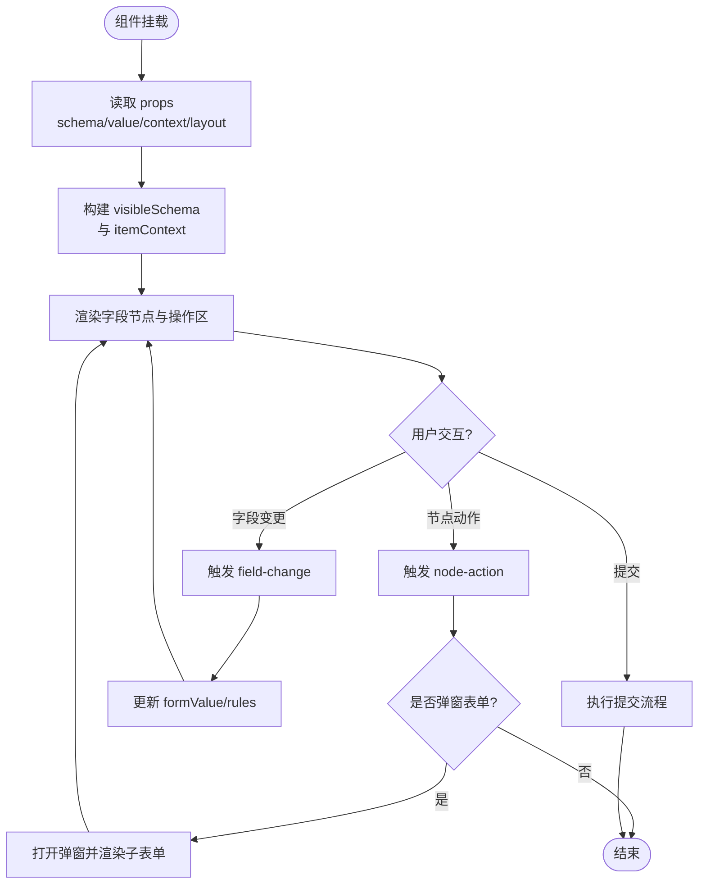
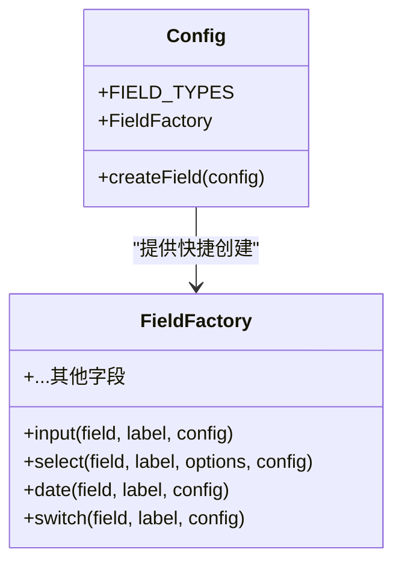
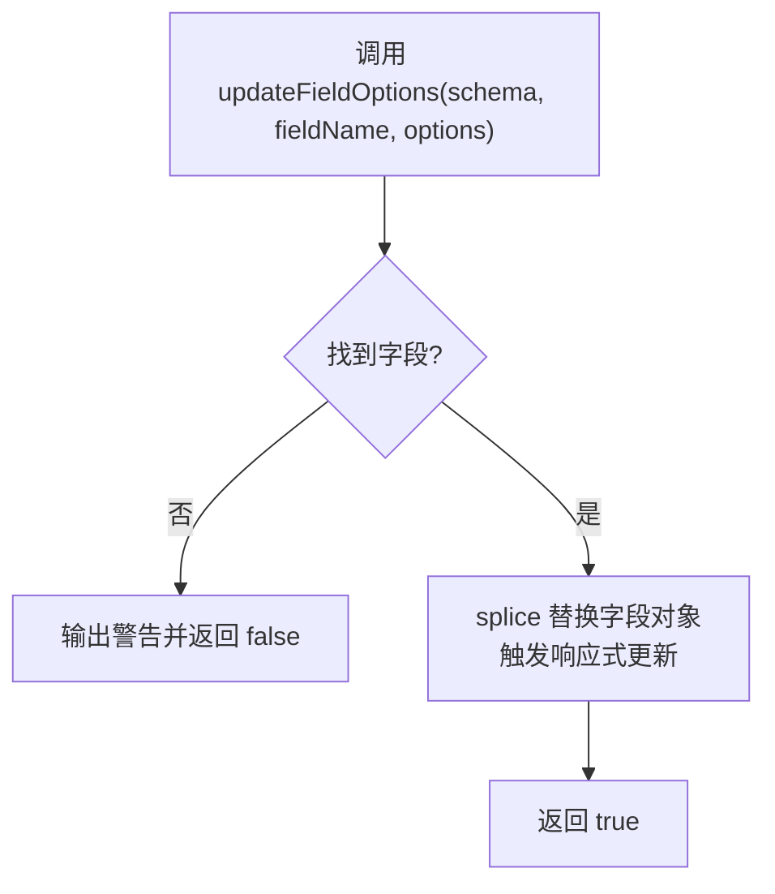
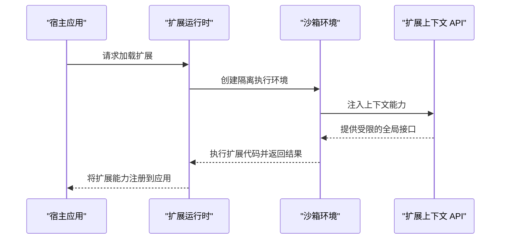
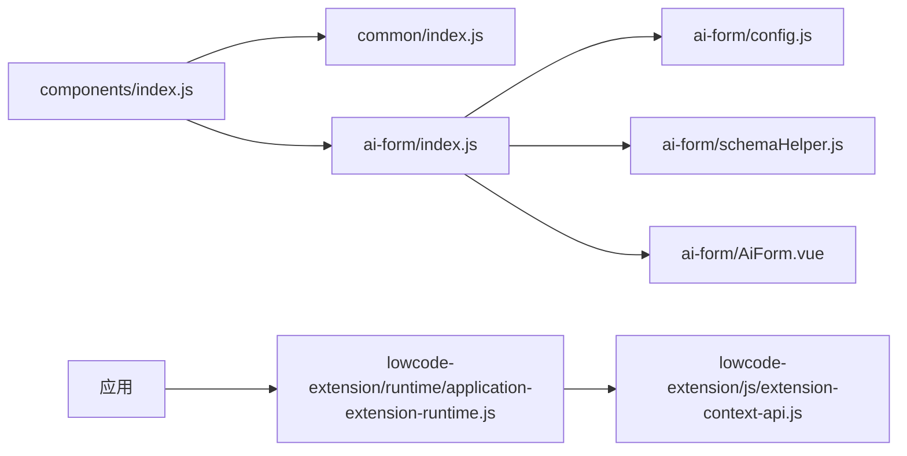

# 组件库管理

<cite>
**本文引用的文件**
- [package.json](file://forge-admin-ui/package.json)
- [components/index.js](file://forge-admin-ui/src/components/index.js)
- [common/index.js](file://forge-admin-ui/src/components/common/index.js)
- [ai-form/index.js](file://forge-admin-ui/src/components/ai-form/index.js)
- [ai-form/config.js](file://forge-admin-ui/src/components/ai-form/config.js)
- [ai-form/AiForm.vue](file://forge-admin-ui/src/components/ai-form/AiForm.vue)
- [ai-form/schemaHelper.js](file://forge-admin-ui/src/components/ai-form/schemaHelper.js)
- [lowcode-extension/runtime/application-extension-runtime.js](file://forge-admin-ui/src/components/lowcode-extension/runtime/application-extension-runtime.js)
- [lowcode-extension/js/extension-context-api.js](file://forge-admin-ui/src/components/lowcode-extension/js/extension-context-api.js)
</cite>

## 目录
1. [简介](#简介)
2. [项目结构](#项目结构)
3. [核心组件](#核心组件)
4. [架构总览](#架构总览)
5. [详细组件分析](#详细组件分析)
6. [依赖关系分析](#依赖关系分析)
7. [性能考量](#性能考量)
8. [故障排查指南](#故障排查指南)
9. [结论](#结论)
10. [附录](#附录)

## 简介
本技术文档围绕 Forge Admin 前端的表单与低代码组件体系，系统阐述内置组件分类、组件注册机制、属性配置与数据绑定、生命周期与事件系统、验证规则与样式定制，以及扩展开发、第三方集成与版本管理。重点聚焦 ai-form 动态表单能力与 lowcode-extension 运行时扩展机制，帮助开发者快速理解并高效扩展组件生态。

## 项目结构
前端工程采用模块化组织：
- 公共组件聚合导出：通过 components/index.js 统一暴露常用组件；common/index.js 进一步聚合通用 UI 组件。
- 动态表单子系统：ai-form 提供基于 JSON Schema 的动态渲染、字段工厂、选项更新工具等。
- 低代码扩展运行时：lowcode-extension 提供沙箱、上下文 API、运行时样式隔离等能力，用于在应用内加载和运行扩展代码。

图表来源
- [components/index.js:1-8](file://forge-admin-ui/src/components/index.js#L1-L8)
- [common/index.js:1-13](file://forge-admin-ui/src/components/common/index.js#L1-L13)
- [ai-form/index.js:1-44](file://forge-admin-ui/src/components/ai-form/index.js#L1-L44)
- [ai-form/AiForm.vue:147-200](file://forge-admin-ui/src/components/ai-form/AiForm.vue#L147-L200)
- [ai-form/config.js:25-62](file://forge-admin-ui/src/components/ai-form/config.js#L25-L62)
- [ai-form/schemaHelper.js:20-36](file://forge-admin-ui/src/components/ai-form/schemaHelper.js#L20-L36)
- [lowcode-extension/runtime/application-extension-runtime.js](file://forge-admin-ui/src/components/lowcode-extension/runtime/application-extension-runtime.js)
- [lowcode-extension/js/extension-context-api.js](file://forge-admin-ui/src/components/lowcode-extension/js/extension-context-api.js)

章节来源
- [package.json:1-107](file://forge-admin-ui/package.json#L1-L107)
- [components/index.js:1-8](file://forge-admin-ui/src/components/index.js#L1-L8)
- [common/index.js:1-13](file://forge-admin-ui/src/components/common/index.js#L1-L13)
- [ai-form/index.js:1-44](file://forge-admin-ui/src/components/ai-form/index.js#L1-L44)

## 核心组件
- AiForm：基于 JSON Schema 的动态表单容器，负责布局、校验、事件分发、操作区与弹窗表单嵌套。
- 字段类型与工厂：集中定义字段类型枚举与便捷创建函数，支持输入、选择、日期、上传、自定义插槽等。
- Schema 工具：提供选项更新、批量更新、级联更新、异步加载封装等能力，便于运行时动态调整表单。
- 低代码扩展运行时：为扩展代码提供安全沙箱与上下文 API，实现组件与能力的动态注入与运行。

章节来源
- [ai-form/AiForm.vue:147-200](file://forge-admin-ui/src/components/ai-form/AiForm.vue#L147-L200)
- [ai-form/config.js:25-62](file://forge-admin-ui/src/components/ai-form/config.js#L25-L62)
- [ai-form/schemaHelper.js:20-36](file://forge-admin-ui/src/components/ai-form/schemaHelper.js#L20-L36)
- [lowcode-extension/runtime/application-extension-runtime.js](file://forge-admin-ui/src/components/lowcode-extension/runtime/application-extension-runtime.js)
- [lowcode-extension/js/extension-context-api.js](file://forge-admin-ui/src/components/lowcode-extension/js/extension-context-api.js)

## 架构总览
下图展示了从应用入口到组件注册、表单渲染、Schema 更新与扩展运行的整体流程。

图表来源
- [components/index.js:1-8](file://forge-admin-ui/src/components/index.js#L1-L8)
- [ai-form/AiForm.vue:147-200](file://forge-admin-ui/src/components/ai-form/AiForm.vue#L147-L200)
- [ai-form/config.js:25-62](file://forge-admin-ui/src/components/ai-form/config.js#L25-L62)
- [ai-form/schemaHelper.js:20-36](file://forge-admin-ui/src/components/ai-form/schemaHelper.js#L20-L36)
- [lowcode-extension/runtime/application-extension-runtime.js](file://forge-admin-ui/src/components/lowcode-extension/runtime/application-extension-runtime.js)

## 详细组件分析

### AiForm 动态表单容器
- 职责
  - 接收 JSON Schema 与 v-model 数据，驱动表单渲染与双向绑定。
  - 管理布局参数（标签位置、宽度、对齐、尺寸、栅格列数、间距）。
  - 处理搜索表单折叠、操作按钮区域、弹窗表单嵌套。
  - 派发字段变更与节点动作事件，供上层业务逻辑响应。
- 关键特性
  - 支持 section 导航与滚动定位。
  - 支持 inline actions 插槽与外部操作区。
  - 可组合使用 Schema 工具进行运行时选项与配置更新。
- 生命周期要点
  - 初始化时根据 props 构建内部状态与可见 schema。
  - 监听 schema/value/context 变化以同步渲染与校验。
  - 卸载时清理事件与副作用。

图表来源
- [ai-form/AiForm.vue:147-200](file://forge-admin-ui/src/components/ai-form/AiForm.vue#L147-L200)

章节来源
- [ai-form/AiForm.vue:147-200](file://forge-admin-ui/src/components/ai-form/AiForm.vue#L147-L200)

### 字段类型与工厂（config.js）
- 字段类型枚举：覆盖输入、选择、日期时间、开关、滑块、评分、颜色、上传、级联、树选择、穿梭框、插槽、文本展示、远程搜索下拉等。
- createField：合并默认显示与交互配置，确保一致性。
- FieldFactory：提供快捷方法，减少样板配置，提升可读性与复用性。

图表来源
- [ai-form/config.js:25-62](file://forge-admin-ui/src/components/ai-form/config.js#L25-L62)
- [ai-form/config.js:67-309](file://forge-admin-ui/src/components/ai-form/config.js#L67-L309)

章节来源
- [ai-form/config.js:25-62](file://forge-admin-ui/src/components/ai-form/config.js#L25-L62)
- [ai-form/config.js:67-309](file://forge-admin-ui/src/components/ai-form/config.js#L67-L309)

### Schema 工具集（schemaHelper.js）
- updateFieldOptions：按字段名替换选项，触发响应式更新。
- batchUpdateFieldOptions：批量更新多个字段的选项，返回统计结果。
- updateFieldConfig：更新字段的其他配置项（如 disabled、loading）。
- getFieldConfig：获取指定字段配置。
- setFieldLoading：设置字段加载态，配合异步选项加载。
- createAsyncOptionsUpdater：封装异步加载流程，自动切换 loading 状态。
- createCascadeUpdater：根据父字段值联动更新子字段选项，清空无效值。

图表来源
- [ai-form/schemaHelper.js:20-36](file://forge-admin-ui/src/components/ai-form/schemaHelper.js#L20-L36)

章节来源
- [ai-form/schemaHelper.js:20-36](file://forge-admin-ui/src/components/ai-form/schemaHelper.js#L20-L36)
- [ai-form/schemaHelper.js:51-70](file://forge-admin-ui/src/components/ai-form/schemaHelper.js#L51-L70)
- [ai-form/schemaHelper.js:83-98](file://forge-admin-ui/src/components/ai-form/schemaHelper.js#L83-L98)
- [ai-form/schemaHelper.js:119-121](file://forge-admin-ui/src/components/ai-form/schemaHelper.js#L119-L121)
- [ai-form/schemaHelper.js:143-159](file://forge-admin-ui/src/components/ai-form/schemaHelper.js#L143-L159)
- [ai-form/schemaHelper.js:188-200](file://forge-admin-ui/src/components/ai-form/schemaHelper.js#L188-L200)

### 低代码扩展运行时与上下文 API
- application-extension-runtime.js：负责扩展的加载、沙箱隔离与运行时注入，使扩展能在受控环境中执行。
- extension-context-api.js：对外暴露扩展可用的上下文能力（如访问应用服务、路由、状态等），保证扩展与宿主解耦且安全。

图表来源
- [lowcode-extension/runtime/application-extension-runtime.js](file://forge-admin-ui/src/components/lowcode-extension/runtime/application-extension-runtime.js)
- [lowcode-extension/js/extension-context-api.js](file://forge-admin-ui/src/components/lowcode-extension/js/extension-context-api.js)

章节来源
- [lowcode-extension/runtime/application-extension-runtime.js](file://forge-admin-ui/src/components/lowcode-extension/runtime/application-extension-runtime.js)
- [lowcode-extension/js/extension-context-api.js](file://forge-admin-ui/src/components/lowcode-extension/js/extension-context-api.js)

## 依赖关系分析
- 组件聚合导出：components/index.js 作为统一出口，便于按需引入与 Tree-shaking。
- 通用组件：common/index.js 聚合基础 UI 组件，降低耦合度。
- 动态表单：ai-form 模块内部通过 index.js 聚合导出，config.js 与 schemaHelper.js 提供配置与工具能力。
- 扩展运行时：lowcode-extension 提供运行时支撑，与表单子系统协同工作，实现动态能力注入。

图表来源
- [components/index.js:1-8](file://forge-admin-ui/src/components/index.js#L1-L8)
- [common/index.js:1-13](file://forge-admin-ui/src/components/common/index.js#L1-L13)
- [ai-form/index.js:1-44](file://forge-admin-ui/src/components/ai-form/index.js#L1-L44)
- [ai-form/config.js:25-62](file://forge-admin-ui/src/components/ai-form/config.js#L25-L62)
- [ai-form/schemaHelper.js:20-36](file://forge-admin-ui/src/components/ai-form/schemaHelper.js#L20-L36)
- [ai-form/AiForm.vue:147-200](file://forge-admin-ui/src/components/ai-form/AiForm.vue#L147-L200)
- [lowcode-extension/runtime/application-extension-runtime.js](file://forge-admin-ui/src/components/lowcode-extension/runtime/application-extension-runtime.js)
- [lowcode-extension/js/extension-context-api.js](file://forge-admin-ui/src/components/lowcode-extension/js/extension-context-api.js)

章节来源
- [components/index.js:1-8](file://forge-admin-ui/src/components/index.js#L1-L8)
- [common/index.js:1-13](file://forge-admin-ui/src/components/common/index.js#L1-L13)
- [ai-form/index.js:1-44](file://forge-admin-ui/src/components/ai-form/index.js#L1-L44)

## 性能考量
- 响应式更新优化：Schema 工具通过 splice 替换字段对象触发最小化重渲染，避免全量重建。
- 懒加载与缓存：异步选项加载结合 loading 状态，减少不必要的请求与渲染。
- 栅格与布局：合理设置 gridCols 与 xGap/yGap，减少复杂布局带来的计算开销。
- 扩展运行时：沙箱隔离与按需加载，避免全局污染与冷启动成本。

[本节为通用指导，不直接分析具体文件]

## 故障排查指南
- Schema 字段未找到：当使用 updateFieldOptions/updateFieldConfig 时若字段不存在会输出警告并返回失败，请检查字段名与 schema 结构。
- 异步选项加载失败：createAsyncOptionsUpdater 会在 catch 中记录错误并抛出异常，建议在调用处捕获并提示用户。
- 级联更新异常：父字段为空时应清空子字段选项与值，确保状态一致。
- 扩展加载失败：检查扩展运行时是否正确注入上下文 API，确认沙箱权限与依赖可用。

章节来源
- [ai-form/schemaHelper.js:20-36](file://forge-admin-ui/src/components/ai-form/schemaHelper.js#L20-L36)
- [ai-form/schemaHelper.js:83-98](file://forge-admin-ui/src/components/ai-form/schemaHelper.js#L83-L98)
- [ai-form/schemaHelper.js:143-159](file://forge-admin-ui/src/components/ai-form/schemaHelper.js#L143-L159)
- [ai-form/schemaHelper.js:188-200](file://forge-admin-ui/src/components/ai-form/schemaHelper.js#L188-L200)

## 结论
Forge Admin 的组件库以 ai-form 为核心，结合统一的组件聚合导出与低代码扩展运行时，形成了高内聚、可扩展的表单与页面构建体系。通过字段工厂与 Schema 工具，开发者可以快速搭建复杂表单并实现运行时动态控制；借助扩展运行时，可在不侵入主应用的前提下注入新能力，满足多场景需求。建议遵循本文档的规范与实践，持续优化性能与可维护性。

[本节为总结性内容，不直接分析具体文件]

## 附录

### 组件注册与导出规范
- 统一入口：通过 components/index.js 暴露常用组件，便于集中管理与按需引入。
- 模块聚合：各子系统（如 ai-form）提供独立 index.js 聚合导出，保持边界清晰。
- 命名约定：组件与工具函数采用语义化命名，便于检索与维护。

章节来源
- [components/index.js:1-8](file://forge-admin-ui/src/components/index.js#L1-L8)
- [common/index.js:1-13](file://forge-admin-ui/src/components/common/index.js#L1-L13)
- [ai-form/index.js:1-44](file://forge-admin-ui/src/components/ai-form/index.js#L1-L44)

### 属性配置与数据绑定
- 表单容器属性：包括 schema、value、context、labelPlacement、labelWidth、labelAlign、size、gridCols、xGap、yGap 等。
- 字段配置：通过 createField 与 FieldFactory 生成标准化字段配置，支持 placeholder、defaultValue、required、disabled、clearable、span、rules 等。
- 数据绑定：v-model:value 与 formValue 双向绑定，变更事件通过 field-change 与 node-action 上报。

章节来源
- [ai-form/AiForm.vue:147-200](file://forge-admin-ui/src/components/ai-form/AiForm.vue#L147-L200)
- [ai-form/config.js:25-62](file://forge-admin-ui/src/components/ai-form/config.js#L25-L62)
- [ai-form/config.js:67-309](file://forge-admin-ui/src/components/ai-form/config.js#L67-L309)

### 事件系统与生命周期
- 事件：field-change（字段值变更）、node-action（节点动作，如弹窗表单触发）、submit/reset/cancel（表单操作）。
- 生命周期：挂载时初始化状态与可见 schema；更新时响应 props 变化；卸载时清理副作用。
- 弹窗表单：支持嵌套 AiForm，继承父级布局与上下文，便于复杂交互场景。

章节来源
- [ai-form/AiForm.vue:147-200](file://forge-admin-ui/src/components/ai-form/AiForm.vue#L147-L200)

### 验证规则与样式定制
- 验证规则：支持 rules 数组与预设校验模式，结合 normalizeValidationRules 进行规范化。
- 样式定制：通过 CSS 类名与主题变量（如 size、label-width）进行外观定制；扩展运行时支持作用域样式隔离。

章节来源
- [ai-form/AiForm.vue:147-200](file://forge-admin-ui/src/components/ai-form/AiForm.vue#L147-L200)
- [lowcode-extension/runtime/application-extension-runtime.js](file://forge-admin-ui/src/components/lowcode-extension/runtime/application-extension-runtime.js)

### 组件扩展开发与第三方集成
- 扩展开发：通过 lowcode-extension 运行时加载扩展代码，使用扩展上下文 API 访问宿主能力。
- 第三方集成：在扩展中引入第三方库或组件，利用沙箱隔离避免冲突；通过运行时注册至应用。
- 版本管理：依赖版本由 package.json 统一管理，建议使用 pnpm workspace 与锁定文件保障一致性。

章节来源
- [lowcode-extension/runtime/application-extension-runtime.js](file://forge-admin-ui/src/components/lowcode-extension/runtime/application-extension-runtime.js)
- [lowcode-extension/js/extension-context-api.js](file://forge-admin-ui/src/components/lowcode-extension/js/extension-context-api.js)
- [package.json:1-107](file://forge-admin-ui/package.json#L1-L107)

### API 参考与使用示例
- AiForm
  - Props：schema、value、context、labelPlacement、labelWidth、labelAlign、size、gridCols、xGap、yGap、showActions、showSubmit、showReset、showCancel、showCollapseToggle、actionModalLayout 等。
  - Events：field-change、node-action、submit、reset、cancel。
  - Slots：formAction、gridAppend、自定义插槽透传。
- 字段工厂
  - 方法：input、textarea、select、radio、checkbox、date、dateTime、time、switch、number、radioButton、dateRange、slider、rate、color、cascader、treeSelect、transfer、upload、slot、text、customSelect。
- Schema 工具
  - 方法：updateFieldOptions、batchUpdateFieldOptions、updateFieldConfig、getFieldConfig、setFieldLoading、createAsyncOptionsUpdater、createCascadeUpdater。

章节来源
- [ai-form/AiForm.vue:147-200](file://forge-admin-ui/src/components/ai-form/AiForm.vue#L147-L200)
- [ai-form/config.js:67-309](file://forge-admin-ui/src/components/ai-form/config.js#L67-L309)
- [ai-form/schemaHelper.js:20-36](file://forge-admin-ui/src/components/ai-form/schemaHelper.js#L20-L36)
- [ai-form/schemaHelper.js:51-70](file://forge-admin-ui/src/components/ai-form/schemaHelper.js#L51-L70)
- [ai-form/schemaHelper.js:83-98](file://forge-admin-ui/src/components/ai-form/schemaHelper.js#L83-L98)
- [ai-form/schemaHelper.js:119-121](file://forge-admin-ui/src/components/ai-form/schemaHelper.js#L119-L121)
- [ai-form/schemaHelper.js:143-159](file://forge-admin-ui/src/components/ai-form/schemaHelper.js#L143-L159)
- [ai-form/schemaHelper.js:188-200](file://forge-admin-ui/src/components/ai-form/schemaHelper.js#L188-L200)