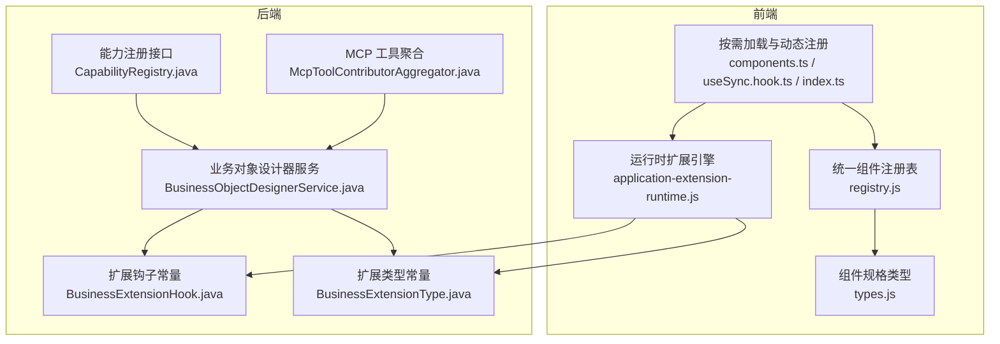
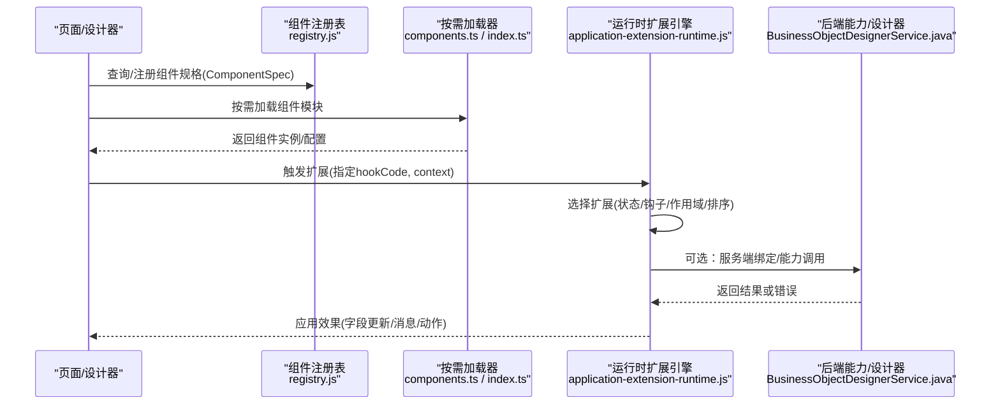
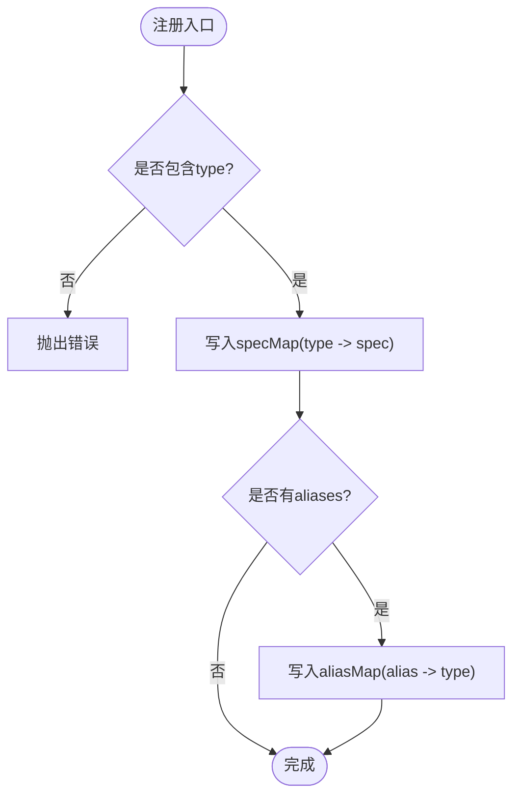
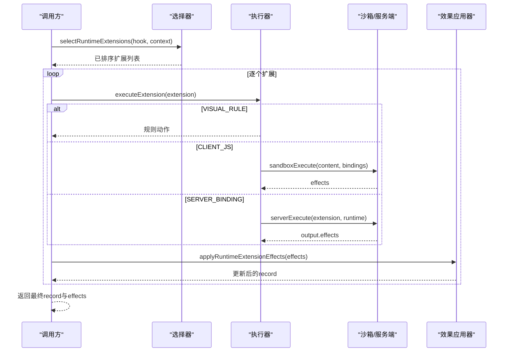
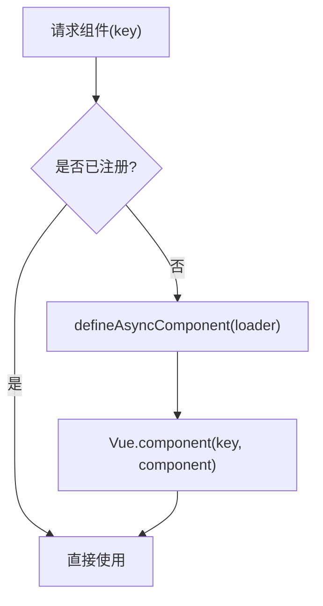
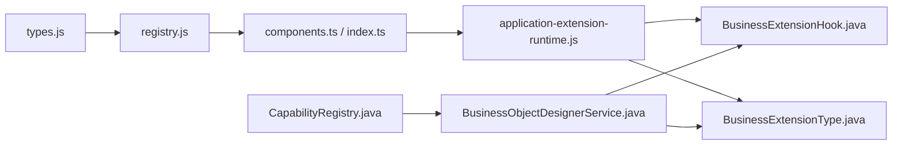

# 组件注册机制

<cite>
**本文引用的文件**
- [registry.js](file://forge-admin-ui/src/components/lowcode-builder/designer-core/spec/registry.js)
- [types.js](file://forge-admin-ui/src/components/lowcode-builder/designer-core/spec/types.js)
- [application-extension-runtime.js](file://forge-admin-ui/src/components/lowcode-extension/runtime/application-extension-runtime.js)
- [components.ts](file://forge-report-ui/src/utils/components.ts)
- [useSync.hook.ts](file://forge-report-ui/src/views/chart/hooks/useSync.hook.ts)
- [index.ts](file://forge-report-ui/src/packages/index.ts)
- [BusinessExtensionHook.java](file://forge-server/forge-framework/forge-plugin-parent/forge-plugin-generator/src/main/java/com/mdframe/forge/plugin/generator/constant/BusinessExtensionHook.java)
- [BusinessExtensionType.java](file://forge-server/forge-framework/forge-plugin-parent/forge-plugin-generator/src/main/java/com/mdframe/forge/plugin/generator/constant/BusinessExtensionType.java)
- [BusinessObjectDesignerService.java](file://forge-server/forge-framework/forge-plugin-parent/forge-plugin-generator/src/main/java/com/mdframe/forge/plugin/generator/service/businessapp/BusinessObjectDesignerService.java)
- [CapabilityRegistry.java](file://forge-server/forge-framework/forge-plugin-parent/forge-plugin-capability-parent/forge-plugin-capability-core/src/main/java/com/mdframe/forge/plugin/capability/registry/CapabilityRegistry.java)
- [McpToolContributorAggregator.java](file://forge-server/forge-framework/forge-plugin-parent/forge-plugin-mcp/src/main/java/com/mdframe/forge/plugin/mcp/spi/McpToolContributorAggregator.java)
- [PortalPageRenderer.vue](file://forge-admin-ui/src/views/app-center/components/portal/PortalPageRenderer.vue)
- [ExtensionVersionDrawer.vue](file://forge-admin-ui/src/views/app-center/application-workspace/ExtensionVersionDrawer.vue)
- [ProjectVersionModal.vue](file://forge-report-ui/src/components/ProjectVersionModal.vue)
</cite>

## 目录
1. [简介](#简介)
2. [项目结构](#项目结构)
3. [核心组件](#核心组件)
4. [架构总览](#架构总览)
5. [详细组件分析](#详细组件分析)
6. [依赖关系分析](#依赖关系分析)
7. [性能考虑](#性能考虑)
8. [故障排查指南](#故障排查指南)
9. [结论](#结论)
10. [附录](#附录)

## 简介
本技术文档围绕 Forge Admin 的“组件注册机制”展开，系统性说明前端与后端的组件动态注册、懒加载、依赖管理、元数据定义、属性映射、生命周期钩子、版本管理、热重载与调试支持，并给出自定义组件注册流程、插件化架构与扩展点设计。文档以代码级事实为依据，提供可视化图示与可操作建议，帮助读者快速理解并安全扩展系统能力。

## 项目结构
本项目在前后端均实现了组件注册与扩展能力：
- 前端统一组件注册表：集中管理组件规格（ComponentSpec），提供注册、查询、别名解析、分组与统计等 API。
- 前端运行时扩展：基于 Hook 的客户端/服务端扩展执行引擎，支持可视化规则、客户端脚本、作用域样式与服务端绑定。
- 前端按需加载与动态注册：通过异步组件与全局 Vue 实例实现组件的动态安装与懒加载。
- 后端扩展与能力注册：提供扩展类型与钩子常量、业务对象设计器中的组件默认值与属性合并、能力注册接口以及 MCP 工具聚合等。

图表来源
- [registry.js:1-169](file://forge-admin-ui/src/components/lowcode-builder/designer-core/spec/registry.js#L1-L169)
- [types.js:100-119](file://forge-admin-ui/src/components/lowcode-builder/designer-core/spec/types.js#L100-L119)
- [application-extension-runtime.js:1-296](file://forge-admin-ui/src/components/lowcode-extension/runtime/application-extension-runtime.js#L1-L296)
- [components.ts:1-30](file://forge-report-ui/src/utils/components.ts#L1-L30)
- [useSync.hook.ts:116-132](file://forge-report-ui/src/views/chart/hooks/useSync.hook.ts#L116-L132)
- [index.ts:32-89](file://forge-report-ui/src/packages/index.ts#L32-L89)
- [BusinessExtensionHook.java:1-36](file://forge-server/forge-framework/forge-plugin-parent/forge-plugin-generator/src/main/java/com/mdframe/forge/plugin/generator/constant/BusinessExtensionHook.java#L1-L36)
- [BusinessExtensionType.java:1-19](file://forge-server/forge-framework/forge-plugin-parent/forge-plugin-generator/src/main/java/com/mdframe/forge/plugin/generator/constant/BusinessExtensionType.java#L1-L19)
- [BusinessObjectDesignerService.java:2774-2796](file://forge-server/forge-framework/forge-plugin-parent/forge-plugin-generator/src/main/java/com/mdframe/forge/plugin/generator/service/businessapp/BusinessObjectDesignerService.java#L2774-L2796)
- [CapabilityRegistry.java:1-17](file://forge-server/forge-framework/forge-plugin-parent/forge-plugin-capability-parent/forge-plugin-capability-core/src/main/java/com/mdframe/forge/plugin/capability/registry/CapabilityRegistry.java#L1-L17)
- [McpToolContributorAggregator.java:1-18](file://forge-server/forge-framework/forge-plugin-parent/forge-plugin-mcp/src/main/java/com/mdframe/forge/plugin/mcp/spi/McpToolContributorAggregator.java#L1-L18)

章节来源
- [registry.js:1-169](file://forge-admin-ui/src/components/lowcode-builder/designer-core/spec/registry.js#L1-L169)
- [application-extension-runtime.js:1-296](file://forge-admin-ui/src/components/lowcode-extension/runtime/application-extension-runtime.js#L1-L296)
- [components.ts:1-30](file://forge-report-ui/src/utils/components.ts#L1-L30)
- [useSync.hook.ts:116-132](file://forge-report-ui/src/views/chart/hooks/useSync.hook.ts#L116-L132)
- [index.ts:32-89](file://forge-report-ui/src/packages/index.ts#L32-L89)
- [BusinessExtensionHook.java:1-36](file://forge-server/forge-framework/forge-plugin-parent/forge-plugin-generator/src/main/java/com/mdframe/forge/plugin/generator/constant/BusinessExtensionHook.java#L1-L36)
- [BusinessExtensionType.java:1-19](file://forge-server/forge-framework/forge-plugin-parent/forge-plugin-generator/src/main/java/com/mdframe/forge/plugin/generator/constant/BusinessExtensionType.java#L1-L19)
- [BusinessObjectDesignerService.java:2774-2796](file://forge-server/forge-framework/forge-plugin-parent/forge-plugin-generator/src/main/java/com/mdframe/forge/plugin/generator/service/businessapp/BusinessObjectDesignerService.java#L2774-L2796)
- [CapabilityRegistry.java:1-17](file://forge-server/forge-framework/forge-plugin-parent/forge-plugin-capability-core/src/main/java/com/mdframe/forge/plugin/capability/registry/CapabilityRegistry.java#L1-L17)
- [McpToolContributorAggregator.java:1-18](file://forge-server/forge-framework/forge-plugin-parent/forge-plugin-mcp/src/main/java/com/mdframe/forge/plugin/mcp/spi/McpToolContributorAggregator.java#L1-L18)

## 核心组件
- 统一组件注册表（前端）
  - 职责：维护 ComponentSpec 集合，提供注册、查询、别名解析、分组、过滤与统计能力。
  - 关键能力：单条/批量注册、按 scope/category 过滤、按 group 分组、别名映射、统计信息导出。
- 运行时扩展引擎（前端）
  - 职责：根据 Hook 选择并执行扩展，支持可视化规则、客户端脚本、作用域样式与服务端绑定。
  - 关键能力：扩展筛选、沙箱执行、效果应用、失败策略、字段写入权限校验。
- 动态组件加载与注册（前端）
  - 职责：按需加载组件模块，并在 Vue 实例中动态注册，避免首屏冗余。
  - 关键能力：异步组件封装、全局组件安装、懒加载钩子。
- 后端扩展与能力注册
  - 职责：定义扩展类型与钩子、构建运行时表单布局、合并组件默认属性、暴露能力注册与调用接口。
  - 关键能力：扩展类型白名单、钩子约束、组件默认值合并、能力分页查询与强一致调用。

章节来源
- [registry.js:1-169](file://forge-admin-ui/src/components/lowcode-builder/designer-core/spec/registry.js#L1-L169)
- [application-extension-runtime.js:1-296](file://forge-admin-ui/src/components/lowcode-extension/runtime/application-extension-runtime.js#L1-L296)
- [components.ts:1-30](file://forge-report-ui/src/utils/components.ts#L1-L30)
- [useSync.hook.ts:116-132](file://forge-report-ui/src/views/chart/hooks/useSync.hook.ts#L116-L132)
- [index.ts:32-89](file://forge-report-ui/src/packages/index.ts#L32-L89)
- [BusinessExtensionHook.java:1-36](file://forge-server/forge-framework/forge-plugin-parent/forge-plugin-generator/src/main/java/com/mdframe/forge/plugin/generator/constant/BusinessExtensionHook.java#L1-L36)
- [BusinessExtensionType.java:1-19](file://forge-server/forge-framework/forge-plugin-parent/forge-plugin-generator/src/main/java/com/mdframe/forge/plugin/generator/constant/BusinessExtensionType.java#L1-L19)
- [BusinessObjectDesignerService.java:2774-2796](file://forge-server/forge-framework/forge-plugin-parent/forge-plugin-generator/src/main/java/com/mdframe/forge/plugin/generator/service/businessapp/BusinessObjectDesignerService.java#L2774-L2796)
- [CapabilityRegistry.java:1-17](file://forge-server/forge-framework/forge-plugin-parent/forge-plugin-capability-core/src/main/java/com/mdframe/forge/plugin/capability/registry/CapabilityRegistry.java#L1-L17)

## 架构总览
下图展示了从“组件注册表”到“运行时扩展执行”的端到端流程，包括前端注册、按需加载、扩展选择与执行、后端能力调用的整体链路。

图表来源
- [registry.js:17-41](file://forge-admin-ui/src/components/lowcode-builder/designer-core/spec/registry.js#L17-L41)
- [components.ts:7-23](file://forge-report-ui/src/utils/components.ts#L7-L23)
- [index.ts:46-89](file://forge-report-ui/src/packages/index.ts#L46-L89)
- [application-extension-runtime.js:5-94](file://forge-admin-ui/src/components/lowcode-extension/runtime/application-extension-runtime.js#L5-L94)
- [BusinessObjectDesignerService.java:2774-2796](file://forge-server/forge-framework/forge-plugin-parent/forge-plugin-generator/src/main/java/com/mdframe/forge/plugin/generator/service/businessapp/BusinessObjectDesignerService.java#L2774-L2796)

## 详细组件分析

### 统一组件注册表（前端）
- 设计要点
  - 使用 Map 存储组件规格与别名映射，保证 O(1) 查找与插入。
  - 提供单条与批量注册，重复 type 会覆盖并告警；别名冲突时重映射并告警。
  - 支持按 scope（F/L/F+L）、category、group 进行过滤与分组。
  - 提供统计信息与清空能力（便于测试）。
- 复杂度
  - 注册/查询/过滤均为 O(1)/O(n)，分组为 O(n)。
- 优化建议
  - 对大规模组件列表，可按 category/scope 建立二级索引以提升过滤性能。
  - 将冻结后的 spec 缓存副本，避免外部修改影响。

图表来源
- [registry.js:17-41](file://forge-admin-ui/src/components/lowcode-builder/designer-core/spec/registry.js#L17-L41)
- [registry.js:48-75](file://forge-admin-ui/src/components/lowcode-builder/designer-core/spec/registry.js#L48-L75)
- [registry.js:90-141](file://forge-admin-ui/src/components/lowcode-builder/designer-core/spec/registry.js#L90-L141)

章节来源
- [registry.js:1-169](file://forge-admin-ui/src/components/lowcode-builder/designer-core/spec/registry.js#L1-L169)
- [types.js:100-119](file://forge-admin-ui/src/components/lowcode-builder/designer-core/spec/types.js#L100-L119)

### 运行时扩展引擎（前端）
- 设计要点
  - 扩展选择：按状态、钩子码、作用域匹配，并按排序稳定排序。
  - 扩展执行：支持可视化规则、客户端脚本（沙箱）、作用域样式与服务端绑定。
  - 效果应用：仅允许受控效果类型（设置字段、显示消息、触发动作），并对字段写入权限进行校验。
  - 失败策略：支持 BLOCK/WARN，记录日志并可选择中断流程。
- 复杂度
  - 选择与执行线性遍历 O(n)，效果应用 O(m)。
- 优化建议
  - 对高频 Hook 场景，可对扩展集做预编译/缓存。
  - 沙箱执行前进行最小读写字段白名单裁剪，减少不必要的数据传递。

图表来源
- [application-extension-runtime.js:5-94](file://forge-admin-ui/src/components/lowcode-extension/runtime/application-extension-runtime.js#L5-L94)
- [application-extension-runtime.js:131-160](file://forge-admin-ui/src/components/lowcode-extension/runtime/application-extension-runtime.js#L131-L160)
- [application-extension-runtime.js:114-129](file://forge-admin-ui/src/components/lowcode-extension/runtime/application-extension-runtime.js#L114-L129)

章节来源
- [application-extension-runtime.js:1-296](file://forge-admin-ui/src/components/lowcode-extension/runtime/application-extension-runtime.js#L1-L296)

### 动态组件加载与注册（前端）
- 设计要点
  - 通过 defineAsyncComponent 封装异步加载，提供加载中/骨架屏组件。
  - 通过全局 Vue 实例动态注册组件，避免重复注册。
  - 在图表渲染流程中，依据配置项动态获取并注册展示/配置组件。
- 复杂度
  - 首次加载为网络开销，后续命中缓存；注册为 O(1)。
- 优化建议
  - 结合路由级懒加载与分包策略，进一步降低首屏体积。
  - 对频繁使用的组件进行预取与缓存。

图表来源
- [components.ts:7-23](file://forge-report-ui/src/utils/components.ts#L7-L23)
- [useSync.hook.ts:116-132](file://forge-report-ui/src/views/chart/hooks/useSync.hook.ts#L116-L132)
- [index.ts:46-89](file://forge-report-ui/src/packages/index.ts#L46-L89)

章节来源
- [components.ts:1-30](file://forge-report-ui/src/utils/components.ts#L1-L30)
- [useSync.hook.ts:116-132](file://forge-report-ui/src/views/chart/hooks/useSync.hook.ts#L116-L132)
- [index.ts:32-89](file://forge-report-ui/src/packages/index.ts#L32-L89)

### 后端扩展与能力注册
- 扩展类型与钩子
  - 明确支持的扩展类型（可视化规则、客户端脚本、作用域样式、服务端绑定）。
  - 限定各类型允许的钩子集合，确保扩展行为边界清晰。
- 业务对象设计器
  - 构建运行时表单节点时，校验字段绑定与可见性规则，生成精简的运行时布局。
  - 合并缺失属性，保留业务组件的关键配置，避免运行时异常。
- 能力注册接口
  - 提供能力分页查询、按编码与版本强一致获取、统一调用入口。
- MCP 工具聚合
  - 启动阶段合并固定工具并拒绝重复名称，保障工具命名唯一性。

章节来源
- [BusinessExtensionType.java:1-19](file://forge-server/forge-framework/forge-plugin-parent/forge-plugin-generator/src/main/java/com/mdframe/forge/plugin/generator/constant/BusinessExtensionType.java#L1-L19)
- [BusinessExtensionHook.java:1-36](file://forge-server/forge-framework/forge-plugin-parent/forge-plugin-generator/src/main/java/com/mdframe/forge/plugin/generator/constant/BusinessExtensionHook.java#L1-L36)
- [BusinessObjectDesignerService.java:2774-2796](file://forge-server/forge-framework/forge-plugin-parent/forge-plugin-generator/src/main/java/com/mdframe/forge/plugin/generator/service/businessapp/BusinessObjectDesignerService.java#L2774-L2796)
- [CapabilityRegistry.java:1-17](file://forge-server/forge-framework/forge-plugin-parent/forge-plugin-capability-core/src/main/java/com/mdframe/forge/plugin/capability/registry/CapabilityRegistry.java#L1-L17)
- [McpToolContributorAggregator.java:1-18](file://forge-server/forge-framework/forge-plugin-parent/forge-plugin-mcp/src/main/java/com/mdframe/forge/plugin/mcp/spi/McpToolContributorAggregator.java#L1-L18)

## 依赖关系分析
- 组件注册表依赖组件规格类型定义，形成稳定的契约。
- 运行时扩展引擎依赖扩展类型与钩子常量，确保前后端语义一致。
- 设计器服务依赖扩展类型与钩子，用于构建运行时布局与默认值合并。
- 能力注册作为跨模块抽象，被设计器与业务服务共同消费。
- 动态加载器依赖包清单与模块映射，实现按需装配。

图表来源
- [types.js:100-119](file://forge-admin-ui/src/components/lowcode-builder/designer-core/spec/types.js#L100-L119)
- [registry.js:1-169](file://forge-admin-ui/src/components/lowcode-builder/designer-core/spec/registry.js#L1-L169)
- [components.ts:1-30](file://forge-report-ui/src/utils/components.ts#L1-L30)
- [index.ts:32-89](file://forge-report-ui/src/packages/index.ts#L32-L89)
- [application-extension-runtime.js:1-296](file://forge-admin-ui/src/components/lowcode-extension/runtime/application-extension-runtime.js#L1-L296)
- [BusinessExtensionHook.java:1-36](file://forge-server/forge-framework/forge-plugin-parent/forge-plugin-generator/src/main/java/com/mdframe/forge/plugin/generator/constant/BusinessExtensionHook.java#L1-L36)
- [BusinessExtensionType.java:1-19](file://forge-server/forge-framework/forge-plugin-parent/forge-plugin-generator/src/main/java/com/mdframe/forge/plugin/generator/constant/BusinessExtensionType.java#L1-L19)
- [BusinessObjectDesignerService.java:2774-2796](file://forge-server/forge-framework/forge-plugin-parent/forge-plugin-generator/src/main/java/com/mdframe/forge/plugin/generator/service/businessapp/BusinessObjectDesignerService.java#L2774-L2796)
- [CapabilityRegistry.java:1-17](file://forge-server/forge-framework/forge-plugin-parent/forge-plugin-capability-core/src/main/java/com/mdframe/forge/plugin/capability/registry/CapabilityRegistry.java#L1-L17)

## 性能考虑
- 注册表查询与过滤
  - 使用 Map 实现 O(1) 查找；对大量组件可按 category/scope 建立二级索引。
- 运行时扩展执行
  - 预筛选与排序减少无效执行；对高频 Hook 缓存扩展列表。
  - 沙箱执行前裁剪读写字段白名单，降低数据拷贝与校验成本。
- 组件懒加载
  - 使用异步组件与分包策略，减少首屏体积；对常用组件预取与缓存。
- 后端能力调用
  - 分页查询能力列表，避免一次性加载过多元数据；强一致获取能力定义，减少重试。

[本节为通用性能建议，不直接分析具体文件]

## 故障排查指南
- 组件未找到或重复注册
  - 检查注册表是否已存在同名 type；查看别名映射是否冲突。
  - 确认按需加载路径与模块键名正确。
- 扩展未生效
  - 核对扩展状态、钩子码与作用域是否匹配；检查排序与优先级。
  - 客户端脚本需初始化沙箱；服务端绑定需正确返回 success 与 effects。
- 字段写入失败
  - 校验字段是否存在且可写；注意只读/隐藏/禁用状态的字段不可写。
- 版本与回滚问题
  - 对比版本差异，确认目标版本可用；发布/回退操作需幂等处理。

章节来源
- [registry.js:17-41](file://forge-admin-ui/src/components/lowcode-builder/designer-core/spec/registry.js#L17-L41)
- [application-extension-runtime.js:83-94](file://forge-admin-ui/src/components/lowcode-extension/runtime/application-extension-runtime.js#L83-L94)
- [application-extension-runtime.js:96-102](file://forge-admin-ui/src/components/lowcode-extension/runtime/application-extension-runtime.js#L96-L102)
- [ExtensionVersionDrawer.vue:120-135](file://forge-admin-ui/src/views/app-center/application-workspace/ExtensionVersionDrawer.vue#L120-L135)
- [ProjectVersionModal.vue:81-101](file://forge-report-ui/src/components/ProjectVersionModal.vue#L81-L101)

## 结论
Forge Admin 在前端提供了统一的组件注册表与运行时扩展引擎，在后端定义了清晰的扩展类型与钩子约束，并通过设计器服务与能力注册接口形成完整的插件化体系。借助动态加载、版本管理与失败策略，系统在可扩展性、可维护性与运行稳定性方面具备良好基础。建议在大规模场景中引入二级索引、预编译与缓存策略，进一步提升性能与可观测性。

[本节为总结性内容，不直接分析具体文件]

## 附录

### 组件元数据与属性映射
- 组件规格（ComponentSpec）包含类型、别名、范围、分类、分组、标签、描述、布局、容器能力、嵌套深度、接受子组件、属性面板 Schema、数据源、打印配置、字段默认值与额外元数据。
- 设计器在服务端构建运行时布局时，会校验字段绑定与可见性规则，生成精简节点，并合并缺失属性以保证运行时一致性。

章节来源
- [types.js:100-119](file://forge-admin-ui/src/components/lowcode-builder/designer-core/spec/types.js#L100-L119)
- [BusinessObjectDesignerService.java:2774-2796](file://forge-server/forge-framework/forge-plugin-parent/forge-plugin-generator/src/main/java/com/mdframe/forge/plugin/generator/service/businessapp/BusinessObjectDesignerService.java#L2774-L2796)

### 生命周期钩子与扩展点
- 前端运行时扩展支持 PAGE_INIT、FORM_CHANGE、BEFORE_SUBMIT、AFTER_SUBMIT、ROW_ACTION 等钩子；作用域样式仅在 PAGE_INIT 生效。
- 扩展类型限制：VISUAL_RULE、CLIENT_JS、SCOPED_CSS、SERVER_BINDING。
- 页面渲染过程中，通过执行 Hook 并应用效果，实现字段更新、消息提示与动作触发。

章节来源
- [BusinessExtensionHook.java:1-36](file://forge-server/forge-framework/forge-plugin-parent/forge-plugin-generator/src/main/java/com/mdframe/forge/plugin/generator/constant/BusinessExtensionHook.java#L1-L36)
- [BusinessExtensionType.java:1-19](file://forge-server/forge-framework/forge-plugin-parent/forge-plugin-generator/src/main/java/com/mdframe/forge/plugin/generator/constant/BusinessExtensionType.java#L1-L19)
- [PortalPageRenderer.vue:328-364](file://forge-admin-ui/src/views/app-center/components/portal/PortalPageRenderer.vue#L328-L364)

### 版本管理、热重载与调试支持
- 版本管理：支持扩展版本对比、回退与发布；报表项目亦提供版本历史与操作。
- 热重载：前端采用 Vite + Vue 的 HMR 机制；SSR 模式下需注意插件配置与模块失效策略。
- 调试支持：扩展执行失败时输出可读错误信息，屏蔽敏感字段；可通过控制台与消息提示定位问题。

章节来源
- [ExtensionVersionDrawer.vue:120-135](file://forge-admin-ui/src/views/app-center/application-workspace/ExtensionVersionDrawer.vue#L120-L135)
- [ProjectVersionModal.vue:81-101](file://forge-report-ui/src/components/ProjectVersionModal.vue#L81-L101)
- [application-extension-runtime.js:83-94](file://forge-admin-ui/src/components/lowcode-extension/runtime/application-extension-runtime.js#L83-L94)

### 自定义组件注册流程与插件化扩展点
- 自定义组件注册
  - 在前端注册表中声明 ComponentSpec，并提供别名与分组信息。
  - 通过按需加载器动态导入组件模块，并在 Vue 实例中注册。
- 插件化扩展点
  - 后端通过扩展类型与钩子定义扩展边界；设计器服务负责合并默认属性与构建运行时布局。
  - 能力注册接口提供统一的能力发现与调用入口；MCP 工具聚合确保工具命名唯一。

章节来源
- [registry.js:17-41](file://forge-admin-ui/src/components/lowcode-builder/designer-core/spec/registry.js#L17-L41)
- [components.ts:7-23](file://forge-report-ui/src/utils/components.ts#L7-L23)
- [index.ts:46-89](file://forge-report-ui/src/packages/index.ts#L46-L89)
- [BusinessObjectDesignerService.java:2774-2796](file://forge-server/forge-framework/forge-plugin-parent/forge-plugin-generator/src/main/java/com/mdframe/forge/plugin/generator/service/businessapp/BusinessObjectDesignerService.java#L2774-L2796)
- [CapabilityRegistry.java:1-17](file://forge-server/forge-framework/forge-plugin-parent/forge-plugin-capability-core/src/main/java/com/mdframe/forge/plugin/capability/registry/CapabilityRegistry.java#L1-L17)
- [McpToolContributorAggregator.java:1-18](file://forge-server/forge-framework/forge-plugin-parent/forge-plugin-mcp/src/main/java/com/mdframe/forge/plugin/mcp/spi/McpToolContributorAggregator.java#L1-L18)