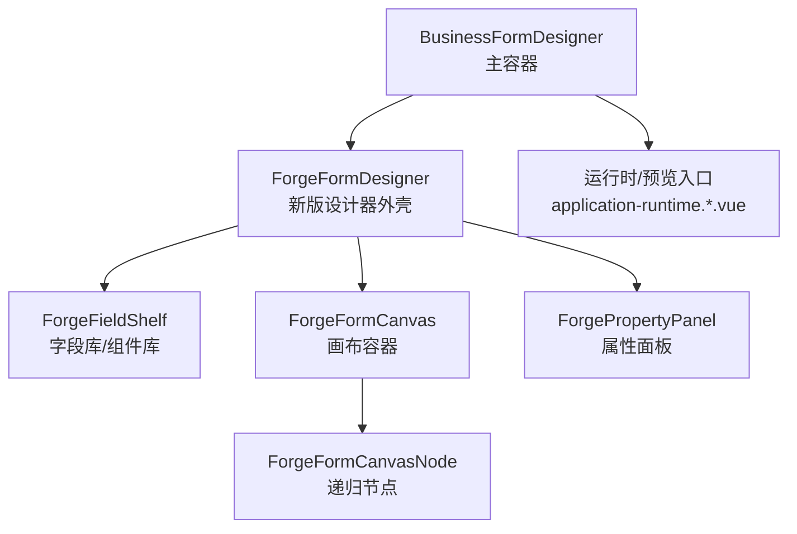
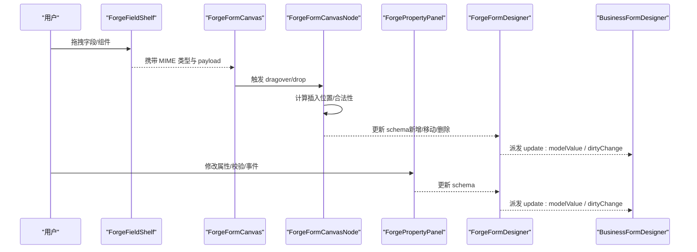
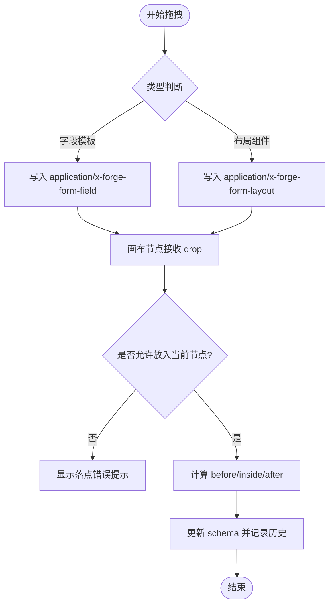
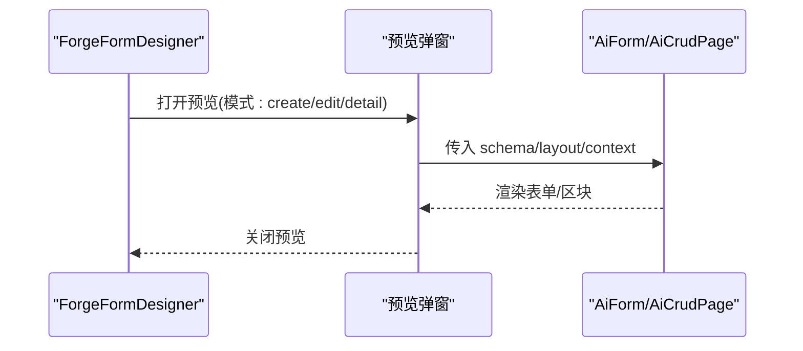
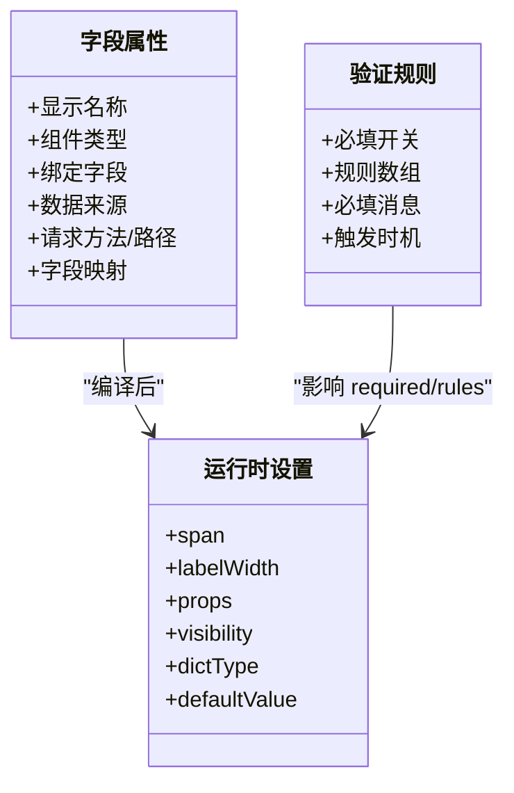
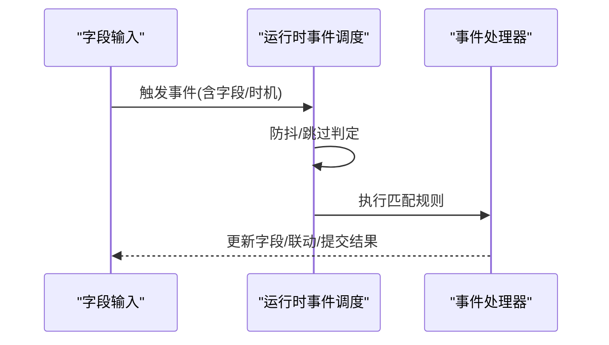
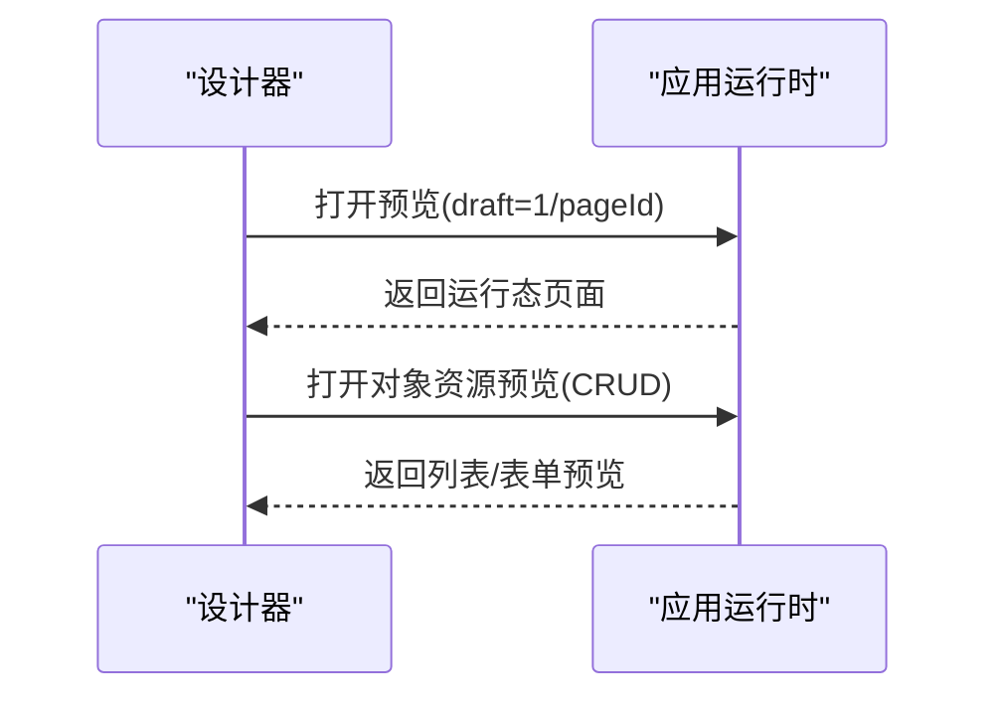
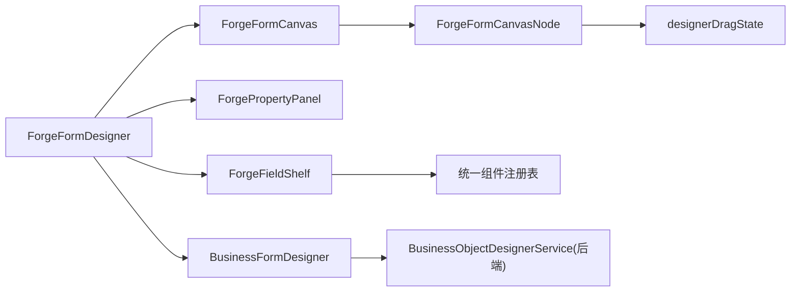

# 表单设计器

<cite>
**本文引用的文件**
- [BusinessFormDesigner.vue](file://forge-admin-ui/src/views/app-center/components/designer/BusinessFormDesigner.vue)
- [ForgeFormDesigner.vue](file://forge-admin-ui/src/views/app-center/components/designer/forge-form-designer/ForgeFormDesigner.vue)
- [ForgePropertyPanel.vue](file://forge-admin-ui/src/views/app-center/components/designer/forge-form-designer/ForgePropertyPanel.vue)
- [ForgeFieldShelf.vue](file://forge-admin-ui/src/views/app-center/components/designer/forge-form-designer/ForgeFieldShelf.vue)
- [ForgeFormCanvas.vue](file://forge-admin-ui/src/views/app-center/components/designer/forge-form-designer/ForgeFormCanvas.vue)
- [ForgeFormCanvasNode.vue](file://forge-admin-ui/src/views/app-center/components/designer/forge-form-designer/ForgeFormCanvasNode.vue)
- [designerDragState.js](file://forge-admin-ui/src/views/app-center/components/designer/forge-form-designer/designerDragState.js)
- [formDesignerSchema.js](file://forge-admin-ui/src/views/app-center/components/designer/form-first/formDesignerSchema.js)
- [BusinessObjectDesignerService.java](file://forge-server/forge-framework/forge-plugin-parent/forge-plugin-generator/src/main/java/com/mdframe/forge/plugin/generator/service/businessapp/BusinessObjectDesignerService.java)
- [application-runtime.[applicationCode].vue](file://forge-admin-ui/src/views/app-center/application-runtime.[applicationCode].vue)
- [index.vue](file://forge-admin-ui/src/views/app-center/index.vue)
</cite>

## 目录
1. [简介](#简介)
2. [项目结构](#项目结构)
3. [核心组件](#核心组件)
4. [架构总览](#架构总览)
5. [详细组件分析](#详细组件分析)
6. [依赖关系分析](#依赖关系分析)
7. [性能考虑](#性能考虑)
8. [故障排查指南](#故障排查指南)
9. [结论](#结论)
10. [附录](#附录)

## 简介
本技术文档围绕“表单设计器”的可视化拖拽编辑、组件库管理、动态表单渲染与数据绑定等核心能力，系统梳理了前端设计器、运行时预览、属性面板、画布节点、字段资产与布局配置、验证规则、事件处理机制，以及模板管理与发布流程。文档面向具备不同技术背景的读者，提供从整体架构到代码级细节的分层说明，并附带流程图与时序图帮助理解关键交互路径。

## 项目结构
表单设计器位于应用中心的设计器模块中，采用“容器-画布-属性面板-字段库”的经典低代码布局：
- 顶层容器负责主对象与关联对象的切换、旧版/新版设计器切换、与页面/对象运行时的集成。
- 新版设计器包含左侧字段库（统一组件物料+字段资产）、中间画布（可拖拽、嵌套容器、子表）、右侧属性面板（基础属性、布局、校验、事件、联动、权限、离线草稿等）。
- 画布由根容器与递归节点组成，支持多种布局容器（行/列、卡片、标签页、折叠面板、表格网格等）与业务组件（CRUD 区块、子表等）。
- 表单 Schema 在前后端均有规范化与迁移逻辑，确保保存态与运行态一致。

**图示来源**
- [BusinessFormDesigner.vue:1-129](file://forge-admin-ui/src/views/app-center/components/designer/BusinessFormDesigner.vue#L1-L129)
- [ForgeFormDesigner.vue:1-238](file://forge-admin-ui/src/views/app-center/components/designer/forge-form-designer/ForgeFormDesigner.vue#L1-L238)
- [ForgeFormCanvas.vue:1-69](file://forge-admin-ui/src/views/app-center/components/designer/forge-form-designer/ForgeFormCanvas.vue#L1-L69)

**章节来源**
- [BusinessFormDesigner.vue:1-129](file://forge-admin-ui/src/views/app-center/components/designer/BusinessFormDesigner.vue#L1-L129)
- [ForgeFormDesigner.vue:1-238](file://forge-admin-ui/src/views/app-center/components/designer/forge-form-designer/ForgeFormDesigner.vue#L1-L238)

## 核心组件
- BusinessFormDesigner：编排主对象与关联对象表单设计，兼容旧版 FormCreate 设计器；同步表单 Schema 到页面区段；维护打开方式、列数、标签宽度等布局参数。
- ForgeFormDesigner：新版设计器外壳，提供撤销/重做、清空画布、底部操作栏、多表单资产切换、预览模式、分区视图等。
- ForgeFieldShelf：统一组件物料面板与字段资产面板，支持搜索、过滤、拖拽添加；对不支持的组件进行白名单隐藏。
- ForgeFormCanvas：画布容器，承载 n-form 网格、空态提示、设备视口缩放、源码查看、专注模式等。
- ForgeFormCanvasNode：递归节点，实现拖拽放置判定、插入位置计算、容器类型限制、错误提示等。
- ForgePropertyPanel：属性面板，覆盖标识、组件类型、数据来源、布局、校验、事件、联动、权限、离线草稿等。
- formDesignerSchema：Schema 版本、布局组件键集合、虚拟组件集合、默认列数与全宽组件策略等。
- BusinessObjectDesignerService：后端将设计器配置映射为运行时表单布局与字段设置，包括标签位置、对齐、尺寸、反馈、必填与消息等。

**章节来源**
- [BusinessFormDesigner.vue:303-800](file://forge-admin-ui/src/views/app-center/components/designer/BusinessFormDesigner.vue#L303-L800)
- [ForgeFormDesigner.vue:472-800](file://forge-admin-ui/src/views/app-center/components/designer/forge-form-designer/ForgeFormDesigner.vue#L472-L800)
- [ForgeFieldShelf.vue:1-252](file://forge-admin-ui/src/views/app-center/components/designer/forge-form-designer/ForgeFieldShelf.vue#L1-L252)
- [ForgeFormCanvas.vue:1-200](file://forge-admin-ui/src/views/app-center/components/designer/forge-form-designer/ForgeFormCanvas.vue#L1-L200)
- [ForgeFormCanvasNode.vue:936-1176](file://forge-admin-ui/src/views/app-center/components/designer/forge-form-designer/ForgeFormCanvasNode.vue#L936-L1176)
- [ForgePropertyPanel.vue:1-200](file://forge-admin-ui/src/views/app-center/components/designer/forge-form-designer/ForgePropertyPanel.vue#L1-L200)
- [formDesignerSchema.js:1-200](file://forge-admin-ui/src/views/app-center/components/designer/form-first/formDesignerSchema.js#L1-L200)
- [BusinessObjectDesignerService.java:2052-2078](file://forge-server/forge-framework/forge-plugin-parent/forge-plugin-generator/src/main/java/com/mdframe/forge/plugin/generator/service/businessapp/BusinessObjectDesignerService.java#L2052-L2078)

## 架构总览
设计器以“Schema 驱动”为核心：用户在画布上拖拽组件、调整属性，形成统一的表单 Schema；该 Schema 既用于设计期渲染，也用于运行期渲染与预览。后端服务会将设计器配置转换为运行时所需的布局与字段设置，保证前后端一致性。

**图示来源**
- [ForgeFieldShelf.vue:188-244](file://forge-admin-ui/src/views/app-center/components/designer/forge-form-designer/ForgeFieldShelf.vue#L188-L244)
- [ForgeFormCanvas.vue:1-69](file://forge-admin-ui/src/views/app-center/components/designer/forge-form-designer/ForgeFormCanvas.vue#L1-L69)
- [ForgeFormCanvasNode.vue:936-1176](file://forge-admin-ui/src/views/app-center/components/designer/forge-form-designer/ForgeFormCanvasNode.vue#L936-L1176)
- [ForgeFormDesigner.vue:663-680](file://forge-admin-ui/src/views/app-center/components/designer/forge-form-designer/ForgeFormDesigner.vue#L663-L680)
- [BusinessFormDesigner.vue:650-706](file://forge-admin-ui/src/views/app-center/components/designer/BusinessFormDesigner.vue#L650-L706)

## 详细组件分析

### 可视化拖拽编辑
- 字段库与组件库统一通过 UnifiedComponentPalette 暴露，表单设计器根据白名单过滤显示项，避免无效组件干扰。
- 拖拽时区分“字段模板”和“布局组件”两种 MIME 类型，分别生成带字段绑定的组件或纯布局节点。
- 画布节点根据父容器类型（行/列、表格网格、标签页、折叠面板等）限制可放置的子节点，防止非法嵌套。
- 拖拽状态集中管理，支持拖拽源、预览组件、落点 key 与错误提示的短时展示。

**图示来源**
- [ForgeFieldShelf.vue:188-244](file://forge-admin-ui/src/views/app-center/components/designer/forge-form-designer/ForgeFieldShelf.vue#L188-L244)
- [ForgeFormCanvasNode.vue:936-1176](file://forge-admin-ui/src/views/app-center/components/designer/forge-form-designer/ForgeFormCanvasNode.vue#L936-L1176)
- [designerDragState.js:1-51](file://forge-admin-ui/src/views/app-center/components/designer/forge-form-designer/designerDragState.js#L1-L51)

**章节来源**
- [ForgeFieldShelf.vue:1-252](file://forge-admin-ui/src/views/app-center/components/designer/forge-form-designer/ForgeFieldShelf.vue#L1-L252)
- [ForgeFormCanvasNode.vue:936-1176](file://forge-admin-ui/src/views/app-center/components/designer/forge-form-designer/ForgeFormCanvasNode.vue#L936-L1176)
- [designerDragState.js:1-51](file://forge-admin-ui/src/views/app-center/components/designer/forge-form-designer/designerDragState.js#L1-L51)

### 组件库管理
- 统一组件注册表复用列表设计器的物料体系，表单侧通过键名映射适配。
- 表单画布仅暴露支持的布局与业务组件，未支持的直接隐藏，降低误用。
- 字段资产面板支持“未使用/已使用/系统”三类筛选，标记锁定与占用状态。

**章节来源**
- [ForgeFieldShelf.vue:112-222](file://forge-admin-ui/src/views/app-center/components/designer/forge-form-designer/ForgeFieldShelf.vue#L112-L222)

### 动态表单渲染与预览
- 设计器内置预览弹窗，按新增/编辑/详情三种模式渲染，支持标签页/折叠面板/卡片等容器内嵌表单。
- 预览布局与设计器布局同源（列数、标签位置/宽度/对齐、尺寸、间距），避免设计与预览不一致。
- 运行时通过 AiForm/AiCrudPage 等组件加载，支持上下文注入与表单资源集。

**图示来源**
- [ForgeFormDesigner.vue:254-402](file://forge-admin-ui/src/views/app-center/components/designer/forge-form-designer/ForgeFormDesigner.vue#L254-L402)
- [ForgeFormDesigner.vue:596-608](file://forge-admin-ui/src/views/app-center/components/designer/forge-form-designer/ForgeFormDesigner.vue#L596-L608)

**章节来源**
- [ForgeFormDesigner.vue:254-402](file://forge-admin-ui/src/views/app-center/components/designer/forge-form-designer/ForgeFormDesigner.vue#L254-L402)
- [ForgeFormDesigner.vue:596-608](file://forge-admin-ui/src/views/app-center/components/designer/forge-form-designer/ForgeFormDesigner.vue#L596-L608)

### 表单布局配置
- 支持网格列数、标签位置/对齐/宽度、尺寸、反馈显示、必填星号隐藏、行/列间距等。
- 旧版与新版的打开方式（弹出框/抽屉/平铺/多页签）与宽度、抽屉方向等均可配置。
- 后端服务将设计器配置映射为运行时布局与字段设置，保证跨端一致性。

**章节来源**
- [BusinessFormDesigner.vue:658-706](file://forge-admin-ui/src/views/app-center/components/designer/BusinessFormDesigner.vue#L658-L706)
- [BusinessObjectDesignerService.java:2180-2201](file://forge-server/forge-framework/forge-plugin-parent/forge-plugin-generator/src/main/java/com/mdframe/forge/plugin/generator/service/businessapp/BusinessObjectDesignerService.java#L2180-L2201)

### 字段属性设置与验证规则
- 字段属性包括显示名称、组件类型、绑定字段、数据来源（静态/上下文/远程接口）、请求方法与响应路径、字段映射等。
- 验证规则支持必填开关与自定义规则数组，必填消息可来自规则或占位符；后端会迁移旧版 validate/$required 至新结构。
- 运行时字段设置会合并布局 span、labelWidth、props、visibility、字典类型、默认值等。

**图示来源**
- [ForgePropertyPanel.vue:30-200](file://forge-admin-ui/src/views/app-center/components/designer/forge-form-designer/ForgePropertyPanel.vue#L30-L200)
- [BusinessFormDesigner.vue:719-772](file://forge-admin-ui/src/views/app-center/components/designer/BusinessFormDesigner.vue#L719-L772)
- [BusinessObjectDesignerService.java:2052-2078](file://forge-server/forge-framework/forge-plugin-parent/forge-plugin-generator/src/main/java/com/mdframe/forge/plugin/generator/service/businessapp/BusinessObjectDesignerService.java#L2052-L2078)

**章节来源**
- [ForgePropertyPanel.vue:30-200](file://forge-admin-ui/src/views/app-center/components/designer/forge-form-designer/ForgePropertyPanel.vue#L30-L200)
- [BusinessFormDesigner.vue:719-772](file://forge-admin-ui/src/views/app-center/components/designer/BusinessFormDesigner.vue#L719-L772)
- [BusinessObjectDesignerService.java:2052-2078](file://forge-server/forge-framework/forge-plugin-parent/forge-plugin-generator/src/main/java/com/mdframe/forge/plugin/generator/service/businessapp/BusinessObjectDesignerService.java#L2052-L2078)

### 事件处理机制
- 表单治理配置支持表单级事件、字段事件与字段联动，可在属性面板“事件”页签中配置。
- 运行时事件调度支持防抖与跳过策略，按触发时机（如 change/form_load）匹配规则并执行。
- 设计器变更会派发生成后的遗留联动 Schema，供旧版链路兼容。

**图示来源**
- [ForgePropertyPanel.vue:3918-4678](file://forge-admin-ui/src/views/app-center/components/designer/forge-form-designer/ForgePropertyPanel.vue#L3918-L4678)
- [ForgeFormDesigner.vue:676-679](file://forge-admin-ui/src/views/app-center/components/designer/forge-form-designer/ForgeFormDesigner.vue#L676-L679)
- [lowcode-runtime 示例:709-737](file://forge-h5-ui/src/pages/lowcode-runtime.vue#L709-L737)

**章节来源**
- [ForgePropertyPanel.vue:3918-4678](file://forge-admin-ui/src/views/app-center/components/designer/forge-form-designer/ForgePropertyPanel.vue#L3918-L4678)
- [ForgeFormDesigner.vue:676-679](file://forge-admin-ui/src/views/app-center/components/designer/forge-form-designer/ForgeFormDesigner.vue#L676-L679)

### 表单模板管理与多表单资产
- 支持在主表单之外创建多个表单资产（如新增/编辑/详情），通过 tab 切换与复制/新建操作管理。
- 表单资产来源于 schema.settings.formAssets，设计器顶部工具栏提供新建空白表单、复制当前表单等操作。
- 旧版设计器可通过打开方式控制表单呈现形态。

**章节来源**
- [ForgeFormDesigner.vue:134-149](file://forge-admin-ui/src/views/app-center/components/designer/forge-form-designer/ForgeFormDesigner.vue#L134-L149)
- [ForgeFormDesigner.vue:654-661](file://forge-admin-ui/src/views/app-center/components/designer/forge-form-designer/ForgeFormDesigner.vue#L654-L661)
- [BusinessFormDesigner.vue:456-484](file://forge-admin-ui/src/views/app-center/components/designer/BusinessFormDesigner.vue#L456-L484)

### 预览调试与发布部署
- 设计器内提供预览弹窗，支持多模式预览；也可通过应用运行时页面以 draft=1 打开预览。
- 对象资源（CRUD）支持独立预览入口，表单模式下自动带入创建/编辑参数。
- 应用创建后可跳转至运行页面，便于联调与发布前验证。

**图示来源**
- [application-runtime.[applicationCode].vue:5124-5166](file://forge-admin-ui/src/views/app-center/application-runtime.[applicationCode].vue#L5124-L5166)
- [index.vue:528-560](file://forge-admin-ui/src/views/app-center/index.vue#L528-L560)

**章节来源**
- [application-runtime.[applicationCode].vue:5124-5166](file://forge-admin-ui/src/views/app-center/application-runtime.[applicationCode].vue#L5124-L5166)
- [index.vue:528-560](file://forge-admin-ui/src/views/app-center/index.vue#L528-L560)

## 依赖关系分析
- 设计器外壳（ForgeFormDesigner）依赖画布、属性面板、字段库与页面分区编辑器。
- 画布节点依赖拖拽状态与放置判定逻辑，向上派发 schema 更新。
- 字段库依赖统一组件注册表与表单白名单，屏蔽不支持的组件。
- 后端服务依赖前端 Schema 约定，将设计器配置转换为运行时布局与字段设置。

**图示来源**
- [ForgeFormDesigner.vue:1-238](file://forge-admin-ui/src/views/app-center/components/designer/forge-form-designer/ForgeFormDesigner.vue#L1-L238)
- [ForgeFormCanvas.vue:1-69](file://forge-admin-ui/src/views/app-center/components/designer/forge-form-designer/ForgeFormCanvas.vue#L1-L69)
- [ForgeFormCanvasNode.vue:936-1176](file://forge-admin-ui/src/views/app-center/components/designer/forge-form-designer/ForgeFormCanvasNode.vue#L936-L1176)
- [designerDragState.js:1-51](file://forge-admin-ui/src/views/app-center/components/designer/forge-form-designer/designerDragState.js#L1-L51)
- [BusinessObjectDesignerService.java:2180-2201](file://forge-server/forge-framework/forge-plugin-parent/forge-plugin-generator/src/main/java/com/mdframe/forge/plugin/generator/service/businessapp/BusinessObjectDesignerService.java#L2180-L2201)

**章节来源**
- [ForgeFormDesigner.vue:1-238](file://forge-admin-ui/src/views/app-center/components/designer/forge-form-designer/ForgeFormDesigner.vue#L1-L238)
- [ForgeFormCanvas.vue:1-69](file://forge-admin-ui/src/views/app-center/components/designer/forge-form-designer/ForgeFormCanvas.vue#L1-L69)
- [ForgeFormCanvasNode.vue:936-1176](file://forge-admin-ui/src/views/app-center/components/designer/forge-form-designer/ForgeFormCanvasNode.vue#L936-L1176)
- [designerDragState.js:1-51](file://forge-admin-ui/src/views/app-center/components/designer/forge-form-designer/designerDragState.js#L1-L51)
- [BusinessObjectDesignerService.java:2180-2201](file://forge-server/forge-framework/forge-plugin-parent/forge-plugin-generator/src/main/java/com/mdframe/forge/plugin/generator/service/businessapp/BusinessObjectDesignerService.java#L2180-L2201)

## 性能考虑
- 撤销/重做栈限制长度，避免无限增长导致内存压力。
- 画布节点仅在必要时计算落点与可见性，减少重复渲染。
- 字段库与组件库通过白名单与分组过滤，降低 DOM 数量。
- 事件调度支持防抖，避免高频触发导致的过多请求。
- 预览与运行时共享同一布局配置，减少重复计算与不一致风险。

[本节为通用性能建议，不直接分析具体文件]

## 故障排查指南
- 拖拽失败或落点错误：检查拖拽 MIME 类型、父容器是否允许、是否落入自身节点；关注 dropError 提示。
- 字段无法绑定或丢失：确认字段资产未被锁定、未被其他表单占用；必要时使用“清理失效字段”修复引用。
- 校验不生效：检查必填开关与 rules 数组、trigger 配置；后端迁移逻辑可能改变必填消息来源。
- 预览与设计不一致：核对 gridColumns/gridCols、labelPlacement/labelWidth/labelAlign、size、gap 等布局参数是否一致。
- 事件未触发：检查事件钩子名称、字段来源、防抖时间、跳过条件；确认运行时事件调度是否正确匹配。

**章节来源**
- [ForgeFormCanvasNode.vue:936-1176](file://forge-admin-ui/src/views/app-center/components/designer/forge-form-designer/ForgeFormCanvasNode.vue#L936-L1176)
- [ForgeFormDesigner.vue:743-799](file://forge-admin-ui/src/views/app-center/components/designer/forge-form-designer/ForgeFormDesigner.vue#L743-L799)
- [BusinessObjectDesignerService.java:2052-2078](file://forge-server/forge-framework/forge-plugin-parent/forge-plugin-generator/src/main/java/com/mdframe/forge/plugin/generator/service/businessapp/BusinessObjectDesignerService.java#L2052-L2078)
- [ForgeFormDesigner.vue:596-608](file://forge-admin-ui/src/views/app-center/components/designer/forge-form-designer/ForgeFormDesigner.vue#L596-L608)

## 结论
本表单设计器以 Schema 为中心，实现了可视化拖拽、组件库管理、动态渲染与数据绑定的一体化体验。通过严格的前后端 Schema 约定与运行时映射，保证了设计期与运行期的一致性；同时提供了完善的属性面板、事件联动、预览调试与发布流程，满足复杂业务场景下的表单构建需求。建议在扩展组件与规则时遵循现有白名单与映射规范，保持前后端契约一致，以获得最佳的可维护性与性能表现。

## 附录
- 表单 Schema 版本与布局组件键定义见 formDesignerSchema。
- 运行时字段设置与布局映射见 BusinessObjectDesignerService。
- 设计器外壳与画布交互见 ForgeFormDesigner 与 ForgeFormCanvas。
- 字段库与白名单过滤见 ForgeFieldShelf。
- 属性面板与事件联动见 ForgePropertyPanel。

**章节来源**
- [formDesignerSchema.js:1-200](file://forge-admin-ui/src/views/app-center/components/designer/form-first/formDesignerSchema.js#L1-L200)
- [BusinessObjectDesignerService.java:2180-2201](file://forge-server/forge-framework/forge-plugin-parent/forge-plugin-generator/src/main/java/com/mdframe/forge/plugin/generator/service/businessapp/BusinessObjectDesignerService.java#L2180-L2201)
- [ForgeFormDesigner.vue:472-800](file://forge-admin-ui/src/views/app-center/components/designer/forge-form-designer/ForgeFormDesigner.vue#L472-L800)
- [ForgeFormCanvas.vue:1-200](file://forge-admin-ui/src/views/app-center/components/designer/forge-form-designer/ForgeFormCanvas.vue#L1-L200)
- [ForgeFieldShelf.vue:112-222](file://forge-admin-ui/src/views/app-center/components/designer/forge-form-designer/ForgeFieldShelf.vue#L112-L222)
- [ForgePropertyPanel.vue:3918-4678](file://forge-admin-ui/src/views/app-center/components/designer/forge-form-designer/ForgePropertyPanel.vue#L3918-L4678)