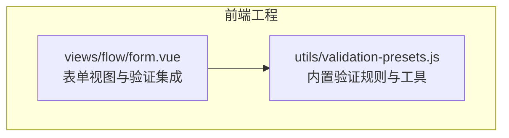
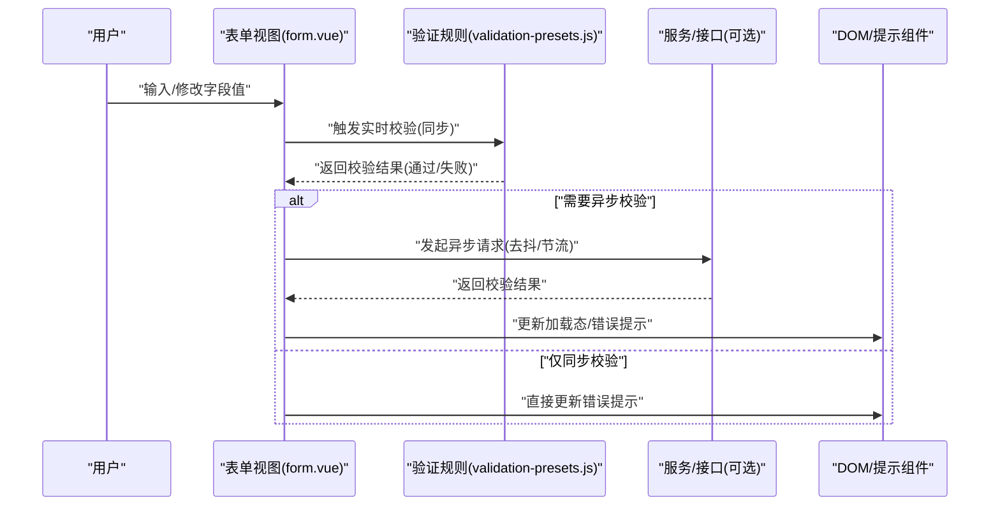
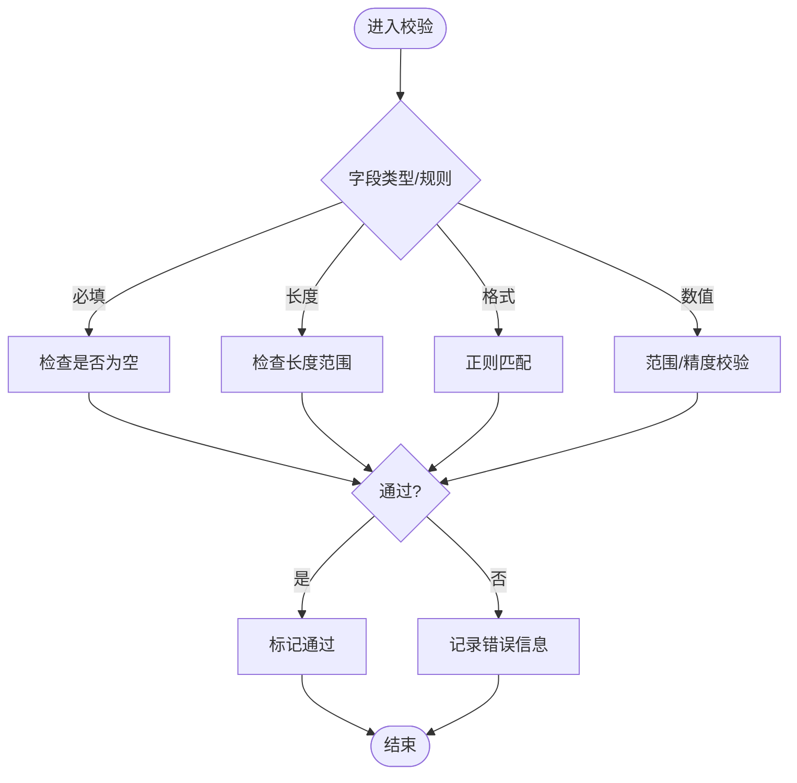
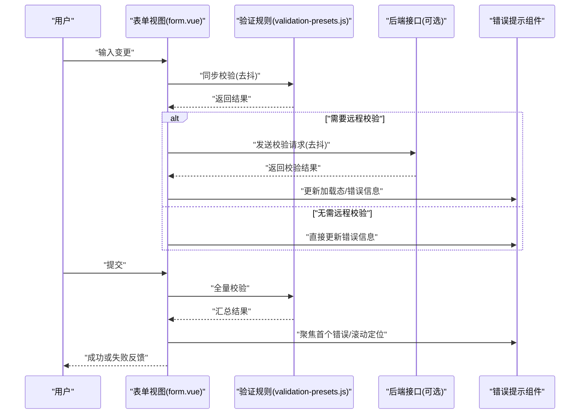
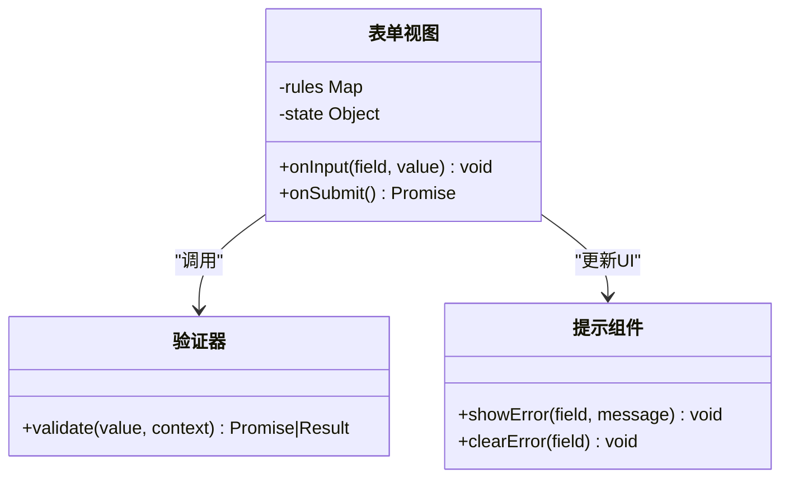
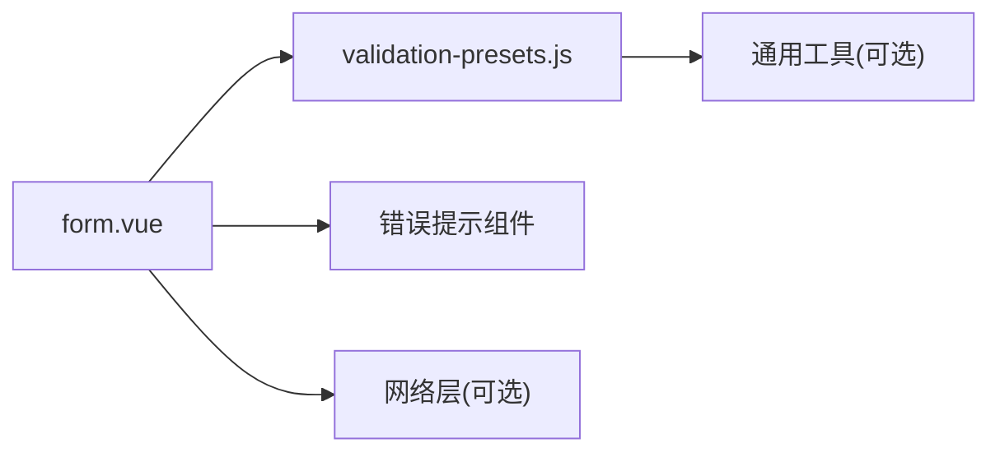

# 表单验证系统

<cite>
**本文引用的文件**
- [forge-admin-ui/src/utils/validation-presets.js](file://forge-admin-ui/src/utils/validation-presets.js)
- [forge-admin-ui/src/views/flow/form.vue](file://forge-admin-ui/src/views/flow/form.vue)
</cite>

## 目录
1. [简介](#简介)
2. [项目结构](#项目结构)
3. [核心组件](#核心组件)
4. [架构总览](#架构总览)
5. [详细组件分析](#详细组件分析)
6. [依赖关系分析](#依赖关系分析)
7. [性能考量](#性能考量)
8. [故障排查指南](#故障排查指南)
9. [结论](#结论)
10. [附录](#附录)

## 简介
本技术文档围绕 forge-admin 前端的表单验证体系，系统性说明内置验证规则、自定义验证器、异步验证与实时校验机制；解释验证消息配置、错误提示展示与验证状态管理；并给出复杂场景处理、性能优化与用户体验优化建议，以及规则配置示例与调试技巧。目标是帮助开发者快速理解、正确使用并扩展表单验证能力。

## 项目结构
本项目中，表单验证相关能力主要位于前端工程 forge-admin-ui：
- 验证预设与工具：位于 utils 目录，提供常用验证规则与辅助函数
- 表单视图与集成：位于 views 目录，演示如何在页面中使用验证能力

图表来源
- [forge-admin-ui/src/utils/validation-presets.js](file://forge-admin-ui/src/utils/validation-presets.js)
- [forge-admin-ui/src/views/flow/form.vue](file://forge-admin-ui/src/views/flow/form.vue)

章节来源
- [forge-admin-ui/src/utils/validation-presets.js](file://forge-admin-ui/src/utils/validation-presets.js)
- [forge-admin-ui/src/views/flow/form.vue](file://forge-admin-ui/src/views/flow/form.vue)

## 核心组件
- 内置验证规则集合：集中定义常见字段校验（如必填、长度、格式等），便于复用与统一维护
- 自定义验证器：允许在业务侧扩展或覆盖默认规则，支持同步与异步两种模式
- 实时校验：在用户输入过程中触发轻量级校验，提升交互体验
- 异步校验：对需要网络或复杂计算的场景进行延迟校验，避免阻塞 UI
- 验证消息与错误展示：统一管理提示文案与展示位置，保证一致的用户体验
- 验证状态管理：跟踪每个字段的校验结果、加载态与错误信息，驱动 UI 渲染

章节来源
- [forge-admin-ui/src/utils/validation-presets.js](file://forge-admin-ui/src/utils/validation-presets.js)
- [forge-admin-ui/src/views/flow/form.vue](file://forge-admin-ui/src/views/flow/form.vue)

## 架构总览
下图展示了表单从用户输入到验证执行、再到错误展示的完整流程，包括实时校验与异步校验的分支路径。

图表来源
- [forge-admin-ui/src/views/flow/form.vue](file://forge-admin-ui/src/views/flow/form.vue)
- [forge-admin-ui/src/utils/validation-presets.js](file://forge-admin-ui/src/utils/validation-presets.js)

## 详细组件分析

### 内置验证规则（validation-presets.js）
- 职责：集中提供常用字段校验逻辑，确保规则一致性、可测试性与可维护性
- 典型能力：
  - 基础校验：非空、长度范围、数值范围、正则匹配等
  - 组合校验：多字段联动、条件校验
  - 可扩展点：以函数形式暴露，便于在业务层按需引入或覆盖
- 复杂度与性能：
  - 同步规则为 O(1) 或 O(n)（n 为输入长度），适合高频触发
  - 复杂正则或长文本需考虑防抖/节流策略

图表来源
- [forge-admin-ui/src/utils/validation-presets.js](file://forge-admin-ui/src/utils/validation-presets.js)

章节来源
- [forge-admin-ui/src/utils/validation-presets.js](file://forge-admin-ui/src/utils/validation-presets.js)

### 表单视图与验证集成（form.vue）
- 职责：将验证规则绑定到具体字段，管理验证状态与错误展示，协调异步校验
- 关键流程：
  - 监听输入事件，触发实时校验
  - 对耗时操作使用去抖/节流，减少重复计算
  - 调用异步校验时显示加载态，完成后更新错误提示
  - 提交前进行全量校验，阻止无效数据提交
- 状态管理：
  - 字段级：valid、invalid、pending、message
  - 表单级：isValidating、errors、submitting

图表来源
- [forge-admin-ui/src/views/flow/form.vue](file://forge-admin-ui/src/views/flow/form.vue)
- [forge-admin-ui/src/utils/validation-presets.js](file://forge-admin-ui/src/utils/validation-presets.js)

章节来源
- [forge-admin-ui/src/views/flow/form.vue](file://forge-admin-ui/src/views/flow/form.vue)

### 自定义验证器与异步验证
- 自定义验证器：
  - 在业务侧实现校验函数，遵循统一的入参/出参约定
  - 可注册到全局规则表，或在局部表单中注入
- 异步验证：
  - 适用于唯一性检查、权限校验、外部系统校验等
  - 建议结合去抖/节流与取消令牌，避免竞态与内存泄漏
  - 明确 pending 态，防止误判“通过”

图表来源
- [forge-admin-ui/src/views/flow/form.vue](file://forge-admin-ui/src/views/flow/form.vue)
- [forge-admin-ui/src/utils/validation-presets.js](file://forge-admin-ui/src/utils/validation-presets.js)

章节来源
- [forge-admin-ui/src/views/flow/form.vue](file://forge-admin-ui/src/views/flow/form.vue)
- [forge-admin-ui/src/utils/validation-presets.js](file://forge-admin-ui/src/utils/validation-presets.js)

### 验证消息配置与错误提示展示
- 消息来源：
  - 规则内默认消息
  - 国际化资源或配置中心
  - 业务侧覆盖
- 展示策略：
  - 行内提示：紧邻字段下方
  - 顶部汇总：提交失败时列出所有错误
  - 首次交互即提示：避免误导用户继续填写
- 可访问性：
  - 为错误区域设置语义化标签
  - 键盘可达与屏幕阅读器友好

章节来源
- [forge-admin-ui/src/views/flow/form.vue](file://forge-admin-ui/src/views/flow/form.vue)
- [forge-admin-ui/src/utils/validation-presets.js](file://forge-admin-ui/src/utils/validation-presets.js)

### 验证状态管理与复杂场景
- 状态设计：
  - 字段级：value、touched、dirty、valid、invalid、pending、message
  - 表单级：isValidating、errors、submitting、initialValues
- 复杂场景：
  - 多字段联动：A 变化影响 B 的校验规则
  - 条件必填：根据选择项动态切换必填
  - 跨字段约束：如开始时间不得晚于结束时间
  - 列表型字段：逐项校验与整体约束并存
- 最佳实践：
  - 将复杂规则拆分为原子规则组合
  - 使用 memoization 缓存中间结果
  - 对频繁触发的校验做防抖/节流

章节来源
- [forge-admin-ui/src/views/flow/form.vue](file://forge-admin-ui/src/views/flow/form.vue)
- [forge-admin-ui/src/utils/validation-presets.js](file://forge-admin-ui/src/utils/validation-presets.js)

## 依赖关系分析
- 视图层依赖验证规则模块，形成单向依赖，利于解耦与测试
- 异步校验依赖网络层，需处理超时、重试与取消
- 错误展示依赖 UI 组件库，保持样式与交互一致性

图表来源
- [forge-admin-ui/src/views/flow/form.vue](file://forge-admin-ui/src/views/flow/form.vue)
- [forge-admin-ui/src/utils/validation-presets.js](file://forge-admin-ui/src/utils/validation-presets.js)

章节来源
- [forge-admin-ui/src/views/flow/form.vue](file://forge-admin-ui/src/views/flow/form.vue)
- [forge-admin-ui/src/utils/validation-presets.js](file://forge-admin-ui/src/utils/validation-presets.js)

## 性能考量
- 实时校验：
  - 使用防抖/节流降低高频输入时的计算压力
  - 优先执行轻量同步规则，重规则延后或仅在提交时执行
- 异步校验：
  - 合理设置去抖间隔，避免频繁请求
  - 使用取消令牌或 AbortController 取消过期请求
  - 合并相同参数的并发请求
- 渲染优化：
  - 仅对受影响字段更新状态，避免整表重渲染
  - 虚拟滚动或分页加载大型列表字段
- 缓存：
  - 对纯函数校验结果进行缓存
  - 对远程校验结果按参数键缓存短时效数据

[本节为通用指导，不直接分析具体文件]

## 故障排查指南
- 常见问题定位：
  - 规则未生效：检查规则是否已正确注册与绑定
  - 异步校验卡住：检查请求是否被取消、是否存在竞态
  - 错误提示不更新：检查状态更新时机与 UI 绑定是否正确
- 调试技巧：
  - 打印字段级状态快照，观察 touched/dirty/valid/pending 变化
  - 对异步校验添加日志与计时，识别慢请求与重复触发
  - 使用浏览器断点逐步验证规则执行路径
- 回归建议：
  - 为关键规则编写单元测试
  - 对复杂联动场景增加端到端用例

章节来源
- [forge-admin-ui/src/views/flow/form.vue](file://forge-admin-ui/src/views/flow/form.vue)
- [forge-admin-ui/src/utils/validation-presets.js](file://forge-admin-ui/src/utils/validation-presets.js)

## 结论
本项目的表单验证体系以“规则集中、视图解耦、异步可控、状态清晰”为核心原则，既满足常见场景的快速接入，又具备扩展与优化的空间。通过合理的实时与异步校验策略、完善的错误展示与状态管理，可在保证性能的同时提供良好的用户体验。建议在复杂业务中持续拆分规则、完善测试与监控，持续提升稳定性与可维护性。

## 附录
- 规则配置示例（概念性说明）
  - 必填：针对关键字段启用
  - 长度：限制最小/最大字符数
  - 格式：邮箱、手机号、身份证等正则
  - 数值：范围、小数位数
  - 自定义：业务特定规则（如唯一性、权限）
- 调试清单
  - 确认规则已挂载且优先级正确
  - 检查去抖/节流参数是否合理
  - 验证异步请求的取消与重试策略
  - 核对错误消息来源与语言环境
- 经验建议
  - 将易错规则前置，尽早拦截
  - 对长表单分步校验，降低一次性计算成本
  - 对敏感校验（如唯一性）提供明确的等待与失败提示

[本节为通用指导，不直接分析具体文件]