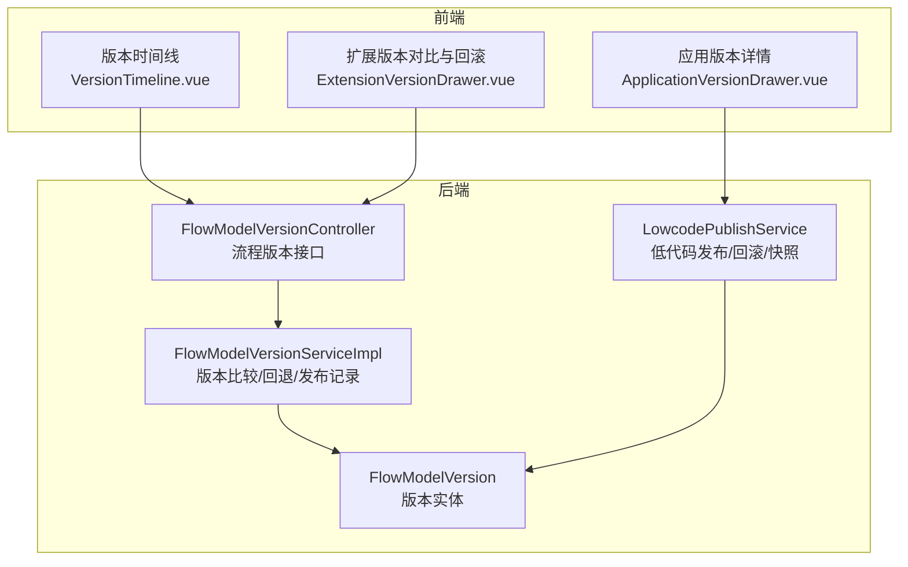
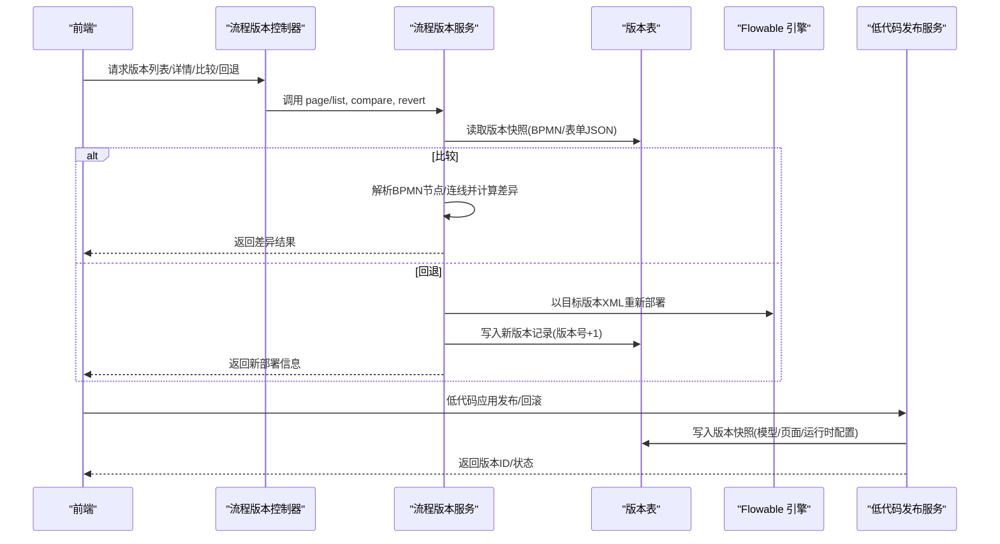
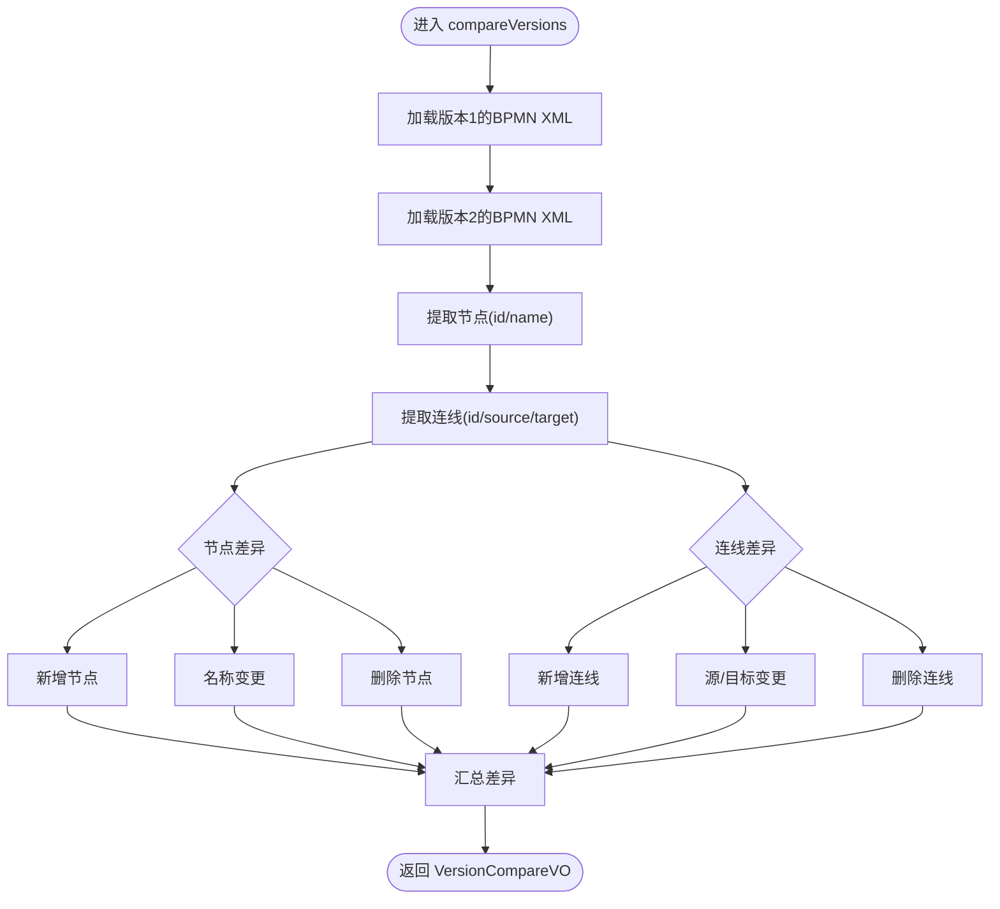
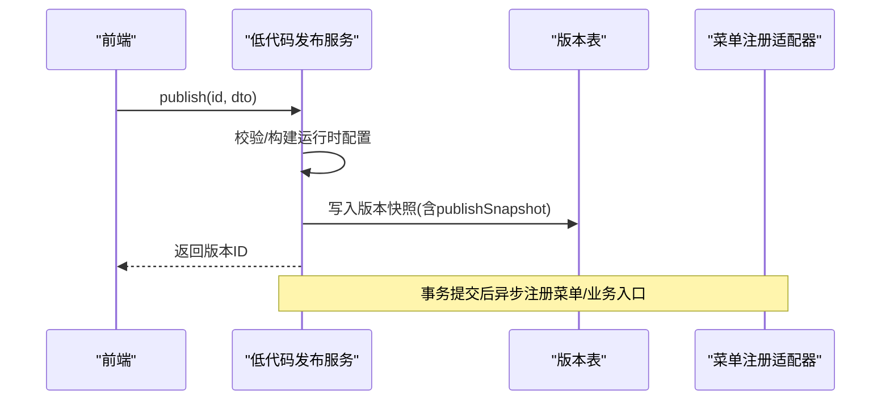
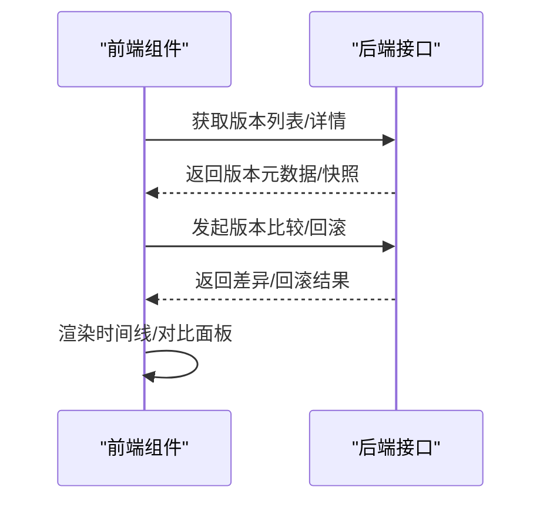
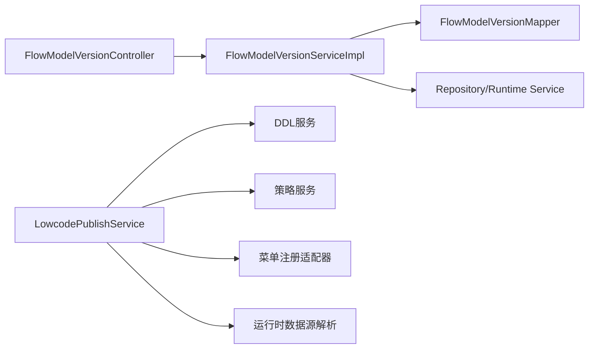
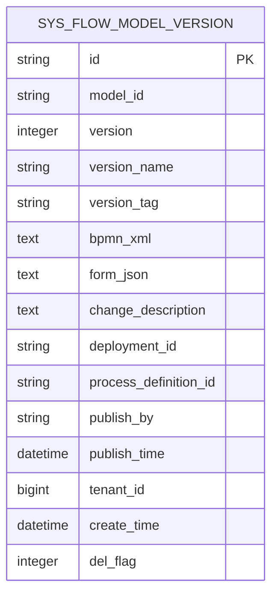
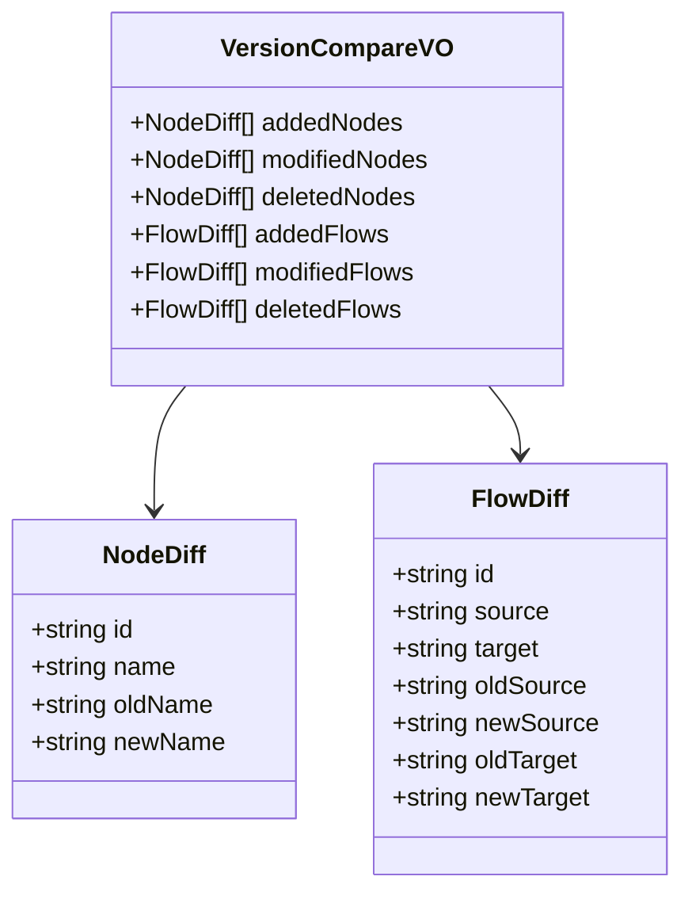
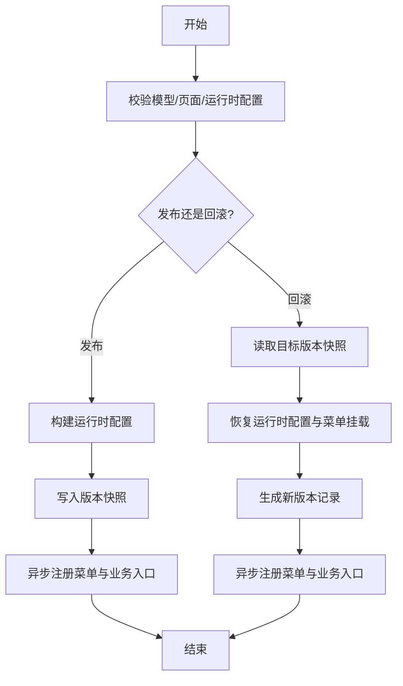

# 版本控制

<cite>
**本文引用的文件**
- [FlowModelVersionController.java](file://forge-server/forge-flow/forge-flow-server/src/main/java/com/mdframe/forge/flow/controller/FlowModelVersionController.java)
- [FlowModelVersionService.java](file://forge-server/forge-framework/forge-plugin-parent/forge-plugin-flow/src/main/java/com/mdframe/forge/starter/flow/service/FlowModelVersionService.java)
- [FlowModelVersionServiceImpl.java](file://forge-server/forge-framework/forge-plugin-parent/forge-plugin-flow/src/main/java/com/mdframe/forge/starter/flow/service/impl/FlowModelVersionServiceImpl.java)
- [FlowModelVersion.java](file://forge-server/forge-framework/forge-plugin-parent/forge-plugin-flow/src/main/java/com/mdframe/forge/starter/flow/entity/FlowModelVersion.java)
- [VersionCompareDTO.java](file://forge-server/forge-framework/forge-plugin-parent/forge-plugin-flow/src/main/java/com/mdframe/forge/starter/flow/dto/VersionCompareDTO.java)
- [VersionCompareVO.java](file://forge-server/forge-framework/forge-plugin-parent/forge-plugin-flow/src/main/java/com/mdframe/forge/starter/flow/vo/VersionCompareVO.java)
- [LowcodePublishService.java](file://forge-server/forge-framework/forge-plugin-parent/forge-plugin-generator/src/main/java/com/mdframe/forge/plugin/generator/service/lowcode/LowcodePublishService.java)
- [ApplicationVersionDrawer.vue](file://forge-admin-ui/src/views/app-center/application-workspace/ApplicationVersionDrawer.vue)
- [ExtensionVersionDrawer.vue](file://forge-admin-ui/src/views/app-center/application-workspace/ExtensionVersionDrawer.vue)
- [VersionTimeline.vue](file://forge-admin-ui/src/components/lowcode-builder/publish/VersionTimeline.vue)
</cite>

## 目录
1. [简介](#简介)
2. [项目结构](#项目结构)
3. [核心组件](#核心组件)
4. [架构总览](#架构总览)
5. [详细组件分析](#详细组件分析)
6. [依赖关系分析](#依赖关系分析)
7. [性能考量](#性能考量)
8. [故障排查指南](#故障排查指南)
9. [结论](#结论)
10. [附录](#附录)

## 简介
本技术文档围绕 Forge Admin 中的“页面与流程版本控制”能力，系统阐述版本创建、比较、回滚与合并（发布）机制。重点覆盖：
- 版本快照存储策略（BPMN XML、表单 JSON、应用配置快照等）
- 差异分析（节点与连线级 BPMN 差异）
- 冲突解决策略（重复连线清理、旧版会签表达式归一化）
- 团队协作最佳实践（分支、发布、代码审查集成）
- 版本发布流程与回滚流程的端到端说明

## 项目结构
版本控制能力横跨后端服务与前端界面：
- 后端
  - Flowable 流程模型版本管理：控制器、服务、实体、DTO/VO
  - 低代码应用发布与版本管理：发布、回滚、快照持久化、菜单与业务入口同步
- 前端
  - 版本时间线、版本详情抽屉、扩展版本对比与回滚

**图表来源**
- [FlowModelVersionController.java:35-60](file://forge-server/forge-flow/forge-flow-server/src/main/java/com/mdframe/forge/flow/controller/FlowModelVersionController.java#L35-L60)
- [FlowModelVersionServiceImpl.java:54-164](file://forge-server/forge-framework/forge-plugin-parent/forge-plugin-flow/src/main/java/com/mdframe/forge/starter/flow/service/impl/FlowModelVersionServiceImpl.java#L54-L164)
- [LowcodePublishService.java:112-213](file://forge-server/forge-framework/forge-plugin-parent/forge-plugin-generator/src/main/java/com/mdframe/forge/plugin/generator/service/lowcode/LowcodePublishService.java#L112-L213)
- [FlowModelVersion.java:8-44](file://forge-server/forge-framework/forge-plugin-parent/forge-plugin-flow/src/main/java/com/mdframe/forge/starter/flow/entity/FlowModelVersion.java#L8-L44)
- [VersionTimeline.vue:1-90](file://forge-admin-ui/src/components/lowcode-builder/publish/VersionTimeline.vue#L1-L90)
- [ApplicationVersionDrawer.vue:1-240](file://forge-admin-ui/src/views/app-center/application-workspace/ApplicationVersionDrawer.vue#L1-L240)
- [ExtensionVersionDrawer.vue:27-63](file://forge-admin-ui/src/views/app-center/application-workspace/ExtensionVersionDrawer.vue#L27-L63)

**章节来源**
- [FlowModelVersionController.java:35-60](file://forge-server/forge-flow/forge-flow-server/src/main/java/com/mdframe/forge/flow/controller/FlowModelVersionController.java#L35-L60)
- [FlowModelVersionServiceImpl.java:54-164](file://forge-server/forge-framework/forge-plugin-parent/forge-plugin-flow/src/main/java/com/mdframe/forge/starter/flow/service/impl/FlowModelVersionServiceImpl.java#L54-L164)
- [LowcodePublishService.java:112-213](file://forge-server/forge-framework/forge-plugin-parent/forge-plugin-generator/src/main/java/com/mdframe/forge/plugin/generator/service/lowcode/LowcodePublishService.java#L112-L213)
- [FlowModelVersion.java:8-44](file://forge-server/forge-framework/forge-plugin-parent/forge-plugin-flow/src/main/java/com/mdframe/forge/starter/flow/entity/FlowModelVersion.java#L8-L44)
- [VersionTimeline.vue:1-90](file://forge-admin-ui/src/components/lowcode-builder/publish/VersionTimeline.vue#L1-L90)
- [ApplicationVersionDrawer.vue:1-240](file://forge-admin-ui/src/views/app-center/application-workspace/ApplicationVersionDrawer.vue#L1-L240)
- [ExtensionVersionDrawer.vue:27-63](file://forge-admin-ui/src/views/app-center/application-workspace/ExtensionVersionDrawer.vue#L27-L63)

## 核心组件
- 流程版本控制器：提供版本列表、详情、比较、回退接口
- 流程版本服务：实现版本比较（节点/连线）、回退（重新部署并生成新版本）、发布时插入版本记录、标签更新与删除保护
- 低代码发布服务：负责低代码应用的发布与回滚，维护版本快照（模型、页面、运行时配置、菜单挂载信息等），并在事务提交后异步注册菜单与业务入口
- 前端版本视图：展示版本时间线、版本详情、扩展版本对比与回滚操作

**章节来源**
- [FlowModelVersionController.java:35-60](file://forge-server/forge-flow/forge-flow-server/src/main/java/com/mdframe/forge/flow/controller/FlowModelVersionController.java#L35-L60)
- [FlowModelVersionService.java:14-29](file://forge-server/forge-framework/forge-plugin-parent/forge-plugin-flow/src/main/java/com/mdframe/forge/starter/flow/service/FlowModelVersionService.java#L14-L29)
- [FlowModelVersionServiceImpl.java:54-317](file://forge-server/forge-framework/forge-plugin-parent/forge-plugin-flow/src/main/java/com/mdframe/forge/starter/flow/service/impl/FlowModelVersionServiceImpl.java#L54-L317)
- [LowcodePublishService.java:112-213](file://forge-server/forge-framework/forge-plugin-parent/forge-plugin-generator/src/main/java/com/mdframe/forge/plugin/generator/service/lowcode/LowcodePublishService.java#L112-L213)
- [ApplicationVersionDrawer.vue:1-240](file://forge-admin-ui/src/views/app-center/application-workspace/ApplicationVersionDrawer.vue#L1-L240)
- [ExtensionVersionDrawer.vue:27-63](file://forge-admin-ui/src/views/app-center/application-workspace/ExtensionVersionDrawer.vue#L27-L63)
- [VersionTimeline.vue:1-90](file://forge-admin-ui/src/components/lowcode-builder/publish/VersionTimeline.vue#L1-L90)

## 架构总览
版本控制由“发布/回滚 + 版本快照 + 差异分析 + 前端可视化”构成闭环。发布时写入版本快照；回滚时从快照重建运行时配置并生成新版本；比较功能对 BPMN XML 进行节点与连线级差异分析；前端提供时间线与对比面板。

**图表来源**
- [FlowModelVersionController.java:35-60](file://forge-server/forge-flow/forge-flow-server/src/main/java/com/mdframe/forge/flow/controller/FlowModelVersionController.java#L35-L60)
- [FlowModelVersionServiceImpl.java:83-257](file://forge-server/forge-framework/forge-plugin-parent/forge-plugin-flow/src/main/java/com/mdframe/forge/starter/flow/service/impl/FlowModelVersionServiceImpl.java#L83-L257)
- [LowcodePublishService.java:112-213](file://forge-server/forge-framework/forge-plugin-parent/forge-plugin-generator/src/main/java/com/mdframe/forge/plugin/generator/service/lowcode/LowcodePublishService.java#L112-L213)

## 详细组件分析

### 流程版本服务（FlowModelVersionServiceImpl）
职责：
- 版本列表与详情查询
- 版本比较：基于 BPMN XML 提取节点与连线，计算新增/修改/删除
- 版本回退：校验目标版本存在性与内容完整性，替换流程 ID 后重新部署，生成新版本记录并更新模型状态
- 发布时插入版本记录：在发布时持久化当前模型与表单快照
- 版本标记与删除保护：禁止修改已发布或废弃版本，限制删除受保护版本

关键算法要点：
- 节点差异：按 id 映射比对 name，识别新增/改名/删除
- 连线差异：按 id 映射比对 source/target，识别新增/修改/删除
- XML 安全解析：禁用外部实体与 DOCTYPE，避免注入风险
- 重复连线与旧版会签表达式自动修复：在回退/部署前归一化，减少冲突

**图表来源**
- [FlowModelVersionServiceImpl.java:83-164](file://forge-server/forge-framework/forge-plugin-parent/forge-plugin-flow/src/main/java/com/mdframe/forge/starter/flow/service/impl/FlowModelVersionServiceImpl.java#L83-L164)
- [FlowModelVersionServiceImpl.java:363-423](file://forge-server/forge-framework/forge-plugin-parent/forge-plugin-flow/src/main/java/com/mdframe/forge/starter/flow/service/impl/FlowModelVersionServiceImpl.java#L363-L423)
- [VersionCompareVO.java:6-33](file://forge-server/forge-framework/forge-plugin-parent/forge-plugin-flow/src/main/java/com/mdframe/forge/starter/flow/vo/VersionCompareVO.java#L6-L33)

**章节来源**
- [FlowModelVersionServiceImpl.java:54-317](file://forge-server/forge-framework/forge-plugin-parent/forge-plugin-flow/src/main/java/com/mdframe/forge/starter/flow/service/impl/FlowModelVersionServiceImpl.java#L54-L317)
- [FlowModelVersionServiceImpl.java:319-479](file://forge-server/forge-framework/forge-plugin-parent/forge-plugin-flow/src/main/java/com/mdframe/forge/starter/flow/service/impl/FlowModelVersionServiceImpl.java#L319-L479)
- [VersionCompareDTO.java:1-10](file://forge-server/forge-framework/forge-plugin-parent/forge-plugin-flow/src/main/java/com/mdframe/forge/starter/flow/dto/VersionCompareDTO.java#L1-L10)
- [VersionCompareVO.java:1-33](file://forge-server/forge-framework/forge-plugin-parent/forge-plugin-flow/src/main/java/com/mdframe/forge/starter/flow/vo/VersionCompareVO.java#L1-L33)

### 低代码发布服务（LowcodePublishService）
职责：
- 发布：校验模型与页面、构建运行时配置、持久化版本快照、异步注册菜单与业务入口
- 回滚：根据目标版本快照恢复运行时配置与菜单挂载信息，生成新版本并异步执行菜单注册
- 版本列表：返回应用维度版本清单

快照字段包含：
- 模型/页面/搜索/编辑/列配置、API 配置、选项、字典/脱敏/加密/翻译配置
- 运行时数据源、主键、租户/审计/逻辑删除策略
- 菜单名称、父级、排序、挂载端、资源ID等

**图表来源**
- [LowcodePublishService.java:112-155](file://forge-server/forge-framework/forge-plugin-parent/forge-plugin-generator/src/main/java/com/mdframe/forge/plugin/generator/service/lowcode/LowcodePublishService.java#L112-L155)
- [LowcodePublishService.java:550-582](file://forge-server/forge-framework/forge-plugin-parent/forge-plugin-generator/src/main/java/com/mdframe/forge/plugin/generator/service/lowcode/LowcodePublishService.java#L550-L582)

**章节来源**
- [LowcodePublishService.java:112-213](file://forge-server/forge-framework/forge-plugin-parent/forge-plugin-generator/src/main/java/com/mdframe/forge/plugin/generator/service/lowcode/LowcodePublishService.java#L112-L213)
- [LowcodePublishService.java:550-698](file://forge-server/forge-framework/forge-plugin-parent/forge-plugin-generator/src/main/java/com/mdframe/forge/plugin/generator/service/lowcode/LowcodePublishService.java#L550-L698)

### 前端版本视图
- 版本时间线：展示最近若干版本，支持回滚触发
- 应用版本详情：展示版本元数据、业务对象、页面入口、扩展快照
- 扩展版本对比：选择基础版本与目标版本，显示内容摘要差异，支持回滚为新草稿

**图表来源**
- [VersionTimeline.vue:1-90](file://forge-admin-ui/src/components/lowcode-builder/publish/VersionTimeline.vue#L1-L90)
- [ApplicationVersionDrawer.vue:1-240](file://forge-admin-ui/src/views/app-center/application-workspace/ApplicationVersionDrawer.vue#L1-L240)
- [ExtensionVersionDrawer.vue:27-63](file://forge-admin-ui/src/views/app-center/application-workspace/ExtensionVersionDrawer.vue#L27-L63)

**章节来源**
- [VersionTimeline.vue:1-90](file://forge-admin-ui/src/components/lowcode-builder/publish/VersionTimeline.vue#L1-L90)
- [ApplicationVersionDrawer.vue:1-240](file://forge-admin-ui/src/views/app-center/application-workspace/ApplicationVersionDrawer.vue#L1-L240)
- [ExtensionVersionDrawer.vue:27-63](file://forge-admin-ui/src/views/app-center/application-workspace/ExtensionVersionDrawer.vue#L27-L63)

## 依赖关系分析
- 控制器依赖服务层，服务层依赖 MyBatis Mapper 与 Flowable 引擎
- 低代码发布服务依赖多个领域服务（DDL、策略、菜单注册、运行时数据源解析）
- 前端通过 API 调用控制器与服务暴露的能力

**图表来源**
- [FlowModelVersionController.java:35-60](file://forge-server/forge-flow/forge-flow-server/src/main/java/com/mdframe/forge/flow/controller/FlowModelVersionController.java#L35-L60)
- [FlowModelVersionServiceImpl.java:44-52](file://forge-server/forge-framework/forge-plugin-parent/forge-plugin-flow/src/main/java/com/mdframe/forge/starter/flow/service/impl/FlowModelVersionServiceImpl.java#L44-L52)
- [LowcodePublishService.java:61-110](file://forge-server/forge-framework/forge-plugin-parent/forge-plugin-generator/src/main/java/com/mdframe/forge/plugin/generator/service/lowcode/LowcodePublishService.java#L61-L110)

**章节来源**
- [FlowModelVersionController.java:35-60](file://forge-server/forge-flow/forge-flow-server/src/main/java/com/mdframe/forge/flow/controller/FlowModelVersionController.java#L35-L60)
- [FlowModelVersionServiceImpl.java:44-52](file://forge-server/forge-framework/forge-plugin-parent/forge-plugin-flow/src/main/java/com/mdframe/forge/starter/flow/service/impl/FlowModelVersionServiceImpl.java#L44-L52)
- [LowcodePublishService.java:61-110](file://forge-server/forge-framework/forge-plugin-parent/forge-plugin-generator/src/main/java/com/mdframe/forge/plugin/generator/service/lowcode/LowcodePublishService.java#L61-L110)

## 性能考量
- 版本比较采用内存中 XML 解析与 Map 索引，适合中小规模 BPMN 图；若图规模较大，可考虑增量差异或缓存上次解析结果
- 发布与回滚使用事务保证一致性；菜单注册与业务入口同步改为异步事件，降低响应延迟
- XML 解析启用安全特性，避免外部实体与 DOCTYPE，兼顾安全与性能
- 重复连线与旧版会签表达式在部署前自动修复，减少后续运行期异常

[本节为通用性能建议，不直接分析具体文件]

## 故障排查指南
常见问题与定位方法：
- 版本不存在：检查 modelId/versionNo 是否正确；确认版本记录未被删除或属于其他租户
- 目标版本无 BPMN XML：无法回退，需先确保该版本包含完整流程定义
- Flowable 未初始化：回退失败，检查服务启动与依赖注入
- 发布失败：检查在线建表权限与二次确认；确认数据表存在且具备单字段主键
- 菜单未生效：确认异步事件是否成功消费；检查挂载端配置与管理端/移动端菜单资源是否存在

**章节来源**
- [FlowModelVersionServiceImpl.java:167-257](file://forge-server/forge-framework/forge-plugin-parent/forge-plugin-flow/src/main/java/com/mdframe/forge/starter/flow/service/impl/FlowModelVersionServiceImpl.java#L167-L257)
- [LowcodePublishService.java:240-263](file://forge-server/forge-framework/forge-plugin-parent/forge-plugin-generator/src/main/java/com/mdframe/forge/plugin/generator/service/lowcode/LowcodePublishService.java#L240-L263)

## 结论
Forge Admin 的版本控制体系以“快照 + 差异 + 回滚 + 发布”为核心，既满足流程模型的版本化管理，也覆盖低代码应用的发布与回滚。通过安全的 XML 解析、自动化的差异分析与冲突修复、以及前后端协同的可视化能力，为团队协作提供了可靠的版本治理能力。结合分支管理与代码审查流程，可进一步提升发布质量与可追溯性。

[本节为总结性内容，不直接分析具体文件]

## 附录

### 版本快照存储模型（流程版本）

**图表来源**
- [FlowModelVersion.java:8-44](file://forge-server/forge-framework/forge-plugin-parent/forge-plugin-flow/src/main/java/com/mdframe/forge/starter/flow/entity/FlowModelVersion.java#L8-L44)

### 版本比较数据结构

**图表来源**
- [VersionCompareVO.java:6-33](file://forge-server/forge-framework/forge-plugin-parent/forge-plugin-flow/src/main/java/com/mdframe/forge/starter/flow/vo/VersionCompareVO.java#L6-L33)

### 版本发布与回滚流程图（低代码应用）

**图表来源**
- [LowcodePublishService.java:112-213](file://forge-server/forge-framework/forge-plugin-parent/forge-plugin-generator/src/main/java/com/mdframe/forge/plugin/generator/service/lowcode/LowcodePublishService.java#L112-L213)

### 团队协作最佳实践
- 分支策略
  - 功能分支开发，合并至主干前完成代码审查与自动化测试
  - 发布分支仅用于稳定版本打包与灰度发布
- 代码审查集成
  - 将版本差异（BPMN 节点/连线变化）纳入 PR 描述，便于评审
  - 对回滚与发布操作增加审批流，防止误操作
- 发布流程
  - 预发环境验证通过后，再发布到生产
  - 发布后观察运行实例数与错误率，必要时快速回滚
- 回滚策略
  - 优先回滚到上一个稳定版本，避免多跳回滚
  - 回滚后记录变更说明，便于审计与复盘

[本节为通用实践建议，不直接分析具体文件]