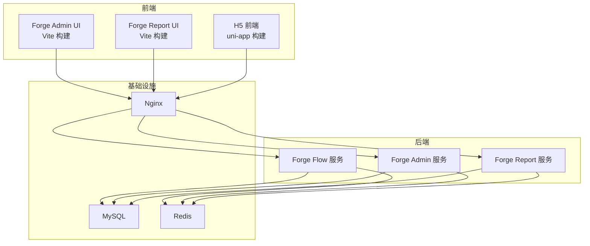
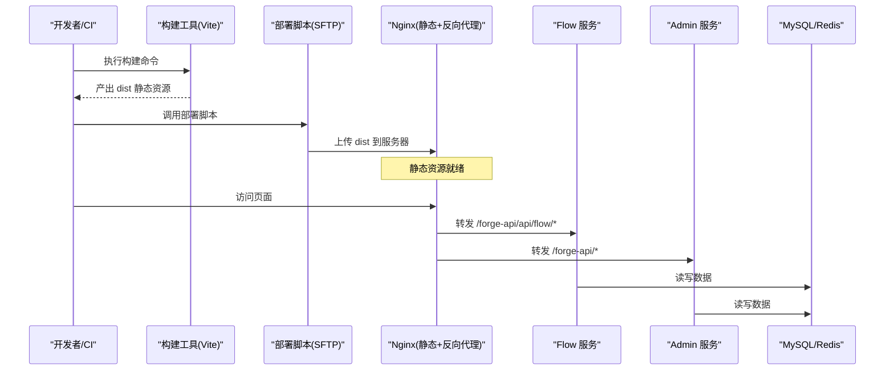
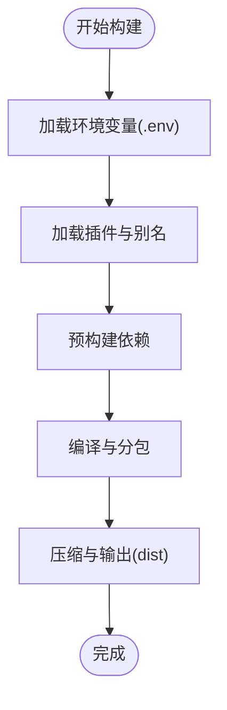
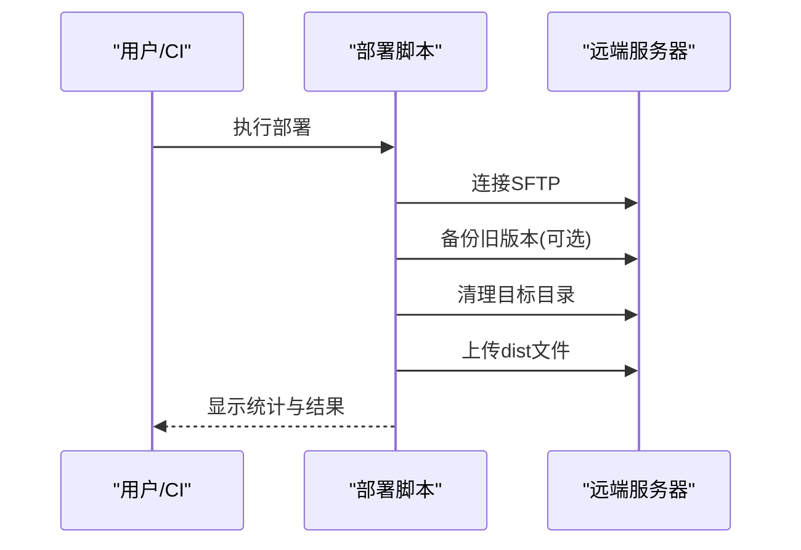
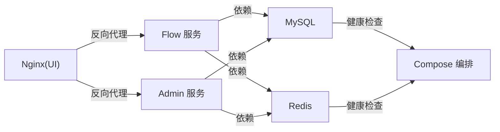
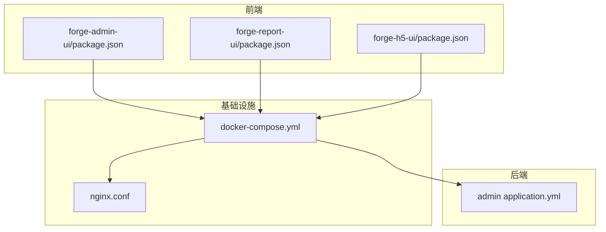

# 页面发布

<cite>
**本文引用的文件**
- [package.json](file://forge-admin-ui/package.json)
- [vite.config.js](file://forge-admin-ui/vite.config.js)
- [deploy/index.js](file://forge-admin-ui/deploy/index.js)
- [package.json](file://forge-report-ui/package.json)
- [vite.config.ts](file://forge-report-ui/vite.config.ts)
- [deploy/index.js](file://forge-report-ui/deploy/index.js)
- [package.json](file://forge-h5-ui/package.json)
- [vite.config.js](file://forge-h5-ui/vite.config.js)
- [docker-compose.yml](file://docker/docker-compose.yml)
- [Dockerfile.ui](file://docker/Dockerfile.ui)
- [nginx.conf](file://docker/nginx.conf)
- [application.yml](file://forge-server/forge-admin-server/src/main/resources/application.yml)
- [init-db.sh](file://forge-server/scripts/db/init-db.sh)
</cite>

## 目录
1. [简介](#简介)
2. [项目结构](#项目结构)
3. [核心组件](#核心组件)
4. [架构总览](#架构总览)
5. [详细组件分析](#详细组件分析)
6. [依赖关系分析](#依赖关系分析)
7. [性能考虑](#性能考虑)
8. [故障排查指南](#故障排查指南)
9. [结论](#结论)
10. [附录](#附录)

## 简介
本技术文档围绕“页面从设计到上线”的完整发布流程，覆盖构建打包、环境部署、灰度发布策略、发布配置与依赖管理、回滚机制、多环境部署、CDN 加速与性能监控、自动化脚本、健康检查与故障恢复。内容基于仓库中的前端工程（Forge Admin UI、Forge Report UI、H5）、后端服务配置、Docker 编排与 Nginx 反向代理等实际实现进行说明。

## 项目结构
本项目包含多个前端子工程与后端服务：
- 管理端前端：forge-admin-ui（Vite + Vue3）
- 报表前端：forge-report-ui（Vite + Vue3）
- H5 前端：forge-h5-ui（uni-app + Vite）
- 后端服务：forge-admin-server、forge-flow、forge-report-server
- 容器化：docker-compose 编排 MySQL、Redis、Flow、Admin、UI（Nginx）
- 数据库初始化：init-db.sh 脚本

图表来源
- [docker-compose.yml:11-149](file://docker/docker-compose.yml#L11-L149)
- [nginx.conf:1-42](file://docker/nginx.conf#L1-L42)

章节来源
- [docker-compose.yml:11-149](file://docker/docker-compose.yml#L11-L149)
- [nginx.conf:1-42](file://docker/nginx.conf#L1-L42)

## 核心组件
- 构建与打包
  - Forge Admin UI：使用 Vite 构建，支持生产模式与自定义输出目录；提供 build:stage 与 deploy:stage 命令链式执行。
  - Forge Report UI：同样基于 Vite，提供 build:stage 与 deploy:stage 命令。
  - H5 前端：基于 uni-app/Vite，提供多端构建命令。
- 部署与上传
  - 两个前端均提供 deploy/index.js，通过 SFTP 将 dist 产物上传至远端服务器，并支持可选备份与清理。
- 容器化与反向代理
  - Docker Compose 编排 MySQL、Redis、Flow、Admin、UI（Nginx），统一网络与数据卷。
  - Nginx 负责静态资源托管与 API 反向代理（流程服务与主服务）。
- 后端配置与健康检查
  - 后端 application.yml 暴露 /actuator/health 端点用于健康检查。
  - Docker Compose 为 MySQL/Redis 定义 healthcheck。
- 数据库初始化
  - init-db.sh 提供一键建库与导入种子数据的脚本能力。

章节来源
- [package.json:6-17](file://forge-admin-ui/package.json#L6-L17)
- [package.json:7-16](file://forge-report-ui/package.json#L7-L16)
- [package.json:5-37](file://forge-h5-ui/package.json#L5-L37)
- [deploy/index.js:10-25](file://forge-admin-ui/deploy/index.js#L10-L25)
- [deploy/index.js:10-25](file://forge-report-ui/deploy/index.js#L10-L25)
- [docker-compose.yml:11-149](file://docker/docker-compose.yml#L11-L149)
- [nginx.conf:1-42](file://docker/nginx.conf#L1-L42)
- [application.yml:220-228](file://forge-server/forge-admin-server/src/main/resources/application.yml#L220-L228)
- [init-db.sh:16-31](file://forge-server/scripts/db/init-db.sh#L16-L31)

## 架构总览
下图展示了从开发到生产的端到端发布链路：开发者在本地或 CI 中构建前端产物，通过部署脚本上传至目标服务器；Nginx 作为入口分发静态资源与 API 请求；后端服务连接数据库与缓存。

图表来源
- [vite.config.js:160-173](file://forge-admin-ui/vite.config.js#L160-L173)
- [deploy/index.js:240-277](file://forge-admin-ui/deploy/index.js#L240-L277)
- [nginx.conf:5-32](file://docker/nginx.conf#L5-L32)
- [docker-compose.yml:61-149](file://docker/docker-compose.yml#L61-L149)

## 详细组件分析

### 前端构建与打包（Forge Admin UI）
- 构建命令与环境
  - 提供 dev/build/build:prod/preview 等脚本；build:stage 会先构建再执行部署脚本。
  - 通过 .env 环境变量控制 base、代理目标、输出目录等。
- 构建优化
  - 关闭 sourcemap、关闭压缩体积上报、使用 oxc 压缩、esbuild 压缩 CSS，降低内存占用与构建时间。
  - 预构建常用依赖，减少首次加载时的二次优化。
- 开发与代理
  - 开发服务器支持 flow 与主服务的代理规则，以及 WebSocket 代理。

图表来源
- [vite.config.js:14-53](file://forge-admin-ui/vite.config.js#L14-L53)
- [vite.config.js:66-109](file://forge-admin-ui/vite.config.js#L66-L109)
- [vite.config.js:160-173](file://forge-admin-ui/vite.config.js#L160-L173)

章节来源
- [package.json:6-17](file://forge-admin-ui/package.json#L6-L17)
- [vite.config.js:14-53](file://forge-admin-ui/vite.config.js#L14-L53)
- [vite.config.js:66-109](file://forge-admin-ui/vite.config.js#L66-L109)
- [vite.config.js:120-158](file://forge-admin-ui/vite.config.js#L120-L158)
- [vite.config.js:160-173](file://forge-admin-ui/vite.config.js#L160-L173)

### 前端构建与打包（Forge Report UI）
- 构建命令与环境
  - 提供 dev/build/preview 等脚本；build:stage 会先构建再执行部署脚本。
  - 通过 .env 控制输出目录与构建行为。
- 构建优化
  - 启用 gzip 压缩插件；可配置 rollupOptions 与 chunkSizeWarningLimit。
- 开发与代理
  - 开发服务器对后端接口与 LLM 流式代理进行配置，确保 SSE 流不被缓冲。

章节来源
- [package.json:7-16](file://forge-report-ui/package.json#L7-L16)
- [vite.config.ts:13-43](file://forge-report-ui/vite.config.ts#L13-L43)
- [vite.config.ts:75-115](file://forge-report-ui/vite.config.ts#L75-L115)

### 前端构建与打包（H5 前端）
- 构建命令与环境
  - 提供多端构建命令（H5、小程序等），便于跨端发布。
- 开发与代理
  - 开发服务器对 Flow 与 App 服务进行代理，并支持 WebSocket。

章节来源
- [package.json:5-37](file://forge-h5-ui/package.json#L5-L37)
- [vite.config.js:14-103](file://forge-h5-ui/vite.config.js#L14-L103)

### 部署脚本与回滚机制
- 部署流程
  - 校验配置与本地 dist 存在性。
  - 可选备份远端旧版本（带时间戳）。
  - 清理远端目录并上传新产物。
  - 输出统计信息并关闭连接。
- 回滚策略
  - 启用 backup 后，可通过切换至最近的时间戳目录快速回滚。
  - 建议结合版本化目录命名与 Nginx 路径切换实现零停机回滚。

图表来源
- [deploy/index.js:32-49](file://forge-admin-ui/deploy/index.js#L32-L49)
- [deploy/index.js:74-106](file://forge-admin-ui/deploy/index.js#L74-L106)
- [deploy/index.js:108-128](file://forge-admin-ui/deploy/index.js#L108-L128)
- [deploy/index.js:130-184](file://forge-admin-ui/deploy/index.js#L130-L184)
- [deploy/index.js:240-277](file://forge-admin-ui/deploy/index.js#L240-L277)

章节来源
- [deploy/index.js:10-25](file://forge-admin-ui/deploy/index.js#L10-L25)
- [deploy/index.js:32-49](file://forge-admin-ui/deploy/index.js#L32-L49)
- [deploy/index.js:74-106](file://forge-admin-ui/deploy/index.js#L74-L106)
- [deploy/index.js:108-128](file://forge-admin-ui/deploy/index.js#L108-L128)
- [deploy/index.js:130-184](file://forge-admin-ui/deploy/index.js#L130-L184)
- [deploy/index.js:240-277](file://forge-admin-ui/deploy/index.js#L240-L277)

### 容器化与多环境部署
- 服务编排
  - MySQL 与 Redis 提供持久化数据卷与健康检查。
  - Flow 与 Admin 服务依赖基础中间件并按序启动。
  - UI 由 Nginx 容器提供静态资源与反向代理。
- 多环境
  - 通过环境变量注入数据库、缓存、端口、加密密钥等配置，便于不同环境复用同一编排。
- 健康检查
  - MySQL/Redis 使用内置命令进行健康探测。
  - 后端暴露 /actuator/health 供外部探针检测。

图表来源
- [docker-compose.yml:15-59](file://docker/docker-compose.yml#L15-L59)
- [docker-compose.yml:61-132](file://docker/docker-compose.yml#L61-L132)
- [application.yml:220-228](file://forge-server/forge-admin-server/src/main/resources/application.yml#L220-L228)

章节来源
- [docker-compose.yml:15-59](file://docker/docker-compose.yml#L15-L59)
- [docker-compose.yml:61-132](file://docker/docker-compose.yml#L61-L132)
- [application.yml:220-228](file://forge-server/forge-admin-server/src/main/resources/application.yml#L220-L228)

### Nginx 反向代理与 CDN 加速
- 静态资源
  - /forge/ 指向构建产物的 dist 目录，开启 try_files 以支持 SPA 路由。
- API 代理
  - /forge-api/api/flow/* 转发至 Flow 服务。
  - /forge-api/* 转发至 Admin 服务。
- 性能优化
  - 设置超时参数与 Gzip 压缩。
- CDN 集成建议
  - 将静态资源（JS/CSS/图片）推送到 CDN，并在 Nginx 中配置缓存头与版本号策略，提升首屏加载速度。

章节来源
- [nginx.conf:1-42](file://docker/nginx.conf#L1-L42)

### 数据库初始化与迁移
- 初始化脚本
  - 支持创建数据库、导入全量 SQL、模块 SQL、演示与可选种子数据。
- 迁移策略
  - 后端 Flyway 启用，按位置扫描迁移脚本，保证数据库版本一致。

章节来源
- [init-db.sh:16-31](file://forge-server/scripts/db/init-db.sh#L16-L31)
- [init-db.sh:83-134](file://forge-server/scripts/db/init-db.sh#L83-L134)
- [application.yml:65-72](file://forge-server/forge-admin-server/src/main/resources/application.yml#L65-L72)

## 依赖关系分析
- 前端依赖
  - 构建工具：Vite、Vue 插件、Unocss、自动导入与组件解析。
  - 运行时：Axios、ECharts、Naive UI、BPMN 等。
- 后端依赖
  - Spring Boot、MyBatis-Plus、Sa-Token、Flyway、Undertow。
- 基础设施依赖
  - MySQL、Redis、Nginx、Docker Compose。

图表来源
- [package.json:6-17](file://forge-admin-ui/package.json#L6-L17)
- [package.json:7-16](file://forge-report-ui/package.json#L7-L16)
- [package.json:5-37](file://forge-h5-ui/package.json#L5-L37)
- [docker-compose.yml:11-149](file://docker/docker-compose.yml#L11-L149)
- [application.yml:220-228](file://forge-server/forge-admin-server/src/main/resources/application.yml#L220-L228)

章节来源
- [package.json:6-17](file://forge-admin-ui/package.json#L6-L17)
- [package.json:7-16](file://forge-report-ui/package.json#L7-L16)
- [package.json:5-37](file://forge-h5-ui/package.json#L5-L37)
- [docker-compose.yml:11-149](file://docker/docker-compose.yml#L11-L149)
- [application.yml:220-228](file://forge-server/forge-admin-server/src/main/resources/application.yml#L220-L228)

## 性能考虑
- 构建阶段
  - 关闭 sourcemap 与压缩体积上报，降低内存占用。
  - 使用 oxc 压缩与 esbuild 压缩 CSS，提升构建速度与稳定性。
  - 预构建关键依赖，避免首次加载时二次优化导致的延迟。
- 运行阶段
  - Nginx 开启 Gzip 压缩，减小传输体积。
  - 合理设置代理超时，避免长耗时任务阻塞。
  - 静态资源建议配合 CDN 与缓存策略，提升首屏性能。
- 资源限制
  - 构建脚本增加 Node 最大堆大小，避免大项目构建 OOM。

章节来源
- [vite.config.js:160-173](file://forge-admin-ui/vite.config.js#L160-L173)
- [vite.config.js:66-109](file://forge-admin-ui/vite.config.js#L66-L109)
- [nginx.conf:34-40](file://docker/nginx.conf#L34-L40)
- [package.json:8-9](file://forge-admin-ui/package.json#L8-L9)

## 故障排查指南
- 常见问题定位
  - 构建失败：检查 Node 版本、依赖安装、环境变量与构建参数。
  - 部署失败：确认 SFTP 凭据、远端目录权限与磁盘空间。
  - 页面白屏：检查 Nginx 静态资源路径与 try_files 配置。
  - API 404/超时：核对 Nginx 反向代理规则与后端服务端口。
- 健康检查
  - 后端 /actuator/health 返回服务状态。
  - MySQL/Redis 健康检查由 Compose 维护。
- 回滚与恢复
  - 启用备份后，通过切换至最近时间戳目录快速回滚。
  - 数据库异常时，可使用 init-db.sh 重新初始化或导入指定种子数据。

章节来源
- [application.yml:220-228](file://forge-server/forge-admin-server/src/main/resources/application.yml#L220-L228)
- [docker-compose.yml:33-57](file://docker/docker-compose.yml#L33-L57)
- [nginx.conf:5-32](file://docker/nginx.conf#L5-L32)
- [deploy/index.js:74-106](file://forge-admin-ui/deploy/index.js#L74-L106)
- [init-db.sh:83-134](file://forge-server/scripts/db/init-db.sh#L83-L134)

## 结论
本项目提供了完善的前端构建、部署脚本与容器化编排，支持多环境部署与快速回滚。通过 Nginx 反向代理与可选 CDN 加速，可实现稳定的线上发布体验。结合健康检查与数据库初始化脚本，能够保障发布过程的可观测性与可恢复性。建议在正式环境中引入版本化目录与蓝绿/灰度发布策略，进一步提升发布安全性与用户体验。

## 附录
- 常用命令参考
  - 管理端构建与部署：pnpm run build:stage 或 pnpm run deploy:stage
  - 报表端构建与部署：pnpm run build:stage 或 pnpm run deploy:stage
  - H5 多端构建：根据平台选择对应 build:* 命令
- 环境变量要点
  - 前端：VITE_PUBLIC_PATH、VITE_REQUEST_PREFIX、VITE_HTTP_PROXY_TARGET、VITE_FLOW_PROXY_TARGET、VITE_OUT_DIR
  - 后端：各类 FORGE_* 与数据库/缓存相关环境变量
- 安全建议
  - 使用密钥认证替代密码登录 SFTP。
  - 敏感配置通过环境变量或密钥管理服务注入。