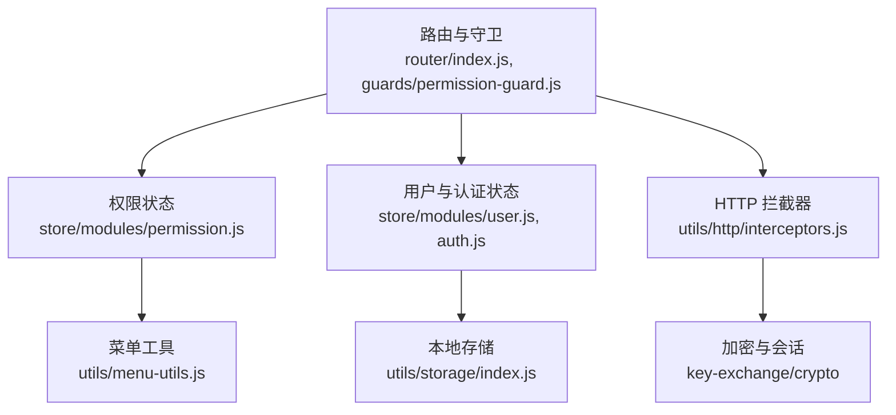
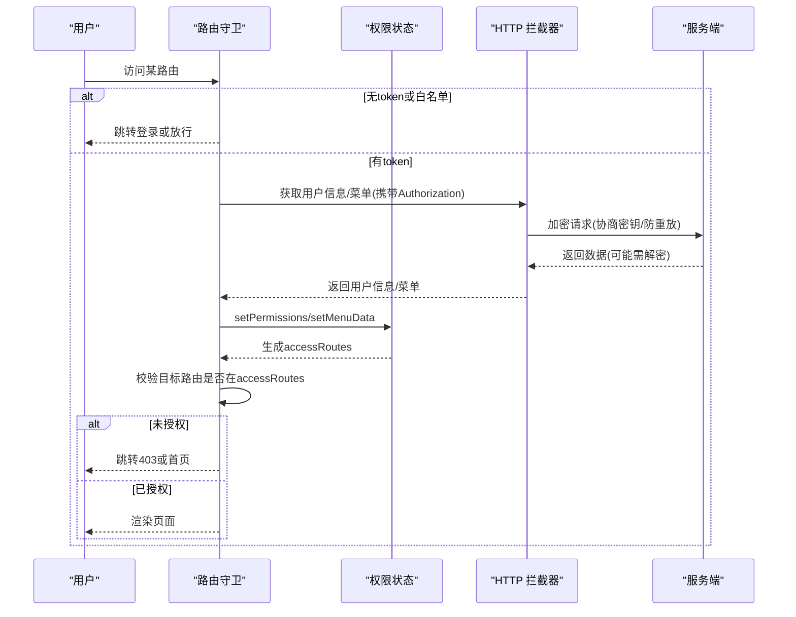
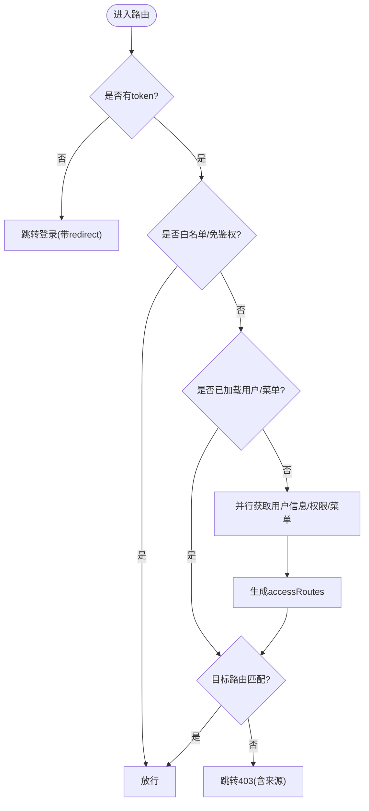
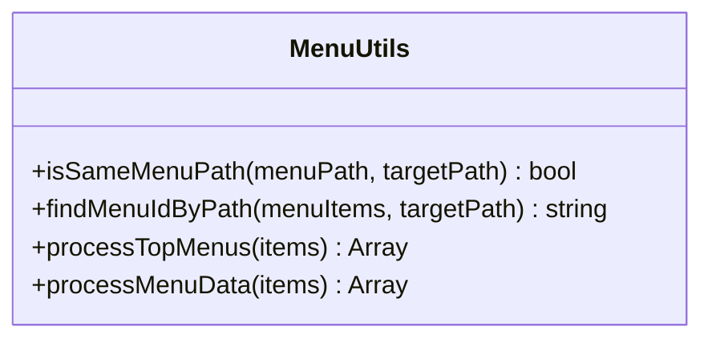
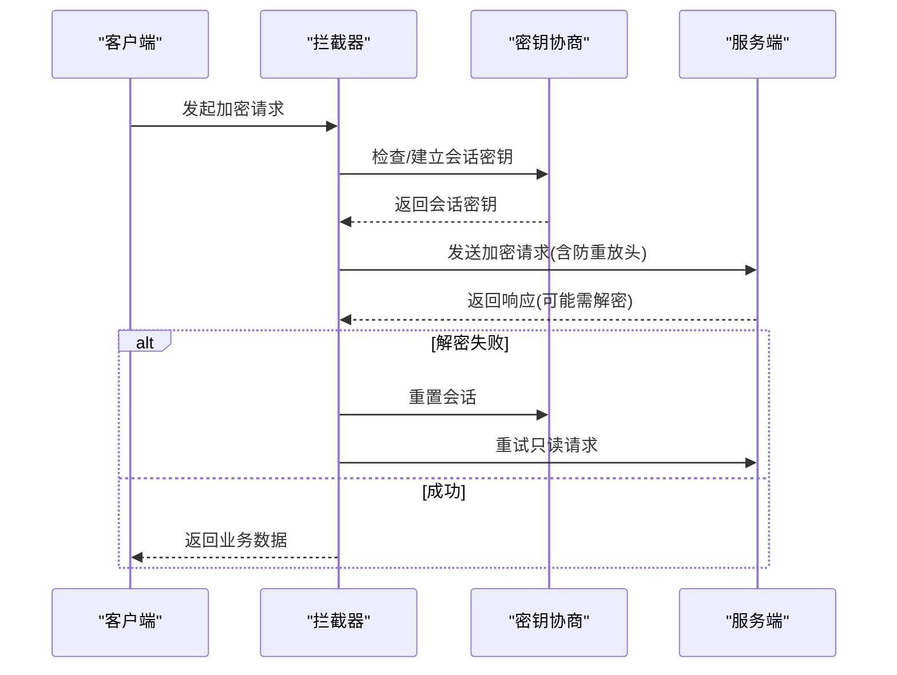
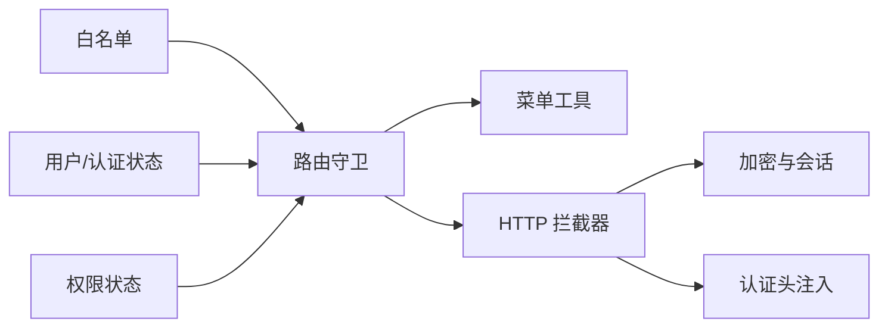

# 页面权限

<cite>
**本文引用的文件**
- [permission-guard.js](file://forge-admin-ui/src/router/guards/permission-guard.js)
- [index.js（路由）](file://forge-admin-ui/src/router/index.js)
- [menu-utils.js](file://forge-admin-ui/src/utils/menu-utils.js)
- [interceptors.js](file://forge-admin-ui/src/utils/http/interceptors.js)
- [whitelist.config.js](file://forge-admin-ui/src/config/whitelist.config.js)
- [permission.js（权限状态）](file://forge-admin-ui/src/store/modules/permission.js)
- [auth.js（认证状态）](file://forge-admin-ui/src/store/modules/auth.js)
- [user.js（用户状态）](file://forge-admin-ui/src/store/modules/user.js)
- [helper.js（用户与权限获取）](file://forge-admin-ui/src/store/helper.js)
- [storage/index.js](file://forge-admin-ui/src/utils/storage/index.js)
</cite>

## 目录
1. [简介](#简介)
2. [项目结构](#项目结构)
3. [核心组件](#核心组件)
4. [架构总览](#架构总览)
5. [详细组件分析](#详细组件分析)
6. [依赖关系分析](#依赖关系分析)
7. [性能考虑](#性能考虑)
8. [故障排查指南](#故障排查指南)
9. [结论](#结论)
10. [附录](#附录)

## 简介
本技术文档围绕 Forge Admin 前端的“页面级权限”能力，系统性说明基于角色的访问控制（RBAC）在路由守卫、菜单权限与数据权限上的落地方案。内容涵盖：
- 权限模型设计：角色、菜单、按钮与 API 权限的映射；隐藏菜单与可见菜单的路由生成策略。
- 动态路由生成：从后端菜单数据推导前端可访问路由集合，支持外链、参数化路径匹配与排序。
- 细粒度权限验证：路由级访问控制、菜单高亮匹配、页面标题与审计头注入。
- 会话与安全：令牌管理、密钥协商与加密请求、防重放、解密失败重试与静默鉴权错误处理。
- 最佳实践与常见问题：配置建议、排错步骤与定位方法。

## 项目结构
权限相关代码主要分布在以下模块：
- 路由与守卫：定义全局路由、白名单与前置守卫，负责登录态校验、权限判定与跳转。
- 状态管理：维护用户信息、认证令牌、权限与菜单数据，提供重置与持久化能力。
- HTTP 拦截器：统一鉴权头注入、加密会话初始化、响应解密与错误处理。
- 工具函数：菜单路径匹配、高亮计算、本地存储封装等。

**图表来源**
- [index.js（路由）:1-287](file://forge-admin-ui/src/router/index.js#L1-L287)
- [permission-guard.js:1-275](file://forge-admin-ui/src/router/guards/permission-guard.js#L1-L275)
- [permission.js:1-368](file://forge-admin-ui/src/store/modules/permission.js#L1-L368)
- [user.js:1-137](file://forge-admin-ui/src/store/modules/user.js#L1-L137)
- [auth.js:1-112](file://forge-admin-ui/src/store/modules/auth.js#L1-L112)
- [interceptors.js:1-597](file://forge-admin-ui/src/utils/http/interceptors.js#L1-L597)
- [menu-utils.js:1-287](file://forge-admin-ui/src/utils/menu-utils.js#L1-L287)
- [storage/index.js:1-83](file://forge-admin-ui/src/utils/storage/index.js#L1-L83)

**章节来源**
- [index.js（路由）:1-287](file://forge-admin-ui/src/router/index.js#L1-L287)
- [permission-guard.js:1-275](file://forge-admin-ui/src/router/guards/permission-guard.js#L1-L275)

## 核心组件
- 路由守卫（permission-guard）：负责无 token 跳转登录、有 token 时拉取用户信息与菜单、构建可访问路由集合、判断目标路由是否允许访问、强制改密流程与异常兜底。
- 权限状态（permission store）：接收后端菜单数据，过滤并转换为前端菜单树，生成 accessRoutes（可见路由），同时为隐藏菜单补充 meta.title，确保标题查找一致。
- 用户与认证状态（user/auth stores）：管理 accessToken、用户信息、角色与权限集合，提供登出与状态重置，配合本地存储实现跨刷新恢复。
- HTTP 拦截器（interceptors）：统一注入 Authorization、页面审计头、防重放参数；发起加密会话协商；响应解密与业务码解析；鉴权错误静默处理与重试。
- 菜单工具（menu-utils）：规范化路径、精确与参数化路径匹配、活跃菜单高亮评分与查找。
- 白名单（whitelist）：无需登录即可访问的路径集合。

**章节来源**
- [permission-guard.js:1-275](file://forge-admin-ui/src/router/guards/permission-guard.js#L1-L275)
- [permission.js:1-368](file://forge-admin-ui/src/store/modules/permission.js#L1-L368)
- [user.js:1-137](file://forge-admin-ui/src/store/modules/user.js#L1-L137)
- [auth.js:1-112](file://forge-admin-ui/src/store/modules/auth.js#L1-L112)
- [interceptors.js:1-597](file://forge-admin-ui/src/utils/http/interceptors.js#L1-L597)
- [menu-utils.js:1-287](file://forge-admin-ui/src/utils/menu-utils.js#L1-L287)
- [whitelist.config.js:1-12](file://forge-admin-ui/src/config/whitelist.config.js#L1-L12)

## 架构总览
下图展示了页面权限的关键交互：路由进入触发守卫，守卫根据白名单与 token 情况决定放行或跳转；若通过，则拉取用户信息与菜单，生成可访问路由；后续路由导航均基于该路由集合进行匹配。HTTP 层在请求前后完成鉴权头注入、加密会话协商与响应解密。

**图表来源**
- [permission-guard.js:87-275](file://forge-admin-ui/src/router/guards/permission-guard.js#L87-L275)
- [interceptors.js:524-597](file://forge-admin-ui/src/utils/http/interceptors.js#L524-L597)
- [permission.js:24-146](file://forge-admin-ui/src/store/modules/permission.js#L24-L146)

## 详细组件分析

### 路由守卫与动态路由生成
- 白名单与免鉴权路径：登录、回调、404 等路径直接放行。
- Token 校验：无 token 时跳转登录页并携带 redirect；访问登录页时尝试验证 token，有效则重定向到首页。
- 用户与菜单初始化：首次进入或菜单未加载时，并行获取用户信息与基础权限，设置用户信息、租户配置与应用主题，再拉取菜单数据。
- 动态路由生成：将后端菜单转换为前端路由集合（accessRoutes），仅包含可见菜单类型且具备 path/component 的项；外链使用 iframe 容器；参数化路径通过正则匹配。
- 访问控制：对目标路由进行归一化与模式匹配，不在可访问路由中则跳转 403，并保留来源以便回跳。
- 强制改密：当用户标记需要修改密码时，除改密页外全部重定向至改密页。

**图表来源**
- [permission-guard.js:87-275](file://forge-admin-ui/src/router/guards/permission-guard.js#L87-L275)
- [permission.js:92-146](file://forge-admin-ui/src/store/modules/permission.js#L92-L146)

**章节来源**
- [permission-guard.js:1-275](file://forge-admin-ui/src/router/guards/permission-guard.js#L1-L275)
- [permission.js:1-368](file://forge-admin-ui/src/store/modules/permission.js#L1-L368)

### 菜单权限与高亮匹配
- 菜单数据处理：过滤目录与菜单类型，剔除隐藏项，转换 component 路径，附加元数据（外链、SSO、打开方式等）。
- 高亮与活跃菜单：支持精确路径与参数化路径匹配，优先精确匹配避免通用路由抢占高亮。
- 顶层菜单处理：扁平化 subapp 子项，保持层级展示逻辑。

**图表来源**
- [menu-utils.js:42-65](file://forge-admin-ui/src/utils/menu-utils.js#L42-L65)
- [menu-utils.js:193-287](file://forge-admin-ui/src/utils/menu-utils.js#L193-L287)

**章节来源**
- [menu-utils.js:1-287](file://forge-admin-ui/src/utils/menu-utils.js#L1-L287)

### 用户会话管理与令牌刷新
- 令牌存储与注入：认证状态保存 accessToken，HTTP 拦截器自动注入 Authorization 头。
- 密钥协商与加密：显式加密接口在请求前完成密钥交换，缺失会话时阻止明文请求；响应解密失败时重置会话并重试只读请求。
- 防重放：为敏感接口添加时间戳与随机数，排除特定路径。
- 静默鉴权错误：当鉴权错误被标记为静默时，不中断当前流程，交由上层处理（如重新拉取用户信息）。

**图表来源**
- [interceptors.js:446-519](file://forge-admin-ui/src/utils/http/interceptors.js#L446-L519)
- [interceptors.js:524-597](file://forge-admin-ui/src/utils/http/interceptors.js#L524-L597)

**章节来源**
- [auth.js:1-112](file://forge-admin-ui/src/store/modules/auth.js#L1-L112)
- [interceptors.js:1-597](file://forge-admin-ui/src/utils/http/interceptors.js#L1-L597)

### 数据权限控制
- 数据权限来源：用户信息中包含 dataPermission，并在路由守卫中持久化到本地存储，供业务层按数据范围过滤列表数据。
- 页面审计与追踪：拦截器注入 X-Page-Path/X-Page-Title，便于审计与问题定位。

**章节来源**
- [permission-guard.js:150-192](file://forge-admin-ui/src/router/guards/permission-guard.js#L150-L192)
- [storage/index.js:1-83](file://forge-admin-ui/src/utils/storage/index.js#L1-L83)
- [interceptors.js:241-252](file://forge-admin-ui/src/utils/http/interceptors.js#L241-L252)

## 依赖关系分析
- 路由守卫依赖：
  - 白名单配置：用于免鉴权路径快速放行。
  - 用户与权限状态：用于拉取与缓存用户信息、菜单与权限。
  - HTTP 拦截器：用于安全地发起受保护接口。
- 权限状态依赖：
  - 菜单数据结构：后端 UserResourceTreeVO，需转换为前端菜单树与路由集合。
  - 菜单工具：用于路径匹配与高亮计算。
- HTTP 拦截器依赖：
  - 加密与会话：确保敏感接口加密传输与密钥轮换。
  - 认证状态：注入 Authorization 头。
  - 页面审计：注入页面路径与标题头。

**图表来源**
- [whitelist.config.js:1-12](file://forge-admin-ui/src/config/whitelist.config.js#L1-L12)
- [permission-guard.js:1-275](file://forge-admin-ui/src/router/guards/permission-guard.js#L1-L275)
- [menu-utils.js:1-287](file://forge-admin-ui/src/utils/menu-utils.js#L1-L287)
- [interceptors.js:1-597](file://forge-admin-ui/src/utils/http/interceptors.js#L1-L597)

**章节来源**
- [whitelist.config.js:1-12](file://forge-admin-ui/src/config/whitelist.config.js#L1-L12)
- [permission-guard.js:1-275](file://forge-admin-ui/src/router/guards/permission-guard.js#L1-L275)
- [menu-utils.js:1-287](file://forge-admin-ui/src/utils/menu-utils.js#L1-L287)
- [interceptors.js:1-597](file://forge-admin-ui/src/utils/http/interceptors.js#L1-L597)

## 性能考虑
- 并行初始化：用户信息与权限、菜单数据并行获取，减少首屏等待。
- 路由匹配优化：路径归一化与正则匹配仅在必要时执行，避免重复计算。
- 菜单高亮评分：精确匹配优先，减少遍历深度。
- 加密开销：仅对显式加密接口进行密钥协商与加解密，降低常规请求成本。
- 本地缓存：用户信息、员工信息与数据权限持久化，避免重复拉取。

[本节为通用指导，不直接分析具体文件]

## 故障排查指南
- 无法访问页面（频繁跳转 403）
  - 检查目标路由是否在 accessRoutes 中；确认菜单 type 与 path 是否正确。
  - 查看路由守卫日志，确认 canAccessRoute 匹配结果。
  - 参考：[permission-guard.js:56-66](file://forge-admin-ui/src/router/guards/permission-guard.js#L56-L66)、[permission.js:92-146](file://forge-admin-ui/src/store/modules/permission.js#L92-L146)
- 登录后仍提示未登录
  - 检查 accessToken 是否写入认证状态；确认拦截器是否注入 Authorization。
  - 参考：[auth.js:14-26](file://forge-admin-ui/src/store/modules/auth.js#L14-L26)、[interceptors.js:540-543](file://forge-admin-ui/src/utils/http/interceptors.js#L540-L543)
- 加密请求失败或解密报错
  - 检查密钥协商是否成功；确认 shouldEncrypt 与加密开关；关注解密失败时的重试逻辑。
  - 参考：[interceptors.js:446-519](file://forge-admin-ui/src/utils/http/interceptors.js#L446-L519)、[interceptors.js:300-333](file://forge-admin-ui/src/utils/http/interceptors.js#L300-L333)
- 菜单高亮不正确
  - 检查路径归一化与参数化匹配；确认 findMenuIdByPath 评分逻辑。
  - 参考：[menu-utils.js:42-65](file://forge-admin-ui/src/utils/menu-utils.js#L42-L65)、[menu-utils.js:258-287](file://forge-admin-ui/src/utils/menu-utils.js#L258-L287)
- 强制改密循环
  - 确认 forcePasswordChange 标志与改密页白名单；检查守卫重定向逻辑。
  - 参考：[permission-guard.js:83-85](file://forge-admin-ui/src/router/guards/permission-guard.js#L83-L85)、[permission-guard.js:207-211](file://forge-admin-ui/src/router/guards/permission-guard.js#L207-L211)

**章节来源**
- [permission-guard.js:56-85](file://forge-admin-ui/src/router/guards/permission-guard.js#L56-L85)
- [permission-guard.js:207-211](file://forge-admin-ui/src/router/guards/permission-guard.js#L207-L211)
- [menu-utils.js:42-65](file://forge-admin-ui/src/utils/menu-utils.js#L42-L65)
- [menu-utils.js:258-287](file://forge-admin-ui/src/utils/menu-utils.js#L258-L287)
- [interceptors.js:300-333](file://forge-admin-ui/src/utils/http/interceptors.js#L300-L333)
- [interceptors.js:446-519](file://forge-admin-ui/src/utils/http/interceptors.js#L446-L519)
- [auth.js:14-26](file://forge-admin-ui/src/store/modules/auth.js#L14-L26)

## 结论
本项目通过“路由守卫 + 权限状态 + HTTP 拦截器”的三层协同，实现了页面级的 RBAC 控制：
- 路由级：基于动态生成的 accessRoutes 进行严格匹配，支持参数化路径与外链。
- 菜单级：从后端菜单数据派生前端菜单树，支持高亮与活跃态计算。
- 数据级：结合用户 dataPermission 实现数据范围过滤。
- 安全层面：通过密钥协商、加密传输、防重放与解密重试保障通信安全。
建议在新增页面时同步完善菜单配置与路由元信息，遵循最小权限原则，并结合审计头进行问题追踪。

[本节为总结性内容，不直接分析具体文件]

## 附录
- 配置建议
  - 白名单仅包含必要路径，避免扩大免鉴权范围。
  - 菜单配置需保证 path 与 component 完整，外链需开启 isExternal。
  - 对敏感接口启用显式加密，并确保服务端开启相应开关。
- 常见问题
  - 路由与菜单不一致：以菜单为准生成 accessRoutes，确保两者同步。
  - 多租户场景：注意租户配置与本地存储前缀隔离。
  - 历史兼容：旧版用户信息结构已在 helper 中兼容处理。

[本节为通用指导，不直接分析具体文件]