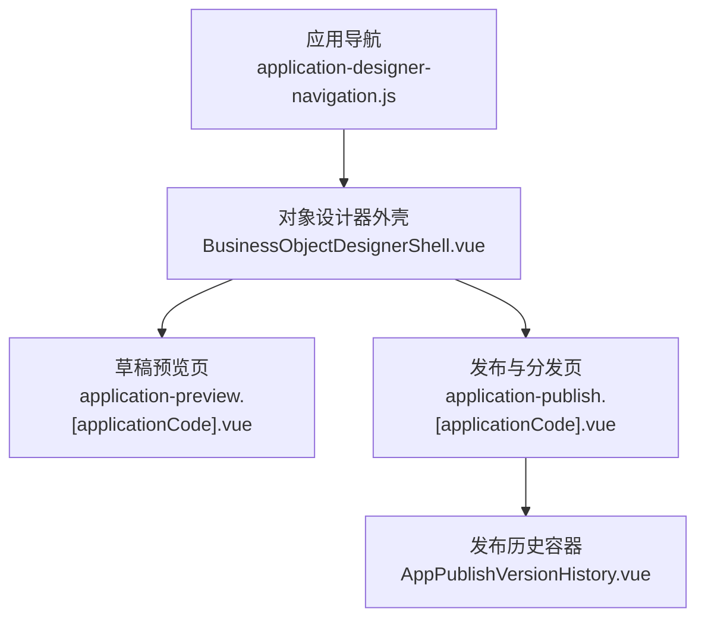
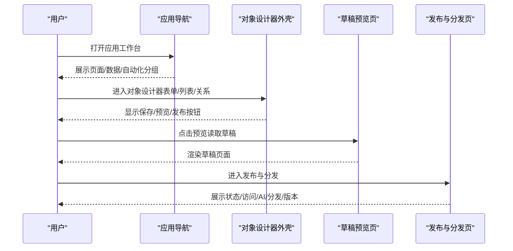
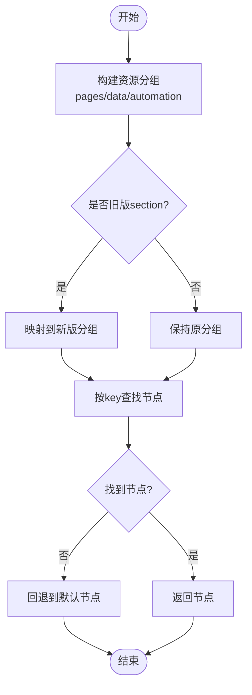
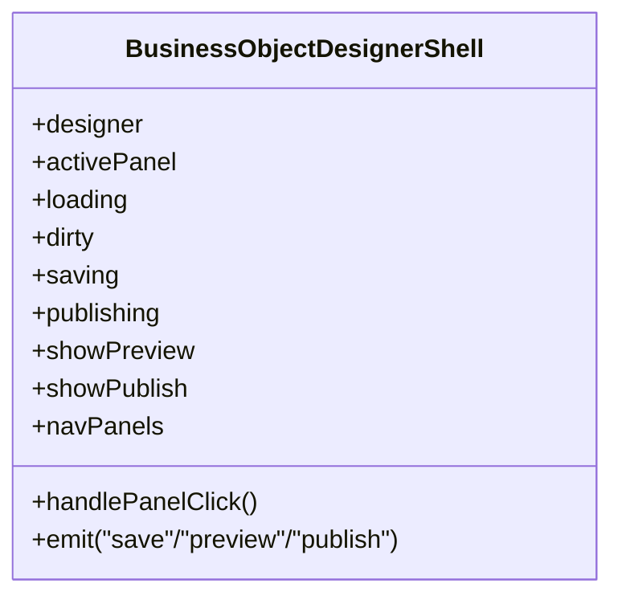
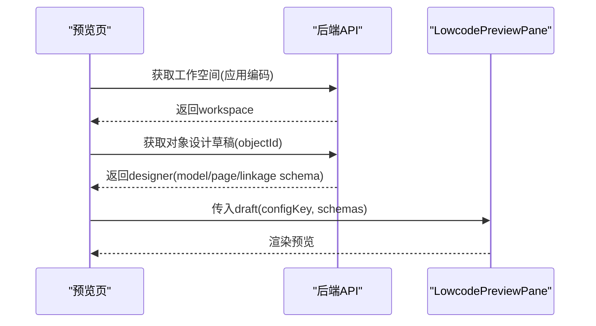
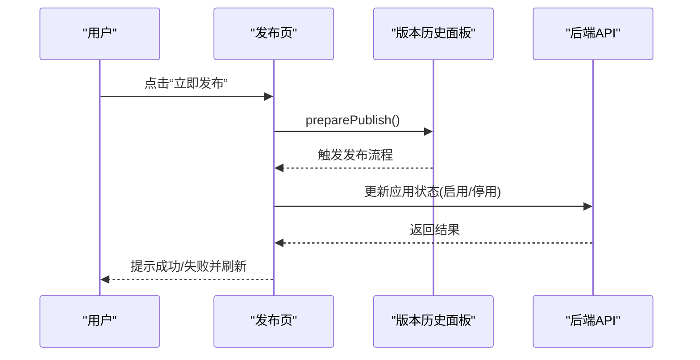
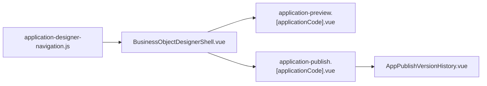

# 页面管理

<cite>
**本文引用的文件**
- [application-designer-navigation.js](file://forge-admin-ui/src/views/app-center/application-designer-navigation.js)
- [application-preview.[applicationCode].vue](file://forge-admin-ui/src/views/app-center/application-preview.[applicationCode].vue)
- [application-publish.[applicationCode].vue](file://forge-admin-ui/src/views/app-center/application-publish.[applicationCode].vue)
- [BusinessObjectDesignerShell.vue](file://forge-admin-ui/src/views/app-center/components/designer/BusinessObjectDesignerShell.vue)
- [AppPublishVersionHistory.vue](file://forge-admin-ui/src/views/app-center/components/publish/AppPublishVersionHistory.vue)
</cite>

## 目录
1. [简介](#简介)
2. [项目结构](#项目结构)
3. [核心组件](#核心组件)
4. [架构总览](#架构总览)
5. [详细组件分析](#详细组件分析)
6. [依赖关系分析](#依赖关系分析)
7. [性能考虑](#性能考虑)
8. [故障排查指南](#故障排查指南)
9. [结论](#结论)
10. [附录](#附录)

## 简介
本技术文档围绕低代码“页面管理”能力，系统阐述从创建、编辑、预览到发布的完整生命周期。重点覆盖：
- 页面结构设计（表单/列表/数据模型）与组件编排
- 路由配置与导航组织
- 权限控制与访问策略
- 版本管理与发布流程
- 团队协作与变更状态提示
- 性能监控与常见问题定位
- 开发规范、发布流程与运维指南

## 项目结构
页面管理相关的前端实现集中在应用中心视图与组件中，关键路径如下：
- 应用导航与资源分组：application-designer-navigation.js
- 草稿预览页：application-preview.[applicationCode].vue
- 发布与分发页：application-publish.[applicationCode].vue
- 对象设计器外壳（保存/预览/发布入口、导航面板）：BusinessObjectDesignerShell.vue
- 发布历史与版本操作容器：AppPublishVersionHistory.vue

图表来源
- [application-designer-navigation.js:1-116](file://forge-admin-ui/src/views/app-center/application-designer-navigation.js#L1-L116)
- [BusinessObjectDesignerShell.vue:1-129](file://forge-admin-ui/src/views/app-center/components/designer/BusinessObjectDesignerShell.vue#L1-L129)
- [application-preview.[applicationCode].vue:1-69](file://forge-admin-ui/src/views/app-center/application-preview.[applicationCode].vue#L1-L69)
- [application-publish.[applicationCode].vue:1-51](file://forge-admin-ui/src/views/app-center/application-publish.[applicationCode].vue#L1-L51)
- [AppPublishVersionHistory.vue:1-36](file://forge-admin-ui/src/views/app-center/components/publish/AppPublishVersionHistory.vue#L1-L36)

章节来源
- [application-designer-navigation.js:1-116](file://forge-admin-ui/src/views/app-center/application-designer-navigation.js#L1-L116)
- [application-preview.[applicationCode].vue:1-69](file://forge-admin-ui/src/views/app-center/application-preview.[applicationCode].vue#L1-L69)
- [application-publish.[applicationCode].vue:1-51](file://forge-admin-ui/src/views/app-center/application-publish.[applicationCode].vue#L1-L51)
- [BusinessObjectDesignerShell.vue:1-129](file://forge-admin-ui/src/views/app-center/components/designer/BusinessObjectDesignerShell.vue#L1-L129)
- [AppPublishVersionHistory.vue:1-36](file://forge-admin-ui/src/views/app-center/components/publish/AppPublishVersionHistory.vue#L1-L36)

## 核心组件
- 应用导航与资源分组：负责将“页面/数据/自动化”等模块统一组织为可导航的资源树，支持旧链接兼容与默认节点选择。
- 对象设计器外壳：提供保存、预览、发布、导航切换、未保存变更提示等通用工作区能力。
- 草稿预览页：直接读取对象设计的草稿数据，无需菜单或页面入口即可预览表单/列表。
- 发布与分发页：聚合应用状态开关、AI助手、分发渠道、版本历史等发布相关能力。
- 发布历史容器：封装版本面板的调用入口，便于在发布页触发发布准备。

章节来源
- [application-designer-navigation.js:55-156](file://forge-admin-ui/src/views/app-center/application-designer-navigation.js#L55-L156)
- [BusinessObjectDesignerShell.vue:156-229](file://forge-admin-ui/src/views/app-center/components/designer/BusinessObjectDesignerShell.vue#L156-L229)
- [application-preview.[applicationCode].vue:71-146](file://forge-admin-ui/src/views/app-center/application-preview.[applicationCode].vue#L71-L146)
- [application-publish.[applicationCode].vue:54-137](file://forge-admin-ui/src/views/app-center/application-publish.[applicationCode].vue#L54-L137)
- [AppPublishVersionHistory.vue:13-26](file://forge-admin-ui/src/views/app-center/components/publish/AppPublishVersionHistory.vue#L13-L26)

## 架构总览
页面管理的整体交互由“导航—设计—预览—发布”构成闭环：
- 导航层：根据应用上下文构建资源分组，解析目标节点并回退到默认页面。
- 设计层：对象设计器外壳承载字段、表单、列表、关系、动作等子面板，并提供保存/预览/发布入口。
- 预览层：通过草稿数据直接渲染页面，不依赖已发布的菜单或入口。
- 发布层：集中管理应用启停、访问策略、分发渠道与版本历史。

图表来源
- [application-designer-navigation.js:59-116](file://forge-admin-ui/src/views/app-center/application-designer-navigation.js#L59-L116)
- [BusinessObjectDesignerShell.vue:36-79](file://forge-admin-ui/src/views/app-center/components/designer/BusinessObjectDesignerShell.vue#L36-L79)
- [application-preview.[applicationCode].vue:113-146](file://forge-admin-ui/src/views/app-center/application-preview.[applicationCode].vue#L113-L146)
- [application-publish.[applicationCode].vue:33-50](file://forge-admin-ui/src/views/app-center/application-publish.[applicationCode].vue#L33-L50)

## 详细组件分析

### 应用导航与资源分组
- 功能要点
  - 将“页面/数据/自动化”三类资源以分组形式呈现，计算每个分组的已配置数量与总数。
  - 支持旧版 section 名称映射，确保历史链接仍可正确跳转。
  - 针对对象节点拆分“数据结构/关系与级联”，减少中间导航层级。
  - 提供查找与回退逻辑，当请求资源不存在时回退到默认节点。
- 复杂度与健壮性
  - 资源构建为 O(n) 遍历；兼容性处理保证向后兼容。
  - 对空数组、非法输入进行防御性处理，避免崩溃。
- 优化建议
  - 对大型对象集合可引入分页或懒加载。
  - 对复杂匹配逻辑增加单元测试覆盖边界情况。

图表来源
- [application-designer-navigation.js:55-156](file://forge-admin-ui/src/views/app-center/application-designer-navigation.js#L55-L156)

章节来源
- [application-designer-navigation.js:55-156](file://forge-admin-ui/src/views/app-center/application-designer-navigation.js#L55-L156)

### 对象设计器外壳（保存/预览/发布/导航）
- 功能要点
  - 顶部工具栏：保存、预览、发布、设置下拉、未保存状态指示。
  - 左侧导航：结构化面板（数据结构、表单设计、列表设计、关系与级联、业务动作、业务流程配置、树形模型、发布检查、基本信息、高级配置）。
  - 未保存变更保护：切换面板时提示，避免误操作丢失草稿。
  - 设计状态与发布状态标签：草稿/设计中/已发布/归档，以及未发布变更提示。
- 交互流程
  - 点击“预览”触发预览事件，上层可监听并打开预览窗口。
  - 点击“发布”触发发布流程，结合发布页的版本历史完成发布。
- 性能与可用性
  - 使用异步加载遮罩提升等待体验。
  - 移动端自适应布局，导航可折叠。

图表来源
- [BusinessObjectDesignerShell.vue:156-229](file://forge-admin-ui/src/views/app-center/components/designer/BusinessObjectDesignerShell.vue#L156-L229)
- [BusinessObjectDesignerShell.vue:232-267](file://forge-admin-ui/src/views/app-center/components/designer/BusinessObjectDesignerShell.vue#L232-L267)
- [BusinessObjectDesignerShell.vue:291-311](file://forge-admin-ui/src/views/app-center/components/designer/BusinessObjectDesignerShell.vue#L291-L311)
- [BusinessObjectDesignerShell.vue:313-353](file://forge-admin-ui/src/views/app-center/components/designer/BusinessObjectDesignerShell.vue#L313-L353)

章节来源
- [BusinessObjectDesignerShell.vue:1-129](file://forge-admin-ui/src/views/app-center/components/designer/BusinessObjectDesignerShell.vue#L1-L129)
- [BusinessObjectDesignerShell.vue:232-353](file://forge-admin-ui/src/views/app-center/components/designer/BusinessObjectDesignerShell.vue#L232-L353)

### 草稿预览页（无需入口直接预览）
- 功能要点
  - 通过应用编码加载工作空间与对象设计草稿，构造预览数据。
  - 支持多对象切换预览，自动选择主对象或首个对象。
  - 提供“继续设计”跳转至对象设计器，保留返回路径。
- 数据流
  - 加载工作空间 → 选择对象 → 拉取对象设计草稿 → 组装预览数据 → 渲染预览面板。
- 错误处理
  - 无对象时给出引导提示；应用不存在或无权限时返回应用总览。

图表来源
- [application-preview.[applicationCode].vue:113-146](file://forge-admin-ui/src/views/app-center/application-preview.[applicationCode].vue#L113-L146)
- [application-preview.[applicationCode].vue:95-108](file://forge-admin-ui/src/views/app-center/application-preview.[applicationCode].vue#L95-L108)

章节来源
- [application-preview.[applicationCode].vue:71-146](file://forge-admin-ui/src/views/app-center/application-preview.[applicationCode].vue#L71-L146)

### 发布与分发页（状态/访问/AI/分发/版本）
- 功能要点
  - 应用启停切换：更新应用状态并刷新展示。
  - 聚合发布相关卡片：访问控制、AI助手、分发渠道、版本历史。
  - 提供“立即发布”入口，委托版本历史面板执行发布准备。
- 路由与导航
  - 支持跳转到运行时、应用设置、工作区概览等页面。
- 错误处理
  - 加载失败时提供重新加载按钮与错误描述。

图表来源
- [application-publish.[applicationCode].vue:83-117](file://forge-admin-ui/src/views/app-center/application-publish.[applicationCode].vue#L83-L117)
- [AppPublishVersionHistory.vue:21-25](file://forge-admin-ui/src/views/app-center/components/publish/AppPublishVersionHistory.vue#L21-L25)

章节来源
- [application-publish.[applicationCode].vue:54-137](file://forge-admin-ui/src/views/app-center/application-publish.[applicationCode].vue#L54-L137)
- [AppPublishVersionHistory.vue:13-26](file://forge-admin-ui/src/views/app-center/components/publish/AppPublishVersionHistory.vue#L13-L26)

## 依赖关系分析
- 组件耦合
  - 设计器外壳与导航：通过 props/emits 解耦，面板切换由外壳控制。
  - 预览页与设计器外壳：通过路由参数与查询参数传递上下文，松耦合。
  - 发布页与版本历史：通过 ref 暴露方法，职责清晰。
- 外部依赖
  - 路由：vue-router 用于页面跳转与参数传递。
  - UI库：Naive UI 提供基础组件与消息提示。
  - 图标库：@vicons/ionicons5 提供图标。
- 潜在循环依赖
  - 当前结构未见明显循环引用；各模块职责单一，利于维护。

图表来源
- [application-designer-navigation.js:59-116](file://forge-admin-ui/src/views/app-center/application-designer-navigation.js#L59-L116)
- [BusinessObjectDesignerShell.vue:156-229](file://forge-admin-ui/src/views/app-center/components/designer/BusinessObjectDesignerShell.vue#L156-L229)
- [application-preview.[applicationCode].vue:71-146](file://forge-admin-ui/src/views/app-center/application-preview.[applicationCode].vue#L71-L146)
- [application-publish.[applicationCode].vue:54-137](file://forge-admin-ui/src/views/app-center/application-publish.[applicationCode].vue#L54-L137)
- [AppPublishVersionHistory.vue:13-26](file://forge-admin-ui/src/views/app-center/components/publish/AppPublishVersionHistory.vue#L13-L26)

章节来源
- [application-designer-navigation.js:59-116](file://forge-admin-ui/src/views/app-center/application-designer-navigation.js#L59-L116)
- [BusinessObjectDesignerShell.vue:156-229](file://forge-admin-ui/src/views/app-center/components/designer/BusinessObjectDesignerShell.vue#L156-L229)
- [application-preview.[applicationCode].vue:71-146](file://forge-admin-ui/src/views/app-center/application-preview.[applicationCode].vue#L71-L146)
- [application-publish.[applicationCode].vue:54-137](file://forge-admin-ui/src/views/app-center/application-publish.[applicationCode].vue#L54-L137)
- [AppPublishVersionHistory.vue:13-26](file://forge-admin-ui/src/views/app-center/components/publish/AppPublishVersionHistory.vue#L13-L26)

## 性能考虑
- 懒加载与按需渲染
  - 设计器面板采用异步加载遮罩，避免首屏阻塞。
  - 导航项可按需展开，减少初始渲染开销。
- 数据获取优化
  - 预览页仅在对象切换时重新拉取草稿，避免重复请求。
  - 发布页在状态变更后刷新必要数据，减少冗余请求。
- 用户体验优化
  - 移动端响应式布局与导航折叠，提升小屏可用性。
  - 未保存变更提示，降低误操作风险。

[本节为通用指导，不直接分析具体文件]

## 故障排查指南
- 预览空白或无法渲染
  - 检查是否成功加载工作空间与对象设计草稿。
  - 确认 previewDraft 数据结构包含必要的 model/page/linkage schema。
- 发布失败或状态不同步
  - 检查应用状态更新接口返回，确认状态切换成功。
  - 查看版本历史面板的错误提示，必要时重试发布。
- 导航跳转异常
  - 验证资源 key 与 legacy section 映射是否正确。
  - 确认路由参数 applicationCode/objectId 传递无误。
- 未保存变更丢失
  - 切换面板前注意未保存提示，必要时先保存再切换。

章节来源
- [application-preview.[applicationCode].vue:113-146](file://forge-admin-ui/src/views/app-center/application-preview.[applicationCode].vue#L113-L146)
- [application-publish.[applicationCode].vue:83-117](file://forge-admin-ui/src/views/app-center/application-publish.[applicationCode].vue#L83-L117)
- [application-designer-navigation.js:55-156](file://forge-admin-ui/src/views/app-center/application-designer-navigation.js#L55-L156)
- [BusinessObjectDesignerShell.vue:291-311](file://forge-admin-ui/src/views/app-center/components/designer/BusinessObjectDesignerShell.vue#L291-L311)

## 结论
页面管理通过“导航—设计—预览—发布”的闭环实现了低代码页面的全生命周期管理。前端以清晰的组件职责与松耦合的交互模式，支撑了页面结构设计、组件编排、路由配置与权限控制。配合版本管理与发布流程，满足团队协作与持续交付需求。建议在后续迭代中加强性能监控与错误上报，进一步提升稳定性与可观测性。

[本节为总结，不直接分析具体文件]

## 附录
- 页面开发规范
  - 优先使用对象设计器进行字段、表单、列表与关系的可视化配置。
  - 通过导航分组统一管理页面与数据资源，避免散乱路由。
  - 在切换面板前保存变更，避免数据丢失。
- 发布流程
  - 在设计器中完成配置并保存。
  - 进入发布与分发页，检查访问策略与分发渠道。
  - 通过版本历史面板执行发布，关注状态变化与错误提示。
- 运维指南
  - 监控预览与发布接口的成功率与耗时。
  - 定期清理无效草稿与废弃页面。
  - 建立错误告警与回滚机制，保障线上稳定。

[本节为通用指导，不直接分析具体文件]