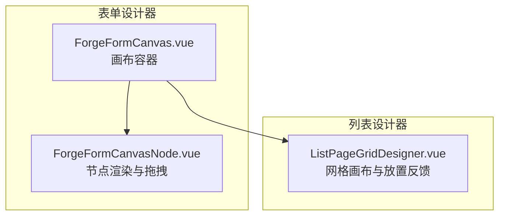
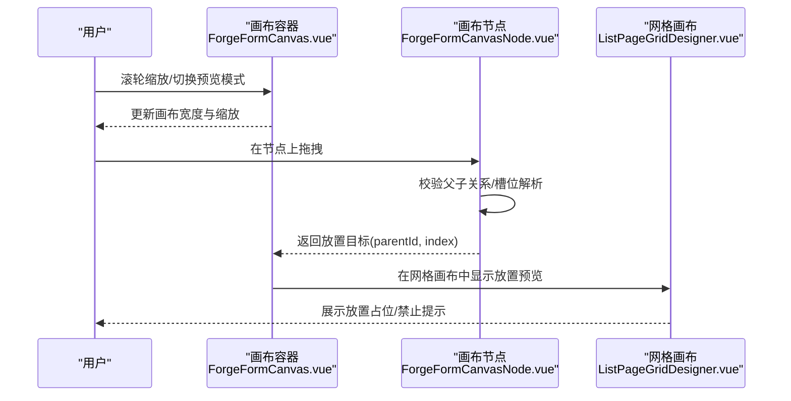
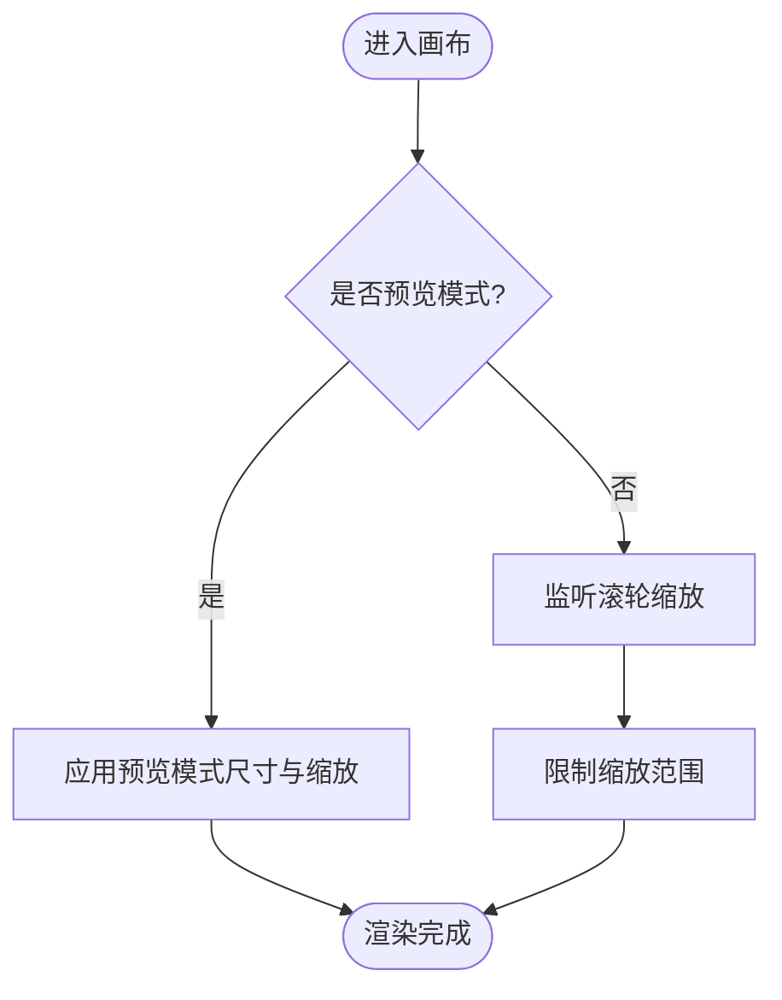
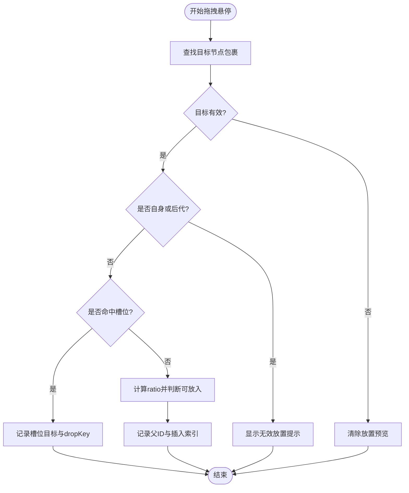
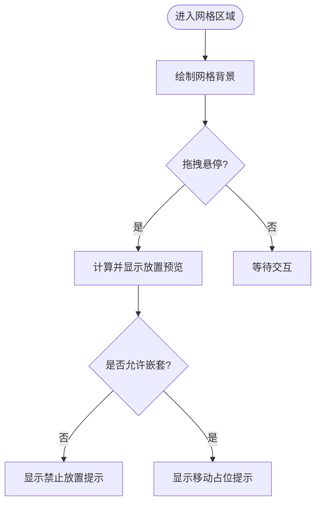
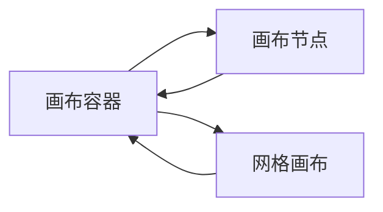

# 页面设计器

<cite>
**本文引用的文件**
- [ForgeFormCanvas.vue](file://forge-admin-ui/src/views/app-center/components/designer/forge-form-designer/ForgeFormCanvas.vue)
- [ForgeFormCanvasNode.vue](file://forge-admin-ui/src/views/app-center/components/designer/forge-form-designer/ForgeFormCanvasNode.vue)
- [ListPageGridDesigner.vue](file://forge-admin-ui/src/components/lowcode-builder/page/ListPageGridDesigner.vue)
</cite>

## 目录
1. [简介](#简介)
2. [项目结构](#项目结构)
3. [核心组件](#核心组件)
4. [架构总览](#架构总览)
5. [详细组件分析](#详细组件分析)
6. [依赖关系分析](#依赖关系分析)
7. [性能考量](#性能考量)
8. [故障排查指南](#故障排查指南)
9. [结论](#结论)
10. [附录](#附录)

## 简介
本技术文档围绕可视化页面设计器的核心能力展开，覆盖画布操作、组件拖拽、属性配置与实时预览；深入解释页面结构设计、组件树管理、事件绑定与数据绑定机制；并给出表单设计器、列表设计器与CRUD页面的设计模式建议，以及组件开发规范、自定义组件集成与性能优化策略。文档基于仓库中现有实现进行梳理与归纳，帮助读者快速理解并高效扩展页面设计器能力。

## 项目结构
页面设计器相关的前端代码主要分布在以下位置：
- 表单设计器画布与节点：位于视图层的设计器子模块中，负责画布渲染、缩放、拖放与选中态管理。
- 列表设计器网格画布：位于低代码构建器页面组件中，提供网格背景、放置预览、移动占位等交互。
- 通用能力：通过组合式函数与工具方法支撑拖拽状态、布局工厂、校验规则等（在仓库中由其他模块提供）。

图表来源
- [ForgeFormCanvas.vue:293-345](file://forge-admin-ui/src/views/app-center/components/designer/forge-form-designer/ForgeFormCanvas.vue#L293-L345)
- [ForgeFormCanvasNode.vue:1321-1366](file://forge-admin-ui/src/views/app-center/components/designer/forge-form-designer/ForgeFormCanvasNode.vue#L1321-L1366)
- [ListPageGridDesigner.vue:104-147](file://forge-admin-ui/src/components/lowcode-builder/page/ListPageGridDesigner.vue#L104-L147)

章节来源
- [ForgeFormCanvas.vue:293-345](file://forge-admin-ui/src/views/app-center/components/designer/forge-form-designer/ForgeFormCanvas.vue#L293-L345)
- [ForgeFormCanvasNode.vue:1321-1366](file://forge-admin-ui/src/views/app-center/components/designer/forge-form-designer/ForgeFormCanvasNode.vue#L1321-L1366)
- [ListPageGridDesigner.vue:104-147](file://forge-admin-ui/src/components/lowcode-builder/page/ListPageGridDesigner.vue#L104-L147)

## 核心组件
- 画布容器（表单）：负责画布尺寸、缩放、预览模式切换、根级放置、空白点击取消选择等。
- 画布节点（表单）：负责节点内指针拖拽时的目标判定、槽位解析、父子关系校验与放置位置计算。
- 网格画布（列表）：负责网格背景绘制、放置预览、移动占位提示、滚动与缩放联动。

章节来源
- [ForgeFormCanvas.vue:293-345](file://forge-admin-ui/src/views/app-center/components/designer/forge-form-designer/ForgeFormCanvas.vue#L293-L345)
- [ForgeFormCanvasNode.vue:1321-1366](file://forge-admin-ui/src/views/app-center/components/designer/forge-form-designer/ForgeFormCanvasNode.vue#L1321-L1366)
- [ListPageGridDesigner.vue:104-147](file://forge-admin-ui/src/components/lowcode-builder/page/ListPageGridDesigner.vue#L104-L147)

## 架构总览
页面设计器采用“画布-节点”分层架构：
- 画布层：统一处理缩放、预览模式、根级放置、全局选择态。
- 节点层：负责具体组件的渲染、事件透传、内部槽位与嵌套约束校验。
- 列表网格层：以网格为视觉参考，提供精确的放置定位与反馈。

图表来源
- [ForgeFormCanvas.vue:293-345](file://forge-admin-ui/src/views/app-center/components/designer/forge-form-designer/ForgeFormCanvas.vue#L293-L345)
- [ForgeFormCanvasNode.vue:1321-1366](file://forge-admin-ui/src/views/app-center/components/designer/forge-form-designer/ForgeFormCanvasNode.vue#L1321-L1366)
- [ListPageGridDesigner.vue:104-147](file://forge-admin-ui/src/components/lowcode-builder/page/ListPageGridDesigner.vue#L104-L147)

## 详细组件分析

### 画布容器（表单）
- 功能要点
  - 画布尺寸与缩放：支持按预设模式设置宽度与缩放比例，限制缩放范围。
  - 预览模式：切换桌面/窄屏/弹窗/抽屉/移动端等预览尺寸。
  - 根级放置：在画布空白区域释放时，将组件插入到根节点末尾。
  - 选择态管理：空白点击清除选中项。
- 关键流程
  - 滚轮缩放：在非预览模式下，根据滚轮方向调整缩放值并限制边界。
  - 根级放置：调用统一的放置应用逻辑，生成新的 schema 并触发更新。
  - 预览模式切换：映射不同模式的宽高与缩放，同步更新画布样式。

图表来源
- [ForgeFormCanvas.vue:293-345](file://forge-admin-ui/src/views/app-center/components/designer/forge-form-designer/ForgeFormCanvas.vue#L293-L345)

章节来源
- [ForgeFormCanvas.vue:293-345](file://forge-admin-ui/src/views/app-center/components/designer/forge-form-designer/ForgeFormCanvas.vue#L293-L345)

### 画布节点（表单）
- 功能要点
  - 目标判定：识别当前悬停的节点包裹元素，提取节点ID。
  - 父子关系校验：防止将组件拖入自身或后代节点。
  - 槽位解析：优先尝试将组件放入容器的插槽目标，否则判断是否可放入容器内部。
  - 放置位置计算：根据鼠标在节点内的相对高度计算插入索引。
- 关键流程
  - 获取目标节点：从 DOM 向上查找最近的数据节点包裹元素。
  - 校验合法性：拒绝非法目标（自身、后代）。
  - 解析槽位：若命中槽位则记录槽位目标与 dropKey。
  - 计算插入点：未命中槽位时，依据 ratio 决定放入内部的位置。

图表来源
- [ForgeFormCanvasNode.vue:1321-1366](file://forge-admin-ui/src/views/app-center/components/designer/forge-form-designer/ForgeFormCanvasNode.vue#L1321-L1366)

章节来源
- [ForgeFormCanvasNode.vue:1321-1366](file://forge-admin-ui/src/views/app-center/components/designer/forge-form-designer/ForgeFormCanvasNode.vue#L1321-L1366)

### 网格画布（列表）
- 功能要点
  - 网格背景：渲染行列网格线，辅助对齐与布局。
  - 放置预览：在拖拽过程中显示放置位置预览框。
  - 移动占位：在组件重排时显示“释放到这里”的占位提示。
  - 滚动与缩放：配合画布缩放与滚动条，保持视觉一致性。
- 关键流程
  - 渲染网格：根据行高、列数与间距动态生成网格线。
  - 显示预览：当拖拽进入有效区域时，计算并显示预览框样式。
  - 阻止非法放置：对不支持嵌套的组件显示“该组件不支持嵌套”。

图表来源
- [ListPageGridDesigner.vue:104-147](file://forge-admin-ui/src/components/lowcode-builder/page/ListPageGridDesigner.vue#L104-L147)

章节来源
- [ListPageGridDesigner.vue:104-147](file://forge-admin-ui/src/components/lowcode-builder/page/ListPageGridDesigner.vue#L104-L147)

## 依赖关系分析
- 组件耦合
  - 画布容器与节点：节点向容器上报放置结果（parentId、index），容器据此更新 schema。
  - 网格画布与容器：容器在根级放置时，网格画布提供视觉反馈（预览/占位）。
- 外部依赖
  - 拖拽状态与布局工厂：由设计器子模块提供的组合式函数与工具方法支撑（不在本节直接引用）。
- 潜在循环依赖
  - 通过事件与回调解耦，避免直接相互引用导致的循环依赖。

图表来源
- [ForgeFormCanvas.vue:293-345](file://forge-admin-ui/src/views/app-center/components/designer/forge-form-designer/ForgeFormCanvas.vue#L293-L345)
- [ForgeFormCanvasNode.vue:1321-1366](file://forge-admin-ui/src/views/app-center/components/designer/forge-form-designer/ForgeFormCanvasNode.vue#L1321-L1366)
- [ListPageGridDesigner.vue:104-147](file://forge-admin-ui/src/components/lowcode-builder/page/ListPageGridDesigner.vue#L104-L147)

章节来源
- [ForgeFormCanvas.vue:293-345](file://forge-admin-ui/src/views/app-center/components/designer/forge-form-designer/ForgeFormCanvas.vue#L293-L345)
- [ForgeFormCanvasNode.vue:1321-1366](file://forge-admin-ui/src/views/app-center/components/designer/forge-form-designer/ForgeFormCanvasNode.vue#L1321-L1366)
- [ListPageGridDesigner.vue:104-147](file://forge-admin-ui/src/components/lowcode-builder/page/ListPageGridDesigner.vue#L104-L147)

## 性能考量
- 缩放与渲染
  - 使用受控的缩放范围与增量步长，避免频繁重绘。
  - 网格背景按需渲染，减少不必要的 DOM 节点。
- 拖拽计算
  - 在节点层尽早进行父子关系与槽位校验，降低无效放置的计算成本。
  - 使用稳定的 key 与最小化更新，减少重渲染。
- 预览模式
  - 切换预览模式时批量更新样式与尺寸，避免多次回流。
- 大数据量
  - 列表场景下分页渲染虚拟列表，结合网格对齐提升交互流畅度。

[本节为通用性能建议，不直接分析具体文件]

## 故障排查指南
- 无法放入目标节点
  - 检查是否命中自身或后代节点校验，确认拖拽目标正确。
  - 查看槽位解析逻辑，确认目标组件是否支持插槽。
- 放置预览异常
  - 确认网格画布的预览框样式计算是否正确。
  - 检查是否触发了“不支持嵌套”的阻断逻辑。
- 缩放与预览模式
  - 验证缩放范围限制与模式映射表是否生效。
  - 确认滚轮事件在非预览模式下被正确处理。

章节来源
- [ForgeFormCanvasNode.vue:1321-1366](file://forge-admin-ui/src/views/app-center/components/designer/forge-form-designer/ForgeFormCanvasNode.vue#L1321-L1366)
- [ListPageGridDesigner.vue:104-147](file://forge-admin-ui/src/components/lowcode-builder/page/ListPageGridDesigner.vue#L104-L147)
- [ForgeFormCanvas.vue:293-345](file://forge-admin-ui/src/views/app-center/components/designer/forge-form-designer/ForgeFormCanvas.vue#L293-L345)

## 结论
页面设计器通过“画布-节点-网格”的分层架构，实现了稳定的画布操作、精准的组件拖拽与直观的放置反馈。表单设计器与列表设计器分别针对各自场景提供了完善的交互体验。遵循组件开发规范与性能优化建议，可进一步提升设计器的可扩展性与运行效率。

[本节为总结性内容，不直接分析具体文件]

## 附录
- 表单设计器
  - 页面结构：以 schema 驱动组件树，节点层级清晰。
  - 事件绑定：节点事件透传到上层，便于统一处理。
  - 数据绑定：通过字段映射与公式引擎（由其他模块提供）实现动态数据流。
- 列表设计器
  - 页面结构：网格布局+数据表格，支持列配置与筛选。
  - 事件绑定：行操作、列排序、分页等事件集中管理。
  - 数据绑定：查询源与字段映射，支持远程数据加载。
- CRUD 页面设计模式
  - 模板化：基于表单与列表组合生成增删改查页面。
  - 权限控制：按钮与字段级权限，保障数据安全。
  - 扩展点：预留插槽与钩子，便于业务定制。

[本节为概念性说明，不直接分析具体文件]