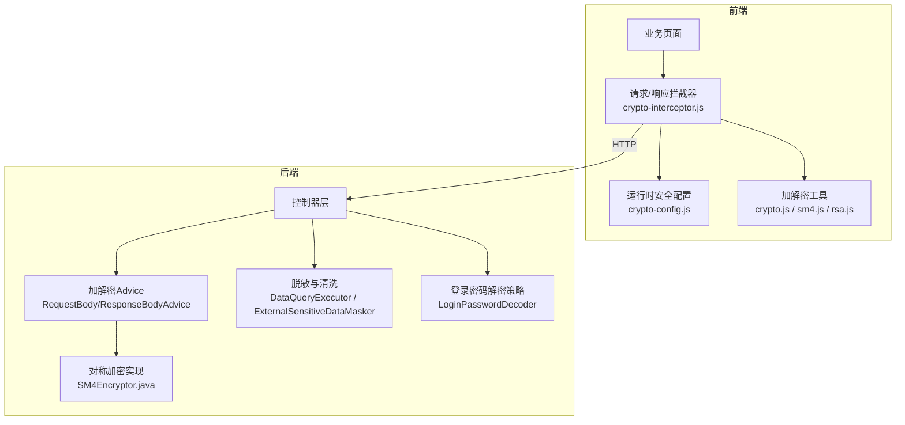
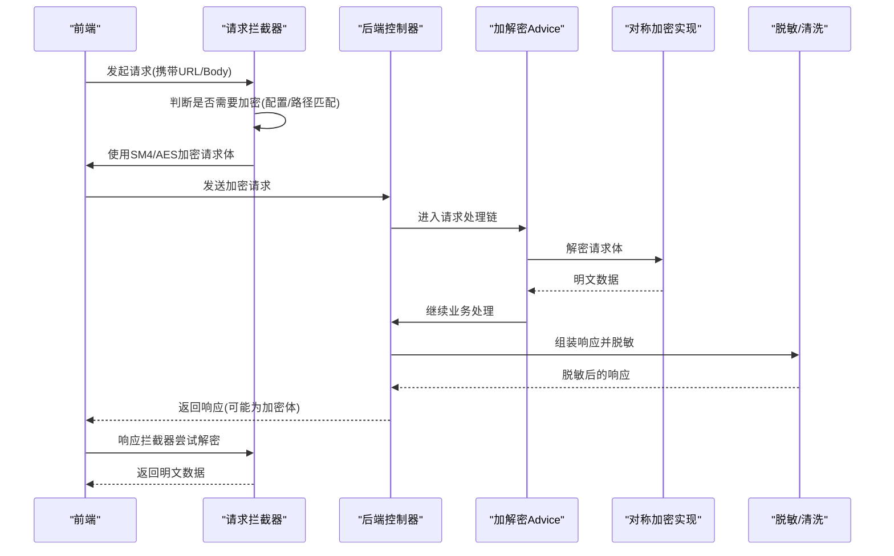
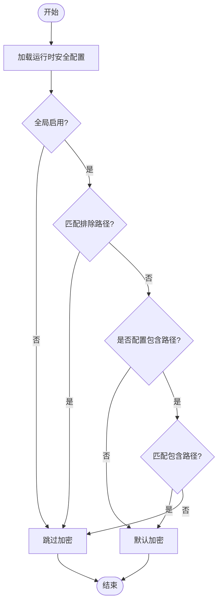
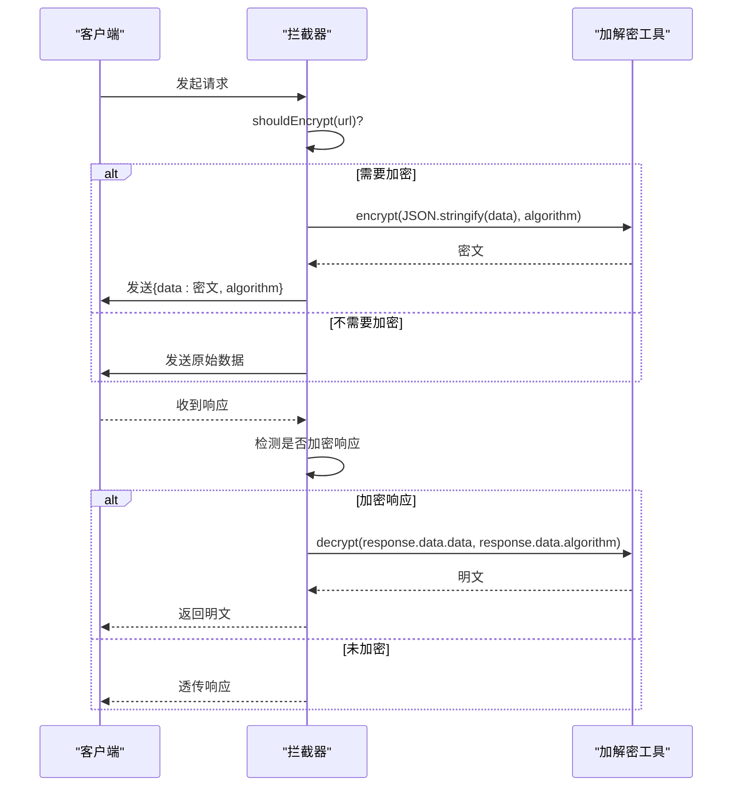
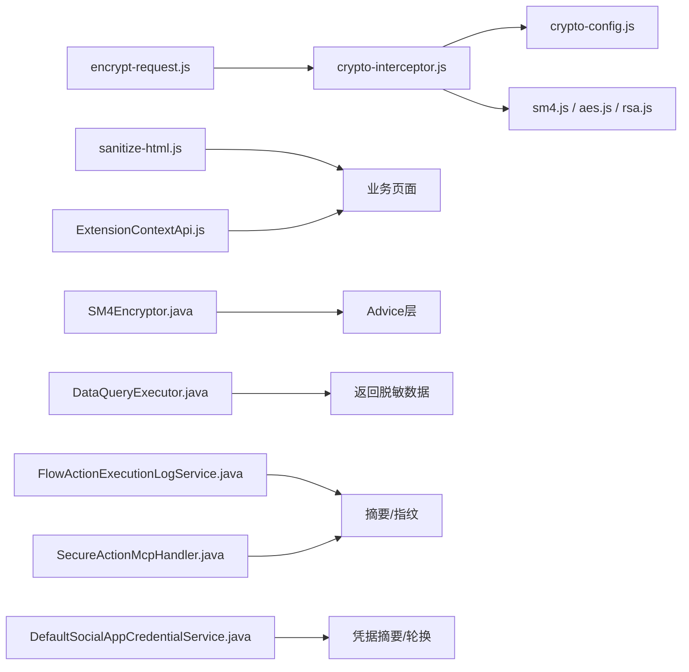

# API加密与安全

<cite>
**本文引用的文件**
- [forge-admin-ui/src/utils/crypto.js](file://forge-admin-ui/src/utils/crypto.js)
- [forge-admin-ui/src/utils/crypto/crypto-config.js](file://forge-admin-ui/src/utils/crypto/crypto-config.js)
- [forge-admin-ui/src/utils/crypto/crypto-interceptor.js](file://forge-admin-ui/src/utils/crypto/crypto-interceptor.js)
- [forge-admin-ui/src/utils/encryptTool.js](file://forge-admin-ui/src/utils/encryptTool.js)
- [forge-admin-ui/src/utils/encrypt-request.js](file://forge-admin-ui/src/utils/encrypt-request.js)
- [forge-admin-ui/src/utils/sanitize-html.js](file://forge-admin-ui/src/utils/sanitize-html.js)
- [forge-admin-ui/src/components/lowcode-extension/js/extension-context-api.js](file://forge-admin-ui/src/components/lowcode-extension/js/extension-context-api.js)
- [forge-h5-ui/src/utils/crypto/sm4.js](file://forge-h5-ui/src/utils/crypto/sm4.js)
- [forge-report-ui/src/utils/api-crypto/sm4.ts](file://forge-report-ui/src/utils/api-crypto/sm4.ts)
- [forge-server/forge-framework/forge-starter-parent/forge-starter-crypto/src/main/java/com/mdframe/forge/starter/crypto/crypto/impl/SM4Encryptor.java](file://forge-server/forge-framework/forge-starter-parent/forge-starter-crypto/src/main/java/com/mdframe/forge/starter/crypto/crypto/impl/SM4Encryptor.java)
- [forge-server/forge-framework/forge-plugin-parent/forge-plugin-system/src/test/java/com/mdframe/forge/plugin/system/auth/LoginPasswordDecoderTest.java](file://forge-server/forge-framework/forge-plugin-parent/forge-plugin-system/src/test/java/com/mdframe/forge/plugin/system/auth/LoginPasswordDecoderTest.java)
- [forge-server/forge-framework/forge-plugin-parent/forge-plugin-capability-parent/forge-plugin-capability-actions/src/main/java/com/mdframe/forge/plugin/capability/flowaction/service/FlowActionExecutionLogService.java](file://forge-server/forge-framework/forge-plugin-parent/forge-plugin-capability-parent/forge-plugin-capability-actions/src/main/java/com/mdframe/forge/plugin/capability/flowaction/service/FlowActionExecutionLogService.java)
- [forge-server/forge-framework/forge-plugin-parent/forge-plugin-capability-parent/forge-plugin-capability-actions/src/main/java/com/mdframe/forge/plugin/capability/secureaction/mcp/SecureActionMcpHandler.java](file://forge-server/forge-framework/forge-plugin-parent/forge-plugin-capability-parent/forge-plugin-capability-actions/src/main/java/com/mdframe/forge/plugin/capability/secureaction/mcp/SecureActionMcpHandler.java)
- [forge-server/forge-framework/forge-plugin-parent/forge-plugin-data/src/main/java/com/mdframe/forge/plugin/data/service/DataQueryExecutor.java](file://forge-server/forge-framework/forge-plugin-parent/forge-plugin-data/src/main/java/com/mdframe/forge/plugin/data/service/DataQueryExecutor.java)
- [forge-server/forge-framework/forge-plugin-parent/forge-plugin-external/src/test/java/com/mdframe/forge/plugin/external/support/ExternalSensitiveDataMaskerTest.java](file://forge-server/forge-framework/forge-plugin-parent/forge-plugin-external/src/test/java/com/mdframe/forge/plugin/external/support/ExternalSensitiveDataMaskerTest.java)
- [forge-server/forge-framework/forge-starter-parent/forge-starter-social/src/main/java/com/mdframe/forge/starter/social/security/DefaultSocialAppCredentialService.java](file://forge-server/forge-framework/forge-starter-parent/forge-starter-social/src/main/java/com/mdframe/forge/starter/social/security/DefaultSocialAppCredentialService.java)
- [forge-server/forge-framework/forge-starter-parent/forge-starter-social/src/test/java/com/mdframe/forge/starter/social/security/SocialAppCredentialServiceTest.java](file://forge-server/forge-framework/forge-starter-parent/forge-starter-social/src/test/java/com/mdframe/forge/starter/social/security/SocialAppCredentialServiceTest.java)
- [code-copilot/changes/framework-crypto-key-lifecycle-hardening/test-spec.md](file://code-copilot/changes/framework-crypto-key-lifecycle-hardening/test-spec.md)
</cite>

## 目录
1. [简介](#简介)
2. [项目结构](#项目结构)
3. [核心组件](#核心组件)
4. [架构总览](#架构总览)
5. [详细组件分析](#详细组件分析)
6. [依赖关系分析](#依赖关系分析)
7. [性能考量](#性能考量)
8. [故障排查指南](#故障排查指南)
9. [结论](#结论)
10. [附录](#附录)

## 简介
本技术文档围绕 Forge Admin 的 API 加密与安全实现，系统梳理前端加密算法、数据传输加密与敏感信息脱敏处理；深入解析 RSA 非对称加密、AES/SM4 对称加密以及前后端混合加密方案；说明 XSS 防护、CSRF 防护与输入验证机制；补充数字签名与消息完整性校验、安全通信协议要点；并提供安全配置指南、漏洞扫描与渗透测试方法。内容基于仓库中实际代码与测试用例进行归纳与可视化，便于不同技术背景的读者理解与实践。

## 项目结构
本项目在前后端均实现了端到端的加密与安全能力：
- 前端（Vue）提供统一的加解密工具、请求拦截器、运行时安全配置加载与密钥交换能力，支持 SM4/AES 及 RSA 等算法，并通过白名单/黑名单控制哪些接口需要加密。
- 后端（Spring Boot）提供对称加密实现、登录密码解密策略、能力调用摘要与指纹、数据查询结果脱敏、外部输出敏感信息清洗、凭据生命周期管理等。

图表来源
- [forge-admin-ui/src/utils/crypto/crypto-interceptor.js:1-152](file://forge-admin-ui/src/utils/crypto/crypto-interceptor.js#L1-L152)
- [forge-admin-ui/src/utils/crypto/crypto-config.js:1-190](file://forge-admin-ui/src/utils/crypto/crypto-config.js#L1-L190)
- [forge-admin-ui/src/utils/crypto.js:1-124](file://forge-admin-ui/src/utils/crypto.js#L1-L124)
- [forge-server/forge-framework/forge-starter-parent/forge-starter-crypto/src/main/java/com/mdframe/forge/starter/crypto/crypto/impl/SM4Encryptor.java:54-98](file://forge-server/forge-framework/forge-starter-parent/forge-starter-crypto/src/main/java/com/mdframe/forge/starter/crypto/crypto/impl/SM4Encryptor.java#L54-L98)
- [forge-server/forge-framework/forge-plugin-parent/forge-plugin-data/src/main/java/com/mdframe/forge/plugin/data/service/DataQueryExecutor.java:332-364](file://forge-server/forge-framework/forge-plugin-parent/forge-plugin-data/src/main/java/com/mdframe/forge/plugin/data/service/DataQueryExecutor.java#L332-L364)
- [forge-server/forge-framework/forge-plugin-parent/forge-plugin-system/src/test/java/com/mdframe/forge/plugin/system/auth/LoginPasswordDecoderTest.java:1-29](file://forge-server/forge-framework/forge-plugin-parent/forge-plugin-system/src/test/java/com/mdframe/forge/plugin/system/auth/LoginPasswordDecoderTest.java#L1-L29)

章节来源
- [forge-admin-ui/src/utils/crypto/crypto-interceptor.js:1-152](file://forge-admin-ui/src/utils/crypto/crypto-interceptor.js#L1-L152)
- [forge-admin-ui/src/utils/crypto/crypto-config.js:1-190](file://forge-admin-ui/src/utils/crypto/crypto-config.js#L1-L190)
- [forge-admin-ui/src/utils/crypto.js:1-124](file://forge-admin-ui/src/utils/crypto.js#L1-L124)
- [forge-server/forge-framework/forge-starter-parent/forge-starter-crypto/src/main/java/com/mdframe/forge/starter/crypto/crypto/impl/SM4Encryptor.java:54-98](file://forge-server/forge-framework/forge-starter-parent/forge-starter-crypto/src/main/java/com/mdframe/forge/starter/crypto/crypto/impl/SM4Encryptor.java#L54-L98)
- [forge-server/forge-framework/forge-plugin-parent/forge-plugin-data/src/main/java/com/mdframe/forge/plugin/data/service/DataQueryExecutor.java:332-364](file://forge-server/forge-framework/forge-plugin-parent/forge-plugin-data/src/main/java/com/mdframe/forge/plugin/data/service/DataQueryExecutor.java#L332-L364)
- [forge-server/forge-framework/forge-plugin-parent/forge-plugin-system/src/test/java/com/mdframe/forge/plugin/system/auth/LoginPasswordDecoderTest.java:1-29](file://forge-server/forge-framework/forge-plugin-parent/forge-plugin-system/src/test/java/com/mdframe/forge/plugin/system/auth/LoginPasswordDecoderTest.java#L1-L29)

## 核心组件
- 前端运行时安全配置：定义是否启用加密、算法选择、动态密钥开关、防重放开关与路径包含/排除规则，并支持从后端加载运行时配置，失败时保持安全默认开启。
- 前端请求/响应拦截器：对符合条件的请求体进行对称加密（SM4/AES），并对返回体进行对称解密；当密钥缺失或解密异常时采取阻断或降级策略。
- 前端通用加密工具：提供 MD5、Base64、随机串生成，以及 AES/SM4/RSA 等算法封装；同时提供兼容旧接口的 EncryptTool。
- 后端对称加密实现：以 SM4 为主，要求密钥长度校验与异常日志记录。
- 登录密码解密策略：通过 RSA 私钥解密前端传来的密文，失败则拒绝登录。
- 数据脱敏与输出清洗：查询结果按字段敏感度应用掩码规则；对外部输出 JSON/URL/错误文本中的敏感信息进行清洗。
- 凭据生命周期管理：对社交应用凭据等敏感配置提供摘要展示、保留或轮换能力，避免明文回显。

章节来源
- [forge-admin-ui/src/utils/crypto/crypto-config.js:1-190](file://forge-admin-ui/src/utils/crypto/crypto-config.js#L1-L190)
- [forge-admin-ui/src/utils/crypto/crypto-interceptor.js:1-152](file://forge-admin-ui/src/utils/crypto/crypto-interceptor.js#L1-L152)
- [forge-admin-ui/src/utils/crypto.js:1-124](file://forge-admin-ui/src/utils/crypto.js#L1-L124)
- [forge-admin-ui/src/utils/encryptTool.js:1-94](file://forge-admin-ui/src/utils/encryptTool.js#L1-L94)
- [forge-server/forge-framework/forge-starter-parent/forge-starter-crypto/src/main/java/com/mdframe/forge/starter/crypto/crypto/impl/SM4Encryptor.java:54-98](file://forge-server/forge-framework/forge-starter-parent/forge-starter-crypto/src/main/java/com/mdframe/forge/starter/crypto/crypto/impl/SM4Encryptor.java#L54-L98)
- [forge-server/forge-framework/forge-plugin-parent/forge-plugin-system/src/test/java/com/mdframe/forge/plugin/system/auth/LoginPasswordDecoderTest.java:1-29](file://forge-server/forge-framework/forge-plugin-parent/forge-plugin-system/src/test/java/com/mdframe/forge/plugin/system/auth/LoginPasswordDecoderTest.java#L1-L29)
- [forge-server/forge-framework/forge-plugin-parent/forge-plugin-data/src/main/java/com/mdframe/forge/plugin/data/service/DataQueryExecutor.java:332-364](file://forge-server/forge-framework/forge-plugin-parent/forge-plugin-data/src/main/java/com/mdframe/forge/plugin/data/service/DataQueryExecutor.java#L332-L364)
- [forge-server/forge-framework/forge-plugin-parent/forge-plugin-external/src/test/java/com/mdframe/forge/plugin/external/support/ExternalSensitiveDataMaskerTest.java:1-38](file://forge-server/forge-framework/forge-plugin-parent/forge-plugin-external/src/test/java/com/mdframe/forge/plugin/external/support/ExternalSensitiveDataMaskerTest.java#L1-L38)
- [forge-server/forge-framework/forge-starter-parent/forge-starter-social/src/main/java/com/mdframe/forge/starter/social/security/DefaultSocialAppCredentialService.java:56-76](file://forge-server/forge-framework/forge-starter-parent/forge-starter-social/src/main/java/com/mdframe/forge/starter/social/security/DefaultSocialAppCredentialService.java#L56-L76)

## 架构总览
下图展示了前端到后端的完整安全链路：前端根据运行时配置决定是否加密请求体，使用对称算法（SM4/AES）加密；后端通过 Advice 自动解密并执行业务逻辑；返回前对敏感数据进行脱敏；登录流程采用 RSA 解密密码；能力调用通过摘要与指纹保证完整性与幂等性。

图表来源
- [forge-admin-ui/src/utils/crypto/crypto-interceptor.js:1-152](file://forge-admin-ui/src/utils/crypto/crypto-interceptor.js#L1-L152)
- [forge-admin-ui/src/utils/crypto/crypto-config.js:1-190](file://forge-admin-ui/src/utils/crypto/crypto-config.js#L1-L190)
- [forge-server/forge-framework/forge-starter-parent/forge-starter-crypto/src/main/java/com/mdframe/forge/starter/crypto/crypto/impl/SM4Encryptor.java:54-98](file://forge-server/forge-framework/forge-starter-parent/forge-starter-crypto/src/main/java/com/mdframe/forge/starter/crypto/crypto/impl/SM4Encryptor.java#L54-L98)
- [forge-server/forge-framework/forge-plugin-parent/forge-plugin-data/src/main/java/com/mdframe/forge/plugin/data/service/DataQueryExecutor.java:332-364](file://forge-server/forge-framework/forge-plugin-parent/forge-plugin-data/src/main/java/com/mdframe/forge/plugin/data/service/DataQueryExecutor.java#L332-L364)

## 详细组件分析

### 前端运行时安全配置与路径匹配
- 运行时配置项包括是否启用加密、API级加解密开关、算法选择（SM4/AES）、动态密钥开关、防重放开关与路径包含/排除列表。
- 支持从后端 /crypto/config 加载配置，失败时保持安全默认开启；内置必要的安全路径排除（如验证码、登录、公钥获取等）。
- 提供路径匹配函数，支持通配符模式，用于决定某 URL 是否需要加密。

图表来源
- [forge-admin-ui/src/utils/crypto/crypto-config.js:1-190](file://forge-admin-ui/src/utils/crypto/crypto-config.js#L1-L190)

章节来源
- [forge-admin-ui/src/utils/crypto/crypto-config.js:1-190](file://forge-admin-ui/src/utils/crypto/crypto-config.js#L1-L190)

### 前端请求/响应拦截器（SM4/AES）
- 请求阶段：若命中需加密的路径且密钥有效，则将请求体序列化为 JSON 并使用当前配置的算法（SM4 或 AES）加密，附带算法标识。
- 响应阶段：若响应体包含加密标记与算法标识，则使用相同算法与密钥解密；若出现填充错误或密钥问题，抛出特定错误以便上层统一处理。
- 兼容旧版加密请求封装，提供 postEncrypt 与 createEncryptRequest。

图表来源
- [forge-admin-ui/src/utils/crypto/crypto-interceptor.js:1-152](file://forge-admin-ui/src/utils/crypto/crypto-interceptor.js#L1-L152)
- [forge-admin-ui/src/utils/encrypt-request.js:1-42](file://forge-admin-ui/src/utils/encrypt-request.js#L1-L42)

章节来源
- [forge-admin-ui/src/utils/crypto/crypto-interceptor.js:1-152](file://forge-admin-ui/src/utils/crypto/crypto-interceptor.js#L1-L152)
- [forge-admin-ui/src/utils/encrypt-request.js:1-42](file://forge-admin-ui/src/utils/encrypt-request.js#L1-L42)

### 前端通用加密工具（RSA/AES/DES/SM4）
- 提供基础哈希（MD5）、Base64编解码、随机串生成。
- 提供兼容旧接口的 EncryptTool，支持 RSA、AES、DES 加解密。
- 导出 SM4/AES/RSA 相关方法供拦截器与业务模块复用。

章节来源
- [forge-admin-ui/src/utils/crypto.js:1-124](file://forge-admin-ui/src/utils/crypto.js#L1-L124)
- [forge-admin-ui/src/utils/encryptTool.js:1-94](file://forge-admin-ui/src/utils/encryptTool.js#L1-L94)

### 前端 SM4 实现（H5与报告端）
- H5 与报告端均基于 sm-crypto 实现 SM4 加解密，并进行 Hex/Base64 转换；确保前后端一致的数据格式。

章节来源
- [forge-h5-ui/src/utils/crypto/sm4.js:1-39](file://forge-h5-ui/src/utils/crypto/sm4.js#L1-L39)
- [forge-report-ui/src/utils/api-crypto/sm4.ts:1-35](file://forge-report-ui/src/utils/api-crypto/sm4.ts#L1-L35)

### 后端对称加密实现（SM4）
- 要求密钥长度为 16 字节（Base64 编码），提供加密/解密方法并记录异常日志。
- 作为框架级能力被其他模块复用。

章节来源
- [forge-server/forge-framework/forge-starter-parent/forge-starter-crypto/src/main/java/com/mdframe/forge/starter/crypto/crypto/impl/SM4Encryptor.java:54-98](file://forge-server/forge-framework/forge-starter-parent/forge-starter-crypto/src/main/java/com/mdframe/forge/starter/crypto/crypto/impl/SM4Encryptor.java#L54-L98)

### 登录密码解密策略（RSA）
- 通过 RSA 私钥解密前端传入的密码密文；若解密失败，直接拒绝登录并抛出业务异常。
- 该策略由测试覆盖，确保非法密文不会被接受。

章节来源
- [forge-server/forge-framework/forge-plugin-parent/forge-plugin-system/src/test/java/com/mdframe/forge/plugin/system/auth/LoginPasswordDecoderTest.java:1-29](file://forge-server/forge-framework/forge-plugin-parent/forge-plugin-system/src/test/java/com/mdframe/forge/plugin/system/auth/LoginPasswordDecoderTest.java#L1-L29)

### 数据查询结果脱敏与外部输出清洗
- 查询结果按字段敏感度（如 MASK）与掩码规则进行脱敏。
- 对外部输出的 JSON、URL 与错误文本进行敏感信息清洗，防止手机号、令牌、订单号等泄露。

章节来源
- [forge-server/forge-framework/forge-plugin-parent/forge-plugin-data/src/main/java/com/mdframe/forge/plugin/data/service/DataQueryExecutor.java:332-364](file://forge-server/forge-framework/forge-plugin-parent/forge-plugin-data/src/main/java/com/mdframe/forge/plugin/data/service/DataQueryExecutor.java#L332-L364)
- [forge-server/forge-framework/forge-plugin-parent/forge-plugin-external/src/test/java/com/mdframe/forge/plugin/external/support/ExternalSensitiveDataMaskerTest.java:1-38](file://forge-server/forge-framework/forge-plugin-parent/forge-plugin-external/src/test/java/com/mdframe/forge/plugin/external/support/ExternalSensitiveDataMaskerTest.java#L1-L38)

### 凭据生命周期管理与摘要展示
- 对社交应用凭据等敏感配置提供摘要展示（仅显示格式、算法、KeyId 等元信息），不暴露真实值。
- 支持保留原密文或轮换新密钥，空值或掩码回传视为未修改。

章节来源
- [forge-server/forge-framework/forge-starter-parent/forge-starter-social/src/main/java/com/mdframe/forge/starter/social/security/DefaultSocialAppCredentialService.java:56-76](file://forge-server/forge-framework/forge-starter-parent/forge-starter-social/src/main/java/com/mdframe/forge/starter/social/security/DefaultSocialAppCredentialService.java#L56-L76)
- [forge-server/forge-framework/forge-starter-parent/forge-starter-social/src/test/java/com/mdframe/forge/starter/social/security/SocialAppCredentialServiceTest.java:95-126](file://forge-server/forge-framework/forge-starter-parent/forge-starter-social/src/test/java/com/mdframe/forge/starter/social/security/SocialAppCredentialServiceTest.java#L95-L126)

### 数字签名与消息完整性校验
- 能力执行日志计算请求摘要：将能力代码、版本、操作、记录ID、参数与数据规范化后做 SHA-256 摘要，便于审计与完整性校验。
- 安全能力调用计算请求指纹：规范化请求体后取前若干位十六进制指纹，用于幂等性与去重。

章节来源
- [forge-server/forge-framework/forge-plugin-parent/forge-plugin-capability-parent/forge-plugin-capability-actions/src/main/java/com/mdframe/forge/plugin/capability/flowaction/service/FlowActionExecutionLogService.java:280-310](file://forge-server/forge-framework/forge-plugin-parent/forge-plugin-capability-parent/forge-plugin-capability-actions/src/main/java/com/mdframe/forge/plugin/capability/flowaction/service/FlowActionExecutionLogService.java#L280-L310)
- [forge-server/forge-framework/forge-plugin-parent/forge-plugin-capability-parent/forge-plugin-capability-actions/src/main/java/com/mdframe/forge/plugin/capability/secureaction/mcp/SecureActionMcpHandler.java:456-481](file://forge-server/forge-framework/forge-plugin-parent/forge-plugin-capability-parent/forge-plugin-capability-actions/src/main/java/com/mdframe/forge/plugin/capability/secureaction/mcp/SecureActionMcpHandler.java#L456-L481)

### XSS 防护与输入验证
- 前端 HTML 清理：移除危险标签与属性，过滤 javascript: 协议与内联事件处理器，提供服务端渲染时的降级实现。
- 低代码扩展脚本校验：限制脚本大小、禁止模板字符串与转义标识符，屏蔽危险对象与 API 访问，保障沙箱安全。
- 表单与字段校验：提供必填、正则、消息等校验配置，并在设计器中联动敏感类型设置。

章节来源
- [forge-admin-ui/src/utils/sanitize-html.js:1-69](file://forge-admin-ui/src/utils/sanitize-html.js#L1-L69)
- [forge-admin-ui/src/components/lowcode-extension/js/extension-context-api.js:42-70](file://forge-admin-ui/src/components/lowcode-extension/js/extension-context-api.js#L42-L70)
- [forge-admin-ui/src/views/app-center/components/designer/BusinessFieldPropertyPanel.vue:1170-1211](file://forge-admin-ui/src/views/app-center/components/designer/BusinessFieldPropertyPanel.vue#L1170-L1211)

### CSRF 防护与输入验证机制
- 通过运行时安全配置强制对关键接口启用加密与防重放，降低 CSRF 利用面。
- 结合后端鉴权与权限控制，确保仅授权主体可访问敏感能力。
- 对低代码脚本与扩展上下文进行严格白名单与字段裁剪，减少注入风险。

章节来源
- [forge-admin-ui/src/utils/crypto/crypto-config.js:1-190](file://forge-admin-ui/src/utils/crypto/crypto-config.js#L1-L190)
- [forge-admin-ui/src/components/lowcode-extension/js/extension-context-api.js:42-70](file://forge-admin-ui/src/components/lowcode-extension/js/extension-context-api.js#L42-L70)

## 依赖关系分析
- 前端模块依赖关系：
  - crypto-interceptor 依赖 crypto-config 与具体算法实现（sm4/aes/rsa）。
  - encrypt-request 复用 request 实例并注入加密标志。
  - sanitize-html 与 extension-context-api 提供输入与脚本层面的安全约束。
- 后端模块依赖关系：
  - SM4Encryptor 作为对称加密核心被 Advice 与业务模块复用。
  - DataQueryExecutor 在查询结果返回前应用脱敏规则。
  - FlowActionExecutionLogService 与 SecureActionMcpHandler 负责摘要与指纹计算。
  - DefaultSocialAppCredentialService 管理凭据摘要与轮换。

图表来源
- [forge-admin-ui/src/utils/crypto/crypto-interceptor.js:1-152](file://forge-admin-ui/src/utils/crypto/crypto-interceptor.js#L1-L152)
- [forge-admin-ui/src/utils/crypto/crypto-config.js:1-190](file://forge-admin-ui/src/utils/crypto/crypto-config.js#L1-L190)
- [forge-admin-ui/src/utils/encrypt-request.js:1-42](file://forge-admin-ui/src/utils/encrypt-request.js#L1-L42)
- [forge-admin-ui/src/utils/sanitize-html.js:1-69](file://forge-admin-ui/src/utils/sanitize-html.js#L1-L69)
- [forge-admin-ui/src/components/lowcode-extension/js/extension-context-api.js:42-70](file://forge-admin-ui/src/components/lowcode-extension/js/extension-context-api.js#L42-L70)
- [forge-server/forge-framework/forge-starter-parent/forge-starter-crypto/src/main/java/com/mdframe/forge/starter/crypto/crypto/impl/SM4Encryptor.java:54-98](file://forge-server/forge-framework/forge-starter-parent/forge-starter-crypto/src/main/java/com/mdframe/forge/starter/crypto/crypto/impl/SM4Encryptor.java#L54-L98)
- [forge-server/forge-framework/forge-plugin-parent/forge-plugin-data/src/main/java/com/mdframe/forge/plugin/data/service/DataQueryExecutor.java:332-364](file://forge-server/forge-framework/forge-plugin-parent/forge-plugin-data/src/main/java/com/mdframe/forge/plugin/data/service/DataQueryExecutor.java#L332-L364)
- [forge-server/forge-framework/forge-plugin-parent/forge-plugin-capability-parent/forge-plugin-capability-actions/src/main/java/com/mdframe/forge/plugin/capability/flowaction/service/FlowActionExecutionLogService.java:280-310](file://forge-server/forge-framework/forge-plugin-parent/forge-plugin-capability-parent/forge-plugin-capability-actions/src/main/java/com/mdframe/forge/plugin/capability/flowaction/service/FlowActionExecutionLogService.java#L280-L310)
- [forge-server/forge-framework/forge-plugin-parent/forge-plugin-capability-parent/forge-plugin-capability-actions/src/main/java/com/mdframe/forge/plugin/capability/secureaction/mcp/SecureActionMcpHandler.java:456-481](file://forge-server/forge-framework/forge-plugin-parent/forge-plugin-capability-parent/forge-plugin-capability-actions/src/main/java/com/mdframe/forge/plugin/capability/secureaction/mcp/SecureActionMcpHandler.java#L456-L481)
- [forge-server/forge-framework/forge-starter-parent/forge-starter-social/src/main/java/com/mdframe/forge/starter/social/security/DefaultSocialAppCredentialService.java:56-76](file://forge-server/forge-framework/forge-starter-parent/forge-starter-social/src/main/java/com/mdframe/forge/starter/social/security/DefaultSocialAppCredentialService.java#L56-L76)

## 性能考量
- 前端加解密开销：SM4/AES 为对称加密，性能较高；建议在批量请求场景下复用密钥与算法实例，避免重复初始化。
- 大报文处理：SM4 实现中对 Hex/Base64 转换采用分块拼接，避免内存峰值过高。
- 后端解密与脱敏：Advice 层集中处理加解密，减少业务侵入；脱敏仅在必要时执行，建议合理配置字段敏感度。
- 防重放与缓存：按需启用防重放，并结合缓存策略减少重复计算。

[本节为通用指导，无需引用具体文件]

## 故障排查指南
- 前端解密失败：
  - 检查解密密钥是否已正确设置；若提示填充错误或密钥问题，优先确认密钥是否过期或不匹配。
  - 查看响应体是否包含加密标记与算法标识，确认后端返回格式一致。
- 请求未加密：
  - 检查运行时配置是否启用 API 级加密；核对 URL 是否命中排除路径或未命中包含路径。
- 登录失败：
  - 确认前端使用 RSA 公钥加密密码；后端私钥解密失败会直接拒绝登录。
- 数据未脱敏：
  - 检查字段敏感度是否为 MASK 且掩码规则是否正确配置；确认查询结果经脱敏管道处理。
- 凭据泄露风险：
  - 确认凭据摘要接口仅返回元信息；避免在日志或错误信息中打印真实密钥。

章节来源
- [forge-admin-ui/src/utils/crypto/crypto-interceptor.js:1-152](file://forge-admin-ui/src/utils/crypto/crypto-interceptor.js#L1-L152)
- [forge-admin-ui/src/utils/crypto/crypto-config.js:1-190](file://forge-admin-ui/src/utils/crypto/crypto-config.js#L1-L190)
- [forge-server/forge-framework/forge-plugin-parent/forge-plugin-system/src/test/java/com/mdframe/forge/plugin/system/auth/LoginPasswordDecoderTest.java:1-29](file://forge-server/forge-framework/forge-plugin-parent/forge-plugin-system/src/test/java/com/mdframe/forge/plugin/system/auth/LoginPasswordDecoderTest.java#L1-L29)
- [forge-server/forge-framework/forge-plugin-parent/forge-plugin-data/src/main/java/com/mdframe/forge/plugin/data/service/DataQueryExecutor.java:332-364](file://forge-server/forge-framework/forge-plugin-parent/forge-plugin-data/src/main/java/com/mdframe/forge/plugin/data/service/DataQueryExecutor.java#L332-L364)
- [forge-server/forge-framework/forge-starter-parent/forge-starter-social/src/main/java/com/mdframe/forge/starter/social/security/DefaultSocialAppCredentialService.java:56-76](file://forge-server/forge-framework/forge-starter-parent/forge-starter-social/src/main/java/com/mdframe/forge/starter/social/security/DefaultSocialAppCredentialService.java#L56-L76)

## 结论
本项目在前端与后端构建了完整的 API 加密与安全体系：前端通过运行时配置与拦截器实现灵活的接口级加解密，后端提供对称加密、登录密码解密、数据脱敏与凭据生命周期管理；同时通过摘要与指纹增强能力调用的完整性与幂等性。配合 XSS 防护、输入验证与 CSRF 缓解措施，整体安全基线较为完善。建议在生产环境中持续进行安全配置治理、漏洞扫描与渗透测试，确保密钥轮换与最小权限原则落地。

[本节为总结性内容，无需引用具体文件]

## 附录

### 安全配置指南
- 前端运行时配置：
  - 启用 API 级加解密与动态密钥；合理设置 includePaths/excludePaths，确保敏感接口默认加密。
  - 防重放开关按需启用，并配置必要的排除路径。
- 后端对称加密：
  - 确保 SM4 密钥长度为 16 字节（Base64 编码）；定期轮换密钥并记录变更。
- 登录密码：
  - 前端使用 RSA 公钥加密密码；后端使用私钥解密，失败即拒绝。
- 数据脱敏：
  - 为敏感字段设置 MASK 级别与掩码规则；对外部输出进行清洗。
- 凭据管理：
  - 仅暴露凭据摘要；新增或更新凭据时使用保留或轮换策略。

章节来源
- [forge-admin-ui/src/utils/crypto/crypto-config.js:1-190](file://forge-admin-ui/src/utils/crypto/crypto-config.js#L1-L190)
- [forge-server/forge-framework/forge-starter-parent/forge-starter-crypto/src/main/java/com/mdframe/forge/starter/crypto/crypto/impl/SM4Encryptor.java:54-98](file://forge-server/forge-framework/forge-starter-parent/forge-starter-crypto/src/main/java/com/mdframe/forge/starter/crypto/crypto/impl/SM4Encryptor.java#L54-L98)
- [forge-server/forge-framework/forge-plugin-parent/forge-plugin-system/src/test/java/com/mdframe/forge/plugin/system/auth/LoginPasswordDecoderTest.java:1-29](file://forge-server/forge-framework/forge-plugin-parent/forge-plugin-system/src/test/java/com/mdframe/forge/plugin/system/auth/LoginPasswordDecoderTest.java#L1-L29)
- [forge-server/forge-framework/forge-plugin-parent/forge-plugin-data/src/main/java/com/mdframe/forge/plugin/data/service/DataQueryExecutor.java:332-364](file://forge-server/forge-framework/forge-plugin-parent/forge-plugin-data/src/main/java/com/mdframe/forge/plugin/data/service/DataQueryExecutor.java#L332-L364)
- [forge-server/forge-framework/forge-starter-parent/forge-starter-social/src/main/java/com/mdframe/forge/starter/social/security/DefaultSocialAppCredentialService.java:56-76](file://forge-server/forge-framework/forge-starter-parent/forge-starter-social/src/main/java/com/mdframe/forge/starter/social/security/DefaultSocialAppCredentialService.java#L56-L76)

### 漏洞扫描与渗透测试方法
- 静态扫描：
  - 扫描前端依赖库是否存在已知漏洞；检查硬编码密钥与敏感常量。
  - 扫描后端依赖与配置，确保无敏感信息泄露。
- 动态扫描：
  - 针对登录、能力调用、数据查询等接口进行渗透测试，验证加密、鉴权与脱敏生效。
  - 模拟重放攻击与 CSRF 攻击，验证防重放与最小权限策略。
- 配置治理：
  - 依据测试规范清理部署级密钥与敏感字段；确保配置接口不暴露敏感值。

章节来源
- [code-copilot/changes/framework-crypto-key-lifecycle-hardening/test-spec.md:65-87](file://code-copilot/changes/framework-crypto-key-lifecycle-hardening/test-spec.md#L65-L87)