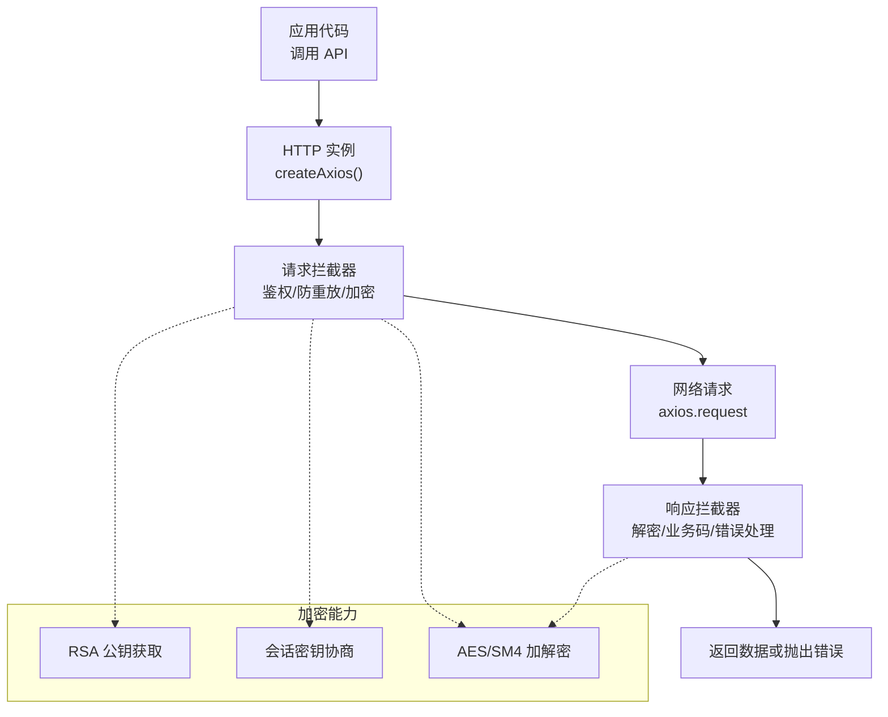
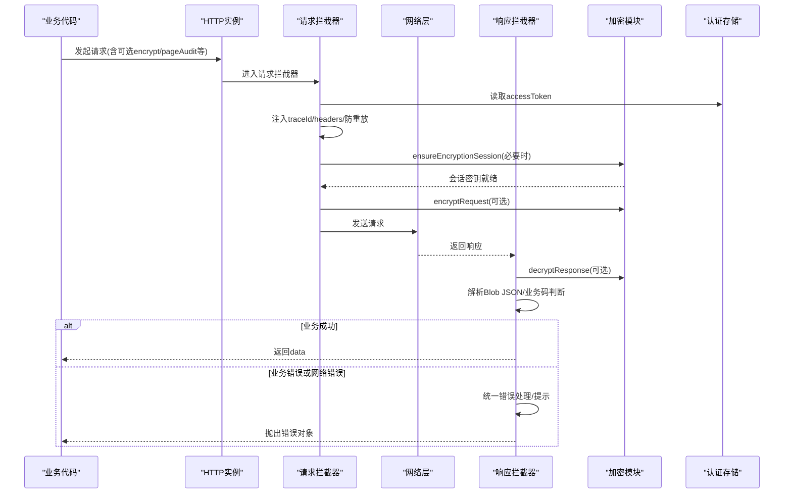
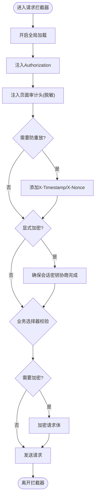
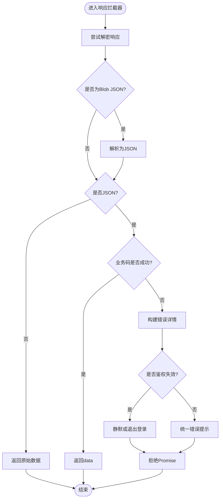
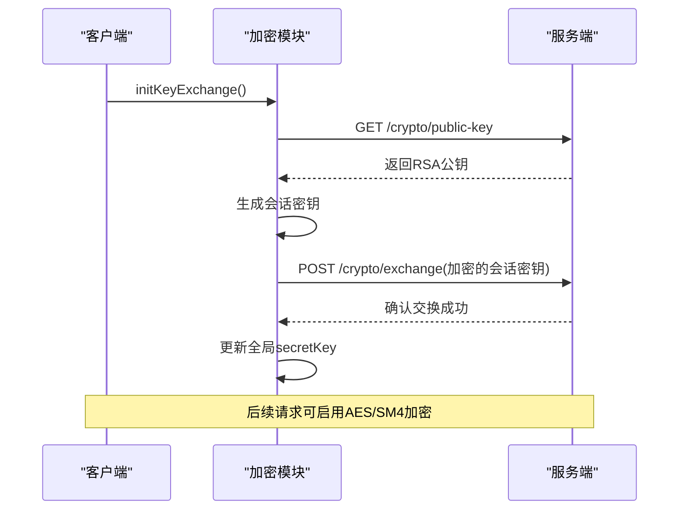
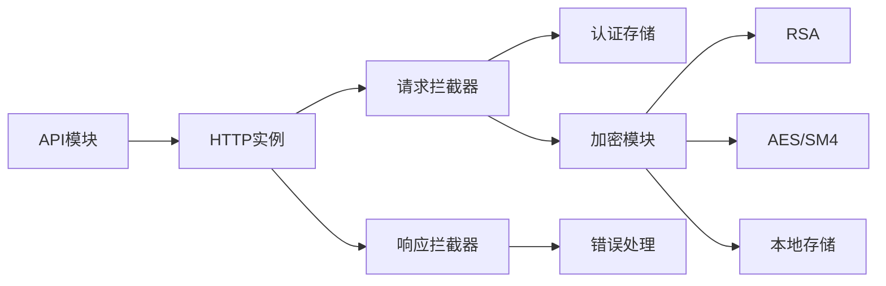

# API客户端

<cite>
**本文引用的文件**
- [index.js](file://forge-admin-ui/src/utils/http/index.js)
- [interceptors.js](file://forge-admin-ui/src/utils/http/interceptors.js)
- [helpers.js](file://forge-admin-ui/src/utils/http/helpers.js)
- [crypto-interceptor.js](file://forge-admin-ui/src/utils/crypto/crypto-interceptor.js)
- [key-exchange.js](file://forge-admin-ui/src/utils/crypto/key-exchange.js)
- [index.js](file://forge-admin-ui/src/utils/crypto/index.js)
- [index.js](file://forge-admin-ui/src/api/index.js)
- [auth-sso.js](file://forge-admin-ui/src/api/auth-sso.js)
- [storage/index.js](file://forge-admin-ui/src/utils/storage/index.js)
</cite>

## 目录
1. [简介](#简介)
2. [项目结构](#项目结构)
3. [核心组件](#核心组件)
4. [架构总览](#架构总览)
5. [详细组件分析](#详细组件分析)
6. [依赖关系分析](#依赖关系分析)
7. [性能考量](#性能考量)
8. [故障排查指南](#故障排查指南)
9. [结论](#结论)
10. [附录](#附录)

## 简介
本技术文档聚焦于 Forge Admin 前端的 API 客户端实现，围绕 HTTP 请求封装、API 接口组织、请求拦截器与响应处理机制展开，系统阐述认证令牌管理、错误处理策略、重试机制与超时控制，并深入解析加密传输、数据脱敏、请求缓存与并发控制等高级特性。同时提供 API 版本管理思路、Mock 数据支持与接口测试方案，以及自定义 API 客户端开发指南和性能优化技巧，帮助开发者高效扩展与维护前端网络层。

## 项目结构
前端 API 客户端基于 Axios 构建，采用“实例创建 + 拦截器”的分层设计：
- HTTP 实例：统一配置 baseURL、超时、并挂载拦截器；提供默认实例、无前缀实例与 Mock 实例。
- 拦截器：负责请求预处理（鉴权、防重放、加密）、响应后处理（解密、业务码校验、错误提示）。
- 加密模块：支持 AES/SM4 算法，动态密钥协商与 RSA 公钥获取，会话密钥持久化与重置。
- 错误处理：统一错误分类、鉴权失效静默处理、用户提示与跳转。
- API 组织：按领域拆分模块，统一通过 request 发起调用，支持按需加载 Mock。

图表来源
- [index.js:4-26](file://forge-admin-ui/src/utils/http/index.js#L4-L26)
- [interceptors.js:294-443](file://forge-admin-ui/src/utils/http/interceptors.js#L294-L443)
- [crypto-interceptor.js:74-149](file://forge-admin-ui/src/utils/crypto/crypto-interceptor.js#L74-L149)
- [key-exchange.js:99-197](file://forge-admin-ui/src/utils/crypto/key-exchange.js#L99-L197)

章节来源
- [index.js:4-26](file://forge-admin-ui/src/utils/http/index.js#L4-L26)
- [interceptors.js:294-443](file://forge-admin-ui/src/utils/http/interceptors.js#L294-L443)

## 核心组件
- HTTP 实例工厂：提供默认、无前缀、Mock 三种 axios 实例，统一设置 baseURL 与超时，并注入拦截器。
- 请求拦截器：注入 traceId、Authorization、页面审计头、防重放参数；在显式加密场景下强制完成密钥协商；对业务选择器请求进行参数校验；执行请求体加密。
- 响应拦截器：先解密再解析 Blob JSON；二进制与非 JSON 直接透传；业务码判断成功/失败；统一错误提示与鉴权失效处理；支持静默鉴权错误。
- 加密模块：支持 AES/SM4；动态密钥协商流程（获取 RSA 公钥 -> 生成会话密钥 -> RSA 加密 -> 交换）；会话密钥本地持久化与重置；登录密码 RSA 加密。
- 错误处理：集中分类网络错误、HTTP 错误、业务错误；鉴权失效时自动退出登录并跳转；支持 needTip 控制是否提示。
- API 组织：按业务域拆分模块，统一通过 request 调用；支持 dev 环境按需引入 Mock 数据。

章节来源
- [index.js:4-26](file://forge-admin-ui/src/utils/http/index.js#L4-L26)
- [interceptors.js:524-590](file://forge-admin-ui/src/utils/http/interceptors.js#L524-L590)
- [interceptors.js:300-443](file://forge-admin-ui/src/utils/http/interceptors.js#L300-L443)
- [crypto-interceptor.js:74-149](file://forge-admin-ui/src/utils/crypto/crypto-interceptor.js#L74-L149)
- [key-exchange.js:128-197](file://forge-admin-ui/src/utils/crypto/key-exchange.js#L128-L197)
- [helpers.js:52-95](file://forge-admin-ui/src/utils/http/helpers.js#L52-L95)
- [index.js:1-37](file://forge-admin-ui/src/api/index.js#L1-L37)

## 架构总览
下图展示一次典型 API 调用的端到端流程，涵盖鉴权、加密协商、请求发送、响应解密与错误处理。

图表来源
- [interceptors.js:524-590](file://forge-admin-ui/src/utils/http/interceptors.js#L524-L590)
- [interceptors.js:300-443](file://forge-admin-ui/src/utils/http/interceptors.js#L300-L443)
- [crypto-interceptor.js:74-149](file://forge-admin-ui/src/utils/crypto/crypto-interceptor.js#L74-L149)
- [key-exchange.js:128-197](file://forge-admin-ui/src/utils/crypto/key-exchange.js#L128-L197)

## 详细组件分析

### HTTP 实例与基础配置
- 默认实例：baseURL 来自环境变量，超时 12s，统一挂载拦截器。
- 无前缀实例：用于登录等不需要 base URL 前缀的请求。
- Mock 实例：baseURL 指向 /mock-api，便于联调与离线开发。
- 导出方式：统一从 utils 暴露，供各 API 模块复用。

章节来源
- [index.js:4-26](file://forge-admin-ui/src/utils/http/index.js#L4-L26)

### 请求拦截器详解
- 全局加载态：进入请求时开启，结束请求时关闭。
- 鉴权头：从认证存储注入 Authorization。
- 页面审计头：根据当前路由与菜单信息注入 X-Page-Path/X-Page-Title，并对敏感查询参数脱敏。
- 防重放：为 GET/HEAD/OPTIONS 之外的请求注入时间戳与随机数，支持排除路径配置。
- 加密协商：当显式要求加密且未持有会话密钥时，触发 RSA 公钥获取与会话密钥协商，禁止明文降级。
- 业务选择器校验：对特定接口强制校验 objectCode 等关键参数，缺失则阻断请求并输出诊断信息。
- 请求体加密：将对象数据序列化为 JSON 并按配置算法加密，替换 data 为信封结构。

图表来源
- [interceptors.js:524-590](file://forge-admin-ui/src/utils/http/interceptors.js#L524-L590)
- [interceptors.js:446-519](file://forge-admin-ui/src/utils/http/interceptors.js#L446-L519)
- [interceptors.js:85-104](file://forge-admin-ui/src/utils/http/interceptors.js#L85-L104)

章节来源
- [interceptors.js:524-590](file://forge-admin-ui/src/utils/http/interceptors.js#L524-L590)
- [interceptors.js:446-519](file://forge-admin-ui/src/utils/http/interceptors.js#L446-L519)
- [interceptors.js:85-104](file://forge-admin-ui/src/utils/http/interceptors.js#L85-L104)

### 响应拦截器与错误处理
- 解密优先：先尝试解密响应体，再解析 Blob JSON，最后再次解密业务数据。
- 二进制透传：下载、图片、附件等二进制响应直接返回，不走业务码判断。
- 非 JSON 透传：非 JSON 响应直接返回原始数据。
- 业务码判断：兼容 code=200 或白名单成功码；否则构造错误详情并统一提示。
- 鉴权失效：识别 401/-8/11007/11008 等错误码，在登出流程或登录页静默处理，否则提示并跳转登录。
- 静默错误：支持 silentAuthError 标记，避免重复弹窗。

图表来源
- [interceptors.js:300-443](file://forge-admin-ui/src/utils/http/interceptors.js#L300-L443)
- [helpers.js:52-95](file://forge-admin-ui/src/utils/http/helpers.js#L52-L95)

章节来源
- [interceptors.js:300-443](file://forge-admin-ui/src/utils/http/interceptors.js#L300-L443)
- [helpers.js:52-95](file://forge-admin-ui/src/utils/http/helpers.js#L52-L95)

### 加密传输与密钥协商
- 算法支持：AES 与 SM4，通过配置切换；请求体与响应体均支持信封格式。
- 动态密钥协商：
  - 获取 RSA 公钥：调用 /crypto/public-key。
  - 生成会话密钥：使用安全随机源生成。
  - RSA 加密会话密钥：用服务端公钥加密。
  - 交换密钥：POST /crypto/exchange，成功后更新全局会话密钥。
- 状态管理：会话密钥与公钥持久化到 localStorage；登出或解密失败时重置。
- 登录密码加密：在启用时通过 RSA 公钥加密密码后再提交。

图表来源
- [key-exchange.js:99-197](file://forge-admin-ui/src/utils/crypto/key-exchange.js#L99-L197)
- [key-exchange.js:239-249](file://forge-admin-ui/src/utils/crypto/key-exchange.js#L239-L249)
- [crypto-interceptor.js:74-149](file://forge-admin-ui/src/utils/crypto/crypto-interceptor.js#L74-L149)

章节来源
- [key-exchange.js:99-197](file://forge-admin-ui/src/utils/crypto/key-exchange.js#L99-L197)
- [key-exchange.js:239-249](file://forge-admin-ui/src/utils/crypto/key-exchange.js#L239-L249)
- [crypto-interceptor.js:74-149](file://forge-admin-ui/src/utils/crypto/crypto-interceptor.js#L74-L149)

### API 接口组织与 Mock 支持
- 模块化组织：按业务域拆分 API 文件，统一通过 request 发起调用，保持调用一致性。
- 环境开关：开发环境下可通过环境变量启用 Mock，按需懒加载 Mock 模块，减少生产包体积。
- 示例：获取菜单接口在 dev 且启用 Mock 时走本地模拟，否则调用真实接口。

章节来源
- [index.js:1-37](file://forge-admin-ui/src/api/index.js#L1-L37)

### 认证令牌管理与会话生命周期
- 令牌注入：请求拦截器从认证存储读取 accessToken 并注入 Authorization。
- 鉴权失效处理：识别多种 401 相关错误码，在登出流程或登录页静默处理，否则提示并跳转登录。
- 会话重置：解密失败或登出时重置密钥交换状态与本地存储，防止脏状态影响后续请求。

章节来源
- [interceptors.js:524-590](file://forge-admin-ui/src/utils/http/interceptors.js#L524-L590)
- [helpers.js:52-95](file://forge-admin-ui/src/utils/http/helpers.js#L52-L95)
- [key-exchange.js:218-231](file://forge-admin-ui/src/utils/crypto/key-exchange.js#L218-L231)

### 数据脱敏与审计
- 页面审计头：注入 X-Page-Path/X-Page-Title，便于后端追踪请求来源。
- 敏感参数脱敏：对 URL 中的 state/code/token 等敏感查询参数进行脱敏处理，避免日志泄露。

章节来源
- [interceptors.js:143-177](file://forge-admin-ui/src/utils/http/interceptors.js#L143-L177)
- [interceptors.js:241-252](file://forge-admin-ui/src/utils/http/interceptors.js#L241-L252)

### 请求缓存与并发控制
- 请求级并发：同一时刻仅允许一次密钥交换，其他请求等待完成，避免并发竞争。
- 缓存建议：对于读多写少的静态资源或字典数据，可在上层封装基于内存或 localStorage 的缓存策略，结合版本号与过期时间管理。
- 限流建议：对高频接口可采用滑动窗口或令牌桶限制并发与频率，降低服务端压力。

章节来源
- [key-exchange.js:128-197](file://forge-admin-ui/src/utils/crypto/key-exchange.js#L128-L197)

### 重试机制与超时控制
- 超时控制：默认超时 12s，可按需覆盖。
- 重试策略：建议在业务层对幂等 GET 请求实现指数退避重试；对写操作谨慎重试，避免重复副作用。
- 幂等性：利用防重放头与业务唯一键保障幂等，配合后端去重逻辑提升可靠性。

章节来源
- [index.js:4-26](file://forge-admin-ui/src/utils/http/index.js#L4-L26)
- [interceptors.js:552-571](file://forge-admin-ui/src/utils/http/interceptors.js#L552-L571)

## 依赖关系分析
- HTTP 实例依赖拦截器，拦截器依赖加密模块与认证存储。
- 加密模块依赖 RSA/AES/SM4 算法实现与本地存储。
- API 模块依赖 HTTP 实例与环境变量控制 Mock。
- 错误处理依赖认证存储与 UI 提示能力。

图表来源
- [index.js:4-26](file://forge-admin-ui/src/utils/http/index.js#L4-L26)
- [interceptors.js:294-443](file://forge-admin-ui/src/utils/http/interceptors.js#L294-L443)
- [crypto-interceptor.js:74-149](file://forge-admin-ui/src/utils/crypto/crypto-interceptor.js#L74-L149)
- [key-exchange.js:99-197](file://forge-admin-ui/src/utils/crypto/key-exchange.js#L99-L197)
- [helpers.js:52-95](file://forge-admin-ui/src/utils/http/helpers.js#L52-L95)

章节来源
- [index.js:4-26](file://forge-admin-ui/src/utils/http/index.js#L4-L26)
- [interceptors.js:294-443](file://forge-admin-ui/src/utils/http/interceptors.js#L294-L443)
- [crypto-interceptor.js:74-149](file://forge-admin-ui/src/utils/crypto/crypto-interceptor.js#L74-L149)
- [key-exchange.js:99-197](file://forge-admin-ui/src/utils/crypto/key-exchange.js#L99-L197)
- [helpers.js:52-95](file://forge-admin-ui/src/utils/http/helpers.js#L52-L95)

## 性能考量
- 连接与超时：合理设置超时与重试，避免长耗时阻塞；对大文件下载使用二进制响应直出。
- 加密开销：仅在必要时启用加密；对高频小请求可考虑批量或合并。
- 缓存策略：对静态数据实施内存/本地缓存，结合版本号与过期时间减少重复请求。
- 并发控制：限制密钥交换并发；对热点接口做限流与熔断。
- 资源体积：按需加载 Mock 与第三方库，减少首屏体积。

## 故障排查指南
- 解密失败：检查密钥是否有效、是否已完成密钥交换；若检测到密钥过期，会自动重置并尝试重新协商。
- 鉴权失效：统一识别多种 401 错误码，在登出流程或登录页静默处理；否则提示并跳转登录。
- 网络错误：无 response 的网络异常会统一提示；检查网络与代理配置。
- 业务错误：根据 code 与 message 定位问题；必要时查看 traceId 与请求详情。
- 调试建议：开启全局加载态观察请求链路；在浏览器控制台查看拦截器日志与错误详情。

章节来源
- [interceptors.js:300-443](file://forge-admin-ui/src/utils/http/interceptors.js#L300-L443)
- [helpers.js:52-95](file://forge-admin-ui/src/utils/http/helpers.js#L52-L95)
- [crypto-interceptor.js:117-149](file://forge-admin-ui/src/utils/crypto/crypto-interceptor.js#L117-L149)
- [key-exchange.js:218-231](file://forge-admin-ui/src/utils/crypto/key-exchange.js#L218-L231)

## 结论
Forge Admin 的 API 客户端以 Axios 为基础，通过拦截器实现了统一的鉴权、加密、错误处理与审计能力；结合动态密钥协商与本地状态管理，保障了敏感数据传输的安全性与一致性。通过模块化 API 组织与 Mock 支持，提升了开发与联调效率。建议在生产环境中结合缓存、限流与重试策略进一步优化性能与稳定性。

## 附录

### 自定义 API 客户端开发指南
- 创建实例：使用 createAxios 创建独立实例，配置 baseURL、超时与选项。
- 挂载拦截器：调用 setupInterceptors 注入通用拦截器；如需定制，可在外部包装一层拦截器链。
- 加密开关：通过 config.encrypt 控制是否加密；通过 shouldEncrypt 匹配路径决定是否加密。
- 错误处理：通过 needTip 控制是否提示；通过 silentAuthError 标记静默鉴权错误。
- 并发与重试：在业务层实现幂等重试；对读请求可叠加缓存层。

章节来源
- [index.js:4-26](file://forge-admin-ui/src/utils/http/index.js#L4-L26)
- [interceptors.js:294-443](file://forge-admin-ui/src/utils/http/interceptors.js#L294-L443)
- [crypto-interceptor.js:74-149](file://forge-admin-ui/src/utils/crypto/crypto-interceptor.js#L74-L149)

### API 版本管理建议
- URL 前缀：通过 baseURL 或路由前缀区分版本，如 /api/v1。
- 兼容性：在拦截器中根据版本进行字段映射与降级处理。
- 灰度发布：结合租户或组织维度进行版本路由与功能开关。

### Mock 数据支持与接口测试方案
- 环境开关：通过环境变量启用 Mock，按需懒加载 Mock 模块。
- 数据隔离：使用独立的 mockRequest 实例，避免污染真实请求。
- 测试用例：针对关键 API 编写单元测试与集成测试，覆盖成功、失败与边界场景。

章节来源
- [index.js:1-37](file://forge-admin-ui/src/api/index.js#L1-L37)
- [index.js:4-26](file://forge-admin-ui/src/utils/http/index.js#L4-L26)

### 存储与密钥持久化
- 本地存储：使用带租户前缀的存储工具，避免多系统冲突。
- 密钥状态：RSA 公钥与会话密钥持久化，登出或异常时清理，保证状态一致。

章节来源
- [storage/index.js:1-83](file://forge-admin-ui/src/utils/storage/index.js#L1-L83)
- [key-exchange.js:26-77](file://forge-admin-ui/src/utils/crypto/key-exchange.js#L26-L77)