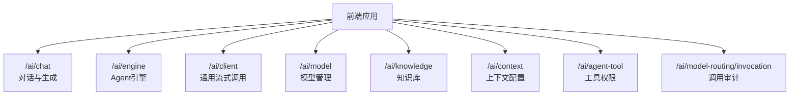
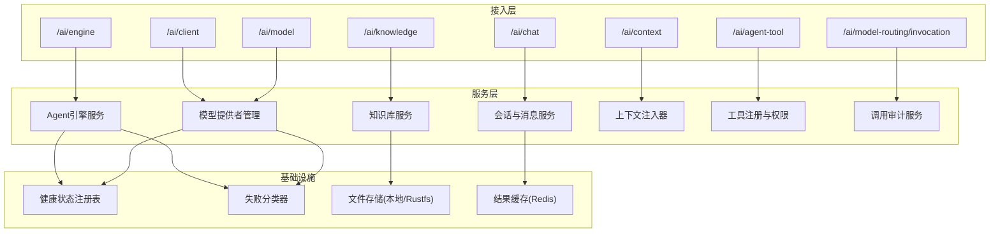
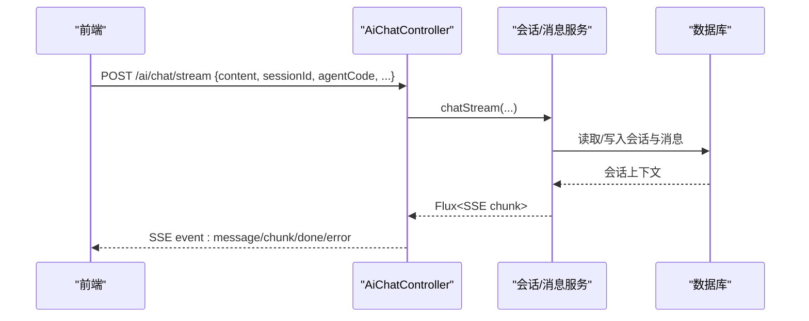
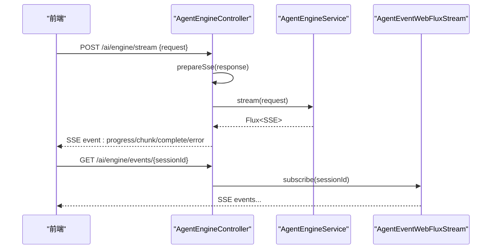
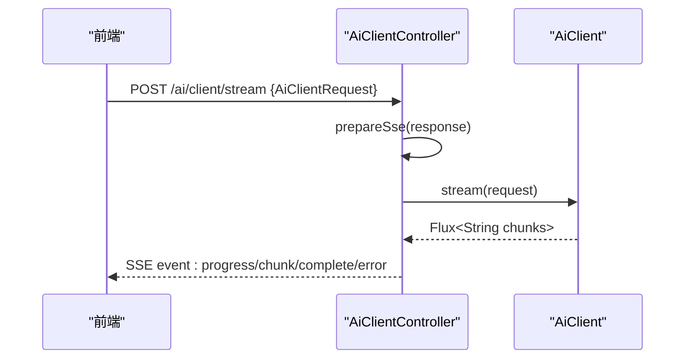
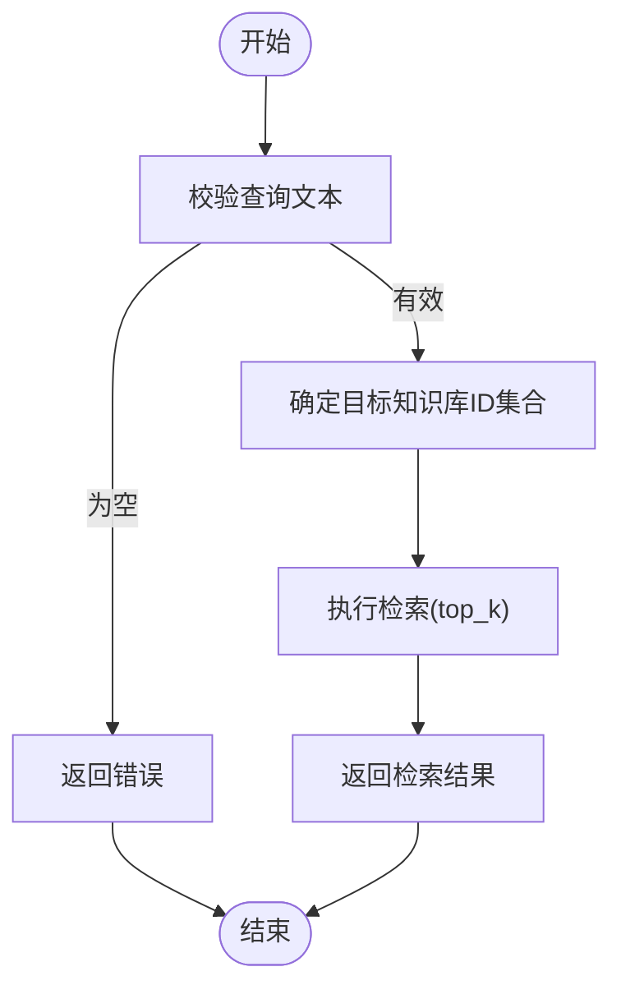
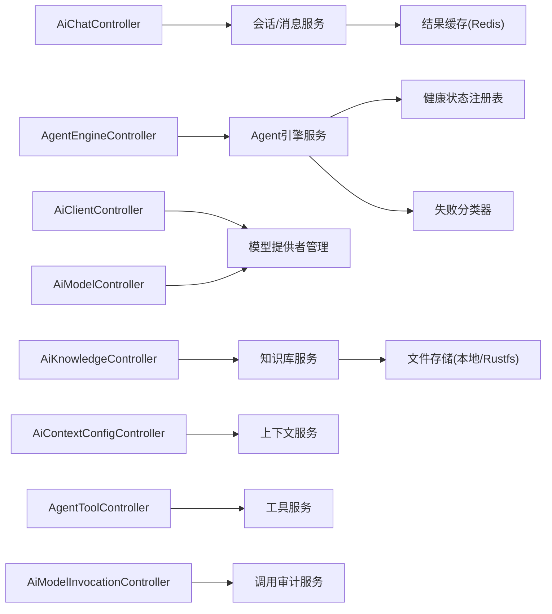
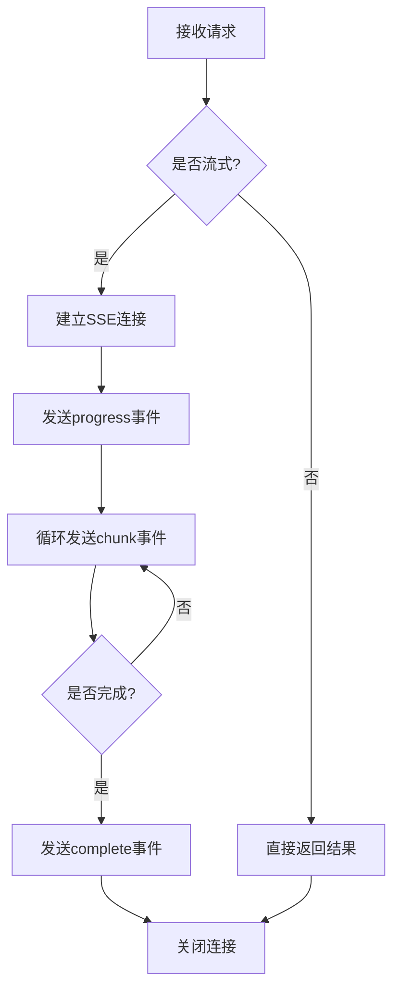

# AI能力API

<cite>
**本文引用的文件**
- [AiChatController.java](file://forge-server/forge-framework/forge-plugin-parent/forge-plugin-ai/src/main/java/com/mdframe/forge/plugin/ai/chat/controller/AiChatController.java)
- [AgentEngineController.java](file://forge-server/forge-framework/forge-plugin-parent/forge-plugin-ai/src/main/java/com/mdframe/forge/plugin/ai/agent/engine/controller/AgentEngineController.java)
- [AiKnowledgeController.java](file://forge-server/forge-framework/forge-plugin-parent/forge-plugin-ai/src/main/java/com/mdframe/forge/plugin/ai/knowledge/controller/AiKnowledgeController.java)
- [AiModelController.java](file://forge-server/forge-framework/forge-plugin-parent/forge-plugin-ai/src/main/java/com/mdframe/forge/plugin/ai/model/controller/AiModelController.java)
- [AiClientController.java](file://forge-server/forge-framework/forge-plugin-parent/forge-plugin-ai/src/main/java/com/mdframe/forge/plugin/ai/client/controller/AiClientController.java)
- [AiModelInvocationController.java](file://forge-server/forge-framework/forge-plugin-parent/forge-plugin-ai/src/main/java/com/mdframe/forge/plugin/ai/invocation/controller/AiModelInvocationController.java)
- [AiContextConfigController.java](file://forge-server/forge-framework/forge-plugin-parent/forge-plugin-ai/src/main/java/com/mdframe/forge/plugin/ai/context/controller/AiContextConfigController.java)
- [AgentToolController.java](file://forge-server/forge-framework/forge-plugin-parent/forge-plugin-ai/src/main/java/com/mdframe/forge/plugin/ai/agenttool/controller/AgentToolController.java)
- [RagSearchTool.java](file://forge-server/forge-framework/forge-plugin-parent/forge-plugin-ai/src/main/java/com/mdframe/forge/plugin/ai/agent/engine/tool/builtin/RagSearchTool.java)
- [ContextInjector.java](file://forge-server/forge-framework/forge-plugin-parent/forge-plugin-ai/src/main/java/com/mdframe/forge/plugin/ai/client/ContextInjector.java)
- [InMemoryAiModelHealthRegistry.java](file://forge-server/forge-framework/forge-plugin-parent/forge-plugin-ai/src/main/java/com/mdframe/forge/plugin/ai/health/InMemoryAiModelHealthRegistry.java)
- [AiModelFailureClassifier.java](file://forge-server/forge-framework/forge-plugin-parent/forge-plugin-ai/src/main/java/com/mdframe/forge/plugin/ai/health/AiModelFailureClassifier.java)
- [LocalFileStorage.java](file://forge-server/forge-framework/forge-starter-parent/forge-starter-file/src/main/java/com/mdframe/forge/starter/file/storage/impl/LocalFileStorage.java)
- [RustfsFileStorage.java](file://forge-server/forge-framework/forge-starter-parent/forge-starter-file/src/main/java/com/mdframe/forge/starter/file/storage/impl/RustfsFileStorage.java)
- [RedisResultCacheServiceTest.java](file://forge-server/forge-framework/forge-starter-parent/forge-starter-idempotent/src/test/java/com/mdframe/forge/starter/idempotent/service/RedisResultCacheServiceTest.java)
- [flow-service-streaming.md](file://forge-admin-ui/src/api/crud-generator.js)
</cite>

## 目录
1. [简介](#简介)
2. [项目结构](#项目结构)
3. [核心组件](#核心组件)
4. [架构总览](#架构总览)
5. [详细组件分析](#详细组件分析)
6. [依赖关系分析](#依赖关系分析)
7. [性能与流式处理](#性能与流式处理)
8. [故障恢复与监控](#故障恢复与监控)
9. [最佳实践](#最佳实践)
10. [附录：接口速查](#附录接口速查)

## 简介
本文件面向AI能力API的使用与集成，覆盖智能体管理、模型路由、会话管理、知识库与工具调用等关键能力；重点说明SSE流式响应、大文件分片上传、异步任务管理与结果缓存；并提供提示词模板、上下文注入与结果缓存的实现要点，以及服务监控、性能优化与故障恢复的最佳实践。

## 项目结构
AI能力以插件化方式组织在“forge-plugin-ai”中，按功能域划分控制器与服务：
- 对话与生成：/ai（聊天、大屏生成）
- Agent引擎：/ai/engine（SSE流式、HITL恢复、事件订阅）
- 客户端直调：/ai/client（通用流式调用封装）
- 模型管理：/ai/model（模型CRUD、连接测试）
- 模型路由与调用审计：/ai/model-routing/invocation（分页与汇总）
- 知识库：/ai/knowledge（文档、分块、检索、进度订阅）
- 上下文配置：/ai/context（规则/SPEC注入）
- 工具权限：/ai/agent-tool（工具绑定与权限）

图表来源
- [AiChatController.java:31-97](file://forge-server/forge-framework/forge-plugin-parent/forge-plugin-ai/src/main/java/com/mdframe/forge/plugin/ai/chat/controller/AiChatController.java#L31-L97)
- [AgentEngineController.java:26-82](file://forge-server/forge-framework/forge-plugin-parent/forge-plugin-ai/src/main/java/com/mdframe/forge/plugin/ai/agent/engine/controller/AgentEngineController.java#L26-L82)
- [AiClientController.java:23-51](file://forge-server/forge-framework/forge-plugin-parent/forge-plugin-ai/src/main/java/com/mdframe/forge/plugin/ai/client/controller/AiClientController.java#L23-L51)
- [AiModelController.java:22-98](file://forge-server/forge-framework/forge-plugin-parent/forge-plugin-ai/src/main/java/com/mdframe/forge/plugin/ai/model/controller/AiModelController.java#L22-L98)
- [AiKnowledgeController.java:25-173](file://forge-server/forge-framework/forge-plugin-parent/forge-plugin-ai/src/main/java/com/mdframe/forge/plugin/ai/knowledge/controller/AiKnowledgeController.java#L25-L173)
- [AiContextConfigController.java:15-45](file://forge-server/forge-framework/forge-plugin-parent/forge-plugin-ai/src/main/java/com/mdframe/forge/plugin/ai/context/controller/AiContextConfigController.java#L15-L45)
- [AgentToolController.java:17-97](file://forge-server/forge-framework/forge-plugin-parent/forge-plugin-ai/src/main/java/com/mdframe/forge/plugin/ai/agenttool/controller/AgentToolController.java#L17-L97)
- [AiModelInvocationController.java:15-33](file://forge-server/forge-framework/forge-plugin-parent/forge-plugin-ai/src/main/java/com/mdframe/forge/plugin/ai/invocation/controller/AiModelInvocationController.java#L15-L33)

章节来源
- [AiChatController.java:31-97](file://forge-server/forge-framework/forge-plugin-parent/forge-plugin-ai/src/main/java/com/mdframe/forge/plugin/ai/chat/controller/AiChatController.java#L31-L97)
- [AgentEngineController.java:26-82](file://forge-server/forge-framework/forge-plugin-parent/forge-plugin-ai/src/main/java/com/mdframe/forge/plugin/ai/agent/engine/controller/AgentEngineController.java#L26-L82)
- [AiClientController.java:23-51](file://forge-server/forge-framework/forge-plugin-parent/forge-plugin-ai/src/main/java/com/mdframe/forge/plugin/ai/client/controller/AiClientController.java#L23-L51)
- [AiModelController.java:22-98](file://forge-server/forge-framework/forge-plugin-parent/forge-plugin-ai/src/main/java/com/mdframe/forge/plugin/ai/model/controller/AiModelController.java#L22-L98)
- [AiKnowledgeController.java:25-173](file://forge-server/forge-framework/forge-plugin-parent/forge-plugin-ai/src/main/java/com/mdframe/forge/plugin/ai/knowledge/controller/AiKnowledgeController.java#L25-L173)
- [AiContextConfigController.java:15-45](file://forge-server/forge-framework/forge-plugin-parent/forge-plugin-ai/src/main/java/com/mdframe/forge/plugin/ai/context/controller/AiContextConfigController.java#L15-L45)
- [AgentToolController.java:17-97](file://forge-server/forge-framework/forge-plugin-parent/forge-plugin-ai/src/main/java/com/mdframe/forge/plugin/ai/agenttool/controller/AgentToolController.java#L17-L97)
- [AiModelInvocationController.java:15-33](file://forge-server/forge-framework/forge-plugin-parent/forge-plugin-ai/src/main/java/com/mdframe/forge/plugin/ai/invocation/controller/AiModelInvocationController.java#L15-L33)

## 核心组件
- 对话与生成：提供非流式与SSE流式两种输出，支持多轮会话上下文与分页消息加载。
- Agent引擎：基于React循环的SSE流式执行，支持中断恢复（HITL）、停止与事件订阅。
- 客户端直调：统一封装模型调用，返回progress/chunk/complete/error事件。
- 模型管理：模型CRUD、启用列表、连接测试。
- 知识库：文档上传、分块、检索、处理进度订阅。
- 上下文配置：为Agent注入编码规范与SPEC上下文，限制长度避免超限。
- 工具权限：Agent可绑定的工具与权限管理。
- 调用审计：模型调用分页查询与汇总统计。

章节来源
- [AiChatController.java:40-97](file://forge-server/forge-framework/forge-plugin-parent/forge-plugin-ai/src/main/java/com/mdframe/forge/plugin/ai/chat/controller/AiChatController.java#L40-L97)
- [AgentEngineController.java:34-71](file://forge-server/forge-framework/forge-plugin-parent/forge-plugin-ai/src/main/java/com/mdframe/forge/plugin/ai/agent/engine/controller/AgentEngineController.java#L34-L71)
- [AiClientController.java:31-51](file://forge-server/forge-framework/forge-plugin-parent/forge-plugin-ai/src/main/java/com/mdframe/forge/plugin/ai/client/controller/AiClientController.java#L31-L51)
- [AiModelController.java:33-98](file://forge-server/forge-framework/forge-plugin-parent/forge-plugin-ai/src/main/java/com/mdframe/forge/plugin/ai/model/controller/AiModelController.java#L33-L98)
- [AiKnowledgeController.java:32-173](file://forge-server/forge-framework/forge-plugin-parent/forge-plugin-ai/src/main/java/com/mdframe/forge/plugin/ai/knowledge/controller/AiKnowledgeController.java#L32-L173)
- [AiContextConfigController.java:24-45](file://forge-server/forge-framework/forge-plugin-parent/forge-plugin-ai/src/main/java/com/mdframe/forge/plugin/ai/context/controller/AiContextConfigController.java#L24-L45)
- [AgentToolController.java:24-97](file://forge-server/forge-framework/forge-plugin-parent/forge-plugin-ai/src/main/java/com/mdframe/forge/plugin/ai/agenttool/controller/AgentToolController.java#L24-L97)
- [AiModelInvocationController.java:23-33](file://forge-server/forge-framework/forge-plugin-parent/forge-plugin-ai/src/main/java/com/mdframe/forge/plugin/ai/invocation/controller/AiModelInvocationController.java#L23-L33)

## 架构总览
AI能力通过分层控制面暴露REST接口，内部由服务层编排，结合健康检查、失败分类、上下文注入与工具调用等横切能力，形成高可用、可观测的AI运行时。

图表来源
- [AiChatController.java:31-97](file://forge-server/forge-framework/forge-plugin-parent/forge-plugin-ai/src/main/java/com/mdframe/forge/plugin/ai/chat/controller/AiChatController.java#L31-L97)
- [AgentEngineController.java:26-82](file://forge-server/forge-framework/forge-plugin-parent/forge-plugin-ai/src/main/java/com/mdframe/forge/plugin/ai/agent/engine/controller/AgentEngineController.java#L26-L82)
- [AiClientController.java:23-51](file://forge-server/forge-framework/forge-plugin-parent/forge-plugin-ai/src/main/java/com/mdframe/forge/plugin/ai/client/controller/AiClientController.java#L23-L51)
- [AiModelController.java:22-98](file://forge-server/forge-framework/forge-plugin-parent/forge-plugin-ai/src/main/java/com/mdframe/forge/plugin/ai/model/controller/AiModelController.java#L22-L98)
- [AiKnowledgeController.java:25-173](file://forge-server/forge-framework/forge-plugin-parent/forge-plugin-ai/src/main/java/com/mdframe/forge/plugin/ai/knowledge/controller/AiKnowledgeController.java#L25-L173)
- [AiContextConfigController.java:15-45](file://forge-server/forge-framework/forge-plugin-parent/forge-plugin-ai/src/main/java/com/mdframe/forge/plugin/ai/context/controller/AiContextConfigController.java#L15-L45)
- [AgentToolController.java:17-97](file://forge-server/forge-framework/forge-plugin-parent/forge-plugin-ai/src/main/java/com/mdframe/forge/plugin/ai/agenttool/controller/AgentToolController.java#L17-L97)
- [AiModelInvocationController.java:15-33](file://forge-server/forge-framework/forge-plugin-parent/forge-plugin-ai/src/main/java/com/mdframe/forge/plugin/ai/invocation/controller/AiModelInvocationController.java#L15-L33)
- [InMemoryAiModelHealthRegistry.java:12-25](file://forge-server/forge-framework/forge-plugin-parent/forge-plugin-ai/src/main/java/com/mdframe/forge/plugin/ai/health/InMemoryAiModelHealthRegistry.java#L12-L25)
- [AiModelFailureClassifier.java:14-22](file://forge-server/forge-framework/forge-plugin-parent/forge-plugin-ai/src/main/java/com/mdframe/forge/plugin/ai/health/AiModelFailureClassifier.java#L14-L22)
- [LocalFileStorage.java:157-188](file://forge-server/forge-framework/forge-starter-parent/forge-starter-file/src/main/java/com/mdframe/forge/starter/file/storage/impl/LocalFileStorage.java#L157-L188)
- [RustfsFileStorage.java:230-261](file://forge-server/forge-framework/forge-starter-parent/forge-starter-file/src/main/java/com/mdframe/forge/starter/file/storage/impl/RustfsFileStorage.java#L230-L261)
- [RedisResultCacheServiceTest.java:135-158](file://forge-server/forge-framework/forge-starter-parent/forge-starter-idempotent/src/test/java/com/mdframe/forge/starter/idempotent/service/RedisResultCacheServiceTest.java#L135-L158)

## 详细组件分析

### 会话管理与对话（/ai）
- 非流式生成：POST /ai/generate，用于一次性生成大屏等长内容。
- 流式生成：POST /ai/generate/stream，SSE事件message/done/error。
- 流式对话：POST /ai/chat/stream，支持sessionId维持多轮上下文，并携带agentCode/providerId/modelName/temperature/maxTokens等参数。
- 会话管理：创建、分页、重命名、置顶、删除；消息分页加载（beforeId）。

图表来源
- [AiChatController.java:54-97](file://forge-server/forge-framework/forge-plugin-parent/forge-plugin-ai/src/main/java/com/mdframe/forge/plugin/ai/chat/controller/AiChatController.java#L54-L97)

章节来源
- [AiChatController.java:40-193](file://forge-server/forge-framework/forge-plugin-parent/forge-plugin-ai/src/main/java/com/mdframe/forge/plugin/ai/chat/controller/AiChatController.java#L40-L193)

### Agent引擎（/ai/engine）
- 流式对话：POST /ai/engine/stream，SSE事件流，服务端关闭缓冲保证逐块下发。
- HITL恢复：POST /ai/engine/resume，用户确认后继续执行。
- 停止：POST /ai/engine/stop，终止当前会话生成。
- 事件订阅：GET /ai/engine/events/{sessionId}，订阅Agent运行事件。

图表来源
- [AgentEngineController.java:34-82](file://forge-server/forge-framework/forge-plugin-parent/forge-plugin-ai/src/main/java/com/mdframe/forge/plugin/ai/agent/engine/controller/AgentEngineController.java#L34-L82)

章节来源
- [AgentEngineController.java:34-82](file://forge-server/forge-framework/forge-plugin-parent/forge-plugin-ai/src/main/java/com/mdframe/forge/plugin/ai/agent/engine/controller/AgentEngineController.java#L34-L82)

### 客户端直调（/ai/client）
- 同步调用：POST /ai/client/call，返回结构化响应。
- 流式调用：POST /ai/client/stream，SSE事件包含progress/chunk/complete/error，便于前端实时渲染。

图表来源
- [AiClientController.java:31-51](file://forge-server/forge-framework/forge-plugin-parent/forge-plugin-ai/src/main/java/com/mdframe/forge/plugin/ai/client/controller/AiClientController.java#L31-L51)

章节来源
- [AiClientController.java:31-93](file://forge-server/forge-framework/forge-plugin-parent/forge-plugin-ai/src/main/java/com/mdframe/forge/plugin/ai/client/controller/AiClientController.java#L31-L93)

### 模型管理（/ai/model）
- 分页/列表/详情：获取模型元数据与视图。
- 新增/修改/删除：通过模型提供者管理器持久化与生效。
- 连接测试：验证模型连通性。

章节来源
- [AiModelController.java:33-98](file://forge-server/forge-framework/forge-plugin-parent/forge-plugin-ai/src/main/java/com/mdframe/forge/plugin/ai/model/controller/AiModelController.java#L33-L98)

### 知识库（/ai/knowledge）
- 知识库CRUD：分页、详情、增删改。
- 文档管理：分页、上传、确认处理、重新处理、查看分块与原始内容、删除。
- 检索调试：按请求检索知识片段。
- 进度订阅：SSE事件流订阅文档处理进度。

章节来源
- [AiKnowledgeController.java:32-173](file://forge-server/forge-framework/forge-plugin-parent/forge-plugin-ai/src/main/java/com/mdframe/forge/plugin/ai/knowledge/controller/AiKnowledgeController.java#L32-L173)

### 上下文注入（/ai/context）
- 列表/新增/更新/删除：维护Agent的编码规范与SPEC上下文。
- 运行时注入：系统提示词拼接时自动注入上下文，并限制最大长度以避免超限。

章节来源
- [AiContextConfigController.java:24-45](file://forge-server/forge-framework/forge-plugin-parent/forge-plugin-ai/src/main/java/com/mdframe/forge/plugin/ai/context/controller/AiContextConfigController.java#L24-L45)
- [ContextInjector.java:22-53](file://forge-server/forge-framework/forge-plugin-parent/forge-plugin-ai/src/main/java/com/mdframe/forge/plugin/ai/client/ContextInjector.java#L22-L53)

### 工具与权限（/ai/agent-tool）
- 工具分页/详情/增删改：管理Agent可用的工具。
- 权限管理：按Agent维度保存/查询/删除工具权限。

章节来源
- [AgentToolController.java:24-97](file://forge-server/forge-framework/forge-plugin-parent/forge-plugin-ai/src/main/java/com/mdframe/forge/plugin/ai/agenttool/controller/AgentToolController.java#L24-L97)

### 调用审计（/ai/model-routing/invocation）
- 分页查询：模型调用日志。
- 汇总统计：聚合指标便于监控与排障。

章节来源
- [AiModelInvocationController.java:23-33](file://forge-server/forge-framework/forge-plugin-parent/forge-plugin-ai/src/main/java/com/mdframe/forge/plugin/ai/invocation/controller/AiModelInvocationController.java#L23-L33)

### 知识库检索工具（RAG）
- 参数Schema：query必填，knowledge_id可选，top_k可选。
- 执行逻辑：优先使用显式传入的知识库ID，否则回退到Agent绑定的知识库集合，执行检索并返回结果。

图表来源
- [RagSearchTool.java:37-77](file://forge-server/forge-framework/forge-plugin-parent/forge-plugin-ai/src/main/java/com/mdframe/forge/plugin/ai/agent/engine/tool/builtin/RagSearchTool.java#L37-L77)

章节来源
- [RagSearchTool.java:37-77](file://forge-server/forge-framework/forge-plugin-parent/forge-plugin-ai/src/main/java/com/mdframe/forge/plugin/ai/agent/engine/tool/builtin/RagSearchTool.java#L37-L77)

## 依赖关系分析
- 控制器之间松耦合，均依赖各自服务层。
- 健康检查与失败分类被Agent引擎与模型调用链路共用，提升鲁棒性。
- 文件存储抽象支持本地与对象存储（如Rustfs），便于扩展。
- 结果缓存通过Redis实现幂等与去重，支撑异步任务与重复请求。

图表来源
- [AiChatController.java:31-97](file://forge-server/forge-framework/forge-plugin-parent/forge-plugin-ai/src/main/java/com/mdframe/forge/plugin/ai/chat/controller/AiChatController.java#L31-L97)
- [AgentEngineController.java:26-82](file://forge-server/forge-framework/forge-plugin-parent/forge-plugin-ai/src/main/java/com/mdframe/forge/plugin/ai/agent/engine/controller/AgentEngineController.java#L26-L82)
- [AiClientController.java:23-51](file://forge-server/forge-framework/forge-plugin-parent/forge-plugin-ai/src/main/java/com/mdframe/forge/plugin/ai/client/controller/AiClientController.java#L23-L51)
- [AiModelController.java:22-98](file://forge-server/forge-framework/forge-plugin-parent/forge-plugin-ai/src/main/java/com/mdframe/forge/plugin/ai/model/controller/AiModelController.java#L22-L98)
- [AiKnowledgeController.java:25-173](file://forge-server/forge-framework/forge-plugin-parent/forge-plugin-ai/src/main/java/com/mdframe/forge/plugin/ai/knowledge/controller/AiKnowledgeController.java#L25-L173)
- [AiContextConfigController.java:15-45](file://forge-server/forge-framework/forge-plugin-parent/forge-plugin-ai/src/main/java/com/mdframe/forge/plugin/ai/context/controller/AiContextConfigController.java#L15-L45)
- [AgentToolController.java:17-97](file://forge-server/forge-framework/forge-plugin-parent/forge-plugin-ai/src/main/java/com/mdframe/forge/plugin/ai/agenttool/controller/AgentToolController.java#L17-L97)
- [AiModelInvocationController.java:15-33](file://forge-server/forge-framework/forge-plugin-parent/forge-plugin-ai/src/main/java/com/mdframe/forge/plugin/ai/invocation/controller/AiModelInvocationController.java#L15-L33)
- [InMemoryAiModelHealthRegistry.java:12-25](file://forge-server/forge-framework/forge-plugin-parent/forge-plugin-ai/src/main/java/com/mdframe/forge/plugin/ai/health/InMemoryAiModelHealthRegistry.java#L12-L25)
- [AiModelFailureClassifier.java:14-22](file://forge-server/forge-framework/forge-plugin-parent/forge-plugin-ai/src/main/java/com/mdframe/forge/plugin/ai/health/AiModelFailureClassifier.java#L14-L22)
- [LocalFileStorage.java:157-188](file://forge-server/forge-framework/forge-starter-parent/forge-starter-file/src/main/java/com/mdframe/forge/starter/file/storage/impl/LocalFileStorage.java#L157-L188)
- [RustfsFileStorage.java:230-261](file://forge-server/forge-framework/forge-starter-parent/forge-starter-file/src/main/java/com/mdframe/forge/starter/file/storage/impl/RustfsFileStorage.java#L230-L261)
- [RedisResultCacheServiceTest.java:135-158](file://forge-server/forge-framework/forge-starter-parent/forge-starter-idempotent/src/test/java/com/mdframe/forge/starter/idempotent/service/RedisResultCacheServiceTest.java#L135-L158)

章节来源
- [InMemoryAiModelHealthRegistry.java:12-25](file://forge-server/forge-framework/forge-plugin-parent/forge-plugin-ai/src/main/java/com/mdframe/forge/plugin/ai/health/InMemoryAiModelHealthRegistry.java#L12-L25)
- [AiModelFailureClassifier.java:14-22](file://forge-server/forge-framework/forge-plugin-parent/forge-plugin-ai/src/main/java/com/mdframe/forge/plugin/ai/health/AiModelFailureClassifier.java#L14-L22)
- [LocalFileStorage.java:157-188](file://forge-server/forge-framework/forge-starter-parent/forge-starter-file/src/main/java/com/mdframe/forge/starter/file/storage/impl/LocalFileStorage.java#L157-L188)
- [RustfsFileStorage.java:230-261](file://forge-server/forge-framework/forge-starter-parent/forge-starter-file/src/main/java/com/mdframe/forge/starter/file/storage/impl/RustfsFileStorage.java#L230-L261)
- [RedisResultCacheServiceTest.java:135-158](file://forge-server/forge-framework/forge-starter-parent/forge-starter-idempotent/src/test/java/com/mdframe/forge/starter/idempotent/service/RedisResultCacheServiceTest.java#L135-L158)

## 性能与流式处理
- SSE流式响应：所有流式接口设置UTF-8编码、Cache-Control:no-cache与X-Accel-Buffering:no，避免代理缓冲导致延迟。
- 事件类型：progress（阶段信息）、chunk（增量内容）、complete（完成）、error（错误），前端可按事件类型渲染。
- 大文件传输：采用分片上传机制，支持断点续传与合并，降低内存占用与失败重试成本。
- 异步任务与结果缓存：通过Redis标记处理中状态与过期策略，避免重复计算与风暴。

图表来源
- [AgentEngineController.java:73-82](file://forge-server/forge-framework/forge-plugin-parent/forge-plugin-ai/src/main/java/com/mdframe/forge/plugin/ai/agent/engine/controller/AgentEngineController.java#L73-L82)
- [AiClientController.java:37-51](file://forge-server/forge-framework/forge-plugin-parent/forge-plugin-ai/src/main/java/com/mdframe/forge/plugin/ai/client/controller/AiClientController.java#L37-L51)
- [LocalFileStorage.java:157-188](file://forge-server/forge-framework/forge-starter-parent/forge-starter-file/src/main/java/com/mdframe/forge/starter/file/storage/impl/LocalFileStorage.java#L157-L188)
- [RustfsFileStorage.java:230-261](file://forge-server/forge-framework/forge-starter-parent/forge-starter-file/src/main/java/com/mdframe/forge/starter/file/storage/impl/RustfsFileStorage.java#L230-L261)
- [RedisResultCacheServiceTest.java:135-158](file://forge-server/forge-framework/forge-starter-parent/forge-starter-idempotent/src/test/java/com/mdframe/forge/starter/idempotent/service/RedisResultCacheServiceTest.java#L135-L158)

章节来源
- [AgentEngineController.java:73-82](file://forge-server/forge-framework/forge-plugin-parent/forge-plugin-ai/src/main/java/com/mdframe/forge/plugin/ai/agent/engine/controller/AgentEngineController.java#L73-L82)
- [AiClientController.java:37-51](file://forge-server/forge-framework/forge-plugin-parent/forge-plugin-ai/src/main/java/com/mdframe/forge/plugin/ai/client/controller/AiClientController.java#L37-L51)
- [LocalFileStorage.java:157-188](file://forge-server/forge-framework/forge-starter-parent/forge-starter-file/src/main/java/com/mdframe/forge/starter/file/storage/impl/LocalFileStorage.java#L157-L188)
- [RustfsFileStorage.java:230-261](file://forge-server/forge-framework/forge-starter-parent/forge-starter-file/src/main/java/com/mdframe/forge/starter/file/storage/impl/RustfsFileStorage.java#L230-L261)
- [RedisResultCacheServiceTest.java:135-158](file://forge-server/forge-framework/forge-starter-parent/forge-starter-idempotent/src/test/java/com/mdframe/forge/starter/idempotent/service/RedisResultCacheServiceTest.java#L135-L158)

## 故障恢复与监控
- 健康状态：基于内存注册表维护模型健康快照，支持半开探测与阈值判定。
- 失败分类：对网络超时、内容策略拦截等异常进行分类，便于上层差异化处理。
- 调用审计：分页与汇总接口用于监控调用量、错误率与耗时分布。
- 建议：结合外部监控系统采集SSE事件计数、错误事件比例与分片上传成功率。

章节来源
- [InMemoryAiModelHealthRegistry.java:12-25](file://forge-server/forge-framework/forge-plugin-parent/forge-plugin-ai/src/main/java/com/mdframe/forge/plugin/ai/health/InMemoryAiModelHealthRegistry.java#L12-L25)
- [AiModelFailureClassifier.java:14-22](file://forge-server/forge-framework/forge-plugin-parent/forge-plugin-ai/src/main/java/com/mdframe/forge/plugin/ai/health/AiModelFailureClassifier.java#L14-L22)
- [AiModelInvocationController.java:23-33](file://forge-server/forge-framework/forge-plugin-parent/forge-plugin-ai/src/main/java/com/mdframe/forge/plugin/ai/invocation/controller/AiModelInvocationController.java#L23-L33)

## 最佳实践
- 流式响应
  - 始终使用SSE事件类型区分进度、增量、完成与错误，前端按事件处理。
  - 确保服务端设置正确的SSE头部，避免代理缓冲。
- 大文件传输
  - 采用分片上传，记录uploadId与分片ETag，完成后合并。
  - 失败重试需幂等，避免重复分片。
- 异步任务与缓存
  - 使用Redis标记“处理中”，设置合理过期时间，防止僵尸任务。
  - 对相同请求进行去重，减少下游压力。
- 提示词与上下文
  - 将编码规范与SPEC上下文作为独立配置项，按Agent维度注入。
  - 限制上下文长度，避免超出模型窗口。
- 监控与排障
  - 开启调用审计，关注错误分类与失败率。
  - 对健康状态变化进行告警，快速定位问题模型。

[本节为通用指导，不直接分析具体文件]

## 附录：接口速查
- 对话与生成
  - POST /ai/generate：非流式生成
  - POST /ai/generate/stream：SSE流式生成
  - POST /ai/chat/stream：SSE流式对话
  - GET /ai/session/list：会话列表
  - GET /ai/session/page：会话分页
  - POST /ai/session：创建会话
  - PUT /ai/session/{sessionId}：重命名
  - GET /ai/session/{sessionId}/messages：消息列表
  - GET /ai/session/{sessionId}/messages/page：消息分页
  - DELETE /ai/message/{recordId}：删除消息
  - PUT /ai/session/{sessionId}/pin：置顶/取消置顶
  - DELETE /ai/session/{sessionId}：删除会话
- Agent引擎
  - POST /ai/engine/stream：SSE流式对话
  - POST /ai/engine/resume：HITL恢复
  - POST /ai/engine/stop：停止
  - GET /ai/engine/events/{sessionId}：事件订阅
- 客户端直调
  - POST /ai/client/call：同步调用
  - POST /ai/client/stream：SSE流式调用
- 模型管理
  - GET /ai/model/page：分页
  - GET /ai/model/list：下拉列表
  - GET /ai/model/{id}：详情
  - POST /ai/model：新增
  - PUT /ai/model：修改
  - DELETE /ai/model/{id}：删除
  - POST /ai/model/{id}/test：连接测试
- 知识库
  - GET /ai/knowledge/page：分页
  - GET /ai/knowledge/{id}：详情
  - POST /ai/knowledge：新增
  - PUT /ai/knowledge：修改
  - DELETE /ai/knowledge/{id}：删除
  - GET /ai/knowledge/document/page：文档分页
  - POST /ai/knowledge/document/upload：上传文档
  - POST /ai/knowledge/document/{documentId}/confirm：确认处理
  - POST /ai/knowledge/document/{documentId}/reprocess：重新处理
  - GET /ai/knowledge/document/{documentId}/chunks：分块列表
  - GET /ai/knowledge/document/{documentId}/content：原始内容
  - DELETE /ai/knowledge/document/{documentId}：删除文档
  - GET /ai/knowledge/document/{documentId}/progress：进度订阅
  - POST /ai/knowledge/search：检索
- 上下文配置
  - GET /ai/context/list：按Agent列出
  - POST /ai/context/add：新增
  - PUT /ai/context/update：更新
  - DELETE /ai/context/{id}：删除
- 工具权限
  - GET /ai/agent-tool/page：分页
  - GET /ai/agent-tool/{id}：详情
  - POST /ai/agent-tool：新增
  - PUT /ai/agent-tool：修改
  - DELETE /ai/agent-tool/{id}：删除
  - GET /ai/agent-tool/permission/{agentId}：查询权限
  - POST /ai/agent-tool/permission/{agentId}：保存权限
  - DELETE /ai/agent-tool/permission/{agentId}：删除权限
- 调用审计
  - GET /ai/model-routing/invocation/page：分页
  - GET /ai/model-routing/invocation/summary：汇总

章节来源
- [AiChatController.java:40-193](file://forge-server/forge-framework/forge-plugin-parent/forge-plugin-ai/src/main/java/com/mdframe/forge/plugin/ai/chat/controller/AiChatController.java#L40-L193)
- [AgentEngineController.java:34-82](file://forge-server/forge-framework/forge-plugin-parent/forge-plugin-ai/src/main/java/com/mdframe/forge/plugin/ai/agent/engine/controller/AgentEngineController.java#L34-L82)
- [AiClientController.java:31-93](file://forge-server/forge-framework/forge-plugin-parent/forge-plugin-ai/src/main/java/com/mdframe/forge/plugin/ai/client/controller/AiClientController.java#L31-L93)
- [AiModelController.java:33-98](file://forge-server/forge-framework/forge-plugin-parent/forge-plugin-ai/src/main/java/com/mdframe/forge/plugin/ai/model/controller/AiModelController.java#L33-L98)
- [AiKnowledgeController.java:32-173](file://forge-server/forge-framework/forge-plugin-parent/forge-plugin-ai/src/main/java/com/mdframe/forge/plugin/ai/knowledge/controller/AiKnowledgeController.java#L32-L173)
- [AiContextConfigController.java:24-45](file://forge-server/forge-framework/forge-plugin-parent/forge-plugin-ai/src/main/java/com/mdframe/forge/plugin/ai/context/controller/AiContextConfigController.java#L24-L45)
- [AgentToolController.java:24-97](file://forge-server/forge-framework/forge-plugin-parent/forge-plugin-ai/src/main/java/com/mdframe/forge/plugin/ai/agenttool/controller/AgentToolController.java#L24-L97)
- [AiModelInvocationController.java:23-33](file://forge-server/forge-framework/forge-plugin-parent/forge-plugin-ai/src/main/java/com/mdframe/forge/plugin/ai/invocation/controller/AiModelInvocationController.java#L23-L33)