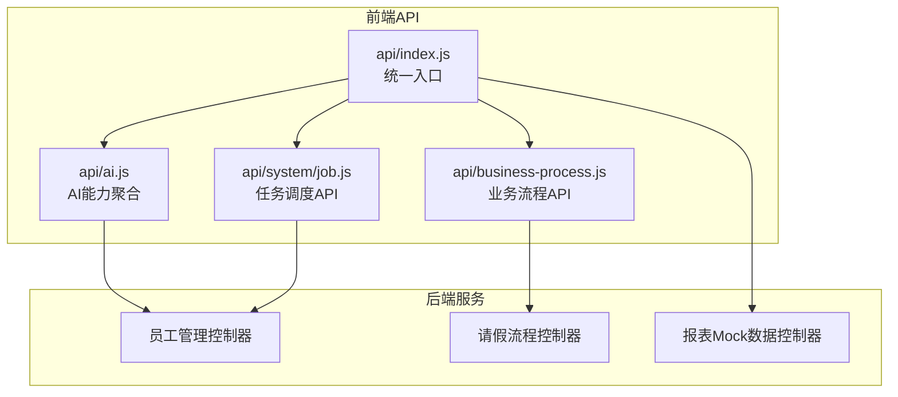
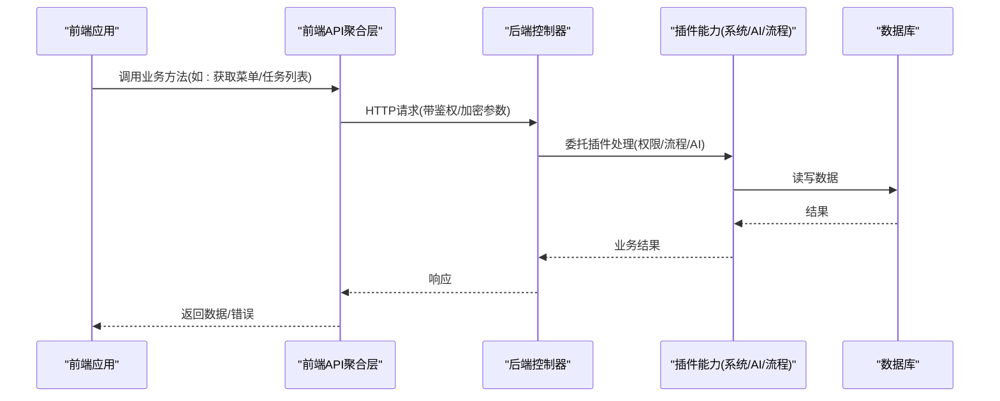
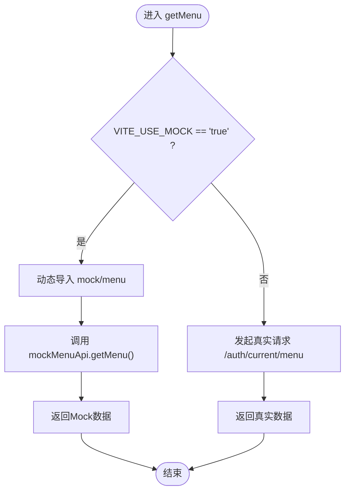
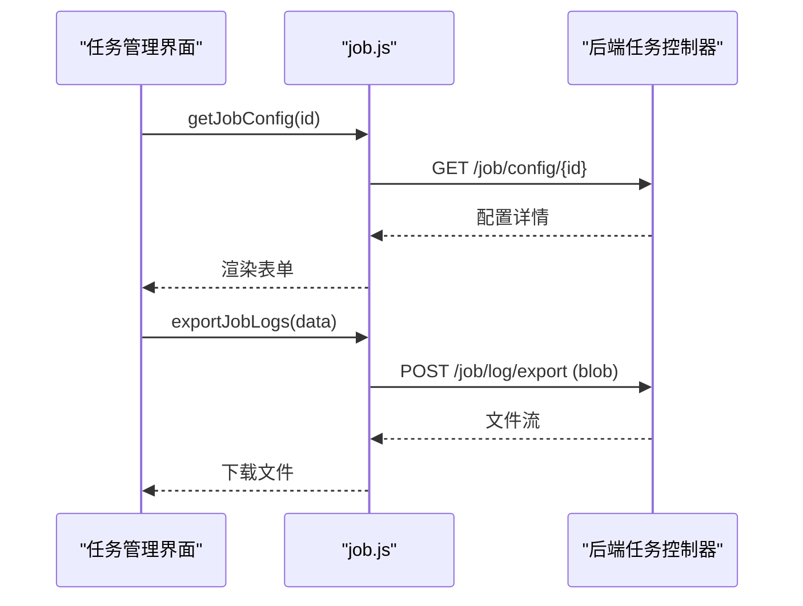
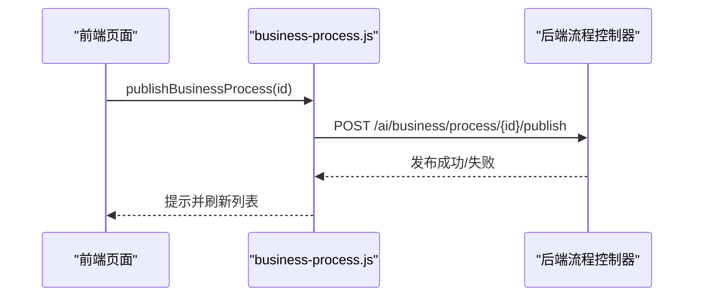
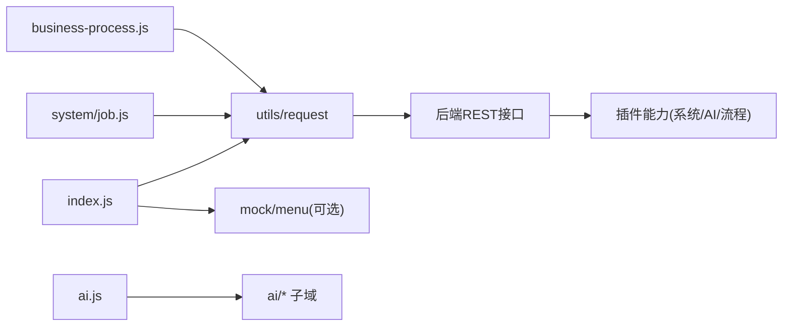

# API模块组织

<cite>
**本文引用的文件**
- [README.md](file://README.md)
- [index.js](file://forge-admin-ui/src/api/index.js)
- [ai.js](file://forge-admin-ui/src/api/ai.js)
- [job.js](file://forge-admin-ui/src/api/system/job.js)
- [business-process.js](file://forge-admin-ui/src/api/business-process.js)
- [EmployeeController.java](file://forge-server/forge-admin-server/src/main/java/com/mdframe/forge/employee/controller/EmployeeController.java)
- [LeaveRequestController.java](file://forge-server/forge-admin-server/src/main/java/com/mdframe/forge/leave/controller/LeaveRequestController.java)
- [ReportMockDataController.java](file://forge-server/forge-admin-server/src/main/java/com/mdframe/forge/mock/controller/ReportMockDataController.java)
</cite>

## 目录
1. [简介](#简介)
2. [项目结构](#项目结构)
3. [核心组件](#核心组件)
4. [架构总览](#架构总览)
5. [详细组件分析](#详细组件分析)
6. [依赖关系分析](#依赖关系分析)
7. [性能考虑](#性能考虑)
8. [故障排查指南](#故障排查指南)
9. [结论](#结论)
10. [附录](#附录)

## 简介
本技术文档聚焦于 Forge Admin 的 API 模块组织方式，围绕“按业务领域划分”的前端 API 聚合、接口命名规范与版本管理策略展开。文档同时覆盖系统管理、AI 能力、数据管理等模块的 API 设计模式，解释接口聚合、依赖注入与模块化加载机制，并给出 Mock 数据支持、接口测试用例与 API 文档自动生成的实践建议，最后提供新模块开发指南与最佳实践规范。

## 项目结构
前端 API 采用“按领域分目录 + 统一聚合导出”的组织方式：
- 领域目录：如 ai、system、data、business 等，每个目录内按子域拆分具体接口文件。
- 聚合入口：顶层 index.js 作为全局聚合入口，集中暴露认证、租户、组织切换等通用能力，并支持开发期按需动态加载 Mock。
- 后端服务：以 Spring Boot 多模块形式组织，控制器集中在各业务包下（如 employee、leave、mock），并通过插件体系（AI、流程、系统、数据等）对外暴露 REST 接口。

图表来源
- [index.js:1-37](file://forge-admin-ui/src/api/index.js#L1-L37)
- [ai.js:1-13](file://forge-admin-ui/src/api/ai.js#L1-L13)
- [job.js:1-77](file://forge-admin-ui/src/api/system/job.js#L1-L77)
- [business-process.js:1-92](file://forge-admin-ui/src/api/business-process.js#L1-L92)
- [EmployeeController.java](file://forge-server/forge-admin-server/src/main/java/com/mdframe/forge/employee/controller/EmployeeController.java)
- [LeaveRequestController.java](file://forge-server/forge-admin-server/src/main/java/com/mdframe/forge/leave/controller/LeaveRequestController.java)
- [ReportMockDataController.java](file://forge-server/forge-admin-server/src/main/java/com/mdframe/forge/mock/controller/ReportMockDataController.java)

章节来源
- [README.md:241-259](file://README.md#L241-L259)
- [index.js:1-37](file://forge-admin-ui/src/api/index.js#L1-L37)

## 核心组件
- 统一入口与模块化加载
  - 通过 index.js 暴露通用能力（用户信息、菜单、租户/组织切换），并在开发环境根据环境变量动态导入 Mock 实现，实现“按需加载、可插拔”。
- AI 能力聚合
  - ai.js 将智能体、供应商、模型路由、会话、上下文、低代码、媒体、技能、知识库、引擎等子域接口统一再导出，便于上层按领域消费。
- 系统管理 API
  - system/job.js 封装了任务配置、执行器、时区、监控、日志导出、Cron 预览、API Token 管理等接口，体现“资源型 URL + 动词化操作”的设计。
- 业务流程 API
  - business-process.js 围绕“业务流程”这一领域，提供分页查询、详情、创建、复制、更新、设计器、校验、发布、状态变更、运行实例、重试、取消等完整生命周期接口。

章节来源
- [index.js:1-37](file://forge-admin-ui/src/api/index.js#L1-L37)
- [ai.js:1-13](file://forge-admin-ui/src/api/ai.js#L1-L13)
- [job.js:1-77](file://forge-admin-ui/src/api/system/job.js#L1-L77)
- [business-process.js:1-92](file://forge-admin-ui/src/api/business-process.js#L1-L92)

## 架构总览
前后端通过 RESTful 风格交互，前端按领域组织 API 调用，后端以控制器为边界暴露能力；平台通过插件体系组合系统、AI、流程、数据等能力，形成可扩展的服务边界。

图表来源
- [index.js:1-37](file://forge-admin-ui/src/api/index.js#L1-L37)
- [job.js:1-77](file://forge-admin-ui/src/api/system/job.js#L1-L77)
- [business-process.js:1-92](file://forge-admin-ui/src/api/business-process.js#L1-L92)
- [EmployeeController.java](file://forge-server/forge-admin-server/src/main/java/com/mdframe/forge/employee/controller/EmployeeController.java)
- [LeaveRequestController.java](file://forge-server/forge-admin-server/src/main/java/com/mdframe/forge/leave/controller/LeaveRequestController.java)

## 详细组件分析

### 统一入口与模块化加载（index.js）
- 职责
  - 统一暴露认证、菜单、租户/组织切换等基础能力。
  - 在开发环境根据 VITE_USE_MOCK 决定是否使用本地 Mock 数据。
- 关键行为
  - 条件判断是否启用 Mock，并动态 import 对应模块，避免生产环境引入多余代码。
  - 对菜单、租户、组织等高频能力进行集中封装，降低调用方复杂度。

图表来源
- [index.js:1-37](file://forge-admin-ui/src/api/index.js#L1-L37)

章节来源
- [index.js:1-37](file://forge-admin-ui/src/api/index.js#L1-L37)

### AI 能力聚合（ai.js）
- 职责
  - 将 AI 相关子域（智能体、供应商、模型路由、会话、上下文、低代码、媒体、技能、知识库、引擎）统一再导出，供上层按领域消费。
- 设计模式
  - 聚合导出：减少上层 import 路径复杂度，便于统一治理与替换。
  - 领域内聚：每个子域独立文件，职责清晰，便于扩展与维护。

章节来源
- [ai.js:1-13](file://forge-admin-ui/src/api/ai.js#L1-L13)

### 系统管理：任务调度 API（system/job.js）
- 职责
  - 封装任务配置、执行器、时区、监控、日志导出、Cron 预览、API Token 管理等接口。
- 命名规范
  - 资源型 URL：/job/config、/job/log、/job/api-token 等。
  - 动词化操作：create/update/export/revoke/rotate 等。
- 安全与传输
  - 敏感参数使用加密传输（encrypt: true）。
  - 大对象导出使用 blob 响应类型，避免 JSON 体积过大导致解析失败。

图表来源
- [job.js:1-77](file://forge-admin-ui/src/api/system/job.js#L1-L77)

章节来源
- [job.js:1-77](file://forge-admin-ui/src/api/system/job.js#L1-L77)

### 业务流程 API（business-process.js）
- 职责
  - 提供业务流程从建模到运行的全生命周期接口：分页、详情、创建、复制、更新、设计器、校验、发布、状态变更、运行实例、重试、取消等。
- 设计模式
  - 资源+动作：/ai/business/process 为核心资源，配合 /validate、/publish、/status、/runtime/* 等动作。
  - 加密传输：对敏感参数统一使用 encrypt: true 或 postEncrypt。
- 典型调用序列

图表来源
- [business-process.js:1-92](file://forge-admin-ui/src/api/business-process.js#L1-L92)

章节来源
- [business-process.js:1-92](file://forge-admin-ui/src/api/business-process.js#L1-L92)

### 后端控制器与插件边界
- 控制器示例
  - 员工管理、请假流程、报表 Mock 数据等控制器分别位于各自业务包中，体现“按领域划分”的后端组织。
- 插件体系
  - 系统、AI、流程、数据等能力以插件形式提供，应用服务聚合插件并对外暴露接口，保证高内聚、低耦合。

章节来源
- [EmployeeController.java](file://forge-server/forge-admin-server/src/main/java/com/mdframe/forge/employee/controller/EmployeeController.java)
- [LeaveRequestController.java](file://forge-server/forge-admin-server/src/main/java/com/mdframe/forge/leave/controller/LeaveRequestController.java)
- [ReportMockDataController.java](file://forge-server/forge-admin-server/src/main/java/com/mdframe/forge/mock/controller/ReportMockDataController.java)
- [README.md:489-499](file://README.md#L489-L499)

## 依赖关系分析
- 前端依赖
  - 统一入口 index.js 依赖 utils/request 进行网络请求，并可选依赖 Mock 模块。
  - 各领域 API 文件仅关注自身资源与动作，不直接感知底层网络细节。
- 后端依赖
  - 控制器依赖服务层与插件能力，服务层负责事务、校验、编排等逻辑。
  - 插件之间通过明确接口契约协作，避免循环依赖。

图表来源
- [index.js:1-37](file://forge-admin-ui/src/api/index.js#L1-L37)
- [ai.js:1-13](file://forge-admin-ui/src/api/ai.js#L1-L13)
- [job.js:1-77](file://forge-admin-ui/src/api/system/job.js#L1-L77)
- [business-process.js:1-92](file://forge-admin-ui/src/api/business-process.js#L1-L92)

章节来源
- [index.js:1-37](file://forge-admin-ui/src/api/index.js#L1-L37)
- [ai.js:1-13](file://forge-admin-ui/src/api/ai.js#L1-L13)
- [job.js:1-77](file://forge-admin-ui/src/api/system/job.js#L1-L77)
- [business-process.js:1-92](file://forge-admin-ui/src/api/business-process.js#L1-L92)

## 性能考虑
- 按需加载
  - 开发期通过环境变量控制 Mock 的动态导入，避免生产环境引入无关代码。
- 传输优化
  - 大对象导出使用二进制流（blob）响应，避免 JSON 解析开销。
  - 敏感参数加密传输，减少明文泄露风险的同时不影响性能。
- 缓存与幂等
  - 读多写少场景建议结合后端缓存；写操作需保证幂等，避免重复提交造成副作用。

## 故障排查指南
- 常见问题定位
  - 前端请求失败：检查代理配置与后端端口是否正确。
  - Mock 未生效：确认开发环境变量是否开启，以及动态导入路径是否正确。
  - 大文件导出异常：确认响应类型为 blob，且前端正确处理二进制流。
- 建议排查步骤
  - 查看浏览器 Network 面板的请求与响应。
  - 在后端日志中搜索对应接口关键字，定位服务层与插件层异常。
  - 对于流程类接口，优先检查流程模型版本与发布状态。

章节来源
- [README.md:502-514](file://README.md#L502-L514)
- [job.js:43-52](file://forge-admin-ui/src/api/system/job.js#L43-L52)

## 结论
本项目采用“按业务领域划分”的 API 模块组织方式，前端通过聚合入口与子域文件解耦，后端通过插件体系组合系统、AI、流程、数据等能力。统一的命名规范、加密传输与按需加载机制，使系统在可维护性、可扩展性与安全性方面具备良好基础。建议在新增模块时遵循本文档的规范与实践，确保一致性与可演进性。

## 附录

### 接口命名规范与版本管理策略
- 命名规范
  - 资源型 URL：以名词复数表示资源，如 /job/config、/ai/business/process。
  - 动词化操作：通过路径或方法区分动作，如 /validate、/publish、/status。
  - 参数传递：复杂或敏感参数使用加密传输（encrypt: true）。
- 版本管理
  - 建议通过 URL 前缀或请求头进行版本控制（如 /v1/...），保持向后兼容。
  - 数据库迁移脚本遵循 Flyway 版本化规范，确保可回滚与可追溯。

章节来源
- [job.js:1-77](file://forge-admin-ui/src/api/system/job.js#L1-L77)
- [business-process.js:1-92](file://forge-admin-ui/src/api/business-process.js#L1-L92)
- [README.md:315-334](file://README.md#L315-L334)

### Mock 数据支持与接口测试
- Mock 支持
  - 通过环境变量控制是否启用 Mock，并在开发期动态导入对应模块，避免污染生产构建。
- 接口测试
  - 可在前端使用单元测试框架对 API 调用进行断言，验证请求参数、响应结构与错误分支。
  - 后端可对控制器与服务层编写集成测试，覆盖正常与异常路径。

章节来源
- [index.js:1-37](file://forge-admin-ui/src/api/index.js#L1-L37)

### API 文档自动生成
- 建议方案
  - 后端使用 OpenAPI/Swagger 注解生成接口文档，统一描述请求/响应格式、错误码与安全要求。
  - 前端可通过约定式注释或类型定义辅助生成客户端 SDK，提升前后端协作效率。

[本节为通用实践建议，不直接引用具体文件]

### 新模块开发指南与最佳实践
- 前端
  - 新建领域目录与文件，遵循“资源+动作”的 URL 设计。
  - 在聚合入口按需导出，保持调用方简洁。
  - 对敏感参数使用加密传输，对大对象导出使用 blob。
- 后端
  - 控制器按领域划分，服务层承载业务逻辑，插件间通过接口契约协作。
  - 遵循幂等与事务原则，完善异常处理与日志记录。
- 质量保障
  - 编写单元与集成测试，覆盖关键路径与异常分支。
  - 使用静态检查与代码规范工具，保证一致性。

[本节为通用实践建议，不直接引用具体文件]