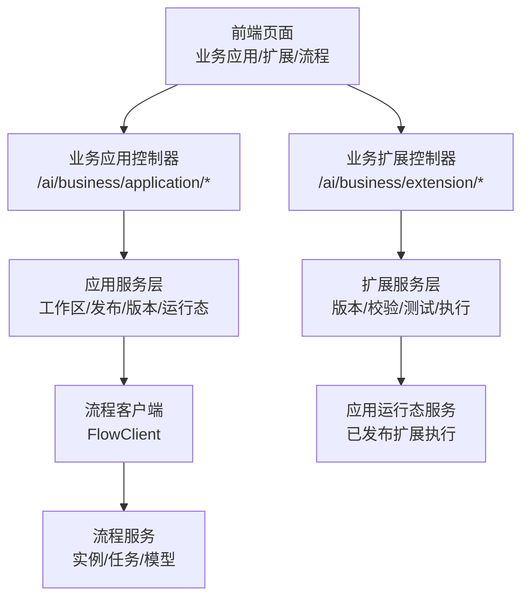
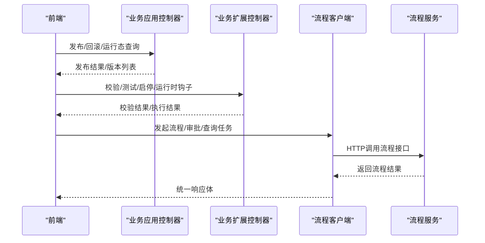
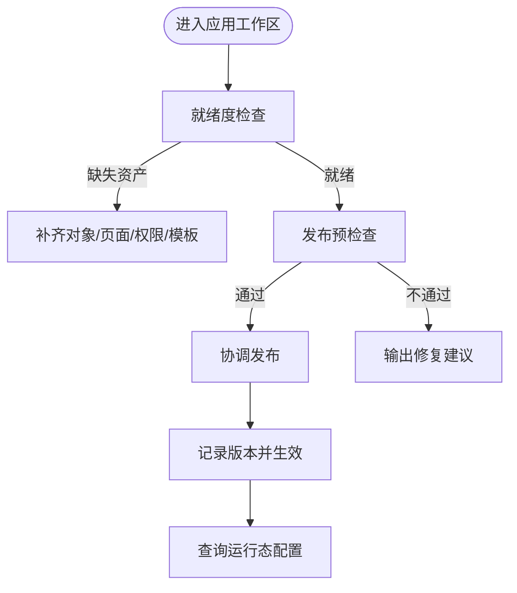
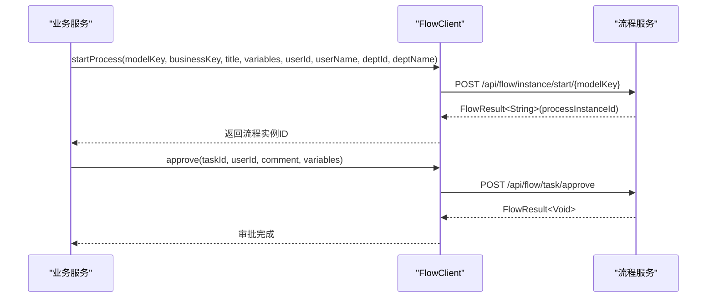
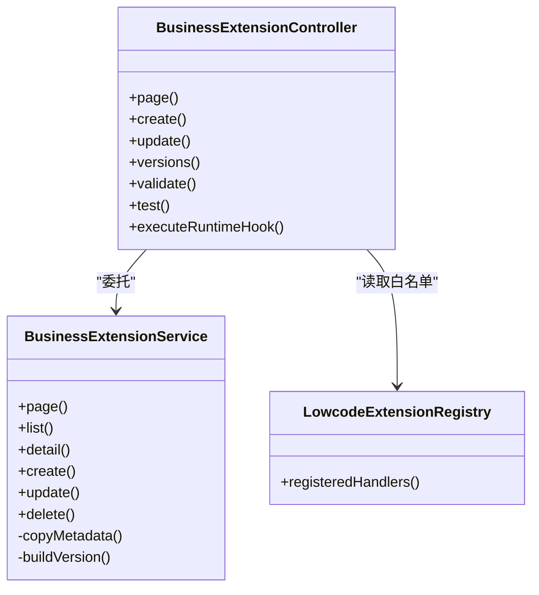
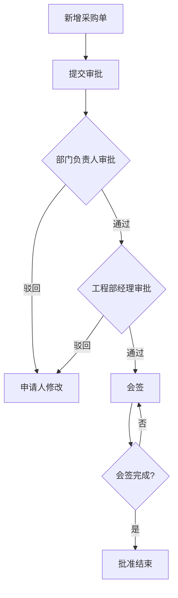
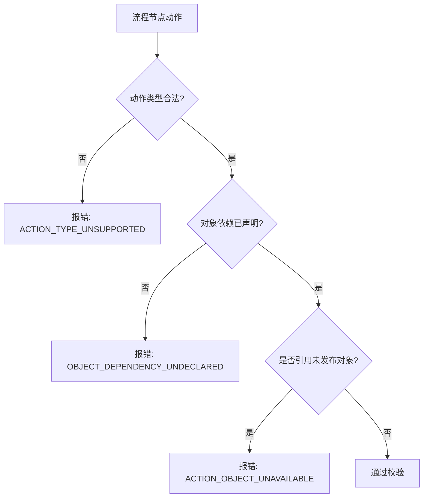
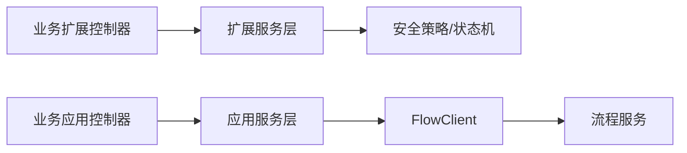

# 业务应用API

<cite>
**本文引用的文件**
- [README.md](file://README.md)
- [BusinessApplicationController.java](file://forge-server/forge-framework/forge-plugin-parent/forge-plugin-generator/src/main/java/com/mdframe/forge/plugin/generator/controller/BusinessApplicationController.java)
- [BusinessExtensionController.java](file://forge-server/forge-framework/forge-plugin-parent/forge-plugin-generator/src/main/java/com/mdframe/forge/plugin/generator/controller/BusinessExtensionController.java)
- [BusinessExtensionService.java](file://forge-server/forge-framework/forge-plugin-parent/forge-plugin-generator/src/main/java/com/mdframe/forge/plugin/generator/service/businessapp/BusinessExtensionService.java)
- [FlowClient.java](file://forge-server/forge-flow/forge-flow-client/src/main/java/com/mdframe/forge/flow/client/FlowClient.java)
- [SamplePurchaseOrderController.java](file://forge-server/forge-business/forge-business-core/src/main/java/com/mdframe/forge/business/core/purchase/controller/SamplePurchaseOrderController.java)
- [SamplePurchaseOrderService.java](file://forge-server/forge-business/forge-business-core/src/main/java/com/mdframe/forge/business/core/purchase/service/SamplePurchaseOrderService.java)
- [SamplePurchaseOrderFlowDefinition.java](file://forge-server/forge-business/forge-business-core/src/main/java/com/mdframe/forge/business/core/purchase/support/SamplePurchaseOrderFlowDefinition.java)
- [business-extension.js](file://forge-admin-ui/src/api/business-extension.js)
</cite>

## 目录
1. [简介](#简介)
2. [项目结构](#项目结构)
3. [核心组件](#核心组件)
4. [架构总览](#架构总览)
5. [详细组件分析](#详细组件分析)
6. [依赖关系分析](#依赖关系分析)
7. [性能与监控](#性能与监控)
8. [故障诊断指南](#故障诊断指南)
9. [结论](#结论)
10. [附录：接口速查](#附录接口速查)

## 简介
本文件面向“业务应用API”的使用与实现，覆盖以下关键主题：
- 业务应用管理：创建、编辑、发布、版本与回滚、运行态配置、门户与工作区能力。
- 业务流程编排：通过流程客户端发起、审批、撤回、终止、查询任务与模型等。
- 业务扩展点：扩展的注册、校验、测试、启停、运行时钩子执行与权限控制。
- 业务集成：采购单示例展示业务对象、表单、流程与状态机联动。
- 生命周期与状态：应用与扩展的状态流转、发布与回滚、并发编辑锁。
- 规则配置与事件：流程节点字段权限、条件分支、动作类型校验与受控策略。
- 监控与优化：幂等键、限流与重试、日志与审计、错误分类与定位。

## 项目结构
后端采用分层与插件化组织：
- 业务应用聚合控制器位于生成器插件中，提供应用全生命周期与运行态能力。
- 业务扩展治理控制器与服务提供扩展元数据、版本、校验、测试与运行时执行。
- 流程客户端封装对独立流程服务的HTTP调用，统一鉴权透传与异常包装。
- 业务示例模块（采购单）演示CRUD、流程启动、任务字段保存与流程模型初始化。

图表来源
- [BusinessApplicationController.java:76-101](file://forge-server/forge-framework/forge-plugin-parent/forge-plugin-generator/src/main/java/com/mdframe/forge/plugin/generator/controller/BusinessApplicationController.java#L76-L101)
- [BusinessExtensionController.java:47-62](file://forge-server/forge-framework/forge-plugin-parent/forge-plugin-generator/src/main/java/com/mdframe/forge/plugin/generator/controller/BusinessExtensionController.java#L47-L62)
- [FlowClient.java:16-55](file://forge-server/forge-flow/forge-flow-client/src/main/java/com/mdframe/forge/flow/client/FlowClient.java#L16-L55)

章节来源
- [README.md:68-73](file://README.md#L68-L73)
- [README.md:241-259](file://README.md#L241-L259)

## 核心组件
- 业务应用控制器：提供分页、详情、工作区、权限、代码包、模板/AI初始化、发布检查与协调发布、版本与回滚、运行态查询等。
- 业务扩展控制器：提供扩展CRUD、版本历史与差异、编辑锁、校验与受限测试、启停、服务端白名单与运行时钩子执行。
- 业务扩展服务：负责扩展身份归属、元数据校验、版本构建与安全规范化、变更追踪。
- 流程客户端：封装流程服务调用，支持发起、审批、驳回、退回、转办、催办、查询任务/变量/模型、获取流程图等。
- 采购单示例：演示业务对象、表单定义、流程模型与状态常量，以及提交、任务字段保存、流程初始化。

章节来源
- [BusinessApplicationController.java:103-455](file://forge-server/forge-framework/forge-plugin-parent/forge-plugin-generator/src/main/java/com/mdframe/forge/plugin/generator/controller/BusinessApplicationController.java#L103-L455)
- [BusinessExtensionController.java:64-214](file://forge-server/forge-framework/forge-plugin-parent/forge-plugin-generator/src/main/java/com/mdframe/forge/plugin/generator/controller/BusinessExtensionController.java#L64-L214)
- [BusinessExtensionService.java:44-219](file://forge-server/forge-framework/forge-plugin-parent/forge-plugin-generator/src/main/java/com/mdframe/forge/plugin/generator/service/businessapp/BusinessExtensionService.java#L44-L219)
- [FlowClient.java:73-514](file://forge-server/forge-flow/forge-flow-client/src/main/java/com/mdframe/forge/flow/client/FlowClient.java#L73-L514)
- [SamplePurchaseOrderController.java:27-91](file://forge-server/forge-business/forge-business-core/src/main/java/com/mdframe/forge/business/core/purchase/controller/SamplePurchaseOrderController.java#L27-L91)
- [SamplePurchaseOrderService.java:16-56](file://forge-server/forge-business/forge-business-core/src/main/java/com/mdframe/forge/business/core/purchase/service/SamplePurchaseOrderService.java#L16-L56)
- [SamplePurchaseOrderFlowDefinition.java:21-56](file://forge-server/forge-business/forge-business-core/src/main/java/com/mdframe/forge/business/core/purchase/support/SamplePurchaseOrderFlowDefinition.java#L21-L56)

## 架构总览
业务应用API由“应用编排 + 扩展治理 + 流程协同”构成：
- 应用编排：通过控制器暴露工作区、权限、发布、版本、运行态等能力；内部委托至多个服务完成具体逻辑。
- 扩展治理：以“草稿-版本-启用/停用”为主线，结合编辑锁、校验与测试保障安全上线；运行时通过已发布快照执行钩子。
- 流程协同：业务侧通过FlowClient访问流程服务，完成实例、任务、模型的全生命周期操作。

图表来源
- [BusinessApplicationController.java:395-455](file://forge-server/forge-framework/forge-plugin-parent/forge-plugin-generator/src/main/java/com/mdframe/forge/plugin/generator/controller/BusinessApplicationController.java#L395-L455)
- [BusinessExtensionController.java:169-214](file://forge-server/forge-framework/forge-plugin-parent/forge-plugin-generator/src/main/java/com/mdframe/forge/plugin/generator/controller/BusinessExtensionController.java#L169-L214)
- [FlowClient.java:88-154](file://forge-server/forge-flow/forge-flow-client/src/main/java/com/mdframe/forge/flow/client/FlowClient.java#L88-L154)

## 详细组件分析

### 业务应用管理
- 应用工作台与工作区：按编码或ID查询工作区摘要与就绪度，便于设计期检查完整性。
- 权限与工作区：按应用编码查询权限目录、角色权限、数据范围适配，支持保存角色权限与对象数据范围适配。
- 代码包与预览：获取代码选项、预览完整代码、下载ZIP包，支持二次开发。
- 模板与AI初始化：按模板或AI方案初始化应用，快速搭建业务骨架。
- 发布与版本：发布前预检查、协调发布、查询版本与运行记录、恢复失败发布、回滚到历史版本。
- 运行态：按编码或门户slug查询运行配置，供门户渲染与路由解析。

图表来源
- [BusinessApplicationController.java:201-271](file://forge-server/forge-framework/forge-plugin-parent/forge-plugin-generator/src/main/java/com/mdframe/forge/plugin/generator/controller/BusinessApplicationController.java#L201-L271)
- [BusinessApplicationController.java:395-455](file://forge-server/forge-framework/forge-plugin-parent/forge-plugin-generator/src/main/java/com/mdframe/forge/plugin/generator/controller/BusinessApplicationController.java#L395-L455)

章节来源
- [BusinessApplicationController.java:103-455](file://forge-server/forge-framework/forge-plugin-parent/forge-plugin-generator/src/main/java/com/mdframe/forge/plugin/generator/controller/BusinessApplicationController.java#L103-L455)

### 业务流程编排
- 发起流程：支持带/不带业务类型、委托用户发起、高风险审批委托发起。
- 任务处理：待办/已办/我发起的任务列表、任务详情、签收、审批通过/驳回/退回/转办/催办。
- 流程变量：获取/更新流程变量，支撑动态决策。
- 模型管理：查询部署模型、按Key获取详情、启动配置、创建/更新/发布模型。
- 可视化：获取流程图PNG用于时间轴展示。

图表来源
- [FlowClient.java:88-154](file://forge-server/forge-flow/forge-flow-client/src/main/java/com/mdframe/forge/flow/client/FlowClient.java#L88-L154)
- [FlowClient.java:323-353](file://forge-server/forge-flow/forge-flow-client/src/main/java/com/mdframe/forge/flow/client/FlowClient.java#L323-L353)

章节来源
- [FlowClient.java:73-514](file://forge-server/forge-flow/forge-flow-client/src/main/java/com/mdframe/forge/flow/client/FlowClient.java#L73-L514)

### 业务扩展点与注册机制
- 扩展元数据：编码、名称、类型、钩子、作用域、风险级别、失败策略、配置JSON等。
- 版本与差异：保存草稿版本、查看版本差异、回滚历史版本为新草稿。
- 编辑锁：获取、续期、释放编辑锁，防止多人同时编辑冲突。
- 校验与测试：校验当前草稿合法性；受限测试在隔离环境中验证行为。
- 运行时执行：基于已发布应用快照执行服务端扩展钩子，输入输出遵循Schema。
- 白名单目录：查询服务端可绑定的处理器集合，限制可执行扩展范围。

图表来源
- [BusinessExtensionController.java:64-214](file://forge-server/forge-framework/forge-plugin-parent/forge-plugin-generator/src/main/java/com/mdframe/forge/plugin/generator/controller/BusinessExtensionController.java#L64-L214)
- [BusinessExtensionService.java:44-219](file://forge-server/forge-framework/forge-plugin-parent/forge-plugin-generator/src/main/java/com/mdframe/forge/plugin/generator/service/businessapp/BusinessExtensionService.java#L44-L219)

章节来源
- [BusinessExtensionController.java:64-214](file://forge-server/forge-framework/forge-plugin-parent/forge-plugin-generator/src/main/java/com/mdframe/forge/plugin/generator/controller/BusinessExtensionController.java#L64-L214)
- [BusinessExtensionService.java:44-219](file://forge-server/forge-framework/forge-plugin-parent/forge-plugin-generator/src/main/java/com/mdframe/forge/plugin/generator/service/businessapp/BusinessExtensionService.java#L44-L219)

### 业务集成示例：采购单审批
- 业务对象与表单：定义字段、组件类型、可见性与可写性，支持上传清单等业务字段。
- 流程模型：声明模型Key、名称、分类、设计器类型、通知方式、BPMN XML与默认表单引用。
- 状态与节点：定义草稿、进行中、需修改、已批准、已驳回、已取消等状态；部门领导审批、工程部经理审批、会签、申请人修改等节点。
- 任务字段保存：将流程节点上的表单数据持久化到业务记录。
- 流程初始化：确保流程模型存在并可用。

图表来源
- [SamplePurchaseOrderFlowDefinition.java:51-108](file://forge-server/forge-business/forge-business-core/src/main/java/com/mdframe/forge/business/core/purchase/support/SamplePurchaseOrderFlowDefinition.java#L51-L108)
- [SamplePurchaseOrderController.java:75-91](file://forge-server/forge-business/forge-business-core/src/main/java/com/mdframe/forge/business/core/purchase/controller/SamplePurchaseOrderController.java#L75-L91)

章节来源
- [SamplePurchaseOrderController.java:27-91](file://forge-server/forge-business/forge-business-core/src/main/java/com/mdframe/forge/business/core/purchase/controller/SamplePurchaseOrderController.java#L27-L91)
- [SamplePurchaseOrderService.java:16-56](file://forge-server/forge-business/forge-business-core/src/main/java/com/mdframe/forge/business/core/purchase/service/SamplePurchaseOrderService.java#L16-L56)
- [SamplePurchaseOrderFlowDefinition.java:21-56](file://forge-server/forge-business/forge-business-core/src/main/java/com/mdframe/forge/business/core/purchase/support/SamplePurchaseOrderFlowDefinition.java#L21-L56)

### 业务规则配置、事件处理与状态管理
- 规则配置：流程节点的动作类型受控（如更新/创建记录），对象依赖必须声明且属于当前应用；敏感配置拒绝明文密钥与自由URL。
- 事件处理：流程事件驱动动作（如记录创建/更新），通过条件分支与默认分支保证可达性。
- 状态管理：业务对象状态与流程状态联动，节点字段权限控制读写与必填项。

图表来源
- [BusinessProcessSchemaValidator.java:606-625](file://forge-server/forge-framework/forge-plugin-parent/forge-plugin-generator/src/main/java/com/mdframe/forge/plugin/generator/businessprocess/validation/BusinessProcessSchemaValidator.java#L606-L625)

章节来源
- [BusinessProcessSchemaValidator.java:606-625](file://forge-server/forge-framework/forge-plugin-parent/forge-plugin-generator/src/main/java/com/mdframe/forge/plugin/generator/businessprocess/validation/BusinessProcessSchemaValidator.java#L606-L625)

## 依赖关系分析
- 控制器到服务：业务应用与扩展控制器分别委托各自服务完成复杂逻辑，保持职责单一。
- 服务到外部系统：流程客户端作为唯一对外入口访问流程服务，屏蔽网络与鉴权细节。
- 安全与权限：控制器广泛使用权限注解与加解密注解，确保接口安全与合规。
- 租户隔离：扩展服务从会话上下文解析租户ID，保证多租户数据隔离。

图表来源
- [BusinessApplicationController.java:76-101](file://forge-server/forge-framework/forge-plugin-parent/forge-plugin-generator/src/main/java/com/mdframe/forge/plugin/generator/controller/BusinessApplicationController.java#L76-L101)
- [BusinessExtensionController.java:47-62](file://forge-server/forge-framework/forge-plugin-parent/forge-plugin-generator/src/main/java/com/mdframe/forge/plugin/generator/controller/BusinessExtensionController.java#L47-L62)
- [FlowClient.java:524-547](file://forge-server/forge-flow/forge-flow-client/src/main/java/com/mdframe/forge/flow/client/FlowClient.java#L524-L547)

章节来源
- [BusinessExtensionService.java:264-271](file://forge-server/forge-framework/forge-plugin-parent/forge-plugin-generator/src/main/java/com/mdframe/forge/plugin/generator/service/businessapp/BusinessExtensionService.java#L264-L271)

## 性能与监控
- 幂等与重试：发布与回滚接口支持幂等键头，避免重复提交；流程客户端支持请求摘要与去重键，降低重复执行风险。
- 并发编辑保护：扩展编辑通过锁机制（获取/续期/释放）避免多人同时编辑导致的数据竞争。
- 日志与审计：控制器普遍标注操作日志，便于追踪变更与问题定位。
- 资源访问控制：接口级权限注解与加解密注解保障数据安全与最小权限原则。
- 前端集成：前端通过加密请求封装调用扩展相关接口，减少明文传输风险。

章节来源
- [BusinessApplicationController.java:404-455](file://forge-server/forge-framework/forge-plugin-parent/forge-plugin-generator/src/main/java/com/mdframe/forge/plugin/generator/controller/BusinessApplicationController.java#L404-L455)
- [BusinessExtensionController.java:145-190](file://forge-server/forge-framework/forge-plugin-parent/forge-plugin-generator/src/main/java/com/mdframe/forge/plugin/generator/controller/BusinessExtensionController.java#L145-L190)
- [FlowClient.java:524-547](file://forge-server/forge-flow/forge-flow-client/src/main/java/com/mdframe/forge/flow/client/FlowClient.java#L524-L547)
- [business-extension.js:49-79](file://forge-admin-ui/src/api/business-extension.js#L49-L79)

## 故障诊断指南
- 流程调用失败：检查FlowClient异常信息中的URL与方法，确认流程服务地址与鉴权头是否正确；关注空响应体的异常提示。
- 发布失败：查看发布运行记录与预检查结果，定位不满足的约束；必要时恢复失败发布或回滚到稳定版本。
- 扩展校验失败：根据校验返回的错误码与路径定位配置问题（如钩子不支持、作用域非法、风险级别不匹配）。
- 权限不足：核对接口权限标识与当前用户角色绑定；确认租户上下文正确。
- 前端请求失败：确认代理目标与加密参数封装是否正确，尤其是扩展接口的加密请求。

章节来源
- [FlowClient.java:549-599](file://forge-server/forge-flow/forge-flow-client/src/main/java/com/mdframe/forge/flow/client/FlowClient.java#L549-L599)
- [BusinessApplicationController.java:395-455](file://forge-server/forge-framework/forge-plugin-parent/forge-plugin-generator/src/main/java/com/mdframe/forge/plugin/generator/controller/BusinessApplicationController.java#L395-L455)
- [BusinessExtensionController.java:169-214](file://forge-server/forge-framework/forge-plugin-parent/forge-plugin-generator/src/main/java/com/mdframe/forge/plugin/generator/controller/BusinessExtensionController.java#L169-L214)
- [business-extension.js:49-79](file://forge-admin-ui/src/api/business-extension.js#L49-L79)

## 结论
本API体系围绕“应用编排、扩展治理、流程协同”三大主线，提供了完整的业务应用生命周期管理能力。通过严格的校验、版本化与运行时快照机制，确保扩展的安全上线与可追溯；借助流程客户端与示例模块，实现了业务与流程的无缝集成。建议在实践中结合幂等键、编辑锁、权限与日志，形成稳定的生产实践。

## 附录：接口速查
- 业务应用
  - 分页/列表/详情/按编码与门户slug查询
  - 工作区与就绪度
  - 权限目录与角色权限、数据范围适配
  - 代码包选项/预览/下载
  - 模板/AI初始化
  - 发布预检查/协调发布/版本列表/版本详情/发布记录/恢复/回滚
  - 运行态配置（按编码或门户slug）
- 业务扩展
  - 分页/列表/详情/新增/修改/删除
  - 版本历史/差异/回滚
  - 编辑锁（获取/续期/释放）
  - 校验/受限测试
  - 启停
  - 服务端处理器白名单
  - 运行时钩子执行（基于已发布应用）
- 流程客户端
  - 发起流程（普通/委托/高风险）
  - 任务操作（待办/已办/我发起/详情/签收/通过/驳回/退回/转办/催办）
  - 流程变量（获取/更新）
  - 模型管理（列表/详情/启动配置/创建/更新/发布）
  - 流程图获取

章节来源
- [BusinessApplicationController.java:103-455](file://forge-server/forge-framework/forge-plugin-parent/forge-plugin-generator/src/main/java/com/mdframe/forge/plugin/generator/controller/BusinessApplicationController.java#L103-L455)
- [BusinessExtensionController.java:64-214](file://forge-server/forge-framework/forge-plugin-parent/forge-plugin-generator/src/main/java/com/mdframe/forge/plugin/generator/controller/BusinessExtensionController.java#L64-L214)
- [FlowClient.java:73-514](file://forge-server/forge-flow/forge-flow-client/src/main/java/com/mdframe/forge/flow/client/FlowClient.java#L73-L514)