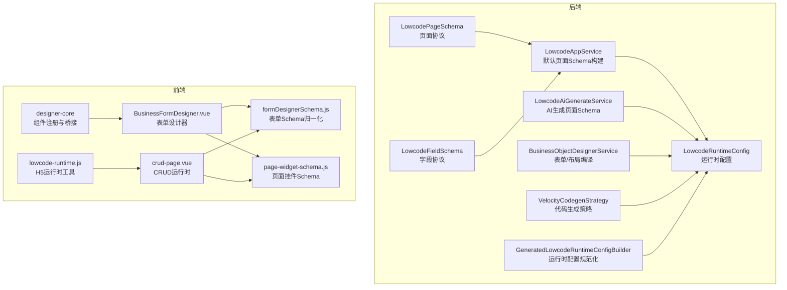
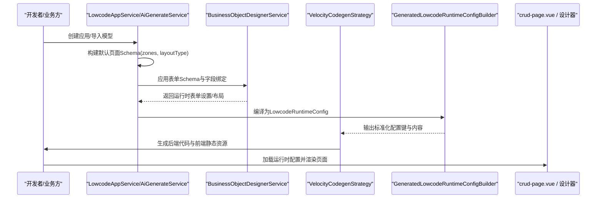
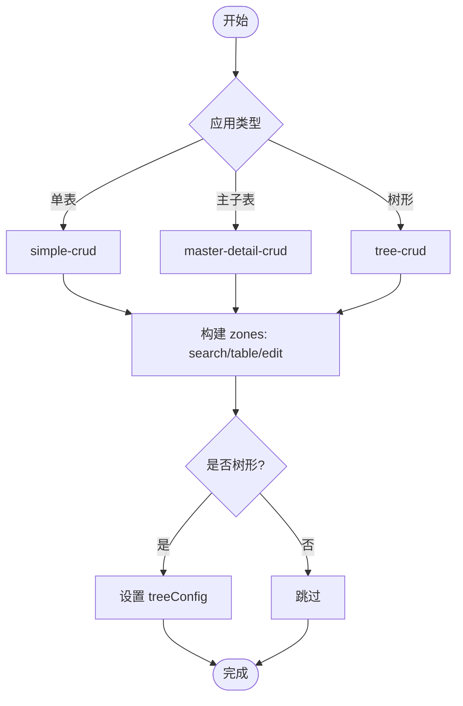
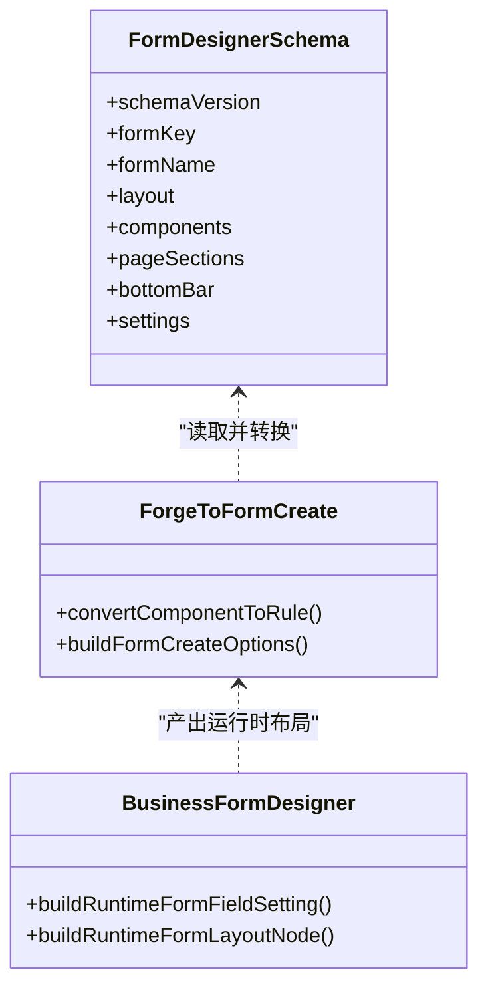
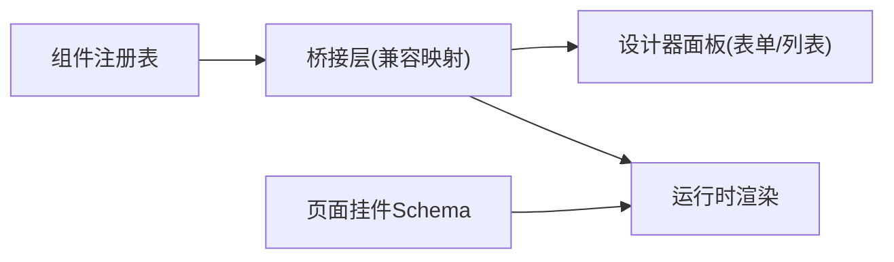
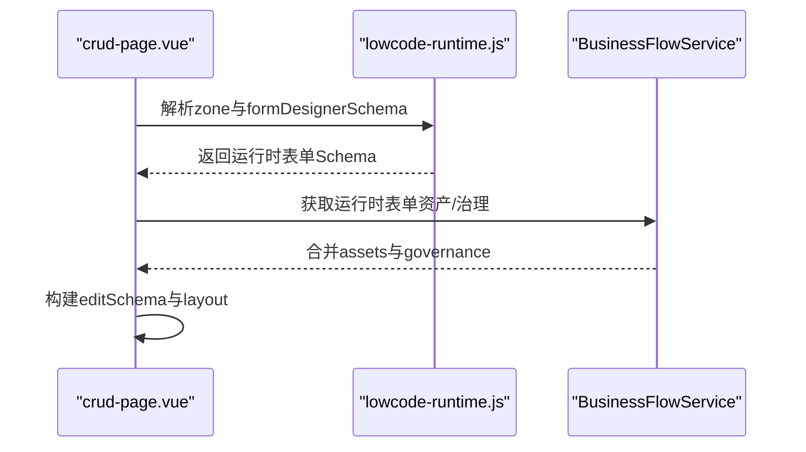
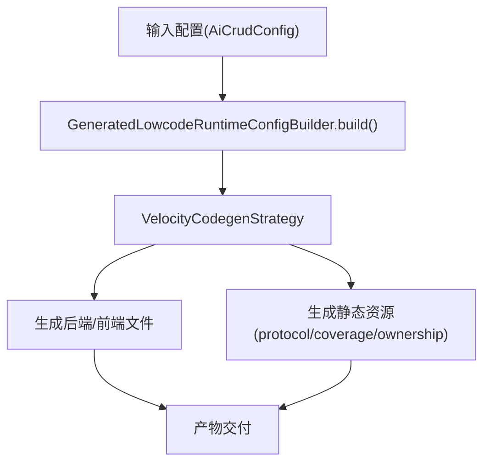
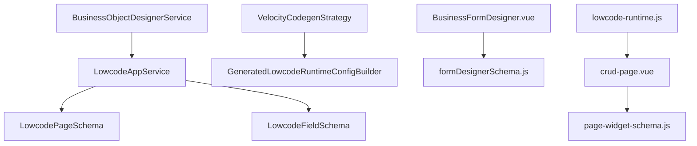

# 低代码API

<cite>
**本文引用的文件**
- [LowcodePageSchema.java](file://forge-server/forge-framework/forge-plugin-parent/forge-plugin-generator/src/main/java/com/mdframe/forge/plugin/generator/dto/lowcode/LowcodePageSchema.java)
- [LowcodeFieldSchema.java](file://forge-server/forge-framework/forge-plugin-parent/forge-plugin-generator/src/main/java/com/mdframe/forge/plugin/generator/dto/lowcode/LowcodeFieldSchema.java)
- [LowcodeRuntimeConfig.java](file://forge-server/forge-framework/forge-plugin-parent/forge-plugin-generator/src/main/java/com/mdframe/forge/plugin/generator/dto/lowcode/LowcodeRuntimeConfig.java)
- [LowcodeAppService.java](file://forge-server/forge-framework/forge-plugin-parent/forge-plugin-generator/src/main/java/com/mdframe/forge/plugin/generator/service/lowcode/LowcodeAppService.java)
- [LowcodeAiGenerateService.java](file://forge-server/forge-framework/forge-plugin-parent/forge-plugin-generator/src/main/java/com/mdframe/forge/plugin/generator/service/lowcode/LowcodeAiGenerateService.java)
- [GeneratedLowcodeRuntimeConfigBuilder.java](file://forge-server/forge-framework/forge-plugin-parent/forge-plugin-generator/src/main/java/com/mdframe/forge/plugin/generator/service/lowcode/GeneratedLowcodeRuntimeConfigBuilder.java)
- [VelocityCodegenStrategy.java](file://forge-server/forge-framework/forge-plugin-parent/forge-plugin-generator/src/main/java/com/mdframe/forge/plugin/generator/codegen/VelocityCodegenStrategy.java)
- [BusinessObjectDesignerService.java](file://forge-server/forge-framework/forge-plugin-parent/forge-plugin-generator/src/main/java/com/mdframe/forge/plugin/generator/service/businessapp/BusinessObjectDesignerService.java)
- [BusinessApplicationCodegenService.java](file://forge-server/forge-framework/forge-plugin-parent/forge-plugin-generator/src/main/java/com/mdframe/forge/plugin/generator/service/businessapp/BusinessApplicationCodegenService.java)
- [LowcodeCodegenService.java](file://forge-server/forge-framework/forge-plugin-parent/forge-plugin-generator/src/main/java/com/mdframe/forge/plugin/generator/service/lowcode/LowcodeCodegenService.java)
- [BusinessFlowService.java](file://forge-server/forge-framework/forge-plugin-parent/forge-plugin-generator/src/main/java/com/mdframe/forge/plugin/generator/service/businessapp/BusinessFlowService.java)
- [bridge.test.js](file://forge-admin-ui/src/components/lowcode-builder/designer-core/__tests__/bridge.test.js)
- [registry.test.js](file://forge-admin-ui/src/components/lowcode-builder/designer-core/__tests__/registry.test.js)
- [page-widget-schema.js](file://forge-admin-ui/src/components/lowcode-runtime/page-widget-schema.js)
- [formDesignerSchema.js](file://forge-admin-ui/src/views/app-center/components/designer/form-first/formDesignerSchema.js)
- [forgeToFormCreate.js](file://forge-admin-ui/src/views/app-center/components/designer/form-first/forgeToFormCreate.js)
- [BusinessFormDesigner.vue](file://forge-admin-ui/src/views/app-center/components/designer/BusinessFormDesigner.vue)
- [crud-page.vue](file://forge-admin-ui/src/views/ai/crud-page.vue)
- [lowcode-runtime.js](file://forge-h5-ui/src/utils/lowcode-runtime.js)
</cite>

## 目录
1. [简介](#简介)
2. [项目结构](#项目结构)
3. [核心组件](#核心组件)
4. [架构总览](#架构总览)
5. [详细组件分析](#详细组件分析)
6. [依赖关系分析](#依赖关系分析)
7. [性能考虑](#性能考虑)
8. [故障排查指南](#故障排查指南)
9. [结论](#结论)
10. [附录](#附录)

## 简介
本文件面向低代码平台的使用者与开发者，系统化阐述CRUD生成、页面模板、表单设计与组件管理等核心能力。文档围绕“元数据驱动、动态渲染、组件组合”三大机制展开，覆盖从后端模型与页面协议到前端运行时配置与渲染的完整链路，并提供代码生成、模板定制与运行期配置的实践建议与调优要点。

## 项目结构
本项目采用前后端分离与插件化架构：
- 后端（Java）提供低代码协议定义、页面与字段Schema构建、运行时配置编译与代码生成策略。
- 前端（Vue）提供设计器、组件注册表、运行时解析与渲染，以及多端（PC/H5）适配。

图表来源
- [LowcodePageSchema.java:1-45](file://forge-server/forge-framework/forge-plugin-parent/forge-plugin-generator/src/main/java/com/mdframe/forge/plugin/generator/dto/lowcode/LowcodePageSchema.java#L1-L45)
- [LowcodeFieldSchema.java:1-171](file://forge-server/forge-framework/forge-plugin-parent/forge-plugin-generator/src/main/java/com/mdframe/forge/plugin/generator/dto/lowcode/LowcodeFieldSchema.java#L1-L171)
- [LowcodeRuntimeConfig.java:1-39](file://forge-server/forge-framework/forge-plugin-parent/forge-plugin-generator/src/main/java/com/mdframe/forge/plugin/generator/dto/lowcode/LowcodeRuntimeConfig.java#L1-L39)
- [LowcodeAppService.java:162-183](file://forge-server/forge-framework/forge-plugin-parent/forge-plugin-generator/src/main/java/com/mdframe/forge/plugin/generator/service/lowcode/LowcodeAppService.java#L162-L183)
- [LowcodeAiGenerateService.java:990-1011](file://forge-server/forge-framework/forge-plugin-parent/forge-plugin-generator/src/main/java/com/mdframe/forge/plugin/generator/service/lowcode/LowcodeAiGenerateService.java#L990-L1011)
- [BusinessObjectDesignerService.java:2592-2617](file://forge-server/forge-framework/forge-plugin-parent/forge-plugin-generator/src/main/java/com/mdframe/forge/plugin/generator/service/businessapp/BusinessObjectDesignerService.java#L2592-L2617)
- [VelocityCodegenStrategy.java:77-92](file://forge-server/forge-framework/forge-plugin-parent/forge-plugin-generator/src/main/java/com/mdframe/forge/plugin/generator/codegen/VelocityCodegenStrategy.java#L77-L92)
- [GeneratedLowcodeRuntimeConfigBuilder.java:1-31](file://forge-server/forge-framework/forge-plugin-parent/forge-plugin-generator/src/main/java/com/mdframe/forge/plugin/generator/service/lowcode/GeneratedLowcodeRuntimeConfigBuilder.java#L1-L31)
- [bridge.test.js:1-385](file://forge-admin-ui/src/components/lowcode-builder/designer-core/__tests__/bridge.test.js#L1-L385)
- [formDesignerSchema.js:367-384](file://forge-admin-ui/src/views/app-center/components/designer/form-first/formDesignerSchema.js#L367-L384)
- [page-widget-schema.js:294-342](file://forge-admin-ui/src/components/lowcode-runtime/page-widget-schema.js#L294-L342)

章节来源
- [LowcodePageSchema.java:1-45](file://forge-server/forge-framework/forge-plugin-parent/forge-plugin-generator/src/main/java/com/mdframe/forge/plugin/generator/dto/lowcode/LowcodePageSchema.java#L1-L45)
- [LowcodeFieldSchema.java:1-171](file://forge-server/forge-framework/forge-plugin-parent/forge-plugin-generator/src/main/java/com/mdframe/forge/plugin/generator/dto/lowcode/LowcodeFieldSchema.java#L1-L171)
- [LowcodeRuntimeConfig.java:1-39](file://forge-server/forge-framework/forge-plugin-parent/forge-plugin-generator/src/main/java/com/mdframe/forge/plugin/generator/dto/lowcode/LowcodeRuntimeConfig.java#L1-L39)

## 核心组件
- 页面协议 LowcodePageSchema：描述页面布局类型、区域（zones）、主模型引用、选项与多页画布等。
- 字段协议 LowcodeFieldSchema：描述字段元信息、可见性、查询方式、组件类型、敏感字段、公式等。
- 运行时配置 LowcodeRuntimeConfig：将页面与字段协议编译为 AiCrudPage 可消费的 JSON 配置（搜索、列、编辑、API、字典、脱敏、加密、转换等）。
- 页面Schema构建服务：根据模型与应用类型自动生成 search/table/edit 区域与树形配置。
- 表单设计器与Schema归一化：统一表单Schema结构、校验规则、布局与组件映射。
- 组件注册与桥接：统一组件目录、分组、默认值与兼容映射，保障设计器与运行时一致性。
- 代码生成策略：基于运行时配置生成后端代码与前端静态资源，支持模板定制与扩展。

章节来源
- [LowcodePageSchema.java:1-45](file://forge-server/forge-framework/forge-plugin-parent/forge-plugin-generator/src/main/java/com/mdframe/forge/plugin/generator/dto/lowcode/LowcodePageSchema.java#L1-L45)
- [LowcodeFieldSchema.java:1-171](file://forge-server/forge-framework/forge-plugin-parent/forge-plugin-generator/src/main/java/com/mdframe/forge/plugin/generator/dto/lowcode/LowcodeFieldSchema.java#L1-L171)
- [LowcodeRuntimeConfig.java:1-39](file://forge-server/forge-framework/forge-plugin-parent/forge-plugin-generator/src/main/java/com/mdframe/forge/plugin/generator/dto/lowcode/LowcodeRuntimeConfig.java#L1-L39)
- [LowcodeAppService.java:162-183](file://forge-server/forge-framework/forge-plugin-parent/forge-plugin-generator/src/main/java/com/mdframe/forge/plugin/generator/service/lowcode/LowcodeAppService.java#L162-L183)
- [LowcodeAiGenerateService.java:990-1011](file://forge-server/forge-framework/forge-plugin-parent/forge-plugin-generator/src/main/java/com/mdframe/forge/plugin/generator/service/lowcode/LowcodeAiGenerateService.java#L990-L1011)
- [formDesignerSchema.js:367-384](file://forge-admin-ui/src/views/app-center/components/designer/form-first/formDesignerSchema.js#L367-L384)
- [bridge.test.js:1-385](file://forge-admin-ui/src/components/lowcode-builder/designer-core/__tests__/bridge.test.js#L1-L385)

## 架构总览
低代码平台以“协议+运行时”为核心：后端负责协议构建与代码生成，前端负责设计器与运行时渲染。关键流程如下：

图表来源
- [LowcodeAppService.java:162-183](file://forge-server/forge-framework/forge-plugin-parent/forge-plugin-generator/src/main/java/com/mdframe/forge/plugin/generator/service/lowcode/LowcodeAppService.java#L162-L183)
- [LowcodeAiGenerateService.java:990-1011](file://forge-server/forge-framework/forge-plugin-parent/forge-plugin-generator/src/main/java/com/mdframe/forge/plugin/generator/service/lowcode/LowcodeAiGenerateService.java#L990-L1011)
- [BusinessObjectDesignerService.java:2592-2617](file://forge-server/forge-framework/forge-plugin-parent/forge-plugin-generator/src/main/java/com/mdframe/forge/plugin/generator/service/businessapp/BusinessObjectDesignerService.java#L2592-L2617)
- [VelocityCodegenStrategy.java:77-92](file://forge-server/forge-framework/forge-plugin-parent/forge-plugin-generator/src/main/java/com/mdframe/forge/plugin/generator/codegen/VelocityCodegenStrategy.java#L77-L92)
- [GeneratedLowcodeRuntimeConfigBuilder.java:1-31](file://forge-server/forge-framework/forge-plugin-parent/forge-plugin-generator/src/main/java/com/mdframe/forge/plugin/generator/service/lowcode/GeneratedLowcodeRuntimeConfigBuilder.java#L1-L31)

## 详细组件分析

### CRUD生成与页面模板
- 页面布局类型：simple-crud、master-detail-crud、tree-crud 等，由应用类型决定。
- 区域（Zone）：search、table、edit 等，自动注入模型字段并按可见性过滤。
- 树形模式：自动配置 keyField、parentField、labelField、childrenField、loadMode 等。
- 多页画布：保存 list/detail/custom 等页面，避免详情页被默认布局覆盖。

图表来源
- [LowcodeAppService.java:162-183](file://forge-server/forge-framework/forge-plugin-parent/forge-plugin-generator/src/main/java/com/mdframe/forge/plugin/generator/service/lowcode/LowcodeAppService.java#L162-L183)
- [LowcodeAiGenerateService.java:990-1011](file://forge-server/forge-framework/forge-plugin-parent/forge-plugin-generator/src/main/java/com/mdframe/forge/plugin/generator/service/lowcode/LowcodeAiGenerateService.java#L990-L1011)

章节来源
- [LowcodePageSchema.java:1-45](file://forge-server/forge-framework/forge-plugin-parent/forge-plugin-generator/src/main/java/com/mdframe/forge/plugin/generator/dto/lowcode/LowcodePageSchema.java#L1-L45)
- [LowcodeAppService.java:162-183](file://forge-server/forge-framework/forge-plugin-parent/forge-plugin-generator/src/main/java/com/mdframe/forge/plugin/generator/service/lowcode/LowcodeAppService.java#L162-L183)
- [LowcodeAiGenerateService.java:990-1011](file://forge-server/forge-framework/forge-plugin-parent/forge-plugin-generator/src/main/java/com/mdframe/forge/plugin/generator/service/lowcode/LowcodeAiGenerateService.java#L990-L1011)

### 表单设计与Schema归一化
- 表单Schema版本化与归一化：统一 schemaVersion、formKey、layout、components、settings 等。
- 组件到规则转换：将设计器组件转换为 form-create 规则，处理默认值、校验、选项、子节点等。
- 运行时表单布局节点：将组件树转换为运行时布局节点（field/groupTitle/自定义节点），支持 span、align、style 等。
- 表单资产与多表单：支持 settings.formAssets 与 forms 多表单场景，运行时选择 active formKey。

图表来源
- [formDesignerSchema.js:367-384](file://forge-admin-ui/src/views/app-center/components/designer/form-first/formDesignerSchema.js#L367-L384)
- [forgeToFormCreate.js:1-69](file://forge-admin-ui/src/views/app-center/components/designer/form-first/forgeToFormCreate.js#L1-L69)
- [BusinessFormDesigner.vue:733-757](file://forge-admin-ui/src/views/app-center/components/designer/BusinessFormDesigner.vue#L733-L757)
- [BusinessFormDesigner.vue:812-834](file://forge-admin-ui/src/views/app-center/components/designer/BusinessFormDesigner.vue#L812-L834)

章节来源
- [formDesignerSchema.js:367-384](file://forge-admin-ui/src/views/app-center/components/designer/form-first/formDesignerSchema.js#L367-L384)
- [forgeToFormCreate.js:1-69](file://forge-admin-ui/src/views/app-center/components/designer/form-first/forgeToFormCreate.js#L1-L69)
- [BusinessFormDesigner.vue:733-757](file://forge-admin-ui/src/views/app-center/components/designer/BusinessFormDesigner.vue#L733-L757)
- [BusinessFormDesigner.vue:812-834](file://forge-admin-ui/src/views/app-center/components/designer/BusinessFormDesigner.vue#L812-L834)

### 组件管理与注册表
- 统一组件注册：F（表单）、L（列表）、F+L（通用）三类作用域，确保两侧设计器面板一致。
- 桥接层兼容：历史类型名与新类型名映射，保证存量消费方不受影响。
- 页面挂件：提供 rich-text、markdown、watermark、barcode、qrcode 等20类挂件，支持数据绑定与默认属性。
- 测试保障：通过单元测试验证组件数量、唯一性、目录结构与兼容性。

图表来源
- [bridge.test.js:1-385](file://forge-admin-ui/src/components/lowcode-builder/designer-core/__tests__/bridge.test.js#L1-L385)
- [registry.test.js:1-45](file://forge-admin-ui/src/components/lowcode-builder/designer-core/__tests__/registry.test.js#L1-L45)
- [page-widget-schema.js:294-342](file://forge-admin-ui/src/components/lowcode-runtime/page-widget-schema.js#L294-L342)

章节来源
- [bridge.test.js:1-385](file://forge-admin-ui/src/components/lowcode-builder/designer-core/__tests__/bridge.test.js#L1-L385)
- [registry.test.js:1-45](file://forge-admin-ui/src/components/lowcode-builder/designer-core/__tests/registry.test.js#L1-L45)
- [page-widget-schema.js:294-342](file://forge-admin-ui/src/components/lowcode-runtime/page-widget-schema.js#L294-L342)

### 运行时配置与动态渲染
- 运行时配置键：configKey、objectCode、tableName、layoutType、search/columns/edit schema、apiConfig、options、dict/desensitize/encrypt/trans 等。
- 前端运行时：crud-page 根据运行时配置构建表单 profile、布局与资产；H5 运行时提供 zone/schema 解析工具。
- 多表单与治理：支持多表单切换、治理策略（governance）应用到运行时表单。

图表来源
- [LowcodeRuntimeConfig.java:1-39](file://forge-server/forge-framework/forge-plugin-parent/forge-plugin-generator/src/main/java/com/mdframe/forge/plugin/generator/dto/lowcode/LowcodeRuntimeConfig.java#L1-L39)
- [crud-page.vue:679-700](file://forge-admin-ui/src/views/ai/crud-page.vue#L679-L700)
- [crud-page.vue:825-865](file://forge-admin-ui/src/views/ai/crud-page.vue#L825-L865)
- [lowcode-runtime.js:43-57](file://forge-h5-ui/src/utils/lowcode-runtime.js#L43-L57)
- [BusinessFlowService.java:5519-5527](file://forge-server/forge-framework/forge-plugin-parent/forge-plugin-generator/src/main/java/com/mdframe/forge/plugin/generator/service/businessapp/BusinessFlowService.java#L5519-L5527)

章节来源
- [LowcodeRuntimeConfig.java:1-39](file://forge-server/forge-framework/forge-plugin-parent/forge-plugin-generator/src/main/java/com/mdframe/forge/plugin/generator/dto/lowcode/LowcodeRuntimeConfig.java#L1-L39)
- [crud-page.vue:679-700](file://forge-admin-ui/src/views/ai/crud-page.vue#L679-L700)
- [crud-page.vue:825-865](file://forge-admin-ui/src/views/ai/crud-page.vue#L825-L865)
- [lowcode-runtime.js:43-57](file://forge-h5-ui/src/utils/lowcode-runtime.js#L43-L57)
- [BusinessFlowService.java:5519-5527](file://forge-server/forge-framework/forge-plugin-parent/forge-plugin-generator/src/main/java/com/mdframe/forge/plugin/generator/service/businessapp/BusinessFlowService.java#L5519-L5527)

### 代码生成与模板定制
- 代码生成入口：BusinessApplicationCodegenService 组装配置并调用 codegenService.generateFiles。
- 策略执行：VelocityCodegenStrategy 解析 apiBase、构造 GenTable、加载字段元数据，并生成后端代码与前端静态资源。
- 运行时配置规范化：GeneratedLowcodeRuntimeConfigBuilder 将任意入口配置标准化为独立、可重放的下载协议配置。
- 选项镜像：LowcodeCodegenService 将 codegen 选项镜像到 options，确保模板引擎可用。

图表来源
- [BusinessApplicationCodegenService.java:159-172](file://forge-server/forge-framework/forge-plugin-parent/forge-plugin-generator/src/main/java/com/mdframe/forge/plugin/generator/service/businessapp/BusinessApplicationCodegenService.java#L159-L172)
- [VelocityCodegenStrategy.java:77-92](file://forge-server/forge-framework/forge-plugin-parent/forge-plugin-generator/src/main/java/com/mdframe/forge/plugin/generator/codegen/VelocityCodegenStrategy.java#L77-L92)
- [GeneratedLowcodeRuntimeConfigBuilder.java:1-31](file://forge-server/forge-framework/forge-plugin-parent/forge-plugin-generator/src/main/java/com/mdframe/forge/plugin/generator/service/lowcode/GeneratedLowcodeRuntimeConfigBuilder.java#L1-L31)
- [LowcodeCodegenService.java:160-187](file://forge-server/forge-framework/forge-plugin-parent/forge-plugin-generator/src/main/java/com/mdframe/forge/plugin/generator/service/lowcode/LowcodeCodegenService.java#L160-L187)

章节来源
- [BusinessApplicationCodegenService.java:159-172](file://forge-server/forge-framework/forge-plugin-parent/forge-plugin-generator/src/main/java/com/mdframe/forge/plugin/generator/service/businessapp/BusinessApplicationCodegenService.java#L159-L172)
- [VelocityCodegenStrategy.java:77-92](file://forge-server/forge-framework/forge-plugin-parent/forge-plugin-generator/src/main/java/com/mdframe/forge/plugin/generator/codegen/VelocityCodegenStrategy.java#L77-L92)
- [GeneratedLowcodeRuntimeConfigBuilder.java:1-31](file://forge-server/forge-framework/forge-plugin-parent/forge-plugin-generator/src/main/java/com/mdframe/forge/plugin/generator/service/lowcode/GeneratedLowcodeRuntimeConfigBuilder.java#L1-L31)
- [LowcodeCodegenService.java:160-187](file://forge-server/forge-framework/forge-plugin-parent/forge-plugin-generator/src/main/java/com/mdframe/forge/plugin/generator/service/lowcode/LowcodeCodegenService.java#L160-L187)

## 依赖关系分析
- 后端模块耦合：
  - LowcodeAppService/LowcodeAiGenerateService 依赖 LowcodePageSchema/LowcodeFieldSchema 构建页面与字段。
  - BusinessObjectDesignerService 将表单Schema与字段绑定编译为运行时设置。
  - VelocityCodegenStrategy 依赖 GeneratedLowcodeRuntimeConfigBuilder 输出标准化配置。
- 前端模块耦合：
  - designer-core 提供组件注册与桥接，供设计器与运行时共享。
  - BusinessFormDesigner 与 crud-page 依赖 formDesignerSchema 与 page-widget-schema 进行Schema归一化与挂件处理。
  - H5 lowcode-runtime 提供跨端运行时解析工具。

图表来源
- [LowcodeAppService.java:162-183](file://forge-server/forge-framework/forge-plugin-parent/forge-plugin-generator/src/main/java/com/mdframe/forge/plugin/generator/service/lowcode/LowcodeAppService.java#L162-L183)
- [BusinessObjectDesignerService.java:2592-2617](file://forge-server/forge-framework/forge-plugin-parent/forge-plugin-generator/src/main/java/com/mdframe/forge/plugin/generator/service/businessapp/BusinessObjectDesignerService.java#L2592-L2617)
- [VelocityCodegenStrategy.java:77-92](file://forge-server/forge-framework/forge-plugin-parent/forge-plugin-generator/src/main/java/com/mdframe/forge/plugin/generator/codegen/VelocityCodegenStrategy.java#L77-L92)
- [GeneratedLowcodeRuntimeConfigBuilder.java:1-31](file://forge-server/forge-framework/forge-plugin-parent/forge-plugin-generator/src/main/java/com/mdframe/forge/plugin/generator/service/lowcode/GeneratedLowcodeRuntimeConfigBuilder.java#L1-L31)
- [formDesignerSchema.js:367-384](file://forge-admin-ui/src/views/app-center/components/designer/form-first/formDesignerSchema.js#L367-L384)
- [page-widget-schema.js:294-342](file://forge-admin-ui/src/components/lowcode-runtime/page-widget-schema.js#L294-L342)
- [lowcode-runtime.js:43-57](file://forge-h5-ui/src/utils/lowcode-runtime.js#L43-L57)

章节来源
- [LowcodeAppService.java:162-183](file://forge-server/forge-framework/forge-plugin-parent/forge-plugin-generator/src/main/java/com/mdframe/forge/plugin/generator/service/lowcode/LowcodeAppService.java#L162-L183)
- [BusinessObjectDesignerService.java:2592-2617](file://forge-server/forge-framework/forge-plugin-parent/forge-plugin-generator/src/main/java/com/mdframe/forge/plugin/generator/service/businessapp/BusinessObjectDesignerService.java#L2592-L2617)
- [VelocityCodegenStrategy.java:77-92](file://forge-server/forge-framework/forge-plugin-parent/forge-plugin-generator/src/main/java/com/mdframe/forge/plugin/generator/codegen/VelocityCodegenStrategy.java#L77-L92)
- [GeneratedLowcodeRuntimeConfigBuilder.java:1-31](file://forge-server/forge-framework/forge-plugin-parent/forge-plugin-generator/src/main/java/com/mdframe/forge/plugin/generator/service/lowcode/GeneratedLowcodeRuntimeConfigBuilder.java#L1-L31)
- [formDesignerSchema.js:367-384](file://forge-admin-ui/src/views/app-center/components/designer/form-first/formDesignerSchema.js#L367-L384)
- [page-widget-schema.js:294-342](file://forge-admin-ui/src/components/lowcode-runtime/page-widget-schema.js#L294-L342)
- [lowcode-runtime.js:43-57](file://forge-h5-ui/src/utils/lowcode-runtime.js#L43-L57)

## 性能考虑
- 运行时配置缓存：对生成的 LowcodeRuntimeConfig 进行缓存，减少重复编译与序列化开销。
- 组件懒加载：设计器与运行时按需加载组件与挂件，降低首屏体积。
- 表单Schema归一化优化：在批量转换时复用 Map/Set，避免重复遍历与对象创建。
- 代码生成增量：仅变更部分重新生成，减少全量编译与I/O。
- 列表与表格分页：合理设置 pageSize 与索引，避免大结果集一次性加载。

[本节为通用指导，不直接分析具体文件]

## 故障排查指南
- 组件类型不匹配：检查 bridge 层映射与 catalog 是否包含目标 componentKey，参考测试断言。
- 表单字段未生效：确认 fieldBinding.mode 与 fieldCode 正确，且字段未被系统字段或只读限制。
- 运行时布局异常：核对 buildRuntimeFormLayoutNode 的输出节点类型与 span/align 等属性。
- 代码生成失败：检查 apiBase 解析、GenTable 字段加载与 options 镜像是否正确。
- 多表单切换问题：确认 active formKey 与 forms 数组中的 formKey 一致，assets 已正确注入。

章节来源
- [bridge.test.js:1-385](file://forge-admin-ui/src/components/lowcode-builder/designer-core/__tests__/bridge.test.js#L1-L385)
- [BusinessObjectDesignerService.java:2231-2246](file://forge-server/forge-framework/forge-plugin-parent/forge-plugin-generator/src/main/java/com/mdframe/forge/plugin/generator/service/businessapp/BusinessObjectDesignerService.java#L2231-L2246)
- [BusinessFormDesigner.vue:812-834](file://forge-admin-ui/src/views/app-center/components/designer/BusinessFormDesigner.vue#L812-L834)
- [VelocityCodegenStrategy.java:77-92](file://forge-server/forge-framework/forge-plugin-parent/forge-plugin-generator/src/main/java/com/mdframe/forge/plugin/generator/codegen/VelocityCodegenStrategy.java#L77-L92)
- [crud-page.vue:679-700](file://forge-admin-ui/src/views/ai/crud-page.vue#L679-L700)

## 结论
本低代码平台通过标准化的页面与字段协议、统一的组件注册与桥接、以及强大的运行时配置与代码生成能力，实现了从模型到页面的端到端自动化。借助元数据驱动与动态渲染机制，开发者可以快速构建CRUD、表单与页面，并通过模板定制与运行时配置满足复杂业务需求。建议在开发中遵循组件契约、合理使用运行时配置与缓存策略，以获得更高的开发效率与运行性能。

## 附录
- 常用配置项说明：
  - 页面协议：layoutType、zones、pages、removedPageKeys、options。
  - 字段协议：field、label、dataType、componentType、queryType、dictType、sensitiveType、formulaConfig。
  - 运行时配置：searchSchema、columnsSchema、editSchema、apiConfig、options、dictConfig、desensitizeConfig、encryptConfig、transConfig。
- 最佳实践：
  - 在设计器中优先使用标准组件与挂件，避免自定义类型导致兼容性问题。
  - 表单校验与可见性规则尽量通过 Schema 声明式配置，便于维护与调试。
  - 代码生成前确保 ApiBase 与模块命名规范，避免路径冲突。
  - 发布后通过运行时配置快速调整展示与行为，减少热更新成本。

[本节为补充说明，不直接分析具体文件]