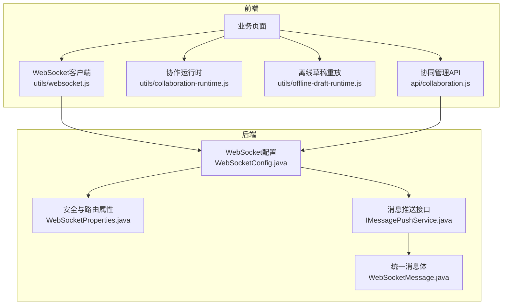
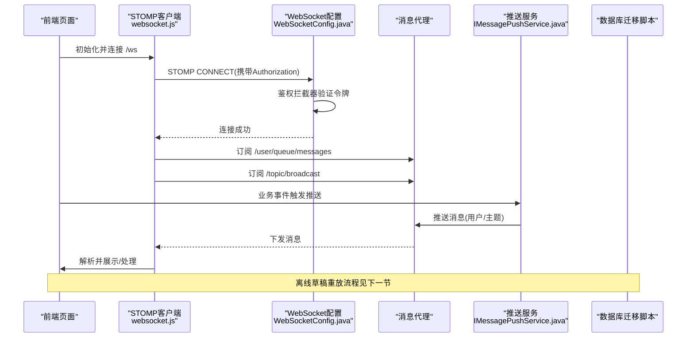
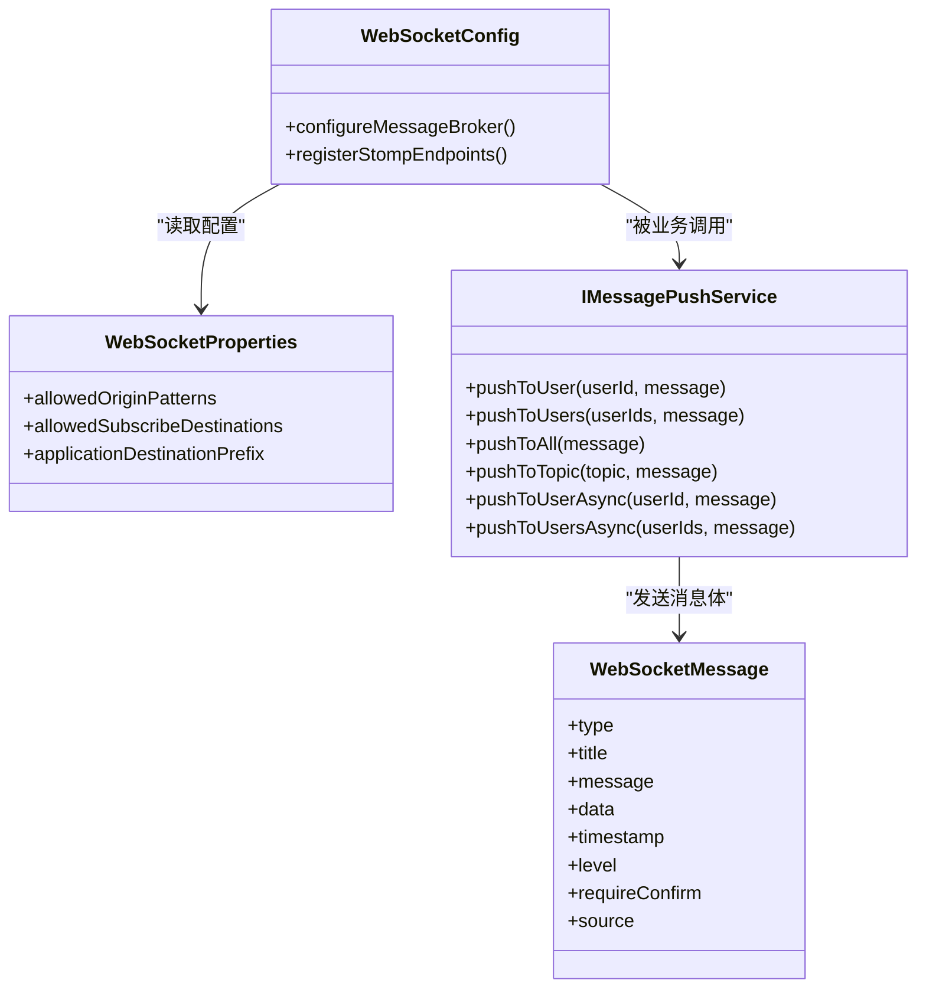
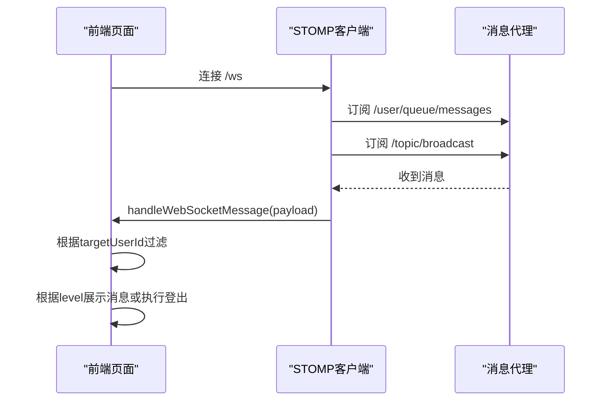
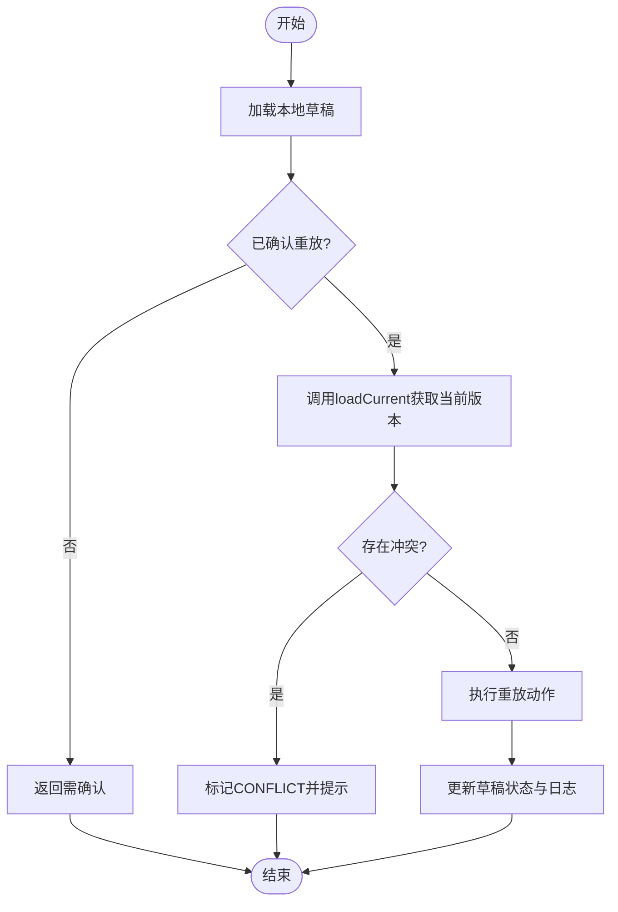
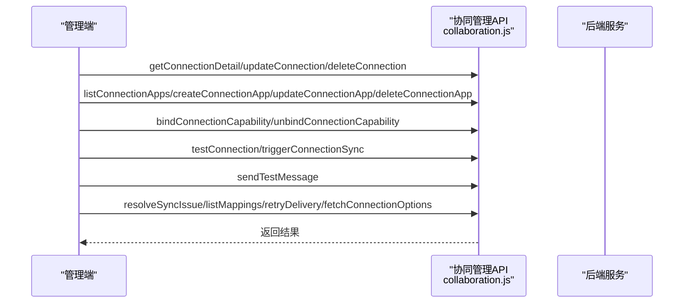
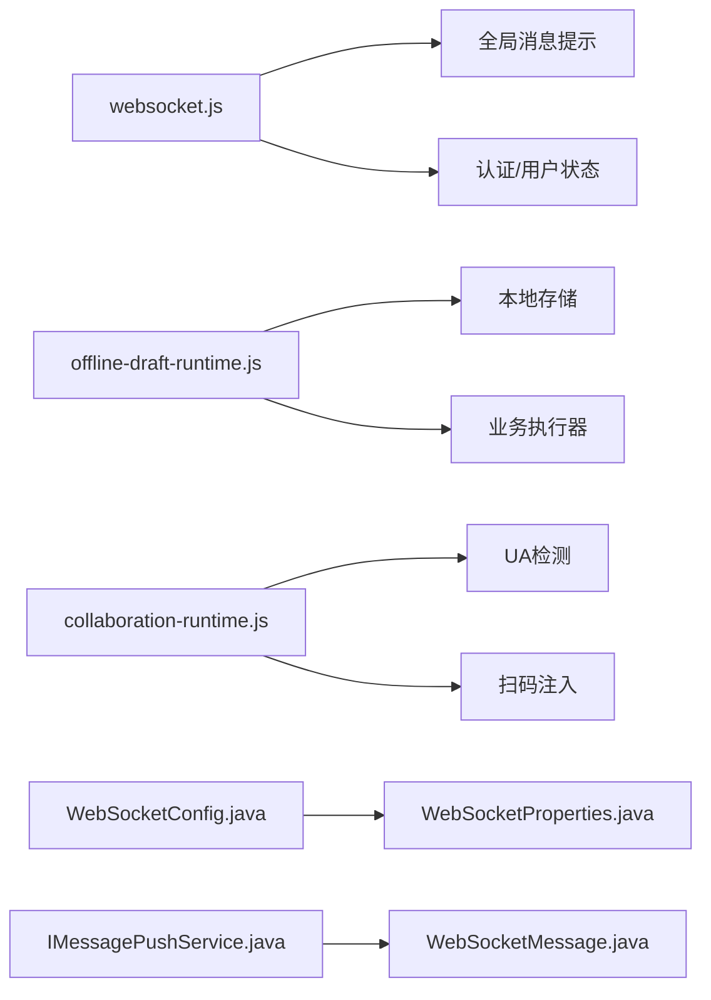

# 协作API

<cite>
**本文引用的文件**
- [WebSocketConfig.java](file://forge-server/forge-framework/forge-starter-parent/forge-starter-websocket/src/main/java/com/mdframe/forge/starter/websocket/config/WebSocketConfig.java)
- [WebSocketProperties.java](file://forge-server/forge-framework/forge-starter-parent/forge-starter-websocket/src/main/java/com/mdframe/forge/starter/websocket/security/WebSocketProperties.java)
- [IMessagePushService.java](file://forge-server/forge-framework/forge-starter-parent/forge-starter-websocket/src/main/java/com/mdframe/forge/starter/websocket/service/IMessagePushService.java)
- [WebSocketMessage.java](file://forge-server/forge-framework/forge-starter-parent/forge-starter-websocket/src/main/java/com/mdframe/forge/starter/websocket/domain/WebSocketMessage.java)
- [websocket.js](file://forge-admin-ui/src/utils/websocket.js)
- [collaboration-runtime.js](file://forge-admin-ui/src/utils/collaboration-runtime.js)
- [offline-draft-runtime.js](file://forge-admin-ui/src/utils/offline-draft-runtime.js)
- [collaboration.js](file://forge-admin-ui/src/api/collaboration.js)
- [V1.0.57__add_collaboration_connection_foundation.sql](file://forge-server/db/migration/V1.0.57__add_collaboration_connection_foundation.sql)
- [V1.0.58__extend_message_delivery_for_collaboration.sql](file://forge-server/db/migration/V1.0.58__extend_message_delivery_for_collaboration.sql)
- [V1.0.59__add_collaboration_resources_and_jobs.sql](file://forge-server/db/migration/V1.0.59__add_collaboration_resources_and_jobs.sql)
- [V1.0.60__add_collaboration_outbound_whitelist.sql](file://forge-server/db/migration/V1.0.60__add_collaboration_outbound_whitelist.sql)
- [V1.0.61__add_collaboration_message_test_resource.sql](file://forge-server/db/migration/V1.0.61__add_collaboration_message_test_resource.sql)
- [V1.0.62__add_collaboration_binding_api_resources.sql](file://forge-server/db/migration/V1.0.62__add_collaboration_binding_api_resources.sql)
- [V1.0.63__add_collaboration_api_base_url.sql](file://forge-server/db/migration/V1.0.63__add_collaboration_api_base_url.sql)
- [V1.0.71__collaboration_console_consolidation.sql](file://forge-server/db/migration/V1.0.71__collaboration_console_consolidation.sql)
- [V1.0.72__collaboration_sync_schedule_and_todo_card_template.sql](file://forge-server/db/migration/V1.0.72__collaboration_sync_schedule_and_todo_card_template.sql)
- [V1.0.73__collaboration_sso_workbench_and_message_platform.sql](file://forge-server/db/migration/V1.0.73__collaboration_sso_workbench_and_message_platform.sql)
</cite>

## 目录
1. [简介](#简介)
2. [项目结构](#项目结构)
3. [核心组件](#核心组件)
4. [架构总览](#架构总览)
5. [详细组件分析](#详细组件分析)
6. [依赖关系分析](#依赖关系分析)
7. [性能考虑](#性能考虑)
8. [故障排查指南](#故障排查指南)
9. [结论](#结论)
10. [附录](#附录)

## 简介
本文件面向“协作API”的开发者与集成方，系统性说明实时协作、消息通知、协同编辑与状态同步等能力。重点覆盖：
- WebSocket通信（STOMP over SockJS）的连接、鉴权、订阅与广播机制
- 多人协作中的冲突检测与解决策略
- 离线草稿保存与重放、数据一致性保障
- 企业协同连接、消息投递与运维查询接口
- 协作体验优化、性能调优与故障恢复最佳实践

## 项目结构
协作能力由前后端共同实现：
- 后端提供WebSocket基础能力（配置、鉴权、消息代理）、统一消息模型与推送服务接口
- 前端提供WebSocket客户端封装、消息处理、平台识别与扫码能力、离线草稿存储与重放、以及企业协同管理API调用

图表来源
- [WebSocketConfig.java:1-64](file://forge-server/forge-framework/forge-starter-parent/forge-starter-websocket/src/main/java/com/mdframe/forge/starter/websocket/config/WebSocketConfig.java#L1-L64)
- [WebSocketProperties.java:1-36](file://forge-server/forge-framework/forge-starter-parent/forge-starter-websocket/src/main/java/com/mdframe/forge/starter/websocket/security/WebSocketProperties.java#L1-L36)
- [IMessagePushService.java:1-67](file://forge-server/forge-framework/forge-starter-parent/forge-starter-websocket/src/main/java/com/mdframe/forge/starter/websocket/service/IMessagePushService.java#L1-L67)
- [WebSocketMessage.java:1-99](file://forge-server/forge-framework/forge-starter-parent/forge-starter-websocket/src/main/java/com/mdframe/forge/starter/websocket/domain/WebSocketMessage.java#L1-L99)
- [websocket.js:45-105](file://forge-admin-ui/src/utils/websocket.js#L45-L105)
- [collaboration-runtime.js:20-32](file://forge-admin-ui/src/utils/collaboration-runtime.js#L20-L32)
- [offline-draft-runtime.js:146-175](file://forge-admin-ui/src/utils/offline-draft-runtime.js#L146-L175)
- [collaboration.js:1-95](file://forge-admin-ui/src/api/collaboration.js#L1-L95)

章节来源
- [WebSocketConfig.java:1-64](file://forge-server/forge-framework/forge-starter-parent/forge-starter-websocket/src/main/java/com/mdframe/forge/starter/websocket/config/WebSocketConfig.java#L1-L64)
- [websocket.js:45-105](file://forge-admin-ui/src/utils/websocket.js#L45-L105)
- [collaboration.js:1-95](file://forge-admin-ui/src/api/collaboration.js#L1-L95)

## 核心组件
- WebSocket服务端配置与鉴权
  - 启用STOMP消息代理，支持点对点（/queue）与广播（/topic）
  - 注册端点 /ws，并兼容SockJS
  - 通过拦截器对CONNECT进行鉴权，绑定用户身份到会话
- 统一消息模型与推送服务
  - WebSocketMessage定义消息类型、级别、时间戳、数据载荷等
  - IMessagePushService提供按用户、多用户、广播、主题推送及异步推送能力
- 前端WebSocket客户端
  - 使用STOMP客户端建立连接，自动携带Authorization头
  - 订阅个人队列与广播主题，统一解析并分发消息
- 离线草稿与冲突检测
  - 本地持久化草稿，限制数量与大小
  - 重放前校验发布版本、Schema与记录版本，避免覆盖他人变更
- 企业协同管理API
  - 连接与应用管理、能力绑定、测试发送、同步触发、映射与投递重试等

章节来源
- [WebSocketConfig.java:33-61](file://forge-server/forge-framework/forge-starter-parent/forge-starter-websocket/src/main/java/com/mdframe/forge/starter/websocket/config/WebSocketConfig.java#L33-L61)
- [WebSocketMessage.java:18-58](file://forge-server/forge-framework/forge-starter-parent/forge-starter-websocket/src/main/java/com/mdframe/forge/starter/websocket/domain/WebSocketMessage.java#L18-L58)
- [IMessagePushService.java:12-66](file://forge-server/forge-framework/forge-starter-parent/forge-starter-websocket/src/main/java/com/mdframe/forge/starter/websocket/service/IMessagePushService.java#L12-L66)
- [websocket.js:45-105](file://forge-admin-ui/src/utils/websocket.js#L45-L105)
- [offline-draft-runtime.js:146-175](file://forge-admin-ui/src/utils/offline-draft-runtime.js#L146-L175)
- [collaboration.js:10-95](file://forge-admin-ui/src/api/collaboration.js#L10-L95)

## 架构总览
协作系统采用“前端STOMP客户端 + 后端STOMP代理 + 统一消息模型 + 离线草稿重放”的组合：
- 前端通过STOMP连接至/ws，订阅/user/**与/topic/broadcast
- 后端通过SimpleBroker转发消息，结合鉴权拦截器保证安全
- 业务侧通过IMessagePushService向指定用户或主题推送消息
- 表单/列表在断网时落盘草稿，联网后先检测冲突再重放执行

图表来源
- [WebSocketConfig.java:33-61](file://forge-server/forge-framework/forge-starter-parent/forge-starter-websocket/src/main/java/com/mdframe/forge/starter/websocket/config/WebSocketConfig.java#L33-L61)
- [websocket.js:45-105](file://forge-admin-ui/src/utils/websocket.js#L45-L105)
- [IMessagePushService.java:12-66](file://forge-server/forge-framework/forge-starter-parent/forge-starter-websocket/src/main/java/com/mdframe/forge/starter/websocket/service/IMessagePushService.java#L12-L66)

## 详细组件分析

### WebSocket通信与消息推送
- 连接与鉴权
  - 端点：/ws（支持SockJS回退）
  - 鉴权：CONNECT阶段通过Authorization头进行认证，成功后将用户绑定为Principal
  - 跨域：允许域名模式可配置
- 订阅与广播
  - 个人队列：/user/queue/messages
  - 广播主题：/topic/broadcast
  - 应用消息目的地前缀：/app（默认）
- 推送接口
  - 单用户、多用户、广播、主题推送
  - 同步与异步两种模式，便于高并发场景削峰

图表来源
- [WebSocketConfig.java:33-61](file://forge-server/forge-framework/forge-starter-parent/forge-starter-websocket/src/main/java/com/mdframe/forge/starter/websocket/config/WebSocketConfig.java#L33-L61)
- [WebSocketProperties.java:14-36](file://forge-server/forge-framework/forge-starter-parent/forge-starter-websocket/src/main/java/com/mdframe/forge/starter/websocket/security/WebSocketProperties.java#L14-L36)
- [IMessagePushService.java:12-66](file://forge-server/forge-framework/forge-starter-parent/forge-starter-websocket/src/main/java/com/mdframe/forge/starter/websocket/service/IMessagePushService.java#L12-L66)
- [WebSocketMessage.java:18-58](file://forge-server/forge-framework/forge-starter-parent/forge-starter-websocket/src/main/java/com/mdframe/forge/starter/websocket/domain/WebSocketMessage.java#L18-L58)

章节来源
- [WebSocketConfig.java:33-61](file://forge-server/forge-framework/forge-starter-parent/forge-starter-websocket/src/main/java/com/mdframe/forge/starter/websocket/config/WebSocketConfig.java#L33-L61)
- [WebSocketProperties.java:14-36](file://forge-server/forge-framework/forge-starter-parent/forge-starter-websocket/src/main/java/com/mdframe/forge/starter/websocket/security/WebSocketProperties.java#L14-L36)
- [IMessagePushService.java:12-66](file://forge-server/forge-framework/forge-starter-parent/forge-starter-websocket/src/main/java/com/mdframe/forge/starter/websocket/service/IMessagePushService.java#L12-L66)
- [websocket.js:45-105](file://forge-admin-ui/src/utils/websocket.js#L45-L105)

### 消息通知与前端处理
- 前端连接与订阅
  - 使用STOMP客户端连接/ws，自动附加Authorization
  - 订阅/user/queue/messages与/topic/broadcast
- 消息分发与展示
  - 解析消息体，根据目标userId过滤
  - 根据level调用全局消息提示
  - 特殊类型如auth.kickout/auth.replaced/auth.banned触发登出与跳转

图表来源
- [websocket.js:45-105](file://forge-admin-ui/src/utils/websocket.js#L45-L105)
- [websocket.js:107-163](file://forge-admin-ui/src/utils/websocket.js#L107-L163)

章节来源
- [websocket.js:45-105](file://forge-admin-ui/src/utils/websocket.js#L45-L105)
- [websocket.js:107-163](file://forge-admin-ui/src/utils/websocket.js#L107-L163)

### 协同编辑与离线草稿重放
- 草稿存储与限制
  - 本地存储草稿，限制最大数量与字节数
  - 命名空间隔离租户、用户、应用、对象、表单
- 重放流程
  - 网络恢复后，先loadCurrent获取当前版本信息
  - detectDraftConflict检查发布版本、Schema与记录版本是否一致
  - 若冲突则标记CONFLICT并提示；否则进入确认重放
  - 重放执行后更新草稿状态与日志
- 敏感字段清洗
  - 持久化前剔除敏感键，避免泄露

图表来源
- [offline-draft-runtime.js:146-175](file://forge-admin-ui/src/utils/offline-draft-runtime.js#L146-L175)
- [offline-draft-runtime.js:217-237](file://forge-admin-ui/src/utils/offline-draft-runtime.js#L217-L237)
- [offline-draft-runtime.js:239-263](file://forge-admin-ui/src/utils/offline-draft-runtime.js#L239-L263)
- [offline-draft-runtime.js:315-330](file://forge-admin-ui/src/utils/offline-draft-runtime.js#L315-L330)

章节来源
- [offline-draft-runtime.js:146-175](file://forge-admin-ui/src/utils/offline-draft-runtime.js#L146-L175)
- [offline-draft-runtime.js:217-237](file://forge-admin-ui/src/utils/offline-draft-runtime.js#L217-L237)
- [offline-draft-runtime.js:239-263](file://forge-admin-ui/src/utils/offline-draft-runtime.js#L239-L263)
- [offline-draft-runtime.js:315-330](file://forge-admin-ui/src/utils/offline-draft-runtime.js#L315-L330)

### 企业协同管理与消息投递
- 连接与应用管理
  - 获取连接详情、更新/删除连接
  - 列出/创建/更新/删除连接下的应用
- 能力绑定与测试
  - 绑定/解绑能力
  - 测试连接连通性
- 同步与消息
  - 触发连接同步
  - 发送测试消息（限接收人数）
- 运维查询
  - 解决同步问题、查看映射、重试投递、加载连接选项

图表来源
- [collaboration.js:10-95](file://forge-admin-ui/src/api/collaboration.js#L10-L95)

章节来源
- [collaboration.js:10-95](file://forge-admin-ui/src/api/collaboration.js#L10-L95)

### 平台识别与扫码能力
- 平台检测
  - 基于UA识别企业微信、钉钉、飞书、H5与浏览器环境
- 扫码封装
  - 统一入口scan，支持超时、取消信号、平台差异适配
  - 标准化结果与错误码，便于上层统一处理

章节来源
- [collaboration-runtime.js:20-32](file://forge-admin-ui/src/utils/collaboration-runtime.js#L20-L32)
- [collaboration-runtime.js:75-129](file://forge-admin-ui/src/utils/collaboration-runtime.js#L75-L129)
- [collaboration-runtime.js:135-158](file://forge-admin-ui/src/utils/collaboration-runtime.js#L135-L158)
- [collaboration-runtime.js:160-191](file://forge-admin-ui/src/utils/collaboration-runtime.js#L160-L191)
- [collaboration-runtime.js:193-245](file://forge-admin-ui/src/utils/collaboration-runtime.js#L193-L245)

## 依赖关系分析
- 前端依赖
  - websocket.js依赖全局消息提示与用户/认证状态
  - offline-draft-runtime.js依赖本地存储与业务提供的loadCurrent/execute回调
  - collaboration-runtime.js依赖平台UA与可选的全局注入扫描器
- 后端依赖
  - WebSocketConfig依赖WebSocketProperties与安全拦截器
  - 推送服务依赖统一消息体WebSocketMessage
- 数据层
  - 协同相关数据库迁移脚本提供连接、资源、任务、白名单、消息投递等基础表与索引

图表来源
- [websocket.js:45-105](file://forge-admin-ui/src/utils/websocket.js#L45-L105)
- [offline-draft-runtime.js:217-237](file://forge-admin-ui/src/utils/offline-draft-runtime.js#L217-L237)
- [collaboration-runtime.js:20-32](file://forge-admin-ui/src/utils/collaboration-runtime.js#L20-L32)
- [WebSocketConfig.java:33-61](file://forge-server/forge-framework/forge-starter-parent/forge-starter-websocket/src/main/java/com/mdframe/forge/starter/websocket/config/WebSocketConfig.java#L33-L61)
- [WebSocketProperties.java:14-36](file://forge-server/forge-framework/forge-starter-parent/forge-starter-websocket/src/main/java/com/mdframe/forge/starter/websocket/security/WebSocketProperties.java#L14-L36)
- [IMessagePushService.java:12-66](file://forge-server/forge-framework/forge-starter-parent/forge-starter-websocket/src/main/java/com/mdframe/forge/starter/websocket/service/IMessagePushService.java#L12-L66)
- [WebSocketMessage.java:18-58](file://forge-server/forge-framework/forge-starter-parent/forge-starter-websocket/src/main/java/com/mdframe/forge/starter/websocket/domain/WebSocketMessage.java#L18-L58)

章节来源
- [websocket.js:45-105](file://forge-admin-ui/src/utils/websocket.js#L45-L105)
- [offline-draft-runtime.js:217-237](file://forge-admin-ui/src/utils/offline-draft-runtime.js#L217-L237)
- [collaboration-runtime.js:20-32](file://forge-admin-ui/src/utils/collaboration-runtime.js#L20-L32)
- [WebSocketConfig.java:33-61](file://forge-server/forge-framework/forge-starter-parent/forge-starter-websocket/src/main/java/com/mdframe/forge/starter/websocket/config/WebSocketConfig.java#L33-L61)
- [WebSocketProperties.java:14-36](file://forge-server/forge-framework/forge-starter-parent/forge-starter-websocket/src/main/java/com/mdframe/forge/starter/websocket/security/WebSocketProperties.java#L14-L36)
- [IMessagePushService.java:12-66](file://forge-server/forge-framework/forge-starter-parent/forge-starter-websocket/src/main/java/com/mdframe/forge/starter/websocket/service/IMessagePushService.java#L12-L66)
- [WebSocketMessage.java:18-58](file://forge-server/forge-framework/forge-starter-parent/forge-starter-websocket/src/main/java/com/mdframe/forge/starter/websocket/domain/WebSocketMessage.java#L18-L58)

## 性能考虑
- 连接与会话
  - 合理设置心跳与重连间隔，减少无效连接
  - 控制订阅范围，仅订阅必要主题与队列
- 消息推送
  - 批量推送优先使用多用户接口，降低重复开销
  - 高频场景使用异步推送，避免阻塞主流程
- 离线草稿
  - 限制草稿数量与大小，避免存储膨胀
  - 重放前做轻量级冲突检测，减少无效执行
- 数据库与迁移
  - 协同相关表结构与索引由迁移脚本维护，确保查询与投递性能

[本节为通用指导，不直接分析具体文件]

## 故障排查指南
- 连接失败
  - 检查/ws端点可达性与跨域配置
  - 确认Authorization头格式正确且令牌有效
- 消息未送达
  - 核对订阅路径是否正确（/user/queue/messages、/topic/broadcast）
  - 检查目标用户是否在线、是否匹配userId过滤
- 认证异常
  - 鉴权拦截器拒绝无Bearer令牌或无效令牌
- 离线重放失败
  - 检查loadCurrent是否能正常获取当前版本
  - 关注冲突类型（发布版本、Schema、记录版本），按提示重新加载或合并
- 协同管理API异常
  - 使用测试发送接口定位投递链路问题
  - 通过重试投递与映射查询定位失败原因

章节来源
- [WebSocketConfig.java:47-61](file://forge-server/forge-framework/forge-starter-parent/forge-starter-websocket/src/main/java/com/mdframe/forge/starter/websocket/config/WebSocketConfig.java#L47-L61)
- [websocket.js:45-105](file://forge-admin-ui/src/utils/websocket.js#L45-L105)
- [websocket.js:107-163](file://forge-admin-ui/src/utils/websocket.js#L107-L163)
- [offline-draft-runtime.js:146-175](file://forge-admin-ui/src/utils/offline-draft-runtime.js#L146-L175)
- [collaboration.js:58-79](file://forge-admin-ui/src/api/collaboration.js#L58-L79)

## 结论
本协作API以STOMP+SockJS为基础，提供安全的WebSocket通信、统一的消息模型与灵活的推送能力；结合前端离线草稿与冲突检测，实现了可靠的多人协同编辑与状态同步。配合企业协同管理API，可满足连接、能力绑定、消息投递与运维监控等完整场景。建议在生产环境中严格配置跨域与订阅白名单，合理使用异步推送与批量接口，并通过迁移脚本与监控手段保障稳定性与可观测性。

## 附录
- 数据库迁移清单（协同相关）
  - V1.0.57__add_collaboration_connection_foundation.sql
  - V1.0.58__extend_message_delivery_for_collaboration.sql
  - V1.0.59__add_collaboration_resources_and_jobs.sql
  - V1.0.60__add_collaboration_outbound_whitelist.sql
  - V1.0.61__add_collaboration_message_test_resource.sql
  - V1.0.62__add_collaboration_binding_api_resources.sql
  - V1.0.63__add_collaboration_api_base_url.sql
  - V1.0.71__collaboration_console_consolidation.sql
  - V1.0.72__collaboration_sync_schedule_and_todo_card_template.sql
  - V1.0.73__collaboration_sso_workbench_and_message_platform.sql

章节来源
- [V1.0.57__add_collaboration_connection_foundation.sql](file://forge-server/db/migration/V1.0.57__add_collaboration_connection_foundation.sql)
- [V1.0.58__extend_message_delivery_for_collaboration.sql](file://forge-server/db/migration/V1.0.58__extend_message_delivery_for_collaboration.sql)
- [V1.0.59__add_collaboration_resources_and_jobs.sql](file://forge-server/db/migration/V1.0.59__add_collaboration_resources_and_jobs.sql)
- [V1.0.60__add_collaboration_outbound_whitelist.sql](file://forge-server/db/migration/V1.0.60__add_collaboration_outbound_whitelist.sql)
- [V1.0.61__add_collaboration_message_test_resource.sql](file://forge-server/db/migration/V1.0.61__add_collaboration_message_test_resource.sql)
- [V1.0.62__add_collaboration_binding_api_resources.sql](file://forge-server/db/migration/V1.0.62__add_collaboration_binding_api_resources.sql)
- [V1.0.63__add_collaboration_api_base_url.sql](file://forge-server/db/migration/V1.0.63__add_collaboration_api_base_url.sql)
- [V1.0.71__collaboration_console_consolidation.sql](file://forge-server/db/migration/V1.0.71__collaboration_console_consolidation.sql)
- [V1.0.72__collaboration_sync_schedule_and_todo_card_template.sql](file://forge-server/db/migration/V1.0.72__collaboration_sync_schedule_and_todo_card_template.sql)
- [V1.0.73__collaboration_sso_workbench_and_message_platform.sql](file://forge-server/db/migration/V1.0.73__collaboration_sso_workbench_and_message_platform.sql)